[TOC]

---


# 项目地址

[点击进入](https://github.com/maomao124/sms-backend)

[学习笔记地址](https://github.com/maomao124/sms_study_notes)


# 项目概述

## 背景介绍

随着企业业务扩张、应用成倍的增加、短信规模化使用，传统短信平台的接入方式和单一的信息发送功能，已经不能完全满足现代企业管理的需求，所以统一入口、减少对接成本、同时兼顾多种短信业务、简单易行的操作与维护、高稳定、高可靠的移动信息化应用成为短信平台发展趋势。  


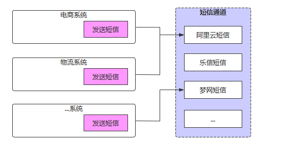


- 服务越来越多，每个服务都有可能发送短信，是否每个服务都需要对接一遍？
- 多应用对接短信，如何做到短信发送服务高效、稳定？
- 短信通道出现异常时，如何快速切换通道？
- 切换通道时，如何做到应用服务无感知？
- 如何统计各服务短信发送情况，以便进行后续营销分析？


本项目的核心在于保证短信高效、准确的送达、简单易操作的对接方式。通过对服务的解耦、通讯方式的升级来提升系统的吞吐量。同时在多通道的加持下，通过智能动态的通道评级、选举、降级、热插拔，增强了系统的健壮性，摆脱对单一通道的依赖。并且提供多种对接方式，满足企业内部的各种需求。


## 整体架构

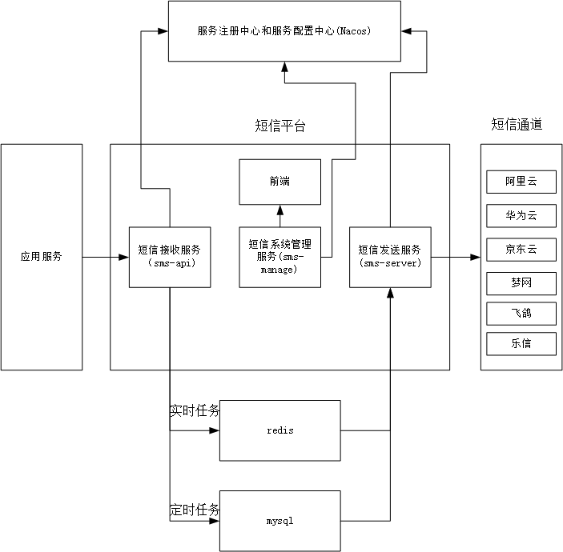


## 业务架构


## 项目模块介绍

项目整体工程结构和模块功能如下：

```sh
sms-backend                      # 聚合工程，用于聚合parent、apps、tools等模块
  ├── parent				     # 父工程，nacos配置及依赖包管理
  ├── apps					     # 应用目录
  	   ├── auth				     # 权限服务父工程
  		   ├── auth-entity       # 权限实体
  		   ├── auth-server       # 权限服务
  	   ├── gateway			     # 网关服务
  	   ├── sms            	     # 短信平台父工程
  	        ├──sms-entity		 # 短信平台实体
  	        ├──sms-dao           # 短信平台的数据持久化模块，主要包括mybatis plus的mapper文件和mapper接口
  	        ├──sms-manage		 # 系统管理服务
  	        ├──sms-api			 # 短信接收服务，应用系统调用接口、发送短信
  	        ├──sms-server		 # 短信发送服务，调用短信通道、发送短信
  	        └──sms-sdk			 # 短信SDK，应用系统引入、发送短信
  └── tools				         # 工具工程
  	   ├── tools-common		     # 基础组件：基础配置类、函数、常量、统一异常处理、undertow服务器
  	   ├── tools-core		     # 核心组件：基础实体、返回对象、上下文、异常处理、分布式锁、函数、树
  	   ├── tools-databases	     # 数据源组件：数据源配置、数据权限、查询条件等
  	   ├── tools-dozer		     # 对象转换：dozer配置、工具
  	   ├── tools-redis-cache    # redis分布式缓存工具类和分布式锁服务，缓存工具类解决著名的3个缓存问题
  	   ├── tools-j2cache	     # 缓存组件：j2cache、redis缓存
  	   ├── tools-jwt             # JWT组件：配置、属性、工具
  	   ├── tools-log	         # 日志组件：日志实体、事件、拦截器、工具
  	   ├── tools-swagger2	     # 文档组件：knife4j文档
  	   ├── tools-user            # 用户上下文：用户注解、模型和工具，当前登录用户信息注入模块
   	   ├── tools-validator	     # 表单验证： 后台表单规则验证
  	   ├── tools-xss		     # xss防注入组件
```


集信达短信服务有三个：后台管理服务，短信接收服务，短信发送服务：

|    应用    | 端口 |     说明     |
| :--------: | :--: | :----------: |
| sms-manage | 8770 | 后台管理服务 |
|  sms-api   | 8771 | 短信接收服务 |
| sms-server | 8772 | 短信发送服务 |


# 项目环境准备

## 数据库

```sql
SET NAMES utf8mb4;
SET FOREIGN_KEY_CHECKS = 0;

-- ----------------------------
-- Table structure for black_list
-- ----------------------------
DROP TABLE IF EXISTS `black_list`;
CREATE TABLE `black_list`
(
    `id`          varchar(64) CHARACTER SET utf8mb4 COLLATE utf8mb4_bin  NOT NULL COMMENT '主键',
    `type`        varchar(10) CHARACTER SET utf8mb4 COLLATE utf8mb4_bin  NOT NULL COMMENT '类型：1：短信、2：邮件、3：微信',
    `content`     varchar(64) CHARACTER SET utf8mb4 COLLATE utf8mb4_bin  NOT NULL COMMENT '内容：手机号',
    `remark`      varchar(200) CHARACTER SET utf8mb4 COLLATE utf8mb4_bin NULL     DEFAULT NULL COMMENT '备注',
    `create_time` datetime(0)                                            NOT NULL DEFAULT CURRENT_TIMESTAMP COMMENT '创建时间',
    `create_user` varchar(64) CHARACTER SET utf8mb4 COLLATE utf8mb4_bin  NOT NULL COMMENT '创建人',
    `update_time` datetime(0)                                            NOT NULL DEFAULT CURRENT_TIMESTAMP ON UPDATE CURRENT_TIMESTAMP(0) COMMENT '修改时间',
    `update_user` varchar(64) CHARACTER SET utf8mb4 COLLATE utf8mb4_bin  NULL     DEFAULT NULL COMMENT '修改人',
    `is_delete`   tinyint(0)                                             NOT NULL DEFAULT 1 COMMENT '逻辑删除：0删除',
    PRIMARY KEY (`id`) USING BTREE,
    UNIQUE INDEX `black_list_content_type` (`type`, `content`) USING BTREE
) ENGINE = InnoDB
  CHARACTER SET = utf8mb4
  COLLATE = utf8mb4_bin COMMENT = '黑名单'
  ROW_FORMAT = Dynamic;

-- ----------------------------
-- Table structure for config
-- ----------------------------
DROP TABLE IF EXISTS `config`;
CREATE TABLE `config`
(
    `id`                varchar(64) CHARACTER SET utf8mb4 COLLATE utf8mb4_bin  NOT NULL COMMENT '主键',
    `name`              varchar(100) CHARACTER SET utf8mb4 COLLATE utf8mb4_bin NOT NULL COMMENT '名称',
    `platform`          varchar(20) CHARACTER SET utf8mb4 COLLATE utf8mb4_bin  NOT NULL COMMENT '平台',
    `domain`            varchar(100) CHARACTER SET utf8mb4 COLLATE utf8mb4_bin NOT NULL COMMENT '域名',
    `access_key_id`     varchar(100) CHARACTER SET utf8mb4 COLLATE utf8mb4_bin NULL     DEFAULT NULL,
    `access_key_secret` varchar(100) CHARACTER SET utf8mb4 COLLATE utf8mb4_bin NULL     DEFAULT NULL,
    `other`             json                                                   NULL COMMENT '其他配置 json格式',
    `is_active`         tinyint(0)                                             NOT NULL COMMENT '是否可用：0不可用',
    `is_enable`         tinyint(0)                                             NOT NULL COMMENT '是否正常：0不正常',
    `remark`            varchar(500) CHARACTER SET utf8mb4 COLLATE utf8mb4_bin NULL     DEFAULT NULL COMMENT '备注',
    `level`             tinyint(0)                                             NULL     DEFAULT NULL COMMENT '级别',
    `channel_type`      tinyint(0)                                             NOT NULL COMMENT '通道类型，1：文字，2：语音，3：推送',
    `create_time`       datetime(0)                                            NOT NULL DEFAULT CURRENT_TIMESTAMP COMMENT '创建时间',
    `create_user`       varchar(64) CHARACTER SET utf8mb4 COLLATE utf8mb4_bin  NOT NULL COMMENT '创建人',
    `update_time`       datetime(0)                                            NOT NULL DEFAULT CURRENT_TIMESTAMP ON UPDATE CURRENT_TIMESTAMP(0) COMMENT '修改时间',
    `update_user`       varchar(64) CHARACTER SET utf8mb4 COLLATE utf8mb4_bin  NULL     DEFAULT NULL COMMENT '修改人',
    `is_delete`         tinyint(0)                                             NOT NULL DEFAULT 1 COMMENT '逻辑删除：0删除',
    PRIMARY KEY (`id`) USING BTREE,
    UNIQUE INDEX `config_name` (`name`) USING BTREE
) ENGINE = InnoDB
  CHARACTER SET = utf8mb4
  COLLATE = utf8mb4_bin COMMENT = '配置表'
  ROW_FORMAT = Dynamic;

-- ----------------------------
-- Table structure for config_signature
-- ----------------------------
DROP TABLE IF EXISTS `config_signature`;
CREATE TABLE `config_signature`
(
    `id`                    varchar(64) CHARACTER SET utf8mb4 COLLATE utf8mb4_bin  NOT NULL COMMENT '主键',
    `config_id`             varchar(64) CHARACTER SET utf8mb4 COLLATE utf8mb4_bin  NOT NULL COMMENT '配置主键',
    `signature_id`          varchar(64) CHARACTER SET utf8mb4 COLLATE utf8mb4_bin  NOT NULL COMMENT '签名主键',
    `config_signature_code` varchar(64) CHARACTER SET utf8mb4 COLLATE utf8mb4_bin  NULL     DEFAULT NULL COMMENT '通道签名（如果为空在不需要签名id）',
    `remark`                varchar(255) CHARACTER SET utf8mb4 COLLATE utf8mb4_bin NULL     DEFAULT NULL COMMENT '备注',
    `create_time`           datetime(0)                                            NOT NULL DEFAULT CURRENT_TIMESTAMP COMMENT '创建时间',
    `create_user`           varchar(64) CHARACTER SET utf8mb4 COLLATE utf8mb4_bin  NOT NULL COMMENT '创建人',
    `update_time`           datetime(0)                                            NOT NULL DEFAULT CURRENT_TIMESTAMP ON UPDATE CURRENT_TIMESTAMP(0) COMMENT '修改时间',
    `update_user`           varchar(64) CHARACTER SET utf8mb4 COLLATE utf8mb4_bin  NULL     DEFAULT NULL COMMENT '修改人',
    `is_delete`             tinyint(0)                                             NOT NULL DEFAULT 1 COMMENT '逻辑删除：0删除',
    PRIMARY KEY (`id`) USING BTREE
) ENGINE = InnoDB
  CHARACTER SET = utf8mb4
  COLLATE = utf8mb4_bin COMMENT = '配置—签名表'
  ROW_FORMAT = Dynamic;
-- ----------------------------
-- Table structure for config_template
-- ----------------------------
DROP TABLE IF EXISTS `config_template`;
CREATE TABLE `config_template`
(
    `id`                   varchar(64) CHARACTER SET utf8mb4 COLLATE utf8mb4_bin  NOT NULL COMMENT '主键',
    `config_id`            varchar(64) CHARACTER SET utf8mb4 COLLATE utf8mb4_bin  NOT NULL COMMENT '配置主键',
    `template_id`          varchar(64) CHARACTER SET utf8mb4 COLLATE utf8mb4_bin  NOT NULL COMMENT '模板主键',
    `config_template_code` varchar(64) CHARACTER SET utf8mb4 COLLATE utf8mb4_bin  NULL     DEFAULT NULL COMMENT '通道模板（如果为空在不需要模板id）',
    `remark`               varchar(255) CHARACTER SET utf8mb4 COLLATE utf8mb4_bin NULL     DEFAULT NULL COMMENT '备注',
    `create_time`          datetime(0)                                            NOT NULL DEFAULT CURRENT_TIMESTAMP COMMENT '创建时间',
    `create_user`          varchar(64) CHARACTER SET utf8mb4 COLLATE utf8mb4_bin  NOT NULL COMMENT '创建人',
    `update_time`          datetime(0)                                            NOT NULL DEFAULT CURRENT_TIMESTAMP ON UPDATE CURRENT_TIMESTAMP(0) COMMENT '修改时间',
    `update_user`          varchar(64) CHARACTER SET utf8mb4 COLLATE utf8mb4_bin  NULL     DEFAULT NULL COMMENT '修改人',
    `is_delete`            tinyint(0)                                             NOT NULL DEFAULT 1 COMMENT '逻辑删除：0删除',
    PRIMARY KEY (`id`) USING BTREE
) ENGINE = InnoDB
  CHARACTER SET = utf8mb4
  COLLATE = utf8mb4_bin COMMENT = '配置—模板表'
  ROW_FORMAT = Dynamic;

-- ----------------------------
-- Table structure for manual_process
-- ----------------------------
DROP TABLE IF EXISTS `manual_process`;
CREATE TABLE `manual_process`
(
    `id`          varchar(64) CHARACTER SET utf8mb4 COLLATE utf8mb4_bin   NOT NULL COMMENT '主键',
    `template`    varchar(64) CHARACTER SET utf8mb4 COLLATE utf8mb4_bin   NULL     DEFAULT NULL COMMENT '模板',
    `signature`   varchar(64) CHARACTER SET utf8mb4 COLLATE utf8mb4_bin   NULL     DEFAULT NULL COMMENT '签名',
    `mobile`      varchar(20) CHARACTER SET utf8mb4 COLLATE utf8mb4_bin   NOT NULL COMMENT '手机号',
    `request`     varchar(5000) CHARACTER SET utf8mb4 COLLATE utf8mb4_bin NULL     DEFAULT NULL COMMENT '请求参数',
    `config_ids`  varchar(500) CHARACTER SET utf8mb4 COLLATE utf8mb4_bin  NULL     DEFAULT NULL COMMENT '通道id集合',
    `status`      tinyint(0)                                              NOT NULL DEFAULT 0 COMMENT '状态 0新建，1处理中，2处理成功，3处理失败',
    `remark`      varchar(255) CHARACTER SET utf8mb4 COLLATE utf8mb4_bin  NULL     DEFAULT NULL COMMENT '备注',
    `create_time` datetime(0)                                             NOT NULL DEFAULT CURRENT_TIMESTAMP COMMENT '创建时间',
    `create_user` varchar(64) CHARACTER SET utf8mb4 COLLATE utf8mb4_bin   NULL     DEFAULT NULL COMMENT '创建人',
    `update_time` datetime(0)                                             NOT NULL DEFAULT CURRENT_TIMESTAMP ON UPDATE CURRENT_TIMESTAMP(0) COMMENT '修改时间',
    `update_user` varchar(64) CHARACTER SET utf8mb4 COLLATE utf8mb4_bin   NULL     DEFAULT NULL COMMENT '修改人',
    `is_delete`   tinyint(0)                                              NOT NULL DEFAULT 1 COMMENT '逻辑删除：0删除',
    PRIMARY KEY (`id`) USING BTREE
) ENGINE = InnoDB
  CHARACTER SET = utf8mb4
  COLLATE = utf8mb4_bin COMMENT = '人工处理任务表'
  ROW_FORMAT = Dynamic;

-- ----------------------------
-- Table structure for platform
-- ----------------------------
DROP TABLE IF EXISTS `platform`;
CREATE TABLE `platform`
(
    `id`                varchar(64) CHARACTER SET utf8mb4 COLLATE utf8mb4_bin  NOT NULL COMMENT '主键',
    `name`              varchar(20) CHARACTER SET utf8mb4 COLLATE utf8mb4_bin  NOT NULL COMMENT '平台名称',
    `access_key_id`     varchar(100) CHARACTER SET utf8mb4 COLLATE utf8mb4_bin NULL     DEFAULT NULL,
    `access_key_secret` varchar(100) CHARACTER SET utf8mb4 COLLATE utf8mb4_bin NULL     DEFAULT NULL,
    `ip_addr`           varchar(100) CHARACTER SET utf8mb4 COLLATE utf8mb4_bin NULL     DEFAULT NULL COMMENT 'ip绑定,多个用英文逗号分隔',
    `need_auth`         tinyint(0)                                             NOT NULL DEFAULT 0 COMMENT '是否鉴权：0不鉴权',
    `is_active`         tinyint(0)                                             NOT NULL DEFAULT 1 COMMENT '是否可用：0不可用',
    `remark`            varchar(500) CHARACTER SET utf8mb4 COLLATE utf8mb4_bin NULL     DEFAULT NULL COMMENT '备注',
    `level`             tinyint(0)                                             NULL     DEFAULT NULL COMMENT '平台等级（预留）',
    `create_time`       datetime(0)                                            NOT NULL DEFAULT CURRENT_TIMESTAMP COMMENT '创建时间',
    `create_user`       varchar(64) CHARACTER SET utf8mb4 COLLATE utf8mb4_bin  NOT NULL COMMENT '创建人',
    `update_time`       datetime(0)                                            NOT NULL DEFAULT CURRENT_TIMESTAMP ON UPDATE CURRENT_TIMESTAMP(0) COMMENT '修改时间',
    `update_user`       varchar(64) CHARACTER SET utf8mb4 COLLATE utf8mb4_bin  NULL     DEFAULT NULL COMMENT '修改人',
    `is_delete`         tinyint(0)                                             NOT NULL DEFAULT 1 COMMENT '逻辑删除：0删除',
    PRIMARY KEY (`id`) USING BTREE,
    UNIQUE INDEX `platform_name` (`name`) USING BTREE
) ENGINE = InnoDB
  CHARACTER SET = utf8mb4
  COLLATE = utf8mb4_bin COMMENT = '接入平台表'
  ROW_FORMAT = Dynamic;

-- ----------------------------
-- Table structure for signature
-- ----------------------------
DROP TABLE IF EXISTS `signature`;
CREATE TABLE `signature`
(
    `id`          varchar(64) CHARACTER SET utf8mb4 COLLATE utf8mb4_bin  NOT NULL COMMENT '主键',
    `name`        varchar(64) CHARACTER SET utf8mb4 COLLATE utf8mb4_bin  NOT NULL COMMENT '签名名称',
    `code`        varchar(64) CHARACTER SET utf8mb4 COLLATE utf8mb4_bin  NOT NULL COMMENT '签名编码',
    `content`     varchar(64) CHARACTER SET utf8mb4 COLLATE utf8mb4_bin  NOT NULL COMMENT '签名内容',
    `remark`      varchar(255) CHARACTER SET utf8mb4 COLLATE utf8mb4_bin NULL     DEFAULT NULL COMMENT '备注',
    `create_time` datetime(0)                                            NOT NULL DEFAULT CURRENT_TIMESTAMP COMMENT '创建时间',
    `create_user` varchar(64) CHARACTER SET utf8mb4 COLLATE utf8mb4_bin  NOT NULL COMMENT '创建人',
    `update_time` datetime(0)                                            NOT NULL DEFAULT CURRENT_TIMESTAMP ON UPDATE CURRENT_TIMESTAMP(0) COMMENT '修改时间',
    `update_user` varchar(64) CHARACTER SET utf8mb4 COLLATE utf8mb4_bin  NULL     DEFAULT NULL COMMENT '修改人',
    `is_delete`   tinyint(0)                                             NOT NULL DEFAULT 1 COMMENT '逻辑删除：0删除',
    PRIMARY KEY (`id`) USING BTREE,
    UNIQUE INDEX `signature_code` (`code`) USING BTREE,
    UNIQUE INDEX `signature_name` (`name`) USING BTREE
) ENGINE = InnoDB
  CHARACTER SET = utf8mb4
  COLLATE = utf8mb4_bin COMMENT = '签名表'
  ROW_FORMAT = Dynamic;

-- ----------------------------
-- Table structure for template
-- ----------------------------
DROP TABLE IF EXISTS `template`;
CREATE TABLE `template`
(
    `id`          varchar(64) CHARACTER SET utf8mb4 COLLATE utf8mb4_bin  NOT NULL COMMENT '主键',
    `name`        varchar(64) CHARACTER SET utf8mb4 COLLATE utf8mb4_bin  NOT NULL COMMENT '模板名称',
    `code`        varchar(64) CHARACTER SET utf8mb4 COLLATE utf8mb4_bin  NOT NULL COMMENT '模板编码',
    `content`     varchar(500) CHARACTER SET utf8mb4 COLLATE utf8mb4_bin NOT NULL COMMENT '模板内容',
    `type`        tinyint(0)                                             NULL     DEFAULT NULL COMMENT '模板类型 1：验证码，2：营销类',
    `remark`      varchar(255) CHARACTER SET utf8mb4 COLLATE utf8mb4_bin NULL     DEFAULT NULL COMMENT '备注',
    `create_time` datetime(0)                                            NOT NULL DEFAULT CURRENT_TIMESTAMP COMMENT '创建时间',
    `create_user` varchar(64) CHARACTER SET utf8mb4 COLLATE utf8mb4_bin  NOT NULL COMMENT '创建人',
    `update_time` datetime(0)                                            NOT NULL DEFAULT CURRENT_TIMESTAMP ON UPDATE CURRENT_TIMESTAMP(0) COMMENT '修改时间',
    `update_user` varchar(64) CHARACTER SET utf8mb4 COLLATE utf8mb4_bin  NULL     DEFAULT NULL COMMENT '修改人',
    `is_delete`   tinyint(0)                                             NOT NULL DEFAULT 1 COMMENT '逻辑删除：0删除',
    PRIMARY KEY (`id`) USING BTREE,
    UNIQUE INDEX `template_code` (`code`) USING BTREE,
    UNIQUE INDEX `template_name` (`name`) USING BTREE
) ENGINE = InnoDB
  CHARACTER SET = utf8mb4
  COLLATE = utf8mb4_bin COMMENT = '模板表'
  ROW_FORMAT = Dynamic;

-- ----------------------------
-- Table structure for timing_push
-- ----------------------------
DROP TABLE IF EXISTS `timing_push`;
CREATE TABLE `timing_push`
(
    `id`          varchar(64) CHARACTER SET utf8mb4 COLLATE utf8mb4_bin   NOT NULL COMMENT '主键',
    `template`    varchar(64) CHARACTER SET utf8mb4 COLLATE utf8mb4_bin   NOT NULL COMMENT '模板',
    `signature`   varchar(64) CHARACTER SET utf8mb4 COLLATE utf8mb4_bin   NOT NULL COMMENT '签名',
    `mobile`      varchar(20) CHARACTER SET utf8mb4 COLLATE utf8mb4_bin   NOT NULL COMMENT '手机号',
    `request`     varchar(5000) CHARACTER SET utf8mb4 COLLATE utf8mb4_bin NOT NULL COMMENT '参数json',
    `timing`      varchar(40) CHARACTER SET utf8mb4 COLLATE utf8mb4_bin   NULL     DEFAULT NULL COMMENT '发送时间',
    `status`      tinyint(0)                                              NOT NULL DEFAULT 0 COMMENT '状态 0：未处理 1：已处理',
    `remark`      varchar(255) CHARACTER SET utf8mb4 COLLATE utf8mb4_bin  NULL     DEFAULT NULL COMMENT '备注',
    `create_time` datetime(0)                                             NOT NULL DEFAULT CURRENT_TIMESTAMP COMMENT '创建时间',
    `create_user` varchar(64) CHARACTER SET utf8mb4 COLLATE utf8mb4_bin   NULL     DEFAULT NULL COMMENT '创建人',
    `update_time` datetime(0)                                             NOT NULL DEFAULT CURRENT_TIMESTAMP ON UPDATE CURRENT_TIMESTAMP(0) COMMENT '修改时间',
    `update_user` varchar(64) CHARACTER SET utf8mb4 COLLATE utf8mb4_bin   NULL     DEFAULT NULL COMMENT '修改人',
    `is_delete`   tinyint(0)                                              NOT NULL DEFAULT 1 COMMENT '逻辑删除：0删除',
    PRIMARY KEY (`id`) USING BTREE,
    INDEX `timing_push_status` (`status`) USING BTREE
) ENGINE = InnoDB
  CHARACTER SET = utf8mb4
  COLLATE = utf8mb4_bin COMMENT = '定时发送'
  ROW_FORMAT = Dynamic;


-- ----------------------------
-- Table structure for receive_log
-- ----------------------------
DROP TABLE IF EXISTS `receive_log`;
CREATE TABLE `receive_log`
(
    `id`            varchar(64) CHARACTER SET utf8mb4 COLLATE utf8mb4_bin   NOT NULL COMMENT '主键',
    `platform_id`   varchar(64) CHARACTER SET utf8mb4 COLLATE utf8mb4_bin   NOT NULL COMMENT '请求平台id',
    `platform_name` varchar(64) CHARACTER SET utf8mb4 COLLATE utf8mb4_bin   NOT NULL COMMENT '请求平台名称',
    `business`      varchar(100) CHARACTER SET utf8mb4 COLLATE utf8mb4_bin  NULL     DEFAULT NULL COMMENT '请求平台业务信息',
    `config_ids`    varchar(500) CHARACTER SET utf8mb4 COLLATE utf8mb4_bin  NULL     DEFAULT NULL COMMENT '配置主键集合',
    `template`      varchar(64) CHARACTER SET utf8mb4 COLLATE utf8mb4_bin   NOT NULL COMMENT '模板',
    `signature`     varchar(64) CHARACTER SET utf8mb4 COLLATE utf8mb4_bin   NOT NULL COMMENT '签名',
    `mobile`        varchar(20) CHARACTER SET utf8mb4 COLLATE utf8mb4_bin   NOT NULL COMMENT '手机号',
    `request`       varchar(5000) CHARACTER SET utf8mb4 COLLATE utf8mb4_bin NOT NULL COMMENT '请求参数',
    `error`         varchar(5000) CHARACTER SET utf8mb4 COLLATE utf8mb4_bin NULL     DEFAULT NULL COMMENT '错误信息',
    `use_time`      bigint(0)                                               NOT NULL COMMENT '耗时',
    `status`        tinyint(0)                                              NOT NULL COMMENT '状态：0失败，1成功',
    `api_log_id`    varchar(64) CHARACTER SET utf8mb4 COLLATE utf8mb4_bin   NULL     DEFAULT NULL COMMENT '日志id',
    `remark`        varchar(255) CHARACTER SET utf8mb4 COLLATE utf8mb4_bin  NULL     DEFAULT NULL COMMENT '备注',
    `create_time`   datetime(0)                                             NOT NULL DEFAULT CURRENT_TIMESTAMP COMMENT '创建时间',
    `create_user`   varchar(64) CHARACTER SET utf8mb4 COLLATE utf8mb4_bin   NULL     DEFAULT NULL COMMENT '创建人',
    `update_time`   datetime(0)                                             NOT NULL DEFAULT CURRENT_TIMESTAMP ON UPDATE CURRENT_TIMESTAMP(0) COMMENT '修改时间',
    `update_user`   varchar(64) CHARACTER SET utf8mb4 COLLATE utf8mb4_bin   NULL     DEFAULT NULL COMMENT '修改人',
    `is_delete`     tinyint(0)                                              NOT NULL DEFAULT 1 COMMENT '逻辑删除：0删除',
    PRIMARY KEY (`id`) USING BTREE,
    INDEX `receive_log_api_log_id` (`api_log_id`) USING BTREE,
    INDEX `receive_log_template` (`template`) USING BTREE,
    INDEX `receive_log_signature` (`signature`) USING BTREE,
    INDEX `receive_log_business` (`business`) USING BTREE
) ENGINE = InnoDB
  CHARACTER SET = utf8mb4
  COLLATE = utf8mb4_bin COMMENT = '接收日志表'
  ROW_FORMAT = Dynamic;

-- ----------------------------
-- Table structure for send_log
-- ----------------------------
DROP TABLE IF EXISTS `send_log`;
CREATE TABLE `send_log`
(
    `id`              varchar(64) CHARACTER SET utf8mb4 COLLATE utf8mb4_bin   NOT NULL COMMENT '主键',
    `config_id`       varchar(64) CHARACTER SET utf8mb4 COLLATE utf8mb4_bin   NOT NULL COMMENT '配置主键',
    `config_platform` varchar(64) CHARACTER SET utf8mb4 COLLATE utf8mb4_bin   NOT NULL COMMENT '配置平台',
    `config_name`     varchar(64) CHARACTER SET utf8mb4 COLLATE utf8mb4_bin   NOT NULL COMMENT '配置名称',
    `template`        varchar(64) CHARACTER SET utf8mb4 COLLATE utf8mb4_bin   NOT NULL COMMENT '模板',
    `signature`       varchar(64) CHARACTER SET utf8mb4 COLLATE utf8mb4_bin   NOT NULL COMMENT '签名',
    `mobile`          varchar(20) CHARACTER SET utf8mb4 COLLATE utf8mb4_bin   NOT NULL COMMENT '手机号',
    `request`         varchar(5000) CHARACTER SET utf8mb4 COLLATE utf8mb4_bin NOT NULL COMMENT '请求参数',
    `response`        varchar(5000) CHARACTER SET utf8mb4 COLLATE utf8mb4_bin NULL     DEFAULT NULL COMMENT '返回参数',
    `error`           varchar(5000) CHARACTER SET utf8mb4 COLLATE utf8mb4_bin NULL     DEFAULT NULL COMMENT '错误信息',
    `use_time`        bigint(0)                                               NOT NULL COMMENT '耗时',
    `status`          tinyint(0)                                              NOT NULL COMMENT '状态：0失败，1成功',
    `api_log_id`      varchar(64) CHARACTER SET utf8mb4 COLLATE utf8mb4_bin   NULL     DEFAULT NULL COMMENT 'api日志主键',
    `remark`          varchar(255) CHARACTER SET utf8mb4 COLLATE utf8mb4_bin  NULL     DEFAULT NULL COMMENT '备注',
    `create_time`     datetime(0)                                             NOT NULL DEFAULT CURRENT_TIMESTAMP COMMENT '创建时间',
    `create_user`     varchar(64) CHARACTER SET utf8mb4 COLLATE utf8mb4_bin   NULL     DEFAULT NULL COMMENT '创建人',
    `update_time`     datetime(0)                                             NOT NULL DEFAULT CURRENT_TIMESTAMP ON UPDATE CURRENT_TIMESTAMP(0) COMMENT '修改时间',
    `update_user`     varchar(64) CHARACTER SET utf8mb4 COLLATE utf8mb4_bin   NULL     DEFAULT NULL COMMENT '修改人',
    `is_delete`       tinyint(0)                                              NOT NULL DEFAULT 1 COMMENT '逻辑删除：0删除',
    PRIMARY KEY (`id`) USING BTREE,
    INDEX `send_log_api_log_id` (`api_log_id`) USING BTREE,
    INDEX `send_log_signature` (`signature`) USING BTREE,
    INDEX `send_log_template` (`template`) USING BTREE
) ENGINE = InnoDB
  CHARACTER SET = utf8mb4
  COLLATE = utf8mb4_bin COMMENT = '日志表'
  ROW_FORMAT = Dynamic;

SET FOREIGN_KEY_CHECKS = 1;
```


导入示例：

```sh
PS C:\Users\mao\Desktop> mysql -u root -p
Enter password: ********
Welcome to the MySQL monitor.  Commands end with ; or \g.
Your MySQL connection id is 8
Server version: 8.0.27 MySQL Community Server - GPL

Copyright (c) 2000, 2021, Oracle and/or its affiliates.

Oracle is a registered trademark of Oracle Corporation and/or its
affiliates. Other names may be trademarks of their respective
owners.

Type 'help;' or '\h' for help. Type '\c' to clear the current input statement.

mysql> show databases;
+-----------------------+
| Database              |
+-----------------------+
| authority             |
| cloud_order           |
| cloud_user            |
| hotel                 |
| information_schema    |
| mysql                 |
| nacos                 |
| performance_schema    |
| sakila                |
| seata                 |
| seata_demo            |
| shop                  |
| spring_cloud_security |
| student               |
| student1              |
| student_test          |
| sys                   |
| test                  |
| tx                    |
| world                 |
+-----------------------+
20 rows in set (0.03 sec)

mysql> create database sms;
Query OK, 1 row affected (0.01 sec)

mysql> show databases;
+-----------------------+
| Database              |
+-----------------------+
| authority             |
| cloud_order           |
| cloud_user            |
| hotel                 |
| information_schema    |
| mysql                 |
| nacos                 |
| performance_schema    |
| sakila                |
| seata                 |
| seata_demo            |
| shop                  |
| sms                   |
| spring_cloud_security |
| student               |
| student1              |
| student_test          |
| sys                   |
| test                  |
| tx                    |
| world                 |
+-----------------------+
21 rows in set (0.00 sec)

mysql> use sms;
Database changed
mysql> SET NAMES utf8mb4;
Query OK, 0 rows affected (0.00 sec)

mysql> SET FOREIGN_KEY_CHECKS = 0;
Query OK, 0 rows affected (0.00 sec)

mysql>
mysql> -- ----------------------------
mysql> -- Table structure for black_list
mysql> -- ----------------------------
mysql> DROP TABLE IF EXISTS `black_list`;
Query OK, 0 rows affected, 1 warning (0.01 sec)

mysql> CREATE TABLE `black_list`
    -> (
    ->     `id`          varchar(64) CHARACTER SET utf8mb4 COLLATE utf8mb4_bin  NOT NULL COMMENT '主键',
    ->     `type`        varchar(10) CHARACTER SET utf8mb4 COLLATE utf8mb4_bin  NOT NULL COMMENT '类型：1：短信、2：邮件、3：微信',
    ->     `content`     varchar(64) CHARACTER SET utf8mb4 COLLATE utf8mb4_bin  NOT NULL COMMENT '内容：手机号',
    ->     `remark`      varchar(200) CHARACTER SET utf8mb4 COLLATE utf8mb4_bin NULL     DEFAULT NULL COMMENT '备注',
    ->     `create_time` datetime(0)                                            NOT NULL DEFAULT CURRENT_TIMESTAMP COMMENT '创建时间',
    ->     `create_user` varchar(64) CHARACTER SET utf8mb4 COLLATE utf8mb4_bin  NOT NULL COMMENT '创建人',
    ->     `update_time` datetime(0)                                            NOT NULL DEFAULT CURRENT_TIMESTAMP ON UPDATE CURRENT_TIMESTAMP(0) COMMENT '修改 时间',
    ->     `update_user` varchar(64) CHARACTER SET utf8mb4 COLLATE utf8mb4_bin  NULL     DEFAULT NULL COMMENT '修改人',
    ->     `is_delete`   tinyint(0)                                             NOT NULL DEFAULT 1 COMMENT '逻辑删除：0删除',
    ->     PRIMARY KEY (`id`) USING BTREE,
    ->     UNIQUE INDEX `black_list_content_type` (`type`, `content`) USING BTREE
    -> ) ENGINE = InnoDB
    ->   CHARACTER SET = utf8mb4
    ->   COLLATE = utf8mb4_bin COMMENT = '黑名单'
    ->   ROW_FORMAT = Dynamic;
Query OK, 0 rows affected, 11 warnings (0.04 sec)

mysql>
mysql> -- ----------------------------
mysql> -- Table structure for config
mysql> -- ----------------------------
mysql> DROP TABLE IF EXISTS `config`;
Query OK, 0 rows affected, 1 warning (0.00 sec)

mysql> CREATE TABLE `config`
    -> (
    ->     `id`                varchar(64) CHARACTER SET utf8mb4 COLLATE utf8mb4_bin  NOT NULL COMMENT '主键',
    ->     `name`              varchar(100) CHARACTER SET utf8mb4 COLLATE utf8mb4_bin NOT NULL COMMENT '名称',
    ->     `platform`          varchar(20) CHARACTER SET utf8mb4 COLLATE utf8mb4_bin  NOT NULL COMMENT '平台',
    ->     `domain`            varchar(100) CHARACTER SET utf8mb4 COLLATE utf8mb4_bin NOT NULL COMMENT '域名',
    ->     `access_key_id`     varchar(100) CHARACTER SET utf8mb4 COLLATE utf8mb4_bin NULL     DEFAULT NULL,
    ->     `access_key_secret` varchar(100) CHARACTER SET utf8mb4 COLLATE utf8mb4_bin NULL     DEFAULT NULL,
    ->     `other`             json                                                   NULL COMMENT '其他配置 json格式',
    ->     `is_active`         tinyint(0)                                             NOT NULL COMMENT '是否可用：0不可用',
    ->     `is_enable`         tinyint(0)                                             NOT NULL COMMENT '是否正常：0不正常',
    ->     `remark`            varchar(500) CHARACTER SET utf8mb4 COLLATE utf8mb4_bin NULL     DEFAULT NULL COMMENT '备注',
    ->     `level`             tinyint(0)                                             NULL     DEFAULT NULL COMMENT '级别',
    ->     `channel_type`      tinyint(0)                                             NOT NULL COMMENT '通道类型，1：文字，2：语音，3：推送',
    ->     `create_time`       datetime(0)                                            NOT NULL DEFAULT CURRENT_TIMESTAMP COMMENT '创建时间',
    ->     `create_user`       varchar(64) CHARACTER SET utf8mb4 COLLATE utf8mb4_bin  NOT NULL COMMENT '创建人',
    ->     `update_time`       datetime(0)                                            NOT NULL DEFAULT CURRENT_TIMESTAMP ON UPDATE CURRENT_TIMESTAMP(0) COMMENT '修改时间',
    ->     `update_user`       varchar(64) CHARACTER SET utf8mb4 COLLATE utf8mb4_bin  NULL     DEFAULT NULL COMMENT '修改人',
    ->     `is_delete`         tinyint(0)                                             NOT NULL DEFAULT 1 COMMENT '逻辑删除：0删除',
    ->     PRIMARY KEY (`id`) USING BTREE,
    ->     UNIQUE INDEX `config_name` (`name`) USING BTREE
    -> ) ENGINE = InnoDB
    ->   CHARACTER SET = utf8mb4
    ->   COLLATE = utf8mb4_bin COMMENT = '配置表'
    ->   ROW_FORMAT = Dynamic;
Query OK, 0 rows affected, 20 warnings (0.03 sec)

mysql>
mysql> -- ----------------------------
mysql> -- Table structure for config_signature
mysql> -- ----------------------------
mysql> DROP TABLE IF EXISTS `config_signature`;
Query OK, 0 rows affected, 1 warning (0.00 sec)

mysql> CREATE TABLE `config_signature`
    -> (
    ->     `id`                    varchar(64) CHARACTER SET utf8mb4 COLLATE utf8mb4_bin  NOT NULL COMMENT '主键',
    ->     `config_id`             varchar(64) CHARACTER SET utf8mb4 COLLATE utf8mb4_bin  NOT NULL COMMENT '配置主键',
    ->     `signature_id`          varchar(64) CHARACTER SET utf8mb4 COLLATE utf8mb4_bin  NOT NULL COMMENT '签名主键',
    ->     `config_signature_code` varchar(64) CHARACTER SET utf8mb4 COLLATE utf8mb4_bin  NULL     DEFAULT NULL COMMENT '通道签名（如果为空在不需要签名id）',
    ->     `remark`                varchar(255) CHARACTER SET utf8mb4 COLLATE utf8mb4_bin NULL     DEFAULT NULL COMMENT '备注',
    ->     `create_time`           datetime(0)                                            NOT NULL DEFAULT CURRENT_TIMESTAMP COMMENT '创建时间',
    ->     `create_user`           varchar(64) CHARACTER SET utf8mb4 COLLATE utf8mb4_bin  NOT NULL COMMENT '创建人',
    ->     `update_time`           datetime(0)                                            NOT NULL DEFAULT CURRENT_TIMESTAMP ON UPDATE CURRENT_TIMESTAMP(0) COMMENT '修改时间',
    ->     `update_user`           varchar(64) CHARACTER SET utf8mb4 COLLATE utf8mb4_bin  NULL     DEFAULT NULL COMMENT '修改人',
    ->     `is_delete`             tinyint(0)                                             NOT NULL DEFAULT 1 COMMENT '逻辑删除：0删除',
    ->     PRIMARY KEY (`id`) USING BTREE
    -> ) ENGINE = InnoDB
    ->   CHARACTER SET = utf8mb4
    ->   COLLATE = utf8mb4_bin COMMENT = '配置-签名表'
    ->   ROW_FORMAT = Dynamic;
Query OK, 0 rows affected, 12 warnings (0.01 sec)

mysql> -- ----------------------------
mysql> -- Table structure for config_template
mysql> -- ----------------------------
mysql> DROP TABLE IF EXISTS `config_template`;
Query OK, 0 rows affected, 1 warning (0.00 sec)

mysql> CREATE TABLE `config_template`
    -> (
    ->     `id`                   varchar(64) CHARACTER SET utf8mb4 COLLATE utf8mb4_bin  NOT NULL COMMENT '主键',
    ->     `config_id`            varchar(64) CHARACTER SET utf8mb4 COLLATE utf8mb4_bin  NOT NULL COMMENT '配置主键',
    ->     `template_id`          varchar(64) CHARACTER SET utf8mb4 COLLATE utf8mb4_bin  NOT NULL COMMENT '模板主键',
    ->     `config_template_code` varchar(64) CHARACTER SET utf8mb4 COLLATE utf8mb4_bin  NULL     DEFAULT NULL COMMENT '通道模板（如果为空在不需要模板id）',
    ->     `remark`               varchar(255) CHARACTER SET utf8mb4 COLLATE utf8mb4_bin NULL     DEFAULT NULL COMMENT '备注',
    ->     `create_time`          datetime(0)                                            NOT NULL DEFAULT CURRENT_TIMESTAMP COMMENT '创建时间',
    ->     `create_user`          varchar(64) CHARACTER SET utf8mb4 COLLATE utf8mb4_bin  NOT NULL COMMENT '创建人',
    ->     `update_time`          datetime(0)                                            NOT NULL DEFAULT CURRENT_TIMESTAMP ON UPDATE CURRENT_TIMESTAMP(0) COMMENT '修改时间',
    ->     `update_user`          varchar(64) CHARACTER SET utf8mb4 COLLATE utf8mb4_bin  NULL     DEFAULT NULL COMMENT '修改人',
    ->     `is_delete`            tinyint(0)                                             NOT NULL DEFAULT 1 COMMENT '逻辑删除：0删除',
    ->     PRIMARY KEY (`id`) USING BTREE
    -> ) ENGINE = InnoDB
    ->   CHARACTER SET = utf8mb4
    ->   COLLATE = utf8mb4_bin COMMENT = '配置-模板表'
    ->   ROW_FORMAT = Dynamic;
Query OK, 0 rows affected, 12 warnings (0.02 sec)

mysql>
mysql> -- ----------------------------
mysql> -- Table structure for manual_process
mysql> -- ----------------------------
mysql> DROP TABLE IF EXISTS `manual_process`;
Query OK, 0 rows affected, 1 warning (0.00 sec)

mysql> CREATE TABLE `manual_process`
    -> (
    ->     `id`          varchar(64) CHARACTER SET utf8mb4 COLLATE utf8mb4_bin   NOT NULL COMMENT '主键',
    ->     `template`    varchar(64) CHARACTER SET utf8mb4 COLLATE utf8mb4_bin   NULL     DEFAULT NULL COMMENT '模板',
    ->     `signature`   varchar(64) CHARACTER SET utf8mb4 COLLATE utf8mb4_bin   NULL     DEFAULT NULL COMMENT '签名',
    ->     `mobile`      varchar(20) CHARACTER SET utf8mb4 COLLATE utf8mb4_bin   NOT NULL COMMENT '手机号',
    ->     `request`     varchar(5000) CHARACTER SET utf8mb4 COLLATE utf8mb4_bin NULL     DEFAULT NULL COMMENT '请求参数',
    ->     `config_ids`  varchar(500) CHARACTER SET utf8mb4 COLLATE utf8mb4_bin  NULL     DEFAULT NULL COMMENT '通道id集合',
    ->     `status`      tinyint(0)                                              NOT NULL DEFAULT 0 COMMENT '状态 0新建，1处理中，2处理成功，3处理失败',
    ->     `remark`      varchar(255) CHARACTER SET utf8mb4 COLLATE utf8mb4_bin  NULL     DEFAULT NULL COMMENT '备注',
    ->     `create_time` datetime(0)                                             NOT NULL DEFAULT CURRENT_TIMESTAMP COMMENT '创建时间',
    ->     `create_user` varchar(64) CHARACTER SET utf8mb4 COLLATE utf8mb4_bin   NULL     DEFAULT NULL COMMENT '创建人',
    ->     `update_time` datetime(0)                                             NOT NULL DEFAULT CURRENT_TIMESTAMP ON UPDATE CURRENT_TIMESTAMP(0) COMMENT '修改时间',
    ->     `update_user` varchar(64) CHARACTER SET utf8mb4 COLLATE utf8mb4_bin   NULL     DEFAULT NULL COMMENT '修改人',
    ->     `is_delete`   tinyint(0)                                              NOT NULL DEFAULT 1 COMMENT '逻辑删除：0删除',
    ->     PRIMARY KEY (`id`) USING BTREE
    -> ) ENGINE = InnoDB
    ->   CHARACTER SET = utf8mb4
    ->   COLLATE = utf8mb4_bin COMMENT = '人工处理任务表'
    ->   ROW_FORMAT = Dynamic;
Query OK, 0 rows affected, 16 warnings (0.01 sec)

mysql>
mysql> -- ----------------------------
mysql> -- Table structure for platform
mysql> -- ----------------------------
mysql> DROP TABLE IF EXISTS `platform`;
Query OK, 0 rows affected, 1 warning (0.00 sec)

mysql> CREATE TABLE `platform`
    -> (
    ->     `id`                varchar(64) CHARACTER SET utf8mb4 COLLATE utf8mb4_bin  NOT NULL COMMENT '主键',
    ->     `name`              varchar(20) CHARACTER SET utf8mb4 COLLATE utf8mb4_bin  NOT NULL COMMENT '平台名称',
    ->     `access_key_id`     varchar(100) CHARACTER SET utf8mb4 COLLATE utf8mb4_bin NULL     DEFAULT NULL,
    ->     `access_key_secret` varchar(100) CHARACTER SET utf8mb4 COLLATE utf8mb4_bin NULL     DEFAULT NULL,
    ->     `ip_addr`           varchar(100) CHARACTER SET utf8mb4 COLLATE utf8mb4_bin NULL     DEFAULT NULL COMMENT 'ip绑定,多个用英文逗号分隔',
    ->     `need_auth`         tinyint(0)                                             NOT NULL DEFAULT 0 COMMENT '是否鉴权：0不鉴权',
    ->     `is_active`         tinyint(0)                                             NOT NULL DEFAULT 1 COMMENT '是否可用：0不可用',
    ->     `remark`            varchar(500) CHARACTER SET utf8mb4 COLLATE utf8mb4_bin NULL     DEFAULT NULL COMMENT '备注',
    ->     `level`             tinyint(0)                                             NULL     DEFAULT NULL COMMENT '平台等级（预留）',
    ->     `create_time`       datetime(0)                                            NOT NULL DEFAULT CURRENT_TIMESTAMP COMMENT '创建时间',
    ->     `create_user`       varchar(64) CHARACTER SET utf8mb4 COLLATE utf8mb4_bin  NOT NULL COMMENT '创建人',
    ->     `update_time`       datetime(0)                                            NOT NULL DEFAULT CURRENT_TIMESTAMP ON UPDATE CURRENT_TIMESTAMP(0) COMMENT '修改时间',
    ->     `update_user`       varchar(64) CHARACTER SET utf8mb4 COLLATE utf8mb4_bin  NULL     DEFAULT NULL COMMENT '修改人',
    ->     `is_delete`         tinyint(0)                                             NOT NULL DEFAULT 1 COMMENT '逻辑删除：0删除',
    ->     PRIMARY KEY (`id`) USING BTREE,
    ->     UNIQUE INDEX `platform_name` (`name`) USING BTREE
    -> ) ENGINE = InnoDB
    ->   CHARACTER SET = utf8mb4
    ->   COLLATE = utf8mb4_bin COMMENT = '接入平台表'
    ->   ROW_FORMAT = Dynamic;
Query OK, 0 rows affected, 17 warnings (0.02 sec)

mysql>
mysql> -- ----------------------------
mysql> -- Table structure for signature
mysql> -- ----------------------------
mysql> DROP TABLE IF EXISTS `signature`;
Query OK, 0 rows affected, 1 warning (0.00 sec)

mysql> CREATE TABLE `signature`
    -> (
    ->     `id`          varchar(64) CHARACTER SET utf8mb4 COLLATE utf8mb4_bin  NOT NULL COMMENT '主键',
    ->     `name`        varchar(64) CHARACTER SET utf8mb4 COLLATE utf8mb4_bin  NOT NULL COMMENT '签名名称',
    ->     `code`        varchar(64) CHARACTER SET utf8mb4 COLLATE utf8mb4_bin  NOT NULL COMMENT '签名编码',
    ->     `content`     varchar(64) CHARACTER SET utf8mb4 COLLATE utf8mb4_bin  NOT NULL COMMENT '签名内容',
    ->     `remark`      varchar(255) CHARACTER SET utf8mb4 COLLATE utf8mb4_bin NULL     DEFAULT NULL COMMENT '备注',
    ->     `create_time` datetime(0)                                            NOT NULL DEFAULT CURRENT_TIMESTAMP COMMENT '创建时间',
    ->     `create_user` varchar(64) CHARACTER SET utf8mb4 COLLATE utf8mb4_bin  NOT NULL COMMENT '创建人',
    ->     `update_time` datetime(0)                                            NOT NULL DEFAULT CURRENT_TIMESTAMP ON UPDATE CURRENT_TIMESTAMP(0) COMMENT '修改 时间',
    ->     `update_user` varchar(64) CHARACTER SET utf8mb4 COLLATE utf8mb4_bin  NULL     DEFAULT NULL COMMENT '修改人',
    ->     `is_delete`   tinyint(0)                                             NOT NULL DEFAULT 1 COMMENT '逻辑删除：0删除',
    ->     PRIMARY KEY (`id`) USING BTREE,
    ->     UNIQUE INDEX `signature_code` (`code`) USING BTREE,
    ->     UNIQUE INDEX `signature_name` (`name`) USING BTREE
    -> ) ENGINE = InnoDB
    ->   CHARACTER SET = utf8mb4
    ->   COLLATE = utf8mb4_bin COMMENT = '签名表'
    ->   ROW_FORMAT = Dynamic;
Query OK, 0 rows affected, 12 warnings (0.03 sec)

mysql>
mysql> -- ----------------------------
mysql> -- Table structure for template
mysql> -- ----------------------------
mysql> DROP TABLE IF EXISTS `template`;
Query OK, 0 rows affected, 1 warning (0.00 sec)

mysql> CREATE TABLE `template`
    -> (
    ->     `id`          varchar(64) CHARACTER SET utf8mb4 COLLATE utf8mb4_bin  NOT NULL COMMENT '主键',
    ->     `name`        varchar(64) CHARACTER SET utf8mb4 COLLATE utf8mb4_bin  NOT NULL COMMENT '模板名称',
    ->     `code`        varchar(64) CHARACTER SET utf8mb4 COLLATE utf8mb4_bin  NOT NULL COMMENT '模板编码',
    ->     `content`     varchar(500) CHARACTER SET utf8mb4 COLLATE utf8mb4_bin NOT NULL COMMENT '模板内容',
    ->     `type`        tinyint(0)                                             NULL     DEFAULT NULL COMMENT '模板类型 1：验证码，2：营销类',
    ->     `remark`      varchar(255) CHARACTER SET utf8mb4 COLLATE utf8mb4_bin NULL     DEFAULT NULL COMMENT '备注',
    ->     `create_time` datetime(0)                                            NOT NULL DEFAULT CURRENT_TIMESTAMP COMMENT '创建时间',
    ->     `create_user` varchar(64) CHARACTER SET utf8mb4 COLLATE utf8mb4_bin  NOT NULL COMMENT '创建人',
    ->     `update_time` datetime(0)                                            NOT NULL DEFAULT CURRENT_TIMESTAMP ON UPDATE CURRENT_TIMESTAMP(0) COMMENT '修改 时间',
    ->     `update_user` varchar(64) CHARACTER SET utf8mb4 COLLATE utf8mb4_bin  NULL     DEFAULT NULL COMMENT '修改人',
    ->     `is_delete`   tinyint(0)                                             NOT NULL DEFAULT 1 COMMENT '逻辑删除：0删除',
    ->     PRIMARY KEY (`id`) USING BTREE,
    ->     UNIQUE INDEX `template_code` (`code`) USING BTREE,
    ->     UNIQUE INDEX `template_name` (`name`) USING BTREE
    -> ) ENGINE = InnoDB
    ->   CHARACTER SET = utf8mb4
    ->   COLLATE = utf8mb4_bin COMMENT = '模板表'
    ->   ROW_FORMAT = Dynamic;
Query OK, 0 rows affected, 14 warnings (0.03 sec)

mysql>
mysql> -- ----------------------------
mysql> -- Table structure for timing_push
mysql> -- ----------------------------
mysql> DROP TABLE IF EXISTS `timing_push`;
Query OK, 0 rows affected, 1 warning (0.00 sec)

mysql> CREATE TABLE `timing_push`
    -> (
    ->     `id`          varchar(64) CHARACTER SET utf8mb4 COLLATE utf8mb4_bin   NOT NULL COMMENT '主键',
    ->     `template`    varchar(64) CHARACTER SET utf8mb4 COLLATE utf8mb4_bin   NOT NULL COMMENT '模板',
    ->     `signature`   varchar(64) CHARACTER SET utf8mb4 COLLATE utf8mb4_bin   NOT NULL COMMENT '签名',
    ->     `mobile`      varchar(20) CHARACTER SET utf8mb4 COLLATE utf8mb4_bin   NOT NULL COMMENT '手机号',
    ->     `request`     varchar(5000) CHARACTER SET utf8mb4 COLLATE utf8mb4_bin NOT NULL COMMENT '参数json',
    ->     `timing`      varchar(40) CHARACTER SET utf8mb4 COLLATE utf8mb4_bin   NULL     DEFAULT NULL COMMENT '发送时间',
    ->     `status`      tinyint(0)                                              NOT NULL DEFAULT 0 COMMENT '状态 0：未处理 1：已处理',
    ->     `remark`      varchar(255) CHARACTER SET utf8mb4 COLLATE utf8mb4_bin  NULL     DEFAULT NULL COMMENT '备注',
    ->     `create_time` datetime(0)                                             NOT NULL DEFAULT CURRENT_TIMESTAMP COMMENT '创建时间',
    ->     `create_user` varchar(64) CHARACTER SET utf8mb4 COLLATE utf8mb4_bin   NULL     DEFAULT NULL COMMENT '创建人',
    ->     `update_time` datetime(0)                                             NOT NULL DEFAULT CURRENT_TIMESTAMP ON UPDATE CURRENT_TIMESTAMP(0) COMMENT '修改时间',
    ->     `update_user` varchar(64) CHARACTER SET utf8mb4 COLLATE utf8mb4_bin   NULL     DEFAULT NULL COMMENT '修改人',
    ->     `is_delete`   tinyint(0)                                              NOT NULL DEFAULT 1 COMMENT '逻辑删除：0删除',
    ->     PRIMARY KEY (`id`) USING BTREE,
    ->     INDEX `timing_push_status` (`status`) USING BTREE
    -> ) ENGINE = InnoDB
    ->   CHARACTER SET = utf8mb4
    ->   COLLATE = utf8mb4_bin COMMENT = '定时发送'
    ->   ROW_FORMAT = Dynamic;
Query OK, 0 rows affected, 16 warnings (0.03 sec)

mysql>
mysql>
mysql> -- ----------------------------
mysql> -- Table structure for receive_log
mysql> -- ----------------------------
mysql> DROP TABLE IF EXISTS `receive_log`;
Query OK, 0 rows affected, 1 warning (0.00 sec)

mysql> CREATE TABLE `receive_log`
    -> (
    ->     `id`            varchar(64) CHARACTER SET utf8mb4 COLLATE utf8mb4_bin   NOT NULL COMMENT '主键',
    ->     `platform_id`   varchar(64) CHARACTER SET utf8mb4 COLLATE utf8mb4_bin   NOT NULL COMMENT '请求平台id',
    ->     `platform_name` varchar(64) CHARACTER SET utf8mb4 COLLATE utf8mb4_bin   NOT NULL COMMENT '请求平台名称',
    ->     `business`      varchar(100) CHARACTER SET utf8mb4 COLLATE utf8mb4_bin  NULL     DEFAULT NULL COMMENT '请求平台业务信息',
    ->     `config_ids`    varchar(500) CHARACTER SET utf8mb4 COLLATE utf8mb4_bin  NULL     DEFAULT NULL COMMENT '配置主键集合',
    ->     `template`      varchar(64) CHARACTER SET utf8mb4 COLLATE utf8mb4_bin   NOT NULL COMMENT '模板',
    ->     `signature`     varchar(64) CHARACTER SET utf8mb4 COLLATE utf8mb4_bin   NOT NULL COMMENT '签名',
    ->     `mobile`        varchar(20) CHARACTER SET utf8mb4 COLLATE utf8mb4_bin   NOT NULL COMMENT '手机号',
    ->     `request`       varchar(5000) CHARACTER SET utf8mb4 COLLATE utf8mb4_bin NOT NULL COMMENT '请求参数',
    ->     `error`         varchar(5000) CHARACTER SET utf8mb4 COLLATE utf8mb4_bin NULL     DEFAULT NULL COMMENT '错误信息',
    ->     `use_time`      bigint(0)                                               NOT NULL COMMENT '耗时',
    ->     `status`        tinyint(0)                                              NOT NULL COMMENT '状态：0失败，1成功',
    ->     `api_log_id`    varchar(64) CHARACTER SET utf8mb4 COLLATE utf8mb4_bin   NULL     DEFAULT NULL COMMENT '日志id',
    ->     `remark`        varchar(255) CHARACTER SET utf8mb4 COLLATE utf8mb4_bin  NULL     DEFAULT NULL COMMENT '备注',
    ->     `create_time`   datetime(0)                                             NOT NULL DEFAULT CURRENT_TIMESTAMP COMMENT '创建时间',
    ->     `create_user`   varchar(64) CHARACTER SET utf8mb4 COLLATE utf8mb4_bin   NULL     DEFAULT NULL COMMENT '创建人',
    ->     `update_time`   datetime(0)                                             NOT NULL DEFAULT CURRENT_TIMESTAMP ON UPDATE CURRENT_TIMESTAMP(0) COMMENT '修改时间',
    ->     `update_user`   varchar(64) CHARACTER SET utf8mb4 COLLATE utf8mb4_bin   NULL     DEFAULT NULL COMMENT '修改人',
    ->     `is_delete`     tinyint(0)                                              NOT NULL DEFAULT 1 COMMENT '逻辑删除：0删除',
    ->     PRIMARY KEY (`id`) USING BTREE,
    ->     INDEX `receive_log_api_log_id` (`api_log_id`) USING BTREE,
    ->     INDEX `receive_log_template` (`template`) USING BTREE,
    ->     INDEX `receive_log_signature` (`signature`) USING BTREE,
    ->     INDEX `receive_log_business` (`business`) USING BTREE
    -> ) ENGINE = InnoDB
    ->   CHARACTER SET = utf8mb4
    ->   COLLATE = utf8mb4_bin COMMENT = '接收日志表'
    ->   ROW_FORMAT = Dynamic;
Query OK, 0 rows affected, 23 warnings (0.03 sec)

mysql>
mysql> -- ----------------------------
mysql> -- Table structure for send_log
mysql> -- ----------------------------
mysql> DROP TABLE IF EXISTS `send_log`;
Query OK, 0 rows affected, 1 warning (0.00 sec)

mysql> CREATE TABLE `send_log`
    -> (
    ->     `id`              varchar(64) CHARACTER SET utf8mb4 COLLATE utf8mb4_bin   NOT NULL COMMENT '主键',
    ->     `config_id`       varchar(64) CHARACTER SET utf8mb4 COLLATE utf8mb4_bin   NOT NULL COMMENT '配置主键',
    ->     `config_platform` varchar(64) CHARACTER SET utf8mb4 COLLATE utf8mb4_bin   NOT NULL COMMENT '配置平台',
    ->     `config_name`     varchar(64) CHARACTER SET utf8mb4 COLLATE utf8mb4_bin   NOT NULL COMMENT '配置名称',
    ->     `template`        varchar(64) CHARACTER SET utf8mb4 COLLATE utf8mb4_bin   NOT NULL COMMENT '模板',
    ->     `signature`       varchar(64) CHARACTER SET utf8mb4 COLLATE utf8mb4_bin   NOT NULL COMMENT '签名',
    ->     `mobile`          varchar(20) CHARACTER SET utf8mb4 COLLATE utf8mb4_bin   NOT NULL COMMENT '手机号',
    ->     `request`         varchar(5000) CHARACTER SET utf8mb4 COLLATE utf8mb4_bin NOT NULL COMMENT '请求参数',
    ->     `response`        varchar(5000) CHARACTER SET utf8mb4 COLLATE utf8mb4_bin NULL     DEFAULT NULL COMMENT '返回参数',
    ->     `error`           varchar(5000) CHARACTER SET utf8mb4 COLLATE utf8mb4_bin NULL     DEFAULT NULL COMMENT '错误信息',
    ->     `use_time`        bigint(0)                                               NOT NULL COMMENT '耗时',
    ->     `status`          tinyint(0)                                              NOT NULL COMMENT '状态：0失败，1成功',
    ->     `api_log_id`      varchar(64) CHARACTER SET utf8mb4 COLLATE utf8mb4_bin   NULL     DEFAULT NULL COMMENT 'api日志主键',
    ->     `remark`          varchar(255) CHARACTER SET utf8mb4 COLLATE utf8mb4_bin  NULL     DEFAULT NULL COMMENT '备注',
    ->     `create_time`     datetime(0)                                             NOT NULL DEFAULT CURRENT_TIMESTAMP COMMENT '创建时间',
    ->     `create_user`     varchar(64) CHARACTER SET utf8mb4 COLLATE utf8mb4_bin   NULL     DEFAULT NULL COMMENT '创建人',
    ->     `update_time`     datetime(0)                                             NOT NULL DEFAULT CURRENT_TIMESTAMP ON UPDATE CURRENT_TIMESTAMP(0) COMMENT '修改时间',
    ->     `update_user`     varchar(64) CHARACTER SET utf8mb4 COLLATE utf8mb4_bin   NULL     DEFAULT NULL COMMENT '修改人',
    ->     `is_delete`       tinyint(0)                                              NOT NULL DEFAULT 1 COMMENT '逻辑删除：0删除',
    ->     PRIMARY KEY (`id`) USING BTREE,
    ->     INDEX `send_log_api_log_id` (`api_log_id`) USING BTREE,
    ->     INDEX `send_log_signature` (`signature`) USING BTREE,
    ->     INDEX `send_log_template` (`template`) USING BTREE
    -> ) ENGINE = InnoDB
    ->   CHARACTER SET = utf8mb4
    ->   COLLATE = utf8mb4_bin COMMENT = '日志表'
    ->   ROW_FORMAT = Dynamic;
Query OK, 0 rows affected, 23 warnings (0.03 sec)

mysql>
mysql> SET FOREIGN_KEY_CHECKS = 1;
Query OK, 0 rows affected (0.00 sec)

mysql> show tables;
+------------------+
| Tables_in_sms    |
+------------------+
| black_list       |
| config           |
| config_signature |
| config_template  |
| manual_process   |
| platform         |
| receive_log      |
| send_log         |
| signature        |
| template         |
| timing_push      |
+------------------+
11 rows in set (0.01 sec)

mysql>
```


## Nacos

### 命名空间


进入控制台，新建一个命名空间


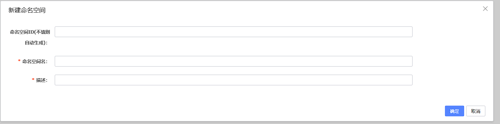


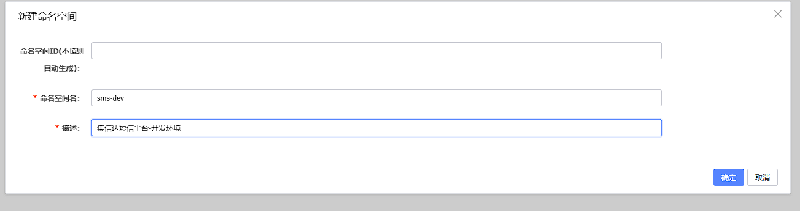


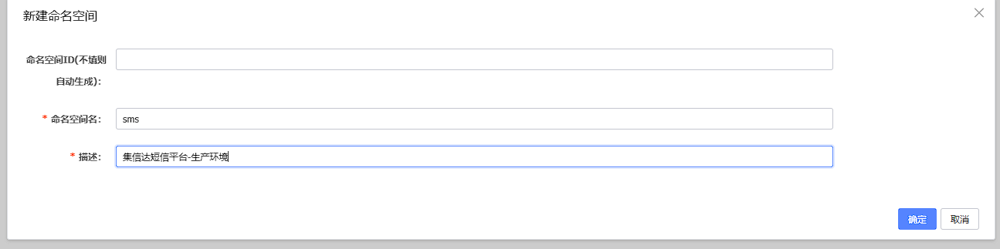


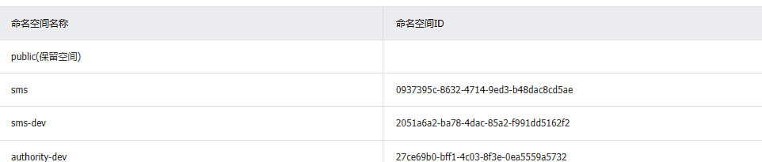


### 配置文件

#### common.yml

```yaml
server:
  undertow: # jetty  undertow
    io-threads: 8 # 设置IO线程数, 它主要执行非阻塞的任务,它们会负责多个连接, 默认设置每个CPU核心一个线程
    worker-threads: 120  # 阻塞任务线程池, 当执行类似servlet请求阻塞操作, undertow会从这个线程池中取得线程,它的值设置取决于系统的负载
    buffer-size: 2048  # 以下的配置会影响buffer,这些buffer会用于服务器连接的IO操作,有点类似netty的池化内存管理 , 每块buffer的空间大小,越小的空间被利用越充分
    direct-buffers: true  # 是否分配的直接内存

spring:
  http:
    encoding:
      charset: UTF-8
      force: true
      enabled: true
  servlet:
    multipart:
      max-file-size: 512MB      # Max file size，默认1M
      max-request-size: 512MB   # Max request size，默认10M

dozer:
  mappingFiles:
    - classpath:dozer/global.dozer.xml
    - classpath:dozer/biz.dozer.xml
management:
  endpoints:
    web:
      base-path: /actuator
      exposure:
        include: '*'
  endpoint:
    health:
      show-details: ALWAYS
      enabled: true

feign:
  httpclient:
    enabled: false
  okhttp:
    enabled: true
  hystrix:
    enabled: true   # feign 熔断机制是否开启
    #支持压缩的mime types
  compression:  # 请求压缩
    request:
      enabled: true
      mime-types: text/xml,application/xml,application/json
      min-request-size: 2048
    response:  # 响应压缩
      enabled: true

ribbon:
  httpclient:
    enabled: false
  okhttp:
    enabled: true
  eureka:
    enabled: true
  ReadTimeout: 30000     #
  ConnectTimeout: 30000  # [ribbon超时时间]大于[熔断超时],那么会先走熔断，相当于你配的ribbon超时就不生效了  ribbon和hystrix是同时生效的，哪个值小哪个生效
  MaxAutoRetries: 0             # 最大自动重试
  MaxAutoRetriesNextServer: 1   # 最大自动像下一个服务重试
  OkToRetryOnAllOperations: false  #无论是请求超时或者socket read timeout都进行重试，

hystrix:
  threadpool:
    default:
      coreSize: 1000 # #并发执行的最大线程数，默认10
      maxQueueSize: 1000 # #BlockingQueue的最大队列数
      queueSizeRejectionThreshold: 500 # #即使maxQueueSize没有达到，达到queueSizeRejectionThreshold该值后，请求也会被拒绝
  command:
    default:
      execution:
        isolation:
          thread:
            timeoutInMilliseconds: 120000  # 熔断超时 ribbon和hystrix是同时生效的，哪个值小哪个生效

id-generator:
  machine-code: 1  # id生成器机器掩码
```


#### mysql.yml

```yaml
# mysql 个性化配置， 不同的环境，需要配置不同的链接信息，只需要将这段信息复制
# 到具体环境的配置文件中进行修改即可
# 如：复制到auth-server-dev.yml中将数据库名和ip改掉

mysql:
  ip: 127.0.0.1
  port: 3306
  driverClassName: com.mysql.cj.jdbc.Driver
  database: sms
  username: root
  password: 20010713
database:
  isBlockAttack: false  # 是否启用 攻击 SQL 阻断解析器


# mysql 通用配置
spring:
  datasource:
    druid:
      username: ${mysql.username}
      password: ${mysql.password}
      driver-class-name: ${mysql.driverClassName}
      url: jdbc:mysql://${mysql.ip}:${mysql.port}/${mysql.database}?serverTimezone=GMT&characterEncoding=utf8
      # &useUnicode=true&useSSL=false&autoReconnect=true&zeroDateTimeBehavior=convertToNull&allowMultiQueries=true
      db-type: mysql
      initialSize: 10
      minIdle: 10
      maxActive: 500
      max-wait: 60000
      pool-prepared-statements: true
      max-pool-prepared-statement-per-connection-size: 20
      validation-query: SELECT 'x'
      test-on-borrow: false
      test-on-return: false
      test-while-idle: true
      time-between-eviction-runs-millis: 60000  #配置间隔多久才进行一次检测，检测需要关闭的空闲连接，单位是毫秒
      min-evictable-idle-time-millis: 300000    #配置一个连接在池中最小生存的时间，单位是毫秒
      filters: stat,wall
      filter:
        wall:
          enabled: true
          config:
            commentAllow: true
            multiStatementAllow: true
            noneBaseStatementAllow: true
      web-stat-filter:  # WebStatFilter配置，说明请参考Druid Wiki，配置_配置WebStatFilter
        enabled: true
        url-pattern: /*
        exclusions: "*.js , *.gif ,*.jpg ,*.png ,*.css ,*.ico , /druid/*"
        session-stat-max-count: 1000
        profile-enable: true
        session-stat-enable: false
      stat-view-servlet:  #展示Druid的统计信息,StatViewServlet的用途包括：1.提供监控信息展示的html页面 2.提供监控信息的JSON API
        enabled: true
        url-pattern: /druid/*   #根据配置中的url-pattern来访问内置监控页面，如果是上面的配置，内置监控页面的首页是/druid/index.html例如：http://127.0.0.1:9000/druid/index.html
        reset-enable: true    #允许清空统计数据
        login-username: root
        login-password: 123456

mybatis-plus:
  mapper-locations:
    - classpath*:mapper/*.xml
  #实体扫描，多个package用逗号或者分号分隔
  typeAliasesPackage: mao
  global-config:
    db-config:
      id-type: INPUT
      insert-strategy: NOT_NULL
      update-strategy: NOT_NULL
      select-strategy: NOT_EMPTY
  configuration:
    #配置返回数据库(column下划线命名&&返回java实体是驼峰命名)，
    #自动匹配无需as（没开启这个，SQL需要写as： select user_id as userId）
    map-underscore-to-camel-case: true
    cache-enabled: false
    #配置JdbcTypeForNull, oracle数据库必须配置
    jdbc-type-for-null: 'null'

```


#### redis.yml

```yaml
# redis 通用配置， 不同的环境，需要配置不同的链接信息，
# 只需要将这段信息复制到具体环境的配置文件中进行修改即可
# 如：复制到auth-server-dev.yml中将数据库名和ip改掉

redis:
  hosts: 127.0.0.1:6379
  password: 123456
  database: 0

spring:
  cache:
    type: GENERIC
  redis:
    hosts: ${redis.hosts}
    password: ${redis.password}
    database: ${redis.database}

j2cache:
  #  config-location: /j2cache.properties
  open-spring-cache: true
  cache-clean-mode: passive
  allow-null-values: true
  redis-client: lettuce
  l2-cache-open: true
  # l2-cache-open: false     # 关闭二级缓存
  broadcast: net.oschina.j2cache.cache.support.redis.SpringRedisPubSubPolicy
  #  broadcast: jgroups       # 关闭二级缓存
  L1:
    provider_class: caffeine
  L2:
    provider_class: net.oschina.j2cache.cache.support.redis.SpringRedisProvider
    config_section: lettuce
  sync_ttl_to_redis: true
  default_cache_null_object: false
  serialization: fst
caffeine:
  properties: /j2cache/caffeine.properties   # 这个配置文件需要放在项目中
lettuce:
  mode: single
  namespace:
  storage: generic
  channel: j2cache
  scheme: redis
  hosts: ${redis.hosts}
  password: ${redis.password}
  database: ${redis.database}
  sentinelMasterId:
  maxTotal: 100
  maxIdle: 10
  minIdle: 10
  timeout: 10000
```


#### sms-api.yml

```yaml
# 在这里配置 权限服务 所有环境都能使用的配置

mysql:
  database: sms

swagger:
  enabled: true
  docket:
    sms:
      title: 短信接收服务
      base-package: mao.sms_api.controller


authentication:
  user:
    header-name: token
    expire: 43200               # 外部token有效期为12小时
    pri-key: client/pri.key    # 加密
    pub-key: client/pub.key    # 解密
```


#### sms-api-dev.yml

```yaml
# p6spy是一个开源项目，通常使用它来跟踪数据库操作，查看程序运行过程中执行的sql语句
# 开发环境需要使用p6spy进行sql语句输出
# 但p6spy会有性能损耗，不适合在生产线使用，故其他环境无需配置
spring:
  datasource:
    driver-class-name: com.p6spy.engine.spy.P6SpyDriver
    url: jdbc:p6spy:mysql://${mysql.ip}:${mysql.port}/${mysql.database}?serverTimezone=CTT&characterEncoding=utf8&useUnicode=true&useSSL=false&autoReconnect=true&zeroDateTimeBehavior=convertToNull&allowMultiQueries=true
    db-type: mysql


# 设置日志级别，root表示根节点，即整体应用日志级别
logging:
  level:
    root: info
    # 为对应组设置日志级别
    mao: debug
```


#### sms-manage.yml

```yaml
# 在这里配置 权限服务 所有环境都能使用的配置

mysql:
  database: sms
  
  # 服务端使用sdk配置信息
  sms:
    auth: false
    domain: http://localhost:8771
    accessKeyId: 7fea0419ea7c435887f996cfecda5a3a
    accessKeySecret: 842ce103df7b4117bb47c888cc528516


swagger:
  enabled: true
  docket:
    sms:
      title: 短信平台管理服务
      base-package: mao.sms_manage.controller


authentication:
  user:
    header-name: token
    expire: 43200               # 外部token有效期为12小时
    pri-key: client/pri.key    # 加密
    pub-key: client/pub.key    # 解密
```


#### sms-manage-dev.yml

```yaml
# p6spy是一个开源项目，通常使用它来跟踪数据库操作，查看程序运行过程中执行的sql语句
# 开发环境需要使用p6spy进行sql语句输出
# 但p6spy会有性能损耗，不适合在生产线使用，故其他环境无需配置
spring:
  datasource:
    driver-class-name: com.p6spy.engine.spy.P6SpyDriver
    url: jdbc:p6spy:mysql://${mysql.ip}:${mysql.port}/${mysql.database}?serverTimezone=CTT&characterEncoding=utf8&useUnicode=true&useSSL=false&autoReconnect=true&zeroDateTimeBehavior=convertToNull&allowMultiQueries=true
    db-type: mysql


# 设置日志级别，root表示根节点，即整体应用日志级别
logging:
  level:
    root: info
    # 为对应组设置日志级别
    mao: debug
```


#### pd-sms-server.yml

```yaml
# 在这里配置 权限服务 所有环境都能使用的配置

mysql:
  database: sms
  
  sms: 
    messageErrorNum: 3
    configLevelFailNum: 10
    configBuildScale: 0.75


swagger:
  enabled: true
  docket:
    sms:
      title: 短信发送服务
      base-package: mao.sms_server.controller


authentication:
  user:
    header-name: token
    expire: 43200               # 外部token有效期为12小时
    pri-key: client/pri.key    # 加密
    pub-key: client/pub.key    # 解密
```


#### pd-sms-server-dev.yml

```yaml
# p6spy是一个开源项目，通常使用它来跟踪数据库操作，查看程序运行过程中执行的sql语句
# 开发环境需要使用p6spy进行sql语句输出
# 但p6spy会有性能损耗，不适合在生产线使用，故其他环境无需配置
spring:
  datasource:
    driver-class-name: com.p6spy.engine.spy.P6SpyDriver
    url: jdbc:p6spy:mysql://${mysql.ip}:${mysql.port}/${mysql.database}?serverTimezone=CTT&characterEncoding=utf8&useUnicode=true&useSSL=false&autoReconnect=true&zeroDateTimeBehavior=convertToNull&allowMultiQueries=true
    db-type: mysql


# 设置日志级别，root表示根节点，即整体应用日志级别
logging:
  level:
    root: info
    # 为对应组设置日志级别
    mao: debug
```


### 导入配置


点击导入配置

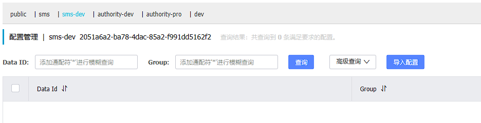


点击上传文件

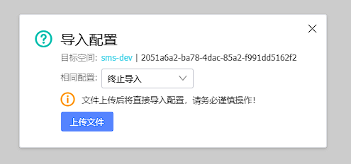


选择项目根目录下的_nacos_config_yaml目录

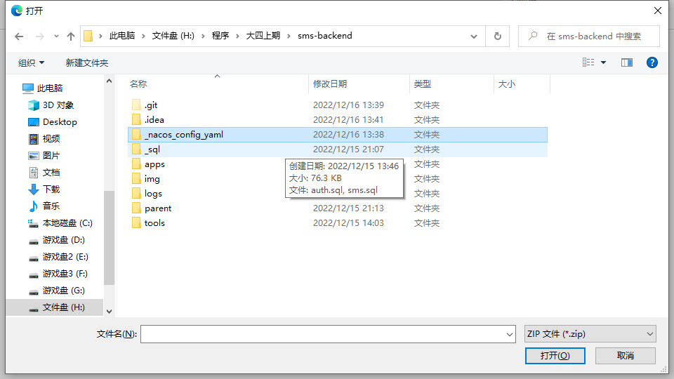


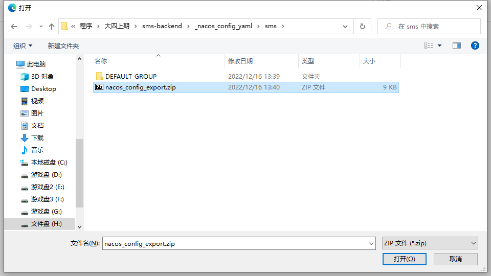


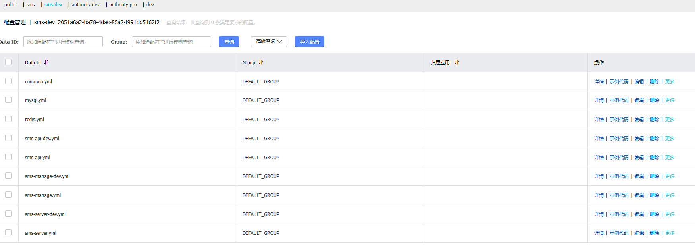


## 后端工程

### 脚手架

https://github.com/maomao124/authority


```sh
authority                    #聚合工程，用于聚合parent、apps、tools等模块
├── parent				     # 父工程，nacos配置及依赖包管理
├── apps					 # 应用目录
	├── auth				 # 权限服务父工程
		├── auth-entity      # 权限实体
		├── auth-server      # 权限服务
	├── gateway			     # 网关服务
└── tools				     # 工具工程
	├── tools-common		 # 基础组件：基础配置类、函数、常量、统一异常处理、undertow服务器
	├── tools-core		     # 核心组件：基础实体、返回对象、上下文、异常处理、分布式锁、函数、树
	├── tools-databases	     # 数据源组件：数据源配置、数据权限、查询条件等
	├── tools-dozer		     # 对象转换：dozer配置、工具
	├── tools-redis-cache    # redis分布式缓存工具类和分布式锁服务，缓存工具类解决著名的3个缓存问题
	├── tools-j2cache	     # 缓存组件：j2cache、redis缓存
	├── tools-jwt            # JWT组件：配置、属性、工具
	├── tools-log	         # 日志组件：日志实体、事件、拦截器、工具
	├── tools-swagger2	     # 文档组件：knife4j文档
	├── tools-user           # 用户上下文：用户注解、模型和工具，当前登录用户信息注入模块
	├── tools-validator	     # 表单验证： 后台表单规则验证
	├── tools-xss		     # xss防注入组件
```


不项目只需要使用到脚手架的部分tools模块为父模块的子模块，其它的暂时都不需要


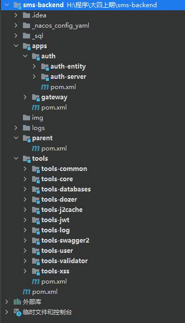


### 初始化工程

在apps目录下创建一个名字为sms的子工程


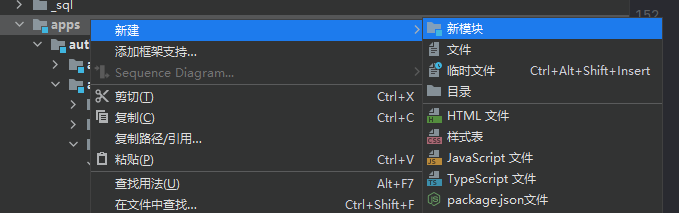


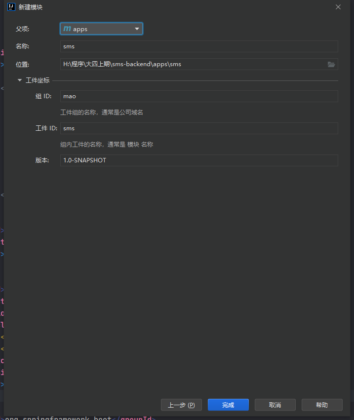


创建sms项目的子项目sms-entity


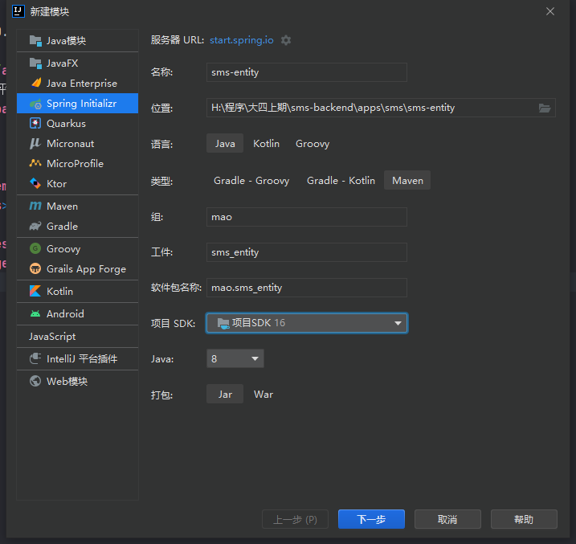


创建sms项目的子项目sms-manage


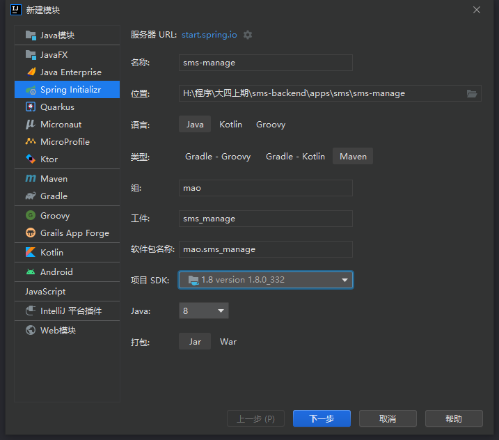


创建sms项目的子项目sms-api


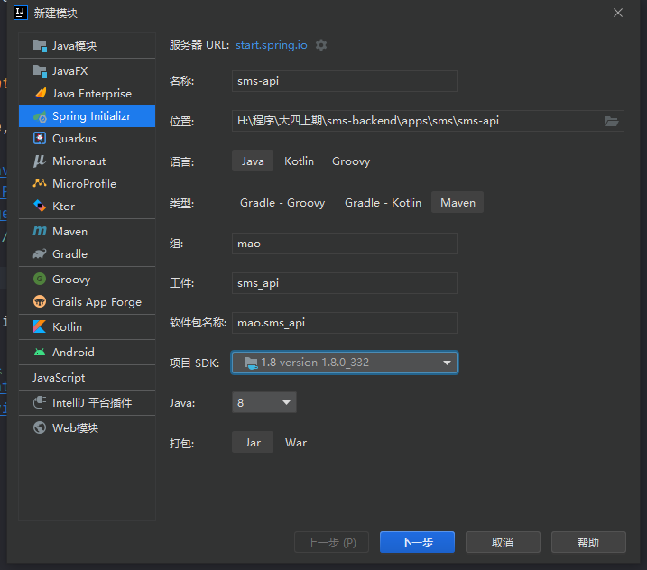


创建sms项目的子项目sms-server


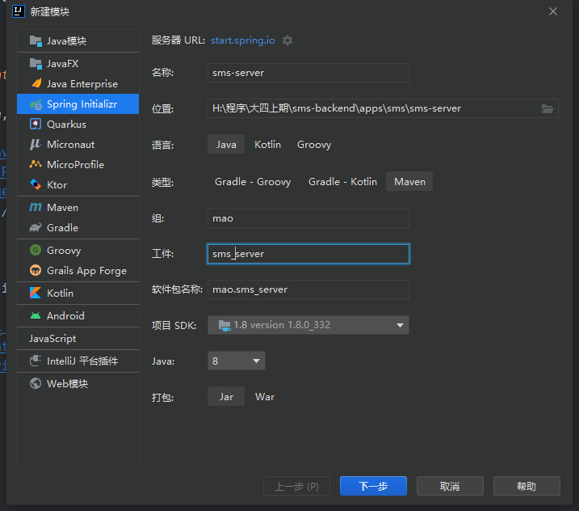


创建sms项目的子项目sms-sdk


最后的项目结构如下


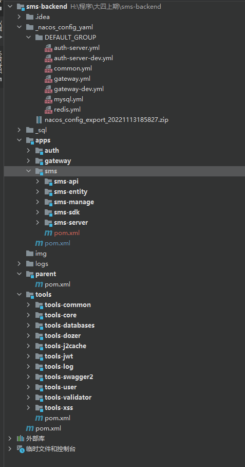


还有一个sms-dao模块是后来添加上去的


### 更改pom文件

#### parent模块

```xml
<?xml version="1.0" encoding="UTF-8"?>
<project xmlns="http://maven.apache.org/POM/4.0.0"
         xmlns:xsi="http://www.w3.org/2001/XMLSchema-instance"
         xsi:schemaLocation="http://maven.apache.org/POM/4.0.0 http://maven.apache.org/xsd/maven-4.0.0.xsd">

    <parent>
        <groupId>org.springframework.boot</groupId>
        <artifactId>spring-boot-starter-parent</artifactId>
        <version>2.2.9.RELEASE</version>
        <relativePath/> <!-- lookup parent from repository -->
    </parent>

    <groupId>mao</groupId>
    <modelVersion>4.0.0</modelVersion>
    <artifactId>parent</artifactId>
    <version>1.0-SNAPSHOT</version>
    <name>${project.artifactId}</name>
    <description>Spring Boot 2.0项目依赖管理</description>
    <packaging>pom</packaging>


    <!-- 环境 -->
    <profiles>
        <!-- 开发 -->
        <profile>
            <id>dev</id>
            <activation>
                <!--默认激活配置-->
                <activeByDefault>true</activeByDefault>
            </activation>
            <properties>
                <!--当前环境-->
                <pom.profile.name>dev</pom.profile.name>
                <!--Nacos配置中心地址-->
                <pom.nacos.ip>127.0.0.1</pom.nacos.ip>
                <pom.nacos.port>8848</pom.nacos.port>
                <!--Nacos配置中心命名空间,用于支持多环境.这里必须使用ID，不能使用名称,默认为空-->
                <pom.nacos.namespace>2051a6a2-ba78-4dac-85a2-f991dd5162f2</pom.nacos.namespace>
            </properties>
        </profile>
        <!-- 测试 环境 -->
        <profile>
            <id>test</id>
            <properties>
                <pom.profile.name>test</pom.profile.name>
                <!--Nacos配置中心地址-->
                <pom.nacos.ip>192.168.1.34</pom.nacos.ip>
                <pom.nacos.port>8848</pom.nacos.port>
                <!--Nacos配置中心命名空间,用于支持多环境.这里必须使用ID，不能使用名称,默认为空-->
                <pom.nacos.namespace>2051a6a2-ba78-4dac-85a2-f991dd5162f2</pom.nacos.namespace>
            </properties>
        </profile>
        <!-- 生产 -->
        <profile>
            <id>pro</id>
            <properties>
                <pom.profile.name>pro</pom.profile.name>
                <!--Nacos配置中心地址-->
                <pom.nacos.ip>127.0.0.1</pom.nacos.ip>
                <pom.nacos.port>8848</pom.nacos.port>
                <!--Nacos配置中心命名空间,用于支持多环境.这里必须使用ID，不能使用名称,默认为空-->
                <pom.nacos.namespace>0937395c-8632-4714-9ed3-b48dac8cd5ae</pom.nacos.namespace>
            </properties>
        </profile>
    </profiles>


    <properties>
        <java.version>1.8</java.version>
        <project.build.sourceEncoding>UTF-8</project.build.sourceEncoding>
        <project.reporting.outputEncoding>UTF-8</project.reporting.outputEncoding>
        <spring.boot.version>2.3.9.RELEASE</spring.boot.version>
        <spring.cloud.version>Hoxton.SR10</spring.cloud.version>
        <spring-cloud-alibaba-dependencies.version>2.2.6.RELEASE</spring-cloud-alibaba-dependencies.version>
        <spring.version>5.2.2.RELEASE</spring.version>
        <spring-boot-admin.version>2.2.0</spring-boot-admin.version>
        <maven.compiler.plugin.version>3.8.1</maven.compiler.plugin.version>
        <mybatis.version>3.5.9</mybatis.version>
        <mybatis.typehandlers.version>1.0.2</mybatis.typehandlers.version>
        <mybatisplus.version>3.2.0</mybatisplus.version>
        <p6spy.version>3.8.7</p6spy.version>
        <fastjson.version>1.2.79</fastjson.version>
        <druid.version>1.2.8</druid.version>
        <mysql.version>8.0.27</mysql.version>
        <knife4j.version>2.0.1</knife4j.version>
        <springfox.swagger2.version>2.9.2</springfox.swagger2.version>
        <swagger.version>1.5.21</swagger.version>
        <dozer.version>6.5.0</dozer.version>
        <easy-captcha.version>1.6.2</easy-captcha.version>
        <guava.version>20.0</guava.version>
        <tobato-fastdfs-client.version>1.26.6</tobato-fastdfs-client.version>
        <qiniu-java-sdk>7.2.18</qiniu-java-sdk>
        <j2cache.version>2.8.0-release</j2cache.version>
        <hibernate.validator.version>6.1.0.Final</hibernate.validator.version>
        <commons-exec.version>1.3</commons-exec.version>
        <commons-email.version>1.5</commons-email.version>
        <commons.collections4.version>4.4</commons.collections4.version>
        <commons-lang.version>2.6</commons-lang.version>
        <commons-io.version>2.6</commons-io.version>
        <maven.test.skip>true</maven.test.skip>
        <asm.version>5.0.4</asm.version>
        <groovy-all.version>2.5.5</groovy-all.version>
        <jjwt.version>0.7.0</jjwt.version>
        <qcloudsms.version>1.0.6</qcloudsms.version>
        <bce-java-sdk.version>0.10.21</bce-java-sdk.version>
        <lombok.version>1.18.20</lombok.version>
        <junit.version>RELEASE</junit.version>
        <jackson.version>2.9.2</jackson.version>
        <j2cache.version>2.8.0-release</j2cache.version>
        <redisson.version>3.17.0</redisson.version>


        <hutool.version>5.1.0</hutool.version>
        <antisamy.version>1.5.7</antisamy.version>
        <caffeine.version>2.8.0</caffeine.version>
        <ip2region.version>1.7.2</ip2region.version>
        <bitwalker.version>1.21</bitwalker.version>

        <!--        <dockerfile-maven-plugin.version>1.4.12</dockerfile-maven-plugin.version>-->
        <!--        &lt;!&ndash;私有镜像仓库&ndash;&gt;-->
        <!--        <docker.registry>127.0.0.1:5000</docker.registry>-->
        <!--        &lt;!&ndash;镜像前缀&ndash;&gt;-->
        <!--        <docker.image.prefix></docker.image.prefix>-->

    </properties>


    <dependencyManagement>

        <dependencies>

            <dependency>
                <groupId>org.springframework.cloud</groupId>
                <artifactId>spring-cloud-dependencies</artifactId>
                <version>${spring.cloud.version}</version>
                <type>pom</type>
                <scope>import</scope>
            </dependency>

            <dependency>
                <groupId>org.springframework</groupId>
                <artifactId>spring-framework-bom</artifactId>
                <version>${spring.version}</version>
                <type>pom</type>
                <scope>import</scope>
            </dependency>

            <dependency>
                <groupId>com.alibaba.cloud</groupId>
                <artifactId>spring-cloud-alibaba-dependencies</artifactId>
                <version>${spring-cloud-alibaba-dependencies.version}</version>
                <type>pom</type>
                <scope>import</scope>
            </dependency>

            <dependency>
                <groupId>org.lionsoul</groupId>
                <artifactId>ip2region</artifactId>
                <version>${ip2region.version}</version>
            </dependency>

            <dependency>
                <groupId>eu.bitwalker</groupId>
                <artifactId>UserAgentUtils</artifactId>
                <version>${bitwalker.version}</version>
            </dependency>


            <!-- 持久层相关 -->
            <dependency>
                <groupId>com.baomidou</groupId>
                <artifactId>mybatis-plus-boot-starter</artifactId>
                <version>${mybatisplus.version}</version>
            </dependency>

            <dependency>
                <groupId>com.baomidou</groupId>
                <artifactId>mybatis-plus</artifactId>
                <version>${mybatisplus.version}</version>
            </dependency>

            <dependency>
                <groupId>org.mybatis</groupId>
                <artifactId>mybatis-typehandlers-jsr310</artifactId>
                <version>${mybatis.typehandlers.version}</version>
            </dependency>

            <dependency>
                <groupId>com.alibaba</groupId>
                <artifactId>druid-spring-boot-starter</artifactId>
                <version>${druid.version}</version>
            </dependency>

            <dependency>
                <groupId>p6spy</groupId>
                <artifactId>p6spy</artifactId>
                <version>${p6spy.version}</version>
            </dependency>

            <dependency>
                <groupId>mysql</groupId>
                <artifactId>mysql-connector-java</artifactId>
                <version>${mysql.version}</version>
            </dependency>

            <dependency>
                <groupId>net.oschina.j2cache</groupId>
                <artifactId>j2cache-core</artifactId>
                <version>${j2cache.version}</version>
                <exclusions>
                    <exclusion>
                        <groupId>org.slf4j</groupId>
                        <artifactId>slf4j-simple</artifactId>
                    </exclusion>
                </exclusions>
            </dependency>


            <!-- FastDFS文件 -->
            <dependency>
                <groupId>com.github.tobato</groupId>
                <artifactId>fastdfs-client</artifactId>
                <version>${tobato-fastdfs-client.version}</version>
            </dependency>

            <!-- 七牛依赖 -->
            <dependency>
                <groupId>com.qiniu</groupId>
                <artifactId>qiniu-java-sdk</artifactId>
                <version>${qiniu-java-sdk}</version>
            </dependency>

            <!-- 对象转换 -->
            <dependency>
                <groupId>com.github.dozermapper</groupId>
                <artifactId>dozer-spring-boot-starter</artifactId>
                <version>${dozer.version}</version>
            </dependency>

            <!-- swagger2 -->
            <dependency>
                <groupId>io.springfox</groupId>
                <artifactId>springfox-swagger2</artifactId>
                <version>${springfox.swagger2.version}</version>
                <exclusions>
                    <exclusion>
                        <groupId>io.swagger</groupId>
                        <artifactId>swagger-models</artifactId>
                    </exclusion>
                </exclusions>
            </dependency>

            <dependency>
                <groupId>io.swagger</groupId>
                <artifactId>swagger-annotations</artifactId>
                <version>${swagger.version}</version>
            </dependency>

            <dependency>
                <groupId>io.swagger</groupId>
                <artifactId>swagger-models</artifactId>
                <version>${swagger.version}</version>
            </dependency>

            <dependency>
                <groupId>io.springfox</groupId>
                <artifactId>springfox-bean-validators</artifactId>
                <version>${springfox.swagger2.version}</version>
            </dependency>

            <dependency>
                <groupId>io.springfox</groupId>
                <artifactId>springfox-core</artifactId>
                <version>${springfox.swagger2.version}</version>
            </dependency>

            <dependency>
                <groupId>com.github.xiaoymin</groupId>
                <artifactId>knife4j-spring-boot-starter</artifactId>
                <version>${knife4j.version}</version>
            </dependency>
            <dependency>
                <groupId>com.github.xiaoymin</groupId>
                <artifactId>knife4j-spring-ui</artifactId>
                <version>${knife4j.version}</version>
            </dependency>


            <dependency>
                <groupId>io.jsonwebtoken</groupId>
                <artifactId>jjwt</artifactId>
                <version>${jjwt.version}</version>
            </dependency>

            <!-- 腾讯云add  -->
            <dependency>
                <groupId>com.github.qcloudsms</groupId>
                <artifactId>qcloudsms</artifactId>
                <version>${qcloudsms.version}</version>
            </dependency>

            <!-- 百度 -->
            <dependency>
                <groupId>com.baidubce</groupId>
                <artifactId>bce-java-sdk</artifactId>
                <version>${bce-java-sdk.version}</version>
            </dependency>

            <!-- jackson 序列化 -->
            <dependency>
                <groupId>com.fasterxml.jackson.datatype</groupId>
                <artifactId>jackson-datatype-jsr310</artifactId>
                <version>${jackson.version}</version>
                <scope>compile</scope>
            </dependency>

            <dependency>
                <groupId>com.fasterxml.jackson.module</groupId>
                <artifactId>jackson-module-parameter-names</artifactId>
                <version>${jackson.version}</version>
                <scope>compile</scope>
            </dependency>

            <dependency>
                <groupId>de.codecentric</groupId>
                <artifactId>spring-boot-admin-starter-server</artifactId>
                <version>${spring-boot-admin.version}</version>
            </dependency>

            <dependency>
                <groupId>de.codecentric</groupId>
                <artifactId>spring-boot-admin-server-ui</artifactId>
                <version>${spring-boot-admin.version}</version>
            </dependency>

            <!--<dependency>-->
            <!--<groupId>de.codecentric</groupId>-->
            <!--<artifactId>spring-boot-admin-starter-client</artifactId>-->
            <!--<version>${spring-boot-admin.version}</version>-->
            <!--</dependency>-->

            <dependency>
                <groupId>org.owasp.antisamy</groupId>
                <artifactId>antisamy</artifactId>
                <version>${antisamy.version}</version>
            </dependency>

            <dependency>
                <groupId>com.github.ben-manes.caffeine</groupId>
                <artifactId>caffeine</artifactId>
                <version>${caffeine.version}</version>
            </dependency>

            <dependency>
                <groupId>commons-io</groupId>
                <artifactId>commons-io</artifactId>
                <version>${commons-io.version}</version>
            </dependency>

            <dependency>
                <groupId>commons-lang</groupId>
                <artifactId>commons-lang</artifactId>
                <version>${commons-lang.version}</version>
            </dependency>

            <dependency>
                <groupId>com.github.whvcse</groupId>
                <artifactId>easy-captcha</artifactId>
                <version>${easy-captcha.version}</version>
            </dependency>

            <dependency>
                <groupId>org.hibernate.validator</groupId>
                <artifactId>hibernate-validator</artifactId>
                <version>${hibernate.validator.version}</version>
            </dependency>

            <dependency>
                <groupId>org.hibernate</groupId>
                <artifactId>hibernate-validator</artifactId>
                <version>${hibernate.validator.version}</version>
            </dependency>


            <!-- 测试框架 -->
            <dependency>
                <groupId>org.junit.jupiter</groupId>
                <artifactId>junit-jupiter</artifactId>
                <version>${junit.version}</version>
                <scope>test</scope>
            </dependency>

            <dependency>
                <groupId>net.oschina.j2cache</groupId>
                <artifactId>j2cache-spring-boot2-starter</artifactId>
                <version>${j2cache.version}</version>
            </dependency>

            <!--spring boot redisson 依赖-->
            <dependency>
                <groupId>org.redisson</groupId>
                <artifactId>redisson-spring-boot-starter</artifactId>
                <version>${redisson.version}</version>

            </dependency>

        </dependencies>

    </dependencyManagement>


    <dependencies>

        <dependency>
            <groupId>cn.hutool</groupId>
            <artifactId>hutool-all</artifactId>
            <version>${hutool.version}</version>
        </dependency>

        <!--Lombok-->
        <dependency>
            <groupId>org.projectlombok</groupId>
            <artifactId>lombok</artifactId>
            <version>${lombok.version}</version>
            <scope>provided</scope>
        </dependency>


        <dependency>
            <groupId>org.slf4j</groupId>
            <artifactId>slf4j-api</artifactId>
            <scope>compile</scope>
        </dependency>

        <dependency>
            <groupId>com.alibaba</groupId>
            <artifactId>fastjson</artifactId>
            <version>${fastjson.version}</version>
        </dependency>

        <dependency>
            <groupId>com.google.guava</groupId>
            <artifactId>guava</artifactId>
            <version>${guava.version}</version>
        </dependency>

    </dependencies>


        <build>
            <finalName>${project.artifactId}</finalName>
            <resources>
                <resource>
                    <directory>src/main/resources</directory>
                    <includes>
                        <include>**/*</include>
                    </includes>
                    <filtering>true</filtering>
                </resource>
            </resources>
            <pluginManagement>
                <plugins>
                    <!--                <plugin>-->
                    <!--                    <groupId>org.springframework.boot</groupId>-->
                    <!--                    <artifactId>spring-boot-maven-plugin</artifactId>-->
                    <!--                    <executions>-->
                    <!--                        <execution>-->
                    <!--                            <goals>-->
                    <!--                                <goal>repackage</goal>-->
                    <!--                                <goal>build-info</goal>-->
                    <!--                            </goals>-->
                    <!--                        </execution>-->
                    <!--                    </executions>-->
                    <!--                </plugin>-->
                    <plugin>
                        <groupId>org.apache.maven.plugins</groupId>
                        <artifactId>maven-compiler-plugin</artifactId>
                        <version>${maven.compiler.plugin.version}</version>
                        <configuration>
                            <source>${java.version}</source>
                            <target>${java.version}</target>
                            <encoding>${project.build.sourceEncoding}</encoding>
                        </configuration>
                    </plugin>

                </plugins>
            </pluginManagement>

            <plugins>
                <!-- resources资源插件 -->
                <plugin>
                    <groupId>org.apache.maven.plugins</groupId>
                    <artifactId>maven-resources-plugin</artifactId>
                    <configuration>
                        <encoding>UTF-8</encoding>
                        <!-- 后缀为pem、pfx的证书文件 -->
                        <nonFilteredFileExtensions>
                            <nonFilteredFileExtension>pem</nonFilteredFileExtension>
                            <nonFilteredFileExtension>pfx</nonFilteredFileExtension>
                            <nonFilteredFileExtension>p12</nonFilteredFileExtension>
                            <nonFilteredFileExtension>key</nonFilteredFileExtension>
                        </nonFilteredFileExtensions>
                    </configuration>
                </plugin>

                <!-- java文档插件 -->
                <plugin>
                    <groupId>org.apache.maven.plugins</groupId>
                    <artifactId>maven-javadoc-plugin</artifactId>
                    <version>3.0.0</version>
                </plugin>
            </plugins>
        </build>


</project>
```


#### apps模块

```xml
<?xml version="1.0" encoding="UTF-8"?>
<project xmlns="http://maven.apache.org/POM/4.0.0"
         xmlns:xsi="http://www.w3.org/2001/XMLSchema-instance"
         xsi:schemaLocation="http://maven.apache.org/POM/4.0.0 http://maven.apache.org/xsd/maven-4.0.0.xsd">
    <parent>
        <artifactId>parent</artifactId>
        <groupId>mao</groupId>
        <version>1.0-SNAPSHOT</version>
        <relativePath>./../parent/pom.xml</relativePath>
    </parent>

    <modelVersion>4.0.0</modelVersion>

    <artifactId>apps</artifactId>
    <packaging>pom</packaging>
    <name>${project.artifactId}</name>
    <description>业务系统服务父pom</description>

    <modules>
        <module>auth</module>
        <module>gateway</module>
        <module>sms</module>
    </modules>

    <dependencyManagement>
        <dependencies>
            <dependency>
                <groupId>mao</groupId>
                <artifactId>auth-entity</artifactId>
                <version>${project.version}</version>
            </dependency>

            <dependency>
                <groupId>mao</groupId>
                <artifactId>tools-user</artifactId>
                <version>${project.version}</version>
            </dependency>
            <dependency>
                <groupId>mao</groupId>
                <artifactId>tools-j2cache</artifactId>
                <version>${project.version}</version>
            </dependency>
            <dependency>
                <groupId>mao</groupId>
                <artifactId>tools-core</artifactId>
                <version>${project.version}</version>
            </dependency>
            <dependency>
                <groupId>mao</groupId>
                <artifactId>tools-common</artifactId>
                <version>${project.version}</version>
            </dependency>
            <dependency>
                <groupId>mao</groupId>
                <artifactId>tools-databases</artifactId>
                <version>${project.version}</version>
            </dependency>
            <dependency>
                <groupId>mao</groupId>
                <artifactId>tools-swagger2</artifactId>
                <version>${project.version}</version>
            </dependency>
            <dependency>
                <groupId>mao</groupId>
                <artifactId>tools-dozer</artifactId>
                <version>${project.version}</version>
            </dependency>
            <dependency>
                <groupId>mao</groupId>
                <artifactId>tools-log</artifactId>
                <version>${project.version}</version>
            </dependency>
            <dependency>
                <groupId>mao</groupId>
                <artifactId>tools-validator</artifactId>
                <version>${project.version}</version>
            </dependency>
            <dependency>
                <groupId>mao</groupId>
                <artifactId>tools-jwt</artifactId>
                <version>${project.version}</version>
            </dependency>
            <dependency>
                <groupId>mao</groupId>
                <artifactId>tools-xss</artifactId>
                <version>${project.version}</version>
            </dependency>
            <dependency>
                <groupId>mao</groupId>
                <artifactId>tools-redis-cache</artifactId>
                <version>${project.version}</version>
            </dependency>
        </dependencies>
    </dependencyManagement>


</project>
```


#### sms模块

```xml
<?xml version="1.0" encoding="UTF-8"?>
<project xmlns="http://maven.apache.org/POM/4.0.0"
         xmlns:xsi="http://www.w3.org/2001/XMLSchema-instance"
         xsi:schemaLocation="http://maven.apache.org/POM/4.0.0 http://maven.apache.org/xsd/maven-4.0.0.xsd">
    <parent>
        <artifactId>apps</artifactId>
        <groupId>mao</groupId>
        <version>1.0-SNAPSHOT</version>
    </parent>
    <modelVersion>4.0.0</modelVersion>

    <artifactId>sms</artifactId>
    <description>短信平台</description>
    <packaging>pom</packaging>


    <modules>
        <module>sms-api</module>
        <module>sms-dao</module>
        <module>sms-entity</module>
        <module>sms-manage</module>
        <module>sms-sdk</module>
        <module>sms-server</module>
    </modules>


    <dependencyManagement>
        <dependencies>

            <dependency>
                <groupId>mao</groupId>
                <artifactId>sms-entity</artifactId>
                <version>${project.version}</version>
            </dependency>
            <dependency>
                <groupId>mao</groupId>
                <artifactId>sms-sdk</artifactId>
                <version>${project.version}</version>
            </dependency>
            <dependency>
                <groupId>mao</groupId>
                <artifactId>sms-api</artifactId>
                <version>${project.version}</version>
            </dependency>
            <dependency>
                <groupId>mao</groupId>
                <artifactId>sms-manage</artifactId>
                <version>${project.version}</version>
            </dependency>
            <dependency>
                <groupId>mao</groupId>
                <artifactId>sms-dao</artifactId>
                <version>${project.version}</version>
            </dependency>

        </dependencies>
    </dependencyManagement>

    <dependencies>

    </dependencies>

</project>
```


#### sms-api模块

```xml
<?xml version="1.0" encoding="UTF-8"?>
<project xmlns="http://maven.apache.org/POM/4.0.0" xmlns:xsi="http://www.w3.org/2001/XMLSchema-instance"
         xsi:schemaLocation="http://maven.apache.org/POM/4.0.0 https://maven.apache.org/xsd/maven-4.0.0.xsd">
    <modelVersion>4.0.0</modelVersion>

    <parent>
        <artifactId>sms</artifactId>
        <groupId>mao</groupId>
        <version>1.0-SNAPSHOT</version>
    </parent>

    <artifactId>sms-api</artifactId>
    <name>sms-api</name>
    <description>短信API启动模块</description>
    <properties>

    </properties>

    <dependencies>

        <dependency>
            <groupId>org.springframework.boot</groupId>
            <artifactId>spring-boot-starter-web</artifactId>
        </dependency>

        <dependency>
            <groupId>org.springframework.boot</groupId>
            <artifactId>spring-boot-starter-test</artifactId>
            <scope>test</scope>
        </dependency>


        <dependency>
            <groupId>mao</groupId>
            <artifactId>tools-user</artifactId>
        </dependency>
        <dependency>
            <groupId>mao</groupId>
            <artifactId>tools-log</artifactId>
        </dependency>

        <dependency>
            <groupId>mao</groupId>
            <artifactId>tools-swagger2</artifactId>
        </dependency>
        <dependency>
            <groupId>mao</groupId>
            <artifactId>tools-validator</artifactId>
        </dependency>
        <dependency>
            <groupId>mao</groupId>
            <artifactId>tools-xss</artifactId>
        </dependency>
        <dependency>
            <groupId>mao</groupId>
            <artifactId>tools-databases</artifactId>
        </dependency>
        <dependency>
            <groupId>mao</groupId>
            <artifactId>tools-dozer</artifactId>
        </dependency>
<!--        <dependency>-->
<!--            <groupId>mao</groupId>-->
<!--            <artifactId>tools-j2cache</artifactId>-->
<!--        </dependency>-->
        <dependency>
            <groupId>mao</groupId>
            <artifactId>tools-redis-cache</artifactId>
        </dependency>

        <dependency>
            <groupId>com.alibaba.cloud</groupId>
            <artifactId>spring-cloud-starter-alibaba-nacos-discovery</artifactId>
            <exclusions>
                <exclusion>
                    <artifactId>fastjson</artifactId>
                    <groupId>com.alibaba</groupId>
                </exclusion>
                <exclusion>
                    <groupId>com.google.guava</groupId>
                    <artifactId>guava</artifactId>
                </exclusion>
            </exclusions>
        </dependency>


        <dependency>
            <groupId>org.springframework.cloud</groupId>
            <artifactId>spring-cloud-starter-netflix-hystrix</artifactId>
            <exclusions>
                <exclusion>
                    <groupId>com.google.guava</groupId>
                    <artifactId>guava</artifactId>
                </exclusion>
            </exclusions>
        </dependency>

        <dependency>
            <groupId>org.ow2.asm</groupId>
            <artifactId>asm</artifactId>
            <version>${asm.version}</version>
        </dependency>

        <dependency>
            <groupId>org.springframework.boot</groupId>
            <artifactId>spring-boot-starter-aop</artifactId>
        </dependency>
        <dependency>
            <groupId>org.springframework.boot</groupId>
            <artifactId>spring-boot-starter-actuator</artifactId>
        </dependency>

        <dependency>
            <groupId>org.springframework.boot</groupId>
            <artifactId>spring-boot-starter-json</artifactId>
        </dependency>

        <dependency>
            <groupId>org.springframework.cloud</groupId>
            <artifactId>spring-cloud-context</artifactId>
        </dependency>

        <dependency>
            <groupId>com.baomidou</groupId>
            <artifactId>mybatis-plus-boot-starter</artifactId>
        </dependency>

        <dependency>
            <groupId>org.springframework.boot</groupId>
            <artifactId>spring-boot-configuration-processor</artifactId>
            <optional>true</optional>
            <scope>compile</scope>
        </dependency>

        <!--redis-->
<!--        <dependency>-->
<!--            <groupId>org.springframework.boot</groupId>-->
<!--            <artifactId>spring-boot-starter-data-redis</artifactId>-->
<!--        </dependency>-->


        <dependency>
            <groupId>mao</groupId>
            <artifactId>sms-entity</artifactId>
        </dependency>
        <dependency>
            <groupId>mao</groupId>
            <artifactId>sms-dao</artifactId>
        </dependency>

    </dependencies>

    <build>
        <plugins>
            <plugin>
                <groupId>org.springframework.boot</groupId>
                <artifactId>spring-boot-maven-plugin</artifactId>
                <executions>
                    <execution>
                        <goals>
                            <goal>repackage</goal>
                        </goals>
                    </execution>
                </executions>
            </plugin>
            <plugin>
                <groupId>org.apache.maven.plugins</groupId>
                <artifactId>maven-deploy-plugin</artifactId>
                <version>3.0.0-M1</version>
                <configuration>
                    <skip>true</skip>
                </configuration>
            </plugin>
        </plugins>
    </build>

</project>

```


#### sms-dao模块

```xml
<?xml version="1.0" encoding="UTF-8"?>
<project xmlns="http://maven.apache.org/POM/4.0.0" xmlns:xsi="http://www.w3.org/2001/XMLSchema-instance"
         xsi:schemaLocation="http://maven.apache.org/POM/4.0.0 https://maven.apache.org/xsd/maven-4.0.0.xsd">
    <modelVersion>4.0.0</modelVersion>

    <parent>
        <artifactId>sms</artifactId>
        <groupId>mao</groupId>
        <version>1.0-SNAPSHOT</version>
    </parent>

    <artifactId>sms-dao</artifactId>
    <name>sms-dao</name>
    <description>短信平台数据库操作相关模块</description>

    <properties>

    </properties>

    <dependencies>

        <dependency>
            <groupId>org.springframework.boot</groupId>
            <artifactId>spring-boot-starter</artifactId>
        </dependency>

        <dependency>
            <groupId>org.springframework.boot</groupId>
            <artifactId>spring-boot-starter-test</artifactId>
            <scope>test</scope>
        </dependency>

        <dependency>
            <groupId>mao</groupId>
            <artifactId>sms-entity</artifactId>
        </dependency>

        <dependency>
            <groupId>com.baomidou</groupId>
            <artifactId>mybatis-plus-boot-starter</artifactId>
        </dependency>

        <dependency>
            <groupId>mao</groupId>
            <artifactId>tools-databases</artifactId>
        </dependency>

    </dependencies>

    <build>
        <plugins>
            <plugin>
                <groupId>org.springframework.boot</groupId>
                <artifactId>spring-boot-maven-plugin</artifactId>
                <configuration>
                    <skip>true</skip>
                </configuration>
            </plugin>
        </plugins>
    </build>

</project>
```


#### sms-entity模块

```xml
<?xml version="1.0" encoding="UTF-8"?>
<project xmlns="http://maven.apache.org/POM/4.0.0" xmlns:xsi="http://www.w3.org/2001/XMLSchema-instance"
         xsi:schemaLocation="http://maven.apache.org/POM/4.0.0 https://maven.apache.org/xsd/maven-4.0.0.xsd">
    <modelVersion>4.0.0</modelVersion>

    <parent>
        <artifactId>sms</artifactId>
        <groupId>mao</groupId>
        <version>1.0-SNAPSHOT</version>
    </parent>

    <artifactId>sms-entity</artifactId>
    <name>sms-entity</name>
    <description>短信服务实体模块</description>

    <properties>

    </properties>

    <dependencies>

        <dependency>
            <groupId>mao</groupId>
            <artifactId>tools-common</artifactId>
        </dependency>

        <dependency>
            <groupId>io.springfox</groupId>
            <artifactId>springfox-core</artifactId>
        </dependency>

        <dependency>
            <groupId>com.baomidou</groupId>
            <artifactId>mybatis-plus</artifactId>
        </dependency>

    </dependencies>

<!--    <build>-->
<!--        <resources>-->
<!--            <resource>-->
<!--                <directory>src/main/resources</directory>-->
<!--                <includes>-->
<!--                    <include>**/*.xml</include>-->
<!--                </includes>-->
<!--            </resource>-->
<!--        </resources>-->
<!--    </build>-->

</project>

```


#### sms-manage模块

```xml
<?xml version="1.0" encoding="UTF-8"?>
<project xmlns="http://maven.apache.org/POM/4.0.0" xmlns:xsi="http://www.w3.org/2001/XMLSchema-instance"
         xsi:schemaLocation="http://maven.apache.org/POM/4.0.0 https://maven.apache.org/xsd/maven-4.0.0.xsd">
    <modelVersion>4.0.0</modelVersion>

    <parent>
        <artifactId>sms</artifactId>
        <groupId>mao</groupId>
        <version>1.0-SNAPSHOT</version>
    </parent>

    <artifactId>sms-manage</artifactId>
    <name>sms-manage</name>
    <description>短信管理启动模块</description>


    <properties>

    </properties>

    <dependencies>

        <dependency>
            <groupId>org.springframework.boot</groupId>
            <artifactId>spring-boot-starter-web</artifactId>
        </dependency>

        <dependency>
            <groupId>org.springframework.boot</groupId>
            <artifactId>spring-boot-starter-test</artifactId>
            <scope>test</scope>
        </dependency>

        <dependency>
            <groupId>mao</groupId>
            <artifactId>tools-user</artifactId>
        </dependency>
        <dependency>
            <groupId>mao</groupId>
            <artifactId>tools-log</artifactId>
        </dependency>
        <dependency>
            <groupId>mao</groupId>
            <artifactId>tools-swagger2</artifactId>
        </dependency>
        <dependency>
            <groupId>mao</groupId>
            <artifactId>tools-validator</artifactId>
        </dependency>
        <dependency>
            <groupId>mao</groupId>
            <artifactId>tools-xss</artifactId>
        </dependency>
        <dependency>
            <groupId>mao</groupId>
            <artifactId>tools-databases</artifactId>
        </dependency>
        <dependency>
            <groupId>mao</groupId>
            <artifactId>tools-dozer</artifactId>
        </dependency>

        <dependency>
            <groupId>com.alibaba.cloud</groupId>
            <artifactId>spring-cloud-starter-alibaba-nacos-discovery</artifactId>
            <exclusions>
                <exclusion>
                    <artifactId>fastjson</artifactId>
                    <groupId>com.alibaba</groupId>
                </exclusion>
                <exclusion>
                    <groupId>com.google.guava</groupId>
                    <artifactId>guava</artifactId>
                </exclusion>
            </exclusions>
        </dependency>

        <dependency>
            <groupId>org.springframework.cloud</groupId>
            <artifactId>spring-cloud-starter-netflix-hystrix</artifactId>
            <exclusions>
                <exclusion>
                    <groupId>com.google.guava</groupId>
                    <artifactId>guava</artifactId>
                </exclusion>
            </exclusions>
        </dependency>


        <dependency>
            <groupId>org.ow2.asm</groupId>
            <artifactId>asm</artifactId>
            <version>${asm.version}</version>
        </dependency>

        <dependency>
            <groupId>org.springframework.boot</groupId>
            <artifactId>spring-boot-starter-aop</artifactId>
        </dependency>

        <dependency>
            <groupId>org.springframework.boot</groupId>
            <artifactId>spring-boot-starter-actuator</artifactId>
        </dependency>

        <dependency>
            <groupId>org.springframework.boot</groupId>
            <artifactId>spring-boot-starter-json</artifactId>
        </dependency>

        <dependency>
            <groupId>org.springframework.cloud</groupId>
            <artifactId>spring-cloud-context</artifactId>
        </dependency>

        <dependency>
            <groupId>com.baomidou</groupId>
            <artifactId>mybatis-plus-boot-starter</artifactId>
        </dependency>

        <dependency>
            <groupId>org.springframework.boot</groupId>
            <artifactId>spring-boot-configuration-processor</artifactId>
            <optional>true</optional>
            <scope>compile</scope>
        </dependency>

        <dependency>
            <groupId>cn.afterturn</groupId>
            <artifactId>easypoi-spring-boot-starter</artifactId>
            <version>4.1.3</version>
        </dependency>

        <dependency>
            <groupId>org.springframework.boot</groupId>
            <artifactId>spring-boot-starter-data-redis</artifactId>
        </dependency>


        <dependency>
            <groupId>mao</groupId>
            <artifactId>sms-entity</artifactId>
        </dependency>

        <dependency>
            <groupId>mao</groupId>
            <artifactId>sms-dao</artifactId>
        </dependency>


    </dependencies>

    <build>
<!--        <resources>-->
<!--            <resource>-->
<!--                <directory>src/main/resources</directory>-->
<!--                <filtering>true</filtering>-->
<!--            </resource>-->
<!--        </resources>-->
        <plugins>
            <plugin>
                <groupId>org.springframework.boot</groupId>
                <artifactId>spring-boot-maven-plugin</artifactId>
                <executions>
                    <execution>
                        <goals>
                            <goal>repackage</goal>
                        </goals>
                    </execution>
                </executions>
            </plugin>
            <plugin>
                <groupId>org.apache.maven.plugins</groupId>
                <artifactId>maven-deploy-plugin</artifactId>
                <version>3.0.0-M1</version>
                <configuration>
                    <skip>true</skip>
                </configuration>
            </plugin>
        </plugins>
    </build>

</project>

```


#### sms-sdk模块

```xml
<?xml version="1.0" encoding="UTF-8"?>
<project xmlns="http://maven.apache.org/POM/4.0.0" xmlns:xsi="http://www.w3.org/2001/XMLSchema-instance"
         xsi:schemaLocation="http://maven.apache.org/POM/4.0.0 https://maven.apache.org/xsd/maven-4.0.0.xsd">
    <modelVersion>4.0.0</modelVersion>

    <parent>
        <artifactId>sms</artifactId>
        <groupId>mao</groupId>
        <version>1.0-SNAPSHOT</version>
    </parent>

    <artifactId>sms-sdk</artifactId>
    <name>sms-sdk</name>
    <description>短信SDK模块</description>

    <properties>

    </properties>

    <dependencies>

        <dependency>
            <groupId>org.springframework.boot</groupId>
            <artifactId>spring-boot-starter</artifactId>
        </dependency>


        <dependency>
            <groupId>commons-httpclient</groupId>
            <artifactId>commons-httpclient</artifactId>
            <version>3.1</version>
        </dependency>

        <dependency>
            <groupId>org.projectlombok</groupId>
            <artifactId>lombok</artifactId>
            <scope>provided</scope>
            <version>1.18.10</version>
        </dependency>

        <dependency>
            <groupId>org.springframework.cloud</groupId>
            <artifactId>spring-cloud-starter-openfeign</artifactId>
        </dependency>

        <dependency>
            <groupId>com.alibaba.cloud</groupId>
            <artifactId>spring-cloud-starter-alibaba-nacos-discovery</artifactId>
            <scope>compile</scope>
            <exclusions>
                <exclusion>
                    <artifactId>fastjson</artifactId>
                    <groupId>com.alibaba</groupId>
                </exclusion>
                <exclusion>
                    <groupId>com.google.guava</groupId>
                    <artifactId>guava</artifactId>
                </exclusion>
            </exclusions>
        </dependency>

        <dependency>
            <groupId>org.apache.httpcomponents</groupId>
            <artifactId>httpclient</artifactId>
        </dependency>

        <!--spring boot starter开发依赖-->
        <dependency>
            <groupId>org.springframework.boot</groupId>
            <artifactId>spring-boot-autoconfigure</artifactId>
        </dependency>

        <dependency>
            <groupId>org.springframework.boot</groupId>
            <artifactId>spring-boot-configuration-processor</artifactId>
        </dependency>


    </dependencies>

    <build>
        <plugins>
            <plugin>
                <groupId>org.springframework.boot</groupId>
                <artifactId>spring-boot-maven-plugin</artifactId>
                <configuration>
                    <skip>true</skip>
                </configuration>
            </plugin>
        </plugins>
    </build>

</project>

```


#### sms-server模块

```xml
<?xml version="1.0" encoding="UTF-8"?>
<project xmlns="http://maven.apache.org/POM/4.0.0" xmlns:xsi="http://www.w3.org/2001/XMLSchema-instance"
         xsi:schemaLocation="http://maven.apache.org/POM/4.0.0 https://maven.apache.org/xsd/maven-4.0.0.xsd">
    <modelVersion>4.0.0</modelVersion>

    <parent>
        <artifactId>sms</artifactId>
        <groupId>mao</groupId>
        <version>1.0-SNAPSHOT</version>
    </parent>

    <artifactId>sms-server</artifactId>
    <name>sms-server</name>
    <description>短信服务启动模块</description>

    <properties>

    </properties>

    <dependencies>

        <dependency>
            <groupId>org.springframework.boot</groupId>
            <artifactId>spring-boot-starter-web</artifactId>
        </dependency>

        <dependency>
            <groupId>org.springframework.boot</groupId>
            <artifactId>spring-boot-starter-test</artifactId>
            <scope>test</scope>
        </dependency>


        <dependency>
            <groupId>mao</groupId>
            <artifactId>tools-log</artifactId>
        </dependency>
        <dependency>
            <groupId>mao</groupId>
            <artifactId>tools-swagger2</artifactId>
        </dependency>
        <dependency>
            <groupId>mao</groupId>
            <artifactId>tools-databases</artifactId>
        </dependency>
        <dependency>
            <groupId>mao</groupId>
            <artifactId>tools-redis-cache</artifactId>
        </dependency>
        <dependency>
            <groupId>mao</groupId>
            <artifactId>tools-dozer</artifactId>
        </dependency>


        <dependency>
            <groupId>com.alibaba.cloud</groupId>
            <artifactId>spring-cloud-starter-alibaba-nacos-discovery</artifactId>
            <exclusions>
                <exclusion>
                    <artifactId>fastjson</artifactId>
                    <groupId>com.alibaba</groupId>
                </exclusion>
                <exclusion>
                    <groupId>com.google.guava</groupId>
                    <artifactId>guava</artifactId>
                </exclusion>
            </exclusions>
        </dependency>

        <dependency>
            <groupId>org.springframework.cloud</groupId>
            <artifactId>spring-cloud-starter-netflix-hystrix</artifactId>
            <exclusions>
                <exclusion>
                    <groupId>com.google.guava</groupId>
                    <artifactId>guava</artifactId>
                </exclusion>
            </exclusions>
        </dependency>

        <dependency>
            <groupId>org.ow2.asm</groupId>
            <artifactId>asm</artifactId>
            <version>${asm.version}</version>
        </dependency>

        <dependency>
            <groupId>org.springframework.boot</groupId>
            <artifactId>spring-boot-starter-aop</artifactId>
        </dependency>
        <dependency>
            <groupId>org.springframework.boot</groupId>
            <artifactId>spring-boot-starter-actuator</artifactId>
        </dependency>

        <dependency>
            <groupId>org.springframework.boot</groupId>
            <artifactId>spring-boot-starter-json</artifactId>
        </dependency>


        <dependency>
            <groupId>org.springframework.cloud</groupId>
            <artifactId>spring-cloud-context</artifactId>
        </dependency>

        <dependency>
            <groupId>com.baomidou</groupId>
            <artifactId>mybatis-plus-boot-starter</artifactId>
        </dependency>

        <dependency>
            <groupId>org.springframework.boot</groupId>
            <artifactId>spring-boot-configuration-processor</artifactId>
            <optional>true</optional>
            <scope>compile</scope>
        </dependency>

        <dependency>
            <groupId>com.aliyun</groupId>
            <artifactId>aliyun-java-sdk-core</artifactId>
            <version>4.5.0</version>
        </dependency>

        <dependency>
            <groupId>org.springframework.boot</groupId>
            <artifactId>spring-boot-starter-data-redis</artifactId>
        </dependency>

        <!--京东云-->
        <dependency>
            <groupId>com.jdcloud.sdk</groupId>
            <artifactId>sms</artifactId>
            <version>1.3.2</version>
        </dependency>


        <dependency>
            <groupId>mao</groupId>
            <artifactId>sms-entity</artifactId>
        </dependency>
        <dependency>
            <groupId>mao</groupId>
            <artifactId>sms-dao</artifactId>
        </dependency>

    </dependencies>

    <build>
        <plugins>
            <plugin>
                <groupId>org.springframework.boot</groupId>
                <artifactId>spring-boot-maven-plugin</artifactId>
                <executions>
                    <execution>
                        <goals>
                            <goal>repackage</goal>
                        </goals>
                    </execution>
                </executions>
            </plugin>
            <plugin>
                <groupId>org.apache.maven.plugins</groupId>
                <artifactId>maven-deploy-plugin</artifactId>
                <version>3.0.0-M1</version>
                <configuration>
                    <skip>true</skip>
                </configuration>
            </plugin>
        </plugins>
    </build>

</project>

```


项目结构：

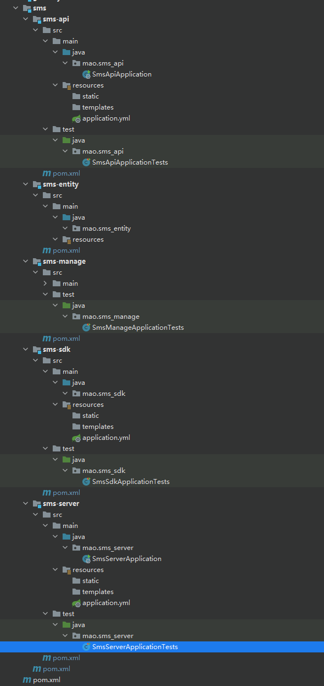


编译一次，观察是否能通过


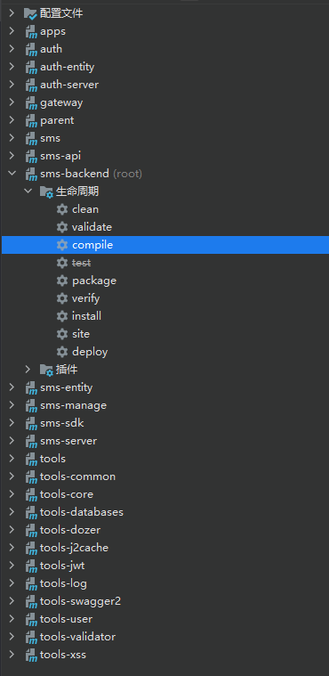


点击编译

```sh
[INFO] Scanning for projects...
[INFO] ------------------------------------------------------------------------
[INFO] Reactor Build Order:
[INFO] 
[INFO] parent                                                             [pom]
[INFO] tools                                                              [pom]
[INFO] tools-dozer                                                        [jar]
[INFO] tools-swagger2                                                     [jar]
[INFO] tools-validator                                                    [jar]
[INFO] tools-xss                                                          [jar]
[INFO] tools-core                                                         [jar]
[INFO] tools-common                                                       [jar]
[INFO] tools-j2cache                                                      [jar]
[INFO] tools-log                                                          [jar]
[INFO] tools-jwt                                                          [jar]
[INFO] tools-user                                                         [jar]
[INFO] tools-databases                                                    [jar]
[INFO] apps                                                               [pom]
[INFO] auth                                                               [pom]
[INFO] auth-entity                                                        [jar]
[INFO] auth-server                                                        [jar]
[INFO] gateway                                                            [jar]
[INFO] sms                                                                [pom]
[INFO] sms-entity                                                         [jar]
[INFO] sms-api                                                            [jar]
[INFO] sms-sdk                                                            [jar]
[INFO] sms-manage                                                         [jar]
[INFO] sms-server                                                         [jar]
[INFO] sms-backend                                                        [pom]
[INFO] 
[INFO] -----------------------------< mao:parent >-----------------------------
[INFO] Building parent 1.0-SNAPSHOT                                      [1/25]
[INFO] --------------------------------[ pom ]---------------------------------
[INFO] 
[INFO] -----------------------------< mao:tools >------------------------------
[INFO] Building tools 1.0-SNAPSHOT                                       [2/25]
[INFO] --------------------------------[ pom ]---------------------------------
[INFO] 
[INFO] --------------------------< mao:tools-dozer >---------------------------
[INFO] Building tools-dozer 1.0-SNAPSHOT                                 [3/25]
[INFO] --------------------------------[ jar ]---------------------------------
[INFO] 
[INFO] --- maven-resources-plugin:3.1.0:resources (default-resources) @ tools-dozer ---
[INFO] Using 'UTF-8' encoding to copy filtered resources.
[INFO] Copying 1 resource
[INFO] 
[INFO] --- maven-compiler-plugin:3.8.1:compile (default-compile) @ tools-dozer ---
[INFO] Changes detected - recompiling the module!
[INFO] Compiling 2 source files to H:\程序\大四上期\sms-backend\tools\tools-dozer\target\classes
[INFO] /H:/程序/大四上期/sms-backend/tools/tools-dozer/src/main/java/mao/toolsdozer/utils/DozerUtils.java: H:\程序\大四上期\sms-backend\tools\tools-dozer\src\main\java\mao\toolsdozer\utils\DozerUtils.java使用或覆盖了已过时的 API。
[INFO] /H:/程序/大四上期/sms-backend/tools/tools-dozer/src/main/java/mao/toolsdozer/utils/DozerUtils.java: 有关详细信息, 请使用 -Xlint:deprecation 重新编译。
[INFO] 
[INFO] -------------------------< mao:tools-swagger2 >-------------------------
[INFO] Building tools-swagger2 1.0-SNAPSHOT                              [4/25]
[INFO] --------------------------------[ jar ]---------------------------------
[INFO] 
[INFO] --- maven-resources-plugin:3.1.0:resources (default-resources) @ tools-swagger2 ---
[INFO] Using 'UTF-8' encoding to copy filtered resources.
[INFO] Copying 1 resource
[INFO] 
[INFO] --- maven-compiler-plugin:3.8.1:compile (default-compile) @ tools-swagger2 ---
[INFO] Changes detected - recompiling the module!
[INFO] Compiling 2 source files to H:\程序\大四上期\sms-backend\tools\tools-swagger2\target\classes
[INFO] 
[INFO] ------------------------< mao:tools-validator >-------------------------
[INFO] Building tools-validator 1.0-SNAPSHOT                             [5/25]
[INFO] --------------------------------[ jar ]---------------------------------
[WARNING] The artifact org.hibernate:hibernate-validator:jar:6.1.0.Final has been relocated to org.hibernate.validator:hibernate-validator:jar:6.1.0.Final
[INFO] 
[INFO] --- maven-resources-plugin:3.1.0:resources (default-resources) @ tools-validator ---
[INFO] Using 'UTF-8' encoding to copy filtered resources.
[INFO] Copying 0 resource
[INFO] 
[INFO] --- maven-compiler-plugin:3.8.1:compile (default-compile) @ tools-validator ---
[INFO] Changes detected - recompiling the module!
[INFO] Compiling 2 source files to H:\程序\大四上期\sms-backend\tools\tools-validator\target\classes
[INFO] 
[INFO] ---------------------------< mao:tools-xss >----------------------------
[INFO] Building tools-xss 1.0-SNAPSHOT                                   [6/25]
[INFO] --------------------------------[ jar ]---------------------------------
[INFO] 
[INFO] --- maven-resources-plugin:3.1.0:resources (default-resources) @ tools-xss ---
[INFO] Using 'UTF-8' encoding to copy filtered resources.
[INFO] Copying 3 resources
[INFO] 
[INFO] --- maven-compiler-plugin:3.8.1:compile (default-compile) @ tools-xss ---
[INFO] Changes detected - recompiling the module!
[INFO] Compiling 6 source files to H:\程序\大四上期\sms-backend\tools\tools-xss\target\classes
[INFO] 
[INFO] ---------------------------< mao:tools-core >---------------------------
[INFO] Building tools-core 1.0-SNAPSHOT                                  [7/25]
[INFO] --------------------------------[ jar ]---------------------------------
[INFO] 
[INFO] --- maven-resources-plugin:3.1.0:resources (default-resources) @ tools-core ---
[INFO] Using 'UTF-8' encoding to copy filtered resources.
[INFO] Copying 0 resource
[INFO] 
[INFO] --- maven-compiler-plugin:3.8.1:compile (default-compile) @ tools-core ---
[INFO] Changes detected - recompiling the module!
[INFO] Compiling 28 source files to H:\程序\大四上期\sms-backend\tools\tools-core\target\classes
[INFO] 
[INFO] --------------------------< mao:tools-common >--------------------------
[INFO] Building tools-common 1.0-SNAPSHOT                                [8/25]
[INFO] --------------------------------[ jar ]---------------------------------
[INFO] 
[INFO] --- maven-resources-plugin:3.1.0:resources (default-resources) @ tools-common ---
[INFO] Using 'UTF-8' encoding to copy filtered resources.
[INFO] Copying 0 resource
[INFO] 
[INFO] --- maven-compiler-plugin:3.8.1:compile (default-compile) @ tools-common ---
[INFO] Changes detected - recompiling the module!
[INFO] Compiling 12 source files to H:\程序\大四上期\sms-backend\tools\tools-common\target\classes
[INFO] /H:/程序/大四上期/sms-backend/tools/tools-common/src/main/java/mao/tools_common/converter/String2LocalTimeConverter.java: H:\程序\大四上期\sms-backend\tools\tools-common\src\main\java\mao\tools_common\converter\String2LocalTimeConverter.java使用了未经检查或不安全的操作。
[INFO] /H:/程序/大四上期/sms-backend/tools/tools-common/src/main/java/mao/tools_common/converter/String2LocalTimeConverter.java: 有关详细信息, 请使用 -Xlint:unchecked 重新编译。
[INFO] 
[INFO] -------------------------< mao:tools-j2cache >--------------------------
[INFO] Building tools-j2cache 1.0-SNAPSHOT                               [9/25]
[INFO] --------------------------------[ jar ]---------------------------------
[INFO] 
[INFO] --- maven-resources-plugin:3.1.0:resources (default-resources) @ tools-j2cache ---
[INFO] Using 'UTF-8' encoding to copy filtered resources.
[INFO] Copying 2 resources
[INFO] 
[INFO] --- maven-compiler-plugin:3.8.1:compile (default-compile) @ tools-j2cache ---
[INFO] Changes detected - recompiling the module!
[INFO] Compiling 21 source files to H:\程序\大四上期\sms-backend\tools\tools-j2cache\target\classes
[INFO] 
[INFO] ---------------------------< mao:tools-log >----------------------------
[INFO] Building tools-log 1.0-SNAPSHOT                                  [10/25]
[INFO] --------------------------------[ jar ]---------------------------------
[INFO] 
[INFO] --- maven-resources-plugin:3.1.0:resources (default-resources) @ tools-log ---
[INFO] Using 'UTF-8' encoding to copy filtered resources.
[INFO] Copying 2 resources
[INFO] 
[INFO] --- maven-compiler-plugin:3.8.1:compile (default-compile) @ tools-log ---
[INFO] Changes detected - recompiling the module!
[INFO] Compiling 9 source files to H:\程序\大四上期\sms-backend\tools\tools-log\target\classes
[INFO] 
[INFO] ---------------------------< mao:tools-jwt >----------------------------
[INFO] Building tools-jwt 1.0-SNAPSHOT                                  [11/25]
[INFO] --------------------------------[ jar ]---------------------------------
[INFO] 
[INFO] --- maven-resources-plugin:3.1.0:resources (default-resources) @ tools-jwt ---
[INFO] Using 'UTF-8' encoding to copy filtered resources.
[INFO] Copying 0 resource
[INFO] 
[INFO] --- maven-compiler-plugin:3.8.1:compile (default-compile) @ tools-jwt ---
[INFO] Changes detected - recompiling the module!
[INFO] Compiling 12 source files to H:\程序\大四上期\sms-backend\tools\tools-jwt\target\classes
[INFO] 
[INFO] ---------------------------< mao:tools-user >---------------------------
[INFO] Building tools-user 1.0-SNAPSHOT                                 [12/25]
[INFO] --------------------------------[ jar ]---------------------------------
[INFO] 
[INFO] --- maven-resources-plugin:3.1.0:resources (default-resources) @ tools-user ---
[INFO] Using 'UTF-8' encoding to copy filtered resources.
[INFO] Copying 0 resource
[INFO] 
[INFO] --- maven-compiler-plugin:3.8.1:compile (default-compile) @ tools-user ---
[INFO] Changes detected - recompiling the module!
[INFO] Compiling 12 source files to H:\程序\大四上期\sms-backend\tools\tools-user\target\classes
[INFO] 
[INFO] ------------------------< mao:tools-databases >-------------------------
[INFO] Building tools-databases 1.0-SNAPSHOT                            [13/25]
[INFO] --------------------------------[ jar ]---------------------------------
[INFO] 
[INFO] --- maven-resources-plugin:3.1.0:resources (default-resources) @ tools-databases ---
[INFO] Using 'UTF-8' encoding to copy filtered resources.
[INFO] Copying 0 resource
[INFO] 
[INFO] --- maven-compiler-plugin:3.8.1:compile (default-compile) @ tools-databases ---
[INFO] Changes detected - recompiling the module!
[INFO] Compiling 13 source files to H:\程序\大四上期\sms-backend\tools\tools-databases\target\classes
[INFO] /H:/程序/大四上期/sms-backend/tools/tools-databases/src/main/java/mao/tools_databases/mybatis/conditions/query/LbqWrapper.java: H:\程序\大四上期\sms-backend\tools\tools-databases\src\main\java\mao\tools_databases\mybatis\conditions\query\LbqWrapper.java使用了未经检查或不安全的操作。
[INFO] /H:/程序/大四上期/sms-backend/tools/tools-databases/src/main/java/mao/tools_databases/mybatis/conditions/query/LbqWrapper.java: 有关详细信息, 请使用 -Xlint:unchecked 重新编译。
[INFO] 
[INFO] ------------------------------< mao:apps >------------------------------
[INFO] Building apps 1.0-SNAPSHOT                                       [14/25]
[INFO] --------------------------------[ pom ]---------------------------------
[INFO] 
[INFO] ------------------------------< mao:auth >------------------------------
[INFO] Building auth 1.0-SNAPSHOT                                       [15/25]
[INFO] --------------------------------[ pom ]---------------------------------
[INFO] 
[INFO] --------------------------< mao:auth-entity >---------------------------
[INFO] Building auth-entity 1.0-SNAPSHOT                                [16/25]
[INFO] --------------------------------[ jar ]---------------------------------
[INFO] 
[INFO] --- maven-resources-plugin:3.1.0:resources (default-resources) @ auth-entity ---
[INFO] Using 'UTF-8' encoding to copy filtered resources.
[INFO] Copying 0 resource
[INFO] 
[INFO] --- maven-compiler-plugin:3.8.1:compile (default-compile) @ auth-entity ---
[INFO] Changes detected - recompiling the module!
[INFO] Compiling 43 source files to H:\程序\大四上期\sms-backend\apps\auth\auth-entity\target\classes
[INFO] 
[INFO] --------------------------< mao:auth-server >---------------------------
[INFO] Building auth-server 1.0-SNAPSHOT                                [17/25]
[INFO] --------------------------------[ jar ]---------------------------------
[INFO] 
[INFO] --- maven-resources-plugin:3.1.0:resources (default-resources) @ auth-server ---
[INFO] Using 'UTF-8' encoding to copy filtered resources.
[INFO] Copying 28 resources
[INFO] 
[INFO] --- maven-compiler-plugin:3.8.1:compile (default-compile) @ auth-server ---
[INFO] Changes detected - recompiling the module!
[INFO] Compiling 65 source files to H:\程序\大四上期\sms-backend\apps\auth\auth-server\target\classes
[INFO] 
[INFO] ----------------------------< mao:gateway >-----------------------------
[INFO] Building gateway 1.0-SNAPSHOT                                    [18/25]
[INFO] --------------------------------[ jar ]---------------------------------
[INFO] 
[INFO] --- maven-resources-plugin:3.1.0:resources (default-resources) @ gateway ---
[INFO] Using 'UTF-8' encoding to copy filtered resources.
[INFO] Copying 4 resources
[INFO] 
[INFO] --- maven-compiler-plugin:3.8.1:compile (default-compile) @ gateway ---
[INFO] Changes detected - recompiling the module!
[INFO] Compiling 7 source files to H:\程序\大四上期\sms-backend\apps\gateway\target\classes
[INFO] /H:/程序/大四上期/sms-backend/apps/gateway/src/main/java/mao/gateway/filter/AccessFilter.java: H:\程序\大四上期\sms-backend\apps\gateway\src\main\java\mao\gateway\filter\AccessFilter.java 使用或覆盖了标记为待删除的已过时 API。
[INFO] /H:/程序/大四上期/sms-backend/apps/gateway/src/main/java/mao/gateway/filter/AccessFilter.java: 有关详细信息, 请使用 -Xlint:removal 重新编译。
[INFO] /H:/程序/大四上期/sms-backend/apps/gateway/src/main/java/mao/gateway/filter/AccessFilter.java: H:\程序\大四上期\sms-backend\apps\gateway\src\main\java\mao\gateway\filter\AccessFilter.java使用了未经检查或不安全的操作。
[INFO] /H:/程序/大四上期/sms-backend/apps/gateway/src/main/java/mao/gateway/filter/AccessFilter.java: 有关详细信息, 请使用 -Xlint:unchecked 重新编译。
[INFO] 
[INFO] ------------------------------< mao:sms >-------------------------------
[INFO] Building sms 1.0-SNAPSHOT                                        [19/25]
[INFO] --------------------------------[ pom ]---------------------------------
[INFO] 
[INFO] ---------------------------< mao:sms-entity >---------------------------
[INFO] Building sms-entity 1.0-SNAPSHOT                                 [20/25]
[INFO] --------------------------------[ jar ]---------------------------------
[INFO] 
[INFO] --- maven-resources-plugin:3.1.0:resources (default-resources) @ sms-entity ---
[INFO] Using 'UTF-8' encoding to copy filtered resources.
[INFO] Copying 0 resource
[INFO] 
[INFO] --- maven-compiler-plugin:3.8.1:compile (default-compile) @ sms-entity ---
[INFO] Changes detected - recompiling the module!
[INFO] 
[INFO] ----------------------------< mao:sms-api >-----------------------------
[INFO] Building sms-api 1.0-SNAPSHOT                                    [21/25]
[INFO] --------------------------------[ jar ]---------------------------------
[INFO] 
[INFO] --- maven-resources-plugin:3.1.0:resources (default-resources) @ sms-api ---
[INFO] Using 'UTF-8' encoding to copy filtered resources.
[INFO] Copying 1 resource
[INFO] 
[INFO] --- maven-compiler-plugin:3.8.1:compile (default-compile) @ sms-api ---
[INFO] Changes detected - recompiling the module!
[INFO] Compiling 1 source file to H:\程序\大四上期\sms-backend\apps\sms\sms-api\target\classes
[INFO] 
[INFO] ----------------------------< mao:sms-sdk >-----------------------------
[INFO] Building sms-sdk 1.0-SNAPSHOT                                    [22/25]
[INFO] --------------------------------[ jar ]---------------------------------
[INFO] 
[INFO] --- maven-resources-plugin:3.1.0:resources (default-resources) @ sms-sdk ---
[INFO] Using 'UTF-8' encoding to copy filtered resources.
[INFO] Copying 1 resource
[INFO] 
[INFO] --- maven-compiler-plugin:3.8.1:compile (default-compile) @ sms-sdk ---
[INFO] Nothing to compile - all classes are up to date
[INFO] 
[INFO] ---------------------------< mao:sms-manage >---------------------------
[INFO] Building sms-manage 1.0-SNAPSHOT                                 [23/25]
[INFO] --------------------------------[ jar ]---------------------------------
[INFO] 
[INFO] --- maven-resources-plugin:3.1.0:resources (default-resources) @ sms-manage ---
[INFO] Using 'UTF-8' encoding to copy filtered resources.
[INFO] Copying 1 resource
[INFO] 
[INFO] --- maven-compiler-plugin:3.8.1:compile (default-compile) @ sms-manage ---
[INFO] Changes detected - recompiling the module!
[INFO] Compiling 1 source file to H:\程序\大四上期\sms-backend\apps\sms\sms-manage\target\classes
[INFO] 
[INFO] ---------------------------< mao:sms-server >---------------------------
[INFO] Building sms-server 1.0-SNAPSHOT                                 [24/25]
[INFO] --------------------------------[ jar ]---------------------------------
[INFO] 
[INFO] --- maven-resources-plugin:3.1.0:resources (default-resources) @ sms-server ---
[INFO] Using 'UTF-8' encoding to copy filtered resources.
[INFO] Copying 1 resource
[INFO] 
[INFO] --- maven-compiler-plugin:3.8.1:compile (default-compile) @ sms-server ---
[INFO] Changes detected - recompiling the module!
[INFO] Compiling 1 source file to H:\程序\大四上期\sms-backend\apps\sms\sms-server\target\classes
[INFO] 
[INFO] --------------------------< mao:sms-backend >---------------------------
[INFO] Building sms-backend 1.0-SNAPSHOT                                [25/25]
[INFO] --------------------------------[ pom ]---------------------------------
[INFO] ------------------------------------------------------------------------
[INFO] Reactor Summary for sms-backend 1.0-SNAPSHOT:
[INFO] 
[INFO] parent ............................................. SUCCESS [  0.003 s]
[INFO] tools .............................................. SUCCESS [  0.001 s]
[INFO] tools-dozer ........................................ SUCCESS [  3.240 s]
[INFO] tools-swagger2 ..................................... SUCCESS [  1.436 s]
[INFO] tools-validator .................................... SUCCESS [  0.804 s]
[INFO] tools-xss .......................................... SUCCESS [  1.105 s]
[INFO] tools-core ......................................... SUCCESS [  2.047 s]
[INFO] tools-common ....................................... SUCCESS [  1.651 s]
[INFO] tools-j2cache ...................................... SUCCESS [  2.075 s]
[INFO] tools-log .......................................... SUCCESS [  2.427 s]
[INFO] tools-jwt .......................................... SUCCESS [  1.429 s]
[INFO] tools-user ......................................... SUCCESS [  2.726 s]
[INFO] tools-databases .................................... SUCCESS [  2.637 s]
[INFO] apps ............................................... SUCCESS [  0.001 s]
[INFO] auth ............................................... SUCCESS [  0.001 s]
[INFO] auth-entity ........................................ SUCCESS [  3.119 s]
[INFO] auth-server ........................................ SUCCESS [  3.352 s]
[INFO] gateway ............................................ SUCCESS [  1.903 s]
[INFO] sms ................................................ SUCCESS [  0.001 s]
[INFO] sms-entity ......................................... SUCCESS [  0.160 s]
[INFO] sms-api ............................................ SUCCESS [  1.643 s]
[INFO] sms-sdk ............................................ SUCCESS [  0.136 s]
[INFO] sms-manage ......................................... SUCCESS [  1.667 s]
[INFO] sms-server ......................................... SUCCESS [  1.472 s]
[INFO] sms-backend ........................................ SUCCESS [  0.000 s]
[INFO] ------------------------------------------------------------------------
[INFO] BUILD SUCCESS
[INFO] ------------------------------------------------------------------------
[INFO] Total time:  35.994 s
[INFO] Finished at: 2022-12-15T22:11:05+08:00
[INFO] ------------------------------------------------------------------------
```


编译能通过


### 配置文件

#### sms-api模块


**biz.dozer.xml**

```xml
<?xml version="1.0" encoding="UTF-8"?>
<mappings xmlns:xsi="http://www.w3.org/2001/XMLSchema-instance"
          xmlns="http://dozermapper.github.io/schema/bean-mapping"
          xsi:schemaLocation="http://dozermapper.github.io/schema/bean-mapping
                             http://dozermapper.github.io/schema/bean-mapping.xsd">

</mappings>
```


**global.dozer.xml**

```xml
<?xml version="1.0" encoding="UTF-8"?>
<mappings xmlns:xsi="http://www.w3.org/2001/XMLSchema-instance"
          xmlns="http://dozermapper.github.io/schema/bean-mapping"
          xsi:schemaLocation="http://dozermapper.github.io/schema/bean-mapping http://dozermapper.github.io/schema/bean-mapping.xsd">
    <!--
    @see: http://www.jianshu.com/p/bf8f0e8aee23
    @see: http://blog.csdn.net/whhahyy/article/details/48594657
    全局配置:
    <date-format>表示日期格式
    <stop-on-errors>错误处理开关
    <wildcard>通配符
    <trim-strings>裁剪字符串开关
     -->
    <configuration>
        <date-format>yyyy-MM-dd HH:mm:ss</date-format>
    </configuration>
</mappings>
```


**application.yml**

```yaml
server:
  port: 8771
```


**bootstrap.yml**

```yaml
# @xxx@ 从pom.xml中取值, 所以 @xx@ 标注的值，都不能从nacos中获取
def:
  nacos:
    ip: ${NACOS_IP:@pom.nacos.ip@}
    port: ${NACOS_PORT:@pom.nacos.port@}
    namespace: ${NACOS_ID:@pom.nacos.namespace@}

spring:
  main:
    allow-bean-definition-overriding: true
  application:
    name: @project.artifactId@
  profiles:
    active: @pom.profile.name@
  cloud:
    nacos:
      config: #配置中心相关
        server-addr: ${def.nacos.ip}:${def.nacos.port}
        file-extension: yml
        namespace: ${def.nacos.namespace}
        shared-dataids: common.yml,redis.yml,mysql.yml
        refreshable-dataids: common.yml
        enabled: true
      discovery: #服务注册中心相关
        # 是否为临时实例
        ephemeral: false
        server-addr: ${def.nacos.ip}:${def.nacos.port}
        namespace: ${def.nacos.namespace}
        metadata: # 元数据，用于权限服务实时获取各个服务的所有接口
          management.context-path: ${server.servlet.context-path:}${spring.mvc.servlet.path:}${management.endpoints.web.base-path:}


  aop:
    proxy-target-class: true
    auto: true

# 只能配置在bootstrap.yml ，否则会生成 log.path_IS_UNDEFINED 文件夹
# window会自动在 代码所在盘 根目录下自动创建文件夹，  如： D:/data/projects/logs
logging:
  file:
    path: ./logs
    name: ${logging.file.path}/${spring.application.name}/root.log

# 用于/actuator/info
info:
  name: '@project.name@'
  description: '@project.description@'
  version: '@project.version@'
  spring-boot-version: '@spring.boot.version@'
  spring-cloud-version: '@spring.cloud.version@'
```


**spy.properties**

```properties
module.log=com.p6spy.engine.logging.P6LogFactory,com.p6spy.engine.outage.P6OutageFactory
# \u81EA\u5B9A\u4E49\u65E5\u5FD7\u6253\u5370
logMessageFormat=com.baomidou.mybatisplus.extension.p6spy.P6SpyLogger
#\u65E5\u5FD7\u8F93\u51FA\u5230\u63A7\u5236\u53F0
appender=com.baomidou.mybatisplus.extension.p6spy.StdoutLogger
# \u4F7F\u7528\u65E5\u5FD7\u7CFB\u7EDF\u8BB0\u5F55 sql
#appender=com.p6spy.engine.spy.appender.Slf4JLogger
# \u8BBE\u7F6E p6spy driver \u4EE3\u7406
deregisterdrivers=true
# \u53D6\u6D88JDBC URL\u524D\u7F00
useprefix=true
# \u914D\u7F6E\u8BB0\u5F55 Log \u4F8B\u5916,\u53EF\u53BB\u6389\u7684\u7ED3\u679C\u96C6\u6709error,info,batch,debug,statement,commit,rollback,result,resultset.
excludecategories=info,debug,result,commit,resultset
# \u65E5\u671F\u683C\u5F0F
dateformat=yyyy-MM-dd HH:mm:ss
# \u5B9E\u9645\u9A71\u52A8\u53EF\u591A\u4E2A
driverlist=com.mysql.cj.jdbc.Driver
# \u662F\u5426\u5F00\u542F\u6162SQL\u8BB0\u5F55
outagedetection=true
# \u6162SQL\u8BB0\u5F55\u6807\u51C6 2 \u79D2
outagedetectioninterval=2
```


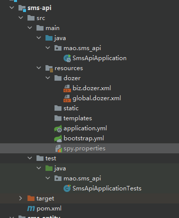


#### sms-manage模块


**biz.dozer.xml**

```xml
<?xml version="1.0" encoding="UTF-8"?>
<mappings xmlns:xsi="http://www.w3.org/2001/XMLSchema-instance"
          xmlns="http://dozermapper.github.io/schema/bean-mapping"
          xsi:schemaLocation="http://dozermapper.github.io/schema/bean-mapping
                             http://dozermapper.github.io/schema/bean-mapping.xsd">

</mappings>
```


**global.dozer.xml**

```xml
<?xml version="1.0" encoding="UTF-8"?>
<mappings xmlns:xsi="http://www.w3.org/2001/XMLSchema-instance"
          xmlns="http://dozermapper.github.io/schema/bean-mapping"
          xsi:schemaLocation="http://dozermapper.github.io/schema/bean-mapping http://dozermapper.github.io/schema/bean-mapping.xsd">
    <!--
    @see: http://www.jianshu.com/p/bf8f0e8aee23
    @see: http://blog.csdn.net/whhahyy/article/details/48594657
    全局配置:
    <date-format>表示日期格式
    <stop-on-errors>错误处理开关
    <wildcard>通配符
    <trim-strings>裁剪字符串开关
     -->
    <configuration>
        <date-format>yyyy-MM-dd HH:mm:ss</date-format>
    </configuration>
</mappings>
```


**application.yml**

```yaml
server:
  port: 8770
```


**bootstrap.yml**

```yaml
# @xxx@ 从pom.xml中取值, 所以 @xx@ 标注的值，都不能从nacos中获取
def:
  nacos:
    ip: ${NACOS_IP:@pom.nacos.ip@}
    port: ${NACOS_PORT:@pom.nacos.port@}
    namespace: ${NACOS_ID:@pom.nacos.namespace@}

spring:
  main:
    allow-bean-definition-overriding: true
  application:
    name: @project.artifactId@
  profiles:
    active: @pom.profile.name@
  cloud:
    nacos:
      config: #配置中心相关
        server-addr: ${def.nacos.ip}:${def.nacos.port}
        file-extension: yml
        namespace: ${def.nacos.namespace}
        shared-dataids: common.yml,redis.yml,mysql.yml
        refreshable-dataids: common.yml
        enabled: true
      discovery: #服务注册中心相关
        # 是否为临时实例
        ephemeral: false
        server-addr: ${def.nacos.ip}:${def.nacos.port}
        namespace: ${def.nacos.namespace}
        metadata: # 元数据，用于权限服务实时获取各个服务的所有接口
          management.context-path: ${server.servlet.context-path:}${spring.mvc.servlet.path:}${management.endpoints.web.base-path:}


  aop:
    proxy-target-class: true
    auto: true

# 只能配置在bootstrap.yml ，否则会生成 log.path_IS_UNDEFINED 文件夹
# window会自动在 代码所在盘 根目录下自动创建文件夹，  如： D:/data/projects/logs
logging:
  file:
    path: ./logs
    name: ${logging.file.path}/${spring.application.name}/root.log

# 用于/actuator/info
info:
  name: '@project.name@'
  description: '@project.description@'
  version: '@project.version@'
  spring-boot-version: '@spring.boot.version@'
  spring-cloud-version: '@spring.cloud.version@'
```


**spy.properties**

```properties
module.log=com.p6spy.engine.logging.P6LogFactory,com.p6spy.engine.outage.P6OutageFactory
# \u81EA\u5B9A\u4E49\u65E5\u5FD7\u6253\u5370
logMessageFormat=com.baomidou.mybatisplus.extension.p6spy.P6SpyLogger
#\u65E5\u5FD7\u8F93\u51FA\u5230\u63A7\u5236\u53F0
appender=com.baomidou.mybatisplus.extension.p6spy.StdoutLogger
# \u4F7F\u7528\u65E5\u5FD7\u7CFB\u7EDF\u8BB0\u5F55 sql
#appender=com.p6spy.engine.spy.appender.Slf4JLogger
# \u8BBE\u7F6E p6spy driver \u4EE3\u7406
deregisterdrivers=true
# \u53D6\u6D88JDBC URL\u524D\u7F00
useprefix=true
# \u914D\u7F6E\u8BB0\u5F55 Log \u4F8B\u5916,\u53EF\u53BB\u6389\u7684\u7ED3\u679C\u96C6\u6709error,info,batch,debug,statement,commit,rollback,result,resultset.
excludecategories=info,debug,result,commit,resultset
# \u65E5\u671F\u683C\u5F0F
dateformat=yyyy-MM-dd HH:mm:ss
# \u5B9E\u9645\u9A71\u52A8\u53EF\u591A\u4E2A
driverlist=com.mysql.cj.jdbc.Driver
# \u662F\u5426\u5F00\u542F\u6162SQL\u8BB0\u5F55
outagedetection=true
# \u6162SQL\u8BB0\u5F55\u6807\u51C6 2 \u79D2
outagedetectioninterval=2
```


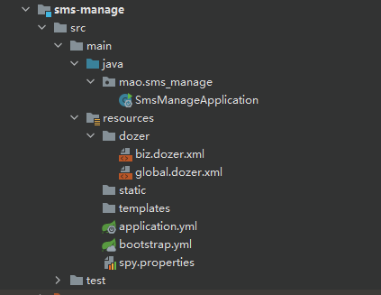


#### sms-server模块

**biz.dozer.xml**

```xml
<?xml version="1.0" encoding="UTF-8"?>
<mappings xmlns:xsi="http://www.w3.org/2001/XMLSchema-instance"
          xmlns="http://dozermapper.github.io/schema/bean-mapping"
          xsi:schemaLocation="http://dozermapper.github.io/schema/bean-mapping
                             http://dozermapper.github.io/schema/bean-mapping.xsd">

</mappings>
```


**global.dozer.xml**

```xml
<?xml version="1.0" encoding="UTF-8"?>
<mappings xmlns:xsi="http://www.w3.org/2001/XMLSchema-instance"
          xmlns="http://dozermapper.github.io/schema/bean-mapping"
          xsi:schemaLocation="http://dozermapper.github.io/schema/bean-mapping http://dozermapper.github.io/schema/bean-mapping.xsd">
    <!--
    @see: http://www.jianshu.com/p/bf8f0e8aee23
    @see: http://blog.csdn.net/whhahyy/article/details/48594657
    全局配置:
    <date-format>表示日期格式
    <stop-on-errors>错误处理开关
    <wildcard>通配符
    <trim-strings>裁剪字符串开关
     -->
    <configuration>
        <date-format>yyyy-MM-dd HH:mm:ss</date-format>
    </configuration>
</mappings>
```


**application.yml**

```yaml
server:
  port: 8772
```


**bootstrap.yml**

```yaml
# @xxx@ 从pom.xml中取值, 所以 @xx@ 标注的值，都不能从nacos中获取
def:
  nacos:
    ip: ${NACOS_IP:@pom.nacos.ip@}
    port: ${NACOS_PORT:@pom.nacos.port@}
    namespace: ${NACOS_ID:@pom.nacos.namespace@}

spring:
  main:
    allow-bean-definition-overriding: true
  application:
    name: @project.artifactId@
  profiles:
    active: @pom.profile.name@
  cloud:
    nacos:
      config: #配置中心相关
        server-addr: ${def.nacos.ip}:${def.nacos.port}
        file-extension: yml
        namespace: ${def.nacos.namespace}
        shared-dataids: common.yml,redis.yml,mysql.yml
        refreshable-dataids: common.yml
        enabled: true
      discovery: #服务注册中心相关
        # 是否为临时实例
        ephemeral: false
        server-addr: ${def.nacos.ip}:${def.nacos.port}
        namespace: ${def.nacos.namespace}
        metadata: # 元数据，用于权限服务实时获取各个服务的所有接口
          management.context-path: ${server.servlet.context-path:}${spring.mvc.servlet.path:}${management.endpoints.web.base-path:}


  aop:
    proxy-target-class: true
    auto: true

# 只能配置在bootstrap.yml ，否则会生成 log.path_IS_UNDEFINED 文件夹
# window会自动在 代码所在盘 根目录下自动创建文件夹，  如： D:/data/projects/logs
logging:
  file:
    path: ./logs
    name: ${logging.file.path}/${spring.application.name}/root.log

# 用于/actuator/info
info:
  name: '@project.name@'
  description: '@project.description@'
  version: '@project.version@'
  spring-boot-version: '@spring.boot.version@'
  spring-cloud-version: '@spring.cloud.version@'
```


**spy.properties**

```properties
module.log=com.p6spy.engine.logging.P6LogFactory,com.p6spy.engine.outage.P6OutageFactory
# \u81EA\u5B9A\u4E49\u65E5\u5FD7\u6253\u5370
logMessageFormat=com.baomidou.mybatisplus.extension.p6spy.P6SpyLogger
#\u65E5\u5FD7\u8F93\u51FA\u5230\u63A7\u5236\u53F0
appender=com.baomidou.mybatisplus.extension.p6spy.StdoutLogger
# \u4F7F\u7528\u65E5\u5FD7\u7CFB\u7EDF\u8BB0\u5F55 sql
#appender=com.p6spy.engine.spy.appender.Slf4JLogger
# \u8BBE\u7F6E p6spy driver \u4EE3\u7406
deregisterdrivers=true
# \u53D6\u6D88JDBC URL\u524D\u7F00
useprefix=true
# \u914D\u7F6E\u8BB0\u5F55 Log \u4F8B\u5916,\u53EF\u53BB\u6389\u7684\u7ED3\u679C\u96C6\u6709error,info,batch,debug,statement,commit,rollback,result,resultset.
excludecategories=info,debug,result,commit,resultset
# \u65E5\u671F\u683C\u5F0F
dateformat=yyyy-MM-dd HH:mm:ss
# \u5B9E\u9645\u9A71\u52A8\u53EF\u591A\u4E2A
driverlist=com.mysql.cj.jdbc.Driver
# \u662F\u5426\u5F00\u542F\u6162SQL\u8BB0\u5F55
outagedetection=true
# \u6162SQL\u8BB0\u5F55\u6807\u51C6 2 \u79D2
outagedetectioninterval=2
```


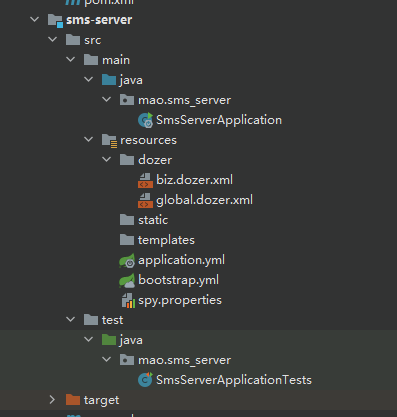


### 启动测试

#### sms-api模块

```sh
  .   ____          _            __ _ _
 /\\ / ___'_ __ _ _(_)_ __  __ _ \ \ \ \
( ( )\___ | '_ | '_| | '_ \/ _` | \ \ \ \
 \\/  ___)| |_)| | | | | || (_| |  ) ) ) )
  '  |____| .__|_| |_|_| |_\__, | / / / /
 =========|_|==============|___/=/_/_/_/
 :: Spring Boot ::        (v2.2.9.RELEASE)

2022-12-16 20:42:55.200  WARN 6156 --- [           main] c.a.c.n.c.NacosPropertySourceBuilder     : Ignore the empty nacos configuration and get it based on dataId[sms-api] & group[DEFAULT_GROUP]
2022-12-16 20:42:55.211  INFO 6156 --- [           main] b.c.PropertySourceBootstrapConfiguration : Located property source: [BootstrapPropertySource {name='bootstrapProperties-sms-api-dev.yml,DEFAULT_GROUP'}, BootstrapPropertySource {name='bootstrapProperties-sms-api.yml,DEFAULT_GROUP'}, BootstrapPropertySource {name='bootstrapProperties-sms-api,DEFAULT_GROUP'}, BootstrapPropertySource {name='bootstrapProperties-mysql.yml,DEFAULT_GROUP'}, BootstrapPropertySource {name='bootstrapProperties-redis.yml,DEFAULT_GROUP'}, BootstrapPropertySource {name='bootstrapProperties-common.yml,DEFAULT_GROUP'}]
2022-12-16 20:42:55.254  INFO 6156 --- [           main] mao.sms_api.SmsApiApplication            : The following profiles are active: dev
2022-12-16 20:42:56.477  INFO 6156 --- [           main] .s.d.r.c.RepositoryConfigurationDelegate : Multiple Spring Data modules found, entering strict repository configuration mode!
2022-12-16 20:42:56.481  INFO 6156 --- [           main] .s.d.r.c.RepositoryConfigurationDelegate : Bootstrapping Spring Data Redis repositories in DEFAULT mode.
2022-12-16 20:42:56.505  INFO 6156 --- [           main] .s.d.r.c.RepositoryConfigurationDelegate : Finished Spring Data repository scanning in 7ms. Found 0 Redis repository interfaces.
2022-12-16 20:42:56.603  WARN 6156 --- [           main] o.s.boot.actuate.endpoint.EndpointId     : Endpoint ID 'service-registry' contains invalid characters, please migrate to a valid format.
2022-12-16 20:42:56.706  WARN 6156 --- [           main] o.m.s.mapper.ClassPathMapperScanner      : No MyBatis mapper was found in '[mao.sms_api]' package. Please check your configuration.
2022-12-16 20:42:56.774  INFO 6156 --- [           main] o.s.cloud.context.scope.GenericScope     : BeanFactory id=8d953c04-6eee-3eb4-9b75-8c994dd97c86
2022-12-16 20:42:56.953  INFO 6156 --- [           main] trationDelegate$BeanPostProcessorChecker : Bean 'org.springframework.transaction.annotation.ProxyTransactionManagementConfiguration' of type [org.springframework.transaction.annotation.ProxyTransactionManagementConfiguration] is not eligible for getting processed by all BeanPostProcessors (for example: not eligible for auto-proxying)
2022-12-16 20:42:57.431  INFO 6156 --- [           main] o.s.b.w.embedded.tomcat.TomcatWebServer  : Tomcat initialized with port(s): 8771 (http)
2022-12-16 20:42:57.440  INFO 6156 --- [           main] o.apache.catalina.core.StandardService   : Starting service [Tomcat]
2022-12-16 20:42:57.440  INFO 6156 --- [           main] org.apache.catalina.core.StandardEngine  : Starting Servlet engine: [Apache Tomcat/9.0.37]
2022-12-16 20:42:57.580  INFO 6156 --- [           main] o.a.c.c.C.[Tomcat].[localhost].[/]       : Initializing Spring embedded WebApplicationContext
2022-12-16 20:42:57.580  INFO 6156 --- [           main] w.s.c.ServletWebServerApplicationContext : Root WebApplicationContext: initialization completed in 2313 ms
2022-12-16 20:42:57.602  INFO 6156 --- [           main] m.tools_xss.config.XssAuthConfiguration  : 初始化 XssAuthConfiguration xss攻击配置
2022-12-16 20:42:57.711  WARN 6156 --- [           main] c.n.c.sources.URLConfigurationSource     : No URLs will be polled as dynamic configuration sources.
2022-12-16 20:42:57.711  INFO 6156 --- [           main] c.n.c.sources.URLConfigurationSource     : To enable URLs as dynamic configuration sources, define System property archaius.configurationSource.additionalUrls or make config.properties available on classpath.
2022-12-16 20:42:57.722  INFO 6156 --- [           main] c.netflix.config.DynamicPropertyFactory  : DynamicPropertyFactory is initialized with configuration sources: com.netflix.config.ConcurrentCompositeConfiguration@7f5614f9
2022-12-16 20:42:57.812 DEBUG 6156 --- [           main] mao.tools_xss.filter.XssFilter           : XSS fiter [XSSFilter] init start ...
2022-12-16 20:42:57.862 DEBUG 6156 --- [           main] mao.tools_xss.filter.XssFilter           : ignorePathList=null
2022-12-16 20:42:57.865 DEBUG 6156 --- [           main] mao.tools_xss.filter.XssFilter           : ignoreParamValueList=["samlp:LogoutRequest"]
2022-12-16 20:42:57.865 DEBUG 6156 --- [           main] mao.tools_xss.filter.XssFilter           : XSS fiter [XSSFilter] init end
2022-12-16 20:42:58.577  INFO 6156 --- [           main] com.alibaba.nacos.client.naming          : initializer namespace from System Property :null
2022-12-16 20:42:58.578  INFO 6156 --- [           main] com.alibaba.nacos.client.naming          : initializer namespace from System Environment :null
2022-12-16 20:42:58.579  INFO 6156 --- [           main] com.alibaba.nacos.client.naming          : initializer namespace from System Property :null
2022-12-16 20:42:58.615  INFO 6156 --- [           main] c.a.d.s.b.a.DruidDataSourceAutoConfigure : Init DruidDataSource
2022-12-16 20:42:59.297  INFO 6156 --- [           main] com.alibaba.druid.pool.DruidDataSource   : {dataSource-1} inited
2022-12-16 20:42:59.706  INFO 6156 --- [           main] o.s.b.a.e.web.EndpointLinksResolver      : Exposing 20 endpoint(s) beneath base path '/actuator'
2022-12-16 20:42:59.785  WARN 6156 --- [           main] c.n.c.sources.URLConfigurationSource     : No URLs will be polled as dynamic configuration sources.
2022-12-16 20:42:59.785  INFO 6156 --- [           main] c.n.c.sources.URLConfigurationSource     : To enable URLs as dynamic configuration sources, define System property archaius.configurationSource.additionalUrls or make config.properties available on classpath.
2022-12-16 20:42:59.961  INFO 6156 --- [           main] o.s.s.concurrent.ThreadPoolTaskExecutor  : Initializing ExecutorService 'applicationTaskExecutor'
2022-12-16 20:43:00.103  INFO 6156 --- [           main] o.s.s.c.ThreadPoolTaskScheduler          : Initializing ExecutorService 'Nacos-Watch-Task-Scheduler'
2022-12-16 20:43:00.550  INFO 6156 --- [           main] mao.tools_log.utils.AddressUtil          : bean [org.lionsoul.ip2region.DbConfig@68c4db77]
2022-12-16 20:43:00.550  INFO 6156 --- [           main] mao.tools_log.utils.AddressUtil          : bean [org.lionsoul.ip2region.DbSearcher@775c4054]
2022-12-16 20:43:00.603 DEBUG 6156 --- [           main] mao.tools_xss.utils.XssUtils             :  start read XSS configfile [antisamy-slashdot-1.4.4.xml]
2022-12-16 20:43:00.612 DEBUG 6156 --- [           main] mao.tools_xss.utils.XssUtils             : read XSS configfile [antisamy-slashdot-1.4.4.xml] success
 _ _   |_  _ _|_. ___ _ |    _ 
| | |\/|_)(_| | |_\  |_)||_|_\ 
     /               |         
                        3.2.0 
2022-12-16 20:43:00.675  INFO 6156 --- [           main] c.g.d.core.DozerBeanMapperBuilder        : Initializing Dozer. Version: 6.5.0, Thread Name: main
2022-12-16 20:43:00.676  INFO 6156 --- [           main] c.g.dozermapper.core.util.RuntimeUtils   : OSGi support is false
2022-12-16 20:43:00.682  INFO 6156 --- [           main] d.c.c.r.LegacyPropertiesSettingsResolver : Trying to find Dozer configuration file: dozer.properties
2022-12-16 20:43:00.686  INFO 6156 --- [           main] d.c.c.r.LegacyPropertiesSettingsResolver : Failed to find dozer.properties via com.github.dozermapper.core.config.resolvers.LegacyPropertiesSettingsResolver.
2022-12-16 20:43:00.692  INFO 6156 --- [           main] c.g.d.core.el.ELExpressionFactory        : javax.el support is true
2022-12-16 20:43:00.723  INFO 6156 --- [           main] c.g.d.c.b.xml.BeanMappingXMLBuilder      : Using URL [file:/H:/%e7%a8%8b%e5%ba%8f/%e5%a4%a7%e5%9b%9b%e4%b8%8a%e6%9c%9f/sms-backend/apps/sms/sms-api/target/classes/dozer/global.dozer.xml] to load custom xml mappings
2022-12-16 20:43:01.101  INFO 6156 --- [           main] c.g.d.c.b.xml.SchemaLSResourceResolver   : Trying to resolve XML entity with public ID [null] and system ID [http://dozermapper.github.io/schema/bean-mapping.xsd]
2022-12-16 20:43:01.104  INFO 6156 --- [           main] c.g.d.c.b.xml.SchemaLSResourceResolver   : Resolved public ID [null] and system ID [http://dozermapper.github.io/schema/bean-mapping.xsd]
2022-12-16 20:43:01.142  INFO 6156 --- [           main] c.g.d.c.b.xml.BeanMappingXMLBuilder      : Successfully loaded custom xml mapping.
2022-12-16 20:43:01.143  INFO 6156 --- [           main] c.g.d.c.b.xml.BeanMappingXMLBuilder      : Using URL [file:/H:/%e7%a8%8b%e5%ba%8f/%e5%a4%a7%e5%9b%9b%e4%b8%8a%e6%9c%9f/sms-backend/apps/sms/sms-api/target/classes/dozer/biz.dozer.xml] to load custom xml mappings
2022-12-16 20:43:01.145  INFO 6156 --- [           main] c.g.d.c.b.xml.SchemaLSResourceResolver   : Trying to resolve XML entity with public ID [null] and system ID [http://dozermapper.github.io/schema/bean-mapping.xsd]
2022-12-16 20:43:01.146  INFO 6156 --- [           main] c.g.d.c.b.xml.SchemaLSResourceResolver   : Resolved public ID [null] and system ID [http://dozermapper.github.io/schema/bean-mapping.xsd]
2022-12-16 20:43:01.151  INFO 6156 --- [           main] c.g.d.c.b.xml.BeanMappingXMLBuilder      : Successfully loaded custom xml mapping.
2022-12-16 20:43:01.163  INFO 6156 --- [           main] m.tools_log.config.LogAutoConfiguration  : 初始化 LogAutoConfiguration
2022-12-16 20:43:01.168  INFO 6156 --- [           main] m.t.config.DozerAutoConfiguration        : 初始化 DozerAutoConfiguration
2022-12-16 20:43:01.183  INFO 6156 --- [           main] pertySourcedRequestMappingHandlerMapping : Mapped URL path [/v2/api-docs] onto method [springfox.documentation.swagger2.web.Swagger2Controller#getDocumentation(String, HttpServletRequest)]
2022-12-16 20:43:01.193  INFO 6156 --- [           main] m.t.config.SwaggerAutoConfiguration      : 初始化swagger接口文档
2022-12-16 20:43:01.193  INFO 6156 --- [           main] m.t.config.SwaggerAutoConfiguration      : 
title：在线文档
group：
description：在线文档
version：1.0
contact：Contact{name='', url='', email=''}
basePackage：
basePath：[]
excludePath：[]
docket：{sms=DocketInfo{title='短信接收服务', group='', description='在线文档', version='1.0', contact=Contact{name='', url='', email=''}, basePackage='mao.sms_api.controller', basePath=[], excludePath=[]}}

2022-12-16 20:43:02.049  INFO 6156 --- [           main] com.alibaba.nacos.client.naming          : new ips(1) service: DEFAULT_GROUP@@sms-api@@DEFAULT -> [{"instanceId":"192.168.3.143#8771#DEFAULT#DEFAULT_GROUP@@sms-api","ip":"192.168.3.143","port":8771,"weight":1.0,"healthy":true,"enabled":true,"ephemeral":false,"clusterName":"DEFAULT","serviceName":"DEFAULT_GROUP@@sms-api","metadata":{"preserved.register.source":"SPRING_CLOUD","management.endpoints.web.base-path":"/actuator","management.context-path":"/actuator"},"instanceHeartBeatInterval":5000,"instanceHeartBeatTimeOut":15000,"ipDeleteTimeout":30000}]
2022-12-16 20:43:02.060  INFO 6156 --- [           main] com.alibaba.nacos.client.naming          : current ips:(1) service: DEFAULT_GROUP@@sms-api@@DEFAULT -> [{"instanceId":"192.168.3.143#8771#DEFAULT#DEFAULT_GROUP@@sms-api","ip":"192.168.3.143","port":8771,"weight":1.0,"healthy":true,"enabled":true,"ephemeral":false,"clusterName":"DEFAULT","serviceName":"DEFAULT_GROUP@@sms-api","metadata":{"preserved.register.source":"SPRING_CLOUD","management.endpoints.web.base-path":"/actuator","management.context-path":"/actuator"},"instanceHeartBeatInterval":5000,"instanceHeartBeatTimeOut":15000,"ipDeleteTimeout":30000}]
2022-12-16 20:43:02.062  INFO 6156 --- [           main] d.s.w.p.DocumentationPluginsBootstrapper : Context refreshed
2022-12-16 20:43:02.086  INFO 6156 --- [           main] d.s.w.p.DocumentationPluginsBootstrapper : Found 1 custom documentation plugin(s)
2022-12-16 20:43:02.135  INFO 6156 --- [           main] s.d.s.w.s.ApiListingReferenceScanner     : Scanning for api listing references
2022-12-16 20:43:02.193  INFO 6156 --- [           main] o.s.b.w.embedded.tomcat.TomcatWebServer  : Tomcat started on port(s): 8771 (http) with context path ''
2022-12-16 20:43:02.197  INFO 6156 --- [           main] com.alibaba.nacos.client.naming          : [REGISTER-SERVICE] 2051a6a2-ba78-4dac-85a2-f991dd5162f2 registering service DEFAULT_GROUP@@sms-api with instance: Instance{instanceId='null', ip='192.168.3.143', port=8771, weight=1.0, healthy=true, enabled=true, ephemeral=false, clusterName='DEFAULT', serviceName='null', metadata={preserved.register.source=SPRING_CLOUD, management.endpoints.web.base-path=/actuator, management.context-path=/actuator}}
2022-12-16 20:43:02.202  INFO 6156 --- [           main] c.a.c.n.registry.NacosServiceRegistry    : nacos registry, DEFAULT_GROUP sms-api 192.168.3.143:8771 register finished
2022-12-16 20:43:02.442  INFO 6156 --- [           main] mao.sms_api.SmsApiApplication            : Started SmsApiApplication in 8.751 seconds (JVM running for 9.799)
2022-12-16 20:43:02.452  INFO 6156 --- [           main] c.a.n.client.config.impl.ClientWorker    : [fixed-127.0.0.1_8848-2051a6a2-ba78-4dac-85a2-f991dd5162f2] [subscribe] sms-api-dev.yml+DEFAULT_GROUP+2051a6a2-ba78-4dac-85a2-f991dd5162f2
2022-12-16 20:43:02.453  INFO 6156 --- [           main] c.a.nacos.client.config.impl.CacheData   : [fixed-127.0.0.1_8848-2051a6a2-ba78-4dac-85a2-f991dd5162f2] [add-listener] ok, tenant=2051a6a2-ba78-4dac-85a2-f991dd5162f2, dataId=sms-api-dev.yml, group=DEFAULT_GROUP, cnt=1
2022-12-16 20:43:02.454  INFO 6156 --- [           main] c.a.n.client.config.impl.ClientWorker    : [fixed-127.0.0.1_8848-2051a6a2-ba78-4dac-85a2-f991dd5162f2] [subscribe] sms-api+DEFAULT_GROUP+2051a6a2-ba78-4dac-85a2-f991dd5162f2
2022-12-16 20:43:02.454  INFO 6156 --- [           main] c.a.nacos.client.config.impl.CacheData   : [fixed-127.0.0.1_8848-2051a6a2-ba78-4dac-85a2-f991dd5162f2] [add-listener] ok, tenant=2051a6a2-ba78-4dac-85a2-f991dd5162f2, dataId=sms-api, group=DEFAULT_GROUP, cnt=1
2022-12-16 20:43:02.455  INFO 6156 --- [           main] c.a.n.client.config.impl.ClientWorker    : [fixed-127.0.0.1_8848-2051a6a2-ba78-4dac-85a2-f991dd5162f2] [subscribe] sms-api.yml+DEFAULT_GROUP+2051a6a2-ba78-4dac-85a2-f991dd5162f2
2022-12-16 20:43:02.455  INFO 6156 --- [           main] c.a.nacos.client.config.impl.CacheData   : [fixed-127.0.0.1_8848-2051a6a2-ba78-4dac-85a2-f991dd5162f2] [add-listener] ok, tenant=2051a6a2-ba78-4dac-85a2-f991dd5162f2, dataId=sms-api.yml, group=DEFAULT_GROUP, cnt=1
2022-12-16 20:43:02.456  INFO 6156 --- [           main] c.a.n.client.config.impl.ClientWorker    : [fixed-127.0.0.1_8848-2051a6a2-ba78-4dac-85a2-f991dd5162f2] [subscribe] common.yml+DEFAULT_GROUP+2051a6a2-ba78-4dac-85a2-f991dd5162f2
2022-12-16 20:43:02.456  INFO 6156 --- [           main] c.a.nacos.client.config.impl.CacheData   : [fixed-127.0.0.1_8848-2051a6a2-ba78-4dac-85a2-f991dd5162f2] [add-listener] ok, tenant=2051a6a2-ba78-4dac-85a2-f991dd5162f2, dataId=common.yml, group=DEFAULT_GROUP, cnt=1
2022-12-16 20:43:02.457  INFO 6156 --- [           main] mao.sms_api.SmsApiApplication            : 应用sms-api启动成功!swagger地址：http://192.168.80.1:8771/doc.html
2022-12-16 20:43:02.457  INFO 6156 --- [           main] mao.sms_api.SmsApiApplication            : 启动耗时：8866ms
2022-12-16 20:43:02.910  INFO 6156 --- [1)-192.168.80.1] o.a.c.c.C.[Tomcat].[localhost].[/]       : Initializing Spring DispatcherServlet 'dispatcherServlet'
2022-12-16 20:43:02.910  INFO 6156 --- [1)-192.168.80.1] o.s.web.servlet.DispatcherServlet        : Initializing Servlet 'dispatcherServlet'
2022-12-16 20:43:02.921  INFO 6156 --- [1)-192.168.80.1] o.s.web.servlet.DispatcherServlet        : Completed initialization in 11 ms
2022-12-16 20:43:03.205  INFO 6156 --- [g.push.receiver] com.alibaba.nacos.client.naming          : received push data: {"type":"dom","data":"{\"hosts\":[{\"ip\":\"192.168.3.143\",\"port\":8771,\"valid\":true,\"healthy\":true,\"marked\":false,\"instanceId\":\"192.168.3.143#8771#DEFAULT#DEFAULT_GROUP@@sms-api\",\"metadata\":{\"preserved.register.source\":\"SPRING_CLOUD\",\"management.endpoints.web.base-path\":\"/actuator\",\"management.context-path\":\"/actuator\"},\"enabled\":true,\"weight\":1.0,\"clusterName\":\"DEFAULT\",\"serviceName\":\"DEFAULT_GROUP@@sms-api\",\"ephemeral\":false}],\"dom\":\"DEFAULT_GROUP@@sms-api\",\"name\":\"DEFAULT_GROUP@@sms-api\",\"cacheMillis\":10000,\"lastRefTime\":1671194583204,\"checksum\":\"44eb8f187f8ace7510a83d8e45313c55\",\"useSpecifiedURL\":false,\"clusters\":\"DEFAULT\",\"env\":\"\",\"metadata\":{}}","lastRefTime":180640200237200} from /192.168.80.1
2022-12-16 20:43:03.747  INFO 6156 --- [oundedElastic-1] io.lettuce.core.EpollProvider            : Starting without optional epoll library
2022-12-16 20:43:03.749  INFO 6156 --- [oundedElastic-1] io.lettuce.core.KqueueProvider           : Starting without optional kqueue library
2022-12-16 20:43:16.064  INFO 6156 --- [g.push.receiver] com.alibaba.nacos.client.naming          : received push data: {"type":"dom","data":"{\"hosts\":[{\"ip\":\"192.168.3.143\",\"port\":8771,\"valid\":true,\"healthy\":true,\"marked\":false,\"instanceId\":\"192.168.3.143#8771#DEFAULT#DEFAULT_GROUP@@sms-api\",\"metadata\":{\"preserved.register.source\":\"SPRING_CLOUD\",\"management.endpoints.web.base-path\":\"/actuator\",\"management.context-path\":\"/actuator\"},\"enabled\":true,\"weight\":1.0,\"clusterName\":\"DEFAULT\",\"serviceName\":\"DEFAULT_GROUP@@sms-api\",\"ephemeral\":false}],\"dom\":\"DEFAULT_GROUP@@sms-api\",\"name\":\"DEFAULT_GROUP@@sms-api\",\"cacheMillis\":10000,\"lastRefTime\":1671194596064,\"checksum\":\"44eb8f187f8ace7510a83d8e45313c55\",\"useSpecifiedURL\":false,\"clusters\":\"DEFAULT\",\"env\":\"\",\"metadata\":{}}","lastRefTime":180653060181300} from /192.168.80.1
2022-12-16 20:44:36.446 DEBUG 6156 --- [nio-8771-exec-9] mao.tools_xss.filter.XssFilter           : XSS fiter [XSSFilter] starting
2022-12-16 20:44:36.446 DEBUG 6156 --- [nio-8771-exec-9] mao.tools_xss.filter.XssFilter           : has xssfiter path[/doc.html] need XssFilter, go to XssRequestWrapper
2022-12-16 20:44:36.487 DEBUG 6156 --- [nio-8771-exec-9] mao.tools_xss.filter.XssFilter           : XSS fiter [XSSFilter] stop
2022-12-16 20:44:36.567 DEBUG 6156 --- [nio-8771-exec-1] mao.tools_xss.filter.XssFilter           : XSS fiter [XSSFilter] starting
2022-12-16 20:44:36.567 DEBUG 6156 --- [nio-8771-exec-1] mao.tools_xss.filter.XssFilter           : has xssfiter path[/webjars/css/app.67f90c95.css] need XssFilter, go to XssRequestWrapper
2022-12-16 20:44:36.571 DEBUG 6156 --- [nio-8771-exec-2] mao.tools_xss.filter.XssFilter           : XSS fiter [XSSFilter] starting
2022-12-16 20:44:36.571 DEBUG 6156 --- [nio-8771-exec-2] mao.tools_xss.filter.XssFilter           : has xssfiter path[/webjars/js/app.b1be8429.js] need XssFilter, go to XssRequestWrapper
2022-12-16 20:44:36.575 DEBUG 6156 --- [nio-8771-exec-3] mao.tools_xss.filter.XssFilter           : XSS fiter [XSSFilter] starting
2022-12-16 20:44:36.576 DEBUG 6156 --- [nio-8771-exec-3] mao.tools_xss.filter.XssFilter           : has xssfiter path[/webjars/js/chunk-vendors.1e55988e.js] need XssFilter, go to XssRequestWrapper
2022-12-16 20:44:36.579 DEBUG 6156 --- [nio-8771-exec-2] mao.tools_xss.filter.XssFilter           : XSS fiter [XSSFilter] stop
2022-12-16 20:44:36.579 DEBUG 6156 --- [nio-8771-exec-1] mao.tools_xss.filter.XssFilter           : XSS fiter [XSSFilter] stop
2022-12-16 20:44:36.620 DEBUG 6156 --- [nio-8771-exec-3] mao.tools_xss.filter.XssFilter           : XSS fiter [XSSFilter] stop
2022-12-16 20:44:37.018 DEBUG 6156 --- [nio-8771-exec-4] mao.tools_xss.filter.XssFilter           : XSS fiter [XSSFilter] starting
2022-12-16 20:44:37.018 DEBUG 6156 --- [nio-8771-exec-6] mao.tools_xss.filter.XssFilter           : XSS fiter [XSSFilter] starting
2022-12-16 20:44:37.018 DEBUG 6156 --- [nio-8771-exec-5] mao.tools_xss.filter.XssFilter           : XSS fiter [XSSFilter] starting
2022-12-16 20:44:37.018 DEBUG 6156 --- [nio-8771-exec-4] mao.tools_xss.filter.XssFilter           : has xssfiter path[/swagger-resources/configuration/ui] need XssFilter, go to XssRequestWrapper
2022-12-16 20:44:37.018 DEBUG 6156 --- [nio-8771-exec-5] mao.tools_xss.filter.XssFilter           : has xssfiter path[/swagger-resources] need XssFilter, go to XssRequestWrapper
2022-12-16 20:44:37.018 DEBUG 6156 --- [nio-8771-exec-6] mao.tools_xss.filter.XssFilter           : has xssfiter path[/favicon.ico] need XssFilter, go to XssRequestWrapper
2022-12-16 20:44:37.036 DEBUG 6156 --- [nio-8771-exec-6] mao.tools_xss.filter.XssFilter           : XSS fiter [XSSFilter] stop
2022-12-16 20:44:37.054 DEBUG 6156 --- [nio-8771-exec-5] mao.tools_xss.filter.XssFilter           : XSS fiter [XSSFilter] stop
2022-12-16 20:44:37.054 DEBUG 6156 --- [nio-8771-exec-4] mao.tools_xss.filter.XssFilter           : XSS fiter [XSSFilter] stop
2022-12-16 20:44:37.085 DEBUG 6156 --- [nio-8771-exec-7] mao.tools_xss.filter.XssFilter           : XSS fiter [XSSFilter] starting
2022-12-16 20:44:37.086 DEBUG 6156 --- [nio-8771-exec-7] mao.tools_xss.filter.XssFilter           : has xssfiter path[/v2/api-docs] need XssFilter, go to XssRequestWrapper
2022-12-16 20:44:37.091 DEBUG 6156 --- [nio-8771-exec-7] mao.tools_xss.utils.XssUtils             : raw value before xssClean: 短信接收服务
2022-12-16 20:44:37.140 DEBUG 6156 --- [nio-8771-exec-7] mao.tools_xss.utils.XssUtils             : xssfilter value after xssClean: 短信接收服务
2022-12-16 20:44:37.178 DEBUG 6156 --- [nio-8771-exec-7] mao.tools_xss.filter.XssFilter           : XSS fiter [XSSFilter] stop

```


#### sms-manage模块

```sh
  .   ____          _            __ _ _
 /\\ / ___'_ __ _ _(_)_ __  __ _ \ \ \ \
( ( )\___ | '_ | '_| | '_ \/ _` | \ \ \ \
 \\/  ___)| |_)| | | | | || (_| |  ) ) ) )
  '  |____| .__|_| |_|_| |_\__, | / / / /
 =========|_|==============|___/=/_/_/_/
 :: Spring Boot ::        (v2.2.9.RELEASE)

2022-12-16 20:42:49.439  WARN 23296 --- [           main] c.a.c.n.c.NacosPropertySourceBuilder     : Ignore the empty nacos configuration and get it based on dataId[sms-manage] & group[DEFAULT_GROUP]
2022-12-16 20:42:49.450  INFO 23296 --- [           main] b.c.PropertySourceBootstrapConfiguration : Located property source: [BootstrapPropertySource {name='bootstrapProperties-sms-manage-dev.yml,DEFAULT_GROUP'}, BootstrapPropertySource {name='bootstrapProperties-sms-manage.yml,DEFAULT_GROUP'}, BootstrapPropertySource {name='bootstrapProperties-sms-manage,DEFAULT_GROUP'}, BootstrapPropertySource {name='bootstrapProperties-mysql.yml,DEFAULT_GROUP'}, BootstrapPropertySource {name='bootstrapProperties-redis.yml,DEFAULT_GROUP'}, BootstrapPropertySource {name='bootstrapProperties-common.yml,DEFAULT_GROUP'}]
2022-12-16 20:42:49.494  INFO 23296 --- [           main] mao.sms_manage.SmsManageApplication      : The following profiles are active: dev
2022-12-16 20:42:50.828  INFO 23296 --- [           main] .s.d.r.c.RepositoryConfigurationDelegate : Multiple Spring Data modules found, entering strict repository configuration mode!
2022-12-16 20:42:50.833  INFO 23296 --- [           main] .s.d.r.c.RepositoryConfigurationDelegate : Bootstrapping Spring Data Redis repositories in DEFAULT mode.
2022-12-16 20:42:50.872  INFO 23296 --- [           main] .s.d.r.c.RepositoryConfigurationDelegate : Finished Spring Data repository scanning in 9ms. Found 0 Redis repository interfaces.
2022-12-16 20:42:50.964  WARN 23296 --- [           main] o.s.boot.actuate.endpoint.EndpointId     : Endpoint ID 'service-registry' contains invalid characters, please migrate to a valid format.
2022-12-16 20:42:51.078  WARN 23296 --- [           main] o.m.s.mapper.ClassPathMapperScanner      : No MyBatis mapper was found in '[mao.sms_manage]' package. Please check your configuration.
2022-12-16 20:42:51.150  INFO 23296 --- [           main] o.s.cloud.context.scope.GenericScope     : BeanFactory id=9457fa47-ac20-3993-bdfa-bbc998a4b9e4
2022-12-16 20:42:51.326  INFO 23296 --- [           main] trationDelegate$BeanPostProcessorChecker : Bean 'org.springframework.transaction.annotation.ProxyTransactionManagementConfiguration' of type [org.springframework.transaction.annotation.ProxyTransactionManagementConfiguration] is not eligible for getting processed by all BeanPostProcessors (for example: not eligible for auto-proxying)
2022-12-16 20:42:51.873  INFO 23296 --- [           main] o.s.b.w.embedded.tomcat.TomcatWebServer  : Tomcat initialized with port(s): 8770 (http)
2022-12-16 20:42:51.889  INFO 23296 --- [           main] o.apache.catalina.core.StandardService   : Starting service [Tomcat]
2022-12-16 20:42:51.889  INFO 23296 --- [           main] org.apache.catalina.core.StandardEngine  : Starting Servlet engine: [Apache Tomcat/9.0.37]
2022-12-16 20:42:52.044  INFO 23296 --- [           main] o.a.c.c.C.[Tomcat].[localhost].[/]       : Initializing Spring embedded WebApplicationContext
2022-12-16 20:42:52.044  INFO 23296 --- [           main] w.s.c.ServletWebServerApplicationContext : Root WebApplicationContext: initialization completed in 2537 ms
2022-12-16 20:42:52.068  INFO 23296 --- [           main] m.tools_xss.config.XssAuthConfiguration  : 初始化 XssAuthConfiguration xss攻击配置
2022-12-16 20:42:52.184  WARN 23296 --- [           main] c.n.c.sources.URLConfigurationSource     : No URLs will be polled as dynamic configuration sources.
2022-12-16 20:42:52.184  INFO 23296 --- [           main] c.n.c.sources.URLConfigurationSource     : To enable URLs as dynamic configuration sources, define System property archaius.configurationSource.additionalUrls or make config.properties available on classpath.
2022-12-16 20:42:52.198  INFO 23296 --- [           main] c.netflix.config.DynamicPropertyFactory  : DynamicPropertyFactory is initialized with configuration sources: com.netflix.config.ConcurrentCompositeConfiguration@37af24cb
2022-12-16 20:42:52.309 DEBUG 23296 --- [           main] mao.tools_xss.filter.XssFilter           : XSS fiter [XSSFilter] init start ...
2022-12-16 20:42:52.408 DEBUG 23296 --- [           main] mao.tools_xss.filter.XssFilter           : ignorePathList=null
2022-12-16 20:42:52.412 DEBUG 23296 --- [           main] mao.tools_xss.filter.XssFilter           : ignoreParamValueList=["samlp:LogoutRequest"]
2022-12-16 20:42:52.413 DEBUG 23296 --- [           main] mao.tools_xss.filter.XssFilter           : XSS fiter [XSSFilter] init end
2022-12-16 20:42:53.218  INFO 23296 --- [           main] com.alibaba.nacos.client.naming          : initializer namespace from System Property :null
2022-12-16 20:42:53.218  INFO 23296 --- [           main] com.alibaba.nacos.client.naming          : initializer namespace from System Environment :null
2022-12-16 20:42:53.219  INFO 23296 --- [           main] com.alibaba.nacos.client.naming          : initializer namespace from System Property :null
2022-12-16 20:42:53.257  INFO 23296 --- [           main] c.a.d.s.b.a.DruidDataSourceAutoConfigure : Init DruidDataSource
2022-12-16 20:42:54.130  INFO 23296 --- [           main] com.alibaba.druid.pool.DruidDataSource   : {dataSource-1} inited
2022-12-16 20:42:54.574  INFO 23296 --- [           main] o.s.b.a.e.web.EndpointLinksResolver      : Exposing 20 endpoint(s) beneath base path '/actuator'
2022-12-16 20:42:54.654  WARN 23296 --- [           main] c.n.c.sources.URLConfigurationSource     : No URLs will be polled as dynamic configuration sources.
2022-12-16 20:42:54.654  INFO 23296 --- [           main] c.n.c.sources.URLConfigurationSource     : To enable URLs as dynamic configuration sources, define System property archaius.configurationSource.additionalUrls or make config.properties available on classpath.
2022-12-16 20:42:54.813  INFO 23296 --- [           main] o.s.s.concurrent.ThreadPoolTaskExecutor  : Initializing ExecutorService 'applicationTaskExecutor'
2022-12-16 20:42:54.946  INFO 23296 --- [           main] o.s.s.c.ThreadPoolTaskScheduler          : Initializing ExecutorService 'Nacos-Watch-Task-Scheduler'
2022-12-16 20:42:55.449  INFO 23296 --- [           main] mao.tools_log.utils.AddressUtil          : bean [org.lionsoul.ip2region.DbConfig@356f20b7]
2022-12-16 20:42:55.449  INFO 23296 --- [           main] mao.tools_log.utils.AddressUtil          : bean [org.lionsoul.ip2region.DbSearcher@6f4adaab]
2022-12-16 20:42:55.500 DEBUG 23296 --- [           main] mao.tools_xss.utils.XssUtils             :  start read XSS configfile [antisamy-slashdot-1.4.4.xml]
2022-12-16 20:42:55.509 DEBUG 23296 --- [           main] mao.tools_xss.utils.XssUtils             : read XSS configfile [antisamy-slashdot-1.4.4.xml] success
 _ _   |_  _ _|_. ___ _ |    _ 
| | |\/|_)(_| | |_\  |_)||_|_\ 
     /               |         
                        3.2.0 
2022-12-16 20:42:55.588  INFO 23296 --- [           main] c.g.d.core.DozerBeanMapperBuilder        : Initializing Dozer. Version: 6.5.0, Thread Name: main
2022-12-16 20:42:55.590  INFO 23296 --- [           main] c.g.dozermapper.core.util.RuntimeUtils   : OSGi support is false
2022-12-16 20:42:55.596  INFO 23296 --- [           main] d.c.c.r.LegacyPropertiesSettingsResolver : Trying to find Dozer configuration file: dozer.properties
2022-12-16 20:42:55.601  INFO 23296 --- [           main] d.c.c.r.LegacyPropertiesSettingsResolver : Failed to find dozer.properties via com.github.dozermapper.core.config.resolvers.LegacyPropertiesSettingsResolver.
2022-12-16 20:42:55.609  INFO 23296 --- [           main] c.g.d.core.el.ELExpressionFactory        : javax.el support is true
2022-12-16 20:42:55.725  INFO 23296 --- [           main] c.g.d.c.b.xml.BeanMappingXMLBuilder      : Using URL [file:/H:/%e7%a8%8b%e5%ba%8f/%e5%a4%a7%e5%9b%9b%e4%b8%8a%e6%9c%9f/sms-backend/apps/sms/sms-manage/target/classes/dozer/global.dozer.xml] to load custom xml mappings
2022-12-16 20:42:56.145  INFO 23296 --- [           main] c.g.d.c.b.xml.SchemaLSResourceResolver   : Trying to resolve XML entity with public ID [null] and system ID [http://dozermapper.github.io/schema/bean-mapping.xsd]
2022-12-16 20:42:56.148  INFO 23296 --- [           main] c.g.d.c.b.xml.SchemaLSResourceResolver   : Resolved public ID [null] and system ID [http://dozermapper.github.io/schema/bean-mapping.xsd]
2022-12-16 20:42:56.190  INFO 23296 --- [           main] c.g.d.c.b.xml.BeanMappingXMLBuilder      : Successfully loaded custom xml mapping.
2022-12-16 20:42:56.191  INFO 23296 --- [           main] c.g.d.c.b.xml.BeanMappingXMLBuilder      : Using URL [file:/H:/%e7%a8%8b%e5%ba%8f/%e5%a4%a7%e5%9b%9b%e4%b8%8a%e6%9c%9f/sms-backend/apps/sms/sms-manage/target/classes/dozer/biz.dozer.xml] to load custom xml mappings
2022-12-16 20:42:56.193  INFO 23296 --- [           main] c.g.d.c.b.xml.SchemaLSResourceResolver   : Trying to resolve XML entity with public ID [null] and system ID [http://dozermapper.github.io/schema/bean-mapping.xsd]
2022-12-16 20:42:56.194  INFO 23296 --- [           main] c.g.d.c.b.xml.SchemaLSResourceResolver   : Resolved public ID [null] and system ID [http://dozermapper.github.io/schema/bean-mapping.xsd]
2022-12-16 20:42:56.199  INFO 23296 --- [           main] c.g.d.c.b.xml.BeanMappingXMLBuilder      : Successfully loaded custom xml mapping.
2022-12-16 20:42:56.212  INFO 23296 --- [           main] m.tools_log.config.LogAutoConfiguration  : 初始化 LogAutoConfiguration
2022-12-16 20:42:56.218  INFO 23296 --- [           main] m.t.config.DozerAutoConfiguration        : 初始化 DozerAutoConfiguration
2022-12-16 20:42:56.236  INFO 23296 --- [           main] pertySourcedRequestMappingHandlerMapping : Mapped URL path [/v2/api-docs] onto method [springfox.documentation.swagger2.web.Swagger2Controller#getDocumentation(String, HttpServletRequest)]
2022-12-16 20:42:56.246  INFO 23296 --- [           main] m.t.config.SwaggerAutoConfiguration      : 初始化swagger接口文档
2022-12-16 20:42:56.247  INFO 23296 --- [           main] m.t.config.SwaggerAutoConfiguration      : 
title：在线文档
group：
description：在线文档
version：1.0
contact：Contact{name='', url='', email=''}
basePackage：
basePath：[]
excludePath：[]
docket：{sms=DocketInfo{title='短信平台管理服务', group='', description='在线文档', version='1.0', contact=Contact{name='', url='', email=''}, basePackage='mao.sms_manage.controller', basePath=[], excludePath=[]}}

2022-12-16 20:42:57.173  INFO 23296 --- [           main] com.alibaba.nacos.client.naming          : new ips(1) service: DEFAULT_GROUP@@sms-manage@@DEFAULT -> [{"instanceId":"192.168.3.143#8770#DEFAULT#DEFAULT_GROUP@@sms-manage","ip":"192.168.3.143","port":8770,"weight":1.0,"healthy":true,"enabled":true,"ephemeral":false,"clusterName":"DEFAULT","serviceName":"DEFAULT_GROUP@@sms-manage","metadata":{"preserved.register.source":"SPRING_CLOUD","management.endpoints.web.base-path":"/actuator","management.context-path":"/actuator"},"instanceHeartBeatInterval":5000,"ipDeleteTimeout":30000,"instanceHeartBeatTimeOut":15000}]
2022-12-16 20:42:57.183  INFO 23296 --- [           main] com.alibaba.nacos.client.naming          : current ips:(1) service: DEFAULT_GROUP@@sms-manage@@DEFAULT -> [{"instanceId":"192.168.3.143#8770#DEFAULT#DEFAULT_GROUP@@sms-manage","ip":"192.168.3.143","port":8770,"weight":1.0,"healthy":true,"enabled":true,"ephemeral":false,"clusterName":"DEFAULT","serviceName":"DEFAULT_GROUP@@sms-manage","metadata":{"preserved.register.source":"SPRING_CLOUD","management.endpoints.web.base-path":"/actuator","management.context-path":"/actuator"},"instanceHeartBeatInterval":5000,"ipDeleteTimeout":30000,"instanceHeartBeatTimeOut":15000}]
2022-12-16 20:42:57.185  INFO 23296 --- [           main] d.s.w.p.DocumentationPluginsBootstrapper : Context refreshed
2022-12-16 20:42:57.210  INFO 23296 --- [           main] d.s.w.p.DocumentationPluginsBootstrapper : Found 1 custom documentation plugin(s)
2022-12-16 20:42:57.263  INFO 23296 --- [           main] s.d.s.w.s.ApiListingReferenceScanner     : Scanning for api listing references
2022-12-16 20:42:57.320  INFO 23296 --- [           main] o.s.b.w.embedded.tomcat.TomcatWebServer  : Tomcat started on port(s): 8770 (http) with context path ''
2022-12-16 20:42:57.324  INFO 23296 --- [           main] com.alibaba.nacos.client.naming          : [REGISTER-SERVICE] 2051a6a2-ba78-4dac-85a2-f991dd5162f2 registering service DEFAULT_GROUP@@sms-manage with instance: Instance{instanceId='null', ip='192.168.3.143', port=8770, weight=1.0, healthy=true, enabled=true, ephemeral=false, clusterName='DEFAULT', serviceName='null', metadata={preserved.register.source=SPRING_CLOUD, management.endpoints.web.base-path=/actuator, management.context-path=/actuator}}
2022-12-16 20:42:57.328  INFO 23296 --- [           main] c.a.c.n.registry.NacosServiceRegistry    : nacos registry, DEFAULT_GROUP sms-manage 192.168.3.143:8770 register finished
2022-12-16 20:42:57.576  INFO 23296 --- [           main] mao.sms_manage.SmsManageApplication      : Started SmsManageApplication in 9.749 seconds (JVM running for 11.009)
2022-12-16 20:42:57.584  INFO 23296 --- [           main] c.a.n.client.config.impl.ClientWorker    : [fixed-127.0.0.1_8848-2051a6a2-ba78-4dac-85a2-f991dd5162f2] [subscribe] sms-manage-dev.yml+DEFAULT_GROUP+2051a6a2-ba78-4dac-85a2-f991dd5162f2
2022-12-16 20:42:57.585  INFO 23296 --- [           main] c.a.nacos.client.config.impl.CacheData   : [fixed-127.0.0.1_8848-2051a6a2-ba78-4dac-85a2-f991dd5162f2] [add-listener] ok, tenant=2051a6a2-ba78-4dac-85a2-f991dd5162f2, dataId=sms-manage-dev.yml, group=DEFAULT_GROUP, cnt=1
2022-12-16 20:42:57.587  INFO 23296 --- [           main] c.a.n.client.config.impl.ClientWorker    : [fixed-127.0.0.1_8848-2051a6a2-ba78-4dac-85a2-f991dd5162f2] [subscribe] sms-manage.yml+DEFAULT_GROUP+2051a6a2-ba78-4dac-85a2-f991dd5162f2
2022-12-16 20:42:57.587  INFO 23296 --- [           main] c.a.nacos.client.config.impl.CacheData   : [fixed-127.0.0.1_8848-2051a6a2-ba78-4dac-85a2-f991dd5162f2] [add-listener] ok, tenant=2051a6a2-ba78-4dac-85a2-f991dd5162f2, dataId=sms-manage.yml, group=DEFAULT_GROUP, cnt=1
2022-12-16 20:42:57.589  INFO 23296 --- [           main] c.a.n.client.config.impl.ClientWorker    : [fixed-127.0.0.1_8848-2051a6a2-ba78-4dac-85a2-f991dd5162f2] [subscribe] common.yml+DEFAULT_GROUP+2051a6a2-ba78-4dac-85a2-f991dd5162f2
2022-12-16 20:42:57.589  INFO 23296 --- [           main] c.a.nacos.client.config.impl.CacheData   : [fixed-127.0.0.1_8848-2051a6a2-ba78-4dac-85a2-f991dd5162f2] [add-listener] ok, tenant=2051a6a2-ba78-4dac-85a2-f991dd5162f2, dataId=common.yml, group=DEFAULT_GROUP, cnt=1
2022-12-16 20:42:57.589  INFO 23296 --- [           main] c.a.n.client.config.impl.ClientWorker    : [fixed-127.0.0.1_8848-2051a6a2-ba78-4dac-85a2-f991dd5162f2] [subscribe] sms-manage+DEFAULT_GROUP+2051a6a2-ba78-4dac-85a2-f991dd5162f2
2022-12-16 20:42:57.589  INFO 23296 --- [           main] c.a.nacos.client.config.impl.CacheData   : [fixed-127.0.0.1_8848-2051a6a2-ba78-4dac-85a2-f991dd5162f2] [add-listener] ok, tenant=2051a6a2-ba78-4dac-85a2-f991dd5162f2, dataId=sms-manage, group=DEFAULT_GROUP, cnt=1
2022-12-16 20:42:57.590  INFO 23296 --- [           main] mao.sms_manage.SmsManageApplication      : 应用sms-manage启动成功!swagger地址：http://192.168.80.1:8770/doc.html
2022-12-16 20:42:57.590  INFO 23296 --- [           main] mao.sms_manage.SmsManageApplication      : 启动耗时：9886ms
2022-12-16 20:42:58.144  INFO 23296 --- [1)-192.168.80.1] o.a.c.c.C.[Tomcat].[localhost].[/]       : Initializing Spring DispatcherServlet 'dispatcherServlet'
2022-12-16 20:42:58.144  INFO 23296 --- [1)-192.168.80.1] o.s.web.servlet.DispatcherServlet        : Initializing Servlet 'dispatcherServlet'
2022-12-16 20:42:58.155  INFO 23296 --- [1)-192.168.80.1] o.s.web.servlet.DispatcherServlet        : Completed initialization in 11 ms
2022-12-16 20:42:58.345  INFO 23296 --- [g.push.receiver] com.alibaba.nacos.client.naming          : received push data: {"type":"dom","data":"{\"hosts\":[{\"ip\":\"192.168.3.143\",\"port\":8770,\"valid\":true,\"healthy\":true,\"marked\":false,\"instanceId\":\"192.168.3.143#8770#DEFAULT#DEFAULT_GROUP@@sms-manage\",\"metadata\":{\"preserved.register.source\":\"SPRING_CLOUD\",\"management.endpoints.web.base-path\":\"/actuator\",\"management.context-path\":\"/actuator\"},\"enabled\":true,\"weight\":1.0,\"clusterName\":\"DEFAULT\",\"serviceName\":\"DEFAULT_GROUP@@sms-manage\",\"ephemeral\":false}],\"dom\":\"DEFAULT_GROUP@@sms-manage\",\"name\":\"DEFAULT_GROUP@@sms-manage\",\"cacheMillis\":10000,\"lastRefTime\":1671194578344,\"checksum\":\"beb7538730afb0f349225726f0d7e28f\",\"useSpecifiedURL\":false,\"clusters\":\"DEFAULT\",\"env\":\"\",\"metadata\":{}}","lastRefTime":180635340492800} from /192.168.80.1
2022-12-16 20:42:58.659  INFO 23296 --- [oundedElastic-1] io.lettuce.core.EpollProvider            : Starting without optional epoll library
2022-12-16 20:42:58.661  INFO 23296 --- [oundedElastic-1] io.lettuce.core.KqueueProvider           : Starting without optional kqueue library
2022-12-16 20:43:10.379  INFO 23296 --- [g.push.receiver] com.alibaba.nacos.client.naming          : received push data: {"type":"dom","data":"{\"hosts\":[{\"ip\":\"192.168.3.143\",\"port\":8770,\"valid\":true,\"healthy\":true,\"marked\":false,\"instanceId\":\"192.168.3.143#8770#DEFAULT#DEFAULT_GROUP@@sms-manage\",\"metadata\":{\"preserved.register.source\":\"SPRING_CLOUD\",\"management.endpoints.web.base-path\":\"/actuator\",\"management.context-path\":\"/actuator\"},\"enabled\":true,\"weight\":1.0,\"clusterName\":\"DEFAULT\",\"serviceName\":\"DEFAULT_GROUP@@sms-manage\",\"ephemeral\":false}],\"dom\":\"DEFAULT_GROUP@@sms-manage\",\"name\":\"DEFAULT_GROUP@@sms-manage\",\"cacheMillis\":10000,\"lastRefTime\":1671194590378,\"checksum\":\"beb7538730afb0f349225726f0d7e28f\",\"useSpecifiedURL\":false,\"clusters\":\"DEFAULT\",\"env\":\"\",\"metadata\":{}}","lastRefTime":180647374277700} from /192.168.80.1
2022-12-16 20:44:45.445 DEBUG 23296 --- [nio-8770-exec-4] mao.tools_xss.filter.XssFilter           : XSS fiter [XSSFilter] starting
2022-12-16 20:44:45.445 DEBUG 23296 --- [nio-8770-exec-4] mao.tools_xss.filter.XssFilter           : has xssfiter path[/doc.html] need XssFilter, go to XssRequestWrapper
2022-12-16 20:44:45.491 DEBUG 23296 --- [nio-8770-exec-4] mao.tools_xss.filter.XssFilter           : XSS fiter [XSSFilter] stop
2022-12-16 20:44:45.569 DEBUG 23296 --- [nio-8770-exec-5] mao.tools_xss.filter.XssFilter           : XSS fiter [XSSFilter] starting
2022-12-16 20:44:45.570 DEBUG 23296 --- [nio-8770-exec-5] mao.tools_xss.filter.XssFilter           : has xssfiter path[/webjars/css/app.67f90c95.css] need XssFilter, go to XssRequestWrapper
2022-12-16 20:44:45.571 DEBUG 23296 --- [nio-8770-exec-6] mao.tools_xss.filter.XssFilter           : XSS fiter [XSSFilter] starting
2022-12-16 20:44:45.571 DEBUG 23296 --- [nio-8770-exec-6] mao.tools_xss.filter.XssFilter           : has xssfiter path[/webjars/js/app.b1be8429.js] need XssFilter, go to XssRequestWrapper
2022-12-16 20:44:45.572 DEBUG 23296 --- [nio-8770-exec-7] mao.tools_xss.filter.XssFilter           : XSS fiter [XSSFilter] starting
2022-12-16 20:44:45.572 DEBUG 23296 --- [nio-8770-exec-7] mao.tools_xss.filter.XssFilter           : has xssfiter path[/webjars/js/chunk-vendors.1e55988e.js] need XssFilter, go to XssRequestWrapper
2022-12-16 20:44:45.579 DEBUG 23296 --- [nio-8770-exec-6] mao.tools_xss.filter.XssFilter           : XSS fiter [XSSFilter] stop
2022-12-16 20:44:45.582 DEBUG 23296 --- [nio-8770-exec-5] mao.tools_xss.filter.XssFilter           : XSS fiter [XSSFilter] stop
2022-12-16 20:44:45.616 DEBUG 23296 --- [nio-8770-exec-7] mao.tools_xss.filter.XssFilter           : XSS fiter [XSSFilter] stop
2022-12-16 20:44:46.017 DEBUG 23296 --- [nio-8770-exec-9] mao.tools_xss.filter.XssFilter           : XSS fiter [XSSFilter] starting
2022-12-16 20:44:46.017 DEBUG 23296 --- [nio-8770-exec-9] mao.tools_xss.filter.XssFilter           : has xssfiter path[/swagger-resources/configuration/ui] need XssFilter, go to XssRequestWrapper
2022-12-16 20:44:46.032 DEBUG 23296 --- [io-8770-exec-10] mao.tools_xss.filter.XssFilter           : XSS fiter [XSSFilter] starting
2022-12-16 20:44:46.032 DEBUG 23296 --- [io-8770-exec-10] mao.tools_xss.filter.XssFilter           : has xssfiter path[/swagger-resources] need XssFilter, go to XssRequestWrapper
2022-12-16 20:44:46.039 DEBUG 23296 --- [nio-8770-exec-1] mao.tools_xss.filter.XssFilter           : XSS fiter [XSSFilter] starting
2022-12-16 20:44:46.039 DEBUG 23296 --- [nio-8770-exec-1] mao.tools_xss.filter.XssFilter           : has xssfiter path[/favicon.ico] need XssFilter, go to XssRequestWrapper
2022-12-16 20:44:46.050 DEBUG 23296 --- [io-8770-exec-10] mao.tools_xss.filter.XssFilter           : XSS fiter [XSSFilter] stop
2022-12-16 20:44:46.050 DEBUG 23296 --- [nio-8770-exec-9] mao.tools_xss.filter.XssFilter           : XSS fiter [XSSFilter] stop
2022-12-16 20:44:46.054 DEBUG 23296 --- [nio-8770-exec-1] mao.tools_xss.filter.XssFilter           : XSS fiter [XSSFilter] stop
2022-12-16 20:44:46.081 DEBUG 23296 --- [nio-8770-exec-2] mao.tools_xss.filter.XssFilter           : XSS fiter [XSSFilter] starting
2022-12-16 20:44:46.081 DEBUG 23296 --- [nio-8770-exec-2] mao.tools_xss.filter.XssFilter           : has xssfiter path[/v2/api-docs] need XssFilter, go to XssRequestWrapper
2022-12-16 20:44:46.087 DEBUG 23296 --- [nio-8770-exec-2] mao.tools_xss.utils.XssUtils             : raw value before xssClean: 短信平台管理服务
2022-12-16 20:44:46.133 DEBUG 23296 --- [nio-8770-exec-2] mao.tools_xss.utils.XssUtils             : xssfilter value after xssClean: 短信平台管理服务
2022-12-16 20:44:46.171 DEBUG 23296 --- [nio-8770-exec-2] mao.tools_xss.filter.XssFilter           : XSS fiter [XSSFilter] stop

```


#### sms-server模块

```sh
  .   ____          _            __ _ _
 /\\ / ___'_ __ _ _(_)_ __  __ _ \ \ \ \
( ( )\___ | '_ | '_| | '_ \/ _` | \ \ \ \
 \\/  ___)| |_)| | | | | || (_| |  ) ) ) )
  '  |____| .__|_| |_|_| |_\__, | / / / /
 =========|_|==============|___/=/_/_/_/
 :: Spring Boot ::        (v2.2.9.RELEASE)

2022-12-16 20:42:43.227  WARN 340 --- [           main] c.a.c.n.c.NacosPropertySourceBuilder     : Ignore the empty nacos configuration and get it based on dataId[sms-server] & group[DEFAULT_GROUP]
2022-12-16 20:42:43.237  INFO 340 --- [           main] b.c.PropertySourceBootstrapConfiguration : Located property source: [BootstrapPropertySource {name='bootstrapProperties-sms-server-dev.yml,DEFAULT_GROUP'}, BootstrapPropertySource {name='bootstrapProperties-sms-server.yml,DEFAULT_GROUP'}, BootstrapPropertySource {name='bootstrapProperties-sms-server,DEFAULT_GROUP'}, BootstrapPropertySource {name='bootstrapProperties-mysql.yml,DEFAULT_GROUP'}, BootstrapPropertySource {name='bootstrapProperties-redis.yml,DEFAULT_GROUP'}, BootstrapPropertySource {name='bootstrapProperties-common.yml,DEFAULT_GROUP'}]
2022-12-16 20:42:43.276  INFO 340 --- [           main] mao.sms_server.SmsServerApplication      : The following profiles are active: dev
2022-12-16 20:42:44.411  INFO 340 --- [           main] .s.d.r.c.RepositoryConfigurationDelegate : Multiple Spring Data modules found, entering strict repository configuration mode!
2022-12-16 20:42:44.414  INFO 340 --- [           main] .s.d.r.c.RepositoryConfigurationDelegate : Bootstrapping Spring Data Redis repositories in DEFAULT mode.
2022-12-16 20:42:44.439  INFO 340 --- [           main] .s.d.r.c.RepositoryConfigurationDelegate : Finished Spring Data repository scanning in 7ms. Found 0 Redis repository interfaces.
2022-12-16 20:42:44.516  WARN 340 --- [           main] o.s.boot.actuate.endpoint.EndpointId     : Endpoint ID 'service-registry' contains invalid characters, please migrate to a valid format.
2022-12-16 20:42:44.591  WARN 340 --- [           main] o.m.s.mapper.ClassPathMapperScanner      : No MyBatis mapper was found in '[mao.sms_server]' package. Please check your configuration.
2022-12-16 20:42:44.673  INFO 340 --- [           main] o.s.cloud.context.scope.GenericScope     : BeanFactory id=90d521b8-4995-30fe-9181-9043e8d09894
2022-12-16 20:42:44.844  INFO 340 --- [           main] trationDelegate$BeanPostProcessorChecker : Bean 'org.springframework.transaction.annotation.ProxyTransactionManagementConfiguration' of type [org.springframework.transaction.annotation.ProxyTransactionManagementConfiguration] is not eligible for getting processed by all BeanPostProcessors (for example: not eligible for auto-proxying)
2022-12-16 20:42:45.263  INFO 340 --- [           main] o.s.b.w.embedded.tomcat.TomcatWebServer  : Tomcat initialized with port(s): 8772 (http)
2022-12-16 20:42:45.271  INFO 340 --- [           main] o.apache.catalina.core.StandardService   : Starting service [Tomcat]
2022-12-16 20:42:45.272  INFO 340 --- [           main] org.apache.catalina.core.StandardEngine  : Starting Servlet engine: [Apache Tomcat/9.0.37]
2022-12-16 20:42:45.405  INFO 340 --- [           main] o.a.c.c.C.[Tomcat].[localhost].[/]       : Initializing Spring embedded WebApplicationContext
2022-12-16 20:42:45.405  INFO 340 --- [           main] w.s.c.ServletWebServerApplicationContext : Root WebApplicationContext: initialization completed in 2118 ms
2022-12-16 20:42:45.527  WARN 340 --- [           main] c.n.c.sources.URLConfigurationSource     : No URLs will be polled as dynamic configuration sources.
2022-12-16 20:42:45.527  INFO 340 --- [           main] c.n.c.sources.URLConfigurationSource     : To enable URLs as dynamic configuration sources, define System property archaius.configurationSource.additionalUrls or make config.properties available on classpath.
2022-12-16 20:42:45.537  INFO 340 --- [           main] c.netflix.config.DynamicPropertyFactory  : DynamicPropertyFactory is initialized with configuration sources: com.netflix.config.ConcurrentCompositeConfiguration@3b9ac754
2022-12-16 20:42:46.404  INFO 340 --- [           main] com.alibaba.nacos.client.naming          : initializer namespace from System Property :null
2022-12-16 20:42:46.405  INFO 340 --- [           main] com.alibaba.nacos.client.naming          : initializer namespace from System Environment :null
2022-12-16 20:42:46.406  INFO 340 --- [           main] com.alibaba.nacos.client.naming          : initializer namespace from System Property :null
2022-12-16 20:42:46.449  INFO 340 --- [           main] c.a.d.s.b.a.DruidDataSourceAutoConfigure : Init DruidDataSource
2022-12-16 20:42:47.203  INFO 340 --- [           main] com.alibaba.druid.pool.DruidDataSource   : {dataSource-1} inited
2022-12-16 20:42:47.858  INFO 340 --- [           main] o.s.b.a.e.web.EndpointLinksResolver      : Exposing 20 endpoint(s) beneath base path '/actuator'
2022-12-16 20:42:47.967  WARN 340 --- [           main] c.n.c.sources.URLConfigurationSource     : No URLs will be polled as dynamic configuration sources.
2022-12-16 20:42:47.967  INFO 340 --- [           main] c.n.c.sources.URLConfigurationSource     : To enable URLs as dynamic configuration sources, define System property archaius.configurationSource.additionalUrls or make config.properties available on classpath.
2022-12-16 20:42:48.154  INFO 340 --- [           main] o.s.s.concurrent.ThreadPoolTaskExecutor  : Initializing ExecutorService 'applicationTaskExecutor'
2022-12-16 20:42:48.300  INFO 340 --- [           main] o.s.s.c.ThreadPoolTaskScheduler          : Initializing ExecutorService 'Nacos-Watch-Task-Scheduler'
2022-12-16 20:42:48.752  INFO 340 --- [           main] mao.tools_log.utils.AddressUtil          : bean [org.lionsoul.ip2region.DbConfig@3c4059a]
2022-12-16 20:42:48.752  INFO 340 --- [           main] mao.tools_log.utils.AddressUtil          : bean [org.lionsoul.ip2region.DbSearcher@4b336cc8]
 _ _   |_  _ _|_. ___ _ |    _ 
| | |\/|_)(_| | |_\  |_)||_|_\ 
     /               |         
                        3.2.0 
2022-12-16 20:42:48.813  INFO 340 --- [           main] m.tools_log.config.LogAutoConfiguration  : 初始化 LogAutoConfiguration
2022-12-16 20:42:48.837  INFO 340 --- [           main] pertySourcedRequestMappingHandlerMapping : Mapped URL path [/v2/api-docs] onto method [springfox.documentation.swagger2.web.Swagger2Controller#getDocumentation(String, HttpServletRequest)]
2022-12-16 20:42:48.850  INFO 340 --- [           main] m.t.config.SwaggerAutoConfiguration      : 初始化swagger接口文档
2022-12-16 20:42:48.851  INFO 340 --- [           main] m.t.config.SwaggerAutoConfiguration      : 
title：在线文档
group：
description：在线文档
version：1.0
contact：Contact{name='', url='', email=''}
basePackage：
basePath：[]
excludePath：[]
docket：{sms=DocketInfo{title='短信发送服务', group='', description='在线文档', version='1.0', contact=Contact{name='', url='', email=''}, basePackage='mao.sms_server.controller', basePath=[], excludePath=[]}}

2022-12-16 20:42:49.897  INFO 340 --- [           main] com.alibaba.nacos.client.naming          : new ips(1) service: DEFAULT_GROUP@@sms-server@@DEFAULT -> [{"instanceId":"192.168.3.143#8772#DEFAULT#DEFAULT_GROUP@@sms-server","ip":"192.168.3.143","port":8772,"weight":1.0,"healthy":true,"enabled":true,"ephemeral":false,"clusterName":"DEFAULT","serviceName":"DEFAULT_GROUP@@sms-server","metadata":{"preserved.register.source":"SPRING_CLOUD","management.endpoints.web.base-path":"/actuator","management.context-path":"/actuator"},"ipDeleteTimeout":30000,"instanceHeartBeatInterval":5000,"instanceHeartBeatTimeOut":15000}]
2022-12-16 20:42:49.906  INFO 340 --- [           main] com.alibaba.nacos.client.naming          : current ips:(1) service: DEFAULT_GROUP@@sms-server@@DEFAULT -> [{"instanceId":"192.168.3.143#8772#DEFAULT#DEFAULT_GROUP@@sms-server","ip":"192.168.3.143","port":8772,"weight":1.0,"healthy":true,"enabled":true,"ephemeral":false,"clusterName":"DEFAULT","serviceName":"DEFAULT_GROUP@@sms-server","metadata":{"preserved.register.source":"SPRING_CLOUD","management.endpoints.web.base-path":"/actuator","management.context-path":"/actuator"},"ipDeleteTimeout":30000,"instanceHeartBeatInterval":5000,"instanceHeartBeatTimeOut":15000}]
2022-12-16 20:42:49.909  INFO 340 --- [           main] d.s.w.p.DocumentationPluginsBootstrapper : Context refreshed
2022-12-16 20:42:49.934  INFO 340 --- [           main] d.s.w.p.DocumentationPluginsBootstrapper : Found 1 custom documentation plugin(s)
2022-12-16 20:42:49.983  INFO 340 --- [           main] s.d.s.w.s.ApiListingReferenceScanner     : Scanning for api listing references
2022-12-16 20:42:50.037  INFO 340 --- [           main] o.s.b.w.embedded.tomcat.TomcatWebServer  : Tomcat started on port(s): 8772 (http) with context path ''
2022-12-16 20:42:50.040  INFO 340 --- [           main] com.alibaba.nacos.client.naming          : [REGISTER-SERVICE] 2051a6a2-ba78-4dac-85a2-f991dd5162f2 registering service DEFAULT_GROUP@@sms-server with instance: Instance{instanceId='null', ip='192.168.3.143', port=8772, weight=1.0, healthy=true, enabled=true, ephemeral=false, clusterName='DEFAULT', serviceName='null', metadata={preserved.register.source=SPRING_CLOUD, management.endpoints.web.base-path=/actuator, management.context-path=/actuator}}
2022-12-16 20:42:50.045  INFO 340 --- [           main] c.a.c.n.registry.NacosServiceRegistry    : nacos registry, DEFAULT_GROUP sms-server 192.168.3.143:8772 register finished
2022-12-16 20:42:50.315  INFO 340 --- [           main] mao.sms_server.SmsServerApplication      : Started SmsServerApplication in 8.559 seconds (JVM running for 9.582)
2022-12-16 20:42:50.324  INFO 340 --- [           main] c.a.n.client.config.impl.ClientWorker    : [fixed-127.0.0.1_8848-2051a6a2-ba78-4dac-85a2-f991dd5162f2] [subscribe] sms-server.yml+DEFAULT_GROUP+2051a6a2-ba78-4dac-85a2-f991dd5162f2
2022-12-16 20:42:50.325  INFO 340 --- [           main] c.a.nacos.client.config.impl.CacheData   : [fixed-127.0.0.1_8848-2051a6a2-ba78-4dac-85a2-f991dd5162f2] [add-listener] ok, tenant=2051a6a2-ba78-4dac-85a2-f991dd5162f2, dataId=sms-server.yml, group=DEFAULT_GROUP, cnt=1
2022-12-16 20:42:50.325  INFO 340 --- [           main] c.a.n.client.config.impl.ClientWorker    : [fixed-127.0.0.1_8848-2051a6a2-ba78-4dac-85a2-f991dd5162f2] [subscribe] sms-server+DEFAULT_GROUP+2051a6a2-ba78-4dac-85a2-f991dd5162f2
2022-12-16 20:42:50.325  INFO 340 --- [           main] c.a.nacos.client.config.impl.CacheData   : [fixed-127.0.0.1_8848-2051a6a2-ba78-4dac-85a2-f991dd5162f2] [add-listener] ok, tenant=2051a6a2-ba78-4dac-85a2-f991dd5162f2, dataId=sms-server, group=DEFAULT_GROUP, cnt=1
2022-12-16 20:42:50.331  INFO 340 --- [           main] c.a.n.client.config.impl.ClientWorker    : [fixed-127.0.0.1_8848-2051a6a2-ba78-4dac-85a2-f991dd5162f2] [subscribe] sms-server-dev.yml+DEFAULT_GROUP+2051a6a2-ba78-4dac-85a2-f991dd5162f2
2022-12-16 20:42:50.331  INFO 340 --- [           main] c.a.nacos.client.config.impl.CacheData   : [fixed-127.0.0.1_8848-2051a6a2-ba78-4dac-85a2-f991dd5162f2] [add-listener] ok, tenant=2051a6a2-ba78-4dac-85a2-f991dd5162f2, dataId=sms-server-dev.yml, group=DEFAULT_GROUP, cnt=1
2022-12-16 20:42:50.334  INFO 340 --- [           main] c.a.n.client.config.impl.ClientWorker    : [fixed-127.0.0.1_8848-2051a6a2-ba78-4dac-85a2-f991dd5162f2] [subscribe] common.yml+DEFAULT_GROUP+2051a6a2-ba78-4dac-85a2-f991dd5162f2
2022-12-16 20:42:50.334  INFO 340 --- [           main] c.a.nacos.client.config.impl.CacheData   : [fixed-127.0.0.1_8848-2051a6a2-ba78-4dac-85a2-f991dd5162f2] [add-listener] ok, tenant=2051a6a2-ba78-4dac-85a2-f991dd5162f2, dataId=common.yml, group=DEFAULT_GROUP, cnt=1
2022-12-16 20:42:50.334  INFO 340 --- [           main] mao.sms_server.SmsServerApplication      : 应用sms-server启动成功!swagger地址：http://192.168.80.1:8772/doc.html
2022-12-16 20:42:50.335  INFO 340 --- [           main] mao.sms_server.SmsServerApplication      : 启动耗时：8670ms
2022-12-16 20:42:50.576  INFO 340 --- [3)-192.168.80.1] o.a.c.c.C.[Tomcat].[localhost].[/]       : Initializing Spring DispatcherServlet 'dispatcherServlet'
2022-12-16 20:42:50.576  INFO 340 --- [3)-192.168.80.1] o.s.web.servlet.DispatcherServlet        : Initializing Servlet 'dispatcherServlet'
2022-12-16 20:42:50.589  INFO 340 --- [3)-192.168.80.1] o.s.web.servlet.DispatcherServlet        : Completed initialization in 12 ms
2022-12-16 20:42:51.046  INFO 340 --- [g.push.receiver] com.alibaba.nacos.client.naming          : received push data: {"type":"dom","data":"{\"hosts\":[{\"ip\":\"192.168.3.143\",\"port\":8772,\"valid\":true,\"healthy\":true,\"marked\":false,\"instanceId\":\"192.168.3.143#8772#DEFAULT#DEFAULT_GROUP@@sms-server\",\"metadata\":{\"preserved.register.source\":\"SPRING_CLOUD\",\"management.endpoints.web.base-path\":\"/actuator\",\"management.context-path\":\"/actuator\"},\"enabled\":true,\"weight\":1.0,\"clusterName\":\"DEFAULT\",\"serviceName\":\"DEFAULT_GROUP@@sms-server\",\"ephemeral\":false}],\"dom\":\"DEFAULT_GROUP@@sms-server\",\"name\":\"DEFAULT_GROUP@@sms-server\",\"cacheMillis\":10000,\"lastRefTime\":1671194571045,\"checksum\":\"f7ab6dbdb923fe012871fa967df00e68\",\"useSpecifiedURL\":false,\"clusters\":\"DEFAULT\",\"env\":\"\",\"metadata\":{}}","lastRefTime":180628041518200} from /192.168.80.1
2022-12-16 20:42:51.148  INFO 340 --- [oundedElastic-1] io.lettuce.core.EpollProvider            : Starting without optional epoll library
2022-12-16 20:42:51.149  INFO 340 --- [oundedElastic-1] io.lettuce.core.KqueueProvider           : Starting without optional kqueue library
2022-12-16 20:43:00.883  INFO 340 --- [g.push.receiver] com.alibaba.nacos.client.naming          : received push data: {"type":"dom","data":"{\"hosts\":[{\"ip\":\"192.168.3.143\",\"port\":8772,\"valid\":true,\"healthy\":true,\"marked\":false,\"instanceId\":\"192.168.3.143#8772#DEFAULT#DEFAULT_GROUP@@sms-server\",\"metadata\":{\"preserved.register.source\":\"SPRING_CLOUD\",\"management.endpoints.web.base-path\":\"/actuator\",\"management.context-path\":\"/actuator\"},\"enabled\":true,\"weight\":1.0,\"clusterName\":\"DEFAULT\",\"serviceName\":\"DEFAULT_GROUP@@sms-server\",\"ephemeral\":false}],\"dom\":\"DEFAULT_GROUP@@sms-server\",\"name\":\"DEFAULT_GROUP@@sms-server\",\"cacheMillis\":10000,\"lastRefTime\":1671194580883,\"checksum\":\"f7ab6dbdb923fe012871fa967df00e68\",\"useSpecifiedURL\":false,\"clusters\":\"DEFAULT\",\"env\":\"\",\"metadata\":{}}","lastRefTime":180637878787400} from /192.168.80.1
```


# 后台管理服务


## 项目结构

### 基础工程

基础工程为sms-entity工程，主要是一些实体类、DTO、工具类、Mapper接口等，作为基础模块，其他几个服务都会依赖此基础模块


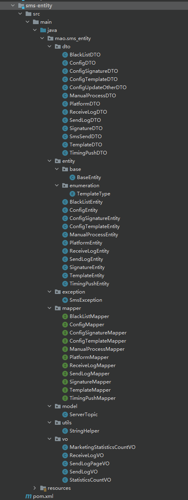


### 管理端工程

sms-manage作为后台管理服务的maven工程，主要功能是对基础数据进行维护操作，例如签名管理、模板管理、通道管理、通道优先级配置、数据统计等


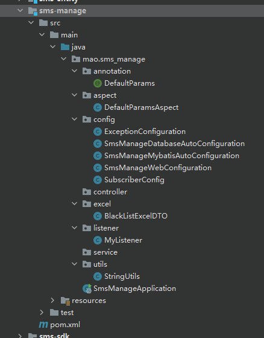


## 数据模型与类


| 序号 |       表名       |         类名          |        说明        |
| :--: | :--------------: | :-------------------: | :----------------: |
|  1   |    signature     |    SignatureEntity    |      短信签名      |
|  2   |     template     |    TemplateEntity     |      短信模板      |
|  3   |      config      |     ConfigEntity      |    短信通道配置    |
|  4   | config_signature | ConfigSignatureEntity |   通道与签名关系   |
|  5   | config_template  | ConfigTemplateEntity  |   通道与模板关系   |
|  6   |     platform     |    PlatformEntity     | 接入平台(应用管理) |
|  7   |   receive_log    |   ReceiveLogEntity    |    短信接收日志    |
|  8   |  manual_process  |  ManualProcessEntity  |    人工处理任务    |
|  9   |     send_log     |     SendLogEntity     |    短信发送日志    |
|  10  |    black_list    |    BlackListEntity    |       黑名单       |
|  11  |   timing_push    |   TimingPushEntity    |      定时发送      |


短信签名：是指主叫用户在发送短信过程中，附加主叫用户的个性化签名，发送到被叫手机用户的业务。例如：【百度账号】和【阿里云】


短信模板：即具体发送的短信内容，短信模版通常可以支持验证码、通知、推广三种短信类型。

举例：您的验证码为【变量】，打死不告诉别人！


短信通道：指第三方短信平台，例如阿里云短信、乐信短信、梦网短信等。


## 基础属性自动注入

### 基础属性

```java
package mao.sms_entity.entity.base;

import com.baomidou.mybatisplus.annotation.TableId;
import io.swagger.annotations.ApiModelProperty;
import lombok.Data;

import java.io.Serializable;
import java.time.LocalDateTime;

/**
 * Project name(项目名称)：sms-backend
 * Package(包名): mao.sms_entity.entity.base
 * Class(类名): BaseEntity
 * Author(作者）: mao
 * Author QQ：1296193245
 * GitHub：https://github.com/maomao124/
 * Date(创建日期)： 2022/12/16
 * Time(创建时间)： 21:14
 * Version(版本): 1.0
 * Description(描述)： 基础实体类
 */

@Data
public abstract class BaseEntity implements Serializable
{
    /**
     * id
     */
    @TableId
    @ApiModelProperty(value = "主键")
    private String id;

    /**
     * 创建时间
     */
    @ApiModelProperty(value = "创建时间")
    private LocalDateTime createTime;

    /**
     * 创建用户
     */
    @ApiModelProperty(value = "创建人")
    private String createUser = "0";

    /**
     * 更新时间
     */
    @ApiModelProperty(value = "修改时间")
    private LocalDateTime updateTime;

    /**
     * 更新用户
     */
    @ApiModelProperty(value = "修改人")
    private String updateUser;

    /**
     * 是否为逻辑删除
     */
    @ApiModelProperty(value = "逻辑删除：0删除")
    private Integer isDelete;

}
```


### 自定义注解

```java
package mao.sms_manage.annotation;

import java.lang.annotation.*;

@Documented
@Retention(RetentionPolicy.RUNTIME)
@Target(ElementType.METHOD)
public @interface DefaultParams
{

}
```


### 定义切面类

```java
package mao.sms_manage.aspect;

import lombok.SneakyThrows;
import lombok.extern.slf4j.Slf4j;
import mao.tools_core.context.BaseContextHandler;
import org.aspectj.lang.JoinPoint;
import org.aspectj.lang.annotation.Aspect;
import org.aspectj.lang.annotation.Before;
import org.springframework.stereotype.Component;

import java.lang.reflect.Method;
import java.time.LocalDateTime;

/**
 * Project name(项目名称)：sms-backend
 * Package(包名): mao.sms_manage.aspect
 * Class(类名): DefaultParamsAspect
 * Author(作者）: mao
 * Author QQ：1296193245
 * GitHub：https://github.com/maomao124/
 * Date(创建日期)： 2022/12/17
 * Time(创建时间)： 20:39
 * Version(版本): 1.0
 * Description(描述)： 通过切面方式，自定义注解，实现实体基础数据的注入（创建者、创建时间、修改者、修改时间）
 */


@Aspect
@Slf4j
@Component
public class DefaultParamsAspect
{
    @SneakyThrows
    @Before("@annotation(mao.sms_manage.annotation.DefaultParams)")
    public void beforeEvent(JoinPoint point)
    {
        //从ThreadLocal中获得当前登录用户的id
        Long userId = BaseContextHandler.getUserId();
        if (userId == null)
        {
            userId = 0L;
        }

        //获得Controller方法的参数
        Object[] args = point.getArgs();
        //变量参数
        for (Object entity : args)
        {
            //对于参数，通常是实体对象，例如SignatureEntity
            //获得参数类型,SignatureEntity.class
            Class<?> classes = entity.getClass();

            //获得实体中id属性值

            //获得getId方法对象
            Method method = getMethod(classes, "getId");
            if (method != null)
            {
                //通过反射调用方法（getId）
                Object id = method.invoke(entity);
                if (id == null)
                {
                    //当前进行的是新增操作，需要设置创建人createUser和创建时间createTime
                    method = getMethod(classes, "setCreateUser", String.class);
                    if (method != null)
                    {
                        method.invoke(entity, userId.toString());
                    }
                    method = getMethod(classes, "setCreateTime", LocalDateTime.class);
                    if (method != null)
                    {
                        method.invoke(entity, LocalDateTime.now());
                    }
                }

                method = getMethod(classes, "setUpdateUser", String.class);
                if (method != null)
                {
                    method.invoke(entity, userId.toString());
                }

                method = getMethod(classes, "setUpdateTime", LocalDateTime.class);
                if (method != null)
                {
                    method.invoke(entity, LocalDateTime.now());
                }
            }
        }

        log.debug(point.toString());
    }

    /**
     * 获得方法对象
     *
     * @param classes 类
     * @param name    名字
     * @param types   类型
     * @return {@link Method}
     */
    private Method getMethod(Class<?> classes, String name, Class<?>... types)
    {
        try
        {
            return classes.getMethod(name, types);
        }
        catch (NoSuchMethodException e)
        {
            return null;
        }
    }
}
```


## Redis发布订阅模式

Redis 发布订阅 (pub/sub) 是一种消息通信模式：发送者 (pub) 发送消息，订阅者 (sub) 接收消息。Redis 客户端可以订阅任意数量的频道。

Redis的发布订阅模式本质和传统的MQ的发布订阅类似，但是相对于其它几款MQ产品来说，redis的使用更加便捷，也更加轻量化，不需要单独去搭建集成一套繁重的MQ框架。但缺点也很明显，redis发布的消息不会持久化，所以当某一台服务器出现问题的时候，这个消息会丢失，所以在考虑使用之前要慎重，当前的业务是否对数据一致性要求很高，如果要求很高，还是建议使用MQ产品。

在发布者订阅者模式下，发布者将消息发布到指定的 channel 里面， 凡是监听该 channel 的消费者都会收到同样的一份消息，这种模式类似于是收音机模式，即凡是收听某个频道的听众都会收到主持人发布的相同的消息内容。  此模式常用于群聊天、 群通知、群公告等场景。

发布订阅模式下的几个概念：

- Publisher： 发布者
- Subscriber：订阅者
- Channel： 频道  


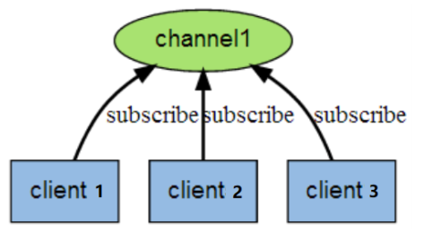


当有新消息通过 PUBLISH 命令发送给频道 channel1 时， 这个消息就会被发送给订阅它的三个客户端：


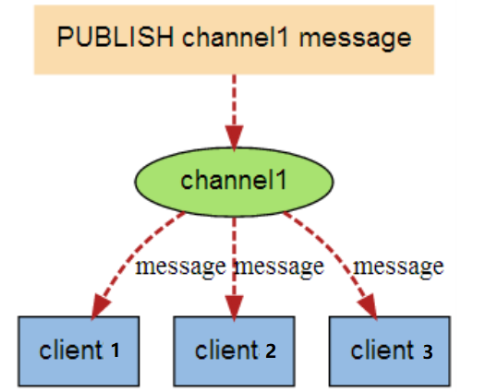


## 通道管理

### 需求分析

- 通道信息增、删、改、查（分页、详情）
- 通道排序：通过拖动对前端通道进行排序
- 关联通道与短信签名：一个通道可以有多个签名
- 关联通道与短信模板：一个通道可以有多个模板
- 通道优先级排序后通知短信发送服务，更新缓存中的通道优先级


### 具体实现

管理端服务有一个场景使用了redis的发布订阅模式：短信通道的优先级发生变化（如人工设置）后，通过redis发布订阅模式通知短信发送服务，短信发送服务接收到消息后自动调整短信发送时使用的通道的优先级（短信发送服务缓存了短信通道的配置信息）。

基础代码都已经实现，此处只需要实现通道排序后通知短信发送服务的代码即可。也就是ConfigServiceImpl类的sendUpdateMessage方法。

短信发送服务业务逻辑说明：

1、为了保证短信发送服务的可用性，在短信发送服务启动时会自动生成当前服务实例的一个uuid作为服务标识保存到redis中，并且每隔3分钟上报服务信息证明服务状态正常

2、短信发送服务启动后会每隔10分钟检查redis中的服务上报信息，如果某个实例超过5分钟没有上报则认为此服务下线，就会从redis中将此服务实例信息删除

3、短信发送服务在启动时会从数据库中查询出可用通道列表并按照优先级排序，然后缓存到redis中


```java
@Override
public void sendUpdateMessage()
{
    Map map = redisTemplate.opsForHash().entries("SERVER_ID_HASH");
    log.info("所有的短信发送服务实例：" + map);
    //当前时间戳
    long currentTimeMillis = System.currentTimeMillis();
    //遍历
    for (Object key : map.keySet())
    {
        Object value = map.get(key);
        long parseLong = Long.parseLong(value.toString());
        if (currentTimeMillis - parseLong < (1000 * 60 * 5))
        {
            //删除redis中缓存的可用通道，因为通道优先级发生变化，redis中缓存的可用通道需要重新加载
            redisTemplate.delete("listForConnect");
            //说明当前这个实例状态正常
            ServerTopic serverTopic = ServerTopic.builder().option(ServerTopic.INIT_CONNECT).value(key.toString()).build();
            //发送消息
            redisTemplate.convertAndSend("TOPIC_HIGH_SERVER", serverTopic.toString());
            return;
        }
    }
}
```


# 短信接收服务

## 介绍

短信接收服务的作用就是为应用提供访问接口，应用需要发送短信时只需要调用短信接收服务，由短信接收服务将信息保存到消息缓冲区（Mysql、Redis）。后续会由短信发送服务从消息缓冲区获取消息并发送短信。


短信接收服务（sms-api）提供3种方式供业务系统调用：

- HTTP接口
- TCP
- SDK形式

短信接收服务通过资质验证（可开关）、短信内容校验后将短信信息发送到对应中间件中（Redis、MySQL）。

短信发送方式分为两种类型：

1、定时发送短信：将短信内容存储到MySQL数据库中，由短信发送服务通过定时任务获取并发送
2、普通短信：将短信内容推送到Redis队列中，由短信发送服务异步接收并发送


## 项目结构

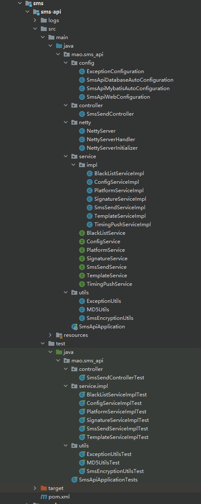


## 数据模型与类


| 序号 |       表名       |         类名          |        说明        |
| :--: | :--------------: | :-------------------: | :----------------: |
|  1   |    signature     |    SignatureEntity    |      短信签名      |
|  2   |     template     |    TemplateEntity     |      短信模板      |
|  3   |      config      |     ConfigEntity      |    短信通道配置    |
|  4   | config_signature | ConfigSignatureEntity |   通道与签名关系   |
|  5   | config_template  | ConfigTemplateEntity  |   通道与模板关系   |
|  6   |     platform     |    PlatformEntity     | 接入平台(应用管理) |
|  7   |   receive_log    |   ReceiveLogEntity    |    短信接收日志    |
|  8   |    black_list    |    BlackListEntity    |       黑名单       |
|  9   |   timing_push    |   TimingPushEntity    |      定时发送      |


## 消息存储

将消息保存到消息缓冲区的业务逻辑为：

1、进行短信分类，分为实时发送短信和定时发送短信

2、如果是定时发送短信则将消息保存到Mysql数据库

3、如果是实时发送短信则将消息保存到Redis队列，判断短信模板类型，如果是验证码类型则将消息保存到高优先级队列TOPIC_HIGH_SMS，如果是其他类型则将消息保存到普通队列TOPIC_GENERAL_SMS

4、保存短信接收日志到Mysql数据库


```java
/**
 * 根据短信模板分类 并分发
 *
 * @param templateEntity 模板实体
 * @param smsSendDTO     短信发送dto
 * @param platformEntity 平台实体
 */
private void pushSmsMessage(TemplateEntity templateEntity, SmsSendDTO smsSendDTO, PlatformEntity platformEntity)
{
    //短信接收日志
    ReceiveLogEntity receiveLogEntity = new ReceiveLogEntity();
    //设置日志id
    receiveLogEntity.setApiLogId(UUID.randomUUID().toString());
    //开始时间
    long start = System.currentTimeMillis();
    try
    {
        //获得短信发送时间，如果为空表示实时发送
        String sendTime = smsSendDTO.getSendTime();
        //smsSendDTO转json
        String smsJson = JSON.toJSONString(smsSendDTO);
        //判断发送时间是否为空
        if (StringUtils.isNotEmpty(sendTime))
        {
            //定时发送，需要将信息保存到MySQL
            TimingPushEntity timingPushEntity = new TimingPushEntity();
            timingPushEntity.setMobile(smsSendDTO.getMobile());
            timingPushEntity.setTemplate(smsSendDTO.getTemplate());
            timingPushEntity.setSignature(smsSendDTO.getSignature());
            timingPushEntity.setTiming(sendTime);
            timingPushEntity.setRequest(smsJson);
            //保存
            timingPushService.save(timingPushEntity);
        }
        else
        {
            //实时发送，将信息保存到Redis队列
            if (templateEntity.getType() == TemplateType.VERIFICATION.getCode())
            {
                //验证码类型的短信，保存到TOPIC_HIGH_SMS队列
                stringRedisTemplate.opsForList().leftPush("TOPIC_HIGH_SMS", smsJson);
            }
            else
            {
                //其他类型的短信，保存到TOPIC_GENERAL_SMS队列
                stringRedisTemplate.opsForList().leftPush("TOPIC_GENERAL_SMS", smsJson);
            }
        }
        //设置状态为成功
        receiveLogEntity.setStatus(1);
    }
    catch (Exception e)
    {
        //设置状态为失败
        receiveLogEntity.setStatus(0);
        //设置异常信息
        receiveLogEntity.setError(ExceptionUtils.getErrorStackTrace(e));
    }
    finally
    {
        //继续构建接收日志对象
        receiveLogEntity.setPlatformId(platformEntity.getId());
        receiveLogEntity.setPlatformName(platformEntity.getName());
        receiveLogEntity.setConfigIds(StringUtils.join(smsSendDTO.getConfigIds(), ","));
        receiveLogEntity.setTemplate(smsSendDTO.getTemplate());
        receiveLogEntity.setSignature(smsSendDTO.getSignature());
        receiveLogEntity.setMobile(smsSendDTO.getMobile());
        receiveLogEntity.setRequest(JSON.toJSONString(smsSendDTO.getParams()));
        receiveLogEntity.setUseTime(System.currentTimeMillis() - start);
        receiveLogEntity.setBusiness(smsSendDTO.getBatchCode());
        //日志保存到数据库
        receiveLogMapper.insert(receiveLogEntity);
    }
}
```


## TCP接口

基于Netty进行网络编程，为短信接收服务提供TCP接口，应用系统可以通过TCP调用此接口来和短信接收服务对接


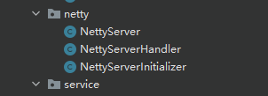


- Netty服务启动类：用于启动Netty服务
- 通道初始化器：主要目的是为程序员提供一个简单的工具，用于在某个Channel注册到EventLoop后，对这个Channel执行一些初始化操作，例如可以添加用户自定义的服务端处理器
- 服务端处理器：具体执行处理逻辑，例如读取消息


```java
package mao.sms_api.netty;

import com.alibaba.fastjson.JSON;
import io.netty.channel.ChannelHandlerContext;
import io.netty.channel.SimpleChannelInboundHandler;
import lombok.extern.slf4j.Slf4j;
import mao.sms_api.service.impl.SmsSendServiceImpl;
import mao.sms_entity.dto.SmsParamsDTO;
import mao.tools_core.utils.SpringUtils;
import org.apache.commons.lang.StringUtils;

import java.net.InetSocketAddress;

/**
 * Project name(项目名称)：sms-backend
 * Package(包名): mao.sms_api.netty
 * Class(类名): NettyServerHandler
 * Author(作者）: mao
 * Author QQ：1296193245
 * GitHub：https://github.com/maomao124/
 * Date(创建日期)： 2022/12/25
 * Time(创建时间)： 19:39
 * Version(版本): 1.0
 * Description(描述)： 服务端处理器
 */

@Slf4j
public class NettyServerHandler extends SimpleChannelInboundHandler<String>
{

    @Override
    protected void channelRead0(ChannelHandlerContext ctx, String msg)
    {
        //接收应用系统的报文并解析，调用Service将消息保存到消息缓冲区
        log.info("开始解析报文:{}", msg);
        String resp = "success";
        try
        {
            //开始将String类型的报文转换为SmsParamsDTO类型的对象
            SmsParamsDTO smsParamsDTO = parseMessage(msg);
            if (smsParamsDTO == null)
            {
                //报文解析失败，不能发送短信
                log.error("报文解析失败");
                return;
            }
            //从Spring容器中获取SmsSendServiceImpl,将信息保存到消息缓冲区
            SpringUtils.getBean(SmsSendServiceImpl.class).send(smsParamsDTO);
        }
        catch (Exception e)
        {
            resp = e.getMessage();
        }
        //向客户端写回数据
        ctx.writeAndFlush(resp + "\n");
    }

    @Override
    public void channelActive(ChannelHandlerContext ctx)
    {
        InetSocketAddress inetSocketAddress = (InetSocketAddress) ctx.channel().remoteAddress();
        String clientIp = inetSocketAddress.getAddress().getHostAddress();
        log.info("收到客户端[ip:" + clientIp + "]连接");
    }

    @Override
    public void exceptionCaught(ChannelHandlerContext ctx, Throwable cause)
    {
        //当出现异常就关闭连接
        ctx.close();
    }

    /**
     * 解析报文
     * 设备不同报文也不同，直接使用json格式传输
     */
    private SmsParamsDTO parseMessage(String body)
    {
        //判断报文是否为空
        if (org.apache.commons.lang.StringUtils.isBlank(body))
        {
            log.warn("报文为空");
            return null;
        }
        body = body.trim();
        // 其它格式的报文需要解析后放入SmsParamsDTO实体
        SmsParamsDTO message = JSON.parseObject(body, SmsParamsDTO.class);
        if (message == null || org.apache.commons.lang.StringUtils.isBlank(message.getMobile()) ||
                org.apache.commons.lang.StringUtils.isBlank(message.getSignature()) ||
                StringUtils.isBlank(message.getTemplate()))
        {
            log.warn("报文内容异常");
            return null;
        }

        return message;
    }
}
```


# SDK

## 说明

SDK 是 Software Development Kit 的缩写，即软件开发工具包。SDK被开发出来是为了减少程序员工作量的，比如公司开发出某种软件的某一功能，把它封装成SDK，提供给其他公司和个人使用。

本小节需要开发短信接收服务SDK，通过SDK可以使应用系统更加方便的调用短信接收服务。

通过SDK方式调用短信接收服务，本质上还是调用的短信接收服务提供的HTTP接口（Controller），只不过是调用的过程在SDK中进行了封装。


## 项目结构

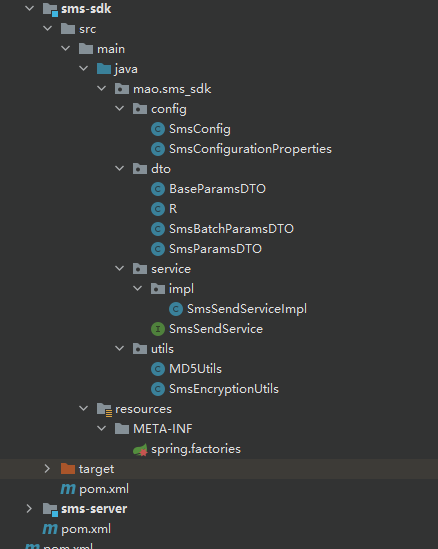


## 关键代码


```java
package mao.sms_sdk.service.impl;

import com.alibaba.cloud.commons.lang.StringUtils;
import com.alibaba.fastjson.JSON;
import lombok.extern.slf4j.Slf4j;
import mao.sms_sdk.config.SmsConfigurationProperties;
import mao.sms_sdk.dto.BaseParamsDTO;
import mao.sms_sdk.dto.R;
import mao.sms_sdk.dto.SmsBatchParamsDTO;
import mao.sms_sdk.dto.SmsParamsDTO;
import mao.sms_sdk.service.SmsSendService;
import mao.sms_sdk.utils.SmsEncryptionUtils;
import org.apache.http.HttpEntity;
import org.apache.http.client.methods.CloseableHttpResponse;
import org.apache.http.client.methods.HttpPost;
import org.apache.http.entity.StringEntity;
import org.apache.http.impl.client.CloseableHttpClient;
import org.apache.http.impl.client.HttpClients;
import org.apache.http.util.EntityUtils;

/**
 * Project name(项目名称)：sms-backend
 * Package(包名): mao.sms_sdk.service.impl
 * Class(类名): SmsSendServiceImpl
 * Author(作者）: mao
 * Author QQ：1296193245
 * GitHub：https://github.com/maomao124/
 * Date(创建日期)： 2022/12/27
 * Time(创建时间)： 21:42
 * Version(版本): 1.0
 * Description(描述)： 无
 */

@Slf4j
public class SmsSendServiceImpl implements SmsSendService
{

    /**
     * 短信配置属性
     */
    private final SmsConfigurationProperties smsConfigurationProperties;

    /**
     * 短信发送服务impl
     *
     * @param smsConfigurationProperties 短信配置属性
     */
    public SmsSendServiceImpl(SmsConfigurationProperties smsConfigurationProperties)
    {
        this.smsConfigurationProperties = smsConfigurationProperties;
    }

    @Override
    public R<Boolean> sendSms(SmsParamsDTO smsParamsDTO)
    {
        String url = smsConfigurationProperties.getDomain() + smsConfigurationProperties.getSend();
        return send(smsParamsDTO,url);
    }

    @Override
    public R<Boolean> batchSendSms(SmsBatchParamsDTO smsBatchParamsDTO)
    {
        String url = smsConfigurationProperties.getDomain() + smsConfigurationProperties.getBatchSend();
        return send(smsBatchParamsDTO,url);
    }


    /**
     * 发送短信
     *
     * @param baseParamsDTO 基础参数dto
     * @param url           url
     * @return {@link R}<{@link Boolean}>
     */
    private R<Boolean> send(BaseParamsDTO baseParamsDTO, String url)
    {
        //设置accessKeyId
        baseParamsDTO.setAccessKeyId(smsConfigurationProperties.getAccessKeyId());
        if (smsConfigurationProperties.isAuth())
        {
            if (StringUtils.isBlank(smsConfigurationProperties.getAccessKeyId()) || StringUtils.isBlank(smsConfigurationProperties.getAccessKeySecret()))
            {
                R.fail("accessKey 不能为空");
            }
            baseParamsDTO.setTimestamp(String.valueOf(System.currentTimeMillis()));
            baseParamsDTO.setEncryption(SmsEncryptionUtils.encode(baseParamsDTO.getEncryption(), baseParamsDTO.getAccessKeyId(),
                    smsConfigurationProperties.getAccessKeySecret()));
        }

        if (StringUtils.isBlank(smsConfigurationProperties.getDomain()))
        {
            R.fail("domain 不能为空");
        }
        //HTTP客户端
        CloseableHttpClient httpclient = HttpClients.createDefault();
        //Post请求对象
        HttpPost post = new HttpPost(url);
        //设置请求头
        post.setHeader("Content-Type", "application/json; charset=UTF-8");
        //构造请求体
        StringEntity stringEntity = new StringEntity(JSON.toJSONString(baseParamsDTO), "UTF-8");
        //设置请求体
        post.setEntity(stringEntity);

        try
        {
            //发送请求
            CloseableHttpResponse response = httpclient.execute(post);
            //获得响应信息
            HttpEntity entity = response.getEntity();
            //解析响应状态码
            if (200 == response.getStatusLine().getStatusCode())
            {
                log.info("httpRequest access success, StatusCode is:{}", response.getStatusLine()
                        .getStatusCode());
                String responseContent = EntityUtils.toString(entity);
                log.info("responseContent is :" + responseContent);
                return JSON.parseObject(responseContent, R.class);
            }
            else
            {
                log.error("httpRequest access fail ,StatusCode is:{}", response.getStatusLine().getStatusCode());
                return R.fail("status is " + response.getStatusLine().getStatusCode());
            }
        }
        catch (Exception e)
        {
            log.error("error :", e);
            return R.fail(e.getMessage());
        }
        finally
        {
            post.releaseConnection();
        }
    }
}
```


## 使用SDK

第一步：引入SDK的maven坐标

```xml
<dependency>
    <groupId>mao</groupId>
    <artifactId>sms-sdk</artifactId>
    <version>1.0-SNAPSHOT</version>
</dependency>
```


第二步：编写配置文件

```yaml
sms:
  auth: false
  domain: http://localhost:8771
  accessKeyId: xxxxxxxxxxxxxxxxxxxxx
  accessKeySecret: xxxxxxxxxxxxxxxxxxxxx
```


第三步：编写业务类

部分代码如下：

```java
SmsParamsDTO dto = new SmsParamsDTO();
dto.setMobile("13812345678");
dto.setSignature("DXQM_000000001");
dto.setTemplate("DXMB_000000001");
Map<String, String> map = new HashMap<>();
map.put("code","1234");
dto.setParams(map);
dto.setSendTime("2022-12-27 22:00");
dto.setTimestamp(System.currentTimeMillis() +"");
smsSendService.sendSms(dto);
```


# 短信发送服务

## 介绍

短信发送服务的作用就是从消息缓冲区获取消息并和具体的短信通道(例如：阿里云短信、梦网短信、乐信短信等)对接来发送短信。


- 发送短信：实时发送、定时发送
- 通道降级：通道发送失败，选择下一通道发送短信
- 通道选举：同一通道多次发送失败，降级通道
- 服务注册：有且只有一台机器执行通道选举


## 需求分析

### 功能需求

- 和具体的短信通道对接（例如：阿里云短信、梦网短信等），发送短信
- 短信定时发送
- 短信实时发送
- 服务注册，保证短信发送服务高可用
- 通道自动选举、降级


### 处理过程

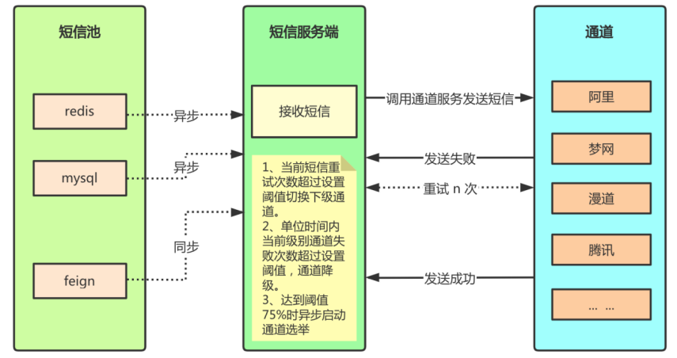


## 项目结构

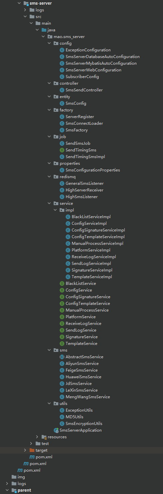


## 核心代码

短信发送服务核心类：

- ServerRegister：服务注册器，用于将短信发送服务注册到Redis中，定时服务上报，定时服务检查
- ConfigServiceImpl：通道配置器，用于查询可用通道（阿里短信、华为短信等），通道选举、降级
- AbstractSmsService：短信发送器抽象父类，子类需要和具体的短信通道对接来完成发送短信的工作
- SmsConnectLoader：通道实例加载器，根据通道配置，初始化每个通道的Bean对象
- SmsFactory：短信发送工厂，获取具体的通道实例Bean对象（例如AliyunSmsService）来发送短信， 如果发送出现异常，触发通道选举和通道降级策略
- SendTimingSmsImpl：定时短信业务处理器，具体负责定时短信的发送
- SendSmsJob：短信发送定时任务，用于定时短信的发送，调用SendTimingSmsImpl发送定时短信
- GeneralSmsListener、HighSmsListener：短信接收器，Redis队列的消费者，监听队列中的消息，如果有消息则调用SmsFactory发送实时短信
- HighServerReceiver：通道消息监听器，通过Redis的发布订阅模式监听通道相关消息，调用SmsConnectLoader初始化通道和更新通道
- SubscriberConfig：订阅发布模式的容器配置，创建消息监听容器，并将HighServerReceiver加入容器中


## 功能实现

### 服务注册器

服务注册器对应的为ServerRegister类。

短信发送服务支持分布式集群部署，可以是多个实例，实例越多，发送短信的能力越强。但是对于通道选举、持久化通道等操作，只能有一个服务实例执行，其他服务实例通过redis的广播机制获得通道变化。

如果要实现这一功能，需要将所有短信发送服务实例注册到某个地方，当前实现是将所有服务实例注册到Redis中。并且为了能够监控每个服务实例运行状态，需要每个服务实例定时上报并且定时进行服务检查。


**业务逻辑：**

1、服务注册，项目启动时将当前服务实例id注册到redis

2、服务上报，每三分钟报告一次，并传入当前时间戳

3、服务检查，每十分钟检查一次服务列表，清空超过五分钟没有报告的服务


代码实现：

```java
package mao.sms_server.factory;

import lombok.extern.slf4j.Slf4j;
import org.springframework.beans.factory.annotation.Autowired;
import org.springframework.boot.CommandLineRunner;
import org.springframework.core.annotation.Order;
import org.springframework.data.redis.core.StringRedisTemplate;
import org.springframework.scheduling.annotation.Scheduled;
import org.springframework.stereotype.Component;

import javax.annotation.Resource;
import java.util.ArrayList;
import java.util.List;
import java.util.Map;
import java.util.UUID;

/**
 * Project name(项目名称)：sms-backend
 * Package(包名): mao.sms_server.factory
 * Class(类名): ServerRegister
 * Author(作者）: mao
 * Author QQ：1296193245
 * GitHub：https://github.com/maomao124/
 * Date(创建日期)： 2023/1/2
 * Time(创建时间)： 14:23
 * Version(版本): 1.0
 * Description(描述)： 服务注册器，将短信发送服务注册到Redis中，定时服务上报，定时服务检查
 */

@Component
@Slf4j
@Order(value = 100)
public class ServerRegister implements CommandLineRunner
{
    /**
     * 服务器id
     * 当前服务实例的唯一标识，可以使用UUID随机生成
     */
    public static String SERVER_ID = null;

    @Resource
    private StringRedisTemplate stringRedisTemplate;

    /**
     * 项目启动时自动执行此方法，将当前服务实例注册到redis
     *
     * @param args 参数
     */
    @Override
    public void run(String... args)
    {
        //服务注册器，项目启动时将当前服务id注册到Redis中，使用Redis的Hash结构，key为SERVER_ID_HASH，Hash结构的key为服务id，value为时间戳

        //为当前服务实例生成一个服务唯一标识
        SERVER_ID = UUID.randomUUID().toString();
        log.info("生成当前服务实例id:" + SERVER_ID);

        stringRedisTemplate.opsForHash().put("SERVER_ID_HASH", SERVER_ID, String.valueOf(System.currentTimeMillis()));
    }

    /**
     * 定时服务报告
     * 报告服务信息证明服务存在 每三分钟报告一次，并传入当前时间戳
     */
    @Scheduled(cron = "1 0/3 * * * ?")
    public void serverReport()
    {
        //服务注册器，每三分钟报告一次，并传入当前时间戳
        log.info("定时上报，服务id：{}，时间戳：{}", SERVER_ID, System.currentTimeMillis());
        stringRedisTemplate.opsForHash().put("SERVER_ID_HASH", SERVER_ID, String.valueOf(System.currentTimeMillis()));
    }

    /**
     * 定时服务检查
     * 每十分钟检查一次服务列表，清空超过五分钟没有报告的服务
     */
    @Scheduled(cron = "30 0/10 * * * ?")
    public void checkServer()
    {
        //服务注册器，定时服务检查，每十分钟检查一次服务列表，清空超过五分钟没有报告的服务

        log.info("进行服务实例的检查，执行当前任务的服务为：{}", SERVER_ID);

        //获得Redis中注册的所有服务实例id
        Map<Object, Object> map = stringRedisTemplate.opsForHash().entries("SERVER_ID_HASH");

        //获取当前系统时间戳
        long current = System.currentTimeMillis();
        List<String> removeKeys = new ArrayList<>();
        map.forEach((key, value) ->
        {
            //key为服务实例id，value为上报的系统时间戳
            long parseLong = Long.parseLong(value.toString());
            if (current - parseLong > (1000 * 60 * 5))
            {
                //当前服务实例超过5分钟没有上报
                removeKeys.add(key.toString());
            }
        });

        //清理服务实例
        removeKeys.forEach(key ->
        {
            log.info("清理服务实例：{}", key);
            stringRedisTemplate.opsForHash().delete("SERVER_ID_HASH", key);
        });
    }
}
```


### 通道实例加载器

通道实例加载器对应的为SmsConnectLoader类。

短信发送服务存在多个通道（例如阿里云短信、梦网短信等），这些通道是通过后台管理系统设置的，包括通道的名称、签名、模板、连接方式等信息。当短信发送服务启动时，或者后台管理系统设置通道时，将会初始化短信通道。


通道实例加载器的作用就是根据通道配置，初始化每个通道的Bean对象（例如AliyunSmsService、MengWangSmsService等）。


**业务逻辑：**

1、查询数据库获得通道列表

2、遍历通道列表，通过反射创建每个通道的Bean对象（例如AliyunSmsService、MengWangSmsService等）

3、将每个通道的Bean对象保存到CONNECT_LIST集合中


具体代码如下：

```java
package mao.sms_server.factory;

import com.alibaba.fastjson.JSON;
import lombok.SneakyThrows;
import lombok.extern.slf4j.Slf4j;
import mao.sms_entity.entity.ConfigEntity;
import mao.sms_entity.model.ServerTopic;
import mao.sms_server.entity.SmsConfig;
import mao.sms_server.service.ConfigService;
import mao.sms_server.service.impl.SignatureServiceImpl;
import mao.sms_server.service.impl.TemplateServiceImpl;
import mao.tools_core.utils.SpringUtils;
import mao.tools_redis_cache.entity.LockInfo;
import mao.tools_redis_cache.service.RedisLockService;
import org.apache.commons.lang3.StringUtils;
import org.springframework.boot.CommandLineRunner;
import org.springframework.core.annotation.Order;
import org.springframework.data.redis.core.StringRedisTemplate;
import org.springframework.stereotype.Component;
import org.springframework.util.CollectionUtils;

import javax.annotation.Resource;
import java.lang.reflect.Constructor;
import java.lang.reflect.Field;
import java.util.ArrayList;
import java.util.LinkedHashMap;
import java.util.List;
import java.util.concurrent.TimeUnit;

/**
 * Project name(项目名称)：sms-backend
 * Package(包名): mao.sms_server.factory
 * Class(类名): SmsConnectLoader
 * Author(作者）: mao
 * Author QQ：1296193245
 * GitHub：https://github.com/maomao124/
 * Date(创建日期)： 2023/1/3
 * Time(创建时间)： 13:37
 * Version(版本): 1.0
 * Description(描述)： 通道实例加载器
 * 项目启动时、通道重新排序时执行
 */

@Component
@Slf4j
@Order(value = 101)
public class SmsConnectLoader implements CommandLineRunner
{
    /**
     * 连接列表
     */
    private static final List<Object> CONNECT_LIST = new ArrayList<>();


    /**
     * 未来配置列表
     */
    private static List<ConfigEntity> FUTURE_CONFIG_LIST;

    @Resource
    private ConfigService configService;


    @Resource
    private RedisLockService redisLockService;

    @Resource
    private StringRedisTemplate stringRedisTemplate;

    /**
     * 锁信息
     */
    private LockInfo lockInfo;

    @Override
    public void run(String... args)
    {
        initConnect();
    }

    /**
     * 根据通道配置，初始化每个通道的bean对象
     */
    @SneakyThrows
    public void initConnect()
    {
        // 根据通道配置，初始化每个通道的bean对象

        //1、查询数据库获得通道列表
        List<ConfigEntity> configs = configService.listForConnect();
        log.info("查询到可用通道：{}", configs);

        List<Object> beanList = new ArrayList<>();
        //2、遍历通道列表，通过反射创建每个通道的Bean对象（例如AliyunSmsService、MengWangSmsService等）
        configs.forEach(config ->
        {
            try
            {
                //封装Bean对象所需的SmsConfig配置对象
                SmsConfig smsConfig = new SmsConfig();
                smsConfig.setId(config.getId());
                smsConfig.setDomain(config.getDomain().trim());
                smsConfig.setName(config.getName().trim());
                smsConfig.setPlatform(config.getPlatform().trim());
                smsConfig.setAccessKeyId(config.getAccessKeyId().trim());
                smsConfig.setAccessKeySecret(config.getAccessKeySecret().trim());
                if (StringUtils.isNotBlank(config.getOther()))
                {
                    LinkedHashMap<String, String> linkedHashMap = JSON.parseObject(config.getOther(), LinkedHashMap.class);
                    smsConfig.setOtherConfig(linkedHashMap);
                }

                //动态拼接要创建的bean实例的全类名
                String className = "mao.sms_server." + config.getPlatform().trim() + "SmsService";
                log.info("准备通过反射动态创建：{}", className);

                Class<?> aClass = Class.forName(className);
                //获得类的构造方法对象
                Constructor<?> constructor = aClass.getConstructor(SmsConfig.class);
                //创建bean对象
                Object beanService = constructor.newInstance(smsConfig);

                //bean对象中的signatureService和templateService属性需要进行赋值
                SignatureServiceImpl signatureService = SpringUtils.getBean(SignatureServiceImpl.class);
                TemplateServiceImpl templateService = SpringUtils.getBean(TemplateServiceImpl.class);

                //根据反射获得类中声明的属性对象
                Field signatureServiceField = aClass.getSuperclass().getDeclaredField("signatureService");
                Field templateServiceField = aClass.getSuperclass().getDeclaredField("templateService");
                //设置可以操作当前属性值
                signatureServiceField.setAccessible(true);
                templateServiceField.setAccessible(true);

                //为bean对象设置属性值
                signatureServiceField.set(beanService, signatureService);
                templateServiceField.set(beanService, templateService);

                beanList.add(beanService);
            }
            catch (Exception e)
            {
                e.printStackTrace();
            }
        });

        //3、将每个通道的Bean对象保存到CONNECT_LIST集合中
        if (!CONNECT_LIST.isEmpty())
        {
            CONNECT_LIST.clear();
        }
        CONNECT_LIST.addAll(beanList);
        log.info("将初始化的通道加载到集合中：{}", CONNECT_LIST);

        //解锁
        if (lockInfo != null)
        {
            redisLockService.unlock(lockInfo);
        }

    }

    public <T> T getConnectByLevel(Integer level)
    {
        return (T) CONNECT_LIST.get(level - 1);
    }

    public boolean checkConnectLevel(Integer level)
    {
        return CONNECT_LIST.size() <= level;
    }

    /**
     * 通道调整：
     * 通道初始化：构建新的通道配置
     * 只能有一台机器执行，所以需要加锁
     */
    public void buildNewConnect()
    {
        // 一小时内有效
        lockInfo = redisLockService.tryLock("sms:buildNewConnect:lock", 60 * 60, 30, TimeUnit.SECONDS);

        if (lockInfo.isSuccess())
        {
            List<ConfigEntity> list = configService.listForNewConnect();
            FUTURE_CONFIG_LIST = list;
            stringRedisTemplate.opsForValue().set("NEW_CONNECT_SERVER", ServerRegister.SERVER_ID);
        }
        // 获取不到锁 证明已经有服务在计算或者计算结果未得到使用
    }

    /**
     * 通道调整：
     * 发布订阅消息，通知其他服务：应用新的通道
     */
    public void changeNewConnectMessage()
    {
        stringRedisTemplate.convertAndSend("TOPIC_HIGH_SERVER", ServerTopic.builder().option(ServerTopic.USE_NEW_CONNECT).value(ServerRegister.SERVER_ID).build().toString());
    }

    /**
     * 通道调整
     * 发布订阅消息，通知其他服务：初始化新通道
     */
    public void changeNewConnect()
    {
        // 初始化通道
        Object newConnectServer = stringRedisTemplate.opsForValue().get("NEW_CONNECT_SERVER");

        /*
         * 为了通道调整发布的消息中，带有server id
         * 确保只有此server id的服务执行当前代码
         */
        if (null != newConnectServer && ServerRegister.SERVER_ID.equals(newConnectServer) &&
                !CollectionUtils.isEmpty(FUTURE_CONFIG_LIST))
        {
            // 配置列表不为空则执行数据库操作 并清空缓存
            boolean result = configService.updateBatchById(FUTURE_CONFIG_LIST);
            log.info("批量修改配置级别:{}", result);
            FUTURE_CONFIG_LIST.clear();
            stringRedisTemplate.convertAndSend("TOPIC_HIGH_SERVER", ServerTopic.builder()
                    .option(ServerTopic.INIT_CONNECT).value(ServerRegister.SERVER_ID).build().toString());
        }
    }
}
```


### 定时短信业务处理器

定时短信业务处理器对应的是SendTimingSmsImpl类，具体负责定时短信的发送。


**业务逻辑：**

1、查询数据库获取本次需要发送的定时短信

2、调用短信工厂发送短信

3、更新短信发送状态为“已处理”


实现代码：


接口

```java
package mao.sms_server.job;

/**
 * Project name(项目名称)：sms-backend
 * Package(包名): mao.sms_server.job
 * Interface(接口名): SendTimingSms
 * Author(作者）: mao
 * Author QQ：1296193245
 * GitHub：https://github.com/maomao124/
 * Date(创建日期)： 2023/1/3
 * Time(创建时间)： 14:15
 * Version(版本): 1.0
 * Description(描述)： 定时短信发送业务接口
 */

public interface SendTimingSms
{
    /**
     * 执行
     *
     * @param timing 时机
     * @throws InterruptedException 中断异常
     */
    void execute(String timing) throws InterruptedException;
}
```


实现类

```java
package mao.sms_server.job;

import lombok.extern.slf4j.Slf4j;
import mao.sms_dao.mapper.TimingPushMapper;
import mao.sms_entity.entity.TimingPushEntity;
import mao.sms_server.factory.SmsFactory;
import mao.tools_databases.mybatis.conditions.Wraps;
import org.springframework.scheduling.annotation.Async;
import org.springframework.stereotype.Component;

import javax.annotation.Resource;
import java.util.List;

/**
 * Project name(项目名称)：sms-backend
 * Package(包名): mao.sms_server.job
 * Class(类名): SendTimingSmsImpl
 * Author(作者）: mao
 * Author QQ：1296193245
 * GitHub：https://github.com/maomao124/
 * Date(创建日期)： 2023/1/3
 * Time(创建时间)： 14:16
 * Version(版本): 1.0
 * Description(描述)： 定时短信业务处理器
 */

@Slf4j
@Component
public class SendTimingSmsImpl implements SendTimingSms
{
    @Resource
    private TimingPushMapper timingPushMapper;

    @Resource
    private SmsFactory smsFactory;


    @Async
    @Override
    public void execute(String timing) throws InterruptedException
    {
        //查询数据库获取本次需要发送的定时短信
        List<TimingPushEntity> timingPushEntityList = timingPushMapper.selectList(Wraps.<TimingPushEntity>lbQ()
                //设置查询条件，状态为0，表示未处理
                .eq(TimingPushEntity::getStatus, 0)
                //设置查询条件，发送时间等值查询
                .eq(TimingPushEntity::getTiming, timing)
                //设置排序条件
                .orderByAsc(TimingPushEntity::getCreateTime));

        if (timingPushEntityList != null && timingPushEntityList.size() > 0)
        {
            log.info("本次定时任务需要发送的定时短信条数为：{}", timingPushEntityList.size());
            timingPushEntityList.forEach(timingPushEntity ->
            {
                //2、调用短信工厂发送短信
                smsFactory.send(timingPushEntity.getRequest());

                //3、更新短信发送状态为“已处理”
                timingPushEntity.setStatus(1);
                timingPushMapper.updateById(timingPushEntity);
            });
        }
    }
}
```


### 短信发送定时任务

短信发送定时任务对应的是SendSmsJob类，用于定时短信的发送，调用SendTimingSmsImpl发送定时短信。


**业务逻辑：**

1、每分钟触发一次定时任务

2、为了防止短信重复发送，需要使用分布式锁

3、调用SendTimingSmsImpl发送定时短信


代码实现：

```java
package mao.sms_server.job;

import lombok.extern.slf4j.Slf4j;
import mao.tools_core.utils.DateUtils;
import mao.tools_redis_cache.entity.LockInfo;
import mao.tools_redis_cache.service.RedisLockService;
import org.springframework.scheduling.annotation.Scheduled;
import org.springframework.stereotype.Component;

import javax.annotation.Resource;
import java.util.Date;
import java.util.concurrent.TimeUnit;

/**
 * Project name(项目名称)：sms-backend
 * Package(包名): mao.sms_server.job
 * Class(类名): SendSmsJob
 * Author(作者）: mao
 * Author QQ：1296193245
 * GitHub：https://github.com/maomao124/
 * Date(创建日期)： 2023/1/3
 * Time(创建时间)： 14:22
 * Version(版本): 1.0
 * Description(描述)： 定时任务，用于发送定时短信
 */

@Slf4j
@Component
public class SendSmsJob
{
    @Resource
    private SendTimingSms sendTimingSms;

    @Resource
    private RedisLockService redisLockService;

    /**
     * 定时发送短信
     * 每分钟的第10秒检查一次是否有定时短信需要发送
     *
     * @throws InterruptedException 中断异常
     */
    @Scheduled(cron = "10 0/1 * * * ?")
    public void sendTimingSms() throws InterruptedException
    {
        //定时任务，每分钟检查一次是否有定时短信需要发送

        //2、为了防止短信重复发送，需要使用分布式锁
        LockInfo lockInfo = redisLockService.tryLock("SEND_TIMING_SMS", 30, 30, TimeUnit.SECONDS);

        if (lockInfo.isSuccess())
        {
            log.info("准备执行定时发送短信任务");
            //当前实例抢到锁，可以执行定时短信的发送
            //3、调用SendTimingSmsImpl发送定时短信
            sendTimingSms.execute(DateUtils.format(new Date(), "yyyy-MM-dd HH:mm"));
            //释放锁
            redisLockService.unlock(lockInfo);
        }
    }
}
```


### 短信接收器

应用系统调用短信接收服务，短信接收服务将短信消息放入消息队列，实现短信的接收和发送的解耦，这种方案可以最大化提高短信接收服务性能，不会由于外部短信通道影响应用系统的响应，从而起到削峰填谷的效果。

本系统使用的Redis集群作为消息队列，在传输短信时，采用的是生产者消费者模式。

短信接收器对应的类为GeneralSmsListener和HighSmsListener，角色是Redis队列的消费者，监听队列中的消息，如果有消息则调用SmsFactory发送实时短信。


**业务逻辑：**

1、HighSmsListener监听TOPIC_HIGH_SMS队列，如果有消息则调用短信发送工厂SmsFactory发送实时短信

2、GeneralSmsListener监听TOPIC_GENERAL_SMS队列，如果有消息则调用短信发送工厂SmsFactory发送实时短信


HighSmsListener具体实现：

```java
package mao.sms_server.redismq;

import lombok.extern.slf4j.Slf4j;
import mao.sms_server.factory.SmsFactory;
import org.springframework.beans.factory.annotation.Value;
import org.springframework.data.redis.core.StringRedisTemplate;
import org.springframework.stereotype.Component;

import javax.annotation.PostConstruct;
import javax.annotation.Resource;
import java.util.concurrent.TimeUnit;

/**
 * Project name(项目名称)：sms-backend
 * Package(包名): mao.sms_server.redismq
 * Class(类名): HighSmsListener
 * Author(作者）: mao
 * Author QQ：1296193245
 * GitHub：https://github.com/maomao124/
 * Date(创建日期)： 2023/1/3
 * Time(创建时间)： 20:44
 * Version(版本): 1.0
 * Description(描述)： 监听消息队列：TOPIC_HIGH_SMS，高优先级的短信，如验证码之类的短信
 */

@Slf4j
@Component
public class HighSmsListener extends Thread
{
    @Resource
    private StringRedisTemplate stringRedisTemplate;

    @Resource
    private SmsFactory smsFactory;


    private final String queueKey = "TOPIC_HIGH_SMS";

    /**
     * 队列出队超时时间
     */
    @Value("${spring.redis.queue.pop.timeout:8000}")
    private Long popTimeout = 8000L;

    @PostConstruct
    private void init()
    {
        this.start();
    }

    @Override
    public void run()
    {
        //监听TOPIC_HIGH_SMS队列，如果有消息则调用短信发送工厂发送实时短信

        log.info("监听队列：{}中的短信消息", queueKey);

        //持续监听，所以需要使用死循环
        while (true)
        {
            String message = stringRedisTemplate.opsForList().rightPop(queueKey, popTimeout, TimeUnit.MILLISECONDS);
            if (message != null)
            {
                //队列中有消息，需要发送短信
                log.info("队列：{}中收到短信发送消息：{}", queueKey, message);
                //调用短信发送工厂发送短信
                smsFactory.send(message);
            }
        }
    }
}
```


GeneralSmsListener具体实现：

```java
package mao.sms_server.redismq;

import lombok.extern.slf4j.Slf4j;
import mao.sms_server.factory.SmsFactory;
import org.springframework.beans.factory.annotation.Value;
import org.springframework.data.redis.core.StringRedisTemplate;
import org.springframework.stereotype.Component;

import javax.annotation.PostConstruct;
import javax.annotation.Resource;
import java.util.concurrent.TimeUnit;

/**
 * Project name(项目名称)：sms-backend
 * Package(包名): mao.sms_server.redismq
 * Class(类名): GeneralSmsListener
 * Author(作者）: mao
 * Author QQ：1296193245
 * GitHub：https://github.com/maomao124/
 * Date(创建日期)： 2023/1/3
 * Time(创建时间)： 14:37
 * Version(版本): 1.0
 * Description(描述)： Redis队列消费者，监听消息队列TOPIC_GENERAL_SMS，普通优先级的短信，如营销短信
 */

@Slf4j
@Component
public class GeneralSmsListener extends Thread
{
    @Resource
    private StringRedisTemplate stringRedisTemplate;

    @Resource
    private SmsFactory smsFactory;

    /**
     * 队列key
     */
    private final String queueKey = "TOPIC_GENERAL_SMS";

    /**
     * 队列出队超时
     */
    @Value("${spring.redis.queue.pop.timeout:8000}")
    private Long popTimeout = 8000L;

    @PostConstruct
    private void init()
    {
        this.start();
    }

    @Override
    public void run()
    {
        //监听TOPIC_GENERAL_SMS队列，如果有消息则调用短信发送工厂发送实时短信
        log.info("监听队列：{}中的短信消息", queueKey);

        //持续监听，所以需要使用死循环
        while (true)
        {
            String message = stringRedisTemplate.opsForList().rightPop(queueKey, popTimeout, TimeUnit.MILLISECONDS);
            if (message != null)
            {
                //队列中有消息，需要发送短信
                log.info("队列：{}中收到短信发送消息：{}", queueKey, message);
                //调用短信发送工厂发送短信
                smsFactory.send(message);
            }
        }

    }

}
```


### 通道消息监听器

通道消息监听器对应的类是HighServerReceiver，作用是通过Redis的发布订阅模式监听TOPIC_HIGH_SERVER频道中的消息，调用SmsConnectLoader初始化通道和更新通道。


**业务逻辑：**

1、通过Redis发布订阅模式监听TOPIC_HIGH_SERVER频道中的消息

2、如果消息为USE_NEW_CONNECT，表示通道更新，调用通道实例加载器SmsConnectLoader更新通道

3、如果消息为INIT_CONNECT，表示通道初始化，调用通道实例加载器SmsConnectLoader初始化通道


实现代码：

```java
package mao.sms_server.redismq;

import lombok.extern.slf4j.Slf4j;
import mao.sms_entity.model.ServerTopic;
import mao.sms_server.factory.SmsConnectLoader;
import org.springframework.data.redis.connection.Message;
import org.springframework.data.redis.connection.MessageListener;
import org.springframework.data.redis.core.StringRedisTemplate;
import org.springframework.stereotype.Component;

import javax.annotation.Resource;

/**
 * Project name(项目名称)：sms-backend
 * Package(包名): mao.sms_server.redismq
 * Class(类名): HighServerReceiver
 * Author(作者）: mao
 * Author QQ：1296193245
 * GitHub：https://github.com/maomao124/
 * Date(创建日期)： 2023/1/3
 * Time(创建时间)： 20:48
 * Version(版本): 1.0
 * Description(描述)： Redis发布订阅
 * 订阅者，通过Redis的发布订阅模式监听通道相关消息
 */

@Slf4j
@Component
public class HighServerReceiver implements MessageListener
{
    @Resource
    private StringRedisTemplate stringRedisTemplate;

    @Resource
    private SmsConnectLoader smsConnectLoader;

    /**
     * 消息监听
     *
     * @param message 消息
     * @param pattern 模式
     */
    @Override
    public void onMessage(Message message, byte[] pattern)
    {
        //消息监听，根据消息内容调用smsConnectLoader进行通道初始化或者通道更新

        //将消息体进行反序列化，得到json字符串
        String jsonMsg = stringRedisTemplate.getDefaultSerializer().deserialize(message.getBody()).toString();
        //将json字符串封装成ServerTopic对象
        ServerTopic serverTopic = ServerTopic.load(jsonMsg);

        switch (serverTopic.getOption())
        {
            case ServerTopic.INIT_CONNECT://初始化通道
                smsConnectLoader.initConnect();
                break;
            case ServerTopic.USE_NEW_CONNECT://更新通道
                smsConnectLoader.changeNewConnect();
            default:
                break;
        }

    }
}
```


---

end

---

by  mao
2022  01  05

---