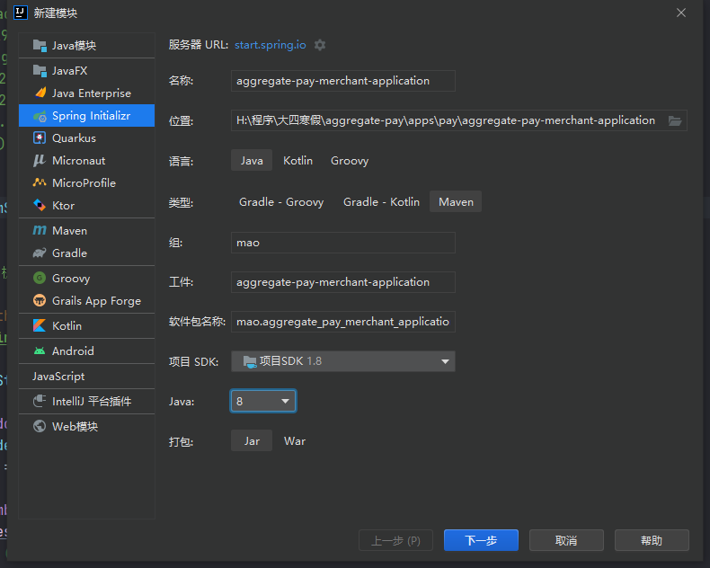
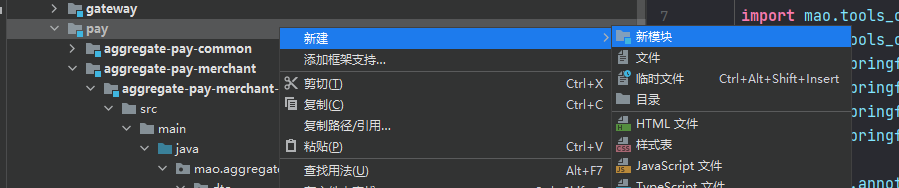
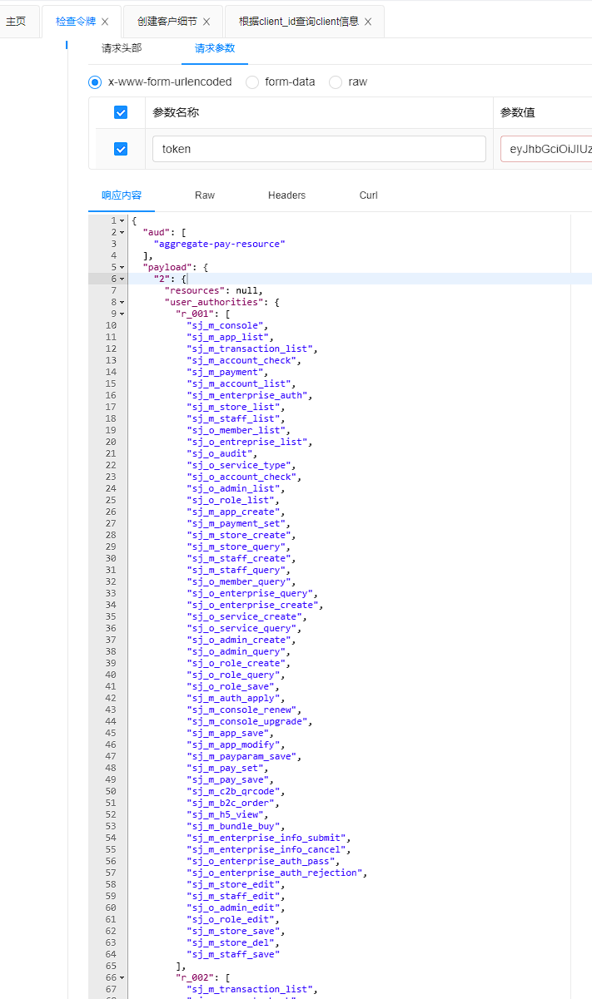
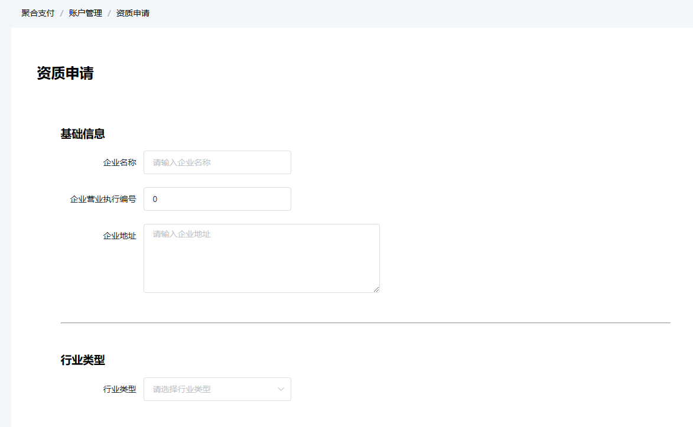
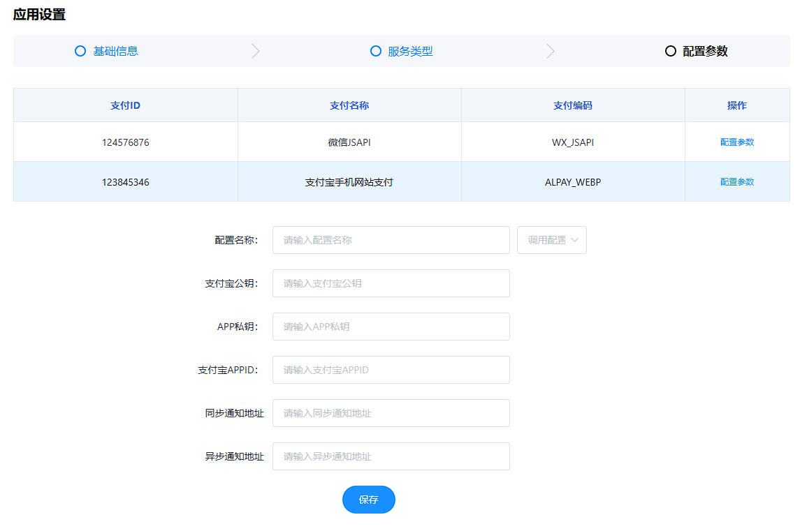
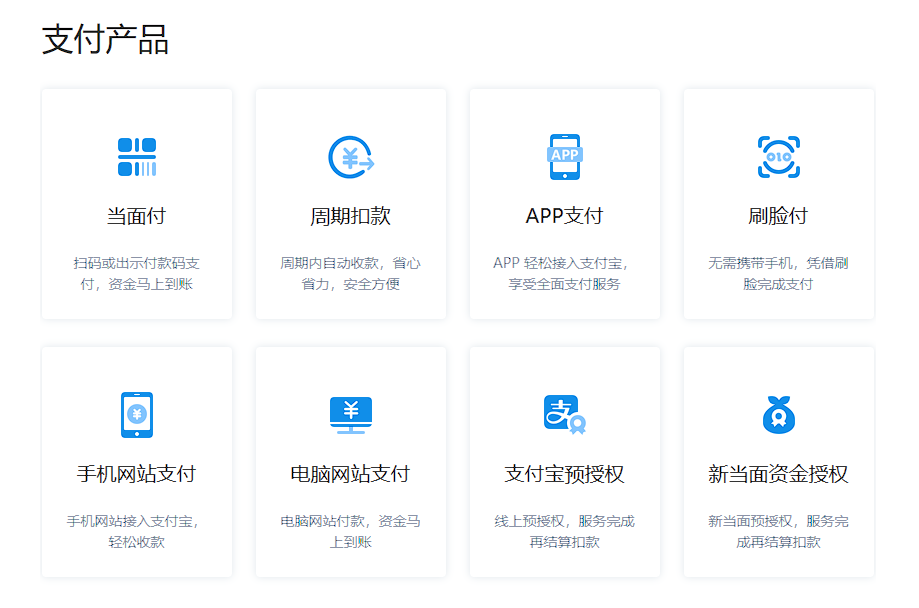
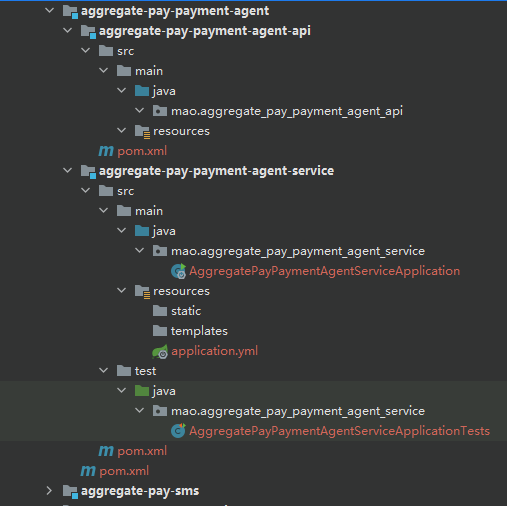

[TOC]

---


<br>

<br>

<br>

<br>

<br>

<br>


# 项目地址

[点击进入](https://github.com/maomao124/aggregate-pay)

<br>

# 项目介绍

## 项目背景

随着移动支付的盛行，商业银行、第三方支付公司、其它清算机构、消费金融公司等众多类型的机构，都在为商户提供网络（移动）支付解决方案。另一方面，用户的支付需求繁多，支付渠道已呈“碎片化”状态，并且“碎片化”程度将逐渐加深。聚合支付顾名思义就是将目前主流的支付进行整合，形成第三方支付的聚合通道，也被称为“第四方支付”

聚合支付不进行资金清算，因此无需支付牌照，其只是完成支付环节的信息流转和商户运营的承载，其在集合银联、支付宝、微信等主流支付方式的基础上，帮助商户降低接入成本，提高运营效率，具有中立性、灵活性、便捷性等特点


## 项目概述

聚合支付是一个提供聚合支付的平台，聚合支付目前主要的做法就是线上聚合收银台(开放API)，线下C2B一码多付、线下B2C商家扫码。平台应以SaaS服务形式提供给各商户订单管理、门店管理、财务数据统计等基础服务，聚合支付还以支付为入口，通过广告、营销、金融等服务，构建一个移动支付的全生态系统


## 项目模块

一共49个模块，14个服务

```sh
aggregate-pay                    # 聚合工程，用于聚合parent、apps、tools等模块
  ├── parent				     # 父工程，nacos配置及依赖包管理
  ├── apps					     # 应用目录
  	   ├── auth				     # 权限服务父工程
  		   ├── auth-entity       # 权限实体
  		   ├── auth-server       # 权限服务
  	   ├── gateway			     # 网关服务
  	   ├── pay                   # 整个聚合支付系统的父模块
  		   ├── aggregate-pay-common                # 聚合支付系统的公共模块，主要存放一些工具类
  		   ├── aggregate-pay-entity                # 聚合支付系统实体类模块，存放实体类
  		   ├── aggregate-pay-gateway               # 聚合支付系统SaaS系统的网关
  		   ├── aggregate-pay-log                   # 日志模块，用于异步接收其它服务产生的操作日志和接收登录日志，提供分页查询日志的功能
  		   ├── aggregate-pay-merchant              # 商户服务父模块
  		        ├── aggregate-pay-merchant-api     # 商户服务API模块，用于存放商户服务的DTO类、feign接口、服务降级FallbackFactory
  		        ├── aggregate-pay-merchant-service # 商户服务
  		   ├── aggregate-pay-merchant-application  # 商户平台应用服务
           ├── aggregate-pay-payment-agent         # 支付聚道代理服务父模块
                ├── aggregate-pay-payment-agent-api      # 支付聚道代理服务API模块，用途和商户服务API模块一样
                ├── aggregate-pay-payment-agent-service  # 支付聚道代理服务，主要用于对接第三方支付平台
           ├── aggregate-pay-sms                   # 聚合支付短信服务，给聚合支付平台提供发送短信和校验短信功能，和短信系统对接
           ├── aggregate-pay-transaction           # 聚合支付系统交易服务父模块
                ├── aggregate-pay-transaction-api  # 交易服务API模块，用于存放商户服务的DTO类、feign接口、服务降级FallbackFactory
                ├── aggregate-pay-transaction-service    # 交易服务，交易相关
  		   ├── aggregate-pay-uaa                   # 聚合支付系统SaaS系统的认证和授权服务的父模块
  		        ├── aggregate-pay-uaa-api          # 认证和授权服务API模块，用途和商户服务API模块一样
  		        ├── aggregate-pay-uaa-service      # 聚合支付系统SaaS系统的认证和授权服务
  		   ├── aggregate-pay-user                  # 聚合支付系统用户服务父模块
  		        ├── aggregate-pay-user-api         # 聚合支付系统用户服务API模块
  		        ├── aggregate-pay-user-service     # 聚合支付系统用户服务
  	   ├── sms            	     # 短信平台父工程
  	        ├──sms-entity		 # 短信平台实体
  	        ├──sms-dao           # 短信平台的数据持久化模块，主要包括mybatis plus的mapper文件和mapper接口
  	        ├──sms-manage		 # 系统管理服务
  	        ├──sms-api			 # 短信接收服务，应用系统调用接口、发送短信
  	        ├──sms-server		 # 短信发送服务，调用短信通道、发送短信
  	        └──sms-sdk			 # 短信SDK，应用系统引入、发送短信
  └── tools				         # 工具工程
  	   ├── tools-common		     # 基础组件：基础配置类、函数、常量、统一异常处理、undertow服务器
  	   ├── tools-core		     # 核心组件：基础实体、返回对象、上下文、异常处理、分布式锁、函数、树
  	   ├── tools-databases	     # 数据源组件：数据源配置、数据权限、查询条件等
  	   ├── tools-dozer		     # 对象转换：dozer配置、工具
  	   ├── tools-redis-cache    # redis分布式缓存工具类和分布式锁服务，缓存工具类解决著名的3个缓存问题
  	   ├── tools-j2cache	     # 缓存组件：j2cache、redis缓存
  	   ├── tools-jwt             # JWT组件：配置、属性、工具
  	   ├── tools-log	         # 日志组件：日志实体、事件、拦截器、工具
  	   ├── tools-swagger2	     # 文档组件：knife4j文档
  	   ├── tools-user            # 用户上下文：用户注解、模型和工具，当前登录用户信息注入模块
   	   ├── tools-validator	     # 表单验证： 后台表单规则验证
  	   ├── tools-xss		     # xss防注入组件
```


## 核心业务流程


## 技术架构


# 项目搭建

## 脚手架

https://github.com/maomao124/sms-backend


脚手架项目模块介绍：

```sh
sms-backend                      # 聚合工程，用于聚合parent、apps、tools等模块
  ├── parent				     # 父工程，nacos配置及依赖包管理
  ├── apps					     # 应用目录
  	   ├── auth				     # 权限服务父工程
  		   ├── auth-entity       # 权限实体
  		   ├── auth-server       # 权限服务
  	   ├── gateway			     # 网关服务
  	   ├── sms            	     # 短信平台父工程
  	        ├──sms-entity		 # 短信平台实体
  	        ├──sms-dao           # 短信平台的数据持久化模块，主要包括mybatis plus的mapper文件和mapper接口
  	        ├──sms-manage		 # 系统管理服务
  	        ├──sms-api			 # 短信接收服务，应用系统调用接口、发送短信
  	        ├──sms-server		 # 短信发送服务，调用短信通道、发送短信
  	        └──sms-sdk			 # 短信SDK，应用系统引入、发送短信
  └── tools				         # 工具工程
  	   ├── tools-common		     # 基础组件：基础配置类、函数、常量、统一异常处理、undertow服务器
  	   ├── tools-core		     # 核心组件：基础实体、返回对象、上下文、异常处理、分布式锁、函数、树
  	   ├── tools-databases	     # 数据源组件：数据源配置、数据权限、查询条件等
  	   ├── tools-dozer		     # 对象转换：dozer配置、工具
  	   ├── tools-redis-cache    # redis分布式缓存工具类和分布式锁服务，缓存工具类解决著名的3个缓存问题
  	   ├── tools-j2cache	     # 缓存组件：j2cache、redis缓存
  	   ├── tools-jwt             # JWT组件：配置、属性、工具
  	   ├── tools-log	         # 日志组件：日志实体、事件、拦截器、工具
  	   ├── tools-swagger2	     # 文档组件：knife4j文档
  	   ├── tools-user            # 用户上下文：用户注解、模型和工具，当前登录用户信息注入模块
   	   ├── tools-validator	     # 表单验证： 后台表单规则验证
  	   ├── tools-xss		     # xss防注入组件
```


## 数据库


```sql
# Create Database
# ------------------------------------------------------------
CREATE DATABASE IF NOT EXISTS aggregate_pay_merchant_service DEFAULT CHARACTER SET = utf8mb4;

Use aggregate_pay_merchant_service;


SET NAMES utf8mb4;
SET FOREIGN_KEY_CHECKS = 0;

-- ----------------------------
-- Table structure for app
-- ----------------------------
DROP TABLE IF EXISTS `app`;
CREATE TABLE `app`
(
    `ID`          bigint(20) NOT NULL,
    `APP_ID`      varchar(50) DEFAULT NULL,
    `APP_NAME`    varchar(50) DEFAULT NULL COMMENT '商店名称',
    `MERCHANT_ID` bigint(20)  DEFAULT NULL COMMENT '所属商户',
    `PUBLIC_KEY`  varchar(50) DEFAULT NULL COMMENT '应用公钥(RSAWithSHA256)',
    `NOTIFY_URL`  varchar(50) DEFAULT NULL COMMENT '授权回调地址',
    PRIMARY KEY (`ID`) USING BTREE,
    UNIQUE KEY `APP_ID` (`APP_ID`) USING BTREE
) ENGINE = InnoDB
  DEFAULT CHARSET = utf8
  ROW_FORMAT = DYNAMIC;

-- ----------------------------
-- Table structure for merchant 商户
-- ----------------------------
DROP TABLE IF EXISTS `merchant`;
CREATE TABLE `merchant`
(
    `ID`                    bigint(20) NOT NULL COMMENT '主键',
    `MERCHANT_NAME`         varchar(50)  DEFAULT NULL COMMENT '商户名称',
    `MERCHANT_NO`           varchar(32)  DEFAULT NULL COMMENT '企业编号',
    `MERCHANT_ADDRESS`      varchar(255) DEFAULT NULL COMMENT '企业地址',
    `MERCHANT_TYPE`         varchar(50)  DEFAULT NULL COMMENT '商户类型',
    `BUSINESS_LICENSES_IMG` varchar(100) DEFAULT NULL COMMENT '营业执照（企业证明）',
    `ID_CARD_FRONT_IMG`     varchar(100) DEFAULT NULL COMMENT '法人身份证正面照片',
    `ID_CARD_AFTER_IMG`     varchar(100) DEFAULT NULL COMMENT '法人身份证反面照片',
    `USERNAME`              varchar(50)  DEFAULT NULL COMMENT '联系人姓名',
    `MOBILE`                varchar(50)  DEFAULT NULL COMMENT '联系人手机号(关联统一账号)',
    `CONTACTS_ADDRESS`      varchar(255) DEFAULT NULL COMMENT '联系人地址',
    `AUDIT_STATUS`          varchar(20)  DEFAULT NULL COMMENT '审核状态 0-未申请,1-已申请待审核,2-审核通过,3-审核拒绝',
    `TENANT_ID`             bigint(20)   DEFAULT NULL COMMENT '租户ID,关联统一用户',
    PRIMARY KEY (`ID`) USING BTREE
) ENGINE = InnoDB
  DEFAULT CHARSET = utf8
  ROW_FORMAT = DYNAMIC;

-- ----------------------------
-- Table structure for staff  员工
-- ----------------------------
DROP TABLE IF EXISTS `staff`;
CREATE TABLE `staff`
(
    `ID`              bigint(20) NOT NULL COMMENT '主键',
    `MERCHANT_ID`     bigint(20)  DEFAULT NULL COMMENT '商户ID',
    `FULL_NAME`       varchar(50) DEFAULT NULL COMMENT '姓名',
    `POSITION`        varchar(50) DEFAULT NULL COMMENT '职位',
    `USERNAME`        varchar(50) DEFAULT NULL COMMENT '用户名(关联统一用户)',
    `MOBILE`          varchar(50) DEFAULT NULL COMMENT '手机号(关联统一用户)',
    `STORE_ID`        bigint(20)  DEFAULT NULL COMMENT '员工所属门店',
    `LAST_LOGIN_TIME` datetime    DEFAULT NULL COMMENT '最后一次登录时间',
    `STAFF_STATUS`    bit(1)      DEFAULT NULL COMMENT '0表示禁用，1表示启用',
    PRIMARY KEY (`ID`) USING BTREE
) ENGINE = InnoDB
  DEFAULT CHARSET = utf8
  ROW_FORMAT = DYNAMIC;

-- ----------------------------
-- Table structure for store 门店
-- ----------------------------
DROP TABLE IF EXISTS `store`;
CREATE TABLE `store`
(
    `ID`            bigint(20) NOT NULL,
    `STORE_NAME`    varchar(50) DEFAULT NULL COMMENT '门店名称',
    `STORE_NUMBER`  bigint(20)  DEFAULT NULL COMMENT '门店编号',
    `MERCHANT_ID`   bigint(20)  DEFAULT NULL COMMENT '所属商户',
    `PARENT_ID`     bigint(20)  DEFAULT NULL COMMENT '父门店',
    `STORE_STATUS`  bit(1)      DEFAULT NULL COMMENT '0表示禁用，1表示启用',
    `STORE_ADDRESS` varchar(50) DEFAULT NULL COMMENT '门店地址',
    PRIMARY KEY (`ID`) USING BTREE
) ENGINE = InnoDB
  DEFAULT CHARSET = utf8
  ROW_FORMAT = DYNAMIC;

-- ----------------------------
-- Table structure for store_staff 门店与员工是多对多关系，所以需要中间表
-- ----------------------------
DROP TABLE IF EXISTS `store_staff`;
CREATE TABLE `store_staff`
(
    `ID`       bigint(20) NOT NULL,
    `STORE_ID` bigint(20) DEFAULT NULL COMMENT '门店标识',
    `STAFF_ID` bigint(20) DEFAULT NULL COMMENT '员工标识',
    PRIMARY KEY (`ID`) USING BTREE
) ENGINE = InnoDB
  DEFAULT CHARSET = utf8
  ROW_FORMAT = DYNAMIC;

SET FOREIGN_KEY_CHECKS = 1;


# Create Database 交易服务数据库
# ------------------------------------------------------------
CREATE DATABASE IF NOT EXISTS aggregate_pay_transaction DEFAULT CHARACTER SET = utf8mb4;

Use aggregate_pay_transaction;

SET NAMES utf8mb4;
SET FOREIGN_KEY_CHECKS = 0;

-- ----------------------------
-- Table structure for app_platform_channel
-- ----------------------------
DROP TABLE IF EXISTS `app_platform_channel`;
CREATE TABLE `app_platform_channel`
(
    `ID`               bigint(20) NOT NULL,
    `APP_ID`           varchar(50) DEFAULT NULL COMMENT '应用id',
    `PLATFORM_CHANNEL` varchar(50) DEFAULT NULL COMMENT '平台支付渠道',
    PRIMARY KEY (`ID`) USING BTREE
) ENGINE = InnoDB
  DEFAULT CHARSET = utf8
  ROW_FORMAT = DYNAMIC COMMENT ='说明了应用选择了平台中的哪些支付渠道';

-- ----------------------------
-- Table structure for pay_channel 支付渠道
-- ----------------------------
DROP TABLE IF EXISTS `pay_channel`;
CREATE TABLE `pay_channel`
(
    `ID`           bigint(20) NOT NULL,
    `CHANNEL_NAME` varchar(50) DEFAULT NULL COMMENT '原始支付渠道名称',
    `CHANNEL_CODE` varchar(50) DEFAULT NULL COMMENT '原始支付渠道编码',
    PRIMARY KEY (`ID`) USING BTREE
) ENGINE = InnoDB
  DEFAULT CHARSET = utf8
  ROW_FORMAT = DYNAMIC;

-- ----------------------------
-- Table structure for pay_channel_param 支付参数
-- ----------------------------
DROP TABLE IF EXISTS `pay_channel_param`;
CREATE TABLE `pay_channel_param`
(
    `ID`                      bigint(20) NOT NULL,
    `CHANNEL_NAME`            varchar(50) DEFAULT NULL COMMENT '配置名称',
    `MERCHANT_ID`             bigint(20)  DEFAULT NULL COMMENT '商户ID',
    `PAY_CHANNEL`             varchar(50) DEFAULT NULL COMMENT '原始支付渠道编码',
    `PARAM`                   text COMMENT '支付参数',
    `APP_PLATFORM_CHANNEL_ID` bigint(20)  DEFAULT NULL COMMENT '应用与支付渠道绑定ID',
    PRIMARY KEY (`ID`) USING BTREE
) ENGINE = InnoDB
  DEFAULT CHARSET = utf8
  ROW_FORMAT = DYNAMIC COMMENT ='某商户针对某一种原始支付渠道的配置参数';

-- ----------------------------
-- Table structure for pay_order 订单
-- ----------------------------
DROP TABLE IF EXISTS `pay_order`;
CREATE TABLE `pay_order`
(
    `ID`                     bigint(20)  NOT NULL,
    `TRADE_NO`               varchar(50) NOT NULL COMMENT '聚合支付订单号',
    `MERCHANT_ID`            bigint(20)  NOT NULL COMMENT '所属商户',
    `STORE_ID`               bigint(20)   DEFAULT NULL COMMENT '商户下门店',
    `APP_ID`                 varchar(50) NOT NULL COMMENT '所属应用',
    `PAY_CHANNEL`            varchar(50)  DEFAULT NULL COMMENT '原始支付渠道编码',
    `PAY_CHANNEL_MCH_ID`     varchar(50)  DEFAULT NULL COMMENT '原始渠道商户id',
    `PAY_CHANNEL_MCH_APP_ID` varchar(50)  DEFAULT NULL COMMENT '原始渠道商户应用id',
    `PAY_CHANNEL_TRADE_NO`   varchar(50)  DEFAULT NULL COMMENT '原始渠道订单号',
    `CHANNEL`                varchar(50)  DEFAULT NULL COMMENT '聚合支付的渠道',
    `OUT_TRADE_NO`           varchar(50)  DEFAULT NULL COMMENT '商户订单号',
    `SUBJECT`                varchar(50)  DEFAULT NULL COMMENT '商品标题',
    `BODY`                   varchar(256) DEFAULT NULL COMMENT '订单描述',
    `CURRENCY`               varchar(50)  DEFAULT NULL COMMENT '币种CNY',
    `TOTAL_AMOUNT`           int(11)      DEFAULT NULL COMMENT '订单总金额，单位为分',
    `OPTIONAL`               varchar(256) DEFAULT NULL COMMENT '用户自定义的参数,商户自定义数据',
    `ANALYSIS`               varchar(256) DEFAULT NULL COMMENT '用于统计分析的数据,用户自定义',
    `EXTRA`                  varchar(512) DEFAULT NULL COMMENT '特定渠道发起时额外参数',
    `TRADE_STATE`            varchar(50)  DEFAULT NULL COMMENT '交易状态支付状态,0-订单生成,1-支付中(目前未使用),2-支付成功,3-业务处理完成,4-关闭',
    `ERROR_CODE`             varchar(50)  DEFAULT NULL COMMENT '渠道支付错误码',
    `ERROR_MSG`              varchar(256) DEFAULT NULL COMMENT '渠道支付错误信息',
    `DEVICE`                 varchar(50)  DEFAULT NULL COMMENT '设备',
    `CLIENT_IP`              varchar(50)  DEFAULT NULL COMMENT '客户端IP',
    `CREATE_TIME`            datetime     DEFAULT NULL COMMENT '创建时间',
    `UPDATE_TIME`            datetime     DEFAULT NULL COMMENT '更新时间',
    `EXPIRE_TIME`            datetime     DEFAULT NULL COMMENT '订单过期时间',
    `PAY_SUCCESS_TIME`       datetime     DEFAULT NULL COMMENT '支付成功时间',
    PRIMARY KEY (`ID`) USING BTREE,
    UNIQUE KEY `unique_TRADE_NO` (`TRADE_NO`)
) ENGINE = InnoDB
  DEFAULT CHARSET = utf8
  ROW_FORMAT = DYNAMIC;

-- ----------------------------
-- Table structure for payment_bill
-- ----------------------------
DROP TABLE IF EXISTS `payment_bill`;
CREATE TABLE `payment_bill`
(
    `id`                bigint(20)     NOT NULL,
    `merchant_id`       bigint(20)     NOT NULL COMMENT '商户id',
    `merchant_name`     varchar(60)    NOT NULL COMMENT '商户名称',
    `merchant_app_id`   bigint(20)     NOT NULL COMMENT '商户应用Id',
    `merchant_order_no` varchar(60)    NOT NULL COMMENT '商户订单号',
    `channel_order_no`  varchar(60)    NOT NULL COMMENT '渠道订单号',
    `product_name`      varchar(255)   NOT NULL COMMENT '商品名称',
    `create_time`       varchar(60)    DEFAULT NULL COMMENT '创建时间',
    `pos_time`          varchar(60)    NOT NULL COMMENT '交易时间',
    `equipment_no`      varchar(60)    DEFAULT NULL COMMENT '终端号',
    `user_account`      varchar(60)    DEFAULT NULL COMMENT '用户账号/标识信息',
    `total_amount`      decimal(10, 2) DEFAULT NULL COMMENT '订单金额',
    `trade_amount`      decimal(10, 2) NOT NULL COMMENT '实际交易金额',
    `discount_amount`   decimal(10, 2) DEFAULT NULL COMMENT '折扣金额',
    `service_fee`       decimal(10, 4) DEFAULT NULL COMMENT '手续费',
    `refund_order_no`   varchar(60)    DEFAULT NULL COMMENT '退款单号',
    `refund_money`      decimal(10, 2) DEFAULT NULL,
    `platform_channel`  varchar(50)    NOT NULL COMMENT '平台支付渠道',
    `remark`            varchar(255)   DEFAULT NULL COMMENT '备注',
    PRIMARY KEY (`id`)
) ENGINE = InnoDB
  DEFAULT CHARSET = utf8;

-- ----------------------------
-- Table structure for platform_channel
-- ----------------------------
DROP TABLE IF EXISTS `platform_channel`;
CREATE TABLE `platform_channel`
(
    `ID`           bigint(20) NOT NULL,
    `CHANNEL_NAME` varchar(50) DEFAULT NULL COMMENT '平台支付渠道名称',
    `CHANNEL_CODE` varchar(50) DEFAULT NULL COMMENT '平台支付渠道编码',
    PRIMARY KEY (`ID`) USING BTREE
) ENGINE = InnoDB
  DEFAULT CHARSET = utf8
  ROW_FORMAT = DYNAMIC;

-- ----------------------------
-- Table structure for platform_pay_channel
-- ----------------------------
DROP TABLE IF EXISTS `platform_pay_channel`;
CREATE TABLE `platform_pay_channel`
(
    `ID`               bigint(20) NOT NULL,
    `PLATFORM_CHANNEL` varchar(20) DEFAULT NULL COMMENT '平台支付渠道编码',
    `PAY_CHANNEL`      varchar(20) DEFAULT NULL COMMENT '原始支付渠道名称',
    PRIMARY KEY (`ID`) USING BTREE
) ENGINE = InnoDB
  DEFAULT CHARSET = utf8
  ROW_FORMAT = DYNAMIC;

-- ----------------------------
-- Table structure for refund_order
-- ----------------------------
DROP TABLE IF EXISTS `refund_order`;
CREATE TABLE `refund_order`
(
    `ID`                    bigint(20) NOT NULL,
    `REFUND_NO`             varchar(50)  DEFAULT NULL COMMENT '聚合支付退款订单号',
    `TRADE_NO`              varchar(50)  DEFAULT NULL COMMENT '聚合支付订单号',
    `MERCHANT_ID`           bigint(20)   DEFAULT NULL COMMENT '所属商户',
    `APP_ID`                varchar(50)  DEFAULT NULL COMMENT '所属应用',
    `PAY_CHANNEL`           varchar(50)  DEFAULT NULL COMMENT '原始支付渠道编码',
    `PAY_CHANNEL_MCH_ID`    varchar(50)  DEFAULT NULL COMMENT '原始渠道商户id',
    `PAY_CHANNEL_TRADE_NO`  varchar(50)  DEFAULT NULL COMMENT '原始渠道订单号',
    `PAY_CHANNEL_REFUND_NO` varchar(50)  DEFAULT NULL COMMENT '原始渠道退款订单号',
    `CHANNEL`               varchar(50)  DEFAULT NULL COMMENT '聚合支付的渠道',
    `OUT_TRADE_NO`          varchar(50)  DEFAULT NULL COMMENT '商户订单号',
    `OUT_REFUND_NO`         varchar(50)  DEFAULT NULL COMMENT '商户退款订单号',
    `PAY_CHANNEL_USER`      varchar(50)  DEFAULT NULL COMMENT '原始渠道用户标识,如微信openId,支付宝账号',
    `PAY_CHANNEL_USERNAME`  varchar(50)  DEFAULT NULL COMMENT '原始渠道用户姓名',
    `CURRENCY`              varchar(50)  DEFAULT NULL COMMENT '币种CNY',
    `TOTAL_AMOUNT`          int(11)      DEFAULT NULL COMMENT '订单总金额，单位为分',
    `REFUND_AMOUNT`         int(11)      DEFAULT NULL COMMENT '退款金额,单位分',
    `OPTIONAL`              varchar(256) DEFAULT NULL COMMENT '用户自定义的参数,商户自定义数据',
    `ANALYSIS`              varchar(256) DEFAULT NULL COMMENT '用于统计分析的数据,用户自定义',
    `EXTRA`                 varchar(512) DEFAULT NULL COMMENT '特定渠道发起时额外参数',
    `REFUND_STATE`          varchar(50)  DEFAULT NULL COMMENT '退款状态:0-订单生成,1-退款中,2-退款成功,3-退款失败,4-业务处理完成',
    `REFUND_RESULT`         varchar(50)  DEFAULT NULL COMMENT '退款结果:0-不确认结果,1-等待手动处理,2-确认成功,3-确认失败',
    `ERROR_CODE`            varchar(50)  DEFAULT NULL COMMENT '渠道支付错误码',
    `ERROR_MSG`             varchar(256) DEFAULT NULL COMMENT '渠道支付错误信息',
    `DEVICE`                varchar(50)  DEFAULT NULL COMMENT '设备',
    `CLIENT_IP`             varchar(50)  DEFAULT NULL COMMENT '客户端IP',
    `CREATE_TIME`           datetime     DEFAULT NULL COMMENT '创建时间',
    `UPDATE_TIME`           datetime     DEFAULT NULL COMMENT '更新时间',
    `EXPIRE_TIME`           datetime     DEFAULT NULL COMMENT '订单过期时间',
    `REFUND_SUCCESS_TIME`   datetime     DEFAULT NULL COMMENT '退款成功时间',
    PRIMARY KEY (`ID`) USING BTREE
) ENGINE = InnoDB
  DEFAULT CHARSET = utf8
  ROW_FORMAT = DYNAMIC;

SET FOREIGN_KEY_CHECKS = 1;

-- ----------------------------
-- Records of platform_channel
-- ----------------------------
BEGIN;
INSERT INTO `platform_channel`
VALUES (1, '聚合支付B扫C', 'aggregate_pay_b2c');
INSERT INTO `platform_channel`
VALUES (2, '聚合支付C扫B', 'aggregate_pay_c2b');
INSERT INTO `platform_channel`
VALUES (3, '微信Native支付', 'wx_native');
INSERT INTO `platform_channel`
VALUES (4, '支付宝手机网站支付', 'alipay_wap');
COMMIT;
```


```sh
PS C:\Users\mao\Desktop> mysql -u root -p
Enter password: ********
Welcome to the MySQL monitor.  Commands end with ; or \g.
Your MySQL connection id is 41
Server version: 8.0.27 MySQL Community Server - GPL

Copyright (c) 2000, 2021, Oracle and/or its affiliates.

Oracle is a registered trademark of Oracle Corporation and/or its
affiliates. Other names may be trademarks of their respective
owners.

Type 'help;' or '\h' for help. Type '\c' to clear the current input statement.

mysql> # Create Database
mysql> # ------------------------------------------------------------
mysql> CREATE DATABASE IF NOT EXISTS aggregate_pay_merchant_service DEFAULT CHARACTER SET = utf8mb4;
Query OK, 1 row affected (0.01 sec)

mysql>
mysql> Use aggregate_pay_merchant_service;
Database changed
mysql>
mysql>
mysql> SET NAMES utf8mb4;
Query OK, 0 rows affected (0.00 sec)

mysql> SET FOREIGN_KEY_CHECKS = 0;
Query OK, 0 rows affected (0.00 sec)

mysql>
mysql> -- ----------------------------
mysql> -- Table structure for app
mysql> -- ----------------------------
mysql> DROP TABLE IF EXISTS `app`;
Query OK, 0 rows affected, 1 warning (0.00 sec)

mysql> CREATE TABLE `app`
    -> (
    ->     `ID`          bigint(20) NOT NULL,
    ->     `APP_ID`      varchar(50) DEFAULT NULL,
    ->     `APP_NAME`    varchar(50) DEFAULT NULL COMMENT '商店名称',
    ->     `MERCHANT_ID` bigint(20)  DEFAULT NULL COMMENT '所属商户',
    ->     `PUBLIC_KEY`  varchar(50) DEFAULT NULL COMMENT '应用公钥(RSAWithSHA256)',
    ->     `NOTIFY_URL`  varchar(50) DEFAULT NULL COMMENT '授权回调地址',
    ->     PRIMARY KEY (`ID`) USING BTREE,
    ->     UNIQUE KEY `APP_ID` (`APP_ID`) USING BTREE
    -> ) ENGINE = InnoDB
    ->   DEFAULT CHARSET = utf8mb4
    ->   ROW_FORMAT = DYNAMIC;
Query OK, 0 rows affected, 6 warnings (0.03 sec)

mysql>
mysql> -- ----------------------------
mysql> -- Table structure for merchant 商户
mysql> -- ----------------------------
mysql> DROP TABLE IF EXISTS `merchant`;
Query OK, 0 rows affected, 1 warning (0.00 sec)

mysql> CREATE TABLE `merchant`
    -> (
    ->     `ID`                    bigint(20) NOT NULL COMMENT '主键',
    ->     `MERCHANT_NAME`         varchar(50)  DEFAULT NULL COMMENT '商户名称',
    ->     `MERCHANT_NO`           varchar(32)  DEFAULT NULL COMMENT '企业编号',
    ->     `MERCHANT_ADDRESS`      varchar(255) DEFAULT NULL COMMENT '企业地址',
    ->     `MERCHANT_TYPE`         varchar(50)  DEFAULT NULL COMMENT '商户类型',
    ->     `BUSINESS_LICENSES_IMG` varchar(100) DEFAULT NULL COMMENT '营业执照（企业证明）',
    ->     `ID_CARD_FRONT_IMG`     varchar(100) DEFAULT NULL COMMENT '法人身份证正面照片',
    ->     `ID_CARD_AFTER_IMG`     varchar(100) DEFAULT NULL COMMENT '法人身份证反面照片',
    ->     `USERNAME`              varchar(50)  DEFAULT NULL COMMENT '联系人姓名',
    ->     `MOBILE`                varchar(50)  DEFAULT NULL COMMENT '联系人手机号(关联统一账号)',
    ->     `CONTACTS_ADDRESS`      varchar(255) DEFAULT NULL COMMENT '联系人地址',
    ->     `AUDIT_STATUS`          varchar(20)  DEFAULT NULL COMMENT '审核状态 0-未申请,1-已申请待审核,2-审核通过,3-审核拒绝',
    ->     `TENANT_ID`             bigint(20)   DEFAULT NULL COMMENT '租户ID,关联统一用户',
    ->     PRIMARY KEY (`ID`) USING BTREE
    -> ) ENGINE = InnoDB
    ->   DEFAULT CHARSET = utf8mb4
    ->   ROW_FORMAT = DYNAMIC;
Query OK, 0 rows affected, 15 warnings (0.01 sec)

mysql>
mysql> -- ----------------------------
mysql> -- Table structure for staff  员工
mysql> -- ----------------------------
mysql> DROP TABLE IF EXISTS `staff`;
Query OK, 0 rows affected, 1 warning (0.00 sec)

mysql> CREATE TABLE `staff`
    -> (
    ->     `ID`              bigint(20) NOT NULL COMMENT '主键',
    ->     `MERCHANT_ID`     bigint(20)  DEFAULT NULL COMMENT '商户ID',
    ->     `FULL_NAME`       varchar(50) DEFAULT NULL COMMENT '姓名',
    ->     `POSITION`        varchar(50) DEFAULT NULL COMMENT '职位',
    ->     `USERNAME`        varchar(50) DEFAULT NULL COMMENT '用户名(关联统一用户)',
    ->     `MOBILE`          varchar(50) DEFAULT NULL COMMENT '手机号(关联统一用户)',
    ->     `STORE_ID`        bigint(20)  DEFAULT NULL COMMENT '员工所属门店',
    ->     `LAST_LOGIN_TIME` datetime    DEFAULT NULL COMMENT '最后一次登录时间',
    ->     `STAFF_STATUS`    bit(1)      DEFAULT NULL COMMENT '0表示禁用，1表示启用',
    ->     PRIMARY KEY (`ID`) USING BTREE
    -> ) ENGINE = InnoDB
    ->   DEFAULT CHARSET = utf8mb4
    ->   ROW_FORMAT = DYNAMIC;
Query OK, 0 rows affected, 11 warnings (0.01 sec)

mysql>
mysql> -- ----------------------------
mysql> -- Table structure for store 门店
mysql> -- ----------------------------
mysql> DROP TABLE IF EXISTS `store`;
Query OK, 0 rows affected, 1 warning (0.00 sec)

mysql> CREATE TABLE `store`
    -> (
    ->     `ID`            bigint(20) NOT NULL,
    ->     `STORE_NAME`    varchar(50) DEFAULT NULL COMMENT '门店名称',
    ->     `STORE_NUMBER`  bigint(20)  DEFAULT NULL COMMENT '门店编号',
    ->     `MERCHANT_ID`   bigint(20)  DEFAULT NULL COMMENT '所属商户',
    ->     `PARENT_ID`     bigint(20)  DEFAULT NULL COMMENT '父门店',
    ->     `STORE_STATUS`  bit(1)      DEFAULT NULL COMMENT '0表示禁用，1表示启用',
    ->     `STORE_ADDRESS` varchar(50) DEFAULT NULL COMMENT '门店地址',
    ->     PRIMARY KEY (`ID`) USING BTREE
    -> ) ENGINE = InnoDB
    ->   DEFAULT CHARSET = utf8mb4
    ->   ROW_FORMAT = DYNAMIC;
Query OK, 0 rows affected, 10 warnings (0.01 sec)

mysql>
mysql> -- ----------------------------
mysql> -- Table structure for store_staff 门店与员工是多对多关系，所以需要中间表
mysql> -- ----------------------------
mysql> DROP TABLE IF EXISTS `store_staff`;
Query OK, 0 rows affected, 1 warning (0.00 sec)

mysql> CREATE TABLE `store_staff`
    -> (
    ->     `ID`       bigint(20) NOT NULL,
    ->     `STORE_ID` bigint(20) DEFAULT NULL COMMENT '门店标识',
    ->     `STAFF_ID` bigint(20) DEFAULT NULL COMMENT '员工标识',
    ->     PRIMARY KEY (`ID`) USING BTREE
    -> ) ENGINE = InnoDB
    ->   DEFAULT CHARSET = utf8mb4
    ->   ROW_FORMAT = DYNAMIC;
Query OK, 0 rows affected, 5 warnings (0.01 sec)

mysql>
mysql> SET FOREIGN_KEY_CHECKS = 1;
Query OK, 0 rows affected (0.00 sec)

mysql>
mysql>
mysql>
mysql> # Create Database 交易服务数据库
mysql> # ------------------------------------------------------------
mysql> CREATE DATABASE IF NOT EXISTS aggregate_pay_transaction DEFAULT CHARACTER SET = utf8mb4;
Query OK, 1 row affected (0.00 sec)

mysql>
mysql> Use aggregate_pay_transaction;
Database changed
mysql>
mysql> SET NAMES utf8mb4;
Query OK, 0 rows affected (0.00 sec)

mysql> SET FOREIGN_KEY_CHECKS = 0;
Query OK, 0 rows affected (0.00 sec)

mysql>
mysql> -- ----------------------------
mysql> -- Table structure for app_platform_channel
mysql> -- ----------------------------
mysql> DROP TABLE IF EXISTS `app_platform_channel`;
Query OK, 0 rows affected, 1 warning (0.00 sec)

mysql> CREATE TABLE `app_platform_channel`
    -> (
    ->     `ID`               bigint(20) NOT NULL,
    ->     `APP_ID`           varchar(50) DEFAULT NULL COMMENT '应用id',
    ->     `PLATFORM_CHANNEL` varchar(50) DEFAULT NULL COMMENT '平台支付渠道',
    ->     PRIMARY KEY (`ID`) USING BTREE
    -> ) ENGINE = InnoDB
    ->   DEFAULT CHARSET = utf8mb4
    ->   ROW_FORMAT = DYNAMIC COMMENT ='说明了应用选择了平台中的哪些支付渠道';
Query OK, 0 rows affected, 4 warnings (0.01 sec)

mysql>
mysql> -- ----------------------------
mysql> -- Table structure for pay_channel 支付渠道
mysql> -- ----------------------------
mysql> DROP TABLE IF EXISTS `pay_channel`;
Query OK, 0 rows affected, 1 warning (0.00 sec)

mysql> CREATE TABLE `pay_channel`
    -> (
    ->     `ID`           bigint(20) NOT NULL,
    ->     `CHANNEL_NAME` varchar(50) DEFAULT NULL COMMENT '原始支付渠道名称',
    ->     `CHANNEL_CODE` varchar(50) DEFAULT NULL COMMENT '原始支付渠道编码',
    ->     PRIMARY KEY (`ID`) USING BTREE
    -> ) ENGINE = InnoDB
    ->   DEFAULT CHARSET = utf8mb4
    ->   ROW_FORMAT = DYNAMIC;
Query OK, 0 rows affected, 3 warnings (0.01 sec)

mysql>
mysql> -- ----------------------------
mysql> -- Table structure for pay_channel_param 支付参数
mysql> -- ----------------------------
mysql> DROP TABLE IF EXISTS `pay_channel_param`;
Query OK, 0 rows affected, 1 warning (0.00 sec)

mysql> CREATE TABLE `pay_channel_param`
    -> (
    ->     `ID`                      bigint(20) NOT NULL,
    ->     `CHANNEL_NAME`            varchar(50) DEFAULT NULL COMMENT '配置名称',
    ->     `MERCHANT_ID`             bigint(20)  DEFAULT NULL COMMENT '商户ID',
    ->     `PAY_CHANNEL`             varchar(50) DEFAULT NULL COMMENT '原始支付渠道编码',
    ->     `PARAM`                   text COMMENT '支付参数',
    ->     `APP_PLATFORM_CHANNEL_ID` bigint(20)  DEFAULT NULL COMMENT '应用与支付渠道绑定ID',
    ->     PRIMARY KEY (`ID`) USING BTREE
    -> ) ENGINE = InnoDB
    ->   DEFAULT CHARSET = utf8mb4
    ->   ROW_FORMAT = DYNAMIC COMMENT ='某商户针对某一种原始支付渠道的配置参数';
Query OK, 0 rows affected, 9 warnings (0.01 sec)

mysql>
mysql> -- ----------------------------
mysql> -- Table structure for pay_order 订单
mysql> -- ----------------------------
mysql> DROP TABLE IF EXISTS `pay_order`;
Query OK, 0 rows affected, 1 warning (0.00 sec)

mysql> CREATE TABLE `pay_order`
    -> (
    ->     `ID`                     bigint(20)  NOT NULL,
    ->     `TRADE_NO`               varchar(50) NOT NULL COMMENT '聚合支付订单号',
    ->     `MERCHANT_ID`            bigint(20)  NOT NULL COMMENT '所属商户',
    ->     `STORE_ID`               bigint(20)   DEFAULT NULL COMMENT '商户下门店',
    ->     `APP_ID`                 varchar(50) NOT NULL COMMENT '所属应用',
    ->     `PAY_CHANNEL`            varchar(50)  DEFAULT NULL COMMENT '原始支付渠道编码',
    ->     `PAY_CHANNEL_MCH_ID`     varchar(50)  DEFAULT NULL COMMENT '原始渠道商户id',
    ->     `PAY_CHANNEL_MCH_APP_ID` varchar(50)  DEFAULT NULL COMMENT '原始渠道商户应用id',
    ->     `PAY_CHANNEL_TRADE_NO`   varchar(50)  DEFAULT NULL COMMENT '原始渠道订单号',
    ->     `CHANNEL`                varchar(50)  DEFAULT NULL COMMENT '聚合支付的渠道',
    ->     `OUT_TRADE_NO`           varchar(50)  DEFAULT NULL COMMENT '商户订单号',
    ->     `SUBJECT`                varchar(50)  DEFAULT NULL COMMENT '商品标题',
    ->     `BODY`                   varchar(256) DEFAULT NULL COMMENT '订单描述',
    ->     `CURRENCY`               varchar(50)  DEFAULT NULL COMMENT '币种CNY',
    ->     `TOTAL_AMOUNT`           int(11)      DEFAULT NULL COMMENT '订单总金额，单位为分',
    ->     `OPTIONAL`               varchar(256) DEFAULT NULL COMMENT '用户自定义的参数,商户自定义数据',
    ->     `ANALYSIS`               varchar(256) DEFAULT NULL COMMENT '用于统计分析的数据,用户自定义',
    ->     `EXTRA`                  varchar(512) DEFAULT NULL COMMENT '特定渠道发起时额外参数',
    ->     `TRADE_STATE`            varchar(50)  DEFAULT NULL COMMENT '交易状态支付状态,0-订单生成,1-支付中(目前未使用),2-支付成功,3-业务处理完成,4-关闭',
    ->     `ERROR_CODE`             varchar(50)  DEFAULT NULL COMMENT '渠道支付错误码',
    ->     `ERROR_MSG`              varchar(256) DEFAULT NULL COMMENT '渠道支付错误信息',
    ->     `DEVICE`                 varchar(50)  DEFAULT NULL COMMENT '设备',
    ->     `CLIENT_IP`              varchar(50)  DEFAULT NULL COMMENT '客户端IP',
    ->     `CREATE_TIME`            datetime     DEFAULT NULL COMMENT '创建时间',
    ->     `UPDATE_TIME`            datetime     DEFAULT NULL COMMENT '更新时间',
    ->     `EXPIRE_TIME`            datetime     DEFAULT NULL COMMENT '订单过期时间',
    ->     `PAY_SUCCESS_TIME`       datetime     DEFAULT NULL COMMENT '支付成功时间',
    ->     PRIMARY KEY (`ID`) USING BTREE,
    ->     UNIQUE KEY `unique_TRADE_NO` (`TRADE_NO`)
    -> ) ENGINE = InnoDB
    ->   DEFAULT CHARSET = utf8mb4
    ->   ROW_FORMAT = DYNAMIC;
Query OK, 0 rows affected, 30 warnings (0.03 sec)

mysql>
mysql> -- ----------------------------
mysql> -- Table structure for payment_bill
mysql> -- ----------------------------
mysql> DROP TABLE IF EXISTS `payment_bill`;
Query OK, 0 rows affected, 1 warning (0.00 sec)

mysql> CREATE TABLE `payment_bill`
    -> (
    ->     `id`                bigint(20)     NOT NULL,
    ->     `merchant_id`       bigint(20)     NOT NULL COMMENT '商户id',
    ->     `merchant_name`     varchar(60)    NOT NULL COMMENT '商户名称',
    ->     `merchant_app_id`   bigint(20)     NOT NULL COMMENT '商户应用Id',
    ->     `merchant_order_no` varchar(60)    NOT NULL COMMENT '商户订单号',
    ->     `channel_order_no`  varchar(60)    NOT NULL COMMENT '渠道订单号',
    ->     `product_name`      varchar(255)   NOT NULL COMMENT '商品名称',
    ->     `create_time`       varchar(60)    DEFAULT NULL COMMENT '创建时间',
    ->     `pos_time`          varchar(60)    NOT NULL COMMENT '交易时间',
    ->     `equipment_no`      varchar(60)    DEFAULT NULL COMMENT '终端号',
    ->     `user_account`      varchar(60)    DEFAULT NULL COMMENT '用户账号/标识信息',
    ->     `total_amount`      decimal(10, 2) DEFAULT NULL COMMENT '订单金额',
    ->     `trade_amount`      decimal(10, 2) NOT NULL COMMENT '实际交易金额',
    ->     `discount_amount`   decimal(10, 2) DEFAULT NULL COMMENT '折扣金额',
    ->     `service_fee`       decimal(10, 4) DEFAULT NULL COMMENT '手续费',
    ->     `refund_order_no`   varchar(60)    DEFAULT NULL COMMENT '退款单号',
    ->     `refund_money`      decimal(10, 2) DEFAULT NULL,
    ->     `platform_channel`  varchar(50)    NOT NULL COMMENT '平台支付渠道',
    ->     `remark`            varchar(255)   DEFAULT NULL COMMENT '备注',
    ->     PRIMARY KEY (`id`)
    -> ) ENGINE = InnoDB
    ->   DEFAULT CHARSET = utf8mb4;
Query OK, 0 rows affected, 20 warnings (0.02 sec)

mysql>
mysql> -- ----------------------------
mysql> -- Table structure for platform_channel
mysql> -- ----------------------------
mysql> DROP TABLE IF EXISTS `platform_channel`;
Query OK, 0 rows affected, 1 warning (0.00 sec)

mysql> CREATE TABLE `platform_channel`
    -> (
    ->     `ID`           bigint(20) NOT NULL,
    ->     `CHANNEL_NAME` varchar(50) DEFAULT NULL COMMENT '平台支付渠道名称',
    ->     `CHANNEL_CODE` varchar(50) DEFAULT NULL COMMENT '平台支付渠道编码',
    ->     PRIMARY KEY (`ID`) USING BTREE
    -> ) ENGINE = InnoDB
    ->   DEFAULT CHARSET = utf8mb4
    ->   ROW_FORMAT = DYNAMIC;
Query OK, 0 rows affected, 3 warnings (0.01 sec)

mysql>
mysql> -- ----------------------------
mysql> -- Table structure for platform_pay_channel
mysql> -- ----------------------------
mysql> DROP TABLE IF EXISTS `platform_pay_channel`;
Query OK, 0 rows affected, 1 warning (0.00 sec)

mysql> CREATE TABLE `platform_pay_channel`
    -> (
    ->     `ID`               bigint(20) NOT NULL,
    ->     `PLATFORM_CHANNEL` varchar(20) DEFAULT NULL COMMENT '平台支付渠道编码',
    ->     `PAY_CHANNEL`      varchar(20) DEFAULT NULL COMMENT '原始支付渠道名称',
    ->     PRIMARY KEY (`ID`) USING BTREE
    -> ) ENGINE = InnoDB
    ->   DEFAULT CHARSET = utf8mb4
    ->   ROW_FORMAT = DYNAMIC;
Query OK, 0 rows affected, 3 warnings (0.01 sec)

mysql>
mysql> -- ----------------------------
mysql> -- Table structure for refund_order
mysql> -- ----------------------------
mysql> DROP TABLE IF EXISTS `refund_order`;
Query OK, 0 rows affected, 1 warning (0.00 sec)

mysql> CREATE TABLE `refund_order`
    -> (
    ->     `ID`                    bigint(20) NOT NULL,
    ->     `REFUND_NO`             varchar(50)  DEFAULT NULL COMMENT '聚合支付退款订单号',
    ->     `TRADE_NO`              varchar(50)  DEFAULT NULL COMMENT '聚合支付订单号',
    ->     `MERCHANT_ID`           bigint(20)   DEFAULT NULL COMMENT '所属商户',
    ->     `APP_ID`                varchar(50)  DEFAULT NULL COMMENT '所属应用',
    ->     `PAY_CHANNEL`           varchar(50)  DEFAULT NULL COMMENT '原始支付渠道编码',
    ->     `PAY_CHANNEL_MCH_ID`    varchar(50)  DEFAULT NULL COMMENT '原始渠道商户id',
    ->     `PAY_CHANNEL_TRADE_NO`  varchar(50)  DEFAULT NULL COMMENT '原始渠道订单号',
    ->     `PAY_CHANNEL_REFUND_NO` varchar(50)  DEFAULT NULL COMMENT '原始渠道退款订单号',
    ->     `CHANNEL`               varchar(50)  DEFAULT NULL COMMENT '聚合支付的渠道',
    ->     `OUT_TRADE_NO`          varchar(50)  DEFAULT NULL COMMENT '商户订单号',
    ->     `OUT_REFUND_NO`         varchar(50)  DEFAULT NULL COMMENT '商户退款订单号',
    ->     `PAY_CHANNEL_USER`      varchar(50)  DEFAULT NULL COMMENT '原始渠道用户标识,如微信openId,支付宝账号',
    ->     `PAY_CHANNEL_USERNAME`  varchar(50)  DEFAULT NULL COMMENT '原始渠道用户姓名',
    ->     `CURRENCY`              varchar(50)  DEFAULT NULL COMMENT '币种CNY',
    ->     `TOTAL_AMOUNT`          int(11)      DEFAULT NULL COMMENT '订单总金额，单位为分',
    ->     `REFUND_AMOUNT`         int(11)      DEFAULT NULL COMMENT '退款金额,单位分',
    ->     `OPTIONAL`              varchar(256) DEFAULT NULL COMMENT '用户自定义的参数,商户自定义数据',
    ->     `ANALYSIS`              varchar(256) DEFAULT NULL COMMENT '用于统计分析的数据,用户自定义',
    ->     `EXTRA`                 varchar(512) DEFAULT NULL COMMENT '特定渠道发起时额外参数',
    ->     `REFUND_STATE`          varchar(50)  DEFAULT NULL COMMENT '退款状态:0-订单生成,1-退款中,2-退款成功,3-退款失败,4-业务处理完成',
    ->     `REFUND_RESULT`         varchar(50)  DEFAULT NULL COMMENT '退款结果:0-不确认结果,1-等待手动处理,2-确认成功,3-确认失败',
    ->     `ERROR_CODE`            varchar(50)  DEFAULT NULL COMMENT '渠道支付错误码',
    ->     `ERROR_MSG`             varchar(256) DEFAULT NULL COMMENT '渠道支付错误信息',
    ->     `DEVICE`                varchar(50)  DEFAULT NULL COMMENT '设备',
    ->     `CLIENT_IP`             varchar(50)  DEFAULT NULL COMMENT '客户端IP',
    ->     `CREATE_TIME`           datetime     DEFAULT NULL COMMENT '创建时间',
    ->     `UPDATE_TIME`           datetime     DEFAULT NULL COMMENT '更新时间',
    ->     `EXPIRE_TIME`           datetime     DEFAULT NULL COMMENT '订单过期时间',
    ->     `REFUND_SUCCESS_TIME`   datetime     DEFAULT NULL COMMENT '退款成功时间',
    ->     PRIMARY KEY (`ID`) USING BTREE
    -> ) ENGINE = InnoDB
    ->   DEFAULT CHARSET = utf8mb4
    ->   ROW_FORMAT = DYNAMIC;
Query OK, 0 rows affected, 33 warnings (0.02 sec)

mysql>
mysql> SET FOREIGN_KEY_CHECKS = 1;
Query OK, 0 rows affected (0.00 sec)

mysql> show databases;
+--------------------------------+
| Database                       |
+--------------------------------+
| aggregate_pay_merchant_service |
| aggregate_pay_transaction      |
| authority                      |
| cloud_order                    |
| cloud_user                     |
| hotel                          |
| information_schema             |
| mysql                          |
| nacos                          |
| performance_schema             |
| sakila                         |
| seata                          |
| seata_demo                     |
| shop                           |
| sms                            |
| spring_cloud_security          |
| student                        |
| student1                       |
| student_test                   |
| sys                            |
| test                           |
| tx                             |
| world                          |
+--------------------------------+
23 rows in set (0.00 sec)

mysql>
```


## Nacos命名空间

进入Nacos，点击命名空间


点击新建命名空间


添加数据


点击确定


再添加一个命名空间


## Nacos配置文件

### common.yml

```yaml
server:
  undertow: # jetty  undertow
    io-threads: 8 # 设置IO线程数, 它主要执行非阻塞的任务,它们会负责多个连接, 默认设置每个CPU核心一个线程
    worker-threads: 120  # 阻塞任务线程池, 当执行类似servlet请求阻塞操作, undertow会从这个线程池中取得线程,它的值设置取决于系统的负载
    buffer-size: 2048  # 以下的配置会影响buffer,这些buffer会用于服务器连接的IO操作,有点类似netty的池化内存管理 , 每块buffer的空间大小,越小的空间被利用越充分
    direct-buffers: true  # 是否分配的直接内存

spring:
  http:
    encoding:
      charset: UTF-8
      force: true
      enabled: true
  servlet:
    multipart:
      max-file-size: 512MB      # Max file size，默认1M
      max-request-size: 512MB   # Max request size，默认10M

dozer:
  mappingFiles:
    - classpath:dozer/global.dozer.xml
    - classpath:dozer/biz.dozer.xml
management:
  endpoints:
    web:
      base-path: /actuator
      exposure:
        include: '*'
  endpoint:
    health:
      show-details: ALWAYS
      enabled: true

feign:
  httpclient:
    enabled: false
  okhttp:
    enabled: true
  hystrix:
   # feign 熔断机制是否开启
    enabled: true
  circuitbreaker:
    enabled: true
    #支持压缩的mime types
  compression:  # 请求压缩
    request:
      enabled: true
      mime-types: text/xml,application/xml,application/json
      min-request-size: 20480
    response:  # 响应压缩
      enabled: true

ribbon:
  httpclient:
    enabled: false
  okhttp:
    enabled: true
  eureka:
    enabled: true
  ReadTimeout: 30000     #
  ConnectTimeout: 30000  # [ribbon超时时间]大于[熔断超时],那么会先走熔断，相当于你配的ribbon超时就不生效了  ribbon和hystrix是同时生效的，哪个值小哪个生效
  MaxAutoRetries: 0             # 最大自动重试
  MaxAutoRetriesNextServer: 1   # 最大自动像下一个服务重试
  OkToRetryOnAllOperations: false  #无论是请求超时或者socket read timeout都进行重试，

hystrix:
  threadpool:
    default:
      coreSize: 1000 # #并发执行的最大线程数，默认10
      maxQueueSize: 1000 # #BlockingQueue的最大队列数
      queueSizeRejectionThreshold: 500 # #即使maxQueueSize没有达到，达到queueSizeRejectionThreshold该值后，请求也会被拒绝
  command:
    default:
      execution:
        isolation:
          thread:
            timeoutInMilliseconds: 120000  # 熔断超时 ribbon和hystrix是同时生效的，哪个值小哪个生效

id-generator:
  machine-code: 1  # id生成器机器掩码
```


### mysql.yml

```yaml
# mysql 个性化配置， 不同的环境，需要配置不同的链接信息，只需要将这段信息复制
# 到具体环境的配置文件中进行修改即可
# 如：复制到auth-server-dev.yml中将数据库名和ip改掉

mysql:
  ip: 127.0.0.1
  port: 3306
  driverClassName: com.mysql.cj.jdbc.Driver
  database: sms
  username: root
  password: 20010713
database:
  isBlockAttack: false  # 是否启用 攻击 SQL 阻断解析器


# mysql 通用配置
spring:
  datasource:
    druid:
      username: ${mysql.username}
      password: ${mysql.password}
      driver-class-name: ${mysql.driverClassName}
      url: jdbc:mysql://${mysql.ip}:${mysql.port}/${mysql.database}?serverTimezone=GMT&characterEncoding=utf8
      # &useUnicode=true&useSSL=false&autoReconnect=true&zeroDateTimeBehavior=convertToNull&allowMultiQueries=true
      db-type: mysql
      initialSize: 10
      minIdle: 10
      maxActive: 500
      max-wait: 60000
      pool-prepared-statements: true
      max-pool-prepared-statement-per-connection-size: 20
      validation-query: SELECT 'x'
      test-on-borrow: false
      test-on-return: false
      test-while-idle: true
      time-between-eviction-runs-millis: 60000  #配置间隔多久才进行一次检测，检测需要关闭的空闲连接，单位是毫秒
      min-evictable-idle-time-millis: 300000    #配置一个连接在池中最小生存的时间，单位是毫秒
      filters: stat,wall
      filter:
        wall:
          enabled: true
          config:
            commentAllow: true
            multiStatementAllow: true
            noneBaseStatementAllow: true
      web-stat-filter:  # WebStatFilter配置，说明请参考Druid Wiki，配置_配置WebStatFilter
        enabled: true
        url-pattern: /*
        exclusions: "*.js , *.gif ,*.jpg ,*.png ,*.css ,*.ico , /druid/*"
        session-stat-max-count: 1000
        profile-enable: true
        session-stat-enable: false
      stat-view-servlet:  #展示Druid的统计信息,StatViewServlet的用途包括：1.提供监控信息展示的html页面 2.提供监控信息的JSON API
        enabled: true
        url-pattern: /druid/*   #根据配置中的url-pattern来访问内置监控页面，如果是上面的配置，内置监控页面的首页是/druid/index.html例如：http://127.0.0.1:9000/druid/index.html
        reset-enable: true    #允许清空统计数据
        login-username: root
        login-password: 123456

mybatis-plus:
  mapper-locations:
    - classpath*:mapper/*.xml
  #实体扫描，多个package用逗号或者分号分隔
  typeAliasesPackage: mao
  global-config:
    db-config:
      id-type: INPUT
      insert-strategy: NOT_NULL
      update-strategy: NOT_NULL
      select-strategy: NOT_EMPTY
  configuration:
    #配置返回数据库(column下划线命名&&返回java实体是驼峰命名)，
    #自动匹配无需as（没开启这个，SQL需要写as： select user_id as userId）
    map-underscore-to-camel-case: true
    cache-enabled: false
    #配置JdbcTypeForNull, oracle数据库必须配置
    jdbc-type-for-null: 'null'

```


### redis.yml

```yaml
# redis 通用配置， 不同的环境，需要配置不同的链接信息，
# 只需要将这段信息复制到具体环境的配置文件中进行修改即可
# 如：复制到auth-server-dev.yml中将数据库名和ip改掉

redis:
  hosts: 127.0.0.1:6379
  password: 123456
  database: 0

spring:
  cache:
    type: GENERIC
  redis:
    hosts: ${redis.hosts}
    password: ${redis.password}
    database: ${redis.database}

j2cache:
  #  config-location: /j2cache.properties
  open-spring-cache: true
  cache-clean-mode: passive
  allow-null-values: true
  redis-client: lettuce
  l2-cache-open: true
  # l2-cache-open: false     # 关闭二级缓存
  broadcast: net.oschina.j2cache.cache.support.redis.SpringRedisPubSubPolicy
  #  broadcast: jgroups       # 关闭二级缓存
  L1:
    provider_class: caffeine
  L2:
    provider_class: net.oschina.j2cache.cache.support.redis.SpringRedisProvider
    config_section: lettuce
  sync_ttl_to_redis: true
  default_cache_null_object: false
  serialization: fst
caffeine:
  properties: /j2cache/caffeine.properties   # 这个配置文件需要放在项目中
lettuce:
  mode: single
  namespace:
  storage: generic
  channel: j2cache
  scheme: redis
  hosts: ${redis.hosts}
  password: ${redis.password}
  database: ${redis.database}
  sentinelMasterId:
  maxTotal: 100
  maxIdle: 10
  minIdle: 10
  timeout: 10000
```


### sms-api-dev.yml

```yaml
# p6spy是一个开源项目，通常使用它来跟踪数据库操作，查看程序运行过程中执行的sql语句
# 开发环境需要使用p6spy进行sql语句输出
# 但p6spy会有性能损耗，不适合在生产线使用，故其他环境无需配置
spring:
  datasource:
    driver-class-name: com.p6spy.engine.spy.P6SpyDriver
    url: jdbc:p6spy:mysql://${mysql.ip}:${mysql.port}/${mysql.database}?serverTimezone=CTT&characterEncoding=utf8&useUnicode=true&useSSL=false&autoReconnect=true&zeroDateTimeBehavior=convertToNull&allowMultiQueries=true
    db-type: mysql


# 设置日志级别，root表示根节点，即整体应用日志级别
logging:
  level:
    root: info
    # 为对应组设置日志级别
    mao: debug
```


### sms-api.yml

```yaml
# 在这里配置 权限服务 所有环境都能使用的配置

mysql:
  database: sms

swagger:
  enabled: true
  docket:
    sms:
      title: 短信接收服务
      base-package: mao.sms_api.controller


authentication:
  user:
    header-name: token
    expire: 43200               # 外部token有效期为12小时
    pri-key: client/pri.key    # 加密
    pub-key: client/pub.key    # 解密


```


### sms-manage-dev.yml

```yaml
# p6spy是一个开源项目，通常使用它来跟踪数据库操作，查看程序运行过程中执行的sql语句
# 开发环境需要使用p6spy进行sql语句输出
# 但p6spy会有性能损耗，不适合在生产线使用，故其他环境无需配置
spring:
  datasource:
    driver-class-name: com.p6spy.engine.spy.P6SpyDriver
    url: jdbc:p6spy:mysql://${mysql.ip}:${mysql.port}/${mysql.database}?serverTimezone=CTT&characterEncoding=utf8&useUnicode=true&useSSL=false&autoReconnect=true&zeroDateTimeBehavior=convertToNull&allowMultiQueries=true
    db-type: mysql


# 设置日志级别，root表示根节点，即整体应用日志级别
logging:
  level:
    root: info
    # 为对应组设置日志级别
    mao: debug
```


### sms-manage.yml

```yaml
# 在这里配置 权限服务 所有环境都能使用的配置

mysql:
  database: sms
  
  # 服务端使用sdk配置信息
  sms:
    auth: false
    domain: http://localhost:8771
    accessKeyId: 7fea0419ea7c435887f996cfecda5a3a
    accessKeySecret: 842ce103df7b4117bb47c888cc528516


swagger:
  enabled: true
  docket:
    sms:
      title: 短信平台管理服务
      base-package: mao.sms_manage.controller


authentication:
  user:
    header-name: token
    expire: 43200               # 外部token有效期为12小时
    pri-key: client/pri.key    # 加密
    pub-key: client/pub.key    # 解密
```


### sms-server-dev.yml

```yaml
# p6spy是一个开源项目，通常使用它来跟踪数据库操作，查看程序运行过程中执行的sql语句
# 开发环境需要使用p6spy进行sql语句输出
# 但p6spy会有性能损耗，不适合在生产线使用，故其他环境无需配置
spring:
  datasource:
    driver-class-name: com.p6spy.engine.spy.P6SpyDriver
    url: jdbc:p6spy:mysql://${mysql.ip}:${mysql.port}/${mysql.database}?serverTimezone=CTT&characterEncoding=utf8&useUnicode=true&useSSL=false&autoReconnect=true&zeroDateTimeBehavior=convertToNull&allowMultiQueries=true
    db-type: mysql


# 设置日志级别，root表示根节点，即整体应用日志级别
logging:
  level:
    root: info
    # 为对应组设置日志级别
    mao: debug
```


### sms-server.yml

```yaml
# 在这里配置 权限服务 所有环境都能使用的配置

mysql:
  database: sms
  
  sms: 
    messageErrorNum: 3
    configLevelFailNum: 10
    configBuildScale: 0.75


swagger:
  enabled: true
  docket:
    sms:
      title: 短信发送服务
      base-package: mao.sms_server.controller


authentication:
  user:
    header-name: token
    expire: 43200               # 外部token有效期为12小时
    pri-key: client/pri.key    # 加密
    pub-key: client/pub.key    # 解密
```


### aggregate-pay-merchant-service.yml

```yaml
# 在这里配置 权限服务 所有环境都能使用的配置

mysql:
  database: aggregate_pay_merchant_service


swagger:
  enabled: true
  docket:
    aggregate_pay:
      title: 商户服务
      base-package: mao.aggregate_pay_merchant_service


authentication:
  user:
    header-name: token
    expire: 43200               # 外部token有效期为12小时
    pri-key: client/pri.key    # 加密
    pub-key: client/pub.key    # 解密


#HTTP格式配置
spring:
  http:
    encoding:
      charset: utf-8
      force: true
      enabled: true
    messages:
      encoding: UTF‐8


#tomcat头信息(用户ip和访问协议)及访问路径配置
server:
  tomcat:
    remote_ip_header: x‐forwarded‐for
    protocol_header: x‐forwarded‐proto
  servlet:
    context‐path: /
  use‐forward‐headers: true

#服务监控与管理配置，运维相关
management:
  endpoints:
    web:
      exposure:
        include: refresh,health,info,env
```


### aggregate-pay-merchant-service-dev.yml

```yaml
# p6spy是一个开源项目，通常使用它来跟踪数据库操作，查看程序运行过程中执行的sql语句
# 开发环境需要使用p6spy进行sql语句输出
# 但p6spy会有性能损耗，不适合在生产线使用，故其他环境无需配置
spring:
  datasource:
    driver-class-name: com.p6spy.engine.spy.P6SpyDriver
    url: jdbc:p6spy:mysql://${mysql.ip}:${mysql.port}/${mysql.database}?serverTimezone=CTT&characterEncoding=utf8&useUnicode=true&useSSL=false&autoReconnect=true&zeroDateTimeBehavior=convertToNull&allowMultiQueries=true
    db-type: mysql


# 设置日志级别，root表示根节点，即整体应用日志级别
logging:
  level:
    root: info
    # 为对应组设置日志级别
    mao: debug
```


###  aggregate-pay-merchant-application.yml

```yaml
swagger:
  enabled: true
  docket:
    aggregate_pay:
      title: 商户平台应用
      base-package: mao.aggregate_pay_merchant_application


authentication:
  user:
    header-name: token
    expire: 43200               # 外部token有效期为12小时
    pri-key: client/pri.key    # 加密
    pub-key: client/pub.key    # 解密


#HTTP格式配置
spring:
  http:
    encoding:
      charset: utf-8
      force: true
      enabled: true
    messages:
      encoding: UTF‐8
      

#tomcat头信息(用户ip和访问协议)及访问路径配置
server:
  tomcat:
    remote_ip_header: x‐forwarded‐for
    protocol_header: x‐forwarded‐proto
  servlet:
    context‐path: /merchant
  use‐forward‐headers: true

#服务监控与管理配置，运维相关
management:
  endpoints:
    web:
      exposure:
        include: refresh,health,info,env


feign:
  # 配置连接池
  httpclient:
    # 开启feign对HttpClient的支持
    enabled: true
    # 最大的连接数
    max-connections: 200
    # 每个路径的最大连接数
    max-connections-per-route: 50

  client:
    config:
      # default是全局配置，如果是写服务名称，则是针对某个微服务的配置
      default:
         #日志级别，包含四种不同的级别：NONE、BASIC、HEADERS、FULL
        loggerLevel: BASIC
        # 连接超时时间
        #connectTimeout:
        # 响应结果的解析器，http远程调用的结果做解析，例如解析json字符串为java对象
        #decoder:
        # 请求参数编码，将请求参数编码，便于通过http请求发送
        #encoder:
        # 支持的注解格式，默认是SpringMVC的注解
        #contract:
        # 失败重试机制，请求失败的重试机制，默认是没有，不过会使用Ribbon的重试
        #retryer:

  # 开启Feign的Sentinel功能
  sentinel:
    enabled: true


#七牛云配置
qn:
  url: "http://xxxxx1l.xxbkt.clouddn.com/"
  accessKey: "xxxxxxpkFd9UH5alX9b_0oiBTrBmfJb"
  secretKey: "xxxxxxQwYcFw63OCIVIS_o6R9BItKNDi"
  bucket: "mao123456"


pay:
  c2b:
   subject: "%s商品"
   body: "向%s付款"
   QRCode:
     size: 200
```


### aggregate-pay-merchant-application-dev.yml

```yaml
# p6spy是一个开源项目，通常使用它来跟踪数据库操作，查看程序运行过程中执行的sql语句
# 开发环境需要使用p6spy进行sql语句输出
# 但p6spy会有性能损耗，不适合在生产线使用，故其他环境无需配置
spring:
  datasource:
    driver-class-name: com.p6spy.engine.spy.P6SpyDriver
    url: jdbc:p6spy:mysql://${mysql.ip}:${mysql.port}/${mysql.database}?serverTimezone=CTT&characterEncoding=utf8&useUnicode=true&useSSL=false&autoReconnect=true&zeroDateTimeBehavior=convertToNull&allowMultiQueries=true
    db-type: mysql


# 设置日志级别，root表示根节点，即整体应用日志级别
logging:
  level:
    root: info
    # 为对应组设置日志级别
    mao: debug


feign:
  client:
    config:
      # default是全局配置，如果是写服务名称，则是针对某个微服务的配置
      default:
         #日志级别，包含四种不同的级别：NONE、BASIC、HEADERS、FULL
        loggerLevel: HEADERS
```


### aggregate-pay-sms.yml

```yaml

swagger:
  enabled: true
  docket:
    aggregate_pay:
      title: 验证码服务
      base-package: mao.aggregate_pay_sms

sms:
  auth: false
  domain: http://localhost:8771
  accessKeyId: 424b97df0839412f9783304c9c46a01a
  accessKeySecret: 7b2fb98ca7d74360a05c53442fe56c58
```


### aggregate-pay-sms-dev.yml

```yaml

# 设置日志级别，root表示根节点，即整体应用日志级别
logging:
  level:
    root: info
    # 为对应组设置日志级别
    mao: debug
```


### aggregate-pay-transaction-service.yml

```yaml

mysql:
  database: aggregate_pay_transaction


swagger:
  enabled: true
  docket:
    aggregate_pay:
      title: 交易服务
      base-package: mao.aggregate_pay_transaction_service


authentication:
  user:
    header-name: token
    expire: 43200               # 外部token有效期为12小时
    pri-key: client/pri.key    # 加密
    pub-key: client/pub.key    # 解密


#HTTP格式配置
spring:
  http:
    encoding:
      charset: utf-8
      force: true
      enabled: true
    messages:
      encoding: UTF‐8


      
      
#tomcat头信息(用户ip和访问协议)及访问路径配置
server:
  tomcat:
    remote_ip_header: x‐forwarded‐for
    protocol_header: x‐forwarded‐proto
  servlet:
    context‐path: /
  use‐forward‐headers: true


alipay:
  charSet: "UTF-8"
  serverUrl: "https://openapi.alipaydev.com/gateway.do"
  encryptionMethod: "RSA2"
  appId: xxxxxxxx2610002
  appPrivateKey: "xxxxxxxxxxxxxxxxxxxxxxxxxxxxxxxxxxxxxxxxxxxxxxxxxxxxxwUSoXooE72qWQkUTojhbaswRpDQHscOFnJliGJA0DJkTdBae+w785icvMa+4usCsRYKJOFxX7pV0/YM3We3KS2bpXwyHswRwnlc7+VpBolCT8SxSbJ+zCnLGvXWc/QWYikt1e1ZJgKxgM+V/uD57veAHNnE0yfpH1HEXvfd8LAgZCjc8BRj0qS1KekcopvKH8uThwQ3a1/++JWZJIpK87XFUxTY42K+I1CgCHORBbjgXDvTb7IShdlSZGxg56gFTZBxR4nTYyR5EIB3S80BE5BD9jB5si1noonjKTnnnA+83v7tBt6nGCpgdKdOWvAka3AgMBAAECggEAQrazsVJKkq5x936pBHuCgThcW0m2y36KtE3Msg2S9PmYgMLHiDWoz+fIBaMldqJtd9W/XEIFwj2gWbx+8B/3FBR0pEW13xCCWy4I3hsFj4KOEk28G8EDlpGd70W+dZC4Y5zyF4o9RXsdkKDI7bj2kD4JUqwHdLTR/p/lWRbod3+TUx9Ee0pRegymeQFABe2W9f0M55feYhQTnTh2+bAhd0ku8kocGQqpGAkIpzOxkcQY7MRYxZLV2I3TLee5HePVaosuowhKT7gMF4iiwKFgLGeDXxTzglTtatcfgRIbbfiKDYd/CGm9YdIcU0rNWF91z7sfymeQpwOZo3Iog+jyyQKBgQDeQ6zmDkni5y0kuH9EboGtCsJEsP0HTDHElZFU9PZlPHgQwFgGeV7rQgxvXCBB3j6mR47Q+WDQaWHN30T2hbNcapvQbJxc2UydIuDSOAIaCH+rnCES28zf3G503Apc48f81OS6ilzoe0qIzsV9X5fJI6E7xeBT7cg6kd/bg7GGrQKBgQDBEdXPSnTEXl2FkKBQC9+6466T6n+pzP910a9HC6i2euqOe6U4Kcv0id07GvUnFcj8AACe7hoTIGRAopDuhr9GcMS8swVRE6UZ5LDPxh5PuOhh24KUoKVFb26xuwI3u6dCzMdjSmj24crBOO+h2Me0wZ2G8J3bhaak0EHtngHDcwKBgQC4XXab1hpfxtbhcNDQmMGkIhqHFDCuzvsxT8efqxp/WytU6deady7PApiB/u8a9BkPoKfMnC88cU2ZkawIuVrQO/ZHavBA7FbquTW36pGDuqz8UqP0mrJUtupAsQ0/hAotpQKd4YuzpCFtXebfWl3zkER76mVr+P9v5fTEh3bIeQKBgCNE4s4PR+1nX6Y6mU6GHMTDOu0CdXfLXw9i0qYj1xoesiJ9K91qpTtyw9s8PXR6YlDGn1ZpIJJF5Ip6KAeqzd5MU2Q1P89jy1FDmZkbFAZ0PN9DfkMwZYCdrpcBFpKf0Ro+1l2pBiuza5qIkB38v96hT+mKowurCpopASIrLx9JAoGAMW/lc2fIliD65H/wfAEcSgB2TjYu0v4VbF01eMwIw3clessrQoZ61yNHv5UljNI0hVJiNWs9X7iOApIBEzHRhAR9sK63d7yT+HdW/eZxRum+OpXPciJpL0IZ2zj+0duh+b1ppwPS8cjU89+LsE30a1eWgpJCEmHTmoU9yiMIEmQ="
  alipayPublicKey: "xxxxxxxxxxxxxxxxxj01pOUfFP8JmB6hT2tQJBn9rpM6hujeNtZJq9/BtQdFvUeUV3Vwu1bVRiMpFfGlNWLw1aM+vfObdLyNLnDjsWLx6b/c1hLio96Ic3vAHR4xLaG9y0R/PhXSwEWvQheua34oEM4oFmIzonuRALPQw1jwaybYGPKZkyX1IONdZ6LGAdzhXNNeCpShxslhuYh2N3PYXKQfBW27kCKFSugEqzRW1bydhU2ksNy6cDiums0iO92MuznMYNEmFgbNLd5Z1GdgPpJR1uKTlSq8OyaOxC+Ol/CAI9svBxLYgpEz93lJZRw5rz650AEDwG6heayJhYjoLo/VZSagyytS3m2SbTQIDAQAB"


wxPay:
  appID: 
  mchID: 
  appSecret: 
  key: 
  wxOAuth2RequestUrl: "https://open.weixin.qq.com/connect/oauth2/authorize"
  wxOAuth2CodeReturnUrl: 


pay:
  #支付入口url
  payurl: "http://192.168.3.143:56010/pay/pay-entry/"


#微信相关
weixin:
  oauth2RequestUrl: "https://open.weixin.qq.com/connect/oauth2/authorize"
  oauth2CodeReturnUrl: "http://175.7.167.148:56010/pay/wx-oauth-code-return"
  oauth2Token: "https://api.weixin.qq.com/sns/oauth2/access_token"
```


### aggregate-pay-transaction-service-dev.yml

```yaml
# p6spy是一个开源项目，通常使用它来跟踪数据库操作，查看程序运行过程中执行的sql语句
# 开发环境需要使用p6spy进行sql语句输出
# 但p6spy会有性能损耗，不适合在生产线使用，故其他环境无需配置
spring:
  datasource:
    driver-class-name: com.p6spy.engine.spy.P6SpyDriver
    url: jdbc:p6spy:mysql://${mysql.ip}:${mysql.port}/${mysql.database}?serverTimezone=CTT&characterEncoding=utf8&useUnicode=true&useSSL=false&autoReconnect=true&zeroDateTimeBehavior=convertToNull&allowMultiQueries=true
    db-type: mysql


# 设置日志级别，root表示根节点，即整体应用日志级别
logging:
  level:
    root: info
    # 为对应组设置日志级别
    mao: debug
```


### aggregate-pay-log.yml

```yaml

mysql:
  database: aggregate_pay_log


swagger:
  enabled: true
  docket:
    aggregate_pay:
      title: 日志服务
      base-package: mao.aggregate_pay_log


#HTTP格式配置
spring:
  http:
    encoding:
      charset: utf-8
      force: true
      enabled: true
    messages:
      encoding: UTF‐8


    
#tomcat头信息(用户ip和访问协议)及访问路径配置
server:
  tomcat:
    remote_ip_header: x‐forwarded‐for
    protocol_header: x‐forwarded‐proto
  servlet:
    context‐path: /
  use‐forward‐headers: true
```


### aggregate-pay-log-dev.yml

```yaml
# p6spy是一个开源项目，通常使用它来跟踪数据库操作，查看程序运行过程中执行的sql语句
# 开发环境需要使用p6spy进行sql语句输出
# 但p6spy会有性能损耗，不适合在生产线使用，故其他环境无需配置
spring:
  datasource:
    driver-class-name: com.p6spy.engine.spy.P6SpyDriver
    url: jdbc:p6spy:mysql://${mysql.ip}:${mysql.port}/${mysql.database}?serverTimezone=CTT&characterEncoding=utf8&useUnicode=true&useSSL=false&autoReconnect=true&zeroDateTimeBehavior=convertToNull&allowMultiQueries=true
    db-type: mysql


# 设置日志级别，root表示根节点，即整体应用日志级别
logging:
  level:
    root: info
    # 为对应组设置日志级别
    mao: debug
```


### aggregate-pay-uaa-service.yml

```yaml
# 在这里配置 权限服务 所有环境都能使用的配置

mysql:
  database: aggregate_pay_uaa


swagger:
  enabled: true
  docket:
    aggregate_pay:
      title: 认证和授权服务
      base-package: mao.aggregate_pay_uaa_service


authentication:
  user:
    header-name: token
    expire: 43200               # 外部token有效期为12小时
    pri-key: client/pri.key    # 加密
    pub-key: client/pub.key    # 解密


#HTTP格式配置
spring:
  http:
    encoding:
      charset: utf-8
      force: true
      enabled: true
    messages:
      encoding: UTF‐8


#tomcat头信息(用户ip和访问协议)及访问路径配置
server:
  tomcat:
    remote_ip_header: x‐forwarded‐for
    protocol_header: x‐forwarded‐proto
  servlet:
    context‐path: /uaa
  use‐forward‐headers: true

#服务监控与管理配置，运维相关
management:
  endpoints:
    web:
      exposure:
        include: refresh,health,info,env

```


### aggregate-pay-uaa-service-dev.yml

```yaml
# p6spy是一个开源项目，通常使用它来跟踪数据库操作，查看程序运行过程中执行的sql语句
# 开发环境需要使用p6spy进行sql语句输出
# 但p6spy会有性能损耗，不适合在生产线使用，故其他环境无需配置
spring:
  datasource:
    driver-class-name: com.p6spy.engine.spy.P6SpyDriver
    url: jdbc:p6spy:mysql://${mysql.ip}:${mysql.port}/${mysql.database}?serverTimezone=CTT&characterEncoding=utf8&useUnicode=true&useSSL=false&autoReconnect=true&zeroDateTimeBehavior=convertToNull&allowMultiQueries=true
    db-type: mysql


# 设置日志级别，root表示根节点，即整体应用日志级别
logging:
  level:
    root: info
    # 为对应组设置日志级别
    mao: debug
```


### aggregate-pay-user-service-dev.yml

```yaml
# p6spy是一个开源项目，通常使用它来跟踪数据库操作，查看程序运行过程中执行的sql语句
# 开发环境需要使用p6spy进行sql语句输出
# 但p6spy会有性能损耗，不适合在生产线使用，故其他环境无需配置
spring:
  datasource:
    driver-class-name: com.p6spy.engine.spy.P6SpyDriver
    url: jdbc:p6spy:mysql://${mysql.ip}:${mysql.port}/${mysql.database}?serverTimezone=CTT&characterEncoding=utf8&useUnicode=true&useSSL=false&autoReconnect=true&zeroDateTimeBehavior=convertToNull&allowMultiQueries=true
    db-type: mysql


# 设置日志级别，root表示根节点，即整体应用日志级别
logging:
  level:
    root: info
    # 为对应组设置日志级别
    mao: debug
```


### aggregate-pay-user-service.yml

```yaml
# 在这里配置 权限服务 所有环境都能使用的配置

mysql:
  database: aggregate_pay_user


swagger:
  enabled: true
  docket:
    aggregate_pay:
      title: 用户服务
      base-package: mao.aggregate_pay_user_service


authentication:
  user:
    header-name: token
    expire: 43200               # 外部token有效期为12小时
    pri-key: client/pri.key    # 加密
    pub-key: client/pub.key    # 解密


#HTTP格式配置
spring:
  http:
    encoding:
      charset: utf-8
      force: true
      enabled: true
    messages:
      encoding: UTF‐8


#tomcat头信息(用户ip和访问协议)及访问路径配置
server:
  tomcat:
    remote_ip_header: x‐forwarded‐for
    protocol_header: x‐forwarded‐proto
  servlet:
    context‐path: /user
  use‐forward‐headers: true

#服务监控与管理配置，运维相关
management:
  endpoints:
    web:
      exposure:
        include: refresh,health,info,env
```


### aggregate-pay-gateway.yml

```yaml
#路由规则
zuul:
  retryable: true
  add-host-header: true
  ignoredServices: "*"
  sensitiveHeaders: "*"
  routes:
    merchant-application:
      path: /merchant/**
      serviceId: aggregate-pay-merchant-application
      stripPrefix: false
    uaa-service: 
      path: /uaa/**
      serviceId: aggregate-pay-uaa-service
      stripPrefix: false
    #user-service: 
    #  path: /user/**
    #  serviceId: aggregate-pay-user-service
    #  stripPrefix: false
    transaction-service: 
      path: /pay/**
      serviceId: aggregate-pay-transaction-service
      stripPrefix: false

feign:
  hystrix:
    enabled: true
  compression:
    request:
      enabled: true # 配置请求GZIP压缩
      mime-types: ["text/xml","application/xml","application/json"] # 配置压缩支持的MIME TYPE
      min-request-size: 2048 # 配置压缩数据大小的下限
    response:
      enabled: true # 配置响应GZIP压缩

hystrix:
  command:
    default:
      execution:
        isolation:
          thread:
            timeoutInMilliseconds: 93000  # 设置熔断超时时间  default 1000
        timeout:
          enabled: true # 打开超时熔断功能 default true

ribbon:
  nacos:
    enabled: true # 不知道是否生效
  ConnectTimeout: 3000 # 设置连接超时时间 default 2000
  ReadTimeout: 20000    # 设置读取超时时间  default 5000
  OkToRetryOnAllOperations: false # 对所有操作请求都进行重试  default false
  MaxAutoRetriesNextServer: 1    # 切换实例的重试次数  default 1
  MaxAutoRetries: 1     # 对当前实例的重试次数 default 0
```


### auth-server-dev.yml

```yaml
# p6spy是一个开源项目，通常使用它来跟踪数据库操作，查看程序运行过程中执行的sql语句
# 开发环境需要使用p6spy进行sql语句输出
# 但p6spy会有性能损耗，不适合在生产线使用，故其他环境无需配置
spring:
  datasource:
    driver-class-name: com.p6spy.engine.spy.P6SpyDriver
    url: jdbc:p6spy:mysql://${mysql.ip}:${mysql.port}/${mysql.database}?serverTimezone=CTT&characterEncoding=utf8&useUnicode=true&useSSL=false&autoReconnect=true&zeroDateTimeBehavior=convertToNull&allowMultiQueries=true
    db-type: mysql


# 设置日志级别，root表示根节点，即整体应用日志级别
logging:
  level:
    root: info
    # 为对应组设置日志级别
    mao: debug
```


### auth-server.yml

```yaml
# 在这里配置 权限服务 所有环境都能使用的配置

mysql:
  database: authority
    
swagger:
  enabled: true
  contact:
    name: mao
    url: https://github.com/maomao124/
    email: 1234@qq.com
  docket:
    auth:
      title: 权限模块
      base-package: mao.auth_server.controller.auth
    common:
      title: 公共模块
      base-package: mao.auth_server.controller.common
    core:
      title: 组织岗位模块
      base-package: mao.auth_server.controller.core

authentication:
  user:
    header-name: token
    expire: 43200               # 外部token有效期为12小时
    pri-key: client/pri.key    # 加密
    pub-key: client/pub.key    # 解密

#server:
#  port: 8764

```


### gateway.yml

```yaml
log:
  enabled: false

spring:
  mvc:
    servlet:
      path: /gate

server:
  servlet:
    context-path: /api  # = server.servlet.context-path

zuul:
  #  debug:
  #    request: true
  #  include-debug-header: true
  retryable: false
  servlet-path: /         # 默认是/zuul , 上传文件需要加/zuul前缀才不会出现乱码，这个改成/ 即可不加前缀
  ignored-services: "*"   # 忽略eureka上的所有服务
  sensitive-headers:  # 一些比较敏感的请求头，不想通过zuul传递过去， 可以通过该属性进行设置
  #  prefix: /api #为zuul设置一个公共的前缀
  #  strip-prefix: false     #对于代理前缀默认会被移除   故加入false  表示不要移除
  routes:  # 路由配置方式
    authority:  # 其中 authority 是路由名称，可以随便定义，但是path和service-id需要一一对应
      path: /authority/**
      serviceId: auth-server
    file:
      path: /file/**
      serviceId: file-server


authentication:
  user:
    header-name: token
    pub-key: client/pub.key    # 解密

```


### jwt.yml

```yaml
siging-key: "123456"
```


### rocketMQ.yml

```yaml
rocketmq:
  name-server: 127.0.0.1:9876
  producer:
    # 生产者分组
    group: pay_group
    # 发送消息超时时间，单位：毫秒。默认为 3000
    send-message-timeout: 3000
    # 消息压缩阀值，当消息体的大小超过该阀值后，进行消息压缩。默认为 4 * 1024B
    compress-message-body-threshold: 4096
    # 消息体的最大允许大小。。默认为 4 * 1024 * 1024B
    max-message-size: 4194304
    # 同步发送消息时，失败重试次数。默认为 2 次。
    retry-times-when-send-failed: 2
    # 异步发送消息时，失败重试次数。默认为 2 次。
    retry-times-when-send-async-failed: 2
    # 发送消息给 Broker 时，如果发送失败，是否重试另外一台 Broker 。默认为 false
    retry-next-server: false
    # Access Key ，可阅读 https://github.com/apache/rocketmq/blob/master/docs/cn/acl/user_guide.md 文档
    access-key:
    # Secret Key
    secret-key:
    # 是否开启消息轨迹功能。默认为 true 开启。可阅读 https://github.com/apache/rocketmq/blob/master/docs/cn/msg_trace/user_guide.md 文档
    enable-msg-trace: true
    # 自定义消息轨迹的 Topic 。默认为 RMQ_SYS_TRACE_TOPIC
    customized-trace-topic: RMQ_SYS_TRACE_TOPIC
  #consumer:
    # 配置某个消费分组，是否监听指定 Topic 。结构为 Map<消费者分组, <Topic, Boolean>> 。默认情况下，不配置表示监听。
    #listeners:
      #erbadagang-consumer-group:
        # 关闭 test-consumer-group 对 topic1 的监听消费
        #topic1: false
```


### freemarker.yml

```yaml
spring:
  freemarker:
    # 后缀名
    suffix: .ftl
    content-type: text/html
    enabled: true
    # 缓存配置
    cache: true
    # 模板加载路径 按需配置（这里就是我们上面的忽略配置）
    template-loader-path: classpath:/templates/
    # 编码格式
    charset: UTF-8
    #把Spring的RequestContext对象暴露为变量rc
    request‐context‐attribute: rc
    # request
    expose‐request‐attributes: true
    # session
    expose‐session‐attributes: true
    # 设置允许request被重写
    allow-request-override: true
    # 设置允许session被重写
    allow-session-override: true
    # 设置
    settings:
      # 数字格式化，无小数点
      number_format: '0.##'

```


### aggregate-pay-payment-agent-service.yml

```yaml

swagger:
  enabled: true
  contact:
    name: mao
    url: https://github.com/maomao124/
    email: 1234@qq.com
  docket:
    aggregate_pay:
      title: 支付渠道代理服务
      base-package: mao.aggregate_pay_payment_agent_service


#HTTP格式配置
spring:
  http:
    encoding:
      charset: utf-8
      force: true
      enabled: true
    messages:
      encoding: UTF‐8


      
      
#tomcat头信息(用户ip和访问协议)及访问路径配置
server:
  tomcat:
    remote_ip_header: x‐forwarded‐for
    protocol_header: x‐forwarded‐proto
  servlet:
    context‐path: /
  use‐forward‐headers: true


```


### aggregate-pay-payment-agent-service-dev.yml

```yaml

# 设置日志级别，root表示根节点，即整体应用日志级别
logging:
  level:
    root: info
    # 为对应组设置日志级别
    mao: debug
```


## 搭建项目服务


|服务名| 职责 |
| :--: | :--: |
|商户平台应用(aggregate-pay-merchant-application)| 为前端提供商户管理功能 |
|商户服务父模块(aggregate-pay-merchant) |商户服务父模块|
|商户服务API(aggregate-pay-merchant-api) |定义商户服务提供的接口|
|商户服务(aggregate-pay-merchant-service) |实现商户服务的所有接口|


### 商户平台应用




### 商户服务父模块


### 商户服务API


### 商户服务


## pom文件

略


## 配置文件

略


## 测试查询

### 创建接口

在商户service模块下创建接口MerchantService

```java
package mao.aggregate_pay_merchant_service.service;

import com.baomidou.mybatisplus.extension.service.IService;
import mao.aggregate_pay_merchant_api.dto.MerchantDTO;
import mao.aggregate_pay_merchant_service.entity.Merchant;

/**
 * Project name(项目名称)：aggregate-pay
 * Package(包名): mao.aggregate_pay_merchant_service.service
 * Interface(接口名): MerchantService
 * Author(作者）: mao
 * Author QQ：1296193245
 * GitHub：https://github.com/maomao124/
 * Date(创建日期)： 2023/1/9
 * Time(创建时间)： 15:29
 * Version(版本): 1.0
 * Description(描述)： 商户服务接口
 */

public interface MerchantService extends IService<Merchant>
{
    /**
     * 通过id获取商户信息
     *
     * @param merchantId 商户id
     * @return {@link MerchantDTO}
     */
    MerchantDTO getMerchantById(Long merchantId);
}
```


### 创建接口实现

在商户service模块下创建接口实现类MerchantServiceImpl

```java
package mao.aggregate_pay_merchant_service.service.impl;

import com.baomidou.mybatisplus.extension.service.impl.ServiceImpl;
import mao.aggregate_pay_merchant_api.dto.MerchantDTO;
import mao.aggregate_pay_merchant_service.entity.Merchant;
import mao.aggregate_pay_merchant_service.mapper.MerchantMapper;
import mao.aggregate_pay_merchant_service.service.MerchantService;
import mao.toolsdozer.utils.DozerUtils;
import org.springframework.stereotype.Service;

import javax.annotation.Resource;

/**
 * Project name(项目名称)：aggregate-pay
 * Package(包名): mao.aggregate_pay_merchant_service.service.impl
 * Class(类名): MerchantServiceImpl
 * Author(作者）: mao
 * Author QQ：1296193245
 * GitHub：https://github.com/maomao124/
 * Date(创建日期)： 2023/1/9
 * Time(创建时间)： 15:38
 * Version(版本): 1.0
 * Description(描述)： 商户服务实现类
 */

@Service
public class MerchantServiceImpl extends ServiceImpl<MerchantMapper, Merchant> implements MerchantService
{

    @Resource
    private DozerUtils dozerUtils;

    @Override
    public MerchantDTO getMerchantById(Long merchantId)
    {
        //查询
        Merchant merchant = this.getById(merchantId);
        //转换，并返回
        return dozerUtils.map(merchant, MerchantDTO.class);
    }
}
```


### 创建单元测试类

```java
package mao.aggregate_pay_merchant_service.service.impl;

import mao.aggregate_pay_merchant_api.dto.MerchantDTO;
import mao.aggregate_pay_merchant_service.service.MerchantService;
import org.junit.jupiter.api.Test;
import org.springframework.beans.factory.annotation.Autowired;
import org.springframework.boot.test.context.SpringBootTest;
import org.springframework.transaction.annotation.Transactional;

import static org.junit.jupiter.api.Assertions.*;

/**
 * Project name(项目名称)：aggregate-pay
 * Package(包名): mao.aggregate_pay_merchant_service.service.impl
 * Class(测试类名): MerchantServiceImplTest
 * Author(作者）: mao
 * Author QQ：1296193245
 * GitHub：https://github.com/maomao124/
 * Date(创建日期)： 2023/1/9
 * Time(创建时间)： 15:41
 * Version(版本): 1.0
 * Description(描述)： 测试类
 */

@Transactional
@SpringBootTest
class MerchantServiceImplTest
{

    @Autowired
    private MerchantService merchantService;

    @Test
    void getMerchantById()
    {
        MerchantDTO merchantDTO = merchantService.getMerchantById(1L);
        System.out.println(merchantDTO);
    }
}
```


```sh
2023-01-09 15:51:51.138 DEBUG 8012 --- [           main] m.a.mapper.MerchantMapper.selectById     : <==      Total: 1
MerchantDTO(id=1, merchantName=测试商户, merchantNo=1100000, merchantAddress=中国, merchantType=测试类型, businessLicensesImg=img1, idCardFrontImg=img2, idCardAfterImg=img3, username=测试姓名, mobile=18855884488, password=null, contactsAddress=中国, auditStatus=0, tenantId=4)
```


### 新建商户Controller

```java
package mao.aggregate_pay_merchant_service.controller;

import io.swagger.annotations.Api;
import io.swagger.annotations.ApiOperation;
import mao.aggregate_pay_merchant_api.dto.MerchantDTO;
import mao.aggregate_pay_merchant_service.service.MerchantService;
import mao.tools_core.base.BaseController;
import mao.tools_core.base.R;
import org.springframework.web.bind.annotation.GetMapping;
import org.springframework.web.bind.annotation.PathVariable;
import org.springframework.web.bind.annotation.RequestMapping;
import org.springframework.web.bind.annotation.RestController;

import javax.annotation.Resource;

/**
 * Project name(项目名称)：aggregate-pay
 * Package(包名): mao.aggregate_pay_merchant_service.controller
 * Class(类名): MerchantController
 * Author(作者）: mao
 * Author QQ：1296193245
 * GitHub：https://github.com/maomao124/
 * Date(创建日期)： 2023/1/9
 * Time(创建时间)： 15:53
 * Version(版本): 1.0
 * Description(描述)： 商户Controller
 */

@RestController
@Api(tags = "商户")
@RequestMapping("/merchant")
public class MerchantController extends BaseController
{

    @Resource
    private MerchantService merchantService;

    @ApiOperation("根据商户id查询商户信息")
    @GetMapping("/{merchantId}")
    public R<MerchantDTO> getById(@PathVariable Long merchantId)
    {
        return R.success(merchantService.getMerchantById(merchantId));
    }
}
```


### 启动测试

```sh

  .   ____          _            __ _ _
 /\\ / ___'_ __ _ _(_)_ __  __ _ \ \ \ \
( ( )\___ | '_ | '_| | '_ \/ _` | \ \ \ \
 \\/  ___)| |_)| | | | | || (_| |  ) ) ) )
  '  |____| .__|_| |_|_| |_\__, | / / / /
 =========|_|==============|___/=/_/_/_/
 :: Spring Boot ::        (v2.2.9.RELEASE)

2023-01-09 20:33:51.030  WARN 21216 --- [           main] c.a.c.n.c.NacosPropertySourceBuilder     : Ignore the empty nacos configuration and get it based on dataId[aggregate-pay-merchant-service] & group[DEFAULT_GROUP]
2023-01-09 20:33:51.046  INFO 21216 --- [           main] b.c.PropertySourceBootstrapConfiguration : Located property source: [BootstrapPropertySource {name='bootstrapProperties-aggregate-pay-merchant-service-dev.yml,DEFAULT_GROUP'}, BootstrapPropertySource {name='bootstrapProperties-aggregate-pay-merchant-service.yml,DEFAULT_GROUP'}, BootstrapPropertySource {name='bootstrapProperties-aggregate-pay-merchant-service,DEFAULT_GROUP'}, BootstrapPropertySource {name='bootstrapProperties-mysql.yml,DEFAULT_GROUP'}, BootstrapPropertySource {name='bootstrapProperties-redis.yml,DEFAULT_GROUP'}, BootstrapPropertySource {name='bootstrapProperties-common.yml,DEFAULT_GROUP'}]
2023-01-09 20:33:51.084  INFO 21216 --- [           main] a.AggregatePayMerchantServiceApplication : The following profiles are active: dev
2023-01-09 20:33:52.187  WARN 21216 --- [           main] o.s.boot.actuate.endpoint.EndpointId     : Endpoint ID 'service-registry' contains invalid characters, please migrate to a valid format.
2023-01-09 20:33:52.337  INFO 21216 --- [           main] o.s.cloud.context.scope.GenericScope     : BeanFactory id=ac20cdc4-b0bc-3f8e-bfa1-79ce3784129d
2023-01-09 20:33:52.486  INFO 21216 --- [           main] trationDelegate$BeanPostProcessorChecker : Bean 'org.springframework.transaction.annotation.ProxyTransactionManagementConfiguration' of type [org.springframework.transaction.annotation.ProxyTransactionManagementConfiguration] is not eligible for getting processed by all BeanPostProcessors (for example: not eligible for auto-proxying)
2023-01-09 20:33:52.788  INFO 21216 --- [           main] trationDelegate$BeanPostProcessorChecker : Bean 'mybatis-plus-com.baomidou.mybatisplus.autoconfigure.MybatisPlusProperties' of type [com.baomidou.mybatisplus.autoconfigure.MybatisPlusProperties] is not eligible for getting processed by all BeanPostProcessors (for example: not eligible for auto-proxying)
2023-01-09 20:33:52.798  INFO 21216 --- [           main] trationDelegate$BeanPostProcessorChecker : Bean 'database-mao.tools_databases.properties.DatabaseProperties' of type [mao.tools_databases.properties.DatabaseProperties] is not eligible for getting processed by all BeanPostProcessors (for example: not eligible for auto-proxying)
2023-01-09 20:33:52.806  INFO 21216 --- [           main] m.a.config.MybatisConfig                 : 初始化 MybatisConfig
2023-01-09 20:33:52.806  INFO 21216 --- [           main] trationDelegate$BeanPostProcessorChecker : Bean 'mybatisConfig' of type [mao.aggregate_pay_merchant_service.config.MybatisConfig$$EnhancerBySpringCGLIB$$f1c67ae1] is not eligible for getting processed by all BeanPostProcessors (for example: not eligible for auto-proxying)
2023-01-09 20:33:52.813  INFO 21216 --- [           main] trationDelegate$BeanPostProcessorChecker : Bean 'paginationInterceptor' of type [com.baomidou.mybatisplus.extension.plugins.PaginationInterceptor] is not eligible for getting processed by all BeanPostProcessors (for example: not eligible for auto-proxying)
2023-01-09 20:33:52.820  INFO 21216 --- [           main] trationDelegate$BeanPostProcessorChecker : Bean 'getLeftLikeTypeHandler' of type [mao.tools_databases.mybatis.typehandler.LeftLikeTypeHandler] is not eligible for getting processed by all BeanPostProcessors (for example: not eligible for auto-proxying)
2023-01-09 20:33:52.825  INFO 21216 --- [           main] trationDelegate$BeanPostProcessorChecker : Bean 'getRightLikeTypeHandler' of type [mao.tools_databases.mybatis.typehandler.RightLikeTypeHandler] is not eligible for getting processed by all BeanPostProcessors (for example: not eligible for auto-proxying)
2023-01-09 20:33:52.827  INFO 21216 --- [           main] trationDelegate$BeanPostProcessorChecker : Bean 'getFullLikeTypeHandler' of type [mao.tools_databases.mybatis.typehandler.FullLikeTypeHandler] is not eligible for getting processed by all BeanPostProcessors (for example: not eligible for auto-proxying)
2023-01-09 20:33:52.835  INFO 21216 --- [           main] m.a.config.DatabaseConfig                : 初始化 DatabaseConfig 数据库配置
2023-01-09 20:33:52.836  INFO 21216 --- [           main] trationDelegate$BeanPostProcessorChecker : Bean 'databaseConfig' of type [mao.aggregate_pay_merchant_service.config.DatabaseConfig$$EnhancerBySpringCGLIB$$a6c82855] is not eligible for getting processed by all BeanPostProcessors (for example: not eligible for auto-proxying)
2023-01-09 20:33:52.918  INFO 21216 --- [           main] trationDelegate$BeanPostProcessorChecker : Bean 'spring.datasource-org.springframework.boot.autoconfigure.jdbc.DataSourceProperties' of type [org.springframework.boot.autoconfigure.jdbc.DataSourceProperties] is not eligible for getting processed by all BeanPostProcessors (for example: not eligible for auto-proxying)
2023-01-09 20:33:52.923  INFO 21216 --- [           main] trationDelegate$BeanPostProcessorChecker : Bean 'com.alibaba.druid.spring.boot.autoconfigure.stat.DruidFilterConfiguration' of type [com.alibaba.druid.spring.boot.autoconfigure.stat.DruidFilterConfiguration] is not eligible for getting processed by all BeanPostProcessors (for example: not eligible for auto-proxying)
2023-01-09 20:33:52.937  INFO 21216 --- [           main] trationDelegate$BeanPostProcessorChecker : Bean 'wallConfig' of type [com.alibaba.druid.wall.WallConfig] is not eligible for getting processed by all BeanPostProcessors (for example: not eligible for auto-proxying)
2023-01-09 20:33:52.970  INFO 21216 --- [           main] trationDelegate$BeanPostProcessorChecker : Bean 'wallFilter' of type [com.alibaba.druid.wall.WallFilter] is not eligible for getting processed by all BeanPostProcessors (for example: not eligible for auto-proxying)
2023-01-09 20:33:53.051  INFO 21216 --- [           main] trationDelegate$BeanPostProcessorChecker : Bean 'masterDruidDataSource' of type [com.alibaba.druid.spring.boot.autoconfigure.DruidDataSourceWrapper] is not eligible for getting processed by all BeanPostProcessors (for example: not eligible for auto-proxying)
2023-01-09 20:33:53.081  INFO 21216 --- [           main] trationDelegate$BeanPostProcessorChecker : Bean 'org.springframework.boot.autoconfigure.jdbc.DataSourceInitializerInvoker' of type [org.springframework.boot.autoconfigure.jdbc.DataSourceInitializerInvoker] is not eligible for getting processed by all BeanPostProcessors (for example: not eligible for auto-proxying)
2023-01-09 20:33:53.098  INFO 21216 --- [           main] trationDelegate$BeanPostProcessorChecker : Bean 'masterDataSource' of type [com.p6spy.engine.spy.P6DataSource] is not eligible for getting processed by all BeanPostProcessors (for example: not eligible for auto-proxying)
2023-01-09 20:33:53.105  INFO 21216 --- [           main] trationDelegate$BeanPostProcessorChecker : Bean 'masterTransactionManager' of type [org.springframework.jdbc.datasource.DataSourceTransactionManager] is not eligible for getting processed by all BeanPostProcessors (for example: not eligible for auto-proxying)
2023-01-09 20:33:53.112  INFO 21216 --- [           main] trationDelegate$BeanPostProcessorChecker : Bean 'masterTransactionInterceptor' of type [org.springframework.transaction.interceptor.TransactionInterceptor] is not eligible for getting processed by all BeanPostProcessors (for example: not eligible for auto-proxying)
2023-01-09 20:33:53.113  INFO 21216 --- [           main] trationDelegate$BeanPostProcessorChecker : Bean 'masterAdvisor' of type [org.springframework.aop.support.DefaultPointcutAdvisor] is not eligible for getting processed by all BeanPostProcessors (for example: not eligible for auto-proxying)
2023-01-09 20:33:53.160  INFO 21216 --- [           main] m.a.config.WebConfig                     : 初始化 WebConfig
2023-01-09 20:33:53.391  INFO 21216 --- [           main] o.s.b.w.embedded.tomcat.TomcatWebServer  : Tomcat initialized with port(s): 56040 (http)
2023-01-09 20:33:53.401  INFO 21216 --- [           main] o.apache.catalina.core.StandardService   : Starting service [Tomcat]
2023-01-09 20:33:53.401  INFO 21216 --- [           main] org.apache.catalina.core.StandardEngine  : Starting Servlet engine: [Apache Tomcat/9.0.37]
2023-01-09 20:33:53.538  INFO 21216 --- [           main] o.a.c.c.C.[Tomcat].[localhost].[/]       : Initializing Spring embedded WebApplicationContext
2023-01-09 20:33:53.539  INFO 21216 --- [           main] w.s.c.ServletWebServerApplicationContext : Root WebApplicationContext: initialization completed in 2443 ms
2023-01-09 20:33:53.761  INFO 21216 --- [           main] m.a.config.ExceptionConfig               : 初始化 ExceptionConfig 全局异常配置
2023-01-09 20:33:53.799  INFO 21216 --- [           main] c.g.d.core.DozerBeanMapperBuilder        : Initializing Dozer. Version: 6.5.0, Thread Name: main
2023-01-09 20:33:53.800  INFO 21216 --- [           main] c.g.dozermapper.core.util.RuntimeUtils   : OSGi support is false
2023-01-09 20:33:53.807  INFO 21216 --- [           main] d.c.c.r.LegacyPropertiesSettingsResolver : Trying to find Dozer configuration file: dozer.properties
2023-01-09 20:33:53.812  INFO 21216 --- [           main] d.c.c.r.LegacyPropertiesSettingsResolver : Failed to find dozer.properties via com.github.dozermapper.core.config.resolvers.LegacyPropertiesSettingsResolver.
2023-01-09 20:33:53.819  INFO 21216 --- [           main] c.g.d.core.el.ELExpressionFactory        : javax.el support is true
2023-01-09 20:33:53.850  INFO 21216 --- [           main] c.g.d.c.b.xml.BeanMappingXMLBuilder      : Using URL [file:/H:/%e7%a8%8b%e5%ba%8f/%e5%a4%a7%e5%9b%9b%e5%af%92%e5%81%87/aggregate-pay/apps/pay/aggregate-pay-merchant/aggregate-pay-merchant-service/target/classes/dozer/global.dozer.xml] to load custom xml mappings
2023-01-09 20:33:54.078  INFO 21216 --- [           main] c.g.d.c.b.xml.SchemaLSResourceResolver   : Trying to resolve XML entity with public ID [null] and system ID [http://dozermapper.github.io/schema/bean-mapping.xsd]
2023-01-09 20:33:54.080  INFO 21216 --- [           main] c.g.d.c.b.xml.SchemaLSResourceResolver   : Resolved public ID [null] and system ID [http://dozermapper.github.io/schema/bean-mapping.xsd]
2023-01-09 20:33:54.101  INFO 21216 --- [           main] c.g.d.c.b.xml.BeanMappingXMLBuilder      : Successfully loaded custom xml mapping.
2023-01-09 20:33:54.102  INFO 21216 --- [           main] c.g.d.c.b.xml.BeanMappingXMLBuilder      : Using URL [file:/H:/%e7%a8%8b%e5%ba%8f/%e5%a4%a7%e5%9b%9b%e5%af%92%e5%81%87/aggregate-pay/apps/pay/aggregate-pay-merchant/aggregate-pay-merchant-service/target/classes/dozer/biz.dozer.xml] to load custom xml mappings
2023-01-09 20:33:54.105  INFO 21216 --- [           main] c.g.d.c.b.xml.SchemaLSResourceResolver   : Trying to resolve XML entity with public ID [null] and system ID [http://dozermapper.github.io/schema/bean-mapping.xsd]
2023-01-09 20:33:54.105  INFO 21216 --- [           main] c.g.d.c.b.xml.SchemaLSResourceResolver   : Resolved public ID [null] and system ID [http://dozermapper.github.io/schema/bean-mapping.xsd]
2023-01-09 20:33:54.110  INFO 21216 --- [           main] c.g.d.c.b.xml.BeanMappingXMLBuilder      : Successfully loaded custom xml mapping.
2023-01-09 20:33:54.124  INFO 21216 --- [           main] m.t.config.DozerAutoConfiguration        : 初始化 DozerAutoConfiguration
2023-01-09 20:33:54.304  INFO 21216 --- [           main] mao.tools_log.utils.AddressUtil          : bean [org.lionsoul.ip2region.DbConfig@3e03046d]
2023-01-09 20:33:54.305  INFO 21216 --- [           main] mao.tools_log.utils.AddressUtil          : bean [org.lionsoul.ip2region.DbSearcher@9b3be1c]
 _ _   |_  _ _|_. ___ _ |    _ 
| | |\/|_)(_| | |_\  |_)||_|_\ 
     /               |         
                        3.2.0 
2023-01-09 20:33:54.499 DEBUG 21216 --- [           main] m.t.d.BaseDatabaseConfiguration          : 允许带事务的类为：class mao.aggregate_pay_merchant_service.controller.MerchantController
2023-01-09 20:33:54.501 DEBUG 21216 --- [           main] m.t.d.BaseDatabaseConfiguration          : 允许带事务的类为：class mao.aggregate_pay_merchant_service.controller.MerchantController
2023-01-09 20:33:54.501 DEBUG 21216 --- [           main] m.t.d.BaseDatabaseConfiguration          : 允许带事务的类为：class mao.aggregate_pay_merchant_service.controller.MerchantController
2023-01-09 20:33:54.501 DEBUG 21216 --- [           main] m.t.d.BaseDatabaseConfiguration          : 允许带事务的类为：class mao.aggregate_pay_merchant_service.controller.MerchantController
2023-01-09 20:33:54.501 DEBUG 21216 --- [           main] m.t.d.BaseDatabaseConfiguration          : 允许带事务的类为：class mao.aggregate_pay_merchant_service.controller.MerchantController
2023-01-09 20:33:54.501 DEBUG 21216 --- [           main] m.t.d.BaseDatabaseConfiguration          : 允许带事务的类为：class mao.aggregate_pay_merchant_service.controller.MerchantController
2023-01-09 20:33:54.501 DEBUG 21216 --- [           main] m.t.d.BaseDatabaseConfiguration          : 允许带事务的类为：class mao.aggregate_pay_merchant_service.controller.MerchantController
2023-01-09 20:33:54.501 DEBUG 21216 --- [           main] m.t.d.BaseDatabaseConfiguration          : 允许带事务的类为：class mao.aggregate_pay_merchant_service.controller.MerchantController
2023-01-09 20:33:54.501 DEBUG 21216 --- [           main] m.t.d.BaseDatabaseConfiguration          : 允许带事务的类为：class mao.aggregate_pay_merchant_service.controller.MerchantController
2023-01-09 20:33:54.501 DEBUG 21216 --- [           main] m.t.d.BaseDatabaseConfiguration          : 允许带事务的类为：class mao.aggregate_pay_merchant_service.controller.MerchantController
2023-01-09 20:33:54.501 DEBUG 21216 --- [           main] m.t.d.BaseDatabaseConfiguration          : 允许带事务的类为：class mao.aggregate_pay_merchant_service.controller.MerchantController
2023-01-09 20:33:54.501 DEBUG 21216 --- [           main] m.t.d.BaseDatabaseConfiguration          : 允许带事务的类为：class mao.aggregate_pay_merchant_service.controller.MerchantController
2023-01-09 20:33:54.501 DEBUG 21216 --- [           main] m.t.d.BaseDatabaseConfiguration          : 允许带事务的类为：class mao.aggregate_pay_merchant_service.controller.MerchantController
2023-01-09 20:33:54.502 DEBUG 21216 --- [           main] m.t.d.BaseDatabaseConfiguration          : 允许带事务的类为：class mao.aggregate_pay_merchant_service.controller.MerchantController
2023-01-09 20:33:54.502 DEBUG 21216 --- [           main] m.t.d.BaseDatabaseConfiguration          : 允许带事务的类为：class mao.aggregate_pay_merchant_service.controller.MerchantController
2023-01-09 20:33:54.502 DEBUG 21216 --- [           main] m.t.d.BaseDatabaseConfiguration          : 允许带事务的类为：class mao.aggregate_pay_merchant_service.controller.MerchantController
2023-01-09 20:33:54.502 DEBUG 21216 --- [           main] m.t.d.BaseDatabaseConfiguration          : 允许带事务的类为：class mao.aggregate_pay_merchant_service.controller.MerchantController
2023-01-09 20:33:54.502 DEBUG 21216 --- [           main] m.t.d.BaseDatabaseConfiguration          : 允许带事务的类为：class mao.aggregate_pay_merchant_service.controller.MerchantController
2023-01-09 20:33:54.502 DEBUG 21216 --- [           main] m.t.d.BaseDatabaseConfiguration          : 允许带事务的类为：class mao.aggregate_pay_merchant_service.controller.MerchantController
2023-01-09 20:33:54.502 DEBUG 21216 --- [           main] m.t.d.BaseDatabaseConfiguration          : 允许带事务的类为：class mao.aggregate_pay_merchant_service.controller.MerchantController
2023-01-09 20:33:54.502 DEBUG 21216 --- [           main] m.t.d.BaseDatabaseConfiguration          : 允许带事务的类为：class mao.aggregate_pay_merchant_service.controller.MerchantController
2023-01-09 20:33:54.502 DEBUG 21216 --- [           main] m.t.d.BaseDatabaseConfiguration          : 允许带事务的类为：class mao.aggregate_pay_merchant_service.controller.MerchantController
2023-01-09 20:33:54.502 DEBUG 21216 --- [           main] m.t.d.BaseDatabaseConfiguration          : 允许带事务的类为：class mao.aggregate_pay_merchant_service.controller.MerchantController
2023-01-09 20:33:54.502 DEBUG 21216 --- [           main] m.t.d.BaseDatabaseConfiguration          : 允许带事务的类为：class mao.aggregate_pay_merchant_service.controller.MerchantController
2023-01-09 20:33:54.506 DEBUG 21216 --- [           main] m.t.d.BaseDatabaseConfiguration          : 允许带事务的类为：class mao.aggregate_pay_merchant_service.controller.TestController
2023-01-09 20:33:54.507 DEBUG 21216 --- [           main] m.t.d.BaseDatabaseConfiguration          : 允许带事务的类为：class mao.aggregate_pay_merchant_service.controller.TestController
2023-01-09 20:33:54.507 DEBUG 21216 --- [           main] m.t.d.BaseDatabaseConfiguration          : 允许带事务的类为：class mao.aggregate_pay_merchant_service.controller.TestController
2023-01-09 20:33:54.507 DEBUG 21216 --- [           main] m.t.d.BaseDatabaseConfiguration          : 允许带事务的类为：class mao.aggregate_pay_merchant_service.controller.TestController
2023-01-09 20:33:55.126  INFO 21216 --- [           main] com.alibaba.nacos.client.naming          : initializer namespace from System Property :null
2023-01-09 20:33:55.126  INFO 21216 --- [           main] com.alibaba.nacos.client.naming          : initializer namespace from System Environment :null
2023-01-09 20:33:55.126  INFO 21216 --- [           main] com.alibaba.nacos.client.naming          : initializer namespace from System Property :null
2023-01-09 20:33:55.295  INFO 21216 --- [           main] o.s.b.a.e.web.EndpointLinksResolver      : Exposing 4 endpoint(s) beneath base path '/actuator'
2023-01-09 20:33:55.431  WARN 21216 --- [           main] c.n.c.sources.URLConfigurationSource     : No URLs will be polled as dynamic configuration sources.
2023-01-09 20:33:55.431  INFO 21216 --- [           main] c.n.c.sources.URLConfigurationSource     : To enable URLs as dynamic configuration sources, define System property archaius.configurationSource.additionalUrls or make config.properties available on classpath.
2023-01-09 20:33:55.436  WARN 21216 --- [           main] c.n.c.sources.URLConfigurationSource     : No URLs will be polled as dynamic configuration sources.
2023-01-09 20:33:55.436  INFO 21216 --- [           main] c.n.c.sources.URLConfigurationSource     : To enable URLs as dynamic configuration sources, define System property archaius.configurationSource.additionalUrls or make config.properties available on classpath.
2023-01-09 20:33:55.532  INFO 21216 --- [           main] o.s.s.concurrent.ThreadPoolTaskExecutor  : Initializing ExecutorService 'applicationTaskExecutor'
2023-01-09 20:33:55.683  INFO 21216 --- [           main] o.s.s.c.ThreadPoolTaskScheduler          : Initializing ExecutorService 'Nacos-Watch-Task-Scheduler'
2023-01-09 20:33:55.703  INFO 21216 --- [           main] m.tools_log.config.LogAutoConfiguration  : 初始化 LogAutoConfiguration
2023-01-09 20:33:55.721  INFO 21216 --- [           main] pertySourcedRequestMappingHandlerMapping : Mapped URL path [/v2/api-docs] onto method [springfox.documentation.swagger2.web.Swagger2Controller#getDocumentation(String, HttpServletRequest)]
2023-01-09 20:33:55.731  INFO 21216 --- [           main] m.t.config.SwaggerAutoConfiguration      : 初始化swagger接口文档
2023-01-09 20:33:55.732  INFO 21216 --- [           main] m.t.config.SwaggerAutoConfiguration      : 
title：在线文档
group：
description：在线文档
version：1.0
contact：Contact{name='', url='', email=''}
basePackage：
basePath：[]
excludePath：[]
docket：{aggregate_pay=DocketInfo{title='商户服务', group='', description='在线文档', version='1.0', contact=Contact{name='', url='', email=''}, basePackage='mao.aggregate_pay_merchant_service', basePath=[], excludePath=[]}}

2023-01-09 20:33:56.480  INFO 21216 --- [           main] com.alibaba.nacos.client.naming          : new ips(1) service: DEFAULT_GROUP@@aggregate-pay-merchant-service@@DEFAULT -> [{"instanceId":"192.168.3.143#56040#DEFAULT#DEFAULT_GROUP@@aggregate-pay-merchant-service","ip":"192.168.3.143","port":56040,"weight":1.0,"healthy":true,"enabled":true,"ephemeral":false,"clusterName":"DEFAULT","serviceName":"DEFAULT_GROUP@@aggregate-pay-merchant-service","metadata":{"preserved.register.source":"SPRING_CLOUD","management.endpoints.web.base-path":"/actuator","management.context-path":"//actuator"},"ipDeleteTimeout":30000,"instanceHeartBeatTimeOut":15000,"instanceHeartBeatInterval":5000}]
2023-01-09 20:33:56.489  INFO 21216 --- [           main] com.alibaba.nacos.client.naming          : current ips:(1) service: DEFAULT_GROUP@@aggregate-pay-merchant-service@@DEFAULT -> [{"instanceId":"192.168.3.143#56040#DEFAULT#DEFAULT_GROUP@@aggregate-pay-merchant-service","ip":"192.168.3.143","port":56040,"weight":1.0,"healthy":true,"enabled":true,"ephemeral":false,"clusterName":"DEFAULT","serviceName":"DEFAULT_GROUP@@aggregate-pay-merchant-service","metadata":{"preserved.register.source":"SPRING_CLOUD","management.endpoints.web.base-path":"/actuator","management.context-path":"//actuator"},"ipDeleteTimeout":30000,"instanceHeartBeatTimeOut":15000,"instanceHeartBeatInterval":5000}]
2023-01-09 20:33:56.492  INFO 21216 --- [           main] d.s.w.p.DocumentationPluginsBootstrapper : Context refreshed
2023-01-09 20:33:56.519  INFO 21216 --- [           main] d.s.w.p.DocumentationPluginsBootstrapper : Found 1 custom documentation plugin(s)
2023-01-09 20:33:56.560  INFO 21216 --- [           main] s.d.s.w.s.ApiListingReferenceScanner     : Scanning for api listing references
2023-01-09 20:33:56.739  INFO 21216 --- [           main] o.s.b.w.embedded.tomcat.TomcatWebServer  : Tomcat started on port(s): 56040 (http) with context path ''
2023-01-09 20:33:56.743  INFO 21216 --- [           main] com.alibaba.nacos.client.naming          : [REGISTER-SERVICE] 51637975-182d-43e2-ab58-d012723411d5 registering service DEFAULT_GROUP@@aggregate-pay-merchant-service with instance: Instance{instanceId='null', ip='192.168.3.143', port=56040, weight=1.0, healthy=true, enabled=true, ephemeral=false, clusterName='DEFAULT', serviceName='null', metadata={preserved.register.source=SPRING_CLOUD, management.endpoints.web.base-path=/actuator, management.context-path=//actuator}}
2023-01-09 20:33:56.897  INFO 21216 --- [           main] c.a.c.n.registry.NacosServiceRegistry    : nacos registry, DEFAULT_GROUP aggregate-pay-merchant-service 192.168.3.143:56040 register finished
2023-01-09 20:33:57.159  INFO 21216 --- [           main] a.AggregatePayMerchantServiceApplication : Started AggregatePayMerchantServiceApplication in 7.778 seconds (JVM running for 9.162)
2023-01-09 20:33:57.167  INFO 21216 --- [           main] c.a.n.client.config.impl.ClientWorker    : [fixed-127.0.0.1_8848-51637975-182d-43e2-ab58-d012723411d5] [subscribe] common.yml+DEFAULT_GROUP+51637975-182d-43e2-ab58-d012723411d5
2023-01-09 20:33:57.168  INFO 21216 --- [           main] c.a.nacos.client.config.impl.CacheData   : [fixed-127.0.0.1_8848-51637975-182d-43e2-ab58-d012723411d5] [add-listener] ok, tenant=51637975-182d-43e2-ab58-d012723411d5, dataId=common.yml, group=DEFAULT_GROUP, cnt=1
2023-01-09 20:33:57.170  INFO 21216 --- [           main] c.a.n.client.config.impl.ClientWorker    : [fixed-127.0.0.1_8848-51637975-182d-43e2-ab58-d012723411d5] [subscribe] aggregate-pay-merchant-service.yml+DEFAULT_GROUP+51637975-182d-43e2-ab58-d012723411d5
2023-01-09 20:33:57.170  INFO 21216 --- [           main] c.a.nacos.client.config.impl.CacheData   : [fixed-127.0.0.1_8848-51637975-182d-43e2-ab58-d012723411d5] [add-listener] ok, tenant=51637975-182d-43e2-ab58-d012723411d5, dataId=aggregate-pay-merchant-service.yml, group=DEFAULT_GROUP, cnt=1
2023-01-09 20:33:57.170  INFO 21216 --- [           main] c.a.n.client.config.impl.ClientWorker    : [fixed-127.0.0.1_8848-51637975-182d-43e2-ab58-d012723411d5] [subscribe] aggregate-pay-merchant-service+DEFAULT_GROUP+51637975-182d-43e2-ab58-d012723411d5
2023-01-09 20:33:57.170  INFO 21216 --- [           main] c.a.nacos.client.config.impl.CacheData   : [fixed-127.0.0.1_8848-51637975-182d-43e2-ab58-d012723411d5] [add-listener] ok, tenant=51637975-182d-43e2-ab58-d012723411d5, dataId=aggregate-pay-merchant-service, group=DEFAULT_GROUP, cnt=1
2023-01-09 20:33:57.172  INFO 21216 --- [           main] c.a.n.client.config.impl.ClientWorker    : [fixed-127.0.0.1_8848-51637975-182d-43e2-ab58-d012723411d5] [subscribe] aggregate-pay-merchant-service-dev.yml+DEFAULT_GROUP+51637975-182d-43e2-ab58-d012723411d5
2023-01-09 20:33:57.172  INFO 21216 --- [           main] c.a.nacos.client.config.impl.CacheData   : [fixed-127.0.0.1_8848-51637975-182d-43e2-ab58-d012723411d5] [add-listener] ok, tenant=51637975-182d-43e2-ab58-d012723411d5, dataId=aggregate-pay-merchant-service-dev.yml, group=DEFAULT_GROUP, cnt=1
2023-01-09 20:33:57.173  INFO 21216 --- [           main] a.AggregatePayMerchantServiceApplication : 应用aggregate-pay-merchant-service启动成功!swagger地址：http://192.168.202.1:56040/doc.html
2023-01-09 20:33:57.173  INFO 21216 --- [           main] a.AggregatePayMerchantServiceApplication : 数据库监控地址：http://192.168.202.1:56040/druid
2023-01-09 20:33:57.173  INFO 21216 --- [           main] a.AggregatePayMerchantServiceApplication : 启动耗时：7958ms
```


访问http://192.168.202.1:56040/doc.html


# 商户注册

## 需求概述

什么是线下和线上商户？

* 线下场所支付商户

使用线下场所支付的商户是指有实体经营场所的商家，也称为地面商户，一般包含酒店、餐厅、酒吧、美容、 美 发、 媒体、 影楼、 家政、 艺廊、 KTV、 会所等

* 线上支付商户

使用线上支付的商户是指通过互联网进行经营服务的商家，常见的有：电商网站、团购网站、旅游网站等

商户使用平台第一步要在平台进行注册

商户填写手机号、账号、密码、获取验证码申请注册，注册成功后商户成为平台的用户


商户注册的业务流程如下：


1、用户填写手机号、账号、密码等信息

2、点击获取手机验证码

3、输入验证码，点击注册

4、商户注册成功


## 需求分析

### 系统交互流程


商户注册的流程由商户平台应用、商户服务、SaaS平台、验证码服务四个微服务之间进行交互完成，各微服务的职责介绍如下：

* 商户平台应用：此应用主要为商户提供业务功能，包括：商户资质申请、员工管理、门店管理等功能
* 商户服务： 提供商户管理的相关服务接口，供其它微服务调用，主要为商户平台应用提供接口服务，功能包括：商户基本信息管理、资质申请、商户应用管理、渠道参数配置、商户员工信息管理、商户门店管理等
* SaaS平台：聚合支付项目是一个SaaS平台 ，所谓SaaS平台即多个用户租用平台的业务功能，这样用户即可省去软件系统开发的成本，每个商户就是一个租户，所以又称为多租户系统
* 验证码服务：提供获取短信验证码、校验验证码的接口


SaaS平台提供租户管理、账号管理、权限管理、资源管理、套餐管理、系统认证授权等功业务功能。在上图商户注册的流程中，商户注册的账号等信息需要写入SaaS平台，由SaaS平台统一管理账号，分配权限，商户统一通过 SaaS平台登录聚合支付


商户使用手机号进行注册，平台通过校验手机验证码来确认是否本人在注册


交互流程如下：

1. 前端请求商户平台应用进行注册
2. 商户平台应用获取短信验证码
3. 前端携带手机验证码、账号、密码等信息请求商户平台应用确认注册
4. 验证码校验通过后请求商户服务新增商户
5. 商户服务请求SaaS平台新增租户并初始化管理员
6. SaaS平台返回创建成功给商户服务商户服务新增商户下根门店信息
7. 商户服务新增商户下员工信息
8. 注册成功


## 验证码服务

### 搭建

创建子模块aggregate-pay-sms





pom文件：

```xml
<?xml version="1.0" encoding="UTF-8"?>
<project xmlns="http://maven.apache.org/POM/4.0.0" xmlns:xsi="http://www.w3.org/2001/XMLSchema-instance"
         xsi:schemaLocation="http://maven.apache.org/POM/4.0.0 https://maven.apache.org/xsd/maven-4.0.0.xsd">
    <modelVersion>4.0.0</modelVersion>
    <parent>
        <artifactId>pay</artifactId>
        <groupId>mao</groupId>
        <version>1.0-SNAPSHOT</version>
    </parent>

    <artifactId>aggregate-pay-sms</artifactId>
    <name>${project.artifactId}</name>
    <description>aggregate-pay-sms</description>
    <properties>

    </properties>

    <dependencies>

        <dependency>
            <groupId>org.springframework.boot</groupId>
            <artifactId>spring-boot-starter-web</artifactId>
        </dependency>

        <dependency>
            <groupId>org.springframework.boot</groupId>
            <artifactId>spring-boot-starter-test</artifactId>
            <scope>test</scope>
        </dependency>

        <dependency>
            <groupId>org.springframework.boot</groupId>
            <artifactId>spring-boot-starter-actuator</artifactId>
        </dependency>

        <dependency>
            <groupId>org.springframework.boot</groupId>
            <artifactId>spring-boot-starter-data-redis</artifactId>
        </dependency>

        <dependency>
            <groupId>org.apache.commons</groupId>
            <artifactId>commons-pool2</artifactId>
        </dependency>

        <dependency>
            <groupId>org.springframework.boot</groupId>
            <artifactId>spring-boot-configuration-processor</artifactId>
            <optional>true</optional>
        </dependency>

        <dependency>
            <groupId>mao</groupId>
            <artifactId>tools-swagger2</artifactId>
        </dependency>

        <dependency>
            <groupId>com.github.qcloudsms</groupId>
            <artifactId>qcloudsms</artifactId>
            <version>1.0.6</version>
        </dependency>

        <dependency>
            <groupId>commons-lang</groupId>
            <artifactId>commons-lang</artifactId>
            <version>2.6</version>
            <scope>compile</scope>
        </dependency>

        <!-- nacos 客户端依赖 -->
        <dependency>
            <groupId>com.alibaba.cloud</groupId>
            <artifactId>spring-cloud-starter-alibaba-nacos-discovery</artifactId>
        </dependency>

        <!--Nacos配置管理客户端依赖-->
        <dependency>
            <groupId>com.alibaba.cloud</groupId>
            <artifactId>spring-cloud-starter-alibaba-nacos-config</artifactId>
        </dependency>

        <dependency>
            <groupId>mao</groupId>
            <artifactId>sms-sdk</artifactId>
        </dependency>

    </dependencies>

    <build>
        <plugins>
            <plugin>
                <groupId>org.springframework.boot</groupId>
                <artifactId>spring-boot-maven-plugin</artifactId>
            </plugin>
        </plugins>
    </build>

</project>
```


父模块pay的pom文件：

```xml
<?xml version="1.0" encoding="UTF-8"?>
<project xmlns="http://maven.apache.org/POM/4.0.0"
         xmlns:xsi="http://www.w3.org/2001/XMLSchema-instance"
         xsi:schemaLocation="http://maven.apache.org/POM/4.0.0 http://maven.apache.org/xsd/maven-4.0.0.xsd">
    <parent>
        <artifactId>apps</artifactId>
        <groupId>mao</groupId>
        <version>1.0-SNAPSHOT</version>
    </parent>

    <modelVersion>4.0.0</modelVersion>

    <artifactId>pay</artifactId>
    <packaging>pom</packaging>
    <name>${project.artifactId}</name>
    <description>聚合支付系统父工程</description>

    <properties>

    </properties>

    <modules>
        <module>aggregate-pay-common</module>
        <module>aggregate-pay-merchant</module>
        <module>aggregate-pay-merchant-application</module>
        <module>aggregate-pay-sms</module>
    </modules>

    <dependencyManagement>
        <dependencies>

            <dependency>
                <groupId>mao</groupId>
                <artifactId>aggregate-pay-common</artifactId>
                <version>${project.version}</version>
            </dependency>
            <dependency>
                <groupId>mao</groupId>
                <artifactId>aggregate-pay-merchant-application</artifactId>
                <version>${project.version}</version>
            </dependency>
            <dependency>
                <groupId>mao</groupId>
                <artifactId>aggregate-pay-merchant-api</artifactId>
                <version>${project.version}</version>
            </dependency>
            <dependency>
                <groupId>mao</groupId>
                <artifactId>aggregate-pay-merchant-service</artifactId>
                <version>${project.version}</version>
            </dependency>
            <dependency>
                <groupId>mao</groupId>
                <artifactId>aggregate-pay-sms</artifactId>
                <version>${project.version}</version>
            </dependency>

        </dependencies>
    </dependencyManagement>

    <dependencies>

    </dependencies>

</project>
```


bootstrap.yml

```yaml
# @xxx@ 从pom.xml中取值, 所以 @xx@ 标注的值，都不能从nacos中获取
def:
  nacos:
    ip: ${NACOS_IP:@pom.nacos.ip@}
    port: ${NACOS_PORT:@pom.nacos.port@}
    namespace: ${NACOS_ID:@pom.nacos.namespace@}

spring:
  main:
    allow-bean-definition-overriding: true
  application:
    name: @project.artifactId@
  profiles:
    active: @pom.profile.name@
  cloud:
    nacos:
      config: #配置中心相关
        server-addr: ${def.nacos.ip}:${def.nacos.port}
        file-extension: yml
        namespace: ${def.nacos.namespace}
        shared-dataids: common.yml,redis.yml
        refreshable-dataids: common.yml
        enabled: true
      discovery: #服务注册中心相关
        # 是否为临时实例
        ephemeral: false
        server-addr: ${def.nacos.ip}:${def.nacos.port}
        namespace: ${def.nacos.namespace}
        metadata: # 元数据，用于权限服务实时获取各个服务的所有接口
          management.context-path: ${server.servlet.context-path:}${spring.mvc.servlet.path:}${management.endpoints.web.base-path:}


  aop:
    proxy-target-class: true
    auto: true

# 只能配置在bootstrap.yml ，否则会生成 log.path_IS_UNDEFINED 文件夹
# window会自动在 代码所在盘 根目录下自动创建文件夹，  如： D:/data/projects/logs
logging:
  file:
    path: ./logs
    name: ${logging.file.path}/${spring.application.name}/root.log

# 用于/actuator/info
info:
  name: '@project.name@'
  description: '@project.description@'
  version: '@project.version@'
  spring-boot-version: '@spring.boot.version@'
  spring-cloud-version: '@spring.cloud.version@'
```


application.yml

```yaml
server:
  port: 35478
```


**nacos配置：**


aggregate-pay-sms.yml

```yaml

swagger:
  enabled: true
  docket:
    aggregate_pay:
      title: 验证码服务
      base-package: mao.aggregate_pay_sms

sms:
  auth: false
  domain: http://localhost:8771
  accessKeyId: 424b97df0839412f9783304c9c46a01a
  accessKeySecret: 7b2fb98ca7d74360a05c53442fe56c58
```


aggregate-pay-sms-dev.yml

```yaml

# 设置日志级别，root表示根节点，即整体应用日志级别
logging:
  level:
    root: info
    # 为对应组设置日志级别
    mao: debug
```


模块代码结构：


### 关键代码

#### SmsService

短信发送接口

```java
package mao.aggregate_pay_sms.sms;


public interface SmsService
{

    /**
     * 发送短信
     *
     * @param mobile  手机号
     * @param content 内容
     */
    default void send(String mobile, String content)
    {
    }

    /**
     * 发送短信验证码
     *
     * @param mobile        手机号
     * @param code          代码
     * @param effectiveTime 有效时间
     */
    void send(String mobile, String code, int effectiveTime);

    /**
     * 在控制台输出验证码，模拟发送短信
     *
     * @param mobile        手机号
     * @param code          代码
     * @param effectiveTime 有效时间
     */
    void sendOnConsole(String mobile, String code, int effectiveTime);

}
```


#### SmsServiceImpl

短信发送接口实现类

```java
package mao.aggregate_pay_sms.sms;

import lombok.extern.slf4j.Slf4j;
import mao.sms_sdk.dto.R;
import mao.sms_sdk.dto.SmsParamsDTO;
import mao.sms_sdk.service.SmsSendService;
import org.springframework.stereotype.Service;

import javax.annotation.Resource;
import java.util.HashMap;
import java.util.Map;

/**
 * Project name(项目名称)：aggregate-pay
 * Package(包名): mao.aggregate_pay_sms.sms
 * Class(类名): SmsServiceImpl
 * Author(作者）: mao
 * Author QQ：1296193245
 * GitHub：https://github.com/maomao124/
 * Date(创建日期)： 2023/1/10
 * Time(创建时间)： 14:23
 * Version(版本): 1.0
 * Description(描述)： 短信发送至短信服务
 */

@Slf4j
@Service
public class SmsServiceImpl implements SmsService
{

    @Resource
    private SmsSendService smsSendService;

    @Override
    public void send(String mobile, String code, int effectiveTime)
    {
        log.info("给手机号" + mobile + "发送验证码：" + code);
        //构建短信发送对象
        SmsParamsDTO smsParamsDTO = new SmsParamsDTO();
        //设置手机号
        smsParamsDTO.setMobile(mobile);
        //设置签名编码，聚合支付平台
        smsParamsDTO.setSignature("DXQM_000000002");
        //设置短信模板编码
        smsParamsDTO.setTemplate("DXMB_000000001");
        //设置参数
        Map<String, String> map = new HashMap<>();
        map.put("code", code);
        smsParamsDTO.setParams(map);
        //发送短信至短信接收服务
        R<Boolean> result = smsSendService.sendSms(smsParamsDTO);
        //查看短信发送结果
        if (result.getIsError())
        {
            log.warn("短信发送失败！手机号：" + mobile + "，失败信息：" + result.getMsg());
            return;
        }
        log.info("给手机号 " + mobile + " 发送短信成功");
    }

    @Override
    public void sendOnConsole(String mobile, String code, int effectiveTime)
    {
        log.info("给手机号" + mobile + "发送验证码：" + code);
    }
}
```


#### BusinessConfig

业务相关的配置类

```java
package mao.aggregate_pay_sms.config;


import mao.aggregate_pay_sms.handler.AbstractVerificationHandler;
import mao.aggregate_pay_sms.handler.SmsNumberVerificationHandler;
import mao.aggregate_pay_sms.sms.SmsService;
import mao.aggregate_pay_sms.sms.qcloud.QCloudSmsService;
import mao.aggregate_pay_sms.store.VerificationStore;
import org.springframework.beans.factory.annotation.Autowired;
import org.springframework.context.annotation.Bean;
import org.springframework.context.annotation.Configuration;

import java.util.ArrayList;
import java.util.HashMap;
import java.util.List;
import java.util.Map;

@Configuration
public class BusinessConfig
{

    /**
     * 验证存储
     */
    @Autowired
    private VerificationStore verificationStore;

    /**
     * 短信服务
     */
    @Autowired
    private SmsService smsService;

    /**
     * 短信验证处理器数量
     *
     * @return {@link SmsNumberVerificationHandler}
     */
    @Bean
    public SmsNumberVerificationHandler smsNumberVerificationHandler()
    {
        SmsNumberVerificationHandler smsNumberVerificationHandler = new SmsNumberVerificationHandler("sms", 6);
        smsNumberVerificationHandler.setVerificationStore(verificationStore);
        smsNumberVerificationHandler.setSmsService(smsService);
        return smsNumberVerificationHandler;
    }

    /**
     * 验证处理程序映射
     *
     * @return {@link Map}<{@link String}, {@link AbstractVerificationHandler}>
     */
    @Bean
    public Map<String, AbstractVerificationHandler> verificationHandlerMap()
    {
        List<AbstractVerificationHandler> verificationHandlerList = new ArrayList<>();
        verificationHandlerList.add(smsNumberVerificationHandler());

        Map<String, AbstractVerificationHandler> verificationHandlerMap = new HashMap<>();
        for (AbstractVerificationHandler handler : verificationHandlerList)
        {
            verificationHandlerMap.put(handler.getName(), handler);
        }
        return verificationHandlerMap;
    }

}
```


#### VerificationController

```java
package mao.aggregate_pay_sms.controller;


import io.swagger.annotations.Api;
import io.swagger.annotations.ApiImplicitParam;
import io.swagger.annotations.ApiImplicitParams;
import io.swagger.annotations.ApiOperation;
import mao.aggregate_pay_sms.common.domain.RestResponse;
import mao.aggregate_pay_sms.dto.VerificationInfo;
import mao.aggregate_pay_sms.service.VerificationService;
import org.springframework.beans.factory.annotation.Autowired;
import org.springframework.web.bind.annotation.PostMapping;
import org.springframework.web.bind.annotation.RequestBody;
import org.springframework.web.bind.annotation.RequestParam;
import org.springframework.web.bind.annotation.RestController;

import java.util.Map;

@Api(tags = "验证码服务接口")
@RestController
public class VerificationController
{

    @Autowired
    private VerificationService verificationService;


    /**
     * 生成验证信息
     *
     * @param name          名字，这里的名字统一为sms
     * @param payload       有效载荷，位于请求体里。请求体示例：
     *                      {
     *                      "mobile":"18877888888"
     *                      }
     * @param effectiveTime 有效时间
     * @return {@link RestResponse}<{@link VerificationInfo}>
     * 响应示例：
     * <pre>
     * {
     *   "code": 0,
     *   "msg": "",
     *   "result":
     *   {
     *     "key": "sms:530a167172a24677a1cb0c44541b7be8",
     *     "content": null
     *   }
     * }
     * </pre>
     */
    @ApiOperation(value = "生成验证信息", notes = "生成验证信息")
    @ApiImplicitParams
            ({
                    @ApiImplicitParam(name = "name", value = "业务名称", required = true, dataType = "String", paramType = "query"),
                    @ApiImplicitParam(name = "payload", value = "业务携带参数，如手机号 ，邮箱", required = true, paramType = "body"),
                    @ApiImplicitParam(name = "effectiveTime", value = "验证信息有效期(秒)", required = false, dataType = "String", paramType = "query")
            })
    @PostMapping(value = "/generate")
    public RestResponse<VerificationInfo> generateVerificationInfo(@RequestParam("name") String name,
                                                                   @RequestBody Map<String, Object> payload,
                                                                   @RequestParam("effectiveTime") int effectiveTime)
    {
        VerificationInfo verificationInfo = verificationService.generateVerificationInfo(name, payload, effectiveTime);
        return RestResponse.success(verificationInfo);
    }


    /**
     * 验证短信是否正确
     *
     * @param name             名字，这里的名字统一为sms
     * @param verificationKey  验证的key，例如：sms:530a167172a24677a1cb0c44541b7be8
     * @param verificationCode 验证码
     * @return {@link RestResponse}<{@link Boolean}>
     * 响应示例：
     * <pre>
     * {
     *   "code": 0,
     *   "msg": "",
     *   "result": false
     * }
     * </pre>
     */
    @ApiOperation(value = "校验", notes = "校验")
    @ApiImplicitParams
            ({
                    @ApiImplicitParam(name = "name", value = "业务名称", required = true, dataType = "String", paramType = "query"),
                    @ApiImplicitParam(name = "verificationKey", value = "验证key", required = true, dataType = "String", paramType = "query"),
                    @ApiImplicitParam(name = "verificationCode", value = "验证码", required = true, dataType = "String", paramType = "query")
            })
    @PostMapping(value = "/verify")
    public RestResponse<Boolean> verify(String name, String verificationKey, String verificationCode)
    {
        Boolean isSuccess = verificationService.verify(name, verificationKey, verificationCode);
        return RestResponse.success(isSuccess);
    }


}
```


### 使用验证码服务

#### 发送验证码

**接口地址**:`/generate`


**请求方式**:`POST`


**请求数据类型**:`application/json`


**响应数据类型**:`*/*`


**接口描述**:生成验证信息


**请求参数**:


| 参数名称      | 参数说明                        | in    | 是否必须 | 数据类型 | schema |
| ------------- | ------------------------------- | ----- | -------- | -------- | ------ |
| name          | 业务名称，短信的业务名称为"sms" | query | true     | string   |        |
| payload       | 业务携带参数，如手机号 ，邮箱   | body  | true     | string   |        |
| effectiveTime | 验证信息有效期(秒)              | query | false    | string   |        |


**响应状态**:


| 状态码 | 说明         | schema                            |
| ------ | ------------ | --------------------------------- |
| 200    | OK           | RestResponse<T>«VerificationInfo» |
| 201    | Created      |                                   |
| 401    | Unauthorized |                                   |
| 403    | Forbidden    |                                   |
| 404    | Not Found    |                                   |


**响应参数**:


| 参数名称            | 参数说明             | 类型             | schema           |
| ------------------- | -------------------- | ---------------- | ---------------- |
| code                | 响应错误编码,0为正常 | integer(int32)   | integer(int32)   |
| msg                 | 响应错误信息         | string           |                  |
| result              | 响应内容             | VerificationInfo | VerificationInfo |
| &emsp;&emsp;content |                      | string           |                  |
| &emsp;&emsp;key     |                      | string           |                  |


**请求体示例：**

```json
{
    "mobile":"18877888888"
}
```


**响应示例**:

```javascript
{
	"code": 0,
	"msg": "",
	"result": 
    {
		"content": "",
		"key": ""
	}
}
```


日志：

```sh
2023-01-10 14:56:27.201  INFO 23012 --- [io-35478-exec-1] m.aggregate_pay_sms.sms.SmsServiceImpl   : 给手机号18877888888发送验证码：641903
2023-01-10 14:56:27.261  INFO 23012 --- [io-35478-exec-1] m.s.service.impl.SmsSendServiceImpl      : httpRequest access success, StatusCode is:200
2023-01-10 14:56:27.262  INFO 23012 --- [io-35478-exec-1] m.s.service.impl.SmsSendServiceImpl      : responseContent is :{"code":-10,"data":null,"msg":"未找到支持当前签名和模板的通道","path":null,"extra":null,"timestamp":"1673333787259","isSuccess":false,"isError":true}
2023-01-10 14:56:27.262  WARN 23012 --- [io-35478-exec-1] m.aggregate_pay_sms.sms.SmsServiceImpl   : 短信发送失败！手机号：18877888888，失败信息：未找到支持当前签名和模板的通道
```


#### 校验验证码

**接口地址**:`/verify`


**请求方式**:`POST`


**请求数据类型**:`application/json`


**响应数据类型**:`*/*`

**接口描述**:校验


**请求参数**:


| 参数名称         | 参数说明 | in    | 是否必须 | 数据类型 | schema |
| ---------------- | -------- | ----- | -------- | -------- | ------ |
| name             | 业务名称 | query | true     | string   |        |
| verificationCode | 验证码   | query | true     | string   |        |
| verificationKey  | 验证key  | query | true     | string   |        |


**响应参数**:


| 参数名称 | 参数说明             | 类型           | schema         |
| -------- | -------------------- | -------------- | -------------- |
| code     | 响应错误编码,0为正常 | integer(int32) | integer(int32) |
| msg      | 响应错误信息         | string         |                |
| result   | 响应内容             | boolean        |                |


**响应示例**:

```javascript
{
	"code": 0,
	"msg": "",
	"result": true
}
```


### 获取短信验证码

在商户应用模块创建包feign.sms


#### feign接口

创建feign接口VerificationFeignClient

```java
package mao.aggregate_pay_merchant_application.feign.sms;

import mao.aggregate_pay_common.domain.RestResponse;
import mao.aggregate_pay_merchant_application.dto.VerificationInfo;
import org.springframework.cloud.openfeign.FeignClient;
import org.springframework.web.bind.annotation.PostMapping;
import org.springframework.web.bind.annotation.RequestBody;
import org.springframework.web.bind.annotation.RequestParam;

import java.util.Map;

/**
 * Project name(项目名称)：aggregate-pay
 * Package(包名): mao.aggregate_pay_merchant_application.feign.sms
 * Class(类名): VerificationFeignClient
 * Author(作者）: mao
 * Author QQ：1296193245
 * GitHub：https://github.com/maomao124/
 * Date(创建日期)： 2023/1/10
 * Time(创建时间)： 20:16
 * Version(版本): 1.0
 * Description(描述)： 通过feign去远程调用sms的VerificationController
 * FeignClient注解的value为服务名
 */

@FeignClient(value = "aggregate-pay-sms", path = "")
public interface VerificationFeignClient
{
    /**
     * 生成验证信息
     *
     * @param name          名字，这里的名字统一为sms
     * @param payload       有效载荷，位于请求体里。请求体示例：
     *                      {
     *                      "mobile":"18877888888"
     *                      }
     * @param effectiveTime 有效时间
     * @return {@link RestResponse}<{@link VerificationInfo}>
     * 响应示例：
     * <pre>
     * {
     *   "code": 0,
     *   "msg": "",
     *   "result":
     *   {
     *     "key": "sms:530a167172a24677a1cb0c44541b7be8",
     *     "content": null
     *   }
     * }
     * </pre>
     */
    @PostMapping(value = "/generate")
    RestResponse<VerificationInfo> generateVerificationInfo(@RequestParam("name") String name,
                                                            @RequestBody Map<String, Object> payload,
                                                            @RequestParam("effectiveTime") int effectiveTime);


    /**
     * 验证短信是否正确
     *
     * @param name             名字，这里的名字统一为sms
     * @param verificationKey  验证的key，例如：sms:530a167172a24677a1cb0c44541b7be8
     * @param verificationCode 验证码
     * @return {@link RestResponse}<{@link Boolean}>
     * 响应示例：
     * <pre>
     * {
     *   "code": 0,
     *   "msg": "",
     *   "result": false
     * }
     * </pre>
     */
    @PostMapping(value = "/verify")
    RestResponse<Boolean> verify(@RequestParam("name") String name, @RequestParam String verificationKey, @RequestParam String verificationCode);

}
```


注意：要在启动类上添加注解@EnableFeignClients


#### 单元测试


```java
package mao.aggregate_pay_merchant_application.feign.sms;

import mao.aggregate_pay_common.domain.RestResponse;
import mao.aggregate_pay_merchant_application.dto.VerificationInfo;
import org.junit.jupiter.api.Test;
import org.springframework.beans.factory.annotation.Autowired;
import org.springframework.boot.test.context.SpringBootTest;

import java.util.HashMap;
import java.util.Map;

import static org.junit.jupiter.api.Assertions.*;

/**
 * Project name(项目名称)：aggregate-pay
 * Package(包名): mao.aggregate_pay_merchant_application.feign.sms
 * Class(测试类名): VerificationFeignClientTest
 * Author(作者）: mao
 * Author QQ：1296193245
 * GitHub：https://github.com/maomao124/
 * Date(创建日期)： 2023/1/10
 * Time(创建时间)： 20:27
 * Version(版本): 1.0
 * Description(描述)： 测试类
 */

@SpringBootTest
class VerificationFeignClientTest
{
    @Autowired
    private VerificationFeignClient verificationFeignClient;

    @Test
    void generateVerificationInfo()
    {
        Map<String, Object> map = new HashMap<>();
        map.put("mobile", "18166887788");
        RestResponse<VerificationInfo> response = verificationFeignClient.generateVerificationInfo("sms", map, 600);
        System.out.println(response.getCode());
        System.out.println(response.getMsg());
        VerificationInfo verificationInfo = response.getResult();
        System.out.println(verificationInfo.getContent());
        System.out.println(verificationInfo.getKey());
    }

    @Test
    void verify()
    {
        RestResponse<Boolean> response = verificationFeignClient.verify("sms", "sms:cfe3e1fdf1b348cf986a2d612bcae497", "941665");
        System.out.println(response.getResult());
    }
}
```


#### 测试


### 商户平台应用获取验证码

接口交互流程如下：

1. 获取手机号
2. 向验证码服务请求发送验证码并得到响应
3. 响应前端验证码发送结果


在MerchantController类中添加getSMSCode接口方法，此接口供前端调用


```java
package mao.aggregate_pay_merchant_application.controller;

import io.swagger.annotations.Api;
import io.swagger.annotations.ApiImplicitParam;
import io.swagger.annotations.ApiOperation;
import lombok.extern.slf4j.Slf4j;
import mao.aggregate_pay_merchant_application.feign.sms.VerificationFeignClient;
import org.springframework.web.bind.annotation.GetMapping;
import org.springframework.web.bind.annotation.RequestParam;
import org.springframework.web.bind.annotation.RestController;

import javax.annotation.Resource;
import java.util.HashMap;
import java.util.Map;

/**
 * Project name(项目名称)：aggregate-pay
 * Package(包名): mao.aggregate_pay_merchant_application.controller
 * Class(类名): MerchantController
 * Author(作者）: mao
 * Author QQ：1296193245
 * GitHub：https://github.com/maomao124/
 * Date(创建日期)： 2023/1/10
 * Time(创建时间)： 21:49
 * Version(版本): 1.0
 * Description(描述)： 商户
 */

@Slf4j
@RestController
@Api(tags = "商户平台应用接口")
public class MerchantController
{

    @Resource
    private VerificationFeignClient verificationFeignClient;

    /**
     * 发送验证码
     *
     * @param phone 电话
     * @return {@link String} 验证码的key
     */
    @ApiOperation("获取手机验证码")
    @GetMapping("/sms")
    @ApiImplicitParam(value = "手机号", name = "phone", required = true, dataType = "string", paramType = "query")
    public String getSMSCode(@RequestParam("phone") String phone)
    {
        log.info("向手机号:{}发送验证码", phone);
        //向验证码服务请求发送验证码
        Map<String, Object> map = new HashMap<>();
        map.put("mobile", phone);
        return verificationFeignClient.generateVerificationInfo("sms", map, 20 * 60).getResult().getKey();
    }
}
```


## 商户注册

### 系统设计

商户拿到获取的验证码即可提交注册信息，完成商户注册，本节完成商户注册功能

商户注册信息向三个地方写入数据：

当前阶段暂时只向商户表写入数据 ，待接入SaaS系统时向员工表、SaaS系统写入


商户注册表的数据模型如下：


```java
package mao.aggregate_pay_merchant_service.entity;

import com.baomidou.mybatisplus.annotation.IdType;
import com.baomidou.mybatisplus.annotation.TableField;
import com.baomidou.mybatisplus.annotation.TableId;
import com.baomidou.mybatisplus.annotation.TableName;
import lombok.Builder;
import lombok.Data;
import lombok.EqualsAndHashCode;

import java.io.Serializable;

/**
 * Project name(项目名称)：aggregate-pay
 * Package(包名): mao.aggregate_pay_merchant_service.entity
 * Class(类名): Merchant
 * Author(作者）: mao
 * Author QQ：1296193245
 * GitHub：https://github.com/maomao124/
 * Date(创建日期)： 2023/1/9
 * Time(创建时间)： 14:31
 * Version(版本): 1.0
 * Description(描述)： 商户
 */

@Data
@EqualsAndHashCode
@Builder
@TableName("merchant")
public class Merchant implements Serializable
{
    /**
     * 串行版本uid
     */
    private static final long serialVersionUID = 1L;

    /**
     * 主键
     */
    @TableId(value = "ID", type = IdType.ID_WORKER)
    private Long id;

    /**
     * 商户名称
     */
    @TableField("MERCHANT_NAME")
    private String merchantName;

    /**
     * 企业编号
     */
    @TableField("MERCHANT_NO")
    private Long merchantNo;

    /**
     * 企业地址
     */
    @TableField("MERCHANT_ADDRESS")
    private String merchantAddress;

    /**
     * 商户类型
     */
    @TableField("MERCHANT_TYPE")
    private String merchantType;

    /**
     * 营业执照（企业证明）
     */
    @TableField("BUSINESS_LICENSES_IMG")
    private String businessLicensesImg;

    /**
     * 法人身份证正面照片
     */
    @TableField("ID_CARD_FRONT_IMG")
    private String idCardFrontImg;

    /**
     * 法人身份证反面照片
     */
    @TableField("ID_CARD_AFTER_IMG")
    private String idCardAfterImg;

    /**
     * 联系人姓名
     */
    @TableField("USERNAME")
    private String username;

    /**
     * 联系人手机号(关联统一账号)
     */
    @TableField("MOBILE")
    private String mobile;

    /**
     * 联系人地址
     */
    @TableField("CONTACTS_ADDRESS")
    private String contactsAddress;

    /**
     * 审核状态 0-未申请,1-已申请待审核,2-审核通过,3-审核拒绝
     */
    @TableField("AUDIT_STATUS")
    private String auditStatus;

    /**
     * 租户ID,关联统一用户
     */
    @TableField("TENANT_ID")
    private Long tenantId;
}
```


### 商户服务注册商户

#### 接口定义

在商户服务定义商户注册接口

```java
package mao.aggregate_pay_merchant_service.service;

import com.baomidou.mybatisplus.extension.service.IService;
import mao.aggregate_pay_merchant_api.dto.MerchantDTO;
import mao.aggregate_pay_merchant_service.entity.Merchant;

/**
 * Project name(项目名称)：aggregate-pay
 * Package(包名): mao.aggregate_pay_merchant_service.service
 * Interface(接口名): MerchantService
 * Author(作者）: mao
 * Author QQ：1296193245
 * GitHub：https://github.com/maomao124/
 * Date(创建日期)： 2023/1/9
 * Time(创建时间)： 15:29
 * Version(版本): 1.0
 * Description(描述)： 商户服务接口
 */

public interface MerchantService extends IService<Merchant>
{
    /**
     * 通过id获取商户信息
     *
     * @param merchantId 商户id
     * @return {@link MerchantDTO}
     */
    MerchantDTO getMerchantById(Long merchantId);


    /**
     * 商户注册
     *
     * @param merchantDTO {@link MerchantDTO} 商户dto
     * @return {@link MerchantDTO}
     */
    MerchantDTO createMerchant(MerchantDTO merchantDTO);

}
```


#### 接口实现

实现MerchantServiceImpl中的createMerchant方法

```java
package mao.aggregate_pay_merchant_service.service.impl;

import com.baomidou.mybatisplus.extension.service.impl.ServiceImpl;
import mao.aggregate_pay_merchant_api.dto.MerchantDTO;
import mao.aggregate_pay_merchant_service.entity.Merchant;
import mao.aggregate_pay_merchant_service.mapper.MerchantMapper;
import mao.aggregate_pay_merchant_service.service.MerchantService;
import mao.toolsdozer.utils.DozerUtils;
import org.springframework.stereotype.Service;

import javax.annotation.Resource;

/**
 * Project name(项目名称)：aggregate-pay
 * Package(包名): mao.aggregate_pay_merchant_service.service.impl
 * Class(类名): MerchantServiceImpl
 * Author(作者）: mao
 * Author QQ：1296193245
 * GitHub：https://github.com/maomao124/
 * Date(创建日期)： 2023/1/9
 * Time(创建时间)： 15:38
 * Version(版本): 1.0
 * Description(描述)： 商户服务实现类
 */

@Service
public class MerchantServiceImpl extends ServiceImpl<MerchantMapper, Merchant> implements MerchantService
{

    @Resource
    private DozerUtils dozerUtils;

    @Override
    public MerchantDTO getMerchantById(Long merchantId)
    {
        //查询
        Merchant merchant = this.getById(merchantId);
        //转换，并返回
        return dozerUtils.map(merchant, MerchantDTO.class);
    }

    @Override
    public MerchantDTO createMerchant(MerchantDTO merchantDTO)
    {
        //构建商户
        Merchant merchant = new Merchant();
        //设置审核状态
        merchant.setAuditStatus("0");
        //设置手机号
        merchant.setMobile(merchantDTO.getMobile());
        //保存
        this.save(merchant);
        //保存id信息
        merchantDTO.setId(merchant.getId());
        //返回
        return merchantDTO;
    }
}
```


### 商户平台应用注册商户

#### 接口定义

接口描述：

1. 接收商户填写的注册数据
2. 商户平台应用校验手机验证码
3. 请求商户服务进行商户注册
4. 返回注册结果给前端


#### 定义商户注册VO

在商户应用服务里定义

```java
package mao.aggregate_pay_merchant_application.vo;

import io.swagger.annotations.ApiModel;
import io.swagger.annotations.ApiModelProperty;
import lombok.Data;

import java.io.Serializable;

/**
 * Project name(项目名称)：aggregate-pay
 * Package(包名): mao.aggregate_pay_merchant_application.vo
 * Class(类名): MerchantRegisterVO
 * Author(作者）: mao
 * Author QQ：1296193245
 * GitHub：https://github.com/maomao124/
 * Date(创建日期)： 2023/1/10
 * Time(创建时间)： 21:18
 * Version(版本): 1.0
 * Description(描述)： 商户注册vo
 */
@Data
@ApiModel(value = "MerchantRegisterVO", description = "商户注册信息")
public class MerchantRegisterVO implements Serializable
{
    /**
     * 商户手机号
     */
    @ApiModelProperty("商户手机号")
    private String mobile;

    /**
     * 商户用户名
     */
    @ApiModelProperty("商户用户名")
    private String username;

    /**
     * 商户密码
     */
    @ApiModelProperty("商户密码")
    private String password;

    /**
     * 验证码的key
     */
    @ApiModelProperty("验证码的key")
    private String verifiykey;

    /**
     * 验证码
     */
    @ApiModelProperty("验证码")
    private String verifiyCode;
}
```


#### 修改商户服务controller

```java
package mao.aggregate_pay_merchant_service.controller;

import io.swagger.annotations.Api;
import io.swagger.annotations.ApiOperation;
import mao.aggregate_pay_merchant_api.dto.MerchantDTO;
import mao.aggregate_pay_merchant_service.service.MerchantService;
import mao.tools_core.base.BaseController;
import mao.tools_core.base.R;
import org.springframework.web.bind.annotation.*;

import javax.annotation.Resource;

/**
 * Project name(项目名称)：aggregate-pay
 * Package(包名): mao.aggregate_pay_merchant_service.controller
 * Class(类名): MerchantController
 * Author(作者）: mao
 * Author QQ：1296193245
 * GitHub：https://github.com/maomao124/
 * Date(创建日期)： 2023/1/9
 * Time(创建时间)： 15:53
 * Version(版本): 1.0
 * Description(描述)： 商户Controller
 */

@RestController
@Api(tags = "商户")
@RequestMapping("/merchant")
public class MerchantController extends BaseController
{

    @Resource
    private MerchantService merchantService;

    @ApiOperation("根据商户id查询商户信息")
    @GetMapping("/{merchantId}")
    public R<MerchantDTO> getById(@PathVariable Long merchantId)
    {
        return R.success(merchantService.getMerchantById(merchantId));
    }

    @ApiOperation("注册商户")
    @PostMapping
    public R<MerchantDTO> createMerchant(@RequestBody MerchantDTO merchantDTO)
    {
        return R.success(merchantService.createMerchant(merchantDTO));
    }
}

```


#### 编写feign接口

在商户服务api模块里编写


```java
package mao.aggregate_pay_merchant_api.feign;

import io.swagger.annotations.ApiOperation;
import mao.aggregate_pay_merchant_api.dto.MerchantDTO;
import mao.tools_core.base.R;
import org.springframework.cloud.openfeign.FeignClient;
import org.springframework.web.bind.annotation.GetMapping;
import org.springframework.web.bind.annotation.PathVariable;
import org.springframework.web.bind.annotation.PostMapping;
import org.springframework.web.bind.annotation.RequestBody;

/**
 * Project name(项目名称)：aggregate-pay
 * Package(包名): mao.aggregate_pay_merchant_api.feign
 * Interface(接口名): MerchantFeignClient
 * Author(作者）: mao
 * Author QQ：1296193245
 * GitHub：https://github.com/maomao124/
 * Date(创建日期)： 2023/1/10
 * Time(创建时间)： 21:26
 * Version(版本): 1.0
 * Description(描述)： 商户服务feign接口
 */

@FeignClient(value = "aggregate-pay-merchant-service", path = "/merchant")
public interface MerchantFeignClient
{
    @GetMapping("/{merchantId}")
    R<MerchantDTO> getById(@PathVariable Long merchantId);

    @PostMapping
    R<MerchantDTO> createMerchant(@RequestBody MerchantDTO merchantDTO);
}

```


#### 校验验证码实现

在SmsService中定义校验验证码的service接口


```java
package mao.aggregate_pay_merchant_application.service;

/**
 * Project name(项目名称)：aggregate-pay
 * Package(包名): mao.aggregate_pay_merchant_application.service
 * Interface(接口名): SmsService
 * Author(作者）: mao
 * Author QQ：1296193245
 * GitHub：https://github.com/maomao124/
 * Date(创建日期)： 2023/1/10
 * Time(创建时间)： 21:34
 * Version(版本): 1.0
 * Description(描述)： 验证码服务
 */

public interface SmsService
{
    /**
     * 校验验证码，校验失败，抛出异常
     *
     * @param verifyKey  验证码的key
     * @param verifyCode 验证码
     */
    void checkVerifyCode(String verifyKey, String verifyCode);
}
```


实现类

```java
package mao.aggregate_pay_merchant_application.service.Impl;

import lombok.extern.slf4j.Slf4j;
import mao.aggregate_pay_common.domain.RestResponse;
import mao.aggregate_pay_merchant_application.feign.sms.VerificationFeignClient;
import mao.aggregate_pay_merchant_application.service.SmsService;
import org.springframework.stereotype.Service;

import javax.annotation.Resource;

/**
 * Project name(项目名称)：aggregate-pay
 * Package(包名): mao.aggregate_pay_merchant_application.service.Impl
 * Class(类名): SmsServiceImpl
 * Author(作者）: mao
 * Author QQ：1296193245
 * GitHub：https://github.com/maomao124/
 * Date(创建日期)： 2023/1/10
 * Time(创建时间)： 21:34
 * Version(版本): 1.0
 * Description(描述)： 无
 */

@Slf4j
@Service
public class SmsServiceImpl implements SmsService
{
    @Resource
    private VerificationFeignClient verificationFeignClient;

    @Override
    public void checkVerifyCode(String verifyKey, String verifyCode)
    {
        try
        {
            //发起远程调用
            RestResponse<Boolean> response = verificationFeignClient.verify("sms", verifyKey, verifyCode);
            //判断结果
            if (!response.getResult())
            {
                //失败
                throw new RuntimeException("验证码错误或者验证码已过期");
            }
        }
        catch (Exception e)
        {
            log.error("验证码服务异常：", e);
            throw new RuntimeException("验证码错误或者验证码已过期");
        }

    }
}
```


#### 调用校验验证码

在controller中调用校验验证码

```java
package mao.aggregate_pay_merchant_application.controller;

import io.swagger.annotations.Api;
import io.swagger.annotations.ApiImplicitParam;
import io.swagger.annotations.ApiOperation;
import lombok.extern.slf4j.Slf4j;
import mao.aggregate_pay_merchant_application.feign.sms.VerificationFeignClient;
import mao.aggregate_pay_merchant_application.service.SmsService;
import mao.aggregate_pay_merchant_application.vo.MerchantRegisterVO;
import org.springframework.web.bind.annotation.*;

import javax.annotation.Resource;
import java.util.HashMap;
import java.util.Map;

/**
 * Project name(项目名称)：aggregate-pay
 * Package(包名): mao.aggregate_pay_merchant_application.controller
 * Class(类名): MerchantController
 * Author(作者）: mao
 * Author QQ：1296193245
 * GitHub：https://github.com/maomao124/
 * Date(创建日期)： 2023/1/10
 * Time(创建时间)： 21:49
 * Version(版本): 1.0
 * Description(描述)： 商户
 */

@Slf4j
@RestController
@Api(tags = "商户平台应用接口")
public class MerchantController
{

    @Resource
    private VerificationFeignClient verificationFeignClient;

    @Resource
    private SmsService smsService;

    /**
     * 发送验证码
     *
     * @param phone 电话
     * @return {@link String} 验证码的key
     */
    @ApiOperation("获取手机验证码")
    @GetMapping("/sms")
    @ApiImplicitParam(value = "手机号", name = "phone", required = true, dataType = "string", paramType = "query")
    public String getSMSCode(@RequestParam("phone") String phone)
    {
        log.info("向手机号:{}发送验证码", phone);
        //向验证码服务请求发送验证码
        Map<String, Object> map = new HashMap<>();
        map.put("mobile", phone);
        return verificationFeignClient.generateVerificationInfo("sms", map, 20 * 60).getResult().getKey();
    }

    /**
     * 注册商户
     *
     * @param merchantRegister MerchantRegisterVO
     * @return {@link MerchantRegisterVO}
     */
    @PostMapping("/merchants/register")
    @ApiOperation("商户注册")
    @ApiImplicitParam(value = "商户注册信息", name = "merchantRegisterVO", required = true, dataType = "MerchantRegisterVO", paramType = "body")
    public MerchantRegisterVO registerMerchant(@RequestBody MerchantRegisterVO merchantRegister)
    {
        if (merchantRegister.getMobile() == null || merchantRegister.getMobile().equals(""))
        {
            throw new RuntimeException("请输入手机号");
        }
        if (merchantRegister.getVerifiykey() == null || merchantRegister.getVerifiykey().equals(""))
        {
            throw new RuntimeException("验证码的key为空");
        }
        if (merchantRegister.getVerifiyCode() == null || merchantRegister.getVerifiyCode().equals(""))
        {
            throw new RuntimeException("请输入验证码");
        }
        smsService.checkVerifyCode(merchantRegister.getVerifiykey(), merchantRegister.getVerifiyCode());
        return merchantRegister;
    }
}

```


#### 注册商户实现

```java
package mao.aggregate_pay_merchant_application.controller;

import io.swagger.annotations.Api;
import io.swagger.annotations.ApiImplicitParam;
import io.swagger.annotations.ApiOperation;
import lombok.extern.slf4j.Slf4j;
import mao.aggregate_pay_merchant_api.dto.MerchantDTO;
import mao.aggregate_pay_merchant_api.feign.MerchantFeignClient;
import mao.aggregate_pay_merchant_application.feign.sms.VerificationFeignClient;
import mao.aggregate_pay_merchant_application.service.SmsService;
import mao.aggregate_pay_merchant_application.vo.MerchantRegisterVO;
import org.springframework.web.bind.annotation.*;

import javax.annotation.Resource;
import java.util.HashMap;
import java.util.Map;

/**
 * Project name(项目名称)：aggregate-pay
 * Package(包名): mao.aggregate_pay_merchant_application.controller
 * Class(类名): MerchantController
 * Author(作者）: mao
 * Author QQ：1296193245
 * GitHub：https://github.com/maomao124/
 * Date(创建日期)： 2023/1/10
 * Time(创建时间)： 21:49
 * Version(版本): 1.0
 * Description(描述)： 商户
 */

@Slf4j
@RestController
@Api(tags = "商户平台应用接口")
public class MerchantController
{

    @Resource
    private VerificationFeignClient verificationFeignClient;

    @Resource
    private SmsService smsService;

    @Resource
    private MerchantFeignClient merchantFeignClient;

    /**
     * 发送验证码
     *
     * @param phone 电话
     * @return {@link String} 验证码的key
     */
    @ApiOperation("获取手机验证码")
    @GetMapping("/sms")
    @ApiImplicitParam(value = "手机号", name = "phone", required = true, dataType = "string", paramType = "query")
    public String getSMSCode(@RequestParam("phone") String phone)
    {
        log.info("向手机号:{}发送验证码", phone);
        //向验证码服务请求发送验证码
        Map<String, Object> map = new HashMap<>();
        map.put("mobile", phone);
        return verificationFeignClient.generateVerificationInfo("sms", map, 20 * 60).getResult().getKey();
    }

    /**
     * 注册商户
     *
     * @param merchantRegisterVO MerchantRegisterVO
     * @return {@link MerchantRegisterVO}
     */
    @PostMapping("/merchants/register")
    @ApiOperation("商户注册")
    @ApiImplicitParam(value = "商户注册信息", name = "merchantRegisterVO", required = true, dataType = "MerchantRegisterVO", paramType = "body")
    public MerchantRegisterVO registerMerchant(@RequestBody MerchantRegisterVO merchantRegisterVO)
    {
        if (merchantRegisterVO.getMobile() == null || merchantRegisterVO.getMobile().equals(""))
        {
            throw new RuntimeException("请输入手机号");
        }
        if (merchantRegisterVO.getVerifiykey() == null || merchantRegisterVO.getVerifiykey().equals(""))
        {
            throw new RuntimeException("验证码的key为空");
        }
        if (merchantRegisterVO.getVerifiyCode() == null || merchantRegisterVO.getVerifiyCode().equals(""))
        {
            throw new RuntimeException("请输入验证码");
        }
        smsService.checkVerifyCode(merchantRegisterVO.getVerifiykey(), merchantRegisterVO.getVerifiyCode());

        //注册商户
        MerchantDTO merchantDTO = new MerchantDTO();
        merchantDTO.setUsername(merchantRegisterVO.getUsername());
        merchantDTO.setMobile(merchantRegisterVO.getMobile());
        merchantDTO.setPassword(merchantRegisterVO.getPassword());
        //远程调用
        merchantFeignClient.createMerchant(merchantDTO);
        //返回
        return merchantRegisterVO;

    }
}
```


### 接口测试

文档地址：http://127.0.0.1:57010/doc.html#/home


获取手机验证码：


商户注册：


日志：

```sh
2023-01-10 22:13:40.829  INFO 14872 --- [io-57010-exec-6] m.a.controller.MerchantController        : 向手机号:18188888888发送验证码
2023-01-10 22:13:40.994 DEBUG 14872 --- [egate-pay-sms-1] m.a.feign.sms.VerificationFeignClient    : [VerificationFeignClient#generateVerificationInfo] ---> POST http://aggregate-pay-sms/generate?name=sms&effectiveTime=1200 HTTP/1.1
2023-01-10 22:13:40.994 DEBUG 14872 --- [egate-pay-sms-1] m.a.feign.sms.VerificationFeignClient    : [VerificationFeignClient#generateVerificationInfo] Accept-Encoding: gzip
2023-01-10 22:13:40.994 DEBUG 14872 --- [egate-pay-sms-1] m.a.feign.sms.VerificationFeignClient    : [VerificationFeignClient#generateVerificationInfo] Accept-Encoding: deflate
2023-01-10 22:13:40.994 DEBUG 14872 --- [egate-pay-sms-1] m.a.feign.sms.VerificationFeignClient    : [VerificationFeignClient#generateVerificationInfo] Content-Length: 24
2023-01-10 22:13:40.994 DEBUG 14872 --- [egate-pay-sms-1] m.a.feign.sms.VerificationFeignClient    : [VerificationFeignClient#generateVerificationInfo] Content-Type: application/json
2023-01-10 22:13:40.994 DEBUG 14872 --- [egate-pay-sms-1] m.a.feign.sms.VerificationFeignClient    : [VerificationFeignClient#generateVerificationInfo] ---> END HTTP (24-byte body)
2023-01-10 22:13:41.128  INFO 14872 --- [egate-pay-sms-1] c.netflix.config.ChainedDynamicProperty  : Flipping property: aggregate-pay-sms.ribbon.ActiveConnectionsLimit to use NEXT property: niws.loadbalancer.availabilityFilteringRule.activeConnectionsLimit = 2147483647
2023-01-10 22:13:41.142  INFO 14872 --- [egate-pay-sms-1] c.netflix.loadbalancer.BaseLoadBalancer  : Client: aggregate-pay-sms instantiated a LoadBalancer: DynamicServerListLoadBalancer:{NFLoadBalancer:name=aggregate-pay-sms,current list of Servers=[],Load balancer stats=Zone stats: {},Server stats: []}ServerList:null
2023-01-10 22:13:41.147  INFO 14872 --- [egate-pay-sms-1] c.n.l.DynamicServerListLoadBalancer      : Using serverListUpdater PollingServerListUpdater
2023-01-10 22:13:41.152  INFO 14872 --- [egate-pay-sms-1] com.alibaba.nacos.client.naming          : new ips(2) service: DEFAULT_GROUP@@aggregate-pay-sms -> [{"instanceId":"192.168.3.143#35478#DEFAULT#DEFAULT_GROUP@@aggregate-pay-sms","ip":"192.168.3.143","port":35478,"weight":1.0,"healthy":true,"enabled":true,"ephemeral":false,"clusterName":"DEFAULT","serviceName":"DEFAULT_GROUP@@aggregate-pay-sms","metadata":{"preserved.register.source":"SPRING_CLOUD","management.endpoints.web.base-path":"/actuator","management.context-path":"/actuator"},"ipDeleteTimeout":30000,"instanceHeartBeatInterval":5000,"instanceHeartBeatTimeOut":15000},{"instanceId":"192.168.3.143#45739#DEFAULT#DEFAULT_GROUP@@aggregate-pay-sms","ip":"192.168.3.143","port":45739,"weight":1.0,"healthy":false,"enabled":true,"ephemeral":false,"clusterName":"DEFAULT","serviceName":"DEFAULT_GROUP@@aggregate-pay-sms","metadata":{"preserved.register.source":"SPRING_CLOUD","management.endpoints.web.base-path":"/actuator","management.context-path":"/actuator"},"ipDeleteTimeout":30000,"instanceHeartBeatInterval":5000,"instanceHeartBeatTimeOut":15000}]
2023-01-10 22:13:41.158  INFO 14872 --- [egate-pay-sms-1] com.alibaba.nacos.client.naming          : current ips:(2) service: DEFAULT_GROUP@@aggregate-pay-sms -> [{"instanceId":"192.168.3.143#45739#DEFAULT#DEFAULT_GROUP@@aggregate-pay-sms","ip":"192.168.3.143","port":45739,"weight":1.0,"healthy":false,"enabled":true,"ephemeral":false,"clusterName":"DEFAULT","serviceName":"DEFAULT_GROUP@@aggregate-pay-sms","metadata":{"preserved.register.source":"SPRING_CLOUD","management.endpoints.web.base-path":"/actuator","management.context-path":"/actuator"},"ipDeleteTimeout":30000,"instanceHeartBeatInterval":5000,"instanceHeartBeatTimeOut":15000},{"instanceId":"192.168.3.143#35478#DEFAULT#DEFAULT_GROUP@@aggregate-pay-sms","ip":"192.168.3.143","port":35478,"weight":1.0,"healthy":true,"enabled":true,"ephemeral":false,"clusterName":"DEFAULT","serviceName":"DEFAULT_GROUP@@aggregate-pay-sms","metadata":{"preserved.register.source":"SPRING_CLOUD","management.endpoints.web.base-path":"/actuator","management.context-path":"/actuator"},"ipDeleteTimeout":30000,"instanceHeartBeatInterval":5000,"instanceHeartBeatTimeOut":15000}]
2023-01-10 22:13:41.167  INFO 14872 --- [egate-pay-sms-1] c.netflix.config.ChainedDynamicProperty  : Flipping property: aggregate-pay-sms.ribbon.ActiveConnectionsLimit to use NEXT property: niws.loadbalancer.availabilityFilteringRule.activeConnectionsLimit = 2147483647
2023-01-10 22:13:41.169  INFO 14872 --- [egate-pay-sms-1] c.n.l.DynamicServerListLoadBalancer      : DynamicServerListLoadBalancer for client aggregate-pay-sms initialized: DynamicServerListLoadBalancer:{NFLoadBalancer:name=aggregate-pay-sms,current list of Servers=[192.168.3.143:35478],Load balancer stats=Zone stats: {unknown=[Zone:unknown;	Instance count:1;	Active connections count: 0;	Circuit breaker tripped count: 0;	Active connections per server: 0.0;]
},Server stats: [[Server:192.168.3.143:35478;	Zone:UNKNOWN;	Total Requests:0;	Successive connection failure:0;	Total blackout seconds:0;	Last connection made:Thu Jan 01 08:00:00 CST 1970;	First connection made: Thu Jan 01 08:00:00 CST 1970;	Active Connections:0;	total failure count in last (1000) msecs:0;	average resp time:0.0;	90 percentile resp time:0.0;	95 percentile resp time:0.0;	min resp time:0.0;	max resp time:0.0;	stddev resp time:0.0]
]}ServerList:com.alibaba.cloud.nacos.ribbon.NacosServerList@1b8d66f4
2023-01-10 22:13:42.164  INFO 14872 --- [erListUpdater-0] c.netflix.config.ChainedDynamicProperty  : Flipping property: aggregate-pay-sms.ribbon.ActiveConnectionsLimit to use NEXT property: niws.loadbalancer.availabilityFilteringRule.activeConnectionsLimit = 2147483647
2023-01-10 22:13:45.768 DEBUG 14872 --- [egate-pay-sms-1] m.a.feign.sms.VerificationFeignClient    : [VerificationFeignClient#generateVerificationInfo] <--- HTTP/1.1 200  (4771ms)
2023-01-10 22:13:45.768 DEBUG 14872 --- [egate-pay-sms-1] m.a.feign.sms.VerificationFeignClient    : [VerificationFeignClient#generateVerificationInfo] connection: keep-alive
2023-01-10 22:13:45.768 DEBUG 14872 --- [egate-pay-sms-1] m.a.feign.sms.VerificationFeignClient    : [VerificationFeignClient#generateVerificationInfo] content-type: application/json;charset=UTF-8
2023-01-10 22:13:45.768 DEBUG 14872 --- [egate-pay-sms-1] m.a.feign.sms.VerificationFeignClient    : [VerificationFeignClient#generateVerificationInfo] date: Tue, 10 Jan 2023 14:13:45 GMT
2023-01-10 22:13:45.768 DEBUG 14872 --- [egate-pay-sms-1] m.a.feign.sms.VerificationFeignClient    : [VerificationFeignClient#generateVerificationInfo] keep-alive: timeout=60
2023-01-10 22:13:45.768 DEBUG 14872 --- [egate-pay-sms-1] m.a.feign.sms.VerificationFeignClient    : [VerificationFeignClient#generateVerificationInfo] transfer-encoding: chunked
2023-01-10 22:13:45.769 DEBUG 14872 --- [egate-pay-sms-1] m.a.feign.sms.VerificationFeignClient    : [VerificationFeignClient#generateVerificationInfo] <--- END HTTP (90-byte body)
2023-01-10 22:13:45.785  INFO 14872 --- [io-57010-exec-1] m.a.controller.MerchantController        : 向手机号:18188888888发送验证码
2023-01-10 22:13:45.788 DEBUG 14872 --- [egate-pay-sms-2] m.a.feign.sms.VerificationFeignClient    : [VerificationFeignClient#generateVerificationInfo] ---> POST http://aggregate-pay-sms/generate?name=sms&effectiveTime=1200 HTTP/1.1
2023-01-10 22:13:45.788 DEBUG 14872 --- [egate-pay-sms-2] m.a.feign.sms.VerificationFeignClient    : [VerificationFeignClient#generateVerificationInfo] Accept-Encoding: gzip
2023-01-10 22:13:45.788 DEBUG 14872 --- [egate-pay-sms-2] m.a.feign.sms.VerificationFeignClient    : [VerificationFeignClient#generateVerificationInfo] Accept-Encoding: deflate
2023-01-10 22:13:45.788 DEBUG 14872 --- [egate-pay-sms-2] m.a.feign.sms.VerificationFeignClient    : [VerificationFeignClient#generateVerificationInfo] Content-Length: 24
2023-01-10 22:13:45.788 DEBUG 14872 --- [egate-pay-sms-2] m.a.feign.sms.VerificationFeignClient    : [VerificationFeignClient#generateVerificationInfo] Content-Type: application/json
2023-01-10 22:13:45.788 DEBUG 14872 --- [egate-pay-sms-2] m.a.feign.sms.VerificationFeignClient    : [VerificationFeignClient#generateVerificationInfo] ---> END HTTP (24-byte body)
2023-01-10 22:13:49.870 DEBUG 14872 --- [egate-pay-sms-2] m.a.feign.sms.VerificationFeignClient    : [VerificationFeignClient#generateVerificationInfo] <--- HTTP/1.1 200  (4082ms)
2023-01-10 22:13:49.871 DEBUG 14872 --- [egate-pay-sms-2] m.a.feign.sms.VerificationFeignClient    : [VerificationFeignClient#generateVerificationInfo] connection: keep-alive
2023-01-10 22:13:49.871 DEBUG 14872 --- [egate-pay-sms-2] m.a.feign.sms.VerificationFeignClient    : [VerificationFeignClient#generateVerificationInfo] content-type: application/json;charset=UTF-8
2023-01-10 22:13:49.871 DEBUG 14872 --- [egate-pay-sms-2] m.a.feign.sms.VerificationFeignClient    : [VerificationFeignClient#generateVerificationInfo] date: Tue, 10 Jan 2023 14:13:49 GMT
2023-01-10 22:13:49.871 DEBUG 14872 --- [egate-pay-sms-2] m.a.feign.sms.VerificationFeignClient    : [VerificationFeignClient#generateVerificationInfo] keep-alive: timeout=60
2023-01-10 22:13:49.871 DEBUG 14872 --- [egate-pay-sms-2] m.a.feign.sms.VerificationFeignClient    : [VerificationFeignClient#generateVerificationInfo] transfer-encoding: chunked
2023-01-10 22:13:49.871 DEBUG 14872 --- [egate-pay-sms-2] m.a.feign.sms.VerificationFeignClient    : [VerificationFeignClient#generateVerificationInfo] <--- END HTTP (90-byte body)
2023-01-10 22:14:56.477 DEBUG 14872 --- [egate-pay-sms-3] m.a.feign.sms.VerificationFeignClient    : [VerificationFeignClient#verify] ---> POST http://aggregate-pay-sms/verify?name=sms&verificationKey=sms%3A7fec9cb23a1a41b8ad14aa1872200416&verificationCode=214697 HTTP/1.1
2023-01-10 22:14:56.478 DEBUG 14872 --- [egate-pay-sms-3] m.a.feign.sms.VerificationFeignClient    : [VerificationFeignClient#verify] Accept-Encoding: gzip
2023-01-10 22:14:56.478 DEBUG 14872 --- [egate-pay-sms-3] m.a.feign.sms.VerificationFeignClient    : [VerificationFeignClient#verify] Accept-Encoding: deflate
2023-01-10 22:14:56.478 DEBUG 14872 --- [egate-pay-sms-3] m.a.feign.sms.VerificationFeignClient    : [VerificationFeignClient#verify] ---> END HTTP (0-byte body)
2023-01-10 22:14:56.489 DEBUG 14872 --- [egate-pay-sms-3] m.a.feign.sms.VerificationFeignClient    : [VerificationFeignClient#verify] <--- HTTP/1.1 200  (10ms)
2023-01-10 22:14:56.489 DEBUG 14872 --- [egate-pay-sms-3] m.a.feign.sms.VerificationFeignClient    : [VerificationFeignClient#verify] connection: keep-alive
2023-01-10 22:14:56.489 DEBUG 14872 --- [egate-pay-sms-3] m.a.feign.sms.VerificationFeignClient    : [VerificationFeignClient#verify] content-type: application/json;charset=UTF-8
2023-01-10 22:14:56.489 DEBUG 14872 --- [egate-pay-sms-3] m.a.feign.sms.VerificationFeignClient    : [VerificationFeignClient#verify] date: Tue, 10 Jan 2023 14:14:56 GMT
2023-01-10 22:14:56.489 DEBUG 14872 --- [egate-pay-sms-3] m.a.feign.sms.VerificationFeignClient    : [VerificationFeignClient#verify] keep-alive: timeout=60
2023-01-10 22:14:56.489 DEBUG 14872 --- [egate-pay-sms-3] m.a.feign.sms.VerificationFeignClient    : [VerificationFeignClient#verify] transfer-encoding: chunked
2023-01-10 22:14:56.489 DEBUG 14872 --- [egate-pay-sms-3] m.a.feign.sms.VerificationFeignClient    : [VerificationFeignClient#verify] <--- END HTTP (33-byte body)
2023-01-10 22:14:56.499 DEBUG 14872 --- [chant-service-1] m.a.feign.MerchantFeignClient            : [MerchantFeignClient#createMerchant] ---> POST http://aggregate-pay-merchant-service/merchant HTTP/1.1
2023-01-10 22:14:56.499 DEBUG 14872 --- [chant-service-1] m.a.feign.MerchantFeignClient            : [MerchantFeignClient#createMerchant] Accept-Encoding: gzip
2023-01-10 22:14:56.499 DEBUG 14872 --- [chant-service-1] m.a.feign.MerchantFeignClient            : [MerchantFeignClient#createMerchant] Accept-Encoding: deflate
2023-01-10 22:14:56.499 DEBUG 14872 --- [chant-service-1] m.a.feign.MerchantFeignClient            : [MerchantFeignClient#createMerchant] Content-Length: 281
2023-01-10 22:14:56.499 DEBUG 14872 --- [chant-service-1] m.a.feign.MerchantFeignClient            : [MerchantFeignClient#createMerchant] Content-Type: application/json
2023-01-10 22:14:56.500 DEBUG 14872 --- [chant-service-1] m.a.feign.MerchantFeignClient            : [MerchantFeignClient#createMerchant] ---> END HTTP (281-byte body)
2023-01-10 22:14:56.534  INFO 14872 --- [chant-service-1] c.netflix.config.ChainedDynamicProperty  : Flipping property: aggregate-pay-merchant-service.ribbon.ActiveConnectionsLimit to use NEXT property: niws.loadbalancer.availabilityFilteringRule.activeConnectionsLimit = 2147483647
2023-01-10 22:14:56.536  INFO 14872 --- [chant-service-1] c.netflix.loadbalancer.BaseLoadBalancer  : Client: aggregate-pay-merchant-service instantiated a LoadBalancer: DynamicServerListLoadBalancer:{NFLoadBalancer:name=aggregate-pay-merchant-service,current list of Servers=[],Load balancer stats=Zone stats: {},Server stats: []}ServerList:null
2023-01-10 22:14:56.537  INFO 14872 --- [chant-service-1] c.n.l.DynamicServerListLoadBalancer      : Using serverListUpdater PollingServerListUpdater
2023-01-10 22:14:56.539  INFO 14872 --- [chant-service-1] com.alibaba.nacos.client.naming          : new ips(1) service: DEFAULT_GROUP@@aggregate-pay-merchant-service -> [{"instanceId":"192.168.3.143#56040#DEFAULT#DEFAULT_GROUP@@aggregate-pay-merchant-service","ip":"192.168.3.143","port":56040,"weight":1.0,"healthy":true,"enabled":true,"ephemeral":false,"clusterName":"DEFAULT","serviceName":"DEFAULT_GROUP@@aggregate-pay-merchant-service","metadata":{"preserved.register.source":"SPRING_CLOUD","management.endpoints.web.base-path":"/actuator","management.context-path":"//actuator"},"ipDeleteTimeout":30000,"instanceHeartBeatInterval":5000,"instanceHeartBeatTimeOut":15000}]
2023-01-10 22:14:56.540  INFO 14872 --- [chant-service-1] com.alibaba.nacos.client.naming          : current ips:(1) service: DEFAULT_GROUP@@aggregate-pay-merchant-service -> [{"instanceId":"192.168.3.143#56040#DEFAULT#DEFAULT_GROUP@@aggregate-pay-merchant-service","ip":"192.168.3.143","port":56040,"weight":1.0,"healthy":true,"enabled":true,"ephemeral":false,"clusterName":"DEFAULT","serviceName":"DEFAULT_GROUP@@aggregate-pay-merchant-service","metadata":{"preserved.register.source":"SPRING_CLOUD","management.endpoints.web.base-path":"/actuator","management.context-path":"//actuator"},"ipDeleteTimeout":30000,"instanceHeartBeatInterval":5000,"instanceHeartBeatTimeOut":15000}]
2023-01-10 22:14:56.542  INFO 14872 --- [chant-service-1] c.netflix.config.ChainedDynamicProperty  : Flipping property: aggregate-pay-merchant-service.ribbon.ActiveConnectionsLimit to use NEXT property: niws.loadbalancer.availabilityFilteringRule.activeConnectionsLimit = 2147483647
2023-01-10 22:14:56.542  INFO 14872 --- [chant-service-1] c.n.l.DynamicServerListLoadBalancer      : DynamicServerListLoadBalancer for client aggregate-pay-merchant-service initialized: DynamicServerListLoadBalancer:{NFLoadBalancer:name=aggregate-pay-merchant-service,current list of Servers=[192.168.3.143:56040],Load balancer stats=Zone stats: {unknown=[Zone:unknown;	Instance count:1;	Active connections count: 0;	Circuit breaker tripped count: 0;	Active connections per server: 0.0;]
},Server stats: [[Server:192.168.3.143:56040;	Zone:UNKNOWN;	Total Requests:0;	Successive connection failure:0;	Total blackout seconds:0;	Last connection made:Thu Jan 01 08:00:00 CST 1970;	First connection made: Thu Jan 01 08:00:00 CST 1970;	Active Connections:0;	total failure count in last (1000) msecs:0;	average resp time:0.0;	90 percentile resp time:0.0;	95 percentile resp time:0.0;	min resp time:0.0;	max resp time:0.0;	stddev resp time:0.0]
]}ServerList:com.alibaba.cloud.nacos.ribbon.NacosServerList@74e201a9
2023-01-10 22:14:56.961 DEBUG 14872 --- [chant-service-1] m.a.feign.MerchantFeignClient            : [MerchantFeignClient#createMerchant] <--- HTTP/1.1 200  (460ms)
2023-01-10 22:14:56.961 DEBUG 14872 --- [chant-service-1] m.a.feign.MerchantFeignClient            : [MerchantFeignClient#createMerchant] connection: keep-alive
2023-01-10 22:14:56.961 DEBUG 14872 --- [chant-service-1] m.a.feign.MerchantFeignClient            : [MerchantFeignClient#createMerchant] content-type: application/json;charset=UTF-8
2023-01-10 22:14:56.961 DEBUG 14872 --- [chant-service-1] m.a.feign.MerchantFeignClient            : [MerchantFeignClient#createMerchant] date: Tue, 10 Jan 2023 14:14:56 GMT
2023-01-10 22:14:56.961 DEBUG 14872 --- [chant-service-1] m.a.feign.MerchantFeignClient            : [MerchantFeignClient#createMerchant] keep-alive: timeout=60
2023-01-10 22:14:56.961 DEBUG 14872 --- [chant-service-1] m.a.feign.MerchantFeignClient            : [MerchantFeignClient#createMerchant] transfer-encoding: chunked
2023-01-10 22:14:56.967 DEBUG 14872 --- [chant-service-1] m.a.feign.MerchantFeignClient            : [MerchantFeignClient#createMerchant] <--- END HTTP (412-byte body)
2023-01-10 22:14:57.538  INFO 14872 --- [erListUpdater-0] c.netflix.config.ChainedDynamicProperty  : Flipping property: aggregate-pay-merchant-service.ribbon.ActiveConnectionsLimit to use NEXT property: niws.loadbalancer.availabilityFilteringRule.activeConnectionsLimit = 2147483647
```


查看数据库：


已经有一条数据了


### 全局异常处理

#### 错误代码接口

```java
package mao.aggregate_pay_common.domain;

/**
 * Project name(项目名称)：aggregate-pay
 * Package(包名): mao.aggregate_pay_common.domain
 * Interface(接口名): ErrorCode
 * Author(作者）: mao
 * Author QQ：1296193245
 * GitHub：https://github.com/maomao124/
 * Date(创建日期)： 2023/1/7
 * Time(创建时间)： 14:42
 * Version(版本): 1.0
 * Description(描述)： 错误代码接口
 */

public interface ErrorCode
{
    /**
     * 获取错误代码值
     *
     * @return int
     */
    int getCode();

    /**
     * 得到描述信息
     *
     * @return {@link String}
     */
    String getDesc();
}
```


#### 错误代码接口实现类

```java
package mao.aggregate_pay_common.domain;

/**
 * Project name(项目名称)：aggregate-pay
 * Package(包名): mao.aggregate_pay_common.domain
 * Class(类名): CommonErrorCode
 * Author(作者）: mao
 * Author QQ：1296193245
 * GitHub：https://github.com/maomao124/
 * Date(创建日期)： 2023/1/7
 * Time(创建时间)： 14:42
 * Version(版本): 1.0
 * Description(描述)： 枚举，支付系统需要的错误码
 */

public enum CommonErrorCode implements ErrorCode
{
    ////////////////////////////////////公用异常编码 //////////////////////////
    E_100101(100101, "传入参数与接口不匹配"),
    E_100102(100102, "验证码错误"),
    E_100103(100103, "验证码为空"),
    E_100104(100104, "查询结果为空"),
    E_100105(100105, "ID格式不正确或超出Long存储范围"),
    E_100106(100106, "上传错误"),
    E_100107(100107, "发送验证码错误"),
    E_100108(100108, "传入对象为空"),
    E_100109(100109, "手机号格式不正确"),
    E_100110(100110, "用户名为空"),
    E_100111(100111, "密码为空"),
    E_100112(100112, "手机号为空"),
    E_100113(100113, "手机号已存在"),
    E_100114(100114, "用户名已存在"),
    E_100115(100115, "密码不正确"),

    ////////////////////////////////////SAAS服务异常编码110 //////////////////////////
    E_110001(110001, "账号不存在"),
    E_110002(110002, "角色编码在同一租户中已存在，不可重复"),
    E_110003(110003, "角色为空"),
    E_110004(110004, "角色已绑定账号，被使用中不可删除"),
    E_110005(110005, "权限集合为空"),
    E_110006(110006, "参数为空"),
    E_110007(110007, "未查询到租户关联的角色"),
    E_110008(110008, "账号被其他租户使用，不可删除"),

    ////////////////////////////////////商户服务异常编码200//////////////////////////
    E_200001(200001, "企业名称不能为空"),
    E_200002(200002, "商户不存在"),
    E_200003(200003, "商户还未通过认证审核，不能创建应用"),
    E_200004(200004, "应用名称已经存在，请使用其他名称"),
    E_200005(200005, "应用不属于当前商户"),
    E_200006(200006, "门店不属于当前商户"),
    E_200007(200007, "二维码生成失败"),
    E_200008(200008, "授权码为空"),
    E_200009(200009, "订单标题为空"),
    E_200010(200010, "订单金额为空"),
    E_200011(200011, "授权码格式有误"),
    E_200012(200012, "租户不存在"),
    E_200013(200013, "员工不存在"),
    E_200014(200014, "商户下未设置根门店"),
    E_200015(200015, "未查询到该门店"),
    E_200016(200016, "资质申请已通过，无需重复申请"),
    E_200017(200017, "商户在当前租户下已经注册，不可重复注册"),

    ////////////////////////////////////交易服务异常编码300//////////////////////////
    E_300001(300001, "支付金额为空"),
    E_300002(300002, "openId为空"),
    E_300003(300003, "appId为空"),
    E_300004(300004, "商户id为空"),
    E_300005(300005, "服务类型编码为空"),
    E_300006(300006, "订单金额转换异常"),
    E_300007(300007, "原始支付渠道为空"),
    E_300008(300008, "已存在相同的支付参数，不可重复配置"),
    E_300009(300009, "传入对象为空或者缺少必要的参数"),
    E_300010(300010, "应用没有绑定服务类型，不允许配置参数"),

    E_300110(300110, "交易单号不能为空"),


    ////////////////////////////////////支付渠道代理服务异常编码400//////////////////
    E_400001(400001, "微信确认支付失败"),
    E_400002(400002, "支付宝确认支付失败"),

    ////////////////////////////////////运营服务异常编码500//////////////////

    ////////////////////////////////////特殊异常编码/////////////////////////////////////
    E_999991(999991, "调用微服务-授权服务 被熔断"),
    E_999992(999992, "调用微服务-用户服务 被熔断"),
    E_999993(999993, "调用微服务-资源服务 被熔断"),
    E_999994(999994, "调用微服务-同步服务 被熔断"),

    E_999910(999910, "调用微服务-没有传tenantId租户Id"),
    E_999911(999911, "调用微服务-没有json-token令牌"),
    E_999912(999912, "调用微服务-json-token令牌解析有误"),
    E_999913(999913, "调用微服务-json-token令牌有误-没有当前租户信息"),
    E_999914(999914, "调用微服务-json-token令牌有误-该租户下没有权限信息"),

    E_NO_AUTHORITY(999997, "没有访问权限"),
    CUSTOM(999998, "自定义异常"),
    /**
     * 未知错误
     */
    UNKNOWN(999999, "未知错误");


    /**
     * 错误代码
     */
    private final int code;

    /**
     * 描述
     */
    private final String desc;

    /**
     * 获取代码
     *
     * @return int
     */
    public int getCode()
    {
        return code;
    }

    /**
     * 得到描述
     *
     * @return {@link String}
     */
    public String getDesc()
    {
        return desc;
    }

    /**
     * 常见错误代码
     *
     * @param code 代码
     * @param desc desc
     */
    CommonErrorCode(int code, String desc)
    {
        this.code = code;
        this.desc = desc;
    }


    /**
     * 设置错误代码
     *
     * @param code 代码
     * @return {@link CommonErrorCode}
     */
    public static CommonErrorCode setErrorCode(int code)
    {
        for (CommonErrorCode errorCode : CommonErrorCode.values())
        {
            if (errorCode.getCode() == code)
            {
                return errorCode;
            }
        }
        return null;
    }
}
```


#### 业务异常

```java
package mao.aggregate_pay_common.domain;

/**
 * Project name(项目名称)：aggregate-pay
 * Package(包名): mao.aggregate_pay_common.domain
 * Class(类名): BusinessException
 * Author(作者）: mao
 * Author QQ：1296193245
 * GitHub：https://github.com/maomao124/
 * Date(创建日期)： 2023/1/7
 * Time(创建时间)： 14:41
 * Version(版本): 1.0
 * Description(描述)： 聚合支付系统业务异常
 */

public class BusinessException extends RuntimeException
{
    /**
     * 错误代码
     */
    private ErrorCode errorCode;

    /**
     * 业务异常
     *
     * @param errorCode 错误代码
     */
    public BusinessException(ErrorCode errorCode)
    {
        super();
        this.errorCode = errorCode;
    }

    /**
     * 业务异常
     */
    public BusinessException()
    {
        super();
    }

    /**
     * 设置错误代码
     *
     * @param errorCode 错误代码
     */
    public void setErrorCode(ErrorCode errorCode)
    {
        this.errorCode = errorCode;
    }

    /**
     * 得到错误代码
     *
     * @return {@link ErrorCode}
     */
    public ErrorCode getErrorCode()
    {
        return errorCode;
    }
}
```


#### 全局异常处理

```java
package mao.aggregate_pay_merchant_application.handler;

import lombok.extern.slf4j.Slf4j;
import mao.aggregate_pay_common.domain.BusinessException;
import mao.aggregate_pay_common.domain.CommonErrorCode;
import mao.aggregate_pay_common.domain.ErrorCode;
import mao.aggregate_pay_common.domain.RestErrorResponse;
import mao.tools_core.exception.BizException;
import org.springframework.http.HttpStatus;
import org.springframework.web.bind.annotation.ExceptionHandler;
import org.springframework.web.bind.annotation.ResponseBody;
import org.springframework.web.bind.annotation.ResponseStatus;
import org.springframework.web.bind.annotation.RestControllerAdvice;

import javax.servlet.http.HttpServletRequest;
import javax.servlet.http.HttpServletResponse;

/**
 * Project name(项目名称)：aggregate-pay
 * Package(包名): mao.aggregate_pay_merchant_application.handler
 * Class(类名): GlobalExceptionHandler
 * Author(作者）: mao
 * Author QQ：1296193245
 * GitHub：https://github.com/maomao124/
 * Date(创建日期)： 2023/1/10
 * Time(创建时间)： 22:22
 * Version(版本): 1.0
 * Description(描述)： 全局异常处理
 */

@Slf4j
@RestControllerAdvice
public class GlobalExceptionHandler
{
    /**
     * 处理异常
     *
     * @param e Exception
     * @return {@link RestErrorResponse}
     */
    @ExceptionHandler(value = Exception.class)
    public RestErrorResponse processException(Exception e)
    {
        //解析异常信息
        //如果是系统自定义异常，直接取出errCode和errMessage
        if (e instanceof BusinessException)
        {
            log.info(e.getMessage(), e);
            //解析系统自定义异常信息
            BusinessException businessException = (BusinessException) e;
            ErrorCode errorCode = businessException.getErrorCode();
            //错误代码
            int code = errorCode.getCode();
            //错误信息
            String desc = errorCode.getDesc();
            return new RestErrorResponse(String.valueOf(code), desc);
        }
        //系统业务异常
        if (e instanceof BizException)
        {
            log.info(e.getMessage(), e);
            int code = ((BizException) e).getCode();
            //错误信息
            String desc = e.getMessage();
            return new RestErrorResponse(String.valueOf(code), desc);
        }

        log.error("系统异常：", e);
        return new RestErrorResponse(String.valueOf(CommonErrorCode.UNKNOWN.getCode()), CommonErrorCode.UNKNOWN.getDesc());

    }
}

```


#### 断言远程调用的结果类

```java
package mao.aggregate_pay_merchant_application.handler;

import lombok.extern.slf4j.Slf4j;
import mao.aggregate_pay_common.domain.BusinessException;
import mao.aggregate_pay_common.domain.ErrorCode;
import mao.tools_core.base.R;

/**
 * Project name(项目名称)：aggregate-pay
 * Package(包名): mao.aggregate_pay_merchant_application.handler
 * Class(类名): AssertResult
 * Author(作者）: mao
 * Author QQ：1296193245
 * GitHub：https://github.com/maomao124/
 * Date(创建日期)： 2023/1/10
 * Time(创建时间)： 22:32
 * Version(版本): 1.0
 * Description(描述)： 断言远程调用的结果
 */

@Slf4j
public class AssertResult
{
    public static void handler(R<?> r)
    {
        //如果响应结果为失败
        if (r.getIsError())
        {
            //抛出业务异常
            ErrorCode errorCode = new ErrorCode()
            {
                @Override
                public int getCode()
                {
                    return r.getCode();
                }

                @Override
                public String getDesc()
                {
                    return r.getMsg();
                }
            };
            throw new BusinessException(errorCode);
        }
    }
}
```


### 校验商户手机号

#### 商户服务实现类

```java
package mao.aggregate_pay_merchant_service.service.impl;

import com.baomidou.mybatisplus.extension.service.impl.ServiceImpl;
import mao.aggregate_pay_merchant_api.dto.MerchantDTO;
import mao.aggregate_pay_merchant_service.entity.Merchant;
import mao.aggregate_pay_merchant_service.mapper.MerchantMapper;
import mao.aggregate_pay_merchant_service.service.MerchantService;
import mao.tools_core.exception.BizException;
import mao.tools_databases.mybatis.conditions.Wraps;
import mao.toolsdozer.utils.DozerUtils;
import org.springframework.stereotype.Service;

import javax.annotation.Resource;

/**
 * Project name(项目名称)：aggregate-pay
 * Package(包名): mao.aggregate_pay_merchant_service.service.impl
 * Class(类名): MerchantServiceImpl
 * Author(作者）: mao
 * Author QQ：1296193245
 * GitHub：https://github.com/maomao124/
 * Date(创建日期)： 2023/1/9
 * Time(创建时间)： 15:38
 * Version(版本): 1.0
 * Description(描述)： 商户服务实现类
 */

@Service
public class MerchantServiceImpl extends ServiceImpl<MerchantMapper, Merchant> implements MerchantService
{

    @Resource
    private DozerUtils dozerUtils;

    @Override
    public MerchantDTO getMerchantById(Long merchantId)
    {
        //查询
        Merchant merchant = this.getById(merchantId);
        //转换，并返回
        return dozerUtils.map(merchant, MerchantDTO.class);
    }

    @Override
    public MerchantDTO createMerchant(MerchantDTO merchantDTO)
    {
        //校验商户手机号的唯一性,根据商户的手机号查询商户表，如果存在记录则说明已有相同的手机号重复
        int count = this.count(Wraps.<Merchant>lbQ().eq(Merchant::getMobile, merchantDTO.getMobile()));
        if (count > 0)
        {
            throw BizException.wrap("手机号重复");
        }
        //构建商户
        Merchant merchant = new Merchant();
        //设置审核状态
        merchant.setAuditStatus("0");
        //设置手机号
        merchant.setMobile(merchantDTO.getMobile());
        //保存
        this.save(merchant);
        //保存id信息
        merchantDTO.setId(merchant.getId());
        //返回
        return merchantDTO;
    }
}
```


#### 短信服务实现类

```java
package mao.aggregate_pay_merchant_application.service.Impl;

import lombok.extern.slf4j.Slf4j;
import mao.aggregate_pay_common.domain.RestResponse;
import mao.aggregate_pay_merchant_application.feign.sms.VerificationFeignClient;
import mao.aggregate_pay_merchant_application.service.SmsService;
import mao.tools_core.exception.BizException;
import org.springframework.stereotype.Service;

import javax.annotation.Resource;

/**
 * Project name(项目名称)：aggregate-pay
 * Package(包名): mao.aggregate_pay_merchant_application.service.Impl
 * Class(类名): SmsServiceImpl
 * Author(作者）: mao
 * Author QQ：1296193245
 * GitHub：https://github.com/maomao124/
 * Date(创建日期)： 2023/1/10
 * Time(创建时间)： 21:34
 * Version(版本): 1.0
 * Description(描述)： 无
 */

@Slf4j
@Service
public class SmsServiceImpl implements SmsService
{
    @Resource
    private VerificationFeignClient verificationFeignClient;

    @Override
    public void checkVerifyCode(String verifyKey, String verifyCode)
    {
        try
        {
            //发起远程调用
            RestResponse<Boolean> response = verificationFeignClient.verify("sms", verifyKey, verifyCode);
            //判断结果
            if (!response.getResult())
            {
                //失败
                throw new BizException("验证码错误或者验证码已过期");
            }
        }
        catch (Exception e)
        {
            log.error("验证码服务异常：", e);
            throw new BizException("验证码错误或者验证码已过期");
        }

    }
}
```


#### 商户平台应用接口

```java
package mao.aggregate_pay_merchant_application.controller;

import io.swagger.annotations.Api;
import io.swagger.annotations.ApiImplicitParam;
import io.swagger.annotations.ApiOperation;
import lombok.extern.slf4j.Slf4j;
import mao.aggregate_pay_common.domain.BusinessException;
import mao.aggregate_pay_common.domain.CommonErrorCode;
import mao.aggregate_pay_common.utils.PhoneUtil;
import mao.aggregate_pay_merchant_api.dto.MerchantDTO;
import mao.aggregate_pay_merchant_api.feign.MerchantFeignClient;
import mao.aggregate_pay_merchant_application.feign.sms.VerificationFeignClient;
import mao.aggregate_pay_merchant_application.handler.AssertResult;
import mao.aggregate_pay_merchant_application.service.SmsService;
import mao.aggregate_pay_merchant_application.vo.MerchantRegisterVO;
import mao.tools_core.base.R;
import mao.tools_core.exception.BizException;
import org.apache.commons.lang3.StringUtils;
import org.springframework.web.bind.annotation.*;

import javax.annotation.Resource;
import java.util.HashMap;
import java.util.Map;

/**
 * Project name(项目名称)：aggregate-pay
 * Package(包名): mao.aggregate_pay_merchant_application.controller
 * Class(类名): MerchantController
 * Author(作者）: mao
 * Author QQ：1296193245
 * GitHub：https://github.com/maomao124/
 * Date(创建日期)： 2023/1/10
 * Time(创建时间)： 21:49
 * Version(版本): 1.0
 * Description(描述)： 商户
 */

@Slf4j
@RestController
@Api(tags = "商户平台应用接口")
public class MerchantController
{

    @Resource
    private VerificationFeignClient verificationFeignClient;

    @Resource
    private SmsService smsService;

    @Resource
    private MerchantFeignClient merchantFeignClient;

    /**
     * 发送验证码
     *
     * @param phone 电话
     * @return {@link String} 验证码的key
     */
    @ApiOperation("获取手机验证码")
    @GetMapping("/sms")
    @ApiImplicitParam(value = "手机号", name = "phone", required = true, dataType = "string", paramType = "query")
    public String getSMSCode(@RequestParam("phone") String phone)
    {
        //判断非空
        if (StringUtils.isBlank(phone))
        {
            throw new BusinessException(CommonErrorCode.E_100112);
        }
        //校验手机号的合法性
        if (!PhoneUtil.isMatches(phone))
        {
            throw new BusinessException(CommonErrorCode.E_100109);
        }
        log.info("向手机号:{}发送验证码", phone);
        //向验证码服务请求发送验证码
        Map<String, Object> map = new HashMap<>();
        map.put("mobile", phone);
        return verificationFeignClient.generateVerificationInfo("sms", map, 20 * 60).getResult().getKey();
    }

    /**
     * 注册商户
     *
     * @param merchantRegisterVO MerchantRegisterVO
     * @return {@link MerchantRegisterVO}
     */
    @PostMapping("/merchants/register")
    @ApiOperation("商户注册")
    @ApiImplicitParam(value = "商户注册信息", name = "merchantRegisterVO", required = true, dataType = "MerchantRegisterVO", paramType = "body")
    public MerchantRegisterVO registerMerchant(@RequestBody MerchantRegisterVO merchantRegisterVO)
    {

        if (merchantRegisterVO.getVerifiykey() == null || merchantRegisterVO.getVerifiykey().equals(""))
        {
            throw BizException.wrap("验证码的key为空");
        }
        if (merchantRegisterVO.getVerifiyCode() == null || merchantRegisterVO.getVerifiyCode().equals(""))
        {
            throw BizException.wrap("请输入验证码");
        }
        smsService.checkVerifyCode(merchantRegisterVO.getVerifiykey(), merchantRegisterVO.getVerifiyCode());

        //注册商户
        MerchantDTO merchantDTO = new MerchantDTO();
        merchantDTO.setUsername(merchantRegisterVO.getUsername());
        merchantDTO.setMobile(merchantRegisterVO.getMobile());
        merchantDTO.setPassword(merchantRegisterVO.getPassword());

        if (StringUtils.isBlank(merchantDTO.getMobile()))
        {
            throw new BusinessException(CommonErrorCode.E_100112);
        }
        //校验手机号的合法性
        if (!PhoneUtil.isMatches(merchantDTO.getMobile()))
        {
            throw new BusinessException(CommonErrorCode.E_100109);
        }
        //联系人非空校验
        if (StringUtils.isBlank(merchantDTO.getUsername()))
        {
            throw new BusinessException(CommonErrorCode.E_100110);
        }
        //密码非空校验
        if (StringUtils.isBlank(merchantDTO.getPassword()))
        {
            throw new BusinessException(CommonErrorCode.E_100111);
        }

        //远程调用
        R<MerchantDTO> result = merchantFeignClient.createMerchant(merchantDTO);
        //断言结果
        AssertResult.handler(result);
        //返回
        return merchantRegisterVO;

    }
}
```


# 商户资质申请

## 需求概述

商户在平台注册成功后，需要完善商户信息，将营业执照、申请人身份证以扫描件的形式上传到平台，由平台运营 人员对商户资质进行审核，审核通过方可使用平台提供的服务

资质申请业务流程如下：


1、商户填写资质信息


2、上传营业执照和法人身份证图片


3、提交资质信息

4、平台运营人员对商户资质信息进行审核

5、审核通过后，完成资质申请


## 需求分析

商户资质申请交互流程如下：


### 七牛云

七牛云是国内一家云服务提供商，本系统与七牛云对接将商户资质照片存储在七牛云

交互流程如下：

1. 前端上传证件照片，请求商户平台应用
2. 商户平台应用请求七牛云上传图片
3. 上传成功返回图片标识给前端
4. 前端携带证件图片标识和资质申请信息提交到商户平台应用
5. 请求商户服务保存资质申请
6. 保存成功返回给前端


### 资质信息存储

商户资质信息存储在商户表，上传的资质证件照片存储Url绝对路径

关于资质申请状态说明如下 ：

1、提交资质申请，审核状态为1（已申请待审核）

2、资质审核后，审核状态为2（审核通过 ）或3（审核不通过 ）


## 七牛云

### 对象存储服务简介

七牛云海量存储系统（KODO）是自主研发的非结构化数据存储管理平台，支持中心和边缘存储。平台经过多年大 规模用户验证已跻身先进技术行列，并广泛应用于海量数据管理的各类场景

https://www.qiniu.com/products/kodo


### 产品优势

* 高可靠
* 低成本：无需前期投入。七牛云对象存储按需使用、按需付费的便捷性，能够有效避免存储及带宽资源的闲置浪费
* 存储加速：边缘存储可充分利用可用链路带宽，数据在边缘节点上传和下载可平均提速 60% 以上
* 易扩展：利用七牛云对象存储，您的存储空间无上限的同时也无需担心扩容问题。您能够实现存储需求的弹性伸缩， 从而提高业务灵活性
* 数据智能化：与七牛云其他产品紧密协同，提供标准 HDFS 访问方式，为大数据和机器学习的海量高速读写场景进行了大 量优化
* 边缘计算：就近集成边缘计算及边缘缓存服务，边缘存储节点具备本地数据处理能力


### 核心功能及服务

*  多媒体数据处理
* 镜像存储
* 上传/下载
* 灵活部署
* 多级备份
* 边缘安全


### 创建对象存储空间

注册账号：

https://portal.qiniu.com/signup


开通对象存储服务：

https://www.qiniu.com/products/kodo


创建成功，获取融合 CDN 测试域名：下载文件时需要使用此域名


获取七牛云服务秘钥：

https://portal.qiniu.com/user/key


## 上传文件测试

官方提供了Java SDK来方便开发

使用此 SDK 构建您的网络应用程序，能让您以非常便捷地方式将数据安全地存储到七牛云上。无论您的网络应用是一个网站程序，还是包括从云端（服务端程序）到终端（手持设备应用）的架构服务或应用，通过七牛云及其 SDK，都能让您应用程序的终端用户高速上传和下载，同时也让您的服务端更加轻盈


Java SDK 属于七牛服务端SDK之一，主要有如下功能：

* 提供生成客户端上传所需的上传凭证的功能
* 提供文件从服务端直接上传七牛的功能
* 提供对七牛空间中文件进行管理的功能
* 提供对七牛空间中文件进行处理的功能
* 提供七牛CDN相关的刷新，预取，日志功能
* 提供七牛视频监控QVS设备管理、流管理等功能


文档地址：

https://developer.qiniu.com/kodo/1239/java


### 工具类

位于common模块中

```java
package mao.aggregate_pay_common.utils;

import com.google.gson.Gson;
import com.qiniu.common.QiniuException;
import com.qiniu.http.Response;
import com.qiniu.storage.Configuration;
import com.qiniu.storage.Region;
import com.qiniu.storage.UploadManager;
import com.qiniu.storage.model.DefaultPutRet;
import com.qiniu.util.Auth;
import org.slf4j.Logger;
import org.slf4j.LoggerFactory;

/**
 * Project name(项目名称)：aggregate-pay
 * Package(包名): mao.aggregate_pay_common.utils
 * Class(类名): QiniuUtils
 * Author(作者）: mao
 * Author QQ：1296193245
 * GitHub：https://github.com/maomao124/
 * Date(创建日期)： 2023/1/7
 * Time(创建时间)： 21:15
 * Version(版本): 1.0
 * Description(描述)： 七牛云工具类
 */

public class QiniuUtils
{
    private static final Logger log = LoggerFactory.getLogger(QiniuUtils.class);

    /**
     * 文件上传的工具方法
     *
     * @param fileName  外部传进来，七牛云上的文件名称和此保持一致
     * @param accessKey 访问密钥
     * @param secretKey 秘密密钥
     * @param bucket    桶
     * @param bytes     字节
     * @throws RuntimeException 运行时异常
     */
    public static void upload2qiniu(String accessKey, String secretKey, String bucket, byte[] bytes, String fileName)
            throws RuntimeException
    {

        //构造一个带指定 Region 对象的配置类，指定存储区域，和存储空间选择的区域一致
        Configuration cfg = new Configuration(Region.huanan());
        //...其他参数参考类注释
        UploadManager uploadManager = new UploadManager(cfg);

        //默认不指定key的情况下，以文件内容的hash值作为文件名
        String key = fileName;
        try
        {

            //认证
            Auth auth = Auth.create(accessKey, secretKey);
            //认证通过后得到token（令牌）
            String upToken = auth.uploadToken(bucket);
            try
            {
                //上传文件,参数：字节数组，key，token令牌
                //key: 建议我们自已生成一个不重复的名称
                Response response = uploadManager.put(bytes, key, upToken);
                //解析上传成功的结果
                DefaultPutRet putRet = new Gson().fromJson(response.bodyString(), DefaultPutRet.class);
                //System.out.println(putRet.key);
                //System.out.println(putRet.hash);
                log.info("上传文件到七牛云：" + putRet.key);
            }
            catch (QiniuException ex)
            {
                Response r = ex.response;
                System.err.println(r.toString());
                log.error("上传文件到七牛：{}", ex.getMessage());
                try
                {
                    log.error(r.bodyString());
                }
                catch (QiniuException ex2)
                {
                    //ignore
                }
                throw new RuntimeException(r.bodyString());
            }
        }
        catch (Exception ex)
        {
            log.error("上传文件到七牛：{}", ex.getMessage());
            throw new RuntimeException(ex.getMessage());
        }
    }
}

```


### 单元测试

```java
package mao.aggregate_pay_common.utils;

import com.qiniu.util.IOUtils;
import lombok.SneakyThrows;
import org.junit.jupiter.api.Test;

import java.io.FileInputStream;

import static org.junit.jupiter.api.Assertions.*;

/**
 * Project name(项目名称)：aggregate-pay
 * Package(包名): mao.aggregate_pay_common.utils
 * Class(测试类名): QiniuUtilsTest
 * Author(作者）: mao
 * Author QQ：1296193245
 * GitHub：https://github.com/maomao124/
 * Date(创建日期)： 2023/1/7
 * Time(创建时间)： 21:17
 * Version(版本): 1.0
 * Description(描述)： 测试类
 */

class QiniuUtilsTest
{

    @SneakyThrows
    @Test
    void upload2qiniu()
    {
        String accessKey = "iCXS8pn-PiJ77RYpkFd9UH5alX9b_0o......";
        String SecretKey = "w65H_JovJdjWpTQwYcFw63OCIVIS_o6......";
        String bucket = "......";
        String fileName = "image-20230110151739681.png";
        String filePath = "C:\\Users\\mao\\Desktop\\image-20230110151739681.png";
        byte[] bytes = IOUtils.toByteArray(new FileInputStream(filePath));
        QiniuUtils.upload2qiniu(accessKey, SecretKey, bucket, bytes, fileName);
    }

}
```


## 上传证件

### 商户平台应用证件上传

#### 接口定义

接口描述：

1. 前端携带证件信息请求商户平台应用
2. 商户平台应用请求七牛云服务上传证件图片
3. 七牛云返回图片地址给前端


```java
package mao.aggregate_pay_merchant_application.service;

/**
 * Project name(项目名称)：aggregate-pay
 * Package(包名): mao.aggregate_pay_merchant_application.service
 * Interface(接口名): FileService
 * Author(作者）: mao
 * Author QQ：1296193245
 * GitHub：https://github.com/maomao124/
 * Date(创建日期)： 2023/1/11
 * Time(创建时间)： 20:13
 * Version(版本): 1.0
 * Description(描述)： 文件服务
 */

public interface FileService
{
    /**
     * 上传文件
     *
     * @param bytes    文件字节数组
     * @param fileName 文件名
     * @return 文件访问路径（绝对的url）
     */
    String upload(byte[] bytes, String fileName);
}
```


#### 配置属性类

在商户平台应用服务里添加一个配置属性类QNFileConfigurationProperties


```java
package mao.aggregate_pay_merchant_application.config;

import org.springframework.boot.context.properties.ConfigurationProperties;
import org.springframework.stereotype.Component;

/**
 * Project name(项目名称)：aggregate-pay
 * Package(包名): mao.aggregate_pay_merchant_application.config
 * Class(类名): QNFileConfigurationProperties
 * Author(作者）: mao
 * Author QQ：1296193245
 * GitHub：https://github.com/maomao124/
 * Date(创建日期)： 2023/1/11
 * Time(创建时间)： 20:19
 * Version(版本): 1.0
 * Description(描述)： 七牛云配置属性类
 */

@Component
@ConfigurationProperties(prefix = "qn")
public class QNFileConfigurationProperties
{
    /**
     * 七牛云文件地址url的前缀
     */
    private String Url;

    /**
     * 访问密钥
     */
    private String accessKey;

    /**
     * 秘密密钥
     */
    private String secretKey;

    /**
     * 桶
     */
    private String bucket;


    /**
     * 构造方法
     */
    public QNFileConfigurationProperties()
    {
        
    }

    /**
     * 构造方法
     *
     * @param url       url
     * @param accessKey 访问密钥
     * @param secretKey 秘密密钥
     * @param bucket    桶
     */
    public QNFileConfigurationProperties(String url, String accessKey, String secretKey, String bucket)
    {
        Url = url;
        this.accessKey = accessKey;
        this.secretKey = secretKey;
        this.bucket = bucket;
    }

    public String getUrl()
    {
        return Url;
    }

    public void setUrl(String url)
    {
        Url = url;
    }

    public String getAccessKey()
    {
        return accessKey;
    }

    public void setAccessKey(String accessKey)
    {
        this.accessKey = accessKey;
    }

    public String getSecretKey()
    {
        return secretKey;
    }

    public void setSecretKey(String secretKey)
    {
        this.secretKey = secretKey;
    }

    public String getBucket()
    {
        return bucket;
    }

    public void setBucket(String bucket)
    {
        this.bucket = bucket;
    }
}
```


#### nacos配置

```yaml
qn:
  url: ""
  accessKey: ""
  secretKey: ""
  bucket: ""
```


#### 接口实现

```java
package mao.aggregate_pay_merchant_application.service.Impl;

import lombok.extern.slf4j.Slf4j;
import mao.aggregate_pay_common.domain.BusinessException;
import mao.aggregate_pay_common.domain.CommonErrorCode;
import mao.aggregate_pay_common.utils.QiniuUtils;
import mao.aggregate_pay_merchant_application.config.QNFileConfigurationProperties;
import mao.aggregate_pay_merchant_application.service.FileService;
import org.springframework.stereotype.Service;

import javax.annotation.PostConstruct;
import javax.annotation.Resource;

/**
 * Project name(项目名称)：aggregate-pay
 * Package(包名): mao.aggregate_pay_merchant_application.service.Impl
 * Class(类名): FileServiceImpl
 * Author(作者）: mao
 * Author QQ：1296193245
 * GitHub：https://github.com/maomao124/
 * Date(创建日期)： 2023/1/11
 * Time(创建时间)： 20:30
 * Version(版本): 1.0
 * Description(描述)： 文件服务
 */

@Slf4j
@Service
public class FileServiceImpl implements FileService
{
    @Resource
    private QNFileConfigurationProperties qnFileConfigurationProperties;

    @Override
    public String upload(byte[] bytes, String fileName)
    {
        try
        {
            //调用工具类
            QiniuUtils.upload2qiniu(qnFileConfigurationProperties.getAccessKey(),
                    qnFileConfigurationProperties.getSecretKey(), qnFileConfigurationProperties.getBucket(), bytes, fileName);
            //上传成功返回文件的访问地址
            return qnFileConfigurationProperties.getUrl() + fileName;
        }
        catch (RuntimeException e)
        {
            //抛出异常
            throw new BusinessException(CommonErrorCode.E_100106);
        }
    }

    @PostConstruct
    public void init()
    {
        log.info("初始化 FileServiceImpl ， bucket：" + qnFileConfigurationProperties.getBucket());
    }
}
```


#### MerchantController

```java
package mao.aggregate_pay_merchant_application.controller;

import io.swagger.annotations.Api;
import io.swagger.annotations.ApiImplicitParam;
import io.swagger.annotations.ApiOperation;
import io.swagger.annotations.ApiParam;
import lombok.extern.slf4j.Slf4j;
import mao.aggregate_pay_common.domain.BusinessException;
import mao.aggregate_pay_common.domain.CommonErrorCode;
import mao.aggregate_pay_common.utils.PhoneUtil;
import mao.aggregate_pay_common.utils.RandomUuidUtil;
import mao.aggregate_pay_merchant_api.dto.MerchantDTO;
import mao.aggregate_pay_merchant_api.feign.MerchantFeignClient;
import mao.aggregate_pay_merchant_application.feign.sms.VerificationFeignClient;
import mao.aggregate_pay_merchant_application.handler.AssertResult;
import mao.aggregate_pay_merchant_application.service.FileService;
import mao.aggregate_pay_merchant_application.service.SmsService;
import mao.aggregate_pay_merchant_application.vo.MerchantRegisterVO;
import mao.tools_core.base.R;
import mao.tools_core.exception.BizException;
import org.apache.commons.lang3.StringUtils;
import org.springframework.web.bind.annotation.*;
import org.springframework.web.multipart.MultipartFile;

import javax.annotation.Resource;
import java.io.IOException;
import java.util.HashMap;
import java.util.Map;
import java.util.UUID;

/**
 * Project name(项目名称)：aggregate-pay
 * Package(包名): mao.aggregate_pay_merchant_application.controller
 * Class(类名): MerchantController
 * Author(作者）: mao
 * Author QQ：1296193245
 * GitHub：https://github.com/maomao124/
 * Date(创建日期)： 2023/1/10
 * Time(创建时间)： 21:49
 * Version(版本): 1.0
 * Description(描述)： 商户
 */

@Slf4j
@RestController
@Api(tags = "商户平台应用接口")
public class MerchantController
{

    @Resource
    private VerificationFeignClient verificationFeignClient;

    @Resource
    private SmsService smsService;

    @Resource
    private MerchantFeignClient merchantFeignClient;

    @Resource
    private FileService fileService;

    /**
     * 发送验证码
     *
     * @param phone 电话
     * @return {@link String} 验证码的key
     */
    @ApiOperation("获取手机验证码")
    @GetMapping("/sms")
    @ApiImplicitParam(value = "手机号", name = "phone", required = true, dataType = "string", paramType = "query")
    public String getSMSCode(@RequestParam("phone") String phone)
    {
        //判断非空
        if (StringUtils.isBlank(phone))
        {
            throw new BusinessException(CommonErrorCode.E_100112);
        }
        //校验手机号的合法性
        if (!PhoneUtil.isMatches(phone))
        {
            throw new BusinessException(CommonErrorCode.E_100109);
        }
        log.info("向手机号:{}发送验证码", phone);
        //向验证码服务请求发送验证码
        Map<String, Object> map = new HashMap<>();
        map.put("mobile", phone);
        return verificationFeignClient.generateVerificationInfo("sms", map, 20 * 60).getResult().getKey();
    }

    /**
     * 注册商户
     *
     * @param merchantRegisterVO MerchantRegisterVO
     * @return {@link MerchantRegisterVO}
     */
    @PostMapping("/merchants/register")
    @ApiOperation("商户注册")
    @ApiImplicitParam(value = "商户注册信息", name = "merchantRegisterVO", required = true, dataType = "MerchantRegisterVO", paramType = "body")
    public MerchantRegisterVO registerMerchant(@RequestBody MerchantRegisterVO merchantRegisterVO)
    {

        if (merchantRegisterVO.getVerifiykey() == null || merchantRegisterVO.getVerifiykey().equals(""))
        {
            throw BizException.wrap("验证码的key为空");
        }
        if (merchantRegisterVO.getVerifiyCode() == null || merchantRegisterVO.getVerifiyCode().equals(""))
        {
            throw BizException.wrap("请输入验证码");
        }
        smsService.checkVerifyCode(merchantRegisterVO.getVerifiykey(), merchantRegisterVO.getVerifiyCode());

        //注册商户
        MerchantDTO merchantDTO = new MerchantDTO();
        merchantDTO.setUsername(merchantRegisterVO.getUsername());
        merchantDTO.setMobile(merchantRegisterVO.getMobile());
        merchantDTO.setPassword(merchantRegisterVO.getPassword());

        if (StringUtils.isBlank(merchantDTO.getMobile()))
        {
            throw new BusinessException(CommonErrorCode.E_100112);
        }
        //校验手机号的合法性
        if (!PhoneUtil.isMatches(merchantDTO.getMobile()))
        {
            throw new BusinessException(CommonErrorCode.E_100109);
        }
        //联系人非空校验
        if (StringUtils.isBlank(merchantDTO.getUsername()))
        {
            throw new BusinessException(CommonErrorCode.E_100110);
        }
        //密码非空校验
        if (StringUtils.isBlank(merchantDTO.getPassword()))
        {
            throw new BusinessException(CommonErrorCode.E_100111);
        }

        //远程调用
        R<MerchantDTO> result = merchantFeignClient.createMerchant(merchantDTO);
        //断言结果
        AssertResult.handler(result);
        //返回
        return merchantRegisterVO;

    }

    /**
     * 上传证件照
     *
     * @param multipartFile 多部分文件
     * @return {@link String}
     * @throws IOException io异常
     */
    @ApiOperation("上传证件照")
    @PostMapping("/upload")
    public String upload(@ApiParam(value = "证件照", required = true) @RequestParam("file") MultipartFile multipartFile)
            throws IOException
    {
        //调用fileService上传文件
        //生成的文件名称fileName，要保证它的唯一
        //文件原始名称
        String originalFilename = multipartFile.getOriginalFilename();
        //文件名称
        String fileName = RandomUuidUtil.getUUID() + "_" + originalFilename;
        //byte[] bytes,String fileName
        return fileService.upload(multipartFile.getBytes(), fileName);
    }
}
```


#### 接口测试


点击选择文件


上传成功


## 资质申请

### 商户服务资质申请

#### 接口定义

接收资质申请信息，更新商户信息及审核状态（待审核）


```java
package mao.aggregate_pay_merchant_service.service;

import com.baomidou.mybatisplus.extension.service.IService;
import mao.aggregate_pay_merchant_api.dto.MerchantDTO;
import mao.aggregate_pay_merchant_service.entity.Merchant;

/**
 * Project name(项目名称)：aggregate-pay
 * Package(包名): mao.aggregate_pay_merchant_service.service
 * Interface(接口名): MerchantService
 * Author(作者）: mao
 * Author QQ：1296193245
 * GitHub：https://github.com/maomao124/
 * Date(创建日期)： 2023/1/9
 * Time(创建时间)： 15:29
 * Version(版本): 1.0
 * Description(描述)： 商户服务接口
 */

public interface MerchantService extends IService<Merchant>
{
    /**
     * 通过id获取商户信息
     *
     * @param merchantId 商户id
     * @return {@link MerchantDTO}
     */
    MerchantDTO getMerchantById(Long merchantId);


    /**
     * 商户注册
     *
     * @param merchantDTO {@link MerchantDTO} 商户dto
     * @return {@link MerchantDTO}
     */
    MerchantDTO createMerchant(MerchantDTO merchantDTO);

    /**
     * 资质申请
     *
     * @param merchantId  商户id
     * @param merchantDTO 资质申请信息
     */
    void applyMerchant(Long merchantId, MerchantDTO merchantDTO);

}
```


#### 接口实现

实现MerchantServiceImpl 中的applyMerchant方法


```java
package mao.aggregate_pay_merchant_service.service.impl;

import com.baomidou.mybatisplus.extension.service.impl.ServiceImpl;
import mao.aggregate_pay_common.domain.CommonErrorCode;
import mao.aggregate_pay_merchant_api.dto.MerchantDTO;
import mao.aggregate_pay_merchant_service.entity.Merchant;
import mao.aggregate_pay_merchant_service.mapper.MerchantMapper;
import mao.aggregate_pay_merchant_service.service.MerchantService;
import mao.tools_core.exception.BizException;
import mao.tools_databases.mybatis.conditions.Wraps;
import mao.toolsdozer.utils.DozerUtils;
import org.springframework.stereotype.Service;
import org.springframework.transaction.annotation.Transactional;

import javax.annotation.Resource;

/**
 * Project name(项目名称)：aggregate-pay
 * Package(包名): mao.aggregate_pay_merchant_service.service.impl
 * Class(类名): MerchantServiceImpl
 * Author(作者）: mao
 * Author QQ：1296193245
 * GitHub：https://github.com/maomao124/
 * Date(创建日期)： 2023/1/9
 * Time(创建时间)： 15:38
 * Version(版本): 1.0
 * Description(描述)： 商户服务实现类
 */

@Service
public class MerchantServiceImpl extends ServiceImpl<MerchantMapper, Merchant> implements MerchantService
{

    @Resource
    private DozerUtils dozerUtils;

    @Override
    public MerchantDTO getMerchantById(Long merchantId)
    {
        //查询
        Merchant merchant = this.getById(merchantId);
        //转换，并返回
        return dozerUtils.map(merchant, MerchantDTO.class);
    }

    @Override
    public MerchantDTO createMerchant(MerchantDTO merchantDTO)
    {
        //校验商户手机号的唯一性,根据商户的手机号查询商户表，如果存在记录则说明已有相同的手机号重复
        int count = this.count(Wraps.<Merchant>lbQ().eq(Merchant::getMobile, merchantDTO.getMobile()));
        if (count > 0)
        {
            throw BizException.wrap("手机号重复");
        }
        //构建商户
        Merchant merchant = new Merchant();
        //设置审核状态
        merchant.setAuditStatus("0");
        //设置手机号
        merchant.setMobile(merchantDTO.getMobile());
        //保存
        this.save(merchant);
        //保存id信息
        merchantDTO.setId(merchant.getId());
        //返回
        return merchantDTO;
    }

    @Override
    @Transactional
    public void applyMerchant(Long merchantId, MerchantDTO merchantDTO)
    {
        //接收资质申请信息，更新到商户表
        if (merchantDTO == null || merchantId == null)
        {
            throw BizException.wrap("传入对象为空");
        }
        //根据id查询商户
        Merchant merchant = this.getById(merchantId);
        if (merchant == null)
        {
            throw BizException.wrap("商户不存在");
        }
        //对象转换
        Merchant merchant_update = dozerUtils.map(merchantDTO, Merchant.class);
        //已申请待审核
        merchant_update.setAuditStatus("1");
        //租户id
        merchant_update.setTenantId(merchant.getTenantId());
        //设置商户id
        merchant_update.setId(merchantId);
        //更新
        boolean update = this.updateById(merchant_update);
        if (!update)
        {
            throw BizException.wrap("商户资质申请失败");
        }
    }
}

```


#### MerchantController

```java
package mao.aggregate_pay_merchant_service.controller;

import io.swagger.annotations.Api;
import io.swagger.annotations.ApiOperation;
import mao.aggregate_pay_merchant_api.dto.MerchantDTO;
import mao.aggregate_pay_merchant_service.service.MerchantService;
import mao.tools_core.base.BaseController;
import mao.tools_core.base.R;
import org.springframework.web.bind.annotation.*;

import javax.annotation.Resource;

/**
 * Project name(项目名称)：aggregate-pay
 * Package(包名): mao.aggregate_pay_merchant_service.controller
 * Class(类名): MerchantController
 * Author(作者）: mao
 * Author QQ：1296193245
 * GitHub：https://github.com/maomao124/
 * Date(创建日期)： 2023/1/9
 * Time(创建时间)： 15:53
 * Version(版本): 1.0
 * Description(描述)： 商户Controller
 */

@RestController
@Api(tags = "商户")
@RequestMapping("/merchant")
public class MerchantController extends BaseController
{

    @Resource
    private MerchantService merchantService;

    /**
     * 根据商户id查询商户信息
     *
     * @param merchantId 商人id
     * @return {@link R}<{@link MerchantDTO}>
     */
    @ApiOperation("根据商户id查询商户信息")
    @GetMapping("/{merchantId}")
    public R<MerchantDTO> getById(@PathVariable Long merchantId)
    {
        return R.success(merchantService.getMerchantById(merchantId));
    }

    /**
     * 注册商户
     *
     * @param merchantDTO 商人dto
     * @return {@link R}<{@link MerchantDTO}>
     */
    @ApiOperation("注册商户")
    @PostMapping
    public R<MerchantDTO> createMerchant(@RequestBody MerchantDTO merchantDTO)
    {
        return R.success(merchantService.createMerchant(merchantDTO));
    }

    /**
     * 商户资质申请
     *
     * @param merchantId  商人id
     * @param merchantDTO 商人dto
     * @return {@link R}<{@link Boolean}>
     */
    @ApiOperation("商户资质申请")
    @PostMapping("/{merchantId}")
    public R<Boolean> applyMerchant(@PathVariable Long merchantId, @RequestBody MerchantDTO merchantDTO)
    {
        merchantService.applyMerchant(merchantId, merchantDTO);
        return R.success();
    }
}

```


#### 商户服务feign接口

```java
package mao.aggregate_pay_merchant_api.feign;

import io.swagger.annotations.ApiOperation;
import mao.aggregate_pay_merchant_api.dto.MerchantDTO;
import mao.tools_core.base.R;
import org.springframework.cloud.openfeign.FeignClient;
import org.springframework.web.bind.annotation.*;

/**
 * Project name(项目名称)：aggregate-pay
 * Package(包名): mao.aggregate_pay_merchant_api.feign
 * Interface(接口名): MerchantFeignClient
 * Author(作者）: mao
 * Author QQ：1296193245
 * GitHub：https://github.com/maomao124/
 * Date(创建日期)： 2023/1/10
 * Time(创建时间)： 21:26
 * Version(版本): 1.0
 * Description(描述)： 商户服务feign接口
 */

@FeignClient(value = "aggregate-pay-merchant-service", path = "/merchant")
public interface MerchantFeignClient
{
    /**
     * 根据商户id查询商户信息
     *
     * @param merchantId 商人id
     * @return {@link R}<{@link MerchantDTO}>
     */
    @GetMapping("/{merchantId}")
    R<MerchantDTO> getById(@PathVariable Long merchantId);

    /**
     * 创建商户
     *
     * @param merchantDTO 商人dto
     * @return {@link R}<{@link MerchantDTO}>
     */
    @PostMapping
    R<MerchantDTO> createMerchant(@RequestBody MerchantDTO merchantDTO);

    /**
     * 商户资质申请
     *
     * @param merchantId  商人id
     * @param merchantDTO 商人dto
     * @return {@link R}<{@link Boolean}>
     */
    @PostMapping("/{merchantId}")
    R<Boolean> applyMerchant(@PathVariable Long merchantId, @RequestBody MerchantDTO merchantDTO);
}

```


### 商户平台应用资质申请

#### 接口定义

接口描述：

1. 商户登录平台
2. 商户上传证件，填写资质信息
3. 请求商户平台应用进行资质申请
4. 商户平台应用请求商户服务完成资质申请
5. 返回结果


根据前端编写商户资质申请VO：MerchantDetailVO

```java
package mao.aggregate_pay_merchant_application.vo;

import io.swagger.annotations.ApiModel;
import io.swagger.annotations.ApiModelProperty;
import lombok.Data;

import java.io.Serializable;

/**
 * Project name(项目名称)：aggregate-pay
 * Package(包名): mao.aggregate_pay_merchant_application.vo
 * Class(类名): MerchantDetailVO
 * Author(作者）: mao
 * Author QQ：1296193245
 * GitHub：https://github.com/maomao124/
 * Date(创建日期)： 2023/1/11
 * Time(创建时间)： 21:26
 * Version(版本): 1.0
 * Description(描述)： 资质申请信息
 */

@Data
@ApiModel(value = "MerchantDetailVO", description = "商户资质申请信息")
public class MerchantDetailVO implements Serializable
{
    /**
     * 企业名称
     */
    @ApiModelProperty("企业名称")
    private String merchantName;

    /**
     * 企业编号
     */
    @ApiModelProperty("企业编号")
    private String merchantNo;

    /**
     * 企业地址
     */
    @ApiModelProperty("企业地址")
    private String merchantAddress;

    /**
     * 行业类型
     */
    @ApiModelProperty("行业类型")
    private String merchantType;

    /**
     * 营业执照图片
     */
    @ApiModelProperty("营业执照")
    private String businessLicensesImg;

    /**
     * 法人身份证正面
     */
    @ApiModelProperty("法人身份证正面")
    private String idCardFrontImg;

    /**
     * 法人身份证反面
     */
    @ApiModelProperty("法人身份证反面")
    private String idCardAfterImg;

    /**
     * 联系人
     */
    @ApiModelProperty("联系人")
    private String username;

    /**
     * 联系人地址
     */
    @ApiModelProperty("联系人地址")
    private String contactsAddress;
}
```


在MerchantController中定义saveMerchant

```java
/**
 * 商户资质申请
 *
 * @param merchantDetailVO MerchantDetailVO
 */
@ApiOperation("商户资质申请")
@ApiImplicitParams
        ({
                @ApiImplicitParam(name = "merchantDetailVO", value = "商户认证资料", required = true,
                        dataType = "MerchantDetailVO", paramType = "body")
        })
@PostMapping("/my/merchants/save")
public void saveMerchant(@RequestBody MerchantDetailVO merchantDetailVO)
{

}
```


#### 获取商户身份

因前期未实现登录功能，故目前手动指定的商户ID来获取商户id


#### 资质申请实现

编写MerchantController中的saveMerchant方法

```java
package mao.aggregate_pay_merchant_application.controller;

import io.swagger.annotations.*;
import lombok.extern.slf4j.Slf4j;
import mao.aggregate_pay_common.domain.BusinessException;
import mao.aggregate_pay_common.domain.CommonErrorCode;
import mao.aggregate_pay_common.utils.PhoneUtil;
import mao.aggregate_pay_common.utils.RandomUuidUtil;
import mao.aggregate_pay_merchant_api.dto.MerchantDTO;
import mao.aggregate_pay_merchant_api.feign.MerchantFeignClient;
import mao.aggregate_pay_merchant_application.feign.sms.VerificationFeignClient;
import mao.aggregate_pay_merchant_application.handler.AssertResult;
import mao.aggregate_pay_merchant_application.service.FileService;
import mao.aggregate_pay_merchant_application.service.SmsService;
import mao.aggregate_pay_merchant_application.vo.MerchantDetailVO;
import mao.aggregate_pay_merchant_application.vo.MerchantRegisterVO;
import mao.tools_core.base.R;
import mao.tools_core.exception.BizException;
import mao.toolsdozer.utils.DozerUtils;
import org.apache.commons.lang3.StringUtils;
import org.springframework.web.bind.annotation.*;
import org.springframework.web.multipart.MultipartFile;

import javax.annotation.Resource;
import java.io.IOException;
import java.util.HashMap;
import java.util.Map;
import java.util.UUID;

/**
 * Project name(项目名称)：aggregate-pay
 * Package(包名): mao.aggregate_pay_merchant_application.controller
 * Class(类名): MerchantController
 * Author(作者）: mao
 * Author QQ：1296193245
 * GitHub：https://github.com/maomao124/
 * Date(创建日期)： 2023/1/10
 * Time(创建时间)： 21:49
 * Version(版本): 1.0
 * Description(描述)： 商户
 */

@Slf4j
@RestController
@Api(tags = "商户平台应用接口")
public class MerchantController
{

    @Resource
    private VerificationFeignClient verificationFeignClient;

    @Resource
    private SmsService smsService;

    @Resource
    private MerchantFeignClient merchantFeignClient;

    @Resource
    private FileService fileService;

    @Resource
    private DozerUtils dozerUtils;

    /**
     * 发送验证码
     *
     * @param phone 电话
     * @return {@link String} 验证码的key
     */
    @ApiOperation("获取手机验证码")
    @GetMapping("/sms")
    @ApiImplicitParam(value = "手机号", name = "phone", required = true, dataType = "string", paramType = "query")
    public String getSMSCode(@RequestParam("phone") String phone)
    {
        //判断非空
        if (StringUtils.isBlank(phone))
        {
            throw new BusinessException(CommonErrorCode.E_100112);
        }
        //校验手机号的合法性
        if (!PhoneUtil.isMatches(phone))
        {
            throw new BusinessException(CommonErrorCode.E_100109);
        }
        log.info("向手机号:{}发送验证码", phone);
        //向验证码服务请求发送验证码
        Map<String, Object> map = new HashMap<>();
        map.put("mobile", phone);
        return verificationFeignClient.generateVerificationInfo("sms", map, 20 * 60).getResult().getKey();
    }

    /**
     * 注册商户
     *
     * @param merchantRegisterVO MerchantRegisterVO
     * @return {@link MerchantRegisterVO}
     */
    @PostMapping("/merchants/register")
    @ApiOperation("商户注册")
    @ApiImplicitParam(value = "商户注册信息", name = "merchantRegisterVO", required = true, dataType = "MerchantRegisterVO", paramType = "body")
    public MerchantRegisterVO registerMerchant(@RequestBody MerchantRegisterVO merchantRegisterVO)
    {

        if (merchantRegisterVO.getVerifiykey() == null || merchantRegisterVO.getVerifiykey().equals(""))
        {
            throw BizException.wrap("验证码的key为空");
        }
        if (merchantRegisterVO.getVerifiyCode() == null || merchantRegisterVO.getVerifiyCode().equals(""))
        {
            throw BizException.wrap("请输入验证码");
        }
        smsService.checkVerifyCode(merchantRegisterVO.getVerifiykey(), merchantRegisterVO.getVerifiyCode());

        //注册商户
        MerchantDTO merchantDTO = new MerchantDTO();
        merchantDTO.setUsername(merchantRegisterVO.getUsername());
        merchantDTO.setMobile(merchantRegisterVO.getMobile());
        merchantDTO.setPassword(merchantRegisterVO.getPassword());

        if (StringUtils.isBlank(merchantDTO.getMobile()))
        {
            throw new BusinessException(CommonErrorCode.E_100112);
        }
        //校验手机号的合法性
        if (!PhoneUtil.isMatches(merchantDTO.getMobile()))
        {
            throw new BusinessException(CommonErrorCode.E_100109);
        }
        //联系人非空校验
        if (StringUtils.isBlank(merchantDTO.getUsername()))
        {
            throw new BusinessException(CommonErrorCode.E_100110);
        }
        //密码非空校验
        if (StringUtils.isBlank(merchantDTO.getPassword()))
        {
            throw new BusinessException(CommonErrorCode.E_100111);
        }

        //远程调用
        R<MerchantDTO> result = merchantFeignClient.createMerchant(merchantDTO);
        //断言结果
        AssertResult.handler(result);
        //返回
        return merchantRegisterVO;

    }

    /**
     * 上传证件照
     *
     * @param multipartFile 多部分文件
     * @return {@link String}
     * @throws IOException io异常
     */
    @ApiOperation("上传证件照")
    @PostMapping("/upload")
    public String upload(@ApiParam(value = "证件照", required = true) @RequestParam("file") MultipartFile multipartFile)
            throws IOException
    {
        //调用fileService上传文件
        //生成的文件名称fileName，要保证它的唯一
        //文件原始名称
        String originalFilename = multipartFile.getOriginalFilename();
        //文件名称
        String fileName = RandomUuidUtil.getUUID() + "_" + originalFilename;
        //byte[] bytes,String fileName
        return fileService.upload(multipartFile.getBytes(), fileName);
    }


    /**
     * 商户资质申请
     *
     * @param merchantDetailVO MerchantDetailVO
     */
    @ApiOperation("商户资质申请")
    @ApiImplicitParams
            ({
                    @ApiImplicitParam(name = "merchantDetailVO", value = "商户认证资料", required = true,
                            dataType = "MerchantDetailVO", paramType = "body")
            })
    @PostMapping("/my/merchants/save")
    public void saveMerchant(@RequestBody MerchantDetailVO merchantDetailVO)
    {
        //商户id
        Long merchantId = 124619633188667425L;
        //转换
        MerchantDTO merchantDTO = dozerUtils.map(merchantDetailVO, MerchantDTO.class);
        //发起远程调用
        R<Boolean> result = merchantFeignClient.applyMerchant(merchantId, merchantDTO);
        //断言结果
        AssertResult.handler(result);
    }

}
```


#### 接口测试


|      参数名称       |     参数说明     | 请求类型 | 是否必须 |     数据类型     |      schema      |
| :-----------------: | :--------------: | :------: | :------- | :--------------: | :--------------: |
|  merchantDetailVO   | 商户资质申请信息 |   body   | true     | MerchantDetailVO | MerchantDetailVO |
| businessLicensesImg |     营业执照     |          | false    |      string      |                  |
|   contactsAddress   |    联系人地址    |          | false    |      string      |                  |
|   idCardAfterImg    |  法人身份证反面  |          | false    |      string      |                  |
|   idCardFrontImg    |  法人身份证正面  |          | false    |      string      |                  |
|   merchantAddress   |     企业地址     |          | false    |      string      |                  |
|    merchantName     |     企业名称     |          | false    |      string      |                  |
|     merchantNo      |     企业编号     |          | false    |      string      |                  |
|    merchantType     |     行业类型     |          | false    |      string      |                  |
|      username       |      联系人      |          | false    |      string      |                  |


日志

```sh
2023-01-11 21:58:19.378 DEBUG 14340 --- [io-56931-exec-4] m.a.mapper.MerchantMapper.selectById     : ==>  Preparing: SELECT ID,ID_CARD_FRONT_IMG,MOBILE,ID_CARD_AFTER_IMG,BUSINESS_LICENSES_IMG,MERCHANT_NAME,TENANT_ID,AUDIT_STATUS,CONTACTS_ADDRESS,MERCHANT_ADDRESS,MERCHANT_TYPE,USERNAME,MERCHANT_NO FROM merchant WHERE ID=? 
2023-01-11 21:58:19.465 DEBUG 14340 --- [io-56931-exec-4] m.a.mapper.MerchantMapper.selectById     : ==> Parameters: 124619633188667425(Long)
 Consume Time：2 ms 2023-01-11 21:58:19
 Execute SQL：SELECT ID,ID_CARD_FRONT_IMG,MOBILE,ID_CARD_AFTER_IMG,BUSINESS_LICENSES_IMG,MERCHANT_NAME,TENANT_ID,AUDIT_STATUS,CONTACTS_ADDRESS,MERCHANT_ADDRESS,MERCHANT_TYPE,USERNAME,MERCHANT_NO FROM merchant WHERE ID=124619633188667425 

2023-01-11 21:58:19.479 DEBUG 14340 --- [io-56931-exec-4] m.a.mapper.MerchantMapper.selectById     : <==      Total: 1
2023-01-11 21:58:19.556 DEBUG 14340 --- [io-56931-exec-4] m.t.datasource.MyMetaObjectHandler       : start update fill ....
2023-01-11 21:58:19.557 DEBUG 14340 --- [io-56931-exec-4] m.a.mapper.MerchantMapper.updateById     : ==>  Preparing: UPDATE merchant SET ID_CARD_FRONT_IMG=?, ID_CARD_AFTER_IMG=?, BUSINESS_LICENSES_IMG=?, MERCHANT_NAME=?, AUDIT_STATUS=?, CONTACTS_ADDRESS=?, MERCHANT_ADDRESS=?, MERCHANT_TYPE=?, USERNAME=? WHERE ID=? 
2023-01-11 21:58:19.562 DEBUG 14340 --- [io-56931-exec-4] m.a.mapper.MerchantMapper.updateById     : ==> Parameters: test3.jpg(String), test2.jpg(String), test.jpg(String), 测试商户(String), 1(String), 中国(String), 中国(String), (String), 133444522(String), 124619633188667425(Long)
2023-01-11 21:58:19.567 DEBUG 14340 --- [io-56931-exec-4] m.a.mapper.MerchantMapper.updateById     : <==    Updates: 1
 Consume Time：4 ms 2023-01-11 21:58:19
 Execute SQL：UPDATE merchant SET ID_CARD_FRONT_IMG='test3.jpg', ID_CARD_AFTER_IMG='test2.jpg', BUSINESS_LICENSES_IMG='test.jpg', MERCHANT_NAME='测试商户', AUDIT_STATUS='1', CONTACTS_ADDRESS='中国', MERCHANT_ADDRESS='中国', MERCHANT_TYPE='', USERNAME='133444522' WHERE ID=124619633188667425
```


查看数据库


# 支付参数配置

## 需求概述

### 理解应用

商户资质审核通过后就可以使用聚合支付平台提供的服务，平台所提供的基础服务正是聚合支付。聚合支付就是将微信、支付宝等支付渠道汇聚为一个支付通道供商户使用

平台提供线上支付和线下支付两个方式，线上支付可通过手机和PC完成，线下支付可通过扫码完成


1. 平台对接微信、支付宝等众多支付渠道
2. 商户创建自己的应用
3. 用户在使用商户某个应用时发起支付到平台
4. 平台根据用户的支付请求使用具体的支付渠道完成支付


#### 支付渠道

支付渠道是指微信、支付宝等第三方支付机构提供的支付渠道，平台是要聚合这些支付渠道，为用户提供一个支付 通道


#### 应用

应用是商户在平台创建的业务标识，比如：商户在自己的XX电商网站使用闪聚支付则会创建“XX电商网站 应用”，商户在自己经营的餐厅使用闪聚支付则会创建“XX餐厅应用”

用户是基于某个应用完成的支付，用户在商户的餐厅支付则支付订单会隶属于“XX餐厅应用”下，用户在XX电商网站支付则支付订单会隶属于“XX电商网站应用”下

平台通过应用来管理商户的支付订单，实现按业务进行订单管理、财务数据统计等功能。比如：可以统计“XX餐厅应用”下的支付订单，统计“XX电商网站应用”下的订单信息


### 理解支付渠道参数配置

为了给用户提供更便利的支付体验而聚合了微信、支付宝等第三方支付渠道为一个支付通道，用户通过平台完成支付，平台最终会请求第三方支付渠道完成支付

所以， 商户不仅是平台的商户，还是第三方支付机构的商户，商户要使用平台就需要开通微信、支付宝等支付渠道，然后在平台配置支付渠道参数


#### 整体流程

1. 商户在支付宝、微信开通支付
2. 商户在平台配置支付渠道参数
3. 平台为商户生成一个支付二维码
4. 用户扫二维码完成支付，当用户用支付宝扫描二维码则自动用支付宝完成支付，当使用微信扫描二维码则自动打开微信进行支付


#### 服务类型

服务类型是平台为商户提供的聚合支付服务通道，共分为线上和线下两大类：

线上支付服务通道：

* 手机APP支付
* PC网页支付
* 手机网页支付
* 小程序支付


线下支付服务通道：

* 收款码支付(C扫B)，商户出示收款码，用户扫收款码完成支付
* B扫C，顾客出示付款码，商户扫描付款码


#### 商户为应用绑定服务类型

用户是基于某个应用进行支付，商户为应用绑定服务类型。比如：商户为”XX餐厅应 用“绑定服务类型为收款码支付，则用户可以C扫B支付；商户为“XX电商网站应用”指定服务类型为“手机网页支付”， 则用户可以通过手机端在XX电商网站完成支付。一个应用可以指定多个服务类型


#### 配置支付渠道参数

第三方支付渠道提供多种支付方式，比如：微信提供如下支付方式和支付宝提供的支付方式

微信支付方式：


支付宝支付方式：


商户需要根据应用所绑定的服务类型来配置支付渠道的参数，比如：应用绑定的服务类型是“收款码支付（c扫 b）”则需要配置微信的“JSAPI支付”和支付宝的“手机网站支付”参数，如果还聚合了百度、京东等第三方支付渠道，且商户还希望顾客可以用百度、京东的App完成支付，此时商户就需要配置百度、京东所提供的“手机网页支付”参数


微信JSAPI支付：微信提供的内嵌于微信App内的网页支付，可用于微信公众号支付

支付宝手机网站支付：支付宝提供的用于手机网页支付方式


## 创建应用

创建应用的流程如下 ：


1. 填写应用基本信息


2. 点击保存信息


## 支付渠道参数配置

支付渠道参数的配置流程 ：


**步骤：**


1. 应用创建成功后，会自动跳转到绑定服务类型页面


2. 点击开启服务为应用绑定服务类型


3. 开启服务后，点击配置实际支付渠道按钮进入参数配置页面


4. 配置参数页面会显示对应服务类型下的原始支付渠道


5. 点击配置参数按钮，为指定原始支付渠道配置


6. 填写支付宝或微信的支付参数


# 日志服务

## 概述

所有服务都需要打印日志，日志服务就是把所有服务的日志收集起来，统一保存到数据库，日志生产的服务通过feign接口的方式异步的将日志发送到日志服务，日志服务再将日志保存到数据库，此日志并不是控制台打印的日志，而是系统操作日志或者登录日志


模块名称：aggregate-pay-log


## 数据库表

数据库名称：aggregate_pay_log

表：

```sql
# 数据库名称：aggregate_pay_log

DROP TABLE IF EXISTS `opt_log`;
CREATE TABLE `opt_log`
(
    `id`             bigint(20)   NOT NULL COMMENT '主键',
    `request_ip`     varchar(50)       DEFAULT '' COMMENT '操作IP',
    `type`           varchar(5)        DEFAULT 'OPT' COMMENT '日志类型\n#LogType{OPT:操作类型;EX:异常类型}',
    `user_name`      bigint(20)        DEFAULT NULL COMMENT '操作人(商户id)',
    `description`    varchar(255)      DEFAULT '' COMMENT '操作描述',
    `class_path`     varchar(255)      DEFAULT '' COMMENT '类路径',
    `action_method`  varchar(150)      DEFAULT '' COMMENT '请求方法',
    `request_uri`    varchar(50)       DEFAULT '' COMMENT '请求地址',
    `http_method`    varchar(10)       DEFAULT 'GET' COMMENT '请求类型\n#HttpMethod{GET:GET请求;POST:POST请求;PUT:PUT请求;DELETE:DELETE请求;PATCH:PATCH请求;TRACE:TRACE请求;HEAD:HEAD请求;OPTIONS:OPTIONS请求;}',
    `params`         longtext COMMENT '请求参数',
    `result`         longtext COMMENT '返回值',
    `ex_desc`        longtext COMMENT '异常详情信息',
    `ex_detail`      longtext COMMENT '异常描述',
    `start_time`     timestamp(3) NULL DEFAULT NULL COMMENT '开始时间',
    `finish_time`    timestamp(3) NULL DEFAULT NULL COMMENT '完成时间',
    `consuming_time` bigint(20)        DEFAULT '0' COMMENT '消耗时间',
    `ua`             varchar(500)      DEFAULT '' COMMENT '浏览器',
    PRIMARY KEY (`id`) USING BTREE,
    KEY `index_type` (`type`) USING BTREE COMMENT '日志类型',
    KEY `index_user_name` (`user_name`) USING BTREE COMMENT '操作人(商户id)'
) ENGINE = InnoDB
  DEFAULT CHARSET = utf8mb4
  ROW_FORMAT = DYNAMIC COMMENT ='系统日志';


-- ----------------------------
-- Table structure for `common_login_log`
-- ----------------------------
DROP TABLE IF EXISTS `login_log`;
CREATE TABLE `login_log`
(
    `id`         bigint(20) NOT NULL COMMENT '主键',
    `request_ip` varchar(50)  DEFAULT '' COMMENT '操作IP',
    `user_id`    bigint(20)   DEFAULT NULL COMMENT '登录人ID',
    `username`   varchar(30)  DEFAULT '' COMMENT '登录人账号',
    `mobile`     varchar(12)  DEFAULT '' COMMENT '手机号',
    `tenants`    varchar(255) DEFAULT '' COMMENT '账号所属的多个租户id，json数据保存',
    `login_date` timestamp    DEFAULT NULL COMMENT '登录时间',
    `location`   varchar(50)  DEFAULT '' COMMENT '登录地点',
    PRIMARY KEY (`id`) USING BTREE,
    KEY `IDX_LOGIN_DATE` (`login_date`, username) USING BTREE,
    KEY `IDX_ACCOUNT_IP` (username, `request_ip`) USING BTREE
) ENGINE = InnoDB
  DEFAULT CHARSET = utf8mb4
  ROW_FORMAT = DYNAMIC COMMENT ='登录日志';

```


## 搭建服务

### pom文件

```xml
<?xml version="1.0" encoding="UTF-8"?>
<project xmlns="http://maven.apache.org/POM/4.0.0" xmlns:xsi="http://www.w3.org/2001/XMLSchema-instance"
         xsi:schemaLocation="http://maven.apache.org/POM/4.0.0 https://maven.apache.org/xsd/maven-4.0.0.xsd">
    <modelVersion>4.0.0</modelVersion>
    <parent>
        <artifactId>pay</artifactId>
        <groupId>mao</groupId>
        <version>1.0-SNAPSHOT</version>
    </parent>

    <artifactId>aggregate-pay-log</artifactId>
    <name>aggregate-pay-log</name>
    <description>聚合支付日志模块</description>

    <dependencies>

        <dependency>
            <groupId>mao</groupId>
            <artifactId>aggregate-pay-entity</artifactId>
        </dependency>

        <dependency>
            <groupId>org.springframework.boot</groupId>
            <artifactId>spring-boot-starter-web</artifactId>
        </dependency>

        <dependency>
            <groupId>org.springframework.boot</groupId>
            <artifactId>spring-boot-starter-test</artifactId>
            <scope>test</scope>
        </dependency>

        <!-- nacos 客户端依赖 -->
        <dependency>
            <groupId>com.alibaba.cloud</groupId>
            <artifactId>spring-cloud-starter-alibaba-nacos-discovery</artifactId>
        </dependency>

        <!--Nacos配置管理客户端依赖-->
        <dependency>
            <groupId>com.alibaba.cloud</groupId>
            <artifactId>spring-cloud-starter-alibaba-nacos-config</artifactId>
        </dependency>

        <dependency>
            <groupId>mao</groupId>
            <artifactId>tools-databases</artifactId>
        </dependency>

        <dependency>
            <groupId>mao</groupId>
            <artifactId>tools-common</artifactId>
        </dependency>

        <dependency>
            <groupId>mao</groupId>
            <artifactId>tools-core</artifactId>
        </dependency>

        <dependency>
            <groupId>mao</groupId>
            <artifactId>tools-swagger2</artifactId>
        </dependency>

    </dependencies>

    <build>
        <plugins>
            <plugin>
                <groupId>org.springframework.boot</groupId>
                <artifactId>spring-boot-maven-plugin</artifactId>
            </plugin>
        </plugins>
    </build>

</project>
```


### 配置文件

#### application.yml

```yaml
server:
  port: 27914
```


#### bootstrap.yml

```yaml
# @xxx@ 从pom.xml中取值, 所以 @xx@ 标注的值，都不能从nacos中获取
def:
  nacos:
    ip: ${NACOS_IP:@pom.nacos.ip@}
    port: ${NACOS_PORT:@pom.nacos.port@}
    namespace: ${NACOS_ID:@pom.nacos.namespace@}

spring:
  main:
    allow-bean-definition-overriding: true
  application:
    name: @project.artifactId@
  profiles:
    active: @pom.profile.name@
  cloud:
    nacos:
      config: #配置中心相关
        server-addr: ${def.nacos.ip}:${def.nacos.port}
        file-extension: yml
        namespace: ${def.nacos.namespace}
        shared-dataids: common.yml,redis.yml,mysql.yml
        refreshable-dataids: common.yml
        enabled: true
      discovery: #服务注册中心相关
        # 是否为临时实例
        ephemeral: false
        server-addr: ${def.nacos.ip}:${def.nacos.port}
        namespace: ${def.nacos.namespace}
        metadata: # 元数据，用于权限服务实时获取各个服务的所有接口
          management.context-path: ${server.servlet.context-path:}${spring.mvc.servlet.path:}${management.endpoints.web.base-path:}


  aop:
    proxy-target-class: true
    auto: true

# 只能配置在bootstrap.yml ，否则会生成 log.path_IS_UNDEFINED 文件夹
# window会自动在 代码所在盘 根目录下自动创建文件夹，  如： D:/data/projects/logs
logging:
  file:
    path: ./logs
    name: ${logging.file.path}/${spring.application.name}/root.log

# 用于/actuator/info
info:
  name: '@project.name@'
  description: '@project.description@'
  version: '@project.version@'
  spring-boot-version: '@spring.boot.version@'
  spring-cloud-version: '@spring.cloud.version@'
```


#### spy.properties

```properties
module.log=com.p6spy.engine.logging.P6LogFactory,com.p6spy.engine.outage.P6OutageFactory
# \u81EA\u5B9A\u4E49\u65E5\u5FD7\u6253\u5370
logMessageFormat=com.baomidou.mybatisplus.extension.p6spy.P6SpyLogger
#\u65E5\u5FD7\u8F93\u51FA\u5230\u63A7\u5236\u53F0
appender=com.baomidou.mybatisplus.extension.p6spy.StdoutLogger
# \u4F7F\u7528\u65E5\u5FD7\u7CFB\u7EDF\u8BB0\u5F55 sql
#appender=com.p6spy.engine.spy.appender.Slf4JLogger
# \u8BBE\u7F6E p6spy driver \u4EE3\u7406
deregisterdrivers=true
# \u53D6\u6D88JDBC URL\u524D\u7F00
useprefix=true
# \u914D\u7F6E\u8BB0\u5F55 Log \u4F8B\u5916,\u53EF\u53BB\u6389\u7684\u7ED3\u679C\u96C6\u6709error,info,batch,debug,statement,commit,rollback,result,resultset.
excludecategories=info,debug,result,commit,resultset
# \u65E5\u671F\u683C\u5F0F
dateformat=yyyy-MM-dd HH:mm:ss
# \u5B9E\u9645\u9A71\u52A8\u53EF\u591A\u4E2A
driverlist=com.mysql.cj.jdbc.Driver
# \u662F\u5426\u5F00\u542F\u6162SQL\u8BB0\u5F55
outagedetection=true
# \u6162SQL\u8BB0\u5F55\u6807\u51C6 2 \u79D2
outagedetectioninterval=2
```


### 实体类

#### OptLog

```java
package mao.aggregate_pay_entity.entity;

import com.baomidou.mybatisplus.annotation.IdType;
import com.baomidou.mybatisplus.annotation.TableField;
import com.baomidou.mybatisplus.annotation.TableId;
import com.baomidou.mybatisplus.annotation.TableName;
import com.fasterxml.jackson.annotation.JsonFormat;
import io.swagger.annotations.ApiModel;
import io.swagger.annotations.ApiModelProperty;
import lombok.*;
import lombok.experimental.Accessors;
import mao.tools_common.enums.HttpMethod;


import java.io.Serializable;
import java.time.LocalDateTime;

import static com.baomidou.mybatisplus.annotation.SqlCondition.LIKE;

/**
 * Project name(项目名称)：aggregate-pay
 * Package(包名): mao.aggregate_pay_log.entity
 * Class(类名): OptLog
 * Author(作者）: mao
 * Author QQ：1296193245
 * GitHub：https://github.com/maomao124/
 * Date(创建日期)： 2023/1/14
 * Time(创建时间)： 14:08
 * Version(版本): 1.0
 * Description(描述)： 操作日志
 */

@Data
@NoArgsConstructor
@AllArgsConstructor
@ToString(callSuper = true)
@EqualsAndHashCode
@Accessors(chain = true)
@TableName("opt_log")
@ApiModel(value = "OptLog", description = "系统日志")
public class OptLog implements Serializable
{
    /**
     * 串行版本uid
     */
    private static final long serialVersionUID = 1L;

    /**
     * id
     */
    @TableId(value = "id", type = IdType.INPUT)
    @ApiModelProperty(value = "主键")
    private Long id;


    /**
     * 操作IP
     */
    @ApiModelProperty(value = "操作IP")
    @TableField(value = "request_ip", condition = LIKE)
    private String requestIp;

    /**
     * 日志类型
     * #LogType{OPT:操作类型;EX:异常类型}
     */
    @ApiModelProperty(value = "日志类型")
    @TableField("type")
    private LogType type;

    /**
     * 操作人
     */
    @ApiModelProperty(value = "操作人(商户id)")
    @TableField(value = "user_name", condition = LIKE)
    private Long userName;

    /**
     * 操作描述
     */
    @ApiModelProperty(value = "操作描述")
    @TableField(value = "description", condition = LIKE)
    private String description;

    /**
     * 类路径
     */
    @ApiModelProperty(value = "类路径")
    @TableField(value = "class_path", condition = LIKE)
    private String classPath;

    /**
     * 请求方法
     */
    @ApiModelProperty(value = "请求方法")
    @TableField(value = "action_method", condition = LIKE)
    private String actionMethod;

    /**
     * 请求地址
     */
    @ApiModelProperty(value = "请求地址")
    @TableField(value = "request_uri", condition = LIKE)
    private String requestUri;

    /**
     * 请求类型
     * #HttpMethod{GET:GET请求;POST:POST请求;PUT:PUT请求;DELETE:DELETE请求;PATCH:PATCH请求;TRACE:TRACE请求;HEAD:HEAD请求;OPTIONS:OPTIONS请求;}
     */
    @ApiModelProperty(value = "请求类型")
    @TableField("http_method")
    private HttpMethod httpMethod;

    /**
     * 请求参数
     */
    @ApiModelProperty(value = "请求参数")
    @TableField("params")
    private String params;

    /**
     * 返回值
     */
    @ApiModelProperty(value = "返回值")
    @TableField("result")
    private String result;

    /**
     * 异常详情信息
     */
    @ApiModelProperty(value = "异常详情信息")
    @TableField("ex_desc")
    private String exDesc;

    /**
     * 异常描述
     */
    @ApiModelProperty(value = "异常描述")
    @TableField("ex_detail")
    private String exDetail;

    /**
     * 开始时间
     */
    @JsonFormat(shape = JsonFormat.Shape.STRING, pattern = "yyyy-MM-dd HH:mm:ss[.SSS]")
    @ApiModelProperty(value = "开始时间")
    @TableField("start_time")
    private LocalDateTime startTime;

    /**
     * 完成时间
     */
    @JsonFormat(shape = JsonFormat.Shape.STRING, pattern = "yyyy-MM-dd HH:mm:ss[.SSS]")
    @ApiModelProperty(value = "完成时间")
    @TableField("finish_time")
    private LocalDateTime finishTime;

    /**
     * 消耗时间
     */
    @ApiModelProperty(value = "消耗时间")
    @TableField("consuming_time")
    private Long consumingTime;

    /**
     * 浏览器
     */
    @ApiModelProperty(value = "浏览器")
    @TableField(value = "ua", condition = LIKE)
    private String ua;

}
```


#### LogType

```java
package mao.aggregate_pay_entity.entity;


import com.fasterxml.jackson.annotation.JsonFormat;
import io.swagger.annotations.ApiModel;
import io.swagger.annotations.ApiModelProperty;
import lombok.AllArgsConstructor;
import lombok.Getter;
import lombok.NoArgsConstructor;
import mao.tools_core.base.BaseEnum;

/**
 * Project name(项目名称)：aggregate-pay
 * Package(包名): mao.aggregate_pay_log.entity
 * Class(类名): LogType
 * Author(作者）: mao
 * Author QQ：1296193245
 * GitHub：https://github.com/maomao124/
 * Date(创建日期)： 2023/1/14
 * Time(创建时间)： 14:12
 * Version(版本): 1.0
 * Description(描述)： 无
 */


@Getter
@AllArgsConstructor
@NoArgsConstructor
@ApiModel(value = "LogType", description = "日志类型-枚举")
@JsonFormat(shape = JsonFormat.Shape.OBJECT)
public enum LogType implements BaseEnum
{

    /**
     * OPT="操作类型"
     */
    OPT("正常"),
    /**
     * EX="异常类型"
     */
    EX("异常"),
    ;

    @ApiModelProperty(value = "描述")
    private String desc;


    public static LogType match(String val, LogType def)
    {
        for (LogType enm : LogType.values())
        {
            if (enm.name().equalsIgnoreCase(val))
            {
                return enm;
            }
        }
        return def;
    }

    public static LogType get(String val)
    {
        return match(val, null);
    }

    public boolean eq(String val)
    {
        return this.name().equalsIgnoreCase(val);
    }

    public boolean eq(LogType val)
    {
        if (val == null)
        {
            return false;
        }
        return eq(val.name());
    }

    @Override
    @ApiModelProperty(value = "编码", allowableValues = "OPT,EX", example = "OPT")
    public String getCode()
    {
        return this.name();
    }

}
```


#### LoginLog

```java
package mao.aggregate_pay_entity.entity;

import com.baomidou.mybatisplus.annotation.IdType;
import com.baomidou.mybatisplus.annotation.TableField;
import com.baomidou.mybatisplus.annotation.TableId;
import com.baomidou.mybatisplus.annotation.TableName;
import com.fasterxml.jackson.annotation.JsonFormat;
import io.swagger.annotations.ApiModel;
import io.swagger.annotations.ApiModelProperty;
import lombok.*;
import lombok.experimental.Accessors;
import mao.tools_common.enums.HttpMethod;

import java.io.Serializable;
import java.time.LocalDateTime;

import static com.baomidou.mybatisplus.annotation.SqlCondition.LIKE;

/**
 * Project name(项目名称)：aggregate-pay
 * Package(包名): mao.aggregate_pay_entity.entity
 * Class(类名): LoginLog
 * Author(作者）: mao
 * Author QQ：1296193245
 * GitHub：https://github.com/maomao124/
 * Date(创建日期)： 2023/1/24
 * Time(创建时间)： 15:10
 * Version(版本): 1.0
 * Description(描述)： 登录日志
 */

@Data
@NoArgsConstructor
@AllArgsConstructor
@ToString(callSuper = true)
@EqualsAndHashCode
@Accessors(chain = true)
@TableName("login_log")
@ApiModel(value = "LoginLog", description = "登录日志")
public class LoginLog implements Serializable
{
    /**
     * 串行版本uid
     */
    private static final long serialVersionUID = 1L;

    /**
     * 主键
     */
    @TableId(value = "id", type = IdType.INPUT)
    @ApiModelProperty(value = "主键")
    private Long id;


    /**
     * 登录IP
     */
    @ApiModelProperty(value = "登录IP")
    @TableField(value = "request_ip", condition = LIKE)
    private String requestIp;


    /**
     * 登录人ID
     */
    @ApiModelProperty(value = "登录人ID")
    @TableField(value = "user_id", condition = LIKE)
    private Long userId;


    /**
     * 用户名
     */
    @ApiModelProperty(value = "用户名")
    @TableField(value = "username")
    private String username;


    /**
     * 手机号
     */
    @ApiModelProperty(value = "手机号")
    @TableField(value = "mobile")
    private String mobile;


    /**
     * 账号所属的多个租户id，json数据保存
     */
    @ApiModelProperty(value = "账号所属的多个租户id，json数据保存")
    @TableField(value = "tenants")
    private String tenants;


    /**
     * 登录时间
     */
    @JsonFormat(shape = JsonFormat.Shape.STRING, pattern = "yyyy-MM-dd HH:mm:ss")
    @ApiModelProperty(value = "登录时间")
    @TableField("login_date")
    private LocalDateTime loginDate;


    /**
     * 登录地点
     */
    @ApiModelProperty(value = "登录地点")
    @TableField("location")
    private String location;
}
```


#### LoginLogDTO

```java
package mao.aggregate_pay_entity.dto;

import com.baomidou.mybatisplus.annotation.TableField;
import com.baomidou.mybatisplus.annotation.TableName;
import com.fasterxml.jackson.annotation.JsonFormat;
import io.swagger.annotations.ApiModel;
import io.swagger.annotations.ApiModelProperty;
import lombok.*;
import lombok.experimental.Accessors;

import java.time.LocalDateTime;

import static com.baomidou.mybatisplus.annotation.SqlCondition.LIKE;

/**
 * Project name(项目名称)：aggregate-pay
 * Package(包名): mao.aggregate_pay_entity.dto
 * Class(类名): LoginLogDTO
 * Author(作者）: mao
 * Author QQ：1296193245
 * GitHub：https://github.com/maomao124/
 * Date(创建日期)： 2023/1/24
 * Time(创建时间)： 15:21
 * Version(版本): 1.0
 * Description(描述)： LoginLogDTO
 */

@Data
@NoArgsConstructor
@AllArgsConstructor
@ToString(callSuper = true)
@EqualsAndHashCode
@Accessors(chain = true)
@ApiModel(value = "LoginLogDTO", description = "登录日志DTO")
public class LoginLogDTO
{

    /**
     * 登录IP
     */
    @ApiModelProperty(value = "登录IP")
    @TableField(value = "request_ip", condition = LIKE)
    private String requestIp;


    /**
     * 用户名
     */
    @ApiModelProperty(value = "用户名")
    @TableField(value = "username")
    private String username;


    /**
     * 手机号
     */
    @ApiModelProperty(value = "手机号")
    @TableField(value = "mobile")
    private String mobile;


    /**
     * 账号所属的多个租户id，json数据保存
     */
    @ApiModelProperty(value = "账号所属的多个租户id，json数据保存")
    @TableField(value = "tenants")
    private String tenants;


    /**
     * 登录时间
     */
    @JsonFormat(shape = JsonFormat.Shape.STRING, pattern = "yyyy-MM-dd HH:mm:ss")
    @ApiModelProperty(value = "登录时间")
    @TableField("login_date")
    private LocalDateTime loginDate;


    /**
     * 登录地点
     */
    @ApiModelProperty(value = "登录地点")
    @TableField("location")
    private String location;
}
```


### 操作日志Mapper接口

```java
package mao.aggregate_pay_log.mapper;

import com.baomidou.mybatisplus.core.mapper.BaseMapper;

import mao.aggregate_pay_entity.entity.OptLog;
import org.apache.ibatis.annotations.Mapper;

/**
 * Project name(项目名称)：aggregate-pay
 * Package(包名): mao.aggregate_pay_log.mapper
 * Interface(接口名): OptLogMapper
 * Author(作者）: mao
 * Author QQ：1296193245
 * GitHub：https://github.com/maomao124/
 * Date(创建日期)： 2023/1/14
 * Time(创建时间)： 14:17
 * Version(版本): 1.0
 * Description(描述)： 操作日志
 */

@Mapper
public interface OptLogMapper extends BaseMapper<OptLog>
{

}
```


### 操作日志服务

```java
package mao.aggregate_pay_log.service;

import com.baomidou.mybatisplus.extension.service.IService;
import mao.aggregate_pay_entity.entity.OptLog;


/**
 * Project name(项目名称)：aggregate-pay
 * Package(包名): mao.aggregate_pay_log.service
 * Class(类名): OptLogService
 * Author(作者）: mao
 * Author QQ：1296193245
 * GitHub：https://github.com/maomao124/
 * Date(创建日期)： 2023/1/14
 * Time(创建时间)： 14:18
 * Version(版本): 1.0
 * Description(描述)： 操作日志服务
 */

public interface OptLogService extends IService<OptLog>
{

}
```


### 操作日志服务实现类

```java
package mao.aggregate_pay_log.service.impl;

import com.baomidou.mybatisplus.extension.service.impl.ServiceImpl;

import mao.aggregate_pay_entity.entity.OptLog;
import mao.aggregate_pay_log.mapper.OptLogMapper;
import mao.aggregate_pay_log.service.OptLogService;
import org.springframework.stereotype.Service;

/**
 * Project name(项目名称)：aggregate-pay
 * Package(包名): mao.aggregate_pay_log.service.impl
 * Class(类名): OptLogServiceImpl
 * Author(作者）: mao
 * Author QQ：1296193245
 * GitHub：https://github.com/maomao124/
 * Date(创建日期)： 2023/1/14
 * Time(创建时间)： 14:19
 * Version(版本): 1.0
 * Description(描述)： 操作日志服务实现类
 */

@Service
public class OptLogServiceImpl extends ServiceImpl<OptLogMapper, OptLog> implements OptLogService
{

}
```


### 操作日志controller

```java
package mao.aggregate_pay_log.controller;


import com.baomidou.mybatisplus.core.metadata.IPage;
import io.swagger.annotations.Api;
import io.swagger.annotations.ApiImplicitParam;
import io.swagger.annotations.ApiImplicitParams;
import io.swagger.annotations.ApiOperation;

import mao.aggregate_pay_entity.entity.OptLog;
import mao.aggregate_pay_log.service.OptLogService;
import mao.tools_core.base.BaseController;
import mao.tools_core.base.R;
import mao.tools_databases.mybatis.conditions.Wraps;
import mao.tools_databases.mybatis.conditions.query.LbqWrapper;
import org.springframework.web.bind.annotation.*;

import javax.annotation.Resource;

/**
 * Project name(项目名称)：aggregate-pay
 * Package(包名): mao.aggregate_pay_log.controller
 * Class(类名): OptLogController
 * Author(作者）: mao
 * Author QQ：1296193245
 * GitHub：https://github.com/maomao124/
 * Date(创建日期)： 2023/1/14
 * Time(创建时间)： 14:31
 * Version(版本): 1.0
 * Description(描述)： 操作日志
 */

@Api(tags = "操作日志")
@RestController
@RequestMapping("/log/opt")
public class OptLogController extends BaseController
{
    @Resource
    private OptLogService optLogService;

    /**
     * 保存操作日志
     *
     * @param optLog 操作日志
     * @return {@link R}<{@link Boolean}>
     */
    @PostMapping
    @ApiOperation("保存操作日志")
    public R<Boolean> save(@RequestBody OptLog optLog)
    {
        boolean save = optLogService.save(optLog);
        if (!save)
        {
            return fail("保存失败");
        }
        return success();
    }


    /**
     * 分页查询系统操作日志
     */
    @ApiImplicitParams
            ({
                    @ApiImplicitParam(name = "current", value = "当前页", dataType = "long", paramType = "query", defaultValue = "1"),
                    @ApiImplicitParam(name = "size", value = "每页显示几条", dataType = "long", paramType = "query", defaultValue = "10"),
            })
    @ApiOperation(value = "分页查询系统操作日志", notes = "分页查询系统操作日志")
    @GetMapping("/page")
    public R<IPage<OptLog>> page()
    {
        IPage<OptLog> page = getPage();
        LbqWrapper<OptLog> query = Wraps.<OptLog>lbQ()
                .orderByDesc(OptLog::getId);
        optLogService.page(page, query);
        return success(page);
    }


    /**
     * 分页查询某个商户的系统操作日志
     */
    @ApiImplicitParams
            ({
                    @ApiImplicitParam(name = "current", value = "当前页", dataType = "long", paramType = "query", defaultValue = "1"),
                    @ApiImplicitParam(name = "size", value = "每页显示几条", dataType = "long", paramType = "query", defaultValue = "10"),
            })
    @ApiOperation(value = "分页查询某个商户的系统操作日志", notes = "分页查询某个商户的系统操作日志")
    @GetMapping("/page/{merchantId}")
    public R<IPage<OptLog>> page(@PathVariable Long merchantId)
    {
        if (merchantId == null || merchantId < 0)
        {
            return R.success(getPage());
        }
        IPage<OptLog> page = getPage();
        LbqWrapper<OptLog> query = Wraps.<OptLog>lbQ()
                .eq(OptLog::getUserName, merchantId)
                .orderByDesc(OptLog::getId);
        optLogService.page(page, query);
        return success(page);
    }

    /**
     * 分页查询某个商户的系统操作日志，给商户看的
     */
    @ApiImplicitParams
            ({
                    @ApiImplicitParam(name = "current", value = "当前页", dataType = "long", paramType = "query", defaultValue = "1"),
                    @ApiImplicitParam(name = "size", value = "每页显示几条", dataType = "long", paramType = "query", defaultValue = "10"),
            })
    @ApiOperation(value = "商户分页查询的系统操作日志", notes = "商户分页查询的系统操作日志")
    @GetMapping("/page2/{merchantId}")
    public R<IPage<OptLog>> page2(@PathVariable Long merchantId)
    {
        if (merchantId == null || merchantId < 0)
        {
            return R.success(getPage());
        }
        IPage<OptLog> page = getPage();
        LbqWrapper<OptLog> query = Wraps.<OptLog>lbQ()
                .select(OptLog::getDescription, OptLog::getId, OptLog::getFinishTime, OptLog::getRequestIp, OptLog::getType)
                .eq(OptLog::getUserName, merchantId)
                .orderByDesc(OptLog::getId);
        optLogService.page(page, query);
        return success(page);
    }


    /**
     * 查询系统操作日志
     */
    @ApiOperation(value = "查询系统操作日志", notes = "查询系统操作日志")
    @GetMapping("/{id}")
    public R<OptLog> get(@PathVariable Long id)
    {
        return success(optLogService.getById(id));
    }

}
```


### 登录日志Mapper接口

```java
package mao.aggregate_pay_log.mapper;

import com.baomidou.mybatisplus.core.mapper.BaseMapper;
import mao.aggregate_pay_entity.entity.LoginLog;
import org.apache.ibatis.annotations.Mapper;

/**
 * Project name(项目名称)：aggregate-pay
 * Package(包名): mao.aggregate_pay_log.mapper
 * Interface(接口名): LoginLogMapper
 * Author(作者）: mao
 * Author QQ：1296193245
 * GitHub：https://github.com/maomao124/
 * Date(创建日期)： 2023/1/24
 * Time(创建时间)： 15:24
 * Version(版本): 1.0
 * Description(描述)： 登录日志
 */

@Mapper
public interface LoginLogMapper extends BaseMapper<LoginLog>
{

}
```


### 登录日志服务

```java
package mao.aggregate_pay_log.service;

import com.baomidou.mybatisplus.extension.service.IService;
import mao.aggregate_pay_entity.entity.LoginLog;

/**
 * Project name(项目名称)：aggregate-pay
 * Package(包名): mao.aggregate_pay_log.service
 * Interface(接口名): LoginLogService
 * Author(作者）: mao
 * Author QQ：1296193245
 * GitHub：https://github.com/maomao124/
 * Date(创建日期)： 2023/1/24
 * Time(创建时间)： 15:25
 * Version(版本): 1.0
 * Description(描述)： 登录日志服务
 */

public interface LoginLogService extends IService<LoginLog>
{

}
```


### 登录日志服务实现类

```java
package mao.aggregate_pay_log.service.impl;

import com.baomidou.mybatisplus.extension.service.impl.ServiceImpl;
import mao.aggregate_pay_entity.entity.LoginLog;
import mao.aggregate_pay_log.mapper.LoginLogMapper;
import mao.aggregate_pay_log.service.LoginLogService;
import org.springframework.stereotype.Service;

/**
 * Project name(项目名称)：aggregate-pay
 * Package(包名): mao.aggregate_pay_log.service.impl
 * Class(类名): LoginLogServiceImpl
 * Author(作者）: mao
 * Author QQ：1296193245
 * GitHub：https://github.com/maomao124/
 * Date(创建日期)： 2023/1/24
 * Time(创建时间)： 15:25
 * Version(版本): 1.0
 * Description(描述)： 登录日志服务实现类
 */

@Service
public class LoginLogServiceImpl extends ServiceImpl<LoginLogMapper, LoginLog> implements LoginLogService
{

}
```


### 登录日志controller

```java
package mao.aggregate_pay_log.controller;

import com.baomidou.mybatisplus.core.metadata.IPage;
import io.swagger.annotations.Api;
import io.swagger.annotations.ApiImplicitParam;
import io.swagger.annotations.ApiImplicitParams;
import io.swagger.annotations.ApiOperation;
import mao.aggregate_pay_entity.entity.LoginLog;
import mao.aggregate_pay_entity.entity.OptLog;
import mao.aggregate_pay_log.service.LoginLogService;
import mao.tools_core.base.BaseController;
import mao.tools_core.base.R;
import mao.tools_databases.mybatis.conditions.Wraps;
import mao.tools_databases.mybatis.conditions.query.LbqWrapper;
import org.springframework.web.bind.annotation.*;

import javax.annotation.Resource;

/**
 * Project name(项目名称)：aggregate-pay
 * Package(包名): mao.aggregate_pay_log.controller
 * Class(类名): LoginLogController
 * Author(作者）: mao
 * Author QQ：1296193245
 * GitHub：https://github.com/maomao124/
 * Date(创建日期)： 2023/1/24
 * Time(创建时间)： 15:27
 * Version(版本): 1.0
 * Description(描述)： 登录日志
 */

@Api(tags = "登录日志")
@RestController
@RequestMapping("/log/login")
public class LoginLogController extends BaseController
{
    @Resource
    private LoginLogService loginLogService;

    /**
     * 保存登录日志
     *
     * @param loginLog 登录日志
     * @return {@link R}<{@link Boolean}>
     */
    @PostMapping
    @ApiOperation("保存登录日志")
    public R<Boolean> save(@RequestBody LoginLog loginLog)
    {
        boolean save = loginLogService.save(loginLog);
        if (!save)
        {
            return fail("保存失败");
        }
        return success();
    }

    /**
     * 分页查询系统操作日志
     */
    @ApiImplicitParams
            ({
                    @ApiImplicitParam(name = "current", value = "当前页", dataType = "long", paramType = "query", defaultValue = "1"),
                    @ApiImplicitParam(name = "size", value = "每页显示几条", dataType = "long", paramType = "query", defaultValue = "10"),
            })
    @ApiOperation(value = "分页查询系统登录日志", notes = "分页查询系统登录日志")
    @GetMapping("/page")
    public R<IPage<LoginLog>> page()
    {
        IPage<LoginLog> page = getPage();
        LbqWrapper<LoginLog> query = Wraps.<LoginLog>lbQ()
                .orderByDesc(LoginLog::getId);
        loginLogService.page(page, query);
        return success(page);
    }

    /**
     * 查询系统登录日志
     */
    @ApiOperation(value = "查询系统登录日志", notes = "查询系统登录日志")
    @GetMapping("/{id}")
    public R<LoginLog> get(@PathVariable Long id)
    {
        return success(loginLogService.getById(id));
    }
}
```


## 使用服务

### 添加依赖

在商户平台应用服务的pom文件里添加两个依赖

```xml
<dependency>
    <groupId>mao</groupId>
    <artifactId>tools-log</artifactId>
</dependency>
```

```xml
<dependency>
    <groupId>mao</groupId>
    <artifactId>aggregate-pay-entity</artifactId>
</dependency>
```


### feign接口

创建feign接口

```java
package mao.aggregate_pay_merchant_application.feign.log;

import com.baomidou.mybatisplus.core.metadata.IPage;
import com.baomidou.mybatisplus.extension.plugins.pagination.Page;
import mao.aggregate_pay_entity.entity.OptLog;
import mao.tools_core.base.R;
import org.springframework.cloud.openfeign.FeignClient;
import org.springframework.web.bind.annotation.*;

/**
 * Project name(项目名称)：aggregate-pay
 * Package(包名): mao.aggregate_pay_merchant_application.feign.log
 * Interface(接口名): OptLogFeignClient
 * Author(作者）: mao
 * Author QQ：1296193245
 * GitHub：https://github.com/maomao124/
 * Date(创建日期)： 2023/1/14
 * Time(创建时间)： 15:36
 * Version(版本): 1.0
 * Description(描述)： 操作日志feign接口
 */

@FeignClient(value = "aggregate-pay-log", path = "/log/opt")
public interface OptLogFeignClient
{
    /**
     * 保存操作日志
     *
     * @param optLog 操作日志
     * @return {@link R}<{@link Boolean}>
     */
    @PostMapping
    R<Boolean> save(@RequestBody OptLog optLog);


    /**
     * 分页查询系统操作日志，返回值类型为R<Page<OptLog>>
     */

    @GetMapping("/page")
    String page(@RequestParam Long current, @RequestParam Long size);


    /**
     * 分页查询某个商户的系统操作日志，返回值类型为R<Page<OptLog>>
     */
    @GetMapping("/page/{merchantId}")
    String page(@RequestParam Long current, @RequestParam Long size, @PathVariable Long merchantId);

    /**
     * 分页查询某个商户的系统操作日志，给商户看的，返回值类型为R<Page<OptLog>>
     */
    @GetMapping("/page2/{merchantId}")
    String page2(@RequestParam Long current, @RequestParam Long size, @PathVariable Long merchantId);


    /**
     * 查询系统操作日志，返回值类型为R<Page<OptLog>>
     */
    @GetMapping("/{id}")
    String get(@PathVariable Long id);
}
```


### 操作日志服务

创建操作日志服务

```java
package mao.aggregate_pay_merchant_application.service;

import mao.tools_log.entity.OptLogDTO;

/**
 * Project name(项目名称)：aggregate-pay
 * Package(包名): mao.aggregate_pay_merchant_application.service
 * Interface(接口名): OptLogService
 * Author(作者）: mao
 * Author QQ：1296193245
 * GitHub：https://github.com/maomao124/
 * Date(创建日期)： 2023/1/14
 * Time(创建时间)： 16:28
 * Version(版本): 1.0
 * Description(描述)： 操作日志服务
 */

public interface OptLogService
{
    /**
     * 保存操作日志到日志服务
     *
     * @param optLogDTO 操作日志dto
     */
    void save(OptLogDTO optLogDTO);
}
```


### 操作日志服务实现类

```java
package mao.aggregate_pay_merchant_application.service.Impl;

import lombok.extern.slf4j.Slf4j;
import mao.aggregate_pay_entity.entity.OptLog;
import mao.aggregate_pay_merchant_application.feign.log.OptLogFeignClient;
import mao.aggregate_pay_merchant_application.service.OptLogService;
import mao.tools_core.base.R;
import mao.tools_log.entity.OptLogDTO;
import mao.toolsdozer.utils.DozerUtils;
import org.springframework.stereotype.Service;

import javax.annotation.Resource;

/**
 * Project name(项目名称)：aggregate-pay
 * Package(包名): mao.aggregate_pay_merchant_application.service.Impl
 * Class(类名): OptLogServiceImpl
 * Author(作者）: mao
 * Author QQ：1296193245
 * GitHub：https://github.com/maomao124/
 * Date(创建日期)： 2023/1/14
 * Time(创建时间)： 16:29
 * Version(版本): 1.0
 * Description(描述)： 操作日志服务实现类
 */

@Slf4j
@Service
public class OptLogServiceImpl implements OptLogService
{

    @Resource
    private DozerUtils dozerUtils;

    @Resource
    private OptLogFeignClient optLogFeignClient;

    @Override
    public void save(OptLogDTO optLogDTO)
    {
        //转换对象
        OptLog optLog = dozerUtils.map(optLogDTO, OptLog.class);
        //设置商户id，也就是用户
        //todo
        optLog.setUserName(123456L);
        //打印日志
        log.info("商户id：" + optLog.getUserName() + "  请求：" + optLog.getRequestUri() + "  描述："
                + optLog.getDescription() + "  ip：" + optLog.getRequestIp() + "  耗时：" + optLog.getConsumingTime() + "ms");
        //远程调用，保存
        R<Boolean> r = optLogFeignClient.save(optLog);
        if (r.getIsError())
        {
            //错误，只打印警告信息
            log.warn("日志保存失败！ 信息：" + r.getMsg());
        }
        //保存成功，什么都不做，抛出异常可能就是服务宕机，不在同一线程，不会影响服务
    }
}

```


### 添加操作日志的配置文件

```java
package mao.aggregate_pay_merchant_application.config;

import lombok.extern.slf4j.Slf4j;
import mao.aggregate_pay_merchant_application.service.OptLogService;
import mao.tools_log.entity.OptLogDTO;
import mao.tools_log.event.SysLogListener;
import org.springframework.context.annotation.Bean;
import org.springframework.context.annotation.Configuration;

import javax.annotation.PostConstruct;
import javax.annotation.Resource;
import java.util.function.Consumer;

/**
 * Project name(项目名称)：aggregate-pay
 * Package(包名): mao.aggregate_pay_merchant_application.config
 * Class(类名): OptLogConfig
 * Author(作者）: mao
 * Author QQ：1296193245
 * GitHub：https://github.com/maomao124/
 * Date(创建日期)： 2023/1/14
 * Time(创建时间)： 16:27
 * Version(版本): 1.0
 * Description(描述)： 操作日志配置类
 */

@Slf4j
@Configuration
public class OptLogConfig
{
    @Resource
    private OptLogService optLogService;

    @Bean
    public SysLogListener sysLogListener()
    {
        return new SysLogListener(new Consumer<OptLogDTO>()
        {
            @Override
            public void accept(OptLogDTO optLogDTO)
            {
                optLogService.save(optLogDTO);
            }
        });
    }

    @PostConstruct
    public void init()
    {
        log.info("初始化 OptLogConfig 操作日志配置类");
    }
}
```


### 生成日志

只需要在controller类的方法上添加SysLog注解即可

例如：

```sh
@SysLog(value = "绑定服务类型", recordResponseParam = false)
```


# 商户应用创建

## 需求分析

### 系统交互流程


1. 前端携带应用信息请求商户平台应用
2. 请求商户服务保存应用信息
3. 商户服务校验并保存商户应用
4. 返回前端创建成功


## 应用创建

### 商户服务创建应用接口

#### 接口定义

接口描述：

1. 校验商户是否通过资质审核，如果商户资质审核没有通过不允许创建应用
2. 生成应用ID，应用Id使用UUID方式生成
3. 保存商户应用信息，应用名称需要校验唯一性


DTO：

```java
package mao.aggregate_pay_merchant_api.dto;

import io.swagger.annotations.ApiModel;
import io.swagger.annotations.ApiModelProperty;
import lombok.Data;

import java.io.Serializable;

/**
 * Project name(项目名称)：aggregate-pay
 * Package(包名): mao.aggregate_pay_merchant_api.dto
 * Class(类名): AppDTO
 * Author(作者）: mao
 * Author QQ：1296193245
 * GitHub：https://github.com/maomao124/
 * Date(创建日期)： 2023/1/9
 * Time(创建时间)： 15:02
 * Version(版本): 1.0
 * Description(描述)： 无
 */

@Data
@ApiModel(value="AppDTO", description="应用程序")
public class AppDTO implements Serializable
{
    /**
     * 串行版本uid
     */
    private static final long serialVersionUID = 1L;

    /**
     * 应用程序id
     */
    private String appId;

    /**
     * 商店名称
     */
    @ApiModelProperty(value = "商店名称")
    private String appName;

    /**
     * 所属商户
     */
    @ApiModelProperty(value = "所属商户")
    private Long merchantId;

    /**
     * 公钥
     */
    @ApiModelProperty(value = "应用公钥(RSAWithSHA256)")
    private String publicKey;

    /**
     * 授权回调地址
     */
    @ApiModelProperty(value = "授权回调地址")
    private String notifyUrl;
}
```


在AppService下定义createApp接口：

```java
package mao.aggregate_pay_merchant_service.service;

import com.baomidou.mybatisplus.extension.service.IService;
import mao.aggregate_pay_merchant_api.dto.AppDTO;
import mao.aggregate_pay_merchant_service.entity.App;
import mao.tools_core.base.R;

/**
 * Project name(项目名称)：aggregate-pay
 * Package(包名): mao.aggregate_pay_merchant_service.service
 * Interface(接口名): AppService
 * Author(作者）: mao
 * Author QQ：1296193245
 * GitHub：https://github.com/maomao124/
 * Date(创建日期)： 2023/1/12
 * Time(创建时间)： 14:56
 * Version(版本): 1.0
 * Description(描述)： 应用
 */

public interface AppService extends IService<App>
{
    /**
     * 创建应用，基于某个商户
     *
     * @param merchantId 商户id
     * @param app        {@link AppDTO}
     * @return {@link AppDTO}
     */
    R<AppDTO> createApp(Long merchantId, AppDTO app);
}
```


#### 接口实现

在AppServiceImpl实现createApp接口实现：

```java
package mao.aggregate_pay_merchant_service.service.impl;

import com.baomidou.mybatisplus.extension.service.impl.ServiceImpl;
import lombok.extern.slf4j.Slf4j;
import mao.aggregate_pay_common.utils.RandomUuidUtil;
import mao.aggregate_pay_merchant_api.dto.AppDTO;
import mao.aggregate_pay_merchant_service.entity.App;
import mao.aggregate_pay_merchant_service.entity.Merchant;
import mao.aggregate_pay_merchant_service.mapper.AppMapper;
import mao.aggregate_pay_merchant_service.service.AppService;
import mao.aggregate_pay_merchant_service.service.MerchantService;
import mao.tools_core.base.R;
import mao.tools_databases.mybatis.conditions.Wraps;
import mao.toolsdozer.utils.DozerUtils;
import org.springframework.stereotype.Service;

import javax.annotation.Resource;

/**
 * Project name(项目名称)：aggregate-pay
 * Package(包名): mao.aggregate_pay_merchant_service.service.impl
 * Class(类名): AppServiceImpl
 * Author(作者）: mao
 * Author QQ：1296193245
 * GitHub：https://github.com/maomao124/
 * Date(创建日期)： 2023/1/12
 * Time(创建时间)： 14:59
 * Version(版本): 1.0
 * Description(描述)： 应用
 */

@Slf4j
@Service
public class AppServiceImpl extends ServiceImpl<AppMapper, App> implements AppService
{

    @Resource
    private DozerUtils dozerUtils;

    @Resource
    private MerchantService merchantService;

    @Override
    public R<AppDTO> createApp(Long merchantId, AppDTO app)
    {
        //查询商户
        Merchant merchant = merchantService.getOne(Wraps.<Merchant>lbQ().eq(Merchant::getId, merchantId));
        if (merchant == null)
        {
            return R.fail("商户不存在");
        }
        //商户存在，查询审核状态，审核状态： 0-未申请,1-已申请待审核,2-审核通过,3-审核拒绝
        if (!"2".equals(merchant.getAuditStatus()))
        {
            //状态不为2
            return R.fail("商户资质申请未通过");
        }
        //app名字是否存在
        int count = this.count(Wraps.<App>lbQ().eq(App::getAppName, app.getAppName()));
        if (count > 0)
        {
            //存在
            return R.fail("应用名称已被使用");
        }
        //设置id
        app.setAppId(RandomUuidUtil.getUUID());
        //设置商户id
        app.setMerchantId(merchantId);
        //转换
        App app1 = dozerUtils.map(app, App.class);
        //保存
        boolean save = this.save(app1);
        if (!save)
        {
            return R.fail("保存失败");
        }
        //保存成功，主要是返回主键
        return R.success(dozerUtils.map(app1, AppDTO.class));
    }
}
```


#### AppController

```java
package mao.aggregate_pay_merchant_service.controller;

import io.swagger.annotations.Api;
import io.swagger.annotations.ApiOperation;
import mao.aggregate_pay_merchant_api.dto.AppDTO;
import mao.aggregate_pay_merchant_service.service.AppService;
import mao.tools_core.base.R;
import org.springframework.web.bind.annotation.*;

import javax.annotation.Resource;

/**
 * Project name(项目名称)：aggregate-pay
 * Package(包名): mao.aggregate_pay_merchant_service.controller
 * Class(类名): AppController
 * Author(作者）: mao
 * Author QQ：1296193245
 * GitHub：https://github.com/maomao124/
 * Date(创建日期)： 2023/1/12
 * Time(创建时间)： 19:56
 * Version(版本): 1.0
 * Description(描述)： app
 */

@RestController
@Api(tags = "应用")
@RequestMapping("/app")
public class AppController
{

    @Resource
    private AppService appService;

    /**
     * 创建应用
     *
     * @param merchantId 商户id
     * @param app        {@link AppDTO}
     * @return {@link R}<{@link AppDTO}>
     */
    @PostMapping("/{merchantId}")
    @ApiOperation("创建应用")
    public R<AppDTO> createApp(@PathVariable Long merchantId, @RequestBody AppDTO app)
    {
        return appService.createApp(merchantId, app);
    }
}
```


#### feign接口

```java
package mao.aggregate_pay_merchant_api.feign;

import io.swagger.annotations.ApiOperation;
import mao.aggregate_pay_merchant_api.dto.AppDTO;
import mao.tools_core.base.R;
import org.springframework.cloud.openfeign.FeignClient;
import org.springframework.web.bind.annotation.PathVariable;
import org.springframework.web.bind.annotation.PostMapping;
import org.springframework.web.bind.annotation.RequestBody;

/**
 * Project name(项目名称)：aggregate-pay
 * Package(包名): mao.aggregate_pay_merchant_api.feign
 * Interface(接口名): AppFeignClient
 * Author(作者）: mao
 * Author QQ：1296193245
 * GitHub：https://github.com/maomao124/
 * Date(创建日期)： 2023/1/12
 * Time(创建时间)： 20:00
 * Version(版本): 1.0
 * Description(描述)： feign接口
 */

@FeignClient(value = "aggregate-pay-merchant-service", path = "/app")
public interface AppFeignClient
{
    /**
     * 创建应用
     *
     * @param merchantId 商户id
     * @param app        {@link AppDTO}
     * @return {@link R}<{@link AppDTO}>
     */
    @PostMapping("/{merchantId}")
    R<AppDTO> createApp(@PathVariable Long merchantId, @RequestBody AppDTO app);
}
```


### 商户平台应用创建应用接口

#### AppController

```java
package mao.aggregate_pay_merchant_application.controller;

import io.swagger.annotations.Api;
import io.swagger.annotations.ApiImplicitParam;
import io.swagger.annotations.ApiImplicitParams;
import io.swagger.annotations.ApiOperation;
import mao.aggregate_pay_merchant_api.dto.AppDTO;
import mao.aggregate_pay_merchant_api.feign.AppFeignClient;
import mao.aggregate_pay_merchant_application.handler.AssertResult;
import mao.tools_core.base.R;
import mao.tools_core.exception.BizException;
import org.apache.catalina.security.SecurityUtil;
import org.apache.commons.lang3.StringUtils;
import org.springframework.web.bind.annotation.PostMapping;
import org.springframework.web.bind.annotation.RequestBody;
import org.springframework.web.bind.annotation.RestController;

import javax.annotation.Resource;

/**
 * Project name(项目名称)：aggregate-pay
 * Package(包名): mao.aggregate_pay_merchant_application.controller
 * Class(类名): AppController
 * Author(作者）: mao
 * Author QQ：1296193245
 * GitHub：https://github.com/maomao124/
 * Date(创建日期)： 2023/1/12
 * Time(创建时间)： 20:10
 * Version(版本): 1.0
 * Description(描述)： 应用管理
 */

@RestController
@Api(tags = "商户平台‐应用管理")
public class AppController
{
    @Resource
    private AppFeignClient appFeignClient;

    /**
     * 创建应用
     *
     * @param app {@link AppDTO}
     * @return {@link AppDTO}
     */
    @ApiOperation("商户创建应用")
    @ApiImplicitParams
            ({
                    @ApiImplicitParam(name = "app", value = "应用信息", required = true, dataType = "AppDTO", paramType = "body")
            })
    @PostMapping(value = "/my/apps")
    public AppDTO createApp(@RequestBody AppDTO app)
    {
        //校验
        if (StringUtils.isBlank(app.getAppName()))
        {
            throw BizException.wrap("应用名称为空");
        }
        if (StringUtils.isBlank(app.getPublicKey()))
        {
            throw BizException.wrap("无法获取到公钥");
        }
        //todo：暂时
        //不能使用前端传过来的商户id
        Long merchantId = 124619633188667425L;

        //远程调用
        R<AppDTO> r = appFeignClient.createApp(merchantId, app);
        //断言
        AssertResult.handler(r);
        //返回
        return r.getData();
    }
}

```


#### 接口测试


响应内容


## 应用查询

### 商户服务应用查询接口

#### 接口定义

* 根据商户ID查询应用
* 根据应用ID查询详细信息


```java
package mao.aggregate_pay_merchant_service.service;

import com.baomidou.mybatisplus.extension.service.IService;
import mao.aggregate_pay_merchant_api.dto.AppDTO;
import mao.aggregate_pay_merchant_service.entity.App;
import mao.tools_core.base.R;

import java.util.List;

/**
 * Project name(项目名称)：aggregate-pay
 * Package(包名): mao.aggregate_pay_merchant_service.service
 * Interface(接口名): AppService
 * Author(作者）: mao
 * Author QQ：1296193245
 * GitHub：https://github.com/maomao124/
 * Date(创建日期)： 2023/1/12
 * Time(创建时间)： 14:56
 * Version(版本): 1.0
 * Description(描述)： 应用
 */

public interface AppService extends IService<App>
{
    /**
     * 创建应用，基于某个商户
     *
     * @param merchantId 商户id
     * @param app        {@link AppDTO}
     * @return {@link AppDTO}
     */
    R<AppDTO> createApp(Long merchantId, AppDTO app);

    /**
     * 查询商户下的应用列表
     *
     * @param merchantId 商户id
     * @return {@link List}<{@link AppDTO}>
     */
    List<AppDTO> queryAppByMerchantId(Long merchantId);

    /**
     * 根据id查询应用
     *
     * @param id id
     * @return {@link R}<{@link AppDTO}>
     */
    R<AppDTO> getAppById(String id);
}
```


#### 接口实现

```java
package mao.aggregate_pay_merchant_service.service.impl;

import com.baomidou.mybatisplus.extension.service.impl.ServiceImpl;
import lombok.extern.slf4j.Slf4j;
import mao.aggregate_pay_common.utils.RandomUuidUtil;
import mao.aggregate_pay_merchant_api.dto.AppDTO;
import mao.aggregate_pay_merchant_service.entity.App;
import mao.aggregate_pay_merchant_service.entity.Merchant;
import mao.aggregate_pay_merchant_service.mapper.AppMapper;
import mao.aggregate_pay_merchant_service.service.AppService;
import mao.aggregate_pay_merchant_service.service.MerchantService;
import mao.tools_core.base.R;
import mao.tools_databases.mybatis.conditions.Wraps;
import mao.tools_redis_cache.utils.RedisUtils;
import mao.toolsdozer.utils.DozerUtils;
import org.springframework.stereotype.Service;

import javax.annotation.Resource;
import java.util.List;
import java.util.concurrent.TimeUnit;
import java.util.function.Function;

/**
 * Project name(项目名称)：aggregate-pay
 * Package(包名): mao.aggregate_pay_merchant_service.service.impl
 * Class(类名): AppServiceImpl
 * Author(作者）: mao
 * Author QQ：1296193245
 * GitHub：https://github.com/maomao124/
 * Date(创建日期)： 2023/1/12
 * Time(创建时间)： 14:59
 * Version(版本): 1.0
 * Description(描述)： 应用
 */

@Slf4j
@Service
public class AppServiceImpl extends ServiceImpl<AppMapper, App> implements AppService
{

    @Resource
    private DozerUtils dozerUtils;

    @Resource
    private MerchantService merchantService;

    @Resource
    private RedisUtils redisUtils;

    @Override
    public R<AppDTO> createApp(Long merchantId, AppDTO app)
    {
        //查询商户
        Merchant merchant = merchantService.getOne(Wraps.<Merchant>lbQ().eq(Merchant::getId, merchantId));
        if (merchant == null)
        {
            return R.fail("商户不存在");
        }
        //商户存在，查询审核状态，审核状态： 0-未申请,1-已申请待审核,2-审核通过,3-审核拒绝
        if (!"2".equals(merchant.getAuditStatus()))
        {
            //状态不为2
            return R.fail("商户资质申请未通过");
        }
        //app名字是否存在
        int count = this.count(Wraps.<App>lbQ().eq(App::getAppName, app.getAppName()));
        if (count > 0)
        {
            //存在
            return R.fail("应用名称已被使用");
        }
        //设置id
        app.setAppId(RandomUuidUtil.getUUID());
        //设置商户id
        app.setMerchantId(merchantId);
        //转换
        App app1 = dozerUtils.map(app, App.class);
        //保存
        boolean save = this.save(app1);
        if (!save)
        {
            return R.fail("保存失败");
        }
        //保存成功，主要是返回主键
        return R.success(dozerUtils.map(app1, AppDTO.class));
    }

    @Override
    public List<AppDTO> queryAppByMerchantId(Long merchantId)
    {
        //查询
        List<App> appList = this.list(Wraps.<App>lbQ().eq(App::getMerchantId, merchantId));
        //转换并返回
        return dozerUtils.mapList(appList, AppDTO.class);
    }

    @Override
    public R<AppDTO> getAppById(String id)
    {
        //查询，添加到缓存
        AppDTO appDTO = redisUtils.query("pay:AppDTO:getAppById:", "pay:AppDTO:getAppById:Lock:", id, AppDTO.class, new Function<String, AppDTO>()
        {
            @Override
            public AppDTO apply(String s)
            {
                App app1 = getOne(Wraps.<App>lbQ().eq(App::getAppId, id));
                return dozerUtils.map(app1, AppDTO.class);
            }
        }, 120L, TimeUnit.SECONDS, 30);
        return R.success(appDTO);
    }
}
```


#### AppController

```java
package mao.aggregate_pay_merchant_service.controller;

import io.swagger.annotations.Api;
import io.swagger.annotations.ApiOperation;
import mao.aggregate_pay_merchant_api.dto.AppDTO;
import mao.aggregate_pay_merchant_service.service.AppService;
import mao.tools_core.base.R;
import org.springframework.web.bind.annotation.*;

import javax.annotation.Resource;
import java.util.List;

/**
 * Project name(项目名称)：aggregate-pay
 * Package(包名): mao.aggregate_pay_merchant_service.controller
 * Class(类名): AppController
 * Author(作者）: mao
 * Author QQ：1296193245
 * GitHub：https://github.com/maomao124/
 * Date(创建日期)： 2023/1/12
 * Time(创建时间)： 19:56
 * Version(版本): 1.0
 * Description(描述)： app
 */

@RestController
@Api(tags = "应用")
@RequestMapping("/app")
public class AppController
{

    @Resource
    private AppService appService;

    /**
     * 创建应用
     *
     * @param merchantId 商户id
     * @param app        {@link AppDTO}
     * @return {@link R}<{@link AppDTO}>
     */
    @PostMapping("/{merchantId}")
    @ApiOperation("创建应用")
    public R<AppDTO> createApp(@PathVariable Long merchantId, @RequestBody AppDTO app)
    {
        return appService.createApp(merchantId, app);
    }

    /**
     * 查询商户下的应用列表
     *
     * @param merchantId 商户id
     * @return {@link R}<{@link List}<{@link AppDTO}>>
     */
    @ApiOperation("查询商户下的应用列表")
    @GetMapping("/queryAppByMerchantId")
    public R<List<AppDTO>> queryAppByMerchantId(@RequestParam Long merchantId)
    {
        return R.success(appService.queryAppByMerchantId(merchantId));
    }

    /**
     * 通过id获取应用
     *
     * @param id id
     * @return {@link R}<{@link AppDTO}>
     */
    @ApiOperation("根据id查询应用")
    @GetMapping("/getAppById")
    public R<AppDTO> getAppById(@RequestParam String id)
    {
        return appService.getAppById(id);
    }
}
```


#### feign接口

```java
package mao.aggregate_pay_merchant_api.feign;

import io.swagger.annotations.ApiOperation;
import mao.aggregate_pay_merchant_api.dto.AppDTO;
import mao.tools_core.base.R;
import org.springframework.cloud.openfeign.FeignClient;
import org.springframework.web.bind.annotation.*;

import java.util.List;

/**
 * Project name(项目名称)：aggregate-pay
 * Package(包名): mao.aggregate_pay_merchant_api.feign
 * Interface(接口名): AppFeignClient
 * Author(作者）: mao
 * Author QQ：1296193245
 * GitHub：https://github.com/maomao124/
 * Date(创建日期)： 2023/1/12
 * Time(创建时间)： 20:00
 * Version(版本): 1.0
 * Description(描述)： feign接口
 */

@FeignClient(value = "aggregate-pay-merchant-service", path = "/app")
public interface AppFeignClient
{
    /**
     * 创建应用
     *
     * @param merchantId 商户id
     * @param app        {@link AppDTO}
     * @return {@link R}<{@link AppDTO}>
     */
    @PostMapping("/{merchantId}")
    R<AppDTO> createApp(@PathVariable Long merchantId, @RequestBody AppDTO app);

    /**
     * 查询商户下的应用列表
     *
     * @param merchantId 商户id
     * @return {@link R}<{@link List}<{@link AppDTO}>>
     */
    @GetMapping("/queryAppByMerchantId")
    R<List<AppDTO>> queryAppByMerchantId(@RequestParam Long merchantId);

    /**
     * 通过id获取应用
     *
     * @param id id
     * @return {@link R}<{@link AppDTO}>
     */
    @GetMapping("/getAppById")
    R<AppDTO> getAppById(@RequestParam String id);
}
```


### 商户平台应用查询接口

#### AppController

```java
package mao.aggregate_pay_merchant_application.controller;

import io.swagger.annotations.Api;
import io.swagger.annotations.ApiImplicitParam;
import io.swagger.annotations.ApiImplicitParams;
import io.swagger.annotations.ApiOperation;
import mao.aggregate_pay_merchant_api.dto.AppDTO;
import mao.aggregate_pay_merchant_api.feign.AppFeignClient;
import mao.aggregate_pay_merchant_application.handler.AssertResult;
import mao.tools_core.base.R;
import mao.tools_core.exception.BizException;
import org.apache.catalina.security.SecurityUtil;
import org.apache.commons.lang3.StringUtils;
import org.springframework.web.bind.annotation.*;

import javax.annotation.Resource;
import java.util.List;

/**
 * Project name(项目名称)：aggregate-pay
 * Package(包名): mao.aggregate_pay_merchant_application.controller
 * Class(类名): AppController
 * Author(作者）: mao
 * Author QQ：1296193245
 * GitHub：https://github.com/maomao124/
 * Date(创建日期)： 2023/1/12
 * Time(创建时间)： 20:10
 * Version(版本): 1.0
 * Description(描述)： 应用管理
 */

@RestController
@Api(tags = "商户平台‐应用管理")
public class AppController
{
    @Resource
    private AppFeignClient appFeignClient;

    /**
     * 创建应用
     *
     * @param app {@link AppDTO}
     * @return {@link AppDTO}
     */
    @ApiOperation("商户创建应用")
    @ApiImplicitParams
            ({
                    @ApiImplicitParam(name = "app", value = "应用信息", required = true, dataType = "AppDTO", paramType = "body")
            })
    @PostMapping(value = "/my/apps")
    public AppDTO createApp(@RequestBody AppDTO app)
    {
        //校验
        if (StringUtils.isBlank(app.getAppName()))
        {
            throw BizException.wrap("应用名称为空");
        }
        if (StringUtils.isBlank(app.getPublicKey()))
        {
            throw BizException.wrap("无法获取到公钥");
        }
        //todo：暂时
        //不能使用前端传过来的商户id
        Long merchantId = 124619633188667425L;

        //远程调用
        R<AppDTO> r = appFeignClient.createApp(merchantId, app);
        //断言
        AssertResult.handler(r);
        //返回
        return r.getData();
    }


    /**
     * 查询商户下的应用列表
     *
     * @return {@link List}<{@link AppDTO}>
     */
    @ApiOperation("查询商户下的应用列表")
    @GetMapping(value = "/my/apps")
    public List<AppDTO> queryMyApps()
    {
        //商户id
        //todo：暂时
        Long merchantId = 124619633188667425L;
        //远程调用
        R<List<AppDTO>> r = appFeignClient.queryAppByMerchantId(merchantId);
        //断言
        AssertResult.handler(r);
        //返回
        return r.getData();
    }

    /**
     * 根据应用id查询应用信息
     *
     * @param appId 应用id
     * @return {@link AppDTO}
     */
    @ApiOperation("根据应用id查询应用信息")
    @ApiImplicitParam(value = "应用id", name = "appId", dataType = "String", paramType = "path")
    @GetMapping(value = "/my/apps/{appId}")
    public AppDTO getApp(@PathVariable("appId") String appId)
    {
        //查询
        R<AppDTO> r = appFeignClient.getAppById(appId);
        //断言
        AssertResult.handler(r);
        //返回
        return r.getData();
    }
}

```


#### 接口测试

获取商户的应用列表


根据appId获取应用的详细信息


# 支付渠道参数配置

## 需求分析

### 系统交互流程


交易服务职责：提供支付渠道参数配置、订单、发起支付、转账、退款等功能


**第一阶段：应用绑定服务类型**

1. 前端请求商户平台应用获取平台支持的所有服务类型列表
2. 请求交易服务查询列表
3. 返回服务类型列表给前端
4. 前端选择要绑定的服务类型请求商户平台应用


5. 请求交易服务绑定服务类型
6. 返回前端绑定成功


**第二阶段：支付渠道参数配置**

7. 前端请求获取第三方支付渠道列表


8. 请求交易服务获取列表
9. 返回结果给前端
10. 前端请求配置支付渠道参数


11. 商户平台应用请求交易服务保存参数配置

12. 返回前端保存成功


## 搭建交易服务

### 交易服务介绍

交易服务：提供渠道参数配置、订单、发起支付、转账、退款等功能

模块有三个：

* aggregate-pay-transaction：交易服务父模块

* aggregate-pay-transaction-api：定义交易服务提供的接口
* aggregate-pay-transaction-service：实现交易服务的接口实现


|              模块名               |          说明          |
| :-------------------------------: | :--------------------: |
|     aggregate-pay-transaction     |     交易服务父模块     |
|   aggregate-pay-transaction-api   | 定义交易服务提供的接口 |
| aggregate-pay-transaction-service | 实现交易服务的接口实现 |


### 搭建工程

#### 交易服务父工程

在pay模块下创建子模块aggregate-pay-transaction


只需要留下pom文件


#### 交易服务API

在aggregate-pay-transaction模块下创建子模块aggregate-pay-transaction-api


#### 交易服务

在aggregate-pay-transaction模块下创建子模块aggregate-pay-transaction-service


### pom文件

略


### 配置文件

略


## 应用绑定服务类型

### 系统设计

* 服务类型表：platform_channel

* 应用表：app


两张表是多对过关系，一个服务类型有多个应用，一个应用有多个服务类型，所以需要中间表

中间表：app_platform_channel


app表结构：

```sql
CREATE TABLE `app`
(
    `ID`          bigint(20) NOT NULL,
    `APP_ID`      varchar(50) DEFAULT NULL,
    `APP_NAME`    varchar(50) DEFAULT NULL COMMENT '商店名称',
    `MERCHANT_ID` bigint(20)  DEFAULT NULL COMMENT '所属商户',
    `PUBLIC_KEY`  varchar(50) DEFAULT NULL COMMENT '应用公钥(RSAWithSHA256)',
    `NOTIFY_URL`  varchar(50) DEFAULT NULL COMMENT '授权回调地址',
    PRIMARY KEY (`ID`) USING BTREE,
    UNIQUE KEY `APP_ID` (`APP_ID`) USING BTREE
) ENGINE = InnoDB
  DEFAULT CHARSET = utf8mb4
  ROW_FORMAT = DYNAMIC;
```


platform_channel表结构：

```sql
CREATE TABLE `platform_channel`
(
    `ID`           bigint(20) NOT NULL,
    `CHANNEL_NAME` varchar(50) DEFAULT NULL COMMENT '平台支付渠道名称',
    `CHANNEL_CODE` varchar(50) DEFAULT NULL COMMENT '平台支付渠道编码',
    PRIMARY KEY (`ID`) USING BTREE
) ENGINE = InnoDB
  DEFAULT CHARSET = utf8mb4
  ROW_FORMAT = DYNAMIC;
```


app_platform_channel表结构：

```sql
CREATE TABLE `app_platform_channel`
(
    `ID`               bigint(20) NOT NULL,
    `APP_ID`           varchar(50) DEFAULT NULL COMMENT '应用id',
    `PLATFORM_CHANNEL` varchar(50) DEFAULT NULL COMMENT '平台支付渠道',
    PRIMARY KEY (`ID`) USING BTREE
) ENGINE = InnoDB
  DEFAULT CHARSET = utf8mb4
  ROW_FORMAT = DYNAMIC COMMENT ='说明了应用选择了平台中的哪些支付渠道';
```


### 交易服务获取平台服务类型

绑定服务类型页面，页面中要列出支持的服务类型


#### 接口定义

接口描述：查询平台支持的所有服务类型


创建服务接口PlatformChannelService

```java
package mao.aggregate_pay_transaction_service.service;

import com.baomidou.mybatisplus.extension.service.IService;
import mao.aggregate_pay_transaction_api.dto.PlatformChannelDTO;
import mao.aggregate_pay_transaction_service.entity.PlatformChannel;
import mao.tools_core.base.R;

import java.util.List;

/**
 * Project name(项目名称)：aggregate-pay
 * Package(包名): mao.aggregate_pay_transaction_service.service
 * Interface(接口名): PlatformChannelService
 * Author(作者）: mao
 * Author QQ：1296193245
 * GitHub：https://github.com/maomao124/
 * Date(创建日期)： 2023/1/14
 * Time(创建时间)： 22:55
 * Version(版本): 1.0
 * Description(描述)： 服务类型
 */

public interface PlatformChannelService extends IService<PlatformChannel>
{
    /**
     * 获取平台的所有服务类型
     *
     * @return {@link R}<{@link List}<{@link PlatformChannelDTO}>>
     */
    R<List<PlatformChannelDTO>> queryAll();
}

```


#### 接口实现

PlatformChannelServiceImpl类

```java
package mao.aggregate_pay_transaction_service.service.impl;

import com.baomidou.mybatisplus.extension.service.impl.ServiceImpl;
import lombok.extern.slf4j.Slf4j;
import mao.aggregate_pay_transaction_api.dto.PlatformChannelDTO;
import mao.aggregate_pay_transaction_service.entity.PayChannel;
import mao.aggregate_pay_transaction_service.entity.PlatformChannel;
import mao.aggregate_pay_transaction_service.mapper.PlatformChannelMapper;
import mao.aggregate_pay_transaction_service.service.PlatformChannelService;
import mao.tools_core.base.R;
import mao.tools_redis_cache.entity.RedisData;
import mao.tools_redis_cache.utils.RedisUtils;
import mao.toolsdozer.utils.DozerUtils;
import org.springframework.stereotype.Service;

import javax.annotation.Resource;
import java.util.List;
import java.util.concurrent.TimeUnit;
import java.util.function.Function;

/**
 * Project name(项目名称)：aggregate-pay
 * Package(包名): mao.aggregate_pay_transaction_service.service.impl
 * Class(类名): PlatformChannelServiceImpl
 * Author(作者）: mao
 * Author QQ：1296193245
 * GitHub：https://github.com/maomao124/
 * Date(创建日期)： 2023/1/14
 * Time(创建时间)： 22:56
 * Version(版本): 1.0
 * Description(描述)： 服务类型 服务实现类
 */

@Slf4j
@Service
public class PlatformChannelServiceImpl extends ServiceImpl<PlatformChannelMapper, PlatformChannel> implements PlatformChannelService
{
    @Resource
    private DozerUtils dozerUtils;

    @Resource
    private RedisUtils redisUtils;

    @Override
    public R<List<PlatformChannelDTO>> queryAll()
    {
        RedisData redisData = redisUtils.query("pay:List_PlatformChannelDTO:queryAll:",
                "pay:List_PlatformChannelDTO:queryAll:lock", -1,
                RedisData.class, new Function<Integer, RedisData>()
                {
                    @Override
                    public RedisData apply(Integer integer)
                    {
                        //查询所有
                        List<PlatformChannel> platformChannelList = list();
                        //转换
                        List<PlatformChannelDTO> platformChannelDTOList = dozerUtils.mapList(platformChannelList, PlatformChannelDTO.class);
                        //返回
                        RedisData redisData1 = new RedisData();
                        redisData1.setData(platformChannelDTOList);
                        return redisData1;
                    }
                }, 60L, TimeUnit.MINUTES, 60);
        //返回
        List<PlatformChannelDTO> platformChannelDTOList = (List<PlatformChannelDTO>) redisData.getData();
        return R.success(platformChannelDTOList);

    }
}
```


#### 单元测试

```java
package mao.aggregate_pay_transaction_service.service.impl;

import mao.aggregate_pay_transaction_api.dto.PlatformChannelDTO;
import mao.aggregate_pay_transaction_service.service.PlatformChannelService;
import mao.tools_core.base.R;
import org.junit.jupiter.api.Test;
import org.springframework.beans.factory.annotation.Autowired;
import org.springframework.boot.test.context.SpringBootTest;

import java.util.List;

import static org.junit.jupiter.api.Assertions.*;

/**
 * Project name(项目名称)：aggregate-pay
 * Package(包名): mao.aggregate_pay_transaction_service.service.impl
 * Class(测试类名): PlatformChannelServiceImplTest
 * Author(作者）: mao
 * Author QQ：1296193245
 * GitHub：https://github.com/maomao124/
 * Date(创建日期)： 2023/1/14
 * Time(创建时间)： 22:59
 * Version(版本): 1.0
 * Description(描述)： 测试类
 */

@SpringBootTest
class PlatformChannelServiceImplTest
{

    @Autowired
    private PlatformChannelService platformChannelService;

    @Test
    void queryAll()
    {
        R<List<PlatformChannelDTO>> listR = platformChannelService.queryAll();
        System.out.println(listR.getData());
    }
}
```


#### PlatformChannelController

```java
package mao.aggregate_pay_transaction_service.controller;

import io.swagger.annotations.Api;
import io.swagger.annotations.ApiOperation;
import mao.aggregate_pay_transaction_api.dto.PlatformChannelDTO;
import mao.aggregate_pay_transaction_service.service.PlatformChannelService;
import mao.tools_core.base.R;
import org.springframework.web.bind.annotation.GetMapping;
import org.springframework.web.bind.annotation.RequestMapping;
import org.springframework.web.bind.annotation.RestController;

import javax.annotation.Resource;
import java.util.List;

/**
 * Project name(项目名称)：aggregate-pay
 * Package(包名): mao.aggregate_pay_transaction_service.controller
 * Class(类名): PlatformChannelController
 * Author(作者）: mao
 * Author QQ：1296193245
 * GitHub：https://github.com/maomao124/
 * Date(创建日期)： 2023/1/14
 * Time(创建时间)： 23:06
 * Version(版本): 1.0
 * Description(描述)： 服务类型
 */

@Api(value = "服务类型", tags = "服务类型")
@RestController
@RequestMapping("/PlatformChannel")
public class PlatformChannelController
{
    @Resource
    private PlatformChannelService platformChannelService;


    /**
     * 获取平台所有服务类型
     *
     * @return {@link R}<{@link List}<{@link PlatformChannelDTO}>>
     */
    @GetMapping
    @ApiOperation("获取平台所有服务类型")
    public R<List<PlatformChannelDTO>> queryAll()
    {
        return platformChannelService.queryAll();
    }
}
```


#### feign接口

```java
package mao.aggregate_pay_transaction_api.feign;

import io.swagger.annotations.ApiOperation;
import mao.aggregate_pay_transaction_api.dto.PlatformChannelDTO;
import mao.tools_core.base.R;
import org.springframework.cloud.openfeign.FeignClient;
import org.springframework.web.bind.annotation.GetMapping;

import java.util.List;

/**
 * Project name(项目名称)：aggregate-pay
 * Package(包名): mao.aggregate_pay_transaction_api.feign
 * Interface(接口名): PlatformChannelFeignClient
 * Author(作者）: mao
 * Author QQ：1296193245
 * GitHub：https://github.com/maomao124/
 * Date(创建日期)： 2023/1/14
 * Time(创建时间)： 23:10
 * Version(版本): 1.0
 * Description(描述)： 服务类型 FeignClient
 */

@FeignClient(value = "aggregate-pay-transaction-service", path = "/PlatformChannel")
public interface PlatformChannelFeignClient
{
    /**
     * 获取平台所有服务类型
     *
     * @return {@link R}<{@link List}<{@link PlatformChannelDTO}>>
     */
    @GetMapping
    R<List<PlatformChannelDTO>> queryAll();
}
```


### 商户平台应用获取平台服务类型

#### 接口实现

在商户平台应用工程添加依赖：

```xml
        <dependency>
            <groupId>mao</groupId>
            <artifactId>aggregate-pay-transaction-api</artifactId>
        </dependency>
```


添加PlatformParamController

```java
package mao.aggregate_pay_merchant_application.controller;

import io.swagger.annotations.Api;
import io.swagger.annotations.ApiOperation;
import lombok.extern.slf4j.Slf4j;
import mao.aggregate_pay_merchant_application.handler.AssertResult;
import mao.aggregate_pay_transaction_api.dto.PlatformChannelDTO;
import mao.aggregate_pay_transaction_api.feign.PlatformChannelFeignClient;
import mao.tools_core.base.R;
import org.springframework.web.bind.annotation.GetMapping;
import org.springframework.web.bind.annotation.RestController;

import javax.annotation.Resource;
import java.util.List;

/**
 * Project name(项目名称)：aggregate-pay
 * Package(包名): mao.aggregate_pay_merchant_application.controller
 * Class(类名): PlatformParamController
 * Author(作者）: mao
 * Author QQ：1296193245
 * GitHub：https://github.com/maomao124/
 * Date(创建日期)： 2023/1/14
 * Time(创建时间)： 23:21
 * Version(版本): 1.0
 * Description(描述)： 商户平台‐渠道和支付参数
 */

@Slf4j
@RestController
@Api(value = "商户平台‐渠道和支付参数相关", tags = "商户平台‐渠道和支付参数")
public class PlatformParamController
{
    @Resource
    private PlatformChannelFeignClient platformChannelFeignClient;

    @ApiOperation("获取平台服务类型")
    @GetMapping(value = "/my/platform‐channels")
    public List<PlatformChannelDTO> queryPlatformChannel()
    {
        //远程调用
        R<List<PlatformChannelDTO>> r = platformChannelFeignClient.queryAll();
        //断言结果
        AssertResult.handler(r);
        //返回
        return r.getData();
    }

}
```


####  接口测试

http://192.168.202.1:57010/doc.html


### 交易服务绑定服务类型接口

点击开启服务为应用绑定服务类型


#### 接口定义

接口描述：

1. 查询出指定应用就否已绑定选定的服务类型
2. 如果该应用没有绑定该服务类型则进行绑定


在PlatformChannelService接口中定义bindPlatformChannelForApp

```java
package mao.aggregate_pay_transaction_service.service;

import com.baomidou.mybatisplus.extension.service.IService;
import mao.aggregate_pay_transaction_api.dto.PlatformChannelDTO;
import mao.aggregate_pay_transaction_service.entity.PlatformChannel;
import mao.tools_core.base.R;

import java.util.List;

/**
 * Project name(项目名称)：aggregate-pay
 * Package(包名): mao.aggregate_pay_transaction_service.service
 * Interface(接口名): PlatformChannelService
 * Author(作者）: mao
 * Author QQ：1296193245
 * GitHub：https://github.com/maomao124/
 * Date(创建日期)： 2023/1/14
 * Time(创建时间)： 22:55
 * Version(版本): 1.0
 * Description(描述)： 服务类型
 */

public interface PlatformChannelService extends IService<PlatformChannel>
{
    /**
     * 获取平台的所有服务类型
     *
     * @return {@link R}<{@link List}<{@link PlatformChannelDTO}>>
     */
    R<List<PlatformChannelDTO>> queryAll();


    /**
     * 为app绑定平台服务类型
     *
     * @param appId                应用id
     * @param platformChannelCodes 平台服务类型
     */
    void bindPlatformChannelForApp(String appId, String platformChannelCodes);
}
```


#### 接口实现

```java
package mao.aggregate_pay_transaction_service.service.impl;

import com.baomidou.mybatisplus.extension.service.impl.ServiceImpl;
import lombok.extern.slf4j.Slf4j;
import mao.aggregate_pay_transaction_api.dto.PlatformChannelDTO;
import mao.aggregate_pay_transaction_service.entity.AppPlatformChannel;
import mao.aggregate_pay_transaction_service.entity.PayChannel;
import mao.aggregate_pay_transaction_service.entity.PlatformChannel;
import mao.aggregate_pay_transaction_service.mapper.AppPlatformChannelMapper;
import mao.aggregate_pay_transaction_service.mapper.PlatformChannelMapper;
import mao.aggregate_pay_transaction_service.service.PlatformChannelService;
import mao.tools_core.base.R;
import mao.tools_core.exception.BizException;
import mao.tools_databases.mybatis.conditions.Wraps;
import mao.tools_redis_cache.entity.RedisData;
import mao.tools_redis_cache.utils.RedisUtils;
import mao.toolsdozer.utils.DozerUtils;
import org.springframework.stereotype.Service;

import javax.annotation.Resource;
import java.util.List;
import java.util.concurrent.TimeUnit;
import java.util.function.Function;

/**
 * Project name(项目名称)：aggregate-pay
 * Package(包名): mao.aggregate_pay_transaction_service.service.impl
 * Class(类名): PlatformChannelServiceImpl
 * Author(作者）: mao
 * Author QQ：1296193245
 * GitHub：https://github.com/maomao124/
 * Date(创建日期)： 2023/1/14
 * Time(创建时间)： 22:56
 * Version(版本): 1.0
 * Description(描述)： 服务类型 服务实现类
 */

@Slf4j
@Service
public class PlatformChannelServiceImpl extends ServiceImpl<PlatformChannelMapper, PlatformChannel> implements PlatformChannelService
{
    @Resource
    private DozerUtils dozerUtils;

    @Resource
    private RedisUtils redisUtils;

    @Resource
    private AppPlatformChannelMapper appPlatformChannelMapper;

    @Override
    public R<List<PlatformChannelDTO>> queryAll()
    {
        RedisData redisData = redisUtils.query("pay:List_PlatformChannelDTO:queryAll:",
                "pay:List_PlatformChannelDTO:queryAll:lock", -1,
                RedisData.class, new Function<Integer, RedisData>()
                {
                    @Override
                    public RedisData apply(Integer integer)
                    {
                        //查询所有
                        List<PlatformChannel> platformChannelList = list();
                        //转换
                        List<PlatformChannelDTO> platformChannelDTOList = dozerUtils.mapList(platformChannelList, PlatformChannelDTO.class);
                        //返回
                        RedisData redisData1 = new RedisData();
                        redisData1.setData(platformChannelDTOList);
                        return redisData1;
                    }
                }, 60L, TimeUnit.MINUTES, 60);
        //返回
        List<PlatformChannelDTO> platformChannelDTOList = (List<PlatformChannelDTO>) redisData.getData();
        return R.success(platformChannelDTOList);

    }

    @Override
    public void bindPlatformChannelForApp(String appId, String platformChannelCodes)
    {
        //查询平台服务类型code是否存在
        int count = this.count(Wraps.<PlatformChannel>lbQ().eq(PlatformChannel::getChannelCode, platformChannelCodes));
        if (count <= 0)
        {
            throw BizException.wrap("平台服务类型码不存在");
        }
        //根据appId和平台服务类型code查询app_platform_channel
        AppPlatformChannel appPlatformChannel = appPlatformChannelMapper.selectOne(Wraps.<AppPlatformChannel>lbQ()
                .eq(AppPlatformChannel::getAppId, appId)
                .eq(AppPlatformChannel::getPlatformChannel, platformChannelCodes));
        //判断是否已绑定
        if (appPlatformChannel == null)
        {
            //目前还没有绑定
            //绑定
            appPlatformChannel = new AppPlatformChannel();
            appPlatformChannel.setAppId(appId);
            appPlatformChannel.setPlatformChannel(platformChannelCodes);
            //插入
            int insert = appPlatformChannelMapper.insert(appPlatformChannel);
            if (insert <= 0)
            {
                throw BizException.wrap("绑定失败");
            }
        }
        //已经绑定了，什么都不做
    }
}
```


#### PlatformChannelController

```java
package mao.aggregate_pay_transaction_service.controller;

import io.swagger.annotations.Api;
import io.swagger.annotations.ApiOperation;
import mao.aggregate_pay_transaction_api.dto.PlatformChannelDTO;
import mao.aggregate_pay_transaction_service.service.PlatformChannelService;
import mao.tools_core.base.R;
import org.springframework.web.bind.annotation.*;

import javax.annotation.Resource;
import java.util.List;

/**
 * Project name(项目名称)：aggregate-pay
 * Package(包名): mao.aggregate_pay_transaction_service.controller
 * Class(类名): PlatformChannelController
 * Author(作者）: mao
 * Author QQ：1296193245
 * GitHub：https://github.com/maomao124/
 * Date(创建日期)： 2023/1/14
 * Time(创建时间)： 23:06
 * Version(版本): 1.0
 * Description(描述)： 服务类型
 */

@Api(value = "服务类型", tags = "服务类型")
@RestController
@RequestMapping("/PlatformChannel")
public class PlatformChannelController
{
    @Resource
    private PlatformChannelService platformChannelService;


    /**
     * 获取平台所有服务类型
     *
     * @return {@link R}<{@link List}<{@link PlatformChannelDTO}>>
     */
    @GetMapping
    @ApiOperation("获取平台所有服务类型")
    public R<List<PlatformChannelDTO>> queryAll()
    {
        return platformChannelService.queryAll();
    }


    /**
     * 为app绑定平台服务类型
     *
     * @param appId                应用id
     * @param platformChannelCodes 平台服务类型
     */
    @PutMapping("/bind")
    @ApiOperation("为app绑定平台服务类型")
    public R<Boolean> bindPlatformChannelForApp(@RequestParam String appId, @RequestParam String platformChannelCodes)
    {
        platformChannelService.bindPlatformChannelForApp(appId, platformChannelCodes);
        return R.success();
    }
}
```


#### feign接口

```java
package mao.aggregate_pay_transaction_api.feign;

import io.swagger.annotations.ApiOperation;
import mao.aggregate_pay_transaction_api.dto.PlatformChannelDTO;
import mao.tools_core.base.R;
import org.springframework.cloud.openfeign.FeignClient;
import org.springframework.web.bind.annotation.GetMapping;
import org.springframework.web.bind.annotation.PutMapping;
import org.springframework.web.bind.annotation.RequestParam;

import java.util.List;

/**
 * Project name(项目名称)：aggregate-pay
 * Package(包名): mao.aggregate_pay_transaction_api.feign
 * Interface(接口名): PlatformChannelFeignClient
 * Author(作者）: mao
 * Author QQ：1296193245
 * GitHub：https://github.com/maomao124/
 * Date(创建日期)： 2023/1/14
 * Time(创建时间)： 23:10
 * Version(版本): 1.0
 * Description(描述)： 服务类型 FeignClient
 */

@FeignClient(value = "aggregate-pay-transaction-service", path = "/PlatformChannel")
public interface PlatformChannelFeignClient
{
    /**
     * 获取平台所有服务类型
     *
     * @return {@link R}<{@link List}<{@link PlatformChannelDTO}>>
     */
    @GetMapping
    R<List<PlatformChannelDTO>> queryAll();

    
    /**
     * 为app绑定平台服务类型
     *
     * @param appId                应用id
     * @param platformChannelCodes 平台服务类型
     */
    @PutMapping("/bind")
    R<Boolean> bindPlatformChannelForApp(@RequestParam String appId, @RequestParam String platformChannelCodes);
}
```


###  商户平台应用绑定服务类型接口

#### 接口实现

在AppController类中定义bindPlatformForApp方法：

```java
package mao.aggregate_pay_merchant_application.controller;

import io.swagger.annotations.Api;
import io.swagger.annotations.ApiImplicitParam;
import io.swagger.annotations.ApiImplicitParams;
import io.swagger.annotations.ApiOperation;
import mao.aggregate_pay_merchant_api.dto.AppDTO;
import mao.aggregate_pay_merchant_api.feign.AppFeignClient;
import mao.aggregate_pay_merchant_application.handler.AssertResult;
import mao.aggregate_pay_transaction_api.feign.PlatformChannelFeignClient;
import mao.tools_core.base.R;
import mao.tools_core.exception.BizException;
import mao.tools_log.annotation.SysLog;
import org.apache.catalina.security.SecurityUtil;
import org.apache.commons.lang3.StringUtils;
import org.springframework.web.bind.annotation.*;

import javax.annotation.Resource;
import java.util.List;

/**
 * Project name(项目名称)：aggregate-pay
 * Package(包名): mao.aggregate_pay_merchant_application.controller
 * Class(类名): AppController
 * Author(作者）: mao
 * Author QQ：1296193245
 * GitHub：https://github.com/maomao124/
 * Date(创建日期)： 2023/1/12
 * Time(创建时间)： 20:10
 * Version(版本): 1.0
 * Description(描述)： 应用管理
 */

@RestController
@Api(tags = "商户平台‐应用管理")
public class AppController
{
    @Resource
    private AppFeignClient appFeignClient;

    @Resource
    private PlatformChannelFeignClient platformChannelFeignClient;

    /**
     * 创建应用
     *
     * @param app {@link AppDTO}
     * @return {@link AppDTO}
     */
    @ApiOperation("商户创建应用")
    @ApiImplicitParams
            ({
                    @ApiImplicitParam(name = "app", value = "应用信息", required = true, dataType = "AppDTO", paramType = "body")
            })
    @PostMapping(value = "/my/apps")
    public AppDTO createApp(@RequestBody AppDTO app)
    {
        //校验
        if (StringUtils.isBlank(app.getAppName()))
        {
            throw BizException.wrap("应用名称为空");
        }
        if (StringUtils.isBlank(app.getPublicKey()))
        {
            throw BizException.wrap("无法获取到公钥");
        }
        //todo：暂时
        //不能使用前端传过来的商户id
        Long merchantId = 124619633188667425L;

        //远程调用
        R<AppDTO> r = appFeignClient.createApp(merchantId, app);
        //断言
        AssertResult.handler(r);
        //返回
        return r.getData();
    }


    /**
     * 查询商户下的应用列表
     *
     * @return {@link List}<{@link AppDTO}>
     */
    @ApiOperation("查询商户下的应用列表")
    @GetMapping(value = "/my/apps")
    public List<AppDTO> queryMyApps()
    {
        //商户id
        //todo：暂时
        Long merchantId = 124619633188667425L;
        //远程调用
        R<List<AppDTO>> r = appFeignClient.queryAppByMerchantId(merchantId);
        //断言
        AssertResult.handler(r);
        //返回
        return r.getData();
    }

    /**
     * 根据应用id查询应用信息
     *
     * @param appId 应用id
     * @return {@link AppDTO}
     */
    @ApiOperation("根据应用id查询应用信息")
    @ApiImplicitParam(value = "应用id", name = "appId", dataType = "String", paramType = "path")
    @GetMapping(value = "/my/apps/{appId}")
    public AppDTO getApp(@PathVariable("appId") String appId)
    {
        //查询
        R<AppDTO> r = appFeignClient.getAppById(appId);
        //断言
        AssertResult.handler(r);
        //返回
        return r.getData();
    }

    /**
     * 绑定服务类型
     *
     * @param appId                应用程序id
     * @param platformChannelCodes 平台通道编码
     */
    @SysLog(value = "绑定服务类型", recordResponseParam = false)
    @ApiOperation("绑定服务类型")
    @PostMapping(value = "/my/apps/{appId}/platform‐channels")
    @ApiImplicitParams({
            @ApiImplicitParam(value = "应用id", name = "appId", dataType = "string", paramType =
                    "path"),
            @ApiImplicitParam(value = "服务类型code", name = "platformChannelCodes", dataType =
                    "string", paramType = "query")
    })
    public void bindPlatformForApp(@PathVariable("appId") String appId,
                                   @RequestParam("platformChannelCodes") String platformChannelCodes)
    {
        if (StringUtils.isBlank(appId))
        {
            throw BizException.wrap("appID为空");
        }
        if (StringUtils.isBlank(platformChannelCodes))
        {
            throw BizException.wrap("platformChannelCodes为空");
        }
        //查询appid是否存在
        R<AppDTO> appById = appFeignClient.getAppById(appId);
        //断言结果
        AssertResult.handler(appById);
        //如果不存在
        if (appById.getData() == null)
        {
            throw BizException.wrap("appId不存在");
        }
        //远程调用
        R<Boolean> r = platformChannelFeignClient.bindPlatformChannelForApp(appId, platformChannelCodes);
        //断言结果
        AssertResult.handler(r);

    }
}
```


#### 接口测试


### 交易服务查询服务类型绑定状态

#### 接口定义

查询应用是否已经绑定了某个服务类型


创建AppPlatformChannelService

```java
package mao.aggregate_pay_transaction_service.service;

import com.baomidou.mybatisplus.extension.service.IService;
import mao.aggregate_pay_transaction_service.entity.AppPlatformChannel;

/**
 * Project name(项目名称)：aggregate-pay
 * Package(包名): mao.aggregate_pay_transaction_service.service
 * Interface(接口名): AppPlatformChannelService
 * Author(作者）: mao
 * Author QQ：1296193245
 * GitHub：https://github.com/maomao124/
 * Date(创建日期)： 2023/1/15
 * Time(创建时间)： 14:32
 * Version(版本): 1.0
 * Description(描述)： 无
 */

public interface AppPlatformChannelService extends IService<AppPlatformChannel>
{
    /**
     * 应用是否已经绑定了某个服务类型
     *
     * @param appId           应用程序id
     * @param platformChannel 平台通道
     * @return boolean
     */
    boolean queryAppBindPlatformChannel(String appId, String platformChannel);
}
```


#### 接口实现

创建AppPlatformChannelServiceImpl实现类，实现queryAppBindPlatformChannel方法

```java
package mao.aggregate_pay_transaction_service.service.impl;

import com.baomidou.mybatisplus.extension.service.impl.ServiceImpl;
import lombok.extern.slf4j.Slf4j;
import mao.aggregate_pay_transaction_service.entity.AppPlatformChannel;
import mao.aggregate_pay_transaction_service.mapper.AppPlatformChannelMapper;
import mao.aggregate_pay_transaction_service.service.AppPlatformChannelService;
import mao.tools_databases.mybatis.conditions.Wraps;
import org.springframework.stereotype.Service;

/**
 * Project name(项目名称)：aggregate-pay
 * Package(包名): mao.aggregate_pay_transaction_service.service.impl
 * Class(类名): AppPlatformChannelServiceImpl
 * Author(作者）: mao
 * Author QQ：1296193245
 * GitHub：https://github.com/maomao124/
 * Date(创建日期)： 2023/1/15
 * Time(创建时间)： 14:33
 * Version(版本): 1.0
 * Description(描述)： 无
 */

@Slf4j
@Service
public class AppPlatformChannelServiceImpl extends ServiceImpl<AppPlatformChannelMapper, AppPlatformChannel> implements AppPlatformChannelService
{

    @Override
    public boolean queryAppBindPlatformChannel(String appId, String platformChannel)
    {
        //查询
        int count = this.count(Wraps.<AppPlatformChannel>lbQ().eq(AppPlatformChannel::getAppId, appId)
                .eq(AppPlatformChannel::getPlatformChannel, platformChannel));
        //判断并返回
        if (count <= 0)
        {
            return false;
        }
        return true;
    }
}
```


#### PlatformChannelController

```java
package mao.aggregate_pay_transaction_service.controller;

import io.swagger.annotations.Api;
import io.swagger.annotations.ApiOperation;
import mao.aggregate_pay_transaction_api.dto.PlatformChannelDTO;
import mao.aggregate_pay_transaction_service.service.AppPlatformChannelService;
import mao.aggregate_pay_transaction_service.service.PlatformChannelService;
import mao.tools_core.base.R;
import org.springframework.web.bind.annotation.*;

import javax.annotation.Resource;
import java.util.List;

/**
 * Project name(项目名称)：aggregate-pay
 * Package(包名): mao.aggregate_pay_transaction_service.controller
 * Class(类名): PlatformChannelController
 * Author(作者）: mao
 * Author QQ：1296193245
 * GitHub：https://github.com/maomao124/
 * Date(创建日期)： 2023/1/14
 * Time(创建时间)： 23:06
 * Version(版本): 1.0
 * Description(描述)： 服务类型
 */

@Api(value = "服务类型", tags = "服务类型")
@RestController
@RequestMapping("/PlatformChannel")
public class PlatformChannelController
{
    @Resource
    private PlatformChannelService platformChannelService;

    @Resource
    private AppPlatformChannelService appPlatformChannelService;


    /**
     * 获取平台所有服务类型
     *
     * @return {@link R}<{@link List}<{@link PlatformChannelDTO}>>
     */
    @GetMapping
    @ApiOperation("获取平台所有服务类型")
    public R<List<PlatformChannelDTO>> queryAll()
    {
        return platformChannelService.queryAll();
    }


    /**
     * 为app绑定平台服务类型
     *
     * @param appId                应用id
     * @param platformChannelCodes 平台服务类型
     */
    @PutMapping("/bind")
    @ApiOperation("为app绑定平台服务类型")
    public R<Boolean> bindPlatformChannelForApp(@RequestParam String appId, @RequestParam String platformChannelCodes)
    {
        platformChannelService.bindPlatformChannelForApp(appId, platformChannelCodes);
        return R.success();
    }

    /**
     * 查询应用是否已经绑定了某个服务类型
     *
     * @param appId           应用程序id
     * @param platformChannel 平台通道
     * @return boolean
     */
    @GetMapping("/bind")
    @ApiOperation("查询应用是否已经绑定了某个服务类型")
    public R<Boolean> queryAppBindPlatformChannel(String appId, String platformChannel)
    {
        return R.success(appPlatformChannelService.queryAppBindPlatformChannel(appId, platformChannel));
    }
}
```


#### feign接口

```java
package mao.aggregate_pay_transaction_api.feign;

import io.swagger.annotations.ApiOperation;
import mao.aggregate_pay_transaction_api.dto.PlatformChannelDTO;
import mao.tools_core.base.R;
import org.springframework.cloud.openfeign.FeignClient;
import org.springframework.web.bind.annotation.GetMapping;
import org.springframework.web.bind.annotation.PutMapping;
import org.springframework.web.bind.annotation.RequestParam;

import java.util.List;

/**
 * Project name(项目名称)：aggregate-pay
 * Package(包名): mao.aggregate_pay_transaction_api.feign
 * Interface(接口名): PlatformChannelFeignClient
 * Author(作者）: mao
 * Author QQ：1296193245
 * GitHub：https://github.com/maomao124/
 * Date(创建日期)： 2023/1/14
 * Time(创建时间)： 23:10
 * Version(版本): 1.0
 * Description(描述)： 服务类型 FeignClient
 */

@FeignClient(value = "aggregate-pay-transaction-service", path = "/PlatformChannel")
public interface PlatformChannelFeignClient
{
    /**
     * 获取平台所有服务类型
     *
     * @return {@link R}<{@link List}<{@link PlatformChannelDTO}>>
     */
    @GetMapping
    R<List<PlatformChannelDTO>> queryAll();


    /**
     * 为app绑定平台服务类型
     *
     * @param appId                应用id
     * @param platformChannelCodes 平台服务类型
     */
    @PutMapping("/bind")
    R<Boolean> bindPlatformChannelForApp(@RequestParam String appId, @RequestParam String platformChannelCodes);


    /**
     * 查询应用是否已经绑定了某个服务类型
     *
     * @param appId           应用程序id
     * @param platformChannel 平台通道
     * @return boolean
     */
    @GetMapping("/bind")
    R<Boolean> queryAppBindPlatformChannel(String appId, String platformChannel);
}
```


### 商户平台查询服务类型绑定状态

#### 接口实现

```java
package mao.aggregate_pay_merchant_application.controller;

import io.swagger.annotations.Api;
import io.swagger.annotations.ApiImplicitParam;
import io.swagger.annotations.ApiImplicitParams;
import io.swagger.annotations.ApiOperation;
import mao.aggregate_pay_merchant_api.dto.AppDTO;
import mao.aggregate_pay_merchant_api.feign.AppFeignClient;
import mao.aggregate_pay_merchant_application.handler.AssertResult;
import mao.aggregate_pay_transaction_api.feign.PlatformChannelFeignClient;
import mao.tools_core.base.R;
import mao.tools_core.exception.BizException;
import mao.tools_log.annotation.SysLog;
import org.apache.catalina.security.SecurityUtil;
import org.apache.commons.lang3.StringUtils;
import org.springframework.web.bind.annotation.*;

import javax.annotation.Resource;
import java.util.List;

/**
 * Project name(项目名称)：aggregate-pay
 * Package(包名): mao.aggregate_pay_merchant_application.controller
 * Class(类名): AppController
 * Author(作者）: mao
 * Author QQ：1296193245
 * GitHub：https://github.com/maomao124/
 * Date(创建日期)： 2023/1/12
 * Time(创建时间)： 20:10
 * Version(版本): 1.0
 * Description(描述)： 应用管理
 */

@RestController
@Api(tags = "商户平台‐应用管理")
public class AppController
{
    @Resource
    private AppFeignClient appFeignClient;

    @Resource
    private PlatformChannelFeignClient platformChannelFeignClient;

    /**
     * 创建应用
     *
     * @param app {@link AppDTO}
     * @return {@link AppDTO}
     */
    @ApiOperation("商户创建应用")
    @ApiImplicitParams
            ({
                    @ApiImplicitParam(name = "app", value = "应用信息", required = true, dataType = "AppDTO", paramType = "body")
            })
    @PostMapping(value = "/my/apps")
    public AppDTO createApp(@RequestBody AppDTO app)
    {
        //校验
        if (StringUtils.isBlank(app.getAppName()))
        {
            throw BizException.wrap("应用名称为空");
        }
        if (StringUtils.isBlank(app.getPublicKey()))
        {
            throw BizException.wrap("无法获取到公钥");
        }
        //todo：暂时
        //不能使用前端传过来的商户id
        Long merchantId = 124619633188667425L;

        //远程调用
        R<AppDTO> r = appFeignClient.createApp(merchantId, app);
        //断言
        AssertResult.handler(r);
        //返回
        return r.getData();
    }


    /**
     * 查询商户下的应用列表
     *
     * @return {@link List}<{@link AppDTO}>
     */
    @ApiOperation("查询商户下的应用列表")
    @GetMapping(value = "/my/apps")
    public List<AppDTO> queryMyApps()
    {
        //商户id
        //todo：暂时
        Long merchantId = 124619633188667425L;
        //远程调用
        R<List<AppDTO>> r = appFeignClient.queryAppByMerchantId(merchantId);
        //断言
        AssertResult.handler(r);
        //返回
        return r.getData();
    }

    /**
     * 根据应用id查询应用信息
     *
     * @param appId 应用id
     * @return {@link AppDTO}
     */
    @ApiOperation("根据应用id查询应用信息")
    @ApiImplicitParam(value = "应用id", name = "appId", dataType = "String", paramType = "path")
    @GetMapping(value = "/my/apps/{appId}")
    public AppDTO getApp(@PathVariable("appId") String appId)
    {
        //查询
        R<AppDTO> r = appFeignClient.getAppById(appId);
        //断言
        AssertResult.handler(r);
        //返回
        return r.getData();
    }

    /**
     * 绑定服务类型
     *
     * @param appId                应用程序id
     * @param platformChannelCodes 平台通道编码
     */
    @SysLog(value = "绑定服务类型", recordResponseParam = false)
    @ApiOperation("绑定服务类型")
    @PostMapping(value = "/my/apps/{appId}/platform‐channels")
    @ApiImplicitParams({
            @ApiImplicitParam(value = "应用id", name = "appId", dataType = "string", paramType =
                    "path"),
            @ApiImplicitParam(value = "服务类型code", name = "platformChannelCodes", dataType =
                    "string", paramType = "query")
    })
    public void bindPlatformForApp(@PathVariable("appId") String appId,
                                   @RequestParam("platformChannelCodes") String platformChannelCodes)
    {
        if (StringUtils.isBlank(appId))
        {
            throw BizException.wrap("appID为空");
        }
        if (StringUtils.isBlank(platformChannelCodes))
        {
            throw BizException.wrap("platformChannelCodes为空");
        }
        //查询appid是否存在
        R<AppDTO> appById = appFeignClient.getAppById(appId);
        //断言结果
        AssertResult.handler(appById);
        //如果不存在
        if (appById.getData() == null)
        {
            throw BizException.wrap("appId不存在");
        }
        //远程调用
        R<Boolean> r = platformChannelFeignClient.bindPlatformChannelForApp(appId, platformChannelCodes);
        //断言结果
        AssertResult.handler(r);

    }


    /**
     * 查询应用是否绑定了某个服务类型
     *
     * @param appId           应用程序id
     * @param platformChannel 平台通道
     * @return 1为绑定了，0为没有绑定
     */
    @ApiOperation("查询应用是否绑定了某个服务类型")
    @ApiImplicitParams
            ({
                    @ApiImplicitParam(name = "appId", value = "应用appId", required = true, dataType =
                            "String", paramType = "query"),
                    @ApiImplicitParam(name = "platformChannel", value = "服务类型", required = true, dataType =
                            "String", paramType = "query")
            })
    @GetMapping("/my/merchants/apps/platformchannels")
    public int queryAppBindPlatformChannel(@RequestParam String appId, @RequestParam String
            platformChannel)
    {
        //远程调用
        R<Boolean> r = platformChannelFeignClient.queryAppBindPlatformChannel(appId, platformChannel);
        //断言结果
        AssertResult.handler(r);
        //返回
        if (!r.getData())
        {
            return 0;
        }
        return 1;
    }

}
```


#### 接口测试


## 支付渠道参数配置

### 系统设计

支付聚道表：pay_channel

服务类型表：platform_channel


两张表是多对多关系，所以需要中间表

中间表为：platform_pay_channel


pay_channel表结构：

```sql
CREATE TABLE `pay_channel`
(
    `ID`           bigint(20) NOT NULL,
    `CHANNEL_NAME` varchar(50) DEFAULT NULL COMMENT '原始支付渠道名称',
    `CHANNEL_CODE` varchar(50) DEFAULT NULL COMMENT '原始支付渠道编码',
    PRIMARY KEY (`ID`) USING BTREE
) ENGINE = InnoDB
  DEFAULT CHARSET = utf8mb4
  ROW_FORMAT = DYNAMIC;
```


platform_channel表结构：

```sql
CREATE TABLE `platform_channel`
(
    `ID`           bigint(20) NOT NULL,
    `CHANNEL_NAME` varchar(50) DEFAULT NULL COMMENT '平台支付渠道名称',
    `CHANNEL_CODE` varchar(50) DEFAULT NULL COMMENT '平台支付渠道编码',
    PRIMARY KEY (`ID`) USING BTREE
) ENGINE = InnoDB
  DEFAULT CHARSET = utf8mb4
  ROW_FORMAT = DYNAMIC;
```


platform_pay_channel表结构：

```sql
CREATE TABLE `platform_pay_channel`
(
    `ID`               bigint(20) NOT NULL,
    `PLATFORM_CHANNEL` varchar(20) DEFAULT NULL COMMENT '平台支付渠道编码',
    `PAY_CHANNEL`      varchar(20) DEFAULT NULL COMMENT '原始支付渠道名称',
    PRIMARY KEY (`ID`) USING BTREE
) ENGINE = InnoDB
  DEFAULT CHARSET = utf8mb4
  ROW_FORMAT = DYNAMIC;
```


支付聚道参数：pay_channel_param


支付聚道参数表结构：

```sql
CREATE TABLE `pay_channel_param`
(
    `ID`                      bigint(20) NOT NULL,
    `CHANNEL_NAME`            varchar(50) DEFAULT NULL COMMENT '配置名称',
    `MERCHANT_ID`             bigint(20)  DEFAULT NULL COMMENT '商户ID',
    `PAY_CHANNEL`             varchar(50) DEFAULT NULL COMMENT '原始支付渠道编码',
    `PARAM`                   text COMMENT '支付参数',
    `APP_PLATFORM_CHANNEL_ID` bigint(20)  DEFAULT NULL COMMENT '应用与支付渠道绑定ID',
    PRIMARY KEY (`ID`) USING BTREE
) ENGINE = InnoDB
  DEFAULT CHARSET = utf8mb4
  ROW_FORMAT = DYNAMIC COMMENT ='某商户针对某一种原始支付渠道的配置参数';
```


支付聚道参数表结构的PAY_CHANNEL字段对应支付聚道表中的CHANNEL_CODE字段

支付聚道参数表结构的APP_PLATFORM_CHANNEL_ID字段对应app_platform_channel表中的PLATFORM_CHANNEL字段


### 交易服务原始支付渠道查询接口

配置参数页面会显示对应服务类型下的原始支付渠道


#### 接口定义

要查询某服务类型下的支付渠道，以便下一步为某支付渠道配置参数，可从服务类型与支付渠道对应关系表关联查询


在PayChannelService接口中定义queryPayChannelByPlatformChannel

```java
package mao.aggregate_pay_transaction_service.service;

import com.baomidou.mybatisplus.extension.service.IService;
import mao.aggregate_pay_transaction_api.dto.PayChannelDTO;
import mao.aggregate_pay_transaction_api.dto.PlatformChannelDTO;
import mao.aggregate_pay_transaction_service.entity.PayChannel;
import mao.tools_core.base.R;

import java.util.List;

/**
 * Project name(项目名称)：aggregate-pay
 * Package(包名): mao.aggregate_pay_transaction_service.service
 * Interface(接口名): PayChannelService
 * Author(作者）: mao
 * Author QQ：1296193245
 * GitHub：https://github.com/maomao124/
 * Date(创建日期)： 2023/1/14
 * Time(创建时间)： 22:34
 * Version(版本): 1.0
 * Description(描述)： 支付聚道服务
 */

public interface PayChannelService extends IService<PayChannel>
{
    /**
     * 根据平台服务类型获取支付渠道列表
     *
     * @param platformChannelCode 平台渠道代码
     * @return {@link List}<{@link PayChannelDTO}>
     */
    List<PayChannelDTO> queryPayChannelByPlatformChannel(String platformChannelCode);
}
```


#### 接口实现

PlatformChannelMapper接口创建方法selectPayChannelByPlatformChannel

```java
package mao.aggregate_pay_transaction_service.mapper;

import com.baomidou.mybatisplus.core.mapper.BaseMapper;
import mao.aggregate_pay_transaction_api.dto.PayChannelDTO;
import mao.aggregate_pay_transaction_service.entity.PlatformChannel;
import org.apache.ibatis.annotations.Mapper;
import org.apache.ibatis.annotations.Select;

import java.util.List;

/**
 * Project name(项目名称)：aggregate-pay
 * Package(包名): mao.aggregate_pay_transaction_service.mapper
 * Interface(接口名): PlatformChannelMapper
 * Author(作者）: mao
 * Author QQ：1296193245
 * GitHub：https://github.com/maomao124/
 * Date(创建日期)： 2023/1/14
 * Time(创建时间)： 22:02
 * Version(版本): 1.0
 * Description(描述)： 无
 */

@Mapper
public interface PlatformChannelMapper extends BaseMapper<PlatformChannel>
{
    /**
     * 根据服务类型code查询对应的支付渠道
     *
     * @param platformChannelCode 服务类型code
     * @return {@link List}<{@link PayChannelDTO}>
     */
    @Select("SELECT " +
            "  pc.* " +
            "FROM" +
            "  platform_pay_channel ppc," +
            "  pay_channel pc," +
            "  platform_channel pla " +
            "WHERE ppc.PAY_CHANNEL = pc.CHANNEL_CODE " +
            "  AND ppc.PLATFORM_CHANNEL = pla.CHANNEL_CODE " +
            "  AND pla.CHANNEL_CODE = #{platformChannelCode}  ")
    List<PayChannelDTO> selectPayChannelByPlatformChannel(String platformChannelCode);
}
```


支付聚道服务实现类：

```java
package mao.aggregate_pay_transaction_service.service.impl;

import com.baomidou.mybatisplus.extension.service.impl.ServiceImpl;
import lombok.extern.slf4j.Slf4j;
import mao.aggregate_pay_transaction_api.dto.PayChannelDTO;
import mao.aggregate_pay_transaction_api.dto.PlatformChannelDTO;
import mao.aggregate_pay_transaction_service.entity.PayChannel;
import mao.aggregate_pay_transaction_service.mapper.PayChannelMapper;
import mao.aggregate_pay_transaction_service.mapper.PlatformChannelMapper;
import mao.aggregate_pay_transaction_service.service.PayChannelService;
import mao.tools_core.base.R;
import mao.tools_redis_cache.entity.RedisData;
import mao.tools_redis_cache.utils.RedisUtils;
import mao.toolsdozer.utils.DozerUtils;
import org.springframework.stereotype.Service;

import javax.annotation.Resource;
import java.util.List;
import java.util.concurrent.TimeUnit;
import java.util.function.Function;

/**
 * Project name(项目名称)：aggregate-pay
 * Package(包名): mao.aggregate_pay_transaction_service.service.impl
 * Class(类名): PayChannelServiceImpl
 * Author(作者）: mao
 * Author QQ：1296193245
 * GitHub：https://github.com/maomao124/
 * Date(创建日期)： 2023/1/14
 * Time(创建时间)： 22:37
 * Version(版本): 1.0
 * Description(描述)： 支付聚道服务实现类
 */

@Slf4j
@Service
public class PayChannelServiceImpl extends ServiceImpl<PayChannelMapper, PayChannel> implements PayChannelService
{
    @Resource
    private PlatformChannelMapper platformChannelMapper;

    @Resource
    private RedisUtils redisUtils;

    @Override
    public List<PayChannelDTO> queryPayChannelByPlatformChannel(String platformChannelCode)
    {
        RedisData redisData = redisUtils.query("pay:List_PayChannelDTO:queryPayChannelByPlatformChannel:",
                "pay:List_PayChannelDTO:queryPayChannelByPlatformChannel:lock:", platformChannelCode,
                RedisData.class, new Function<String, RedisData>()
                {
                    @Override
                    public RedisData apply(String s)
                    {
                        List<PayChannelDTO> payChannelDTOS = platformChannelMapper.selectPayChannelByPlatformChannel(platformChannelCode);
                        RedisData redisData = new RedisData();
                        redisData.setData(payChannelDTOS);
                        return redisData;
                    }
                },
                300L, TimeUnit.MINUTES, 60);
        return (List<PayChannelDTO>) redisData.getData();

    }
}

```


#### 接口测试

```java
package mao.aggregate_pay_transaction_service.service.impl;

import mao.aggregate_pay_transaction_api.dto.PlatformChannelDTO;
import mao.aggregate_pay_transaction_service.service.PayChannelService;
import mao.tools_core.base.R;
import org.junit.jupiter.api.Test;
import org.springframework.beans.factory.annotation.Autowired;
import org.springframework.boot.test.context.SpringBootTest;

import java.util.List;

import static org.junit.jupiter.api.Assertions.*;

/**
 * Project name(项目名称)：aggregate-pay
 * Package(包名): mao.aggregate_pay_transaction_service.service.impl
 * Class(测试类名): PayChannelServiceImplTest
 * Author(作者）: mao
 * Author QQ：1296193245
 * GitHub：https://github.com/maomao124/
 * Date(创建日期)： 2023/1/14
 * Time(创建时间)： 22:50
 * Version(版本): 1.0
 * Description(描述)： 测试类
 */

@SpringBootTest
class PayChannelServiceImplTest
{

    @Autowired
    private PayChannelService payChannelService;

    @Test
    void queryAll()
    {
        System.out.println(payChannelService.list());
    }

    @Test
    void queryPayChannelByPlatformChannel()
    {
        System.out.println(payChannelService.queryPayChannelByPlatformChannel("aggregate_pay_c2b"));
    }
}
```


#### PayChannelController

```java
package mao.aggregate_pay_transaction_service.controller;

import io.swagger.annotations.Api;
import io.swagger.annotations.ApiOperation;
import mao.aggregate_pay_transaction_api.dto.PayChannelDTO;
import mao.aggregate_pay_transaction_service.service.PayChannelService;
import mao.tools_core.base.R;
import org.springframework.web.bind.annotation.GetMapping;
import org.springframework.web.bind.annotation.PathVariable;
import org.springframework.web.bind.annotation.RequestMapping;
import org.springframework.web.bind.annotation.RestController;

import javax.annotation.Resource;
import java.util.List;

/**
 * Project name(项目名称)：aggregate-pay
 * Package(包名): mao.aggregate_pay_transaction_service.controller
 * Class(类名): PayChannelController
 * Author(作者）: mao
 * Author QQ：1296193245
 * GitHub：https://github.com/maomao124/
 * Date(创建日期)： 2023/1/15
 * Time(创建时间)： 21:58
 * Version(版本): 1.0
 * Description(描述)： 支付聚道controller
 */

@Api(value = "支付聚道", tags = "支付聚道")
@RestController
@RequestMapping("/PayChannel")
public class PayChannelController
{

    @Resource
    private PayChannelService payChannelService;

    /**
     * 根据平台服务类型获取支付渠道列表
     *
     * @param platformChannelCode 平台渠道代码
     * @return {@link R}<{@link List}<{@link PayChannelDTO}>>
     */
    @ApiOperation("根据平台服务类型获取支付渠道列表")
    @GetMapping("/platformChannelCode/{platformChannelCode}")
    public R<List<PayChannelDTO>> queryPayChannelByPlatformChannel(@PathVariable String platformChannelCode)
    {
        List<PayChannelDTO> payChannelDTOS = payChannelService.queryPayChannelByPlatformChannel(platformChannelCode);
        return R.success(payChannelDTOS);
    }
}
```


#### feign接口

```java
package mao.aggregate_pay_transaction_api.feign;

import io.swagger.annotations.ApiOperation;
import mao.aggregate_pay_transaction_api.dto.PayChannelDTO;
import mao.tools_core.base.R;
import org.springframework.cloud.openfeign.FeignClient;
import org.springframework.web.bind.annotation.GetMapping;
import org.springframework.web.bind.annotation.PathVariable;

import java.util.List;

/**
 * Project name(项目名称)：aggregate-pay
 * Package(包名): mao.aggregate_pay_transaction_api.feign
 * Interface(接口名): PayChannelFeignClient
 * Author(作者）: mao
 * Author QQ：1296193245
 * GitHub：https://github.com/maomao124/
 * Date(创建日期)： 2023/1/15
 * Time(创建时间)： 22:05
 * Version(版本): 1.0
 * Description(描述)： 支付聚道feign接口
 */

@FeignClient(value = "aggregate-pay-transaction-service", path = "/PayChannel")
public interface PayChannelFeignClient
{
    /**
     * 根据平台服务类型获取支付渠道列表
     *
     * @param platformChannelCode 平台渠道代码
     * @return {@link R}<{@link List}<{@link PayChannelDTO}>>
     */
    @GetMapping("/platformChannelCode/{platformChannelCode}")
    R<List<PayChannelDTO>> queryPayChannelByPlatformChannel(@PathVariable String platformChannelCode);
}
```


### 商户平台应用支付渠道查询接口

#### 接口实现

在PlatformParamController类中定义queryPayChannelByPlatformChannel：

```java
package mao.aggregate_pay_merchant_application.controller;

import io.swagger.annotations.Api;
import io.swagger.annotations.ApiImplicitParam;
import io.swagger.annotations.ApiImplicitParams;
import io.swagger.annotations.ApiOperation;
import lombok.extern.slf4j.Slf4j;
import mao.aggregate_pay_merchant_application.handler.AssertResult;
import mao.aggregate_pay_transaction_api.dto.PayChannelDTO;
import mao.aggregate_pay_transaction_api.dto.PlatformChannelDTO;
import mao.aggregate_pay_transaction_api.feign.PayChannelFeignClient;
import mao.aggregate_pay_transaction_api.feign.PlatformChannelFeignClient;
import mao.tools_core.base.R;
import org.springframework.web.bind.annotation.GetMapping;
import org.springframework.web.bind.annotation.PathVariable;
import org.springframework.web.bind.annotation.RestController;

import javax.annotation.Resource;
import java.util.List;

/**
 * Project name(项目名称)：aggregate-pay
 * Package(包名): mao.aggregate_pay_merchant_application.controller
 * Class(类名): PlatformParamController
 * Author(作者）: mao
 * Author QQ：1296193245
 * GitHub：https://github.com/maomao124/
 * Date(创建日期)： 2023/1/14
 * Time(创建时间)： 23:21
 * Version(版本): 1.0
 * Description(描述)： 商户平台‐渠道和支付参数
 */

@Slf4j
@RestController
@Api(value = "商户平台‐渠道和支付参数相关", tags = "商户平台‐渠道和支付参数")
public class PlatformParamController
{
    @Resource
    private PlatformChannelFeignClient platformChannelFeignClient;

    @Resource
    private PayChannelFeignClient payChannelFeignClient;


    /**
     * 获取平台所有服务类型
     *
     * @return {@link List}<{@link PlatformChannelDTO}>
     */
    @ApiOperation("获取平台服务类型")
    @GetMapping(value = "/my/platform‐channels")
    public List<PlatformChannelDTO> queryPlatformChannel()
    {
        //远程调用
        R<List<PlatformChannelDTO>> r = platformChannelFeignClient.queryAll();
        //断言结果
        AssertResult.handler(r);
        //返回
        return r.getData();
    }

    /**
     * 根据平台服务类型获取支付渠道列表
     *
     * @param platformChannelCode 服务类型编码
     * @return {@link List}<{@link PayChannelDTO}>
     */
    @ApiOperation("根据平台服务类型获取支付渠道列表")
    @ApiImplicitParams(
            {
                    @ApiImplicitParam(name = "platformChannelCode", value = "服务类型编码", required =
                            true, dataType = "String", paramType = "path")
            })
    @GetMapping(value = "/my/pay‐channels/platform‐channel/{platformChannelCode}")
    public List<PayChannelDTO> queryPayChannelByPlatformChannel(@PathVariable String platformChannelCode)
    {
        //远程调用
        R<List<PayChannelDTO>> r = payChannelFeignClient.queryPayChannelByPlatformChannel(platformChannelCode);
        //断言
        AssertResult.handler(r);
        //返回
        return r.getData();
    }


}

```


#### 接口测试


### 交易服务支付渠道参数配置接口

为指定原始支付渠道配置


#### 接口定义

本接口是为应用配置支付渠道参数，前边为应用绑定了服务类型，此接口即为应用所绑定的服务类型配置支付渠道参数。

```java
package mao.aggregate_pay_transaction_service.service;

import com.baomidou.mybatisplus.extension.service.IService;
import mao.aggregate_pay_transaction_api.dto.PayChannelParamDTO;
import mao.aggregate_pay_transaction_service.entity.PayChannelParam;
import mao.tools_core.base.R;

/**
 * Project name(项目名称)：aggregate-pay
 * Package(包名): mao.aggregate_pay_transaction_service.service
 * Interface(接口名): PayChannelParamService
 * Author(作者）: mao
 * Author QQ：1296193245
 * GitHub：https://github.com/maomao124/
 * Date(创建日期)： 2023/1/16
 * Time(创建时间)： 20:08
 * Version(版本): 1.0
 * Description(描述)： 原始的支付聚道参数服务
 */

public interface PayChannelParamService extends IService<PayChannelParam>
{
    /**
     * 保存支付通道参数
     *
     * @param payChannelParam 原始的支付通道参数
     * @return {@link R}<{@link Boolean}>
     */
    R<Boolean> savePayChannelParam(PayChannelParamDTO payChannelParam);
}
```


#### 接口实现

服务层提供一个接口实现支付渠道参数配置，如果该应用的服务类型已经配置某支付渠道参数则执行更新操作，否则执行添加操作

```java
package mao.aggregate_pay_transaction_service.service.impl;

import com.baomidou.mybatisplus.extension.service.impl.ServiceImpl;
import lombok.extern.slf4j.Slf4j;
import mao.aggregate_pay_common.domain.CommonErrorCode;
import mao.aggregate_pay_transaction_api.dto.PayChannelParamDTO;
import mao.aggregate_pay_transaction_service.entity.AppPlatformChannel;
import mao.aggregate_pay_transaction_service.entity.PayChannelParam;
import mao.aggregate_pay_transaction_service.mapper.PayChannelParamMapper;
import mao.aggregate_pay_transaction_service.service.AppPlatformChannelService;
import mao.aggregate_pay_transaction_service.service.PayChannelParamService;
import mao.tools_core.base.R;
import mao.tools_core.exception.BizException;
import mao.tools_databases.mybatis.conditions.Wraps;
import mao.toolsdozer.utils.DozerUtils;
import org.apache.commons.lang3.StringUtils;
import org.springframework.stereotype.Service;

import javax.annotation.Resource;

/**
 * Project name(项目名称)：aggregate-pay
 * Package(包名): mao.aggregate_pay_transaction_service.service.impl
 * Class(类名): PayChannelParamServiceImpl
 * Author(作者）: mao
 * Author QQ：1296193245
 * GitHub：https://github.com/maomao124/
 * Date(创建日期)： 2023/1/16
 * Time(创建时间)： 20:09
 * Version(版本): 1.0
 * Description(描述)： 原始的支付聚道参数服务实现类
 */

@Slf4j
@Service
public class PayChannelParamServiceImpl extends ServiceImpl<PayChannelParamMapper, PayChannelParam> implements PayChannelParamService
{

    @Resource
    private AppPlatformChannelService appPlatformChannelService;

    @Resource
    private DozerUtils dozerUtils;


    @Override
    public R<Boolean> savePayChannelParam(PayChannelParamDTO payChannelParam)
    {
        //去掉id
        payChannelParam.setId(null);
        //根据appid和服务类型查询应用与服务类型绑定id
        Long appPlatformChannelId = selectIdByAppPlatformChannel(payChannelParam.getAppId(),
                payChannelParam.getPlatformChannelCode());
        //判断是否为空
        if (appPlatformChannelId == null)
        {
            //应用未绑定该服务类型不可进行支付渠道参数配置
            throw new BizException("应用没有绑定服务类型");
        }
        //根据应用与服务类型绑定id和支付渠道查询参数信息
        PayChannelParam payChannelParam1 = this.getOne(Wraps.<PayChannelParam>lbQ()
                .eq(PayChannelParam::getAppPlatformChannelId, appPlatformChannelId)
                .eq(PayChannelParam::getPayChannel, payChannelParam.getPayChannel()));
        //判断是否为空
        if (payChannelParam1 == null)
        {
            log.debug("添加支付聚道参数");
            //转换
            PayChannelParam payChannelParam2 = dozerUtils.map(payChannelParam, PayChannelParam.class);
            payChannelParam2.setAppPlatformChannelId(appPlatformChannelId);
            //插入
            this.save(payChannelParam2);
            //返回
            return R.success();
        }
        else
        {
            log.debug("更新支付聚道参数");
            payChannelParam1.setChannelName(payChannelParam.getChannelName());
            //设置参数
            payChannelParam1.setParam(payChannelParam.getParam());
            //更新
            this.updateById(payChannelParam1);
            //返回
            return R.success();
        }

    }


    /**
     * 根据appid和服务类型查询应用与服务类型绑定id
     *
     * @param appId               应用程序id
     * @param platformChannelCode 平台渠道代码
     * @return {@link Long}
     */
    private Long selectIdByAppPlatformChannel(String appId, String platformChannelCode)
    {
        //查询中间表
        AppPlatformChannel appPlatformChannel = appPlatformChannelService.getOne(Wraps.<AppPlatformChannel>lbQ()
                .eq(AppPlatformChannel::getPlatformChannel, platformChannelCode)
                .eq(AppPlatformChannel::getAppId, appId));
        //返回id
        if (appPlatformChannel != null)
        {
            return appPlatformChannel.getId();
        }
        return null;
    }
}

```


#### PayChannelParamController

```java
package mao.aggregate_pay_transaction_service.controller;

import io.swagger.annotations.Api;
import io.swagger.annotations.ApiOperation;
import lombok.extern.slf4j.Slf4j;
import mao.aggregate_pay_transaction_api.dto.PayChannelParamDTO;
import mao.aggregate_pay_transaction_service.service.PayChannelParamService;
import mao.tools_core.base.R;
import org.springframework.web.bind.annotation.PostMapping;
import org.springframework.web.bind.annotation.RequestBody;
import org.springframework.web.bind.annotation.RequestMapping;
import org.springframework.web.bind.annotation.RestController;

import javax.annotation.Resource;

/**
 * Project name(项目名称)：aggregate-pay
 * Package(包名): mao.aggregate_pay_transaction_service.controller
 * Class(类名): PayChannelParamController
 * Author(作者）: mao
 * Author QQ：1296193245
 * GitHub：https://github.com/maomao124/
 * Date(创建日期)： 2023/1/16
 * Time(创建时间)： 20:32
 * Version(版本): 1.0
 * Description(描述)： 原始的支付聚道参数Controller
 */

@Slf4j
@RestController
@Api(value = "支付聚道参数", tags = "支付聚道参数")
@RequestMapping("/PayChannelParam")
public class PayChannelParamController
{
    @Resource
    private PayChannelParamService payChannelParamService;

    /**
     * 保存支付通道参数
     *
     * @param payChannelParam 支付通道参数
     * @return {@link R}<{@link Boolean}>
     */
    @ApiOperation("保存支付通道参数")
    @PostMapping
    public R<Boolean> savePayChannelParam(@RequestBody PayChannelParamDTO payChannelParam)
    {
        return payChannelParamService.savePayChannelParam(payChannelParam);
    }
}
```


#### feign接口

```java
package mao.aggregate_pay_transaction_api.feign;

import io.swagger.annotations.ApiOperation;
import mao.aggregate_pay_transaction_api.dto.PayChannelParamDTO;
import mao.tools_core.base.R;
import org.springframework.cloud.openfeign.FeignClient;
import org.springframework.web.bind.annotation.PostMapping;
import org.springframework.web.bind.annotation.RequestBody;

/**
 * Project name(项目名称)：aggregate-pay
 * Package(包名): mao.aggregate_pay_transaction_api.feign
 * Interface(接口名): PayChannelParamFeignClient
 * Author(作者）: mao
 * Author QQ：1296193245
 * GitHub：https://github.com/maomao124/
 * Date(创建日期)： 2023/1/16
 * Time(创建时间)： 20:45
 * Version(版本): 1.0
 * Description(描述)： 原始的支付聚道参数feign接口
 */

@FeignClient(value = "aggregate-pay-transaction-service", path = "/PayChannelParam")
public interface PayChannelParamFeignClient
{
    /**
     * 保存支付通道参数
     *
     * @param payChannelParam 支付通道参数
     * @return {@link R}<{@link Boolean}>
     */
    @ApiOperation("保存支付通道参数")
    @PostMapping
    R<Boolean> savePayChannelParam(@RequestBody PayChannelParamDTO payChannelParam);

}
```


### 商户平台应用支付渠道参数配置接口

#### 接口实现

在PlatformParamController类中下定义createPayChannelParam

```java
package mao.aggregate_pay_merchant_application.controller;

import io.swagger.annotations.Api;
import io.swagger.annotations.ApiImplicitParam;
import io.swagger.annotations.ApiImplicitParams;
import io.swagger.annotations.ApiOperation;
import lombok.extern.slf4j.Slf4j;
import mao.aggregate_pay_merchant_application.handler.AssertResult;
import mao.aggregate_pay_transaction_api.dto.PayChannelDTO;
import mao.aggregate_pay_transaction_api.dto.PayChannelParamDTO;
import mao.aggregate_pay_transaction_api.dto.PlatformChannelDTO;
import mao.aggregate_pay_transaction_api.feign.PayChannelFeignClient;
import mao.aggregate_pay_transaction_api.feign.PayChannelParamFeignClient;
import mao.aggregate_pay_transaction_api.feign.PlatformChannelFeignClient;
import mao.tools_core.base.R;
import mao.tools_core.exception.BizException;
import mao.tools_log.annotation.SysLog;
import org.apache.commons.lang3.StringUtils;
import org.springframework.web.bind.annotation.*;

import javax.annotation.Resource;
import java.util.List;

/**
 * Project name(项目名称)：aggregate-pay
 * Package(包名): mao.aggregate_pay_merchant_application.controller
 * Class(类名): PlatformParamController
 * Author(作者）: mao
 * Author QQ：1296193245
 * GitHub：https://github.com/maomao124/
 * Date(创建日期)： 2023/1/14
 * Time(创建时间)： 23:21
 * Version(版本): 1.0
 * Description(描述)： 商户平台‐渠道和支付参数
 */

@Slf4j
@RestController
@Api(value = "商户平台‐渠道和支付参数相关", tags = "商户平台‐渠道和支付参数")
public class PlatformParamController
{
    @Resource
    private PlatformChannelFeignClient platformChannelFeignClient;

    @Resource
    private PayChannelFeignClient payChannelFeignClient;

    @Resource
    private PayChannelParamFeignClient payChannelParamFeignClient;


    /**
     * 获取平台所有服务类型
     *
     * @return {@link List}<{@link PlatformChannelDTO}>
     */
    @ApiOperation("获取平台服务类型")
    @GetMapping(value = "/my/platform‐channels")
    public List<PlatformChannelDTO> queryPlatformChannel()
    {
        //远程调用
        R<List<PlatformChannelDTO>> r = platformChannelFeignClient.queryAll();
        //断言结果
        AssertResult.handler(r);
        //返回
        return r.getData();
    }

    /**
     * 根据平台服务类型获取支付渠道列表
     *
     * @param platformChannelCode 服务类型编码
     * @return {@link List}<{@link PayChannelDTO}>
     */
    @ApiOperation("根据平台服务类型获取支付渠道列表")
    @ApiImplicitParams(
            {
                    @ApiImplicitParam(name = "platformChannelCode", value = "服务类型编码", required =
                            true, dataType = "String", paramType = "path")
            })
    @GetMapping(value = "/my/pay‐channels/platform‐channel/{platformChannelCode}")
    public List<PayChannelDTO> queryPayChannelByPlatformChannel(@PathVariable String platformChannelCode)
    {
        //远程调用
        R<List<PayChannelDTO>> r = payChannelFeignClient.queryPayChannelByPlatformChannel(platformChannelCode);
        //断言
        AssertResult.handler(r);
        //返回
        return r.getData();
    }


    /**
     * 商户配置支付渠道参数
     *
     * @param payChannelParam 支付通道参数
     */
    @SysLog(value = "商户配置支付渠道参数", recordResponseParam = false)
    @ApiOperation("商户配置支付渠道参数")
    @ApiImplicitParams
            ({
                    @ApiImplicitParam(name = "payChannelParam", value = "商户配置支付渠道参数", required =
                            true, dataType = "PayChannelParamDTO", paramType = "body")
            })
    @RequestMapping(value = "/my/pay‐channel‐params", method = {RequestMethod.POST, RequestMethod.PUT})
    public void createPayChannelParam(@RequestBody PayChannelParamDTO payChannelParam)
    {
        //设置商户id，商户id不能从请求里拿
        //todo
        Long merchantId = 12243556L;
        payChannelParam.setMerchantId(merchantId);
        //校验
        if (StringUtils.isBlank(payChannelParam.getAppId()) ||
                StringUtils.isBlank(payChannelParam.getPlatformChannelCode()) ||
                StringUtils.isBlank(payChannelParam.getPayChannel()))
        {
            throw new BizException("传入对象为空或者缺少必要的参数");
        }
        //远程调用
        R<Boolean> r = payChannelParamFeignClient.savePayChannelParam(payChannelParam);
        //断言结果
        AssertResult.handler(r);
    }


}

```


#### 接口测试


## 支付渠道参数查询

### 交易服务渠道参数查询接口

#### 接口定义

有两个方法：

* 根据应用和服务类型获取原始支付参数param，结果可能是多个(支付宝param 微信param)
* 根据应用、服务类型及支付渠道获取原始支付参数param，结果只能是一个


```java
package mao.aggregate_pay_transaction_service.service;

import com.baomidou.mybatisplus.extension.service.IService;
import mao.aggregate_pay_transaction_api.dto.PayChannelParamDTO;
import mao.aggregate_pay_transaction_service.entity.PayChannelParam;
import mao.tools_core.base.R;

import java.util.List;

/**
 * Project name(项目名称)：aggregate-pay
 * Package(包名): mao.aggregate_pay_transaction_service.service
 * Interface(接口名): PayChannelParamService
 * Author(作者）: mao
 * Author QQ：1296193245
 * GitHub：https://github.com/maomao124/
 * Date(创建日期)： 2023/1/16
 * Time(创建时间)： 20:08
 * Version(版本): 1.0
 * Description(描述)： 原始的支付聚道参数服务
 */

public interface PayChannelParamService extends IService<PayChannelParam>
{
    /**
     * 保存支付通道参数
     *
     * @param payChannelParam 原始的支付通道参数
     * @return {@link R}<{@link Boolean}>
     */
    R<Boolean> savePayChannelParam(PayChannelParamDTO payChannelParam);


    /**
     * 获取指定应用指定服务类型下所包含的原始支付渠道参数列表
     *
     * @param appId           应用id
     * @param platformChannel 服务类型
     * @return {@link List}<{@link PayChannelParamDTO}>
     */
    R<List<PayChannelParamDTO>> queryPayChannelParamByAppAndPlatform(String appId, String platformChannel);


    /**
     * 获取指定应用指定服务类型下所包含的某个原始支付参数
     *
     * @param appId           应用id
     * @param platformChannel 服务类型
     * @param payChannel      支付渠道
     * @return {@link R}<{@link PayChannelParamDTO}>
     */
    R<PayChannelParamDTO> queryParamByAppPlatformAndPayChannel(String appId, String platformChannel, String payChannel);


}
```


#### 接口实现

```java
package mao.aggregate_pay_transaction_service.service.impl;

import com.baomidou.mybatisplus.extension.service.impl.ServiceImpl;
import lombok.extern.slf4j.Slf4j;
import mao.aggregate_pay_common.domain.CommonErrorCode;
import mao.aggregate_pay_transaction_api.dto.PayChannelParamDTO;
import mao.aggregate_pay_transaction_service.entity.AppPlatformChannel;
import mao.aggregate_pay_transaction_service.entity.PayChannelParam;
import mao.aggregate_pay_transaction_service.mapper.PayChannelParamMapper;
import mao.aggregate_pay_transaction_service.service.AppPlatformChannelService;
import mao.aggregate_pay_transaction_service.service.PayChannelParamService;
import mao.tools_core.base.R;
import mao.tools_core.exception.BizException;
import mao.tools_databases.mybatis.conditions.Wraps;
import mao.toolsdozer.utils.DozerUtils;
import org.apache.commons.lang3.StringUtils;
import org.springframework.stereotype.Service;

import javax.annotation.Resource;
import java.util.List;

/**
 * Project name(项目名称)：aggregate-pay
 * Package(包名): mao.aggregate_pay_transaction_service.service.impl
 * Class(类名): PayChannelParamServiceImpl
 * Author(作者）: mao
 * Author QQ：1296193245
 * GitHub：https://github.com/maomao124/
 * Date(创建日期)： 2023/1/16
 * Time(创建时间)： 20:09
 * Version(版本): 1.0
 * Description(描述)： 原始的支付聚道参数服务实现类
 */

@Slf4j
@Service
public class PayChannelParamServiceImpl extends ServiceImpl<PayChannelParamMapper, PayChannelParam> implements PayChannelParamService
{

    @Resource
    private AppPlatformChannelService appPlatformChannelService;

    @Resource
    private DozerUtils dozerUtils;


    @Override
    public R<Boolean> savePayChannelParam(PayChannelParamDTO payChannelParam)
    {
        //去掉id
        payChannelParam.setId(null);
        //根据appid和服务类型查询应用与服务类型绑定id
        Long appPlatformChannelId = selectIdByAppPlatformChannel(payChannelParam.getAppId(),
                payChannelParam.getPlatformChannelCode());
        //判断是否为空
        if (appPlatformChannelId == null)
        {
            //应用未绑定该服务类型不可进行支付渠道参数配置
            throw new BizException("应用没有绑定服务类型");
        }
        //根据应用与服务类型绑定id和支付渠道查询参数信息
        PayChannelParam payChannelParam1 = this.getOne(Wraps.<PayChannelParam>lbQ()
                .eq(PayChannelParam::getAppPlatformChannelId, appPlatformChannelId)
                .eq(PayChannelParam::getPayChannel, payChannelParam.getPayChannel()));
        //判断是否为空
        if (payChannelParam1 == null)
        {
            log.debug("添加支付聚道参数");
            //转换
            PayChannelParam payChannelParam2 = dozerUtils.map(payChannelParam, PayChannelParam.class);
            payChannelParam2.setAppPlatformChannelId(appPlatformChannelId);
            //插入
            this.save(payChannelParam2);
            //返回
            return R.success();
        }
        else
        {
            log.debug("更新支付聚道参数");
            payChannelParam1.setChannelName(payChannelParam.getChannelName());
            //设置参数
            payChannelParam1.setParam(payChannelParam.getParam());
            //更新
            this.updateById(payChannelParam1);
            //返回
            return R.success();
        }

    }

    @Override
    public R<List<PayChannelParamDTO>> queryPayChannelParamByAppAndPlatform(String appId, String platformChannel)
    {
        //查出应用id和服务类型代码在app_platform_channel主键
        Long appPlatformChannelId = selectIdByAppPlatformChannel(appId, platformChannel);
        if (appPlatformChannelId == null)
        {
            //应用未绑定该服务类型不可进行支付渠道参数配置
            throw new BizException("应用没有绑定服务类型");
        }
        //查询
        List<PayChannelParam> payChannelParamList = this.list(Wraps.<PayChannelParam>lbQ()
                .eq(PayChannelParam::getAppPlatformChannelId, appPlatformChannelId));
        //转换
        List<PayChannelParamDTO> payChannelParamDTOList = dozerUtils.mapList(payChannelParamList, PayChannelParamDTO.class);
        //返回
        return R.success(payChannelParamDTOList);
    }

    @Override
    public R<PayChannelParamDTO> queryParamByAppPlatformAndPayChannel(String appId, String platformChannel, String payChannel)
    {
        //查出应用id和服务类型代码在app_platform_channel主键
        Long appPlatformChannelId = selectIdByAppPlatformChannel(appId, platformChannel);
        if (appPlatformChannelId == null)
        {
            //应用未绑定该服务类型不可进行支付渠道参数配置
            throw new BizException("应用没有绑定服务类型");
        }
        //查询
        PayChannelParam payChannelParam = this.getOne(Wraps.<PayChannelParam>lbQ()
                .eq(PayChannelParam::getAppPlatformChannelId, appPlatformChannelId)
                .eq(PayChannelParam::getPayChannel, payChannel));
        if (payChannelParam == null)
        {
            return R.success(null);
        }
        //转换
        PayChannelParamDTO payChannelParamDTO = dozerUtils.map(payChannelParam, PayChannelParamDTO.class);
        //返回
        return R.success(payChannelParamDTO);
    }


    /**
     * 根据appid和服务类型查询应用与服务类型绑定id
     *
     * @param appId               应用程序id
     * @param platformChannelCode 平台渠道代码
     * @return {@link Long}
     */
    private Long selectIdByAppPlatformChannel(String appId, String platformChannelCode)
    {
        //查询中间表
        AppPlatformChannel appPlatformChannel = appPlatformChannelService.getOne(Wraps.<AppPlatformChannel>lbQ()
                .eq(AppPlatformChannel::getPlatformChannel, platformChannelCode)
                .eq(AppPlatformChannel::getAppId, appId));
        //返回id
        if (appPlatformChannel != null)
        {
            return appPlatformChannel.getId();
        }
        return null;
    }
}
```


#### PayChannelParamController

```java
package mao.aggregate_pay_transaction_service.controller;

import io.swagger.annotations.Api;
import io.swagger.annotations.ApiOperation;
import lombok.extern.slf4j.Slf4j;
import mao.aggregate_pay_transaction_api.dto.PayChannelParamDTO;
import mao.aggregate_pay_transaction_service.service.PayChannelParamService;
import mao.tools_core.base.R;
import org.springframework.web.bind.annotation.*;

import javax.annotation.Resource;
import java.util.List;

/**
 * Project name(项目名称)：aggregate-pay
 * Package(包名): mao.aggregate_pay_transaction_service.controller
 * Class(类名): PayChannelParamController
 * Author(作者）: mao
 * Author QQ：1296193245
 * GitHub：https://github.com/maomao124/
 * Date(创建日期)： 2023/1/16
 * Time(创建时间)： 20:32
 * Version(版本): 1.0
 * Description(描述)： 原始的支付聚道参数Controller
 */

@Slf4j
@RestController
@Api(value = "支付聚道参数", tags = "支付聚道参数")
@RequestMapping("/PayChannelParam")
public class PayChannelParamController
{
    @Resource
    private PayChannelParamService payChannelParamService;

    /**
     * 保存支付通道参数
     *
     * @param payChannelParam 支付通道参数
     * @return {@link R}<{@link Boolean}>
     */
    @ApiOperation("保存支付通道参数")
    @PostMapping
    public R<Boolean> savePayChannelParam(@RequestBody PayChannelParamDTO payChannelParam)
    {
        return payChannelParamService.savePayChannelParam(payChannelParam);
    }


    /**
     * 获取指定应用指定服务类型下所包含的原始支付渠道参数列表
     *
     * @param appId           应用id
     * @param platformChannel 服务类型
     * @return {@link List}<{@link PayChannelParamDTO}>
     */
    @ApiOperation("获取指定应用指定服务类型下所包含的原始支付渠道参数列表")
    @GetMapping("/queryPayChannelParamByAppAndPlatform")
    public R<List<PayChannelParamDTO>> queryPayChannelParamByAppAndPlatform(@RequestParam String appId,
                                                                            @RequestParam String platformChannel)
    {
        return payChannelParamService.queryPayChannelParamByAppAndPlatform(appId, platformChannel);
    }


    /**
     * 获取指定应用指定服务类型下所包含的某个原始支付参数
     *
     * @param appId           应用id
     * @param platformChannel 服务类型
     * @param payChannel      支付渠道
     * @return {@link R}<{@link PayChannelParamDTO}>
     */
    @ApiOperation("获取指定应用指定服务类型下所包含的某个原始支付参数")
    @GetMapping("/queryParamByAppPlatformAndPayChannel")
    public R<PayChannelParamDTO> queryParamByAppPlatformAndPayChannel(@RequestParam String appId,
                                                                      @RequestParam String platformChannel,
                                                                      @RequestParam String payChannel)
    {
        return payChannelParamService.queryParamByAppPlatformAndPayChannel(appId, platformChannel, payChannel);
    }
}
```


#### feign接口

```java
package mao.aggregate_pay_transaction_api.feign;

import io.swagger.annotations.ApiOperation;
import mao.aggregate_pay_transaction_api.dto.PayChannelParamDTO;
import mao.tools_core.base.R;
import org.springframework.cloud.openfeign.FeignClient;
import org.springframework.web.bind.annotation.GetMapping;
import org.springframework.web.bind.annotation.PostMapping;
import org.springframework.web.bind.annotation.RequestBody;
import org.springframework.web.bind.annotation.RequestParam;

import java.util.List;

/**
 * Project name(项目名称)：aggregate-pay
 * Package(包名): mao.aggregate_pay_transaction_api.feign
 * Interface(接口名): PayChannelParamFeignClient
 * Author(作者）: mao
 * Author QQ：1296193245
 * GitHub：https://github.com/maomao124/
 * Date(创建日期)： 2023/1/16
 * Time(创建时间)： 20:45
 * Version(版本): 1.0
 * Description(描述)： 原始的支付聚道参数feign接口
 */

@FeignClient(value = "aggregate-pay-transaction-service", path = "/PayChannelParam")
public interface PayChannelParamFeignClient
{
    /**
     * 保存支付通道参数
     *
     * @param payChannelParam 支付通道参数
     * @return {@link R}<{@link Boolean}>
     */
    @ApiOperation("保存支付通道参数")
    @PostMapping
    R<Boolean> savePayChannelParam(@RequestBody PayChannelParamDTO payChannelParam);


    /**
     * 获取指定应用指定服务类型下所包含的原始支付渠道参数列表
     *
     * @param appId           应用id
     * @param platformChannel 服务类型
     * @return {@link List}<{@link PayChannelParamDTO}>
     */
    @GetMapping("/queryPayChannelParamByAppAndPlatform")
    R<List<PayChannelParamDTO>> queryPayChannelParamByAppAndPlatform(@RequestParam String appId,
                                                                     @RequestParam String platformChannel);


    /**
     * 获取指定应用指定服务类型下所包含的某个原始支付参数
     *
     * @param appId           应用id
     * @param platformChannel 服务类型
     * @param payChannel      支付渠道
     * @return {@link R}<{@link PayChannelParamDTO}>
     */
    @GetMapping("/queryParamByAppPlatformAndPayChannel")
    R<PayChannelParamDTO> queryParamByAppPlatformAndPayChannel(@RequestParam String appId,
                                                               @RequestParam String platformChannel,
                                                               @RequestParam String payChannel);
}
```


### 商户平台应用查询渠道参数接口

#### 接口实现

两个查询接口：

* 根据应用和服务类型获取原始支付参数列表
* 根据应用、服务类型及支付渠道获取原始支付参数


在PlatformParamController中定义queryPayChannelParam

```java
package mao.aggregate_pay_merchant_application.controller;

import io.swagger.annotations.Api;
import io.swagger.annotations.ApiImplicitParam;
import io.swagger.annotations.ApiImplicitParams;
import io.swagger.annotations.ApiOperation;
import lombok.extern.slf4j.Slf4j;
import mao.aggregate_pay_merchant_application.handler.AssertResult;
import mao.aggregate_pay_transaction_api.dto.PayChannelDTO;
import mao.aggregate_pay_transaction_api.dto.PayChannelParamDTO;
import mao.aggregate_pay_transaction_api.dto.PlatformChannelDTO;
import mao.aggregate_pay_transaction_api.feign.PayChannelFeignClient;
import mao.aggregate_pay_transaction_api.feign.PayChannelParamFeignClient;
import mao.aggregate_pay_transaction_api.feign.PlatformChannelFeignClient;
import mao.tools_core.base.R;
import mao.tools_core.exception.BizException;
import mao.tools_log.annotation.SysLog;
import org.apache.commons.lang3.StringUtils;
import org.springframework.web.bind.annotation.*;

import javax.annotation.Resource;
import java.util.List;

/**
 * Project name(项目名称)：aggregate-pay
 * Package(包名): mao.aggregate_pay_merchant_application.controller
 * Class(类名): PlatformParamController
 * Author(作者）: mao
 * Author QQ：1296193245
 * GitHub：https://github.com/maomao124/
 * Date(创建日期)： 2023/1/14
 * Time(创建时间)： 23:21
 * Version(版本): 1.0
 * Description(描述)： 商户平台‐渠道和支付参数
 */

@Slf4j
@RestController
@Api(value = "商户平台‐渠道和支付参数相关", tags = "商户平台‐渠道和支付参数")
public class PlatformParamController
{
    @Resource
    private PlatformChannelFeignClient platformChannelFeignClient;

    @Resource
    private PayChannelFeignClient payChannelFeignClient;

    @Resource
    private PayChannelParamFeignClient payChannelParamFeignClient;


    /**
     * 获取平台所有服务类型
     *
     * @return {@link List}<{@link PlatformChannelDTO}>
     */
    @ApiOperation("获取平台服务类型")
    @GetMapping(value = "/my/platform‐channels")
    public List<PlatformChannelDTO> queryPlatformChannel()
    {
        //远程调用
        R<List<PlatformChannelDTO>> r = platformChannelFeignClient.queryAll();
        //断言结果
        AssertResult.handler(r);
        //返回
        return r.getData();
    }

    /**
     * 根据平台服务类型获取支付渠道列表
     *
     * @param platformChannelCode 服务类型编码
     * @return {@link List}<{@link PayChannelDTO}>
     */
    @ApiOperation("根据平台服务类型获取支付渠道列表")
    @ApiImplicitParams(
            {
                    @ApiImplicitParam(name = "platformChannelCode", value = "服务类型编码", required =
                            true, dataType = "String", paramType = "path")
            })
    @GetMapping(value = "/my/pay‐channels/platform‐channel/{platformChannelCode}")
    public List<PayChannelDTO> queryPayChannelByPlatformChannel(@PathVariable String platformChannelCode)
    {
        //远程调用
        R<List<PayChannelDTO>> r = payChannelFeignClient.queryPayChannelByPlatformChannel(platformChannelCode);
        //断言
        AssertResult.handler(r);
        //返回
        return r.getData();
    }


    /**
     * 商户配置支付渠道参数
     *
     * @param payChannelParam 支付通道参数
     */
    @SysLog(value = "商户配置支付渠道参数", recordResponseParam = false)
    @ApiOperation("商户配置支付渠道参数")
    @ApiImplicitParams
            ({
                    @ApiImplicitParam(name = "payChannelParam", value = "商户配置支付渠道参数", required =
                            true, dataType = "PayChannelParamDTO", paramType = "body")
            })
    @RequestMapping(value = "/my/pay‐channel‐params", method = {RequestMethod.POST, RequestMethod.PUT})
    public void createPayChannelParam(@RequestBody PayChannelParamDTO payChannelParam)
    {
        //设置商户id，商户id不能从请求里拿
        //todo
        Long merchantId = 12243556L;
        payChannelParam.setMerchantId(merchantId);
        //校验
        if (StringUtils.isBlank(payChannelParam.getAppId()) ||
                StringUtils.isBlank(payChannelParam.getPlatformChannelCode()) ||
                StringUtils.isBlank(payChannelParam.getPayChannel()))
        {
            throw new BizException("传入对象为空或者缺少必要的参数");
        }
        //远程调用
        R<Boolean> r = payChannelParamFeignClient.savePayChannelParam(payChannelParam);
        //断言结果
        AssertResult.handler(r);
    }


    /**
     * 获取指定应用指定服务类型下所包含的原始支付渠道参数列表
     *
     * @param appId           应用id
     * @param platformChannel 平台支付渠道编码
     * @return {@link List}<{@link PayChannelParamDTO}>
     */
    @ApiOperation("获取指定应用指定服务类型下所包含的原始支付渠道参数列表")
    @ApiImplicitParams
            ({
                    @ApiImplicitParam(name = "appId", value = "应用id", required = true,
                            dataType = "String", paramType = "path"),
                    @ApiImplicitParam(name = "platformChannel", value = "服务类型",
                            required = true, dataType = "String", paramType = "path")})
    @GetMapping(value = "/my/pay‐channel‐params/apps/{appId}/platform‐ channels/{platformChannel}")
    public List<PayChannelParamDTO> queryPayChannelParam(@PathVariable String appId,
                                                         @PathVariable String platformChannel)
    {
        //查询
        R<List<PayChannelParamDTO>> r = payChannelParamFeignClient.queryPayChannelParamByAppAndPlatform(appId, platformChannel);
        //断言结果
        AssertResult.handler(r);
        //返回
        return r.getData();
    }


    /**
     * 获取指定应用指定服务类型下所包含的某个原始支付参数
     *
     * @param appId           应用id
     * @param platformChannel 平台支付渠道编码
     * @param payChannel      实际支付渠道编码
     * @return {@link PayChannelParamDTO}
     */
    @ApiOperation("获取指定应用指定服务类型下所包含的某个原始支付参数")
    @ApiImplicitParams
            ({
                    @ApiImplicitParam(name = "appId", value = "应用id",
                            required = true, dataType = "String", paramType = "path"),
                    @ApiImplicitParam(name = "platformChannel", value = "平台支付渠道编码",
                            required = true, dataType = "String", paramType = "path"),
                    @ApiImplicitParam(name = "payChannel", value = "实际支付渠道编码",
                            required = true, dataType = "String", paramType = "path")})
    @GetMapping(value = "/my/pay‐channel‐params/apps/{appId}/platform‐ channels/{platformChannel}/pay‐channels/{payChannel}")
    public PayChannelParamDTO queryPayChannelParam(@PathVariable String appId,
                                                   @PathVariable String platformChannel, @PathVariable String payChannel)
    {
        //查询
        R<PayChannelParamDTO> r = payChannelParamFeignClient.queryParamByAppPlatformAndPayChannel(appId, platformChannel, payChannel);
        //断言结果
        AssertResult.handler(r);
        //返回
        return r.getData();
    }


}
```


#### 接口测试


## 支付渠道参数缓存

### 需求分析

渠道参数查询频繁，每一次支付都会查询渠道参数，为提供查询性能这里我们将渠道参数缓存到redis中

查询渠道参数，先从Redis查询，如果Redis存在则返回渠道参数，否则从数据库查询同时将查询到的渠道参数存储 在Redis中，并发较大，还需要解决缓存的缓存穿透、缓存击穿和缓存雪崩问题


### 实现


```java
package mao.aggregate_pay_transaction_service.service.impl;

import com.baomidou.mybatisplus.extension.service.impl.ServiceImpl;
import lombok.extern.slf4j.Slf4j;
import mao.aggregate_pay_common.domain.CommonErrorCode;
import mao.aggregate_pay_transaction_api.dto.PayChannelParamDTO;
import mao.aggregate_pay_transaction_service.entity.AppPlatformChannel;
import mao.aggregate_pay_transaction_service.entity.PayChannelParam;
import mao.aggregate_pay_transaction_service.mapper.PayChannelParamMapper;
import mao.aggregate_pay_transaction_service.service.AppPlatformChannelService;
import mao.aggregate_pay_transaction_service.service.PayChannelParamService;
import mao.tools_core.base.R;
import mao.tools_core.exception.BizException;
import mao.tools_databases.mybatis.conditions.Wraps;
import mao.tools_redis_cache.entity.RedisData;
import mao.tools_redis_cache.utils.RedisUtils;
import mao.toolsdozer.utils.DozerUtils;
import org.apache.commons.lang3.StringUtils;
import org.springframework.data.redis.core.StringRedisTemplate;
import org.springframework.stereotype.Service;

import javax.annotation.Resource;
import java.util.List;
import java.util.concurrent.TimeUnit;
import java.util.function.Function;

/**
 * Project name(项目名称)：aggregate-pay
 * Package(包名): mao.aggregate_pay_transaction_service.service.impl
 * Class(类名): PayChannelParamServiceImpl
 * Author(作者）: mao
 * Author QQ：1296193245
 * GitHub：https://github.com/maomao124/
 * Date(创建日期)： 2023/1/16
 * Time(创建时间)： 20:09
 * Version(版本): 1.0
 * Description(描述)： 原始的支付聚道参数服务实现类
 */

@Slf4j
@Service
public class PayChannelParamServiceImpl extends ServiceImpl<PayChannelParamMapper, PayChannelParam> implements PayChannelParamService
{

    @Resource
    private AppPlatformChannelService appPlatformChannelService;

    @Resource
    private DozerUtils dozerUtils;

    @Resource
    private RedisUtils redisUtils;

    @Resource
    private StringRedisTemplate stringRedisTemplate;


    @Override
    public R<Boolean> savePayChannelParam(PayChannelParamDTO payChannelParam)
    {
        //去掉id
        payChannelParam.setId(null);
        //根据appid和服务类型查询应用与服务类型绑定id
        Long appPlatformChannelId = selectIdByAppPlatformChannel(payChannelParam.getAppId(),
                payChannelParam.getPlatformChannelCode());
        //判断是否为空
        if (appPlatformChannelId == null)
        {
            //应用未绑定该服务类型不可进行支付渠道参数配置
            throw new BizException("应用没有绑定服务类型");
        }
        //根据应用与服务类型绑定id和支付渠道查询参数信息
        PayChannelParam payChannelParam1 = this.getOne(Wraps.<PayChannelParam>lbQ()
                .eq(PayChannelParam::getAppPlatformChannelId, appPlatformChannelId)
                .eq(PayChannelParam::getPayChannel, payChannelParam.getPayChannel()));

        //让缓存过期
        String redisKey1 = payChannelParam.getAppId() + "__" + payChannelParam.getPlatformChannelCode();
        String redisKey2 = payChannelParam.getAppId() + "__" + payChannelParam.getPlatformChannelCode() + "__" + payChannelParam.getPayChannel();
        stringRedisTemplate.delete("pay:List_PayChannelParamDTO:query1:" + redisKey1);
        stringRedisTemplate.delete("pay:PayChannelParamDTO:query2:" + redisKey2);

        //判断是否为空
        if (payChannelParam1 == null)
        {
            log.debug("添加支付聚道参数");
            //转换
            PayChannelParam payChannelParam2 = dozerUtils.map(payChannelParam, PayChannelParam.class);
            payChannelParam2.setAppPlatformChannelId(appPlatformChannelId);
            //插入
            this.save(payChannelParam2);
            //返回
            return R.success();
        }
        else
        {
            log.debug("更新支付聚道参数");
            payChannelParam1.setChannelName(payChannelParam.getChannelName());
            //设置参数
            payChannelParam1.setParam(payChannelParam.getParam());
            //更新
            this.updateById(payChannelParam1);
            //返回
            return R.success();
        }
    }

    @Override
    public R<List<PayChannelParamDTO>> queryPayChannelParamByAppAndPlatform(String appId, String platformChannel)
    {
        //redisKey
        String redisKey = appId + "__" + platformChannel;
        //查询
        RedisData redisData = redisUtils.query("pay:List_PayChannelParamDTO:query1:"
                , "pay:List_PayChannelParamDTO:query1:lock:"
                , redisKey, RedisData.class, new Function<String, RedisData>()
                {
                    @Override
                    public RedisData apply(String s)
                    {
                        //查询数据库
                        List<PayChannelParamDTO> payChannelParamDTOList = queryPayChannelParamByAppAndPlatformByDatabase(appId, platformChannel);
                        //封装
                        RedisData redisData = new RedisData();
                        redisData.setData(payChannelParamDTOList);
                        //返回
                        return redisData;
                    }
                }, 300L, TimeUnit.MINUTES, 120);

        List<PayChannelParamDTO> payChannelParamDTOList = (List<PayChannelParamDTO>) redisData.getData();
        //返回
        return R.success(payChannelParamDTOList);
    }


    /**
     * 获取指定应用指定服务类型下所包含的原始支付渠道参数列表，从数据库里查询
     *
     * @param appId           应用id
     * @param platformChannel 平台通道
     * @return {@link List}<{@link PayChannelParamDTO}>
     */
    private List<PayChannelParamDTO> queryPayChannelParamByAppAndPlatformByDatabase(String appId, String platformChannel)
    {
        //查出应用id和服务类型代码在app_platform_channel主键
        Long appPlatformChannelId = selectIdByAppPlatformChannel(appId, platformChannel);
        if (appPlatformChannelId == null)
        {
            //应用未绑定该服务类型不可进行支付渠道参数配置
            throw new BizException("应用没有绑定服务类型");
        }
        //查询
        List<PayChannelParam> payChannelParamList = this.list(Wraps.<PayChannelParam>lbQ()
                .eq(PayChannelParam::getAppPlatformChannelId, appPlatformChannelId));
        //转换
        return dozerUtils.mapList(payChannelParamList, PayChannelParamDTO.class);
    }


    @Override
    public R<PayChannelParamDTO> queryParamByAppPlatformAndPayChannel(String appId, String platformChannel, String payChannel)
    {
        //redisKey
        String redisKey = appId + "__" + platformChannel + "__" + payChannel;
        //查询
        PayChannelParamDTO payChannelParamDTO = redisUtils.query("pay:PayChannelParamDTO:query2:"
                , "pay:PayChannelParamDTO:query2:lock:"
                , redisKey, PayChannelParamDTO.class, new Function<String, PayChannelParamDTO>()
                {
                    @Override
                    public PayChannelParamDTO apply(String s)
                    {
                        //查询数据库
                        return queryParamByAppPlatformAndPayChannelBydatabase(appId, platformChannel, payChannel);
                    }
                }, 300L, TimeUnit.MINUTES, 120);

        //返回
        return R.success(payChannelParamDTO);
    }


    /**
     * 获取指定应用指定服务类型下所包含的某个原始支付参数，从数据库里查询
     *
     * @param appId           应用程序id
     * @param platformChannel 平台通道
     * @param payChannel      支付通道
     * @return {@link R}<{@link PayChannelParamDTO}>
     */
    private PayChannelParamDTO queryParamByAppPlatformAndPayChannelBydatabase(String appId, String platformChannel, String payChannel)
    {
        //查出应用id和服务类型代码在app_platform_channel主键
        Long appPlatformChannelId = selectIdByAppPlatformChannel(appId, platformChannel);
        if (appPlatformChannelId == null)
        {
            //应用未绑定该服务类型不可进行支付渠道参数配置
            throw new BizException("应用没有绑定服务类型");
        }
        //查询
        PayChannelParam payChannelParam = this.getOne(Wraps.<PayChannelParam>lbQ()
                .eq(PayChannelParam::getAppPlatformChannelId, appPlatformChannelId)
                .eq(PayChannelParam::getPayChannel, payChannel));
        if (payChannelParam == null)
        {
            return null;
        }
        //转换
        return dozerUtils.map(payChannelParam, PayChannelParamDTO.class);
    }


    /**
     * 根据appid和服务类型查询应用与服务类型绑定id
     *
     * @param appId               应用程序id
     * @param platformChannelCode 平台渠道代码
     * @return {@link Long}
     */
    private Long selectIdByAppPlatformChannel(String appId, String platformChannelCode)
    {
        //查询中间表
        AppPlatformChannel appPlatformChannel = appPlatformChannelService.getOne(Wraps.<AppPlatformChannel>lbQ()
                .eq(AppPlatformChannel::getPlatformChannel, platformChannelCode)
                .eq(AppPlatformChannel::getAppId, appId));
        //返回id
        if (appPlatformChannel != null)
        {
            return appPlatformChannel.getId();
        }
        return null;
    }
}

```


### 单元测试

```java
package mao.aggregate_pay_transaction_service.service.impl;

import mao.aggregate_pay_transaction_api.dto.PayChannelParamDTO;
import mao.aggregate_pay_transaction_service.service.PayChannelParamService;
import mao.tools_core.base.R;
import org.junit.jupiter.api.Test;
import org.springframework.beans.factory.annotation.Autowired;
import org.springframework.boot.test.context.SpringBootTest;

import java.util.List;

import static org.junit.jupiter.api.Assertions.*;

/**
 * Project name(项目名称)：aggregate-pay
 * Package(包名): mao.aggregate_pay_transaction_service.service.impl
 * Class(测试类名): PayChannelParamServiceImplTest
 * Author(作者）: mao
 * Author QQ：1296193245
 * GitHub：https://github.com/maomao124/
 * Date(创建日期)： 2023/1/17
 * Time(创建时间)： 14:07
 * Version(版本): 1.0
 * Description(描述)： 测试类
 */

@SpringBootTest
class PayChannelParamServiceImplTest
{

    @Autowired
    private PayChannelParamService payChannelParamService;

    @Test
    void queryPayChannelParamByAppAndPlatform()
    {
        R<List<PayChannelParamDTO>> aggregate_pay_c2b =
                payChannelParamService.queryPayChannelParamByAppAndPlatform("7a6e88fba94742069ef3bc40ee70ef18",
                        "aggregate_pay_c2b");
        System.out.println(aggregate_pay_c2b.getData());
    }

    @Test
    void queryPayChannelParamByAppAndPlatform2()
    {
        R<List<PayChannelParamDTO>> aggregate_pay_c2b =
                payChannelParamService.queryPayChannelParamByAppAndPlatform("7a6e88fba94742069ef3bc40ee70ef18",
                        "aggregate_pay_c2b");
        System.out.println(aggregate_pay_c2b.getData());
    }

    @Test
    void queryParamByAppPlatformAndPayChannel()
    {
        R<PayChannelParamDTO> aggregate_pay_c2b =
                payChannelParamService.queryParamByAppPlatformAndPayChannel("7a6e88fba94742069ef3bc40ee70ef18",
                        "aggregate_pay_c2b", "32");
        System.out.println(aggregate_pay_c2b.getData());
    }

    @Test
    void queryParamByAppPlatformAndPayChannel2()
    {
        R<PayChannelParamDTO> aggregate_pay_c2b =
                payChannelParamService.queryParamByAppPlatformAndPayChannel("7a6e88fba94742069ef3bc40ee70ef18",
                        "aggregate_pay_c2b", "32");
        System.out.println(aggregate_pay_c2b.getData());
    }
}
```


# 对接SaaS

## 基础概念

### SaaS

SaaS是Software-as-a-Service（软件即服务）的简称，它是一种通过互联网提供软件服务的模式，与传统软件相比有如下几点区别：

* SaaS软件不再是用户向软件供应商定制软件或进行二次开发，而是供应商将软件部署在自己的服务器上并通过互联网提供在线服务
* 软件供应商负责搭建一切网络设备、软硬件运行平台等基础设施，并全权负责运营和维护软件
* 用户根据实际需要通过互联网订购所需要的软件服务，按照订购服务的多少和时间长短支付费用
* 用户不需要一次性支付很大一笔软件定制费，只需支付一些租用费用就可以使用软件，风险非常低，当发现软件不满足需求或不适合公司管理模式可以停止续租


对于许多中小型企业来说，SaaS模式是采用先进技术的最好途径，它减少了企业购买、构建和维护基础设施和应用程序的成本，大大降低了软件费用


云计算的发展至今有十几年的历史，如今云计算得到了广泛的市场应用，具体包括三个层次：

* IaaS: Infrastructure-as-a-Service（基础设施即服务），也叫Hardware-as-a-Service，将计算机硬件资源打包对 外提供服务，比如云主机、云存储等
* PaaS: Platform-as-a-Service（平台即服务），也叫中间件服务，比如：MySQL数据库服务、ElasticSearch搜索服务等。 
* SaaS: Software-as-a-Service（软件即服务） ，提供具体应用软件服务


### 多租户

当一个使用SaaS模式部署的软件同时有多个企业用户租用时，每一个企业都是独立的租用者，我们通常称他为： 租户(tenant)；同时有多个租用者，那就是多租户(multi-tenant)。多租户（Multi-tenant)是SaaS最重要的核心概 念和关键技术


什么是租户？

* 一个“组织”在某软件平台上购买了部分软件服务(权限集合)，这个“组织”就是这个软件平台的“租户”。“组织”就是指 人们为实现一定的目标，互相协作结合而成的集体或团体，如某企业、某学校、某机构、某商户、甚至某家庭

什么是租户类型？

* 具有相同业务的为同一类租户，比如：“商户”是一类租 户，“XX超市”则是一个具体的商户

什么是用户？

* “用户”是“组织”(租户)内成员，是软件平台的实际使用者，使用者凭身份（用户名）、凭证(密码)登入平台
* “用户”可以在其所在“租户”内新建其它用户，并在“租户”购买的权限集合范围内对其它用户授权，称之为用户、权限“自管理”


整个软件平台被很多个租户共同使用，引入“多租户”的用户架构是为了让组织得到用户、权限“自管理”的支持，并 与其它“租户”的数据隔离


## 对接SaaS步骤

### 业务模型

商户平台应用与SaaS平台模型的对应关系如下：


* 左侧为商户平台，右侧为SaaS平台
* 商户平台的商户对应SaaS平台的租户
* 商户平台的员工对应SaaS平台的用户


门店是什么？

* 门店是商户平台中员工的组织机构，比如：本商户是一个大型超市，该大型超市在很多地方有自己的连锁店，这个连锁店就是门店，每个连锁店都有自己的员工
* 门店是商户平台由于经营需要所设立的组织机构，在SaaS平台中没有对应模型


### 接入步骤

一个商户注册相当于一个租户在SaaS平台注册，下图展示了商户注册时商户服务与SaaS的交互流程：


商户注册，调用SaaS平台的新增租户与用户接口，每个步骤如下：

1. 新增租户，在商户平台新增商户，调用SaaS系统的接口新增租户
2. 新增用户，在商户平台新增员工，调用SaaS的接口新增用户，且自动设置用户和租户的绑定关系，并将该用户设置为该租户的管理员
3. 初始化租户权限，商户注册成功为该租户设置默认权限
4. 更新管理员的权限


## 部署SaaS系统


|          服务名称          |          描述          |
| :------------------------: | :--------------------: |
|   aggregate-pay-gateway    | 聚合支付平台的网关服务 |
|     aggregate-pay-uaa      |    认证和授权父模块    |
|   aggregate-pay-uaa-api    |   认证和授权api模块    |
| aggregate-pay-uaa-service  |     认证和授权服务     |
|     aggregate-pay-user     |       用户父模块       |
|   aggregate-pay-user-api   |      用户api模块       |
| aggregate-pay-user-service |        用户服务        |


### 搭建

#### aggregate-pay-gateway

在pay模块下新建一个子模块aggregate-pay-gateway


#### aggregate-pay-uaa

在pay模块下新建一个子模块aggregate-pay-uaa


#### aggregate-pay-uaa-api

在aggregate-pay-uaa模块下新建一个子模块aggregate-pay-uaa-api


#### aggregate-pay-uaa-service

在aggregate-pay-uaa模块下新建一个子模块aggregate-pay-uaa-service


#### aggregate-pay-user

在pay模块下新建一个子模块aggregate-pay-user


#### aggregate-pay-user-api

在aggregate-pay-user模块下新建一个子模块aggregate-pay-user-api


#### aggregate-pay-user-service

在aggregate-pay-user模块下新建一个子模块aggregate-pay-user-service


### pom文件

略


### 配置文件

略


## 对接SaaS代码实现

根据前边接口SaaS步骤 的分析，需要在商户平台 完成新增员工、新增门店、设置门店管理员等功能


### 商户服务新增门店接口

#### 接口定义

在商户服务定义新增门店接口，商户注册的同时新增默认门店


在MerchantService接口类中定义接口createStore：

```java
package mao.aggregate_pay_merchant_service.service;

import com.baomidou.mybatisplus.extension.service.IService;
import mao.aggregate_pay_merchant_api.dto.MerchantDTO;
import mao.aggregate_pay_merchant_api.dto.StoreDTO;
import mao.aggregate_pay_merchant_service.entity.Merchant;

/**
 * Project name(项目名称)：aggregate-pay
 * Package(包名): mao.aggregate_pay_merchant_service.service
 * Interface(接口名): MerchantService
 * Author(作者）: mao
 * Author QQ：1296193245
 * GitHub：https://github.com/maomao124/
 * Date(创建日期)： 2023/1/9
 * Time(创建时间)： 15:29
 * Version(版本): 1.0
 * Description(描述)： 商户服务接口
 */

public interface MerchantService extends IService<Merchant>
{
    /**
     * 通过id获取商户信息
     *
     * @param merchantId 商户id
     * @return {@link MerchantDTO}
     */
    MerchantDTO getMerchantById(Long merchantId);


    /**
     * 商户注册
     *
     * @param merchantDTO {@link MerchantDTO} 商户dto
     * @return {@link MerchantDTO}
     */
    MerchantDTO createMerchant(MerchantDTO merchantDTO);

    /**
     * 资质申请
     *
     * @param merchantId  商户id
     * @param merchantDTO 资质申请信息
     */
    void applyMerchant(Long merchantId, MerchantDTO merchantDTO);


    /**
     * 商户下新增门店
     *
     * @param storeDTO 商店dto
     * @return {@link StoreDTO}
     */
    StoreDTO createStore(StoreDTO storeDTO);
}
```


#### 接口实现


创建StoreService接口

```java
package mao.aggregate_pay_merchant_service.service;

import com.baomidou.mybatisplus.extension.service.IService;
import mao.aggregate_pay_merchant_service.entity.Store;

/**
 * Project name(项目名称)：aggregate-pay
 * Package(包名): mao.aggregate_pay_merchant_service.service
 * Interface(接口名): StoreService
 * Author(作者）: mao
 * Author QQ：1296193245
 * GitHub：https://github.com/maomao124/
 * Date(创建日期)： 2023/1/22
 * Time(创建时间)： 23:00
 * Version(版本): 1.0
 * Description(描述)： 门店服务
 */

public interface StoreService extends IService<Store>
{

}
```


创建StoreService接口实现类

```java
package mao.aggregate_pay_merchant_service.service.impl;

import com.baomidou.mybatisplus.extension.service.impl.ServiceImpl;
import lombok.extern.slf4j.Slf4j;
import mao.aggregate_pay_merchant_service.entity.Store;
import mao.aggregate_pay_merchant_service.mapper.StoreMapper;
import mao.aggregate_pay_merchant_service.service.StoreService;
import org.springframework.stereotype.Service;

/**
 * Project name(项目名称)：aggregate-pay
 * Package(包名): mao.aggregate_pay_merchant_service.service.impl
 * Class(类名): StoreServiceImpl
 * Author(作者）: mao
 * Author QQ：1296193245
 * GitHub：https://github.com/maomao124/
 * Date(创建日期)： 2023/1/22
 * Time(创建时间)： 23:00
 * Version(版本): 1.0
 * Description(描述)： 门店服务实现类
 */

@Slf4j
@Service
public class StoreServiceImpl extends ServiceImpl<StoreMapper, Store> implements StoreService
{

}
```


在MerchantServiceImpl类中实现createStore方法

```java
package mao.aggregate_pay_merchant_service.service.impl;

import com.baomidou.mybatisplus.extension.service.impl.ServiceImpl;
import mao.aggregate_pay_common.domain.CommonErrorCode;
import mao.aggregate_pay_merchant_api.dto.MerchantDTO;
import mao.aggregate_pay_merchant_api.dto.StoreDTO;
import mao.aggregate_pay_merchant_service.entity.Merchant;
import mao.aggregate_pay_merchant_service.entity.Store;
import mao.aggregate_pay_merchant_service.mapper.MerchantMapper;
import mao.aggregate_pay_merchant_service.service.MerchantService;
import mao.aggregate_pay_merchant_service.service.StoreService;
import mao.tools_core.exception.BizException;
import mao.tools_databases.mybatis.conditions.Wraps;
import mao.toolsdozer.utils.DozerUtils;
import org.springframework.stereotype.Service;
import org.springframework.transaction.annotation.Transactional;

import javax.annotation.Resource;

/**
 * Project name(项目名称)：aggregate-pay
 * Package(包名): mao.aggregate_pay_merchant_service.service.impl
 * Class(类名): MerchantServiceImpl
 * Author(作者）: mao
 * Author QQ：1296193245
 * GitHub：https://github.com/maomao124/
 * Date(创建日期)： 2023/1/9
 * Time(创建时间)： 15:38
 * Version(版本): 1.0
 * Description(描述)： 商户服务实现类
 */

@Service
public class MerchantServiceImpl extends ServiceImpl<MerchantMapper, Merchant> implements MerchantService
{

    @Resource
    private DozerUtils dozerUtils;

    @Resource
    private StoreService storeService;

    @Override
    public MerchantDTO getMerchantById(Long merchantId)
    {
        //查询
        Merchant merchant = this.getById(merchantId);
        //转换，并返回
        return dozerUtils.map(merchant, MerchantDTO.class);
    }

    @Override
    public MerchantDTO createMerchant(MerchantDTO merchantDTO)
    {
        //校验商户手机号的唯一性,根据商户的手机号查询商户表，如果存在记录则说明已有相同的手机号重复
        int count = this.count(Wraps.<Merchant>lbQ().eq(Merchant::getMobile, merchantDTO.getMobile()));
        if (count > 0)
        {
            throw BizException.wrap("手机号重复");
        }
        //构建商户
        Merchant merchant = new Merchant();
        //设置审核状态
        merchant.setAuditStatus("0");
        //设置手机号
        merchant.setMobile(merchantDTO.getMobile());
        //保存
        this.save(merchant);
        //保存id信息
        merchantDTO.setId(merchant.getId());
        //返回
        return merchantDTO;
    }

    @Override
    @Transactional
    public void applyMerchant(Long merchantId, MerchantDTO merchantDTO)
    {
        //接收资质申请信息，更新到商户表
        if (merchantDTO == null || merchantId == null)
        {
            throw BizException.wrap("传入对象为空");
        }
        //根据id查询商户
        Merchant merchant = this.getById(merchantId);
        if (merchant == null)
        {
            throw BizException.wrap("商户不存在");
        }
        //对象转换
        Merchant merchant_update = dozerUtils.map(merchantDTO, Merchant.class);
        //已申请待审核
        merchant_update.setAuditStatus("1");
        //租户id
        merchant_update.setTenantId(merchant.getTenantId());
        //设置商户id
        merchant_update.setId(merchantId);
        //更新
        boolean update = this.updateById(merchant_update);
        if (!update)
        {
            throw BizException.wrap("商户资质申请失败");
        }
    }

    @Override
    public StoreDTO createStore(StoreDTO storeDTO)
    {
        //转换
        Store store = dozerUtils.map(storeDTO, Store.class);
        //去掉id
        store.setId(null);
        //新增
        boolean save = storeService.save(store);
        if (!save)
        {
            throw BizException.wrap("商户下新增门店失败");
        }
        //设置id
        storeDTO.setId(store.getId());
        //返回
        return storeDTO;
    }
}
```


#### MerchantController

```java
package mao.aggregate_pay_merchant_service.controller;

import io.swagger.annotations.Api;
import io.swagger.annotations.ApiOperation;
import mao.aggregate_pay_merchant_api.dto.MerchantDTO;
import mao.aggregate_pay_merchant_api.dto.StoreDTO;
import mao.aggregate_pay_merchant_service.service.MerchantService;
import mao.tools_core.base.BaseController;
import mao.tools_core.base.R;
import org.springframework.web.bind.annotation.*;

import javax.annotation.Resource;

/**
 * Project name(项目名称)：aggregate-pay
 * Package(包名): mao.aggregate_pay_merchant_service.controller
 * Class(类名): MerchantController
 * Author(作者）: mao
 * Author QQ：1296193245
 * GitHub：https://github.com/maomao124/
 * Date(创建日期)： 2023/1/9
 * Time(创建时间)： 15:53
 * Version(版本): 1.0
 * Description(描述)： 商户Controller
 */

@RestController
@Api(tags = "商户")
@RequestMapping("/merchant")
public class MerchantController extends BaseController
{

    @Resource
    private MerchantService merchantService;

    /**
     * 根据商户id查询商户信息
     *
     * @param merchantId 商人id
     * @return {@link R}<{@link MerchantDTO}>
     */
    @ApiOperation("根据商户id查询商户信息")
    @GetMapping("/{merchantId}")
    public R<MerchantDTO> getById(@PathVariable Long merchantId)
    {
        return R.success(merchantService.getMerchantById(merchantId));
    }


    /**
     * 注册商户
     *
     * @param merchantDTO 商人dto
     * @return {@link R}<{@link MerchantDTO}>
     */
    @ApiOperation("注册商户")
    @PostMapping
    public R<MerchantDTO> createMerchant(@RequestBody MerchantDTO merchantDTO)
    {
        return R.success(merchantService.createMerchant(merchantDTO));
    }


    /**
     * 商户资质申请
     *
     * @param merchantId  商人id
     * @param merchantDTO 商人dto
     * @return {@link R}<{@link Boolean}>
     */
    @ApiOperation("商户资质申请")
    @PostMapping("/{merchantId}")
    public R<Boolean> applyMerchant(@PathVariable Long merchantId, @RequestBody MerchantDTO merchantDTO)
    {
        merchantService.applyMerchant(merchantId, merchantDTO);
        return R.success();
    }


    /**
     * 商户下新增门店
     *
     * @param storeDTO 商店dto
     * @return {@link StoreDTO}
     */
    @ApiOperation("商户资质申请")
    @PostMapping("/createStore")
    public R<StoreDTO> createStore(@RequestBody StoreDTO storeDTO)
    {
        return success(merchantService.createStore(storeDTO));
    }
}
```


#### feign接口

```java
package mao.aggregate_pay_merchant_api.feign;

import io.swagger.annotations.ApiOperation;
import mao.aggregate_pay_merchant_api.dto.MerchantDTO;
import mao.aggregate_pay_merchant_api.dto.StoreDTO;
import mao.tools_core.base.R;
import org.springframework.cloud.openfeign.FeignClient;
import org.springframework.web.bind.annotation.*;

/**
 * Project name(项目名称)：aggregate-pay
 * Package(包名): mao.aggregate_pay_merchant_api.feign
 * Interface(接口名): MerchantFeignClient
 * Author(作者）: mao
 * Author QQ：1296193245
 * GitHub：https://github.com/maomao124/
 * Date(创建日期)： 2023/1/10
 * Time(创建时间)： 21:26
 * Version(版本): 1.0
 * Description(描述)： 商户服务feign接口
 */

@FeignClient(value = "aggregate-pay-merchant-service", path = "/merchant")
public interface MerchantFeignClient
{
    /**
     * 根据商户id查询商户信息
     *
     * @param merchantId 商人id
     * @return {@link R}<{@link MerchantDTO}>
     */
    @GetMapping("/{merchantId}")
    R<MerchantDTO> getById(@PathVariable Long merchantId);

    /**
     * 创建商户
     *
     * @param merchantDTO 商人dto
     * @return {@link R}<{@link MerchantDTO}>
     */
    @PostMapping
    R<MerchantDTO> createMerchant(@RequestBody MerchantDTO merchantDTO);

    /**
     * 商户资质申请
     *
     * @param merchantId  商人id
     * @param merchantDTO 商人dto
     * @return {@link R}<{@link Boolean}>
     */
    @PostMapping("/{merchantId}")
    R<Boolean> applyMerchant(@PathVariable Long merchantId, @RequestBody MerchantDTO merchantDTO);

    /**
     * 商户下新增门店
     *
     * @param storeDTO 商店dto
     * @return {@link StoreDTO}
     */
    @ApiOperation("商户资质申请")
    @PostMapping("/createStore")
    R<StoreDTO> createStore(@RequestBody StoreDTO storeDTO);
}
```


### 商户服务新增员工接口

#### 接口定义

在商户服务定义新增员工接口

* 接收商户填写的员工数据
* 请求商户服务进行新增员工


在MerchantService接口类中定义接口createStaff：

```java
package mao.aggregate_pay_merchant_service.service;

import com.baomidou.mybatisplus.extension.service.IService;
import mao.aggregate_pay_merchant_api.dto.MerchantDTO;
import mao.aggregate_pay_merchant_api.dto.StaffDTO;
import mao.aggregate_pay_merchant_api.dto.StoreDTO;
import mao.aggregate_pay_merchant_service.entity.Merchant;

/**
 * Project name(项目名称)：aggregate-pay
 * Package(包名): mao.aggregate_pay_merchant_service.service
 * Interface(接口名): MerchantService
 * Author(作者）: mao
 * Author QQ：1296193245
 * GitHub：https://github.com/maomao124/
 * Date(创建日期)： 2023/1/9
 * Time(创建时间)： 15:29
 * Version(版本): 1.0
 * Description(描述)： 商户服务接口
 */

public interface MerchantService extends IService<Merchant>
{
    /**
     * 通过id获取商户信息
     *
     * @param merchantId 商户id
     * @return {@link MerchantDTO}
     */
    MerchantDTO getMerchantById(Long merchantId);


    /**
     * 商户注册
     *
     * @param merchantDTO {@link MerchantDTO} 商户dto
     * @return {@link MerchantDTO}
     */
    MerchantDTO createMerchant(MerchantDTO merchantDTO);

    /**
     * 资质申请
     *
     * @param merchantId  商户id
     * @param merchantDTO 资质申请信息
     */
    void applyMerchant(Long merchantId, MerchantDTO merchantDTO);


    /**
     * 商户下新增门店
     *
     * @param storeDTO 商店dto
     * @return {@link StoreDTO}
     */
    StoreDTO createStore(StoreDTO storeDTO);

    /**
     * 商户新增员工
     *
     * @param staffDTO 员工dto
     * @return {@link StaffDTO}
     */
    StaffDTO createStaff(StaffDTO staffDTO);
}
```


#### 接口实现


创建StaffService接口

```java
package mao.aggregate_pay_merchant_service.service;

import com.baomidou.mybatisplus.extension.service.IService;
import mao.aggregate_pay_merchant_service.entity.Staff;

/**
 * Project name(项目名称)：aggregate-pay
 * Package(包名): mao.aggregate_pay_merchant_service.service
 * Interface(接口名): StaffService
 * Author(作者）: mao
 * Author QQ：1296193245
 * GitHub：https://github.com/maomao124/
 * Date(创建日期)： 2023/1/23
 * Time(创建时间)： 13:31
 * Version(版本): 1.0
 * Description(描述)： 员工服务
 */

public interface StaffService extends IService<Staff>
{

}
```


创建StaffService接口实现类

```java
package mao.aggregate_pay_merchant_service.service.impl;

import com.baomidou.mybatisplus.extension.service.impl.ServiceImpl;
import lombok.extern.slf4j.Slf4j;
import mao.aggregate_pay_merchant_service.entity.Staff;
import mao.aggregate_pay_merchant_service.mapper.StaffMapper;
import mao.aggregate_pay_merchant_service.service.StaffService;
import org.springframework.stereotype.Service;

/**
 * Project name(项目名称)：aggregate-pay
 * Package(包名): mao.aggregate_pay_merchant_service.service.impl
 * Class(类名): StaffServiceImpl
 * Author(作者）: mao
 * Author QQ：1296193245
 * GitHub：https://github.com/maomao124/
 * Date(创建日期)： 2023/1/23
 * Time(创建时间)： 13:31
 * Version(版本): 1.0
 * Description(描述)： 员工服务实现类
 */

@Slf4j
@Service
public class StaffServiceImpl extends ServiceImpl<StaffMapper, Staff> implements StaffService
{

}
```


在MerchantServiceImpl类中定义createStaff方法

```java
package mao.aggregate_pay_merchant_service.service.impl;

import com.baomidou.mybatisplus.extension.service.impl.ServiceImpl;
import mao.aggregate_pay_common.domain.CommonErrorCode;
import mao.aggregate_pay_merchant_api.dto.MerchantDTO;
import mao.aggregate_pay_merchant_api.dto.StaffDTO;
import mao.aggregate_pay_merchant_api.dto.StoreDTO;
import mao.aggregate_pay_merchant_service.entity.Merchant;
import mao.aggregate_pay_merchant_service.entity.Staff;
import mao.aggregate_pay_merchant_service.entity.Store;
import mao.aggregate_pay_merchant_service.mapper.MerchantMapper;
import mao.aggregate_pay_merchant_service.service.MerchantService;
import mao.aggregate_pay_merchant_service.service.StaffService;
import mao.aggregate_pay_merchant_service.service.StoreService;
import mao.tools_core.exception.BizException;
import mao.tools_databases.mybatis.conditions.Wraps;
import mao.toolsdozer.utils.DozerUtils;
import org.apache.commons.lang3.StringUtils;
import org.springframework.stereotype.Service;
import org.springframework.transaction.annotation.Transactional;

import javax.annotation.Resource;

/**
 * Project name(项目名称)：aggregate-pay
 * Package(包名): mao.aggregate_pay_merchant_service.service.impl
 * Class(类名): MerchantServiceImpl
 * Author(作者）: mao
 * Author QQ：1296193245
 * GitHub：https://github.com/maomao124/
 * Date(创建日期)： 2023/1/9
 * Time(创建时间)： 15:38
 * Version(版本): 1.0
 * Description(描述)： 商户服务实现类
 */

@Service
public class MerchantServiceImpl extends ServiceImpl<MerchantMapper, Merchant> implements MerchantService
{

    @Resource
    private DozerUtils dozerUtils;

    @Resource
    private StoreService storeService;

    @Resource
    private StaffService staffService;

    @Override
    public MerchantDTO getMerchantById(Long merchantId)
    {
        //查询
        Merchant merchant = this.getById(merchantId);
        //转换，并返回
        return dozerUtils.map(merchant, MerchantDTO.class);
    }

    @Override
    public MerchantDTO createMerchant(MerchantDTO merchantDTO)
    {
        //校验商户手机号的唯一性,根据商户的手机号查询商户表，如果存在记录则说明已有相同的手机号重复
        int count = this.count(Wraps.<Merchant>lbQ().eq(Merchant::getMobile, merchantDTO.getMobile()));
        if (count > 0)
        {
            throw BizException.wrap("手机号重复");
        }
        //构建商户
        Merchant merchant = new Merchant();
        //设置审核状态
        merchant.setAuditStatus("0");
        //设置手机号
        merchant.setMobile(merchantDTO.getMobile());
        //保存
        this.save(merchant);
        //保存id信息
        merchantDTO.setId(merchant.getId());
        //返回
        return merchantDTO;
    }

    @Override
    @Transactional
    public void applyMerchant(Long merchantId, MerchantDTO merchantDTO)
    {
        //接收资质申请信息，更新到商户表
        if (merchantDTO == null || merchantId == null)
        {
            throw BizException.wrap("传入对象为空");
        }
        //根据id查询商户
        Merchant merchant = this.getById(merchantId);
        if (merchant == null)
        {
            throw BizException.wrap("商户不存在");
        }
        //对象转换
        Merchant merchant_update = dozerUtils.map(merchantDTO, Merchant.class);
        //已申请待审核
        merchant_update.setAuditStatus("1");
        //租户id
        merchant_update.setTenantId(merchant.getTenantId());
        //设置商户id
        merchant_update.setId(merchantId);
        //更新
        boolean update = this.updateById(merchant_update);
        if (!update)
        {
            throw BizException.wrap("商户资质申请失败");
        }
    }

    @Override
    public StoreDTO createStore(StoreDTO storeDTO)
    {
        //转换
        Store store = dozerUtils.map(storeDTO, Store.class);
        //去掉id
        store.setId(null);
        //新增
        boolean save = storeService.save(store);
        if (!save)
        {
            throw BizException.wrap("新增门店失败");
        }
        //设置id
        storeDTO.setId(store.getId());
        //返回
        return storeDTO;
    }

    @Override
    public StaffDTO createStaff(StaffDTO staffDTO)
    {
        //判断是否为空
        if (StringUtils.isBlank(staffDTO.getMobile()))
        {
            //空
            throw BizException.wrap("手机号为空");
        }
        //判断是否为空
        if (StringUtils.isBlank(staffDTO.getUsername()))
        {
            //空
            throw BizException.wrap("用户名为空");
        }
        //根据手机号和商户id判断员工是否已在指定商户存在
        if (isExistStaffByMobile(staffDTO.getMobile(), staffDTO.getMerchantId()))
        {
            //已经存在
            throw BizException.wrap("手机号已经存在");
        }
        //根据账号判断员工是否已在指定商户存在
        if (isExistStaffByUserName(staffDTO.getUsername(), staffDTO.getMerchantId()))
        {
            //存在
            throw BizException.wrap("用户名已经存在");
        }
        //转换
        Staff staff = dozerUtils.map(staffDTO, Staff.class);
        //去掉id
        staff.setId(null);
        //保存
        staffService.save(staff);
        //设置id
        staffDTO.setId(staff.getId());
        //返回
        return staffDTO;
    }

    /**
     * 根据手机号和商户id判断员工是否已在指定商户存在
     *
     * @param mobile     手机号
     * @param merchantId 商人id
     * @return boolean
     */
    private boolean isExistStaffByMobile(String mobile, Long merchantId)
    {
        int count = staffService.count(Wraps.<Staff>lbQ()
                .eq(Staff::getMobile, mobile)
                .eq(Staff::getMerchantId, merchantId));
        return count > 0;
    }

    /**
     * 根据账号判断员工是否已在指定商户存在
     *
     * @param userName   用户名
     * @param merchantId 商人id
     * @return boolean
     */
    private boolean isExistStaffByUserName(String userName, Long merchantId)
    {
        int count = staffService.count(Wraps.<Staff>lbQ()
                .eq(Staff::getUsername, userName)
                .eq(Staff::getMerchantId, merchantId));
        return count > 0;
    }

}
```


#### MerchantController

```java
package mao.aggregate_pay_merchant_service.controller;

import io.swagger.annotations.Api;
import io.swagger.annotations.ApiOperation;
import mao.aggregate_pay_merchant_api.dto.MerchantDTO;
import mao.aggregate_pay_merchant_api.dto.StaffDTO;
import mao.aggregate_pay_merchant_api.dto.StoreDTO;
import mao.aggregate_pay_merchant_service.service.MerchantService;
import mao.tools_core.base.BaseController;
import mao.tools_core.base.R;
import org.springframework.web.bind.annotation.*;

import javax.annotation.Resource;

/**
 * Project name(项目名称)：aggregate-pay
 * Package(包名): mao.aggregate_pay_merchant_service.controller
 * Class(类名): MerchantController
 * Author(作者）: mao
 * Author QQ：1296193245
 * GitHub：https://github.com/maomao124/
 * Date(创建日期)： 2023/1/9
 * Time(创建时间)： 15:53
 * Version(版本): 1.0
 * Description(描述)： 商户Controller
 */

@RestController
@Api(tags = "商户")
@RequestMapping("/merchant")
public class MerchantController extends BaseController
{

    @Resource
    private MerchantService merchantService;

    /**
     * 根据商户id查询商户信息
     *
     * @param merchantId 商人id
     * @return {@link R}<{@link MerchantDTO}>
     */
    @ApiOperation("根据商户id查询商户信息")
    @GetMapping("/{merchantId}")
    public R<MerchantDTO> getById(@PathVariable Long merchantId)
    {
        return R.success(merchantService.getMerchantById(merchantId));
    }


    /**
     * 注册商户
     *
     * @param merchantDTO 商人dto
     * @return {@link R}<{@link MerchantDTO}>
     */
    @ApiOperation("注册商户")
    @PostMapping
    public R<MerchantDTO> createMerchant(@RequestBody MerchantDTO merchantDTO)
    {
        return R.success(merchantService.createMerchant(merchantDTO));
    }


    /**
     * 商户资质申请
     *
     * @param merchantId  商人id
     * @param merchantDTO 商人dto
     * @return {@link R}<{@link Boolean}>
     */
    @ApiOperation("商户资质申请")
    @PostMapping("/{merchantId}")
    public R<Boolean> applyMerchant(@PathVariable Long merchantId, @RequestBody MerchantDTO merchantDTO)
    {
        merchantService.applyMerchant(merchantId, merchantDTO);
        return R.success();
    }


    /**
     * 商户下新增门店
     *
     * @param storeDTO 商店dto
     * @return {@link StoreDTO}
     */
    @ApiOperation("商户资质申请")
    @PostMapping("/createStore")
    public R<StoreDTO> createStore(@RequestBody StoreDTO storeDTO)
    {
        return success(merchantService.createStore(storeDTO));
    }


    /**
     * 商户新增员工
     *
     * @param staffDTO 员工dto
     * @return {@link StaffDTO}
     */
    @ApiOperation("商户新增员工")
    @PostMapping("/createStaff")
    public R<StaffDTO> createStaff(@RequestBody StaffDTO staffDTO)
    {
        return success(merchantService.createStaff(staffDTO));
    }
}
```


#### feign接口

```java
package mao.aggregate_pay_merchant_api.feign;

import io.swagger.annotations.ApiOperation;
import mao.aggregate_pay_merchant_api.dto.MerchantDTO;
import mao.aggregate_pay_merchant_api.dto.StaffDTO;
import mao.aggregate_pay_merchant_api.dto.StoreDTO;
import mao.tools_core.base.R;
import org.springframework.cloud.openfeign.FeignClient;
import org.springframework.web.bind.annotation.*;

/**
 * Project name(项目名称)：aggregate-pay
 * Package(包名): mao.aggregate_pay_merchant_api.feign
 * Interface(接口名): MerchantFeignClient
 * Author(作者）: mao
 * Author QQ：1296193245
 * GitHub：https://github.com/maomao124/
 * Date(创建日期)： 2023/1/10
 * Time(创建时间)： 21:26
 * Version(版本): 1.0
 * Description(描述)： 商户服务feign接口
 */

@FeignClient(value = "aggregate-pay-merchant-service", path = "/merchant")
public interface MerchantFeignClient
{
    /**
     * 根据商户id查询商户信息
     *
     * @param merchantId 商人id
     * @return {@link R}<{@link MerchantDTO}>
     */
    @GetMapping("/{merchantId}")
    R<MerchantDTO> getById(@PathVariable Long merchantId);

    /**
     * 创建商户
     *
     * @param merchantDTO 商人dto
     * @return {@link R}<{@link MerchantDTO}>
     */
    @PostMapping
    R<MerchantDTO> createMerchant(@RequestBody MerchantDTO merchantDTO);

    /**
     * 商户资质申请
     *
     * @param merchantId  商人id
     * @param merchantDTO 商人dto
     * @return {@link R}<{@link Boolean}>
     */
    @PostMapping("/{merchantId}")
    R<Boolean> applyMerchant(@PathVariable Long merchantId, @RequestBody MerchantDTO merchantDTO);

    /**
     * 商户下新增门店
     *
     * @param storeDTO 商店dto
     * @return {@link StoreDTO}
     */
    @PostMapping("/createStore")
    R<StoreDTO> createStore(@RequestBody StoreDTO storeDTO);


    /**
     * 商户新增员工
     *
     * @param staffDTO 员工dto
     * @return {@link StaffDTO}
     */
    @PostMapping("/createStaff")
    R<StaffDTO> createStaff(@RequestBody StaffDTO staffDTO);
}
```


###  商户服务门店设置管理员接口

#### 接口定义

绑定门店和员工对应关系

在MerchantService接口类中定义bindStaffToStore接口：

```java
package mao.aggregate_pay_merchant_service.service;

import com.baomidou.mybatisplus.extension.service.IService;
import mao.aggregate_pay_merchant_api.dto.MerchantDTO;
import mao.aggregate_pay_merchant_api.dto.StaffDTO;
import mao.aggregate_pay_merchant_api.dto.StoreDTO;
import mao.aggregate_pay_merchant_service.entity.Merchant;

/**
 * Project name(项目名称)：aggregate-pay
 * Package(包名): mao.aggregate_pay_merchant_service.service
 * Interface(接口名): MerchantService
 * Author(作者）: mao
 * Author QQ：1296193245
 * GitHub：https://github.com/maomao124/
 * Date(创建日期)： 2023/1/9
 * Time(创建时间)： 15:29
 * Version(版本): 1.0
 * Description(描述)： 商户服务接口
 */

public interface MerchantService extends IService<Merchant>
{
    /**
     * 通过id获取商户信息
     *
     * @param merchantId 商户id
     * @return {@link MerchantDTO}
     */
    MerchantDTO getMerchantById(Long merchantId);


    /**
     * 商户注册
     *
     * @param merchantDTO {@link MerchantDTO} 商户dto
     * @return {@link MerchantDTO}
     */
    MerchantDTO createMerchant(MerchantDTO merchantDTO);

    /**
     * 资质申请
     *
     * @param merchantId  商户id
     * @param merchantDTO 资质申请信息
     */
    void applyMerchant(Long merchantId, MerchantDTO merchantDTO);


    /**
     * 商户下新增门店
     *
     * @param storeDTO 商店dto
     * @return {@link StoreDTO}
     */
    StoreDTO createStore(StoreDTO storeDTO);

    
    /**
     * 商户新增员工
     *
     * @param staffDTO 员工dto
     * @return {@link StaffDTO}
     */
    StaffDTO createStaff(StaffDTO staffDTO);


    /**
     * 为门店设置管理员
     *
     * @param storeId 门店id
     * @param staffId 员工id
     */
    void bindStaffToStore(Long storeId, Long staffId);
}
```


#### 接口实现

创建StoreStaffService接口

```java
package mao.aggregate_pay_merchant_service.service;

import com.baomidou.mybatisplus.extension.service.IService;
import mao.aggregate_pay_merchant_service.entity.StoreStaff;

/**
 * Project name(项目名称)：aggregate-pay
 * Package(包名): mao.aggregate_pay_merchant_service.service
 * Interface(接口名): StoreStaffService
 * Author(作者）: mao
 * Author QQ：1296193245
 * GitHub：https://github.com/maomao124/
 * Date(创建日期)： 2023/1/23
 * Time(创建时间)： 13:51
 * Version(版本): 1.0
 * Description(描述)： 门店-员工关系
 */

public interface StoreStaffService extends IService<StoreStaff>
{

}
```


创建StoreStaffService接口实现类

```java
package mao.aggregate_pay_merchant_service.service.impl;

import com.baomidou.mybatisplus.extension.service.impl.ServiceImpl;
import lombok.extern.slf4j.Slf4j;
import mao.aggregate_pay_merchant_service.entity.StoreStaff;
import mao.aggregate_pay_merchant_service.mapper.StoreStaffMapper;
import mao.aggregate_pay_merchant_service.service.StoreStaffService;
import org.springframework.stereotype.Service;

/**
 * Project name(项目名称)：aggregate-pay
 * Package(包名): mao.aggregate_pay_merchant_service.service.impl
 * Class(类名): StoreStaffServiceImpl
 * Author(作者）: mao
 * Author QQ：1296193245
 * GitHub：https://github.com/maomao124/
 * Date(创建日期)： 2023/1/23
 * Time(创建时间)： 13:51
 * Version(版本): 1.0
 * Description(描述)： 无
 */

@Slf4j
@Service
public class StoreStaffServiceImpl extends ServiceImpl<StoreStaffMapper, StoreStaff> implements StoreStaffService
{

}
```


在MerchantServiceImpl实现bindStaffToStore

```java
package mao.aggregate_pay_merchant_service.service.impl;

import com.baomidou.mybatisplus.extension.service.impl.ServiceImpl;
import mao.aggregate_pay_common.domain.CommonErrorCode;
import mao.aggregate_pay_merchant_api.dto.MerchantDTO;
import mao.aggregate_pay_merchant_api.dto.StaffDTO;
import mao.aggregate_pay_merchant_api.dto.StoreDTO;
import mao.aggregate_pay_merchant_service.entity.Merchant;
import mao.aggregate_pay_merchant_service.entity.Staff;
import mao.aggregate_pay_merchant_service.entity.Store;
import mao.aggregate_pay_merchant_service.entity.StoreStaff;
import mao.aggregate_pay_merchant_service.mapper.MerchantMapper;
import mao.aggregate_pay_merchant_service.service.MerchantService;
import mao.aggregate_pay_merchant_service.service.StaffService;
import mao.aggregate_pay_merchant_service.service.StoreService;
import mao.aggregate_pay_merchant_service.service.StoreStaffService;
import mao.tools_core.exception.BizException;
import mao.tools_databases.mybatis.conditions.Wraps;
import mao.toolsdozer.utils.DozerUtils;
import org.apache.commons.lang3.StringUtils;
import org.springframework.stereotype.Service;
import org.springframework.transaction.annotation.Transactional;

import javax.annotation.Resource;

/**
 * Project name(项目名称)：aggregate-pay
 * Package(包名): mao.aggregate_pay_merchant_service.service.impl
 * Class(类名): MerchantServiceImpl
 * Author(作者）: mao
 * Author QQ：1296193245
 * GitHub：https://github.com/maomao124/
 * Date(创建日期)： 2023/1/9
 * Time(创建时间)： 15:38
 * Version(版本): 1.0
 * Description(描述)： 商户服务实现类
 */

@Service
public class MerchantServiceImpl extends ServiceImpl<MerchantMapper, Merchant> implements MerchantService
{

    @Resource
    private DozerUtils dozerUtils;

    @Resource
    private StoreService storeService;

    @Resource
    private StaffService staffService;

    @Resource
    private StoreStaffService storeStaffService;

    @Override
    public MerchantDTO getMerchantById(Long merchantId)
    {
        //查询
        Merchant merchant = this.getById(merchantId);
        //转换，并返回
        return dozerUtils.map(merchant, MerchantDTO.class);
    }

    @Override
    public MerchantDTO createMerchant(MerchantDTO merchantDTO)
    {
        //校验商户手机号的唯一性,根据商户的手机号查询商户表，如果存在记录则说明已有相同的手机号重复
        int count = this.count(Wraps.<Merchant>lbQ().eq(Merchant::getMobile, merchantDTO.getMobile()));
        if (count > 0)
        {
            throw BizException.wrap("手机号重复");
        }
        //构建商户
        Merchant merchant = new Merchant();
        //设置审核状态
        merchant.setAuditStatus("0");
        //设置手机号
        merchant.setMobile(merchantDTO.getMobile());
        //保存
        this.save(merchant);
        //保存id信息
        merchantDTO.setId(merchant.getId());
        //返回
        return merchantDTO;
    }

    @Override
    @Transactional
    public void applyMerchant(Long merchantId, MerchantDTO merchantDTO)
    {
        //接收资质申请信息，更新到商户表
        if (merchantDTO == null || merchantId == null)
        {
            throw BizException.wrap("传入对象为空");
        }
        //根据id查询商户
        Merchant merchant = this.getById(merchantId);
        if (merchant == null)
        {
            throw BizException.wrap("商户不存在");
        }
        //对象转换
        Merchant merchant_update = dozerUtils.map(merchantDTO, Merchant.class);
        //已申请待审核
        merchant_update.setAuditStatus("1");
        //租户id
        merchant_update.setTenantId(merchant.getTenantId());
        //设置商户id
        merchant_update.setId(merchantId);
        //更新
        boolean update = this.updateById(merchant_update);
        if (!update)
        {
            throw BizException.wrap("商户资质申请失败");
        }
    }

    @Override
    public StoreDTO createStore(StoreDTO storeDTO)
    {
        //转换
        Store store = dozerUtils.map(storeDTO, Store.class);
        //去掉id
        store.setId(null);
        //新增
        boolean save = storeService.save(store);
        if (!save)
        {
            throw BizException.wrap("新增门店失败");
        }
        //设置id
        storeDTO.setId(store.getId());
        //返回
        return storeDTO;
    }

    @Override
    public StaffDTO createStaff(StaffDTO staffDTO)
    {
        //判断是否为空
        if (StringUtils.isBlank(staffDTO.getMobile()))
        {
            //空
            throw BizException.wrap("手机号为空");
        }
        //判断是否为空
        if (StringUtils.isBlank(staffDTO.getUsername()))
        {
            //空
            throw BizException.wrap("用户名为空");
        }
        //根据手机号和商户id判断员工是否已在指定商户存在
        if (isExistStaffByMobile(staffDTO.getMobile(), staffDTO.getMerchantId()))
        {
            //已经存在
            throw BizException.wrap("手机号已经存在");
        }
        //根据账号判断员工是否已在指定商户存在
        if (isExistStaffByUserName(staffDTO.getUsername(), staffDTO.getMerchantId()))
        {
            //存在
            throw BizException.wrap("用户名已经存在");
        }
        //转换
        Staff staff = dozerUtils.map(staffDTO, Staff.class);
        //去掉id
        staff.setId(null);
        //保存
        staffService.save(staff);
        //设置id
        staffDTO.setId(staff.getId());
        //返回
        return staffDTO;
    }

    /**
     * 根据手机号和商户id判断员工是否已在指定商户存在
     *
     * @param mobile     手机号
     * @param merchantId 商人id
     * @return boolean
     */
    private boolean isExistStaffByMobile(String mobile, Long merchantId)
    {
        int count = staffService.count(Wraps.<Staff>lbQ()
                .eq(Staff::getMobile, mobile)
                .eq(Staff::getMerchantId, merchantId));
        return count > 0;
    }

    /**
     * 根据账号判断员工是否已在指定商户存在
     *
     * @param userName   用户名
     * @param merchantId 商人id
     * @return boolean
     */
    private boolean isExistStaffByUserName(String userName, Long merchantId)
    {
        int count = staffService.count(Wraps.<Staff>lbQ()
                .eq(Staff::getUsername, userName)
                .eq(Staff::getMerchantId, merchantId));
        return count > 0;
    }


    @Override
    public void bindStaffToStore(Long storeId, Long staffId)
    {
        //构建实体类对象
        StoreStaff storeStaff = new StoreStaff();
        storeStaff.setStaffId(staffId);
        storeStaff.setStoreId(storeId);
        //保存
        boolean save = storeStaffService.save(storeStaff);
        if (!save)
        {
            throw BizException.wrap("为门店设置管理员失败");
        }
    }

}
```


#### MerchantController

```java
package mao.aggregate_pay_merchant_service.controller;

import io.swagger.annotations.Api;
import io.swagger.annotations.ApiOperation;
import mao.aggregate_pay_merchant_api.dto.MerchantDTO;
import mao.aggregate_pay_merchant_api.dto.StaffDTO;
import mao.aggregate_pay_merchant_api.dto.StoreDTO;
import mao.aggregate_pay_merchant_service.service.MerchantService;
import mao.tools_core.base.BaseController;
import mao.tools_core.base.R;
import org.springframework.web.bind.annotation.*;

import javax.annotation.Resource;

/**
 * Project name(项目名称)：aggregate-pay
 * Package(包名): mao.aggregate_pay_merchant_service.controller
 * Class(类名): MerchantController
 * Author(作者）: mao
 * Author QQ：1296193245
 * GitHub：https://github.com/maomao124/
 * Date(创建日期)： 2023/1/9
 * Time(创建时间)： 15:53
 * Version(版本): 1.0
 * Description(描述)： 商户Controller
 */

@RestController
@Api(tags = "商户")
@RequestMapping("/merchant")
public class MerchantController extends BaseController
{

    @Resource
    private MerchantService merchantService;

    /**
     * 根据商户id查询商户信息
     *
     * @param merchantId 商人id
     * @return {@link R}<{@link MerchantDTO}>
     */
    @ApiOperation("根据商户id查询商户信息")
    @GetMapping("/{merchantId}")
    public R<MerchantDTO> getById(@PathVariable Long merchantId)
    {
        return R.success(merchantService.getMerchantById(merchantId));
    }


    /**
     * 注册商户
     *
     * @param merchantDTO 商人dto
     * @return {@link R}<{@link MerchantDTO}>
     */
    @ApiOperation("注册商户")
    @PostMapping
    public R<MerchantDTO> createMerchant(@RequestBody MerchantDTO merchantDTO)
    {
        return R.success(merchantService.createMerchant(merchantDTO));
    }


    /**
     * 商户资质申请
     *
     * @param merchantId  商人id
     * @param merchantDTO 商人dto
     * @return {@link R}<{@link Boolean}>
     */
    @ApiOperation("商户资质申请")
    @PostMapping("/{merchantId}")
    public R<Boolean> applyMerchant(@PathVariable Long merchantId, @RequestBody MerchantDTO merchantDTO)
    {
        merchantService.applyMerchant(merchantId, merchantDTO);
        return R.success();
    }


    /**
     * 商户下新增门店
     *
     * @param storeDTO 商店dto
     * @return {@link StoreDTO}
     */
    @ApiOperation("商户资质申请")
    @PostMapping("/createStore")
    public R<StoreDTO> createStore(@RequestBody StoreDTO storeDTO)
    {
        return success(merchantService.createStore(storeDTO));
    }


    /**
     * 商户新增员工
     *
     * @param staffDTO 员工dto
     * @return {@link StaffDTO}
     */
    @ApiOperation("商户新增员工")
    @PostMapping("/createStaff")
    public R<StaffDTO> createStaff(@RequestBody StaffDTO staffDTO)
    {
        return success(merchantService.createStaff(staffDTO));
    }


   /**
     * 为门店设置管理员
     *
     * @param storeId 门店id
     * @param staffId 员工id
     */
    @ApiOperation("为门店设置管理员")
    @PostMapping("/bindStaffToStore/{storeId}/{staffId}")
    R<Boolean> bindStaffToStore(@PathVariable Long storeId, @PathVariable Long staffId)
    {
        merchantService.bindStaffToStore(storeId, staffId);
        return success();
    }
}
```


#### feign接口

```java
package mao.aggregate_pay_merchant_api.feign;

import io.swagger.annotations.ApiOperation;
import mao.aggregate_pay_merchant_api.dto.MerchantDTO;
import mao.aggregate_pay_merchant_api.dto.StaffDTO;
import mao.aggregate_pay_merchant_api.dto.StoreDTO;
import mao.tools_core.base.R;
import org.springframework.cloud.openfeign.FeignClient;
import org.springframework.web.bind.annotation.*;

/**
 * Project name(项目名称)：aggregate-pay
 * Package(包名): mao.aggregate_pay_merchant_api.feign
 * Interface(接口名): MerchantFeignClient
 * Author(作者）: mao
 * Author QQ：1296193245
 * GitHub：https://github.com/maomao124/
 * Date(创建日期)： 2023/1/10
 * Time(创建时间)： 21:26
 * Version(版本): 1.0
 * Description(描述)： 商户服务feign接口
 */

@FeignClient(value = "aggregate-pay-merchant-service", path = "/merchant")
public interface MerchantFeignClient
{
    /**
     * 根据商户id查询商户信息
     *
     * @param merchantId 商人id
     * @return {@link R}<{@link MerchantDTO}>
     */
    @GetMapping("/{merchantId}")
    R<MerchantDTO> getById(@PathVariable Long merchantId);

    /**
     * 创建商户
     *
     * @param merchantDTO 商人dto
     * @return {@link R}<{@link MerchantDTO}>
     */
    @PostMapping
    R<MerchantDTO> createMerchant(@RequestBody MerchantDTO merchantDTO);

    /**
     * 商户资质申请
     *
     * @param merchantId  商人id
     * @param merchantDTO 商人dto
     * @return {@link R}<{@link Boolean}>
     */
    @PostMapping("/{merchantId}")
    R<Boolean> applyMerchant(@PathVariable Long merchantId, @RequestBody MerchantDTO merchantDTO);

    /**
     * 商户下新增门店
     *
     * @param storeDTO 商店dto
     * @return {@link StoreDTO}
     */
    @PostMapping("/createStore")
    R<StoreDTO> createStore(@RequestBody StoreDTO storeDTO);


    /**
     * 商户新增员工
     *
     * @param staffDTO 员工dto
     * @return {@link StaffDTO}
     */
    @PostMapping("/createStaff")
    R<StaffDTO> createStaff(@RequestBody StaffDTO staffDTO);


    /**
     * 为门店设置管理员
     *
     * @param storeId 门店id
     * @param staffId 员工id
     */
    @PostMapping("/bindStaffToStore/{storeId}/{staffId}")
    R<Boolean> bindStaffToStore(@PathVariable Long storeId, @PathVariable Long staffId)
}
```


### 商户服务商户注册接口修改

####  接口说明

添加依赖

```xml
<dependency>
    <groupId>mao</groupId>
    <artifactId>aggregate-pay-user-api</artifactId>
</dependency>
```


SaaS系统的用户服务提供注册租户的接口，如下 ：

创建租户如果已存在租户则返回租户信息，否则新增租户、新增租户管理员，同时初始化权限

1. 若管理员用户名已存在，禁止创建
2. 手机号已存在，禁止创建
3. 创建根租户对应账号时，需要手机号，账号的用户名密码


```java
    /**
     * 创建租户如果已存在租户则返回租户信息，否则新增租户、新增租户管理员，同时初始化权限
     * 1.若管理员用户名已存在，禁止创建
     * 2.手机号已存在，禁止创建
     * 3.创建根租户对应账号时，需要手机号，账号的用户名密码
     *
     * @param createTenantRequest 创建租户请求信息
     * @return {@link TenantDTO}
     */
    TenantDTO createTenantAndAccount(CreateTenantRequestDTO createTenantRequest);
```


注意：此接口位于aggregate-pay-user-service模块


#### 接口实现

createTenantAndAccount接口实现类如下，位于aggregate-pay-user-service模块

```java
/**
 * 创建租户如果已存在租户则返回租户信息，否则新增租户、新增租户管理员，同时初始化权限
 * 1.若管理员用户名已存在，禁止创建
 * 2.手机号已存在，禁止创建
 * 3.创建根租户对应账号时，需要手机号，账号的用户名密码
 *
 * @param createTenantRequest 创建租户请求信息
 * @return {@link TenantDTO}
 */
@Override
@Transactional(rollbackFor = Exception.class)
public TenantDTO createTenantAndAccount(CreateTenantRequestDTO createTenantRequest)
{

    //1.判断手机号跟用户名在账号中是否存在
    String mobile = createTenantRequest.getMobile();
    if (isExistAccountByMobile(mobile))
    {
        //为true表示 手机号已存在
        //throw new BusinessException(CommonErrorCode.E_200203);
        AccountDTO account = getAccountByMobile(mobile);
        Long accountId = account.getId();
        Boolean isAdmin = true;
        //获取到租户信息并返回
        TenantDTO tenant = getTenantByAccount(accountId, isAdmin);
        if (tenant == null)
        {
            //创建租户
            Tenant ten = createTenant(createTenantRequest);
            //绑定租户和账号的关系，设置为管理员
            bindTenantAccount(ten.getId(), accountId, true);
            return dozerUtils.map(ten, TenantDTO.class);
        }
        else
        {
            return tenant;
        }

    }
    else
    {
        //2.新增租户
        Tenant tenant = createTenant(createTenantRequest);

        //3.创建管理员账号并绑定租户
        CreateAccountRequestDTO createAccountRequest = new CreateAccountRequestDTO();
        createAccountRequest.setMobile(mobile);
        createAccountRequest.setUsername(createTenantRequest.getUsername());
        createAccountRequest.setPassword(createTenantRequest.getPassword());
        createAccountInTenant(createAccountRequest, tenant.getId());

        //4.初始化套餐
        //设置租户套餐为初始化套餐
        if (tenant.getId() == null)
        {
            throw new BusinessException(CommonErrorCode.E_200012);
        }
        //设置初始化套餐，更新权限
        log.info("初始化套餐");
        initBundle(tenant.getId(), createTenantRequest.getBundleCode());

        return dozerUtils.map(tenant, TenantDTO.class);
    }
}
```


修改商户服务createMerchant方法：

```java
package mao.aggregate_pay_merchant_service.service.impl;

import com.baomidou.mybatisplus.extension.service.impl.ServiceImpl;
import mao.aggregate_pay_common.domain.CommonErrorCode;
import mao.aggregate_pay_merchant_api.dto.MerchantDTO;
import mao.aggregate_pay_merchant_api.dto.StaffDTO;
import mao.aggregate_pay_merchant_api.dto.StoreDTO;
import mao.aggregate_pay_merchant_service.entity.Merchant;
import mao.aggregate_pay_merchant_service.entity.Staff;
import mao.aggregate_pay_merchant_service.entity.Store;
import mao.aggregate_pay_merchant_service.entity.StoreStaff;
import mao.aggregate_pay_merchant_service.mapper.MerchantMapper;
import mao.aggregate_pay_merchant_service.service.MerchantService;
import mao.aggregate_pay_merchant_service.service.StaffService;
import mao.aggregate_pay_merchant_service.service.StoreService;
import mao.aggregate_pay_merchant_service.service.StoreStaffService;
import mao.aggregate_pay_user_api.dto.tenant.CreateTenantRequestDTO;
import mao.aggregate_pay_user_api.dto.tenant.TenantDTO;
import mao.aggregate_pay_user_api.feign.TenantFeignClientV2;
import mao.tools_core.base.R;
import mao.tools_core.exception.BizException;
import mao.tools_databases.mybatis.conditions.Wraps;
import mao.toolsdozer.utils.DozerUtils;
import org.apache.commons.lang3.StringUtils;
import org.springframework.stereotype.Service;
import org.springframework.transaction.annotation.Transactional;

import javax.annotation.Resource;

/**
 * Project name(项目名称)：aggregate-pay
 * Package(包名): mao.aggregate_pay_merchant_service.service.impl
 * Class(类名): MerchantServiceImpl
 * Author(作者）: mao
 * Author QQ：1296193245
 * GitHub：https://github.com/maomao124/
 * Date(创建日期)： 2023/1/9
 * Time(创建时间)： 15:38
 * Version(版本): 1.0
 * Description(描述)： 商户服务实现类
 */

@Service
public class MerchantServiceImpl extends ServiceImpl<MerchantMapper, Merchant> implements MerchantService
{

    @Resource
    private DozerUtils dozerUtils;

    @Resource
    private StoreService storeService;

    @Resource
    private StaffService staffService;

    @Resource
    private StoreStaffService storeStaffService;

    @Resource
    private TenantFeignClientV2 tenantFeignClient;

    @Override
    public MerchantDTO getMerchantById(Long merchantId)
    {
        //查询
        Merchant merchant = this.getById(merchantId);
        //转换，并返回
        return dozerUtils.map(merchant, MerchantDTO.class);
    }

//    @Override
//    public MerchantDTO createMerchant(MerchantDTO merchantDTO)
//    {
//        //校验商户手机号的唯一性,根据商户的手机号查询商户表，如果存在记录则说明已有相同的手机号重复
//        int count = this.count(Wraps.<Merchant>lbQ().eq(Merchant::getMobile, merchantDTO.getMobile()));
//        if (count > 0)
//        {
//            throw BizException.wrap("手机号重复");
//        }
//        //构建商户
//        Merchant merchant = new Merchant();
//        //设置审核状态
//        merchant.setAuditStatus("0");
//        //设置手机号
//        merchant.setMobile(merchantDTO.getMobile());
//        //保存
//        this.save(merchant);
//        //保存id信息
//        merchantDTO.setId(merchant.getId());
//        //返回
//        return merchantDTO;
//    }


    @Override
    @Transactional
    public MerchantDTO createMerchant(MerchantDTO merchantDTO)
    {
        //校验商户手机号的唯一性,根据商户的手机号查询商户表，如果存在记录则说明已有相同的手机号重复
        int count = this.count(Wraps.<Merchant>lbQ().eq(Merchant::getMobile, merchantDTO.getMobile()));
        if (count > 0)
        {
            throw BizException.wrap("手机号重复");
        }
        //构建调用参数
        CreateTenantRequestDTO createTenantRequestDTO = new CreateTenantRequestDTO();
        //手机号
        createTenantRequestDTO.setMobile(merchantDTO.getMobile());
        //用户名
        createTenantRequestDTO.setUsername(merchantDTO.getUsername());
        //密码
        createTenantRequestDTO.setPassword(merchantDTO.getPassword());
        //租户类型
        createTenantRequestDTO.setTenantTypeCode("aggregate-pay-merchant");
        //套餐，根据套餐进行分配权限
        createTenantRequestDTO.setBundleCode("aggregate-pay-merchant");
        //租户名称，和账号名一样
        createTenantRequestDTO.setName(merchantDTO.getUsername());
        //调用SaaS接口
        //如果租户在SaaS已经存在，SaaS直接 返回此租户的信息，否则进行添加
        R<TenantDTO> r = tenantFeignClient.createTenantAndInit(createTenantRequestDTO);
        if (r.getIsError())
        {
            //错误，抛出异常
            throw BizException.wrap(r.getCode(), r.getMsg());
        }
        //无错误，取数据
        TenantDTO tenantDTO = r.getData();
        //获取租户的id
        if (tenantDTO == null || tenantDTO.getId() == null)
        {
            //空
            throw BizException.wrap("租户不存在");
        }
        //租户的id
        Long tenantId = tenantDTO.getId();
        //租户id在商户表唯一
        //根据租户id从商户表查询，如果存在记录则不允许添加商户
        int count1 = this.count(Wraps.<Merchant>lbQ().eq(Merchant::getTenantId, tenantId));
        //判断结果
        if (count1 > 0)
        {
            //存在
            throw BizException.wrap("商户在当前租户下已经注册，不可重复注册");
        }
        //对象转换
        Merchant merchant = dozerUtils.map(merchantDTO, Merchant.class);
        //设置所对应的租户的Id
        merchant.setTenantId(tenantId);
        //审核状态为0-未进行资质申请
        merchant.setAuditStatus("0");
        //去掉id
        merchant.setId(null);
        //插入数据
        boolean save = this.save(merchant);
        //判断结果
        if (!save)
        {
            //保存失败
            throw BizException.wrap("商户数据保存失败");
        }
        //新增门店
        StoreDTO storeDTO = new StoreDTO();
        storeDTO.setStoreName("根门店");
        //商户id
        storeDTO.setMerchantId(merchant.getId());
        StoreDTO store = createStore(storeDTO);

        //新增员工
        StaffDTO staffDTO = new StaffDTO();
        //手机号
        staffDTO.setMobile(merchantDTO.getMobile());
        //账号
        staffDTO.setUsername(merchantDTO.getUsername());
        //员所属门店id
        staffDTO.setStoreId(store.getId());
        //商户id
        staffDTO.setMerchantId(merchant.getId());
        //创建
        StaffDTO staff = createStaff(staffDTO);

        //为门店设置管理员
        bindStaffToStore(store.getId(), staff.getId());

        //转换
        dozerUtils.map(merchant, merchantDTO);
        //返回
        return merchantDTO;
    }


    @Override
    @Transactional
    public void applyMerchant(Long merchantId, MerchantDTO merchantDTO)
    {
        //接收资质申请信息，更新到商户表
        if (merchantDTO == null || merchantId == null)
        {
            throw BizException.wrap("传入对象为空");
        }
        //根据id查询商户
        Merchant merchant = this.getById(merchantId);
        if (merchant == null)
        {
            throw BizException.wrap("商户不存在");
        }
        //对象转换
        Merchant merchant_update = dozerUtils.map(merchantDTO, Merchant.class);
        //已申请待审核
        merchant_update.setAuditStatus("1");
        //租户id
        merchant_update.setTenantId(merchant.getTenantId());
        //设置商户id
        merchant_update.setId(merchantId);
        //更新
        boolean update = this.updateById(merchant_update);
        if (!update)
        {
            throw BizException.wrap("商户资质申请失败");
        }
    }

    @Override
    public StoreDTO createStore(StoreDTO storeDTO)
    {
        //转换
        Store store = dozerUtils.map(storeDTO, Store.class);
        //去掉id
        store.setId(null);
        //新增
        boolean save = storeService.save(store);
        if (!save)
        {
            throw BizException.wrap("新增门店失败");
        }
        //设置id
        storeDTO.setId(store.getId());
        //返回
        return storeDTO;
    }

    @Override
    public StaffDTO createStaff(StaffDTO staffDTO)
    {
        //判断是否为空
        if (StringUtils.isBlank(staffDTO.getMobile()))
        {
            //空
            throw BizException.wrap("手机号为空");
        }
        //判断是否为空
        if (StringUtils.isBlank(staffDTO.getUsername()))
        {
            //空
            throw BizException.wrap("用户名为空");
        }
        //根据手机号和商户id判断员工是否已在指定商户存在
        if (isExistStaffByMobile(staffDTO.getMobile(), staffDTO.getMerchantId()))
        {
            //已经存在
            throw BizException.wrap("手机号已经存在");
        }
        //根据账号判断员工是否已在指定商户存在
        if (isExistStaffByUserName(staffDTO.getUsername(), staffDTO.getMerchantId()))
        {
            //存在
            throw BizException.wrap("用户名已经存在");
        }
        //转换
        Staff staff = dozerUtils.map(staffDTO, Staff.class);
        //去掉id
        staff.setId(null);
        //保存
        staffService.save(staff);
        //设置id
        staffDTO.setId(staff.getId());
        //返回
        return staffDTO;
    }

    /**
     * 根据手机号和商户id判断员工是否已在指定商户存在
     *
     * @param mobile     手机号
     * @param merchantId 商人id
     * @return boolean
     */
    private boolean isExistStaffByMobile(String mobile, Long merchantId)
    {
        int count = staffService.count(Wraps.<Staff>lbQ()
                .eq(Staff::getMobile, mobile)
                .eq(Staff::getMerchantId, merchantId));
        return count > 0;
    }

    /**
     * 根据账号判断员工是否已在指定商户存在
     *
     * @param userName   用户名
     * @param merchantId 商人id
     * @return boolean
     */
    private boolean isExistStaffByUserName(String userName, Long merchantId)
    {
        int count = staffService.count(Wraps.<Staff>lbQ()
                .eq(Staff::getUsername, userName)
                .eq(Staff::getMerchantId, merchantId));
        return count > 0;
    }


    @Override
    public void bindStaffToStore(Long storeId, Long staffId)
    {
        //构建实体类对象
        StoreStaff storeStaff = new StoreStaff();
        storeStaff.setStaffId(staffId);
        storeStaff.setStoreId(storeId);
        //保存
        boolean save = storeStaffService.save(storeStaff);
        if (!save)
        {
            throw BizException.wrap("为门店设置管理员失败");
        }
    }
}
```


#### 测试


**查看日志**

商户服务

```sh
2023-01-23 14:53:52.350 DEBUG 10016 --- [io-56040-exec-6] m.a.mapper.MerchantMapper.selectCount    : ==>  Preparing: SELECT COUNT( 1 ) FROM merchant WHERE (TENANT_ID = ?) 
2023-01-23 14:53:52.352 DEBUG 10016 --- [io-56040-exec-6] m.a.mapper.MerchantMapper.selectCount    : ==> Parameters: 2(Long)
2023-01-23 14:53:52.353 DEBUG 10016 --- [io-56040-exec-6] m.a.mapper.MerchantMapper.selectCount    : <==      Total: 1
 Consume Time：0 ms 2023-01-23 14:53:52
 Execute SQL：SELECT COUNT( 1 ) FROM merchant WHERE (TENANT_ID = 2)

2023-01-23 14:53:52.579 DEBUG 10016 --- [io-56040-exec-6] m.a.mapper.MerchantMapper.insert         : ==>  Preparing: INSERT INTO merchant ( ID, MOBILE, TENANT_ID, AUDIT_STATUS, USERNAME ) VALUES ( ?, ?, ?, ?, ? ) 
2023-01-23 14:53:52.590 DEBUG 10016 --- [io-56040-exec-6] m.a.mapper.MerchantMapper.insert         : ==> Parameters: 129219676143091745(Long), 15672876655(String), 2(Long), 0(String), hello(String)
2023-01-23 14:53:52.592 DEBUG 10016 --- [io-56040-exec-6] m.a.mapper.MerchantMapper.insert         : <==    Updates: 1
2023-01-23 14:53:52.607 DEBUG 10016 --- [io-56040-exec-6] m.a.mapper.StoreMapper.insert            : ==>  Preparing: INSERT INTO store ( ID, MERCHANT_ID, STORE_NAME ) VALUES ( ?, ?, ? ) 
 Consume Time：1 ms 2023-01-23 14:53:52
 Execute SQL：INSERT INTO merchant ( ID, MOBILE, TENANT_ID, AUDIT_STATUS, USERNAME ) VALUES ( 129219676143091745, '15672876655', 2, '0', 'hello' )

2023-01-23 14:53:52.608 DEBUG 10016 --- [io-56040-exec-6] m.a.mapper.StoreMapper.insert            : ==> Parameters: 129219676264726593(Long), 129219676143091745(Long), 根门店(String)
2023-01-23 14:53:52.618 DEBUG 10016 --- [io-56040-exec-6] m.a.mapper.StoreMapper.insert            : <==    Updates: 1
2023-01-23 14:53:52.623 DEBUG 10016 --- [io-56040-exec-6] m.a.mapper.StaffMapper.selectCount       : ==>  Preparing: SELECT COUNT( 1 ) FROM staff WHERE (MOBILE = ? AND MERCHANT_ID = ?) 
 Consume Time：8 ms 2023-01-23 14:53:52
 Execute SQL：INSERT INTO store ( ID, MERCHANT_ID, STORE_NAME ) VALUES ( 129219676264726593, 129219676143091745, '根门店' )

2023-01-23 14:53:52.624 DEBUG 10016 --- [io-56040-exec-6] m.a.mapper.StaffMapper.selectCount       : ==> Parameters: 15672876655(String), 129219676143091745(Long)
2023-01-23 14:53:52.631 DEBUG 10016 --- [io-56040-exec-6] m.a.mapper.StaffMapper.selectCount       : <==      Total: 1
2023-01-23 14:53:52.634 DEBUG 10016 --- [io-56040-exec-6] m.a.mapper.StaffMapper.selectCount       : ==>  Preparing: SELECT COUNT( 1 ) FROM staff WHERE (USERNAME = ? AND MERCHANT_ID = ?) 
 Consume Time：6 ms 2023-01-23 14:53:52
 Execute SQL：SELECT COUNT( 1 ) FROM staff WHERE (MOBILE = '15672876655' AND MERCHANT_ID = 129219676143091745)

 Consume Time：0 ms 2023-01-23 14:53:52
 Execute SQL：SELECT COUNT( 1 ) FROM staff WHERE (USERNAME = 'hello' AND MERCHANT_ID = 129219676143091745)

2023-01-23 14:53:52.635 DEBUG 10016 --- [io-56040-exec-6] m.a.mapper.StaffMapper.selectCount       : ==> Parameters: hello(String), 129219676143091745(Long)
2023-01-23 14:53:52.636 DEBUG 10016 --- [io-56040-exec-6] m.a.mapper.StaffMapper.selectCount       : <==      Total: 1
2023-01-23 14:53:52.645 DEBUG 10016 --- [io-56040-exec-6] m.a.mapper.StaffMapper.insert            : ==>  Preparing: INSERT INTO staff ( ID, MERCHANT_ID, MOBILE, STORE_ID, USERNAME ) VALUES ( ?, ?, ?, ?, ? ) 
2023-01-23 14:53:52.646 DEBUG 10016 --- [io-56040-exec-6] m.a.mapper.StaffMapper.insert            : ==> Parameters: 129219676419915873(Long), 129219676143091745(Long), 15672876655(String), 129219676264726593(Long), hello(String)
2023-01-23 14:53:52.647 DEBUG 10016 --- [io-56040-exec-6] m.a.mapper.StaffMapper.insert            : <==    Updates: 1
2023-01-23 14:53:52.650 DEBUG 10016 --- [io-56040-exec-6] m.a.mapper.StoreStaffMapper.insert       : ==>  Preparing: INSERT INTO store_staff ( ID, STORE_ID, STAFF_ID ) VALUES ( ?, ?, ? ) 
2023-01-23 14:53:52.651 DEBUG 10016 --- [io-56040-exec-6] m.a.mapper.StoreStaffMapper.insert       : ==> Parameters: 129219676445081729(Long), 129219676264726593(Long), 129219676419915873(Long)
2023-01-23 14:53:52.658 DEBUG 10016 --- [io-56040-exec-6] m.a.mapper.StoreStaffMapper.insert       : <==    Updates: 1
 Consume Time：0 ms 2023-01-23 14:53:52
 Execute SQL：INSERT INTO staff ( ID, MERCHANT_ID, MOBILE, STORE_ID, USERNAME ) VALUES ( 129219676419915873, 129219676143091745, '15672876655', 129219676264726593, 'hello' )

 Consume Time：6 ms 2023-01-23 14:53:52
 Execute SQL：INSERT INTO store_staff ( ID, STORE_ID, STAFF_ID ) VALUES ( 129219676445081729, 129219676264726593, 129219676419915873 )

2023-01-23 14:53:52.724  INFO 10016 --- [erListUpdater-0] c.netflix.config.ChainedDynamicProperty  : Flipping property: aggregate-pay-user-service.ribbon.ActiveConnectionsLimit to use NEXT property: niws.loadbalancer.availabilityFilteringRule.activeConnectionsLimit = 2147483647

```


日志服务：

```sh
2023-01-23 14:53:53.521 DEBUG 4076 --- [io-27914-exec-6] m.a.mapper.OptLogMapper.insert           : ==>  Preparing: INSERT INTO opt_log ( id, finish_time, action_method, description, request_ip, request_uri, ua, params, http_method, user_name, type, result, consuming_time, class_path, start_time ) VALUES ( ?, ?, ?, ?, ?, ?, ?, ?, ?, ?, ?, ?, ?, ?, ? ) 
2023-01-23 14:53:53.669 DEBUG 4076 --- [io-27914-exec-6] m.a.mapper.OptLogMapper.insert           : ==> Parameters: 129219677833396257(Long), 2023-01-23T14:53:52.720(LocalDateTime), registerMerchant(String), 商户平台应用接口-商户注册(String), 172.17.160.1(String), /merchant/merchants/register(String), Mozilla/5.0 (Windows NT 10.0; Win64; x64) AppleWebKit/537.36 (KHTML, like Gecko) Chrome/109.0.0.0 Safari/537.36 Edg/109.0.1518.61(String), [{"mobile":"15672876655","password":"123456","username":"hello","verifiyCode":"593180","verifiykey":"sms:6620148308464705a19d23db2bd3248a"}](String), POST(String), 123456(Long), OPT(String), {"code":0,"isError":false,"isSuccess":true,"msg":"ok","timestamp":1674456832708}(String), 1758(Long), mao.aggregate_pay_merchant_application.controller.MerchantController(String), 2023-01-23T14:53:50.962(LocalDateTime)
 Consume Time：13 ms 2023-01-23 14:53:53
 Execute SQL：INSERT INTO opt_log ( id, finish_time, action_method, description, request_ip, request_uri, ua, params, http_method, user_name, type, result, consuming_time, class_path, start_time ) VALUES ( 129219677833396257, '2023-01-23T14:53:52.720', 'registerMerchant', '商户平台应用接口-商户注册', '172.17.160.1', '/merchant/merchants/register', 'Mozilla/5.0 (Windows NT 10.0; Win64; x64) AppleWebKit/537.36 (KHTML, like Gecko) Chrome/109.0.0.0 Safari/537.36 Edg/109.0.1518.61', '[{"mobile":"15672876655","password":"123456","username":"hello","verifiyCode":"593180","verifiykey":"sms:6620148308464705a19d23db2bd3248a"}]', 'POST', 123456, 'OPT', '{"code":0,"isError":false,"isSuccess":true,"msg":"ok","timestamp":1674456832708}', 1758, 'mao.aggregate_pay_merchant_application.controller.MerchantController', '2023-01-23T14:53:50.962' )

2023-01-23 14:53:53.683 DEBUG 4076 --- [io-27914-exec-6] m.a.mapper.OptLogMapper.insert           : <==    Updates: 1
```


用户服务：

```sh
2023-01-23 14:53:51.886  INFO 1544 --- [io-28692-exec-7] m.a.service.impl.TenantServiceImpl       : 判断手机号在账号中是否存在
2023-01-23 14:53:51.910 DEBUG 1544 --- [io-28692-exec-7] m.a.m.A.selectAccountByMobile            : ==>  Preparing: select count(*) from account where MOBILE=? 
2023-01-23 14:53:51.992 DEBUG 1544 --- [io-28692-exec-7] m.a.m.A.selectAccountByMobile            : ==> Parameters: 15672876655(String)
2023-01-23 14:53:52.005 DEBUG 1544 --- [io-28692-exec-7] m.a.m.A.selectAccountByMobile            : <==      Total: 1
 Consume Time：4 ms 2023-01-23 14:53:51
 Execute SQL：select count(*) from account where MOBILE='15672876655'

2023-01-23 14:53:52.022 DEBUG 1544 --- [io-28692-exec-7] m.a.mapper.TenantMapper.insert           : ==>  Preparing: INSERT INTO tenant ( BUNDLE_CODE, TENANT_TYPE_CODE, NAME ) VALUES ( ?, ?, ? ) 
2023-01-23 14:53:52.032 DEBUG 1544 --- [io-28692-exec-7] m.a.mapper.TenantMapper.insert           : ==> Parameters: aggregate-pay-merchant(String), aggregate-pay-merchant(String), hello_Vp3c2O(String)
2023-01-23 14:53:52.034 DEBUG 1544 --- [io-28692-exec-7] m.a.mapper.TenantMapper.insert           : <==    Updates: 1
 Consume Time：2 ms 2023-01-23 14:53:52
 Execute SQL：INSERT INTO tenant ( BUNDLE_CODE, TENANT_TYPE_CODE, NAME ) VALUES ( 'aggregate-pay-merchant', 'aggregate-pay-merchant', 'hello_Vp3c2O' )

2023-01-23 14:53:52.122  INFO 1544 --- [io-28692-exec-7] m.a.service.impl.TenantServiceImpl       : 创建账号：{"mobile":"15672876655","password":"123456","username":"hello"}
2023-01-23 14:53:52.122  INFO 1544 --- [io-28692-exec-7] m.a.service.impl.TenantServiceImpl       : 判断手机号在账号中是否存在
2023-01-23 14:53:52.123 DEBUG 1544 --- [io-28692-exec-7] m.a.m.A.selectAccountByMobile            : ==>  Preparing: select count(*) from account where MOBILE=? 
2023-01-23 14:53:52.123 DEBUG 1544 --- [io-28692-exec-7] m.a.m.A.selectAccountByMobile            : ==> Parameters: 15672876655(String)
2023-01-23 14:53:52.124 DEBUG 1544 --- [io-28692-exec-7] m.a.m.A.selectAccountByMobile            : <==      Total: 1
2023-01-23 14:53:52.125 DEBUG 1544 --- [io-28692-exec-7] m.a.m.AccountMapper.selectAccountByName  : ==>  Preparing: select count(*) from account where USERNAME=? 
2023-01-23 14:53:52.126 DEBUG 1544 --- [io-28692-exec-7] m.a.m.AccountMapper.selectAccountByName  : ==> Parameters: hello(String)
2023-01-23 14:53:52.127 DEBUG 1544 --- [io-28692-exec-7] m.a.m.AccountMapper.selectAccountByName  : <==      Total: 1
2023-01-23 14:53:52.129 DEBUG 1544 --- [io-28692-exec-7] m.a.mapper.AccountMapper.insert          : ==>  Preparing: INSERT INTO account ( PASSWORD, SALT, MOBILE, USERNAME ) VALUES ( ?, ?, ?, ? ) 
2023-01-23 14:53:52.130 DEBUG 1544 --- [io-28692-exec-7] m.a.mapper.AccountMapper.insert          : ==> Parameters: f8e1d381711059d6f513073b80cdc531(String), jR26R(String), 15672876655(String), hello(String)
2023-01-23 14:53:52.131 DEBUG 1544 --- [io-28692-exec-7] m.a.mapper.AccountMapper.insert          : <==    Updates: 1
 Consume Time：0 ms 2023-01-23 14:53:52
 Execute SQL：select count(*) from account where MOBILE='15672876655'

 Consume Time：0 ms 2023-01-23 14:53:52
 Execute SQL：select count(*) from account where USERNAME='hello'

 Consume Time：1 ms 2023-01-23 14:53:52
 Execute SQL：INSERT INTO account ( PASSWORD, SALT, MOBILE, USERNAME ) VALUES ( 'f8e1d381711059d6f513073b80cdc531', 'jR26R', '15672876655', 'hello' )

2023-01-23 14:53:52.194  INFO 1544 --- [io-28692-exec-7] m.a.service.impl.TenantServiceImpl       : 将创建的账号绑定至某租户
2023-01-23 14:53:52.194  INFO 1544 --- [io-28692-exec-7] m.a.service.impl.TenantServiceImpl       : 绑定账号和租户的关系
2023-01-23 14:53:52.195 DEBUG 1544 --- [io-28692-exec-7] m.a.m.TenantMapper.insertTenantAccount   : ==>  Preparing: insert into tenant_account(TENANT_ID,ACCOUNT_ID,IS_ADMIN) values(?,?,?) 
2023-01-23 14:53:52.197 DEBUG 1544 --- [io-28692-exec-7] m.a.m.TenantMapper.insertTenantAccount   : ==> Parameters: 2(Long), 1(Long), true(Boolean)
2023-01-23 14:53:52.198 DEBUG 1544 --- [io-28692-exec-7] m.a.m.TenantMapper.insertTenantAccount   : <==    Updates: 1
2023-01-23 14:53:52.198  INFO 1544 --- [io-28692-exec-7] m.a.service.impl.TenantServiceImpl       : 初始化套餐
 Consume Time：1 ms 2023-01-23 14:53:52
 Execute SQL：insert into tenant_account(TENANT_ID,ACCOUNT_ID,IS_ADMIN) values(2,1,true)

2023-01-23 14:53:52.220 DEBUG 1544 --- [io-28692-exec-7] m.a.mapper.BundleMapper.selectOne        : ==>  Preparing: SELECT ID,TENANT_TYPE_CODE,NUMBER_OF_APP,CODE,NAME,COMMENT,NUMBER_OF_INVOCATION,INITIALIZE,ABILITY,NUMBER_OF_CONCURRENT FROM bundle WHERE (CODE = ?) 
2023-01-23 14:53:52.221 DEBUG 1544 --- [io-28692-exec-7] m.a.mapper.BundleMapper.selectOne        : ==> Parameters: aggregate-pay-merchant(String)
2023-01-23 14:53:52.225 DEBUG 1544 --- [io-28692-exec-7] m.a.mapper.BundleMapper.selectOne        : <==      Total: 1
 Consume Time：2 ms 2023-01-23 14:53:52
 Execute SQL：SELECT ID,TENANT_TYPE_CODE,NUMBER_OF_APP,CODE,NAME,COMMENT,NUMBER_OF_INVOCATION,INITIALIZE,ABILITY,NUMBER_OF_CONCURRENT FROM bundle WHERE (CODE = 'aggregate-pay-merchant')

2023-01-23 14:53:52.240 DEBUG 1544 --- [io-28692-exec-7] m.a.m.A.createRoles                      : ==>  Preparing: INSERT INTO authorization_role(NAME,CODE,TENANT_ID) VALUES (?,?,?) , (?,?,?) 
2023-01-23 14:53:52.241 DEBUG 1544 --- [io-28692-exec-7] m.a.m.A.createRoles                      : ==> Parameters: 商户管理员(String), r_001(String), 2(Long), 商户门店收银员(String), r_002(String), 2(Long)
2023-01-23 14:53:52.243 DEBUG 1544 --- [io-28692-exec-7] m.a.m.A.createRoles                      : <==    Updates: 2
2023-01-23 14:53:52.247 DEBUG 1544 --- [io-28692-exec-7] m.a.m.A.selectAccountInfoByTenantId      : ==>  Preparing: select a.* from account a join tenant_account ta on ta.ACCOUNT_ID=a.ID join tenant t on t.ID=ta.TENANT_ID where t.id =? AND ta.`IS_ADMIN`= 1 
2023-01-23 14:53:52.252 DEBUG 1544 --- [io-28692-exec-7] m.a.m.A.selectAccountInfoByTenantId      : ==> Parameters: 2(Long)
 Consume Time：1 ms 2023-01-23 14:53:52
 Execute SQL：INSERT INTO authorization_role(NAME,CODE,TENANT_ID) VALUES ('商户管理员','r_001',2) , ('商户门店收银员','r_002',2)

 Consume Time：0 ms 2023-01-23 14:53:52
 Execute SQL：select a.* from account a join tenant_account ta on ta.ACCOUNT_ID=a.ID join tenant t on t.ID=ta.TENANT_ID where t.id =2 AND ta.`IS_ADMIN`= 1

 Consume Time：1 ms 2023-01-23 14:53:52
 Execute SQL：INSERT INTO account_role(USERNAME,ROLE_CODE,TENANT_ID) VALUES ('hello','r_001',2) , ('hello','r_002',2)

 Consume Time：0 ms 2023-01-23 14:53:52
 Execute SQL：SELECT ID,CODE,TENANT_ID,NAME FROM authorization_role WHERE (TENANT_ID = 2 AND CODE = 'r_001')

2023-01-23 14:53:52.253 DEBUG 1544 --- [io-28692-exec-7] m.a.m.A.selectAccountInfoByTenantId      : <==      Total: 1
2023-01-23 14:53:52.254 DEBUG 1544 --- [io-28692-exec-7] m.a.m.A.insertAccountRole                : ==>  Preparing: INSERT INTO account_role(USERNAME,ROLE_CODE,TENANT_ID) VALUES (?,?,?) , (?,?,?) 
2023-01-23 14:53:52.255 DEBUG 1544 --- [io-28692-exec-7] m.a.m.A.insertAccountRole                : ==> Parameters: hello(String), r_001(String), 2(Long), hello(String), r_002(String), 2(Long)
2023-01-23 14:53:52.257 DEBUG 1544 --- [io-28692-exec-7] m.a.m.A.insertAccountRole                : <==    Updates: 2
2023-01-23 14:53:52.261 DEBUG 1544 --- [io-28692-exec-7] m.a.m.AuthorizationRoleMapper.selectOne  : ==>  Preparing: SELECT ID,CODE,TENANT_ID,NAME FROM authorization_role WHERE (TENANT_ID = ? AND CODE = ?) 
2023-01-23 14:53:52.262 DEBUG 1544 --- [io-28692-exec-7] m.a.m.AuthorizationRoleMapper.selectOne  : ==> Parameters: 2(Long), r_001(String)
2023-01-23 14:53:52.263 DEBUG 1544 --- [io-28692-exec-7] m.a.m.AuthorizationRoleMapper.selectOne  : <==      Total: 1
2023-01-23 14:53:52.265 DEBUG 1544 --- [io-28692-exec-7] m.a.m.A.selectPrivilegeByRole            : ==>  Preparing: select p.`CODE` from authorization_privilege p LEFT JOIN authorization_role_privilege rp on rp.PRIVILEGE_ID = p.ID LEFT JOIN authorization_role r on rp.ROLE_ID = r.ID where r.ID=? 
2023-01-23 14:53:52.266 DEBUG 1544 --- [io-28692-exec-7] m.a.m.A.selectPrivilegeByRole            : ==> Parameters: 51(Long)
2023-01-23 14:53:52.268 DEBUG 1544 --- [io-28692-exec-7] m.a.m.A.selectPrivilegeByRole            : <==      Total: 0
2023-01-23 14:53:52.273 DEBUG 1544 --- [io-28692-exec-7] m.a.m.A.selectList                       : ==>  Preparing: SELECT ID,PRIVILEGE_GROUP_ID,CODE,NAME FROM authorization_privilege WHERE (CODE IN (?,?,?,?,?,?,?,?,?,?,?,?,?,?,?,?,?,?,?,?,?,?,?,?,?,?,?,?,?,?,?,?,?,?,?,?,?,?,?,?,?,?,?,?,?,?,?,?,?,?,?,?,?,?,?)) 
2023-01-23 14:53:52.275 DEBUG 1544 --- [io-28692-exec-7] m.a.m.A.selectList                       : ==> Parameters: sj_m_console(String), sj_m_app_list(String), sj_m_transaction_list(String), sj_m_account_check(String), sj_m_payment(String), sj_m_account_list(String), sj_m_enterprise_auth(String), sj_m_store_list(String), sj_m_staff_list(String), sj_o_member_list(String), sj_o_entreprise_list(String), sj_o_audit(String), sj_o_service_type(String), sj_o_account_check(String), sj_o_admin_list(String), sj_o_role_list(String), sj_m_app_create(String), sj_m_payment_set(String), sj_m_store_create(String), sj_m_store_query(String), sj_m_staff_create(String), sj_m_staff_query(String), sj_o_member_query(String), sj_o_enterprise_query(String), sj_o_enterprise_create(String), sj_o_service_create(String), sj_o_service_query(String), sj_o_admin_create(String), sj_o_admin_query(String), sj_o_role_create(String), sj_o_role_query(String), sj_o_role_save(String), sj_m_auth_apply(String), sj_m_console_renew(String), sj_m_console_upgrade(String), sj_m_app_save(String), sj_m_app_modify(String), sj_m_payparam_save(String), sj_m_pay_set(String), sj_m_pay_save(String), sj_m_c2b_qrcode(String), sj_m_b2c_order(String), sj_m_h5_view(String), sj_m_bundle_buy(String), sj_m_enterprise_info_submit(String), sj_m_enterprise_info_cancel(String), sj_o_enterprise_auth_pass(String), sj_o_enterprise_auth_rejection(String), sj_m_store_edit(String), sj_m_staff_edit(String), sj_o_admin_edit(String), sj_o_role_edit(String), sj_m_store_save(String), sj_m_store_del(String), sj_m_staff_save(String)
 Consume Time：1 ms 2023-01-23 14:53:52
 Execute SQL：select p.`CODE` from authorization_privilege p LEFT JOIN authorization_role_privilege rp on rp.PRIVILEGE_ID = p.ID LEFT JOIN authorization_role r on rp.ROLE_ID = r.ID where r.ID=51

 Consume Time：1 ms 2023-01-23 14:53:52
 Execute SQL：SELECT ID,PRIVILEGE_GROUP_ID,CODE,NAME FROM authorization_privilege WHERE (CODE IN ('sj_m_console','sj_m_app_list','sj_m_transaction_list','sj_m_account_check','sj_m_payment','sj_m_account_list','sj_m_enterprise_auth','sj_m_store_list','sj_m_staff_list','sj_o_member_list','sj_o_entreprise_list','sj_o_audit','sj_o_service_type','sj_o_account_check','sj_o_admin_list','sj_o_role_list','sj_m_app_create','sj_m_payment_set','sj_m_store_create','sj_m_store_query','sj_m_staff_create','sj_m_staff_query','sj_o_member_query','sj_o_enterprise_query','sj_o_enterprise_create','sj_o_service_create','sj_o_service_query','sj_o_admin_create','sj_o_admin_query','sj_o_role_create','sj_o_role_query','sj_o_role_save','sj_m_auth_apply','sj_m_console_renew','sj_m_console_upgrade','sj_m_app_save','sj_m_app_modify','sj_m_payparam_save','sj_m_pay_set','sj_m_pay_save','sj_m_c2b_qrcode','sj_m_b2c_order','sj_m_h5_view','sj_m_bundle_buy','sj_m_enterprise_info_submit','sj_m_enterprise_info_cancel','sj_o_enterprise_auth_pass','sj_o_enterprise_auth_rejection','sj_m_store_edit','sj_m_staff_edit','sj_o_admin_edit','sj_o_role_edit','sj_m_store_save','sj_m_store_del','sj_m_staff_save'))

 Consume Time：0 ms 2023-01-23 14:53:52
 Execute SQL：DELETE FROM authorization_role_privilege WHERE (ROLE_ID = 51)

2023-01-23 14:53:52.284 DEBUG 1544 --- [io-28692-exec-7] m.a.m.A.selectList                       : <==      Total: 55
2023-01-23 14:53:52.287 DEBUG 1544 --- [io-28692-exec-7] m.a.m.A.delete                           : ==>  Preparing: DELETE FROM authorization_role_privilege WHERE (ROLE_ID = ?) 
2023-01-23 14:53:52.289 DEBUG 1544 --- [io-28692-exec-7] m.a.m.A.delete                           : ==> Parameters: 51(Long)
2023-01-23 14:53:52.290 DEBUG 1544 --- [io-28692-exec-7] m.a.m.A.delete                           : <==    Updates: 0
2023-01-23 14:53:52.293 DEBUG 1544 --- [io-28692-exec-7] m.a.m.A.insertRolePrivilege              : ==>  Preparing: INSERT INTO authorization_role_privilege(ROLE_ID,PRIVILEGE_ID) VALUES (?,?) , (?,?) , (?,?) , (?,?) , (?,?) , (?,?) , (?,?) , (?,?) , (?,?) , (?,?) , (?,?) , (?,?) , (?,?) , (?,?) , (?,?) , (?,?) , (?,?) , (?,?) , (?,?) , (?,?) , (?,?) , (?,?) , (?,?) , (?,?) , (?,?) , (?,?) , (?,?) , (?,?) , (?,?) , (?,?) , (?,?) , (?,?) , (?,?) , (?,?) , (?,?) , (?,?) , (?,?) , (?,?) , (?,?) , (?,?) , (?,?) , (?,?) , (?,?) , (?,?) , (?,?) , (?,?) , (?,?) , (?,?) , (?,?) , (?,?) , (?,?) , (?,?) , (?,?) , (?,?) , (?,?) 
2023-01-23 14:53:52.297 DEBUG 1544 --- [io-28692-exec-7] m.a.m.A.insertRolePrivilege              : ==> Parameters: 51(Long), 1(Long), 51(Long), 2(Long), 51(Long), 3(Long), 51(Long), 4(Long), 51(Long), 5(Long), 51(Long), 6(Long), 51(Long), 7(Long), 51(Long), 8(Long), 51(Long), 9(Long), 51(Long), 10(Long), 51(Long), 11(Long), 51(Long), 12(Long), 51(Long), 13(Long), 51(Long), 14(Long), 51(Long), 15(Long), 51(Long), 16(Long), 51(Long), 17(Long), 51(Long), 18(Long), 51(Long), 19(Long), 51(Long), 20(Long), 51(Long), 21(Long), 51(Long), 22(Long), 51(Long), 23(Long), 51(Long), 24(Long), 51(Long), 25(Long), 51(Long), 26(Long), 51(Long), 27(Long), 51(Long), 28(Long), 51(Long), 29(Long), 51(Long), 30(Long), 51(Long), 59(Long), 51(Long), 60(Long), 51(Long), 61(Long), 51(Long), 62(Long), 51(Long), 63(Long), 51(Long), 64(Long), 51(Long), 65(Long), 51(Long), 66(Long), 51(Long), 67(Long), 51(Long), 68(Long), 51(Long), 69(Long), 51(Long), 70(Long), 51(Long), 71(Long), 51(Long), 72(Long), 51(Long), 73(Long), 51(Long), 74(Long), 51(Long), 76(Long), 51(Long), 77(Long), 51(Long), 81(Long), 51(Long), 82(Long), 51(Long), 83(Long), 51(Long), 84(Long), 51(Long), 85(Long), 51(Long), 86(Long), 51(Long), 87(Long)
2023-01-23 14:53:52.300 DEBUG 1544 --- [io-28692-exec-7] m.a.m.A.insertRolePrivilege              : <==    Updates: 55
2023-01-23 14:53:52.302 DEBUG 1544 --- [io-28692-exec-7] m.a.m.AuthorizationRoleMapper.selectOne  : ==>  Preparing: SELECT ID,CODE,TENANT_ID,NAME FROM authorization_role WHERE (TENANT_ID = ? AND CODE = ?) 
2023-01-23 14:53:52.303 DEBUG 1544 --- [io-28692-exec-7] m.a.m.AuthorizationRoleMapper.selectOne  : ==> Parameters: 2(Long), r_002(String)
2023-01-23 14:53:52.304 DEBUG 1544 --- [io-28692-exec-7] m.a.m.AuthorizationRoleMapper.selectOne  : <==      Total: 1
2023-01-23 14:53:52.305 DEBUG 1544 --- [io-28692-exec-7] m.a.m.A.selectPrivilegeByRole            : ==>  Preparing: select p.`CODE` from authorization_privilege p LEFT JOIN authorization_role_privilege rp on rp.PRIVILEGE_ID = p.ID LEFT JOIN authorization_role r on rp.ROLE_ID = r.ID where r.ID=? 
2023-01-23 14:53:52.305 DEBUG 1544 --- [io-28692-exec-7] m.a.m.A.selectPrivilegeByRole            : ==> Parameters: 52(Long)
2023-01-23 14:53:52.306 DEBUG 1544 --- [io-28692-exec-7] m.a.m.A.selectPrivilegeByRole            : <==      Total: 0
2023-01-23 14:53:52.308 DEBUG 1544 --- [io-28692-exec-7] m.a.m.A.selectList                       : ==>  Preparing: SELECT ID,PRIVILEGE_GROUP_ID,CODE,NAME FROM authorization_privilege WHERE (CODE IN (?,?)) 
2023-01-23 14:53:52.308 DEBUG 1544 --- [io-28692-exec-7] m.a.m.A.selectList                       : ==> Parameters: sj_m_account_check(String), sj_m_transaction_list(String)
 Consume Time：2 ms 2023-01-23 14:53:52
 Execute SQL：INSERT INTO authorization_role_privilege(ROLE_ID,PRIVILEGE_ID) VALUES (51,1) , (51,2) , (51,3) , (51,4) , (51,5) , (51,6) , (51,7) , (51,8) , (51,9) , (51,10) , (51,11) , (51,12) , (51,13) , (51,14) , (51,15) , (51,16) , (51,17) , (51,18) , (51,19) , (51,20) , (51,21) , (51,22) , (51,23) , (51,24) , (51,25) , (51,26) , (51,27) , (51,28) , (51,29) , (51,30) , (51,59) , (51,60) , (51,61) , (51,62) , (51,63) , (51,64) , (51,65) , (51,66) , (51,67) , (51,68) , (51,69) , (51,70) , (51,71) , (51,72) , (51,73) , (51,74) , (51,76) , (51,77) , (51,81) , (51,82) , (51,83) , (51,84) , (51,85) , (51,86) , (51,87)

 Consume Time：0 ms 2023-01-23 14:53:52
 Execute SQL：SELECT ID,CODE,TENANT_ID,NAME FROM authorization_role WHERE (TENANT_ID = 2 AND CODE = 'r_002')

 Consume Time：0 ms 2023-01-23 14:53:52
 Execute SQL：select p.`CODE` from authorization_privilege p LEFT JOIN authorization_role_privilege rp on rp.PRIVILEGE_ID = p.ID LEFT JOIN authorization_role r on rp.ROLE_ID = r.ID where r.ID=52

 Consume Time：0 ms 2023-01-23 14:53:52
 Execute SQL：SELECT ID,PRIVILEGE_GROUP_ID,CODE,NAME FROM authorization_privilege WHERE (CODE IN ('sj_m_account_check','sj_m_transaction_list'))

 Consume Time：0 ms 2023-01-23 14:53:52
 Execute SQL：DELETE FROM authorization_role_privilege WHERE (ROLE_ID = 52)

 Consume Time：0 ms 2023-01-23 14:53:52
 Execute SQL：INSERT INTO authorization_role_privilege(ROLE_ID,PRIVILEGE_ID) VALUES (52,4) , (52,3)

2023-01-23 14:53:52.309 DEBUG 1544 --- [io-28692-exec-7] m.a.m.A.selectList                       : <==      Total: 2
2023-01-23 14:53:52.311 DEBUG 1544 --- [io-28692-exec-7] m.a.m.A.delete                           : ==>  Preparing: DELETE FROM authorization_role_privilege WHERE (ROLE_ID = ?) 
2023-01-23 14:53:52.311 DEBUG 1544 --- [io-28692-exec-7] m.a.m.A.delete                           : ==> Parameters: 52(Long)
2023-01-23 14:53:52.312 DEBUG 1544 --- [io-28692-exec-7] m.a.m.A.delete                           : <==    Updates: 0
2023-01-23 14:53:52.312 DEBUG 1544 --- [io-28692-exec-7] m.a.m.A.insertRolePrivilege              : ==>  Preparing: INSERT INTO authorization_role_privilege(ROLE_ID,PRIVILEGE_ID) VALUES (?,?) , (?,?) 
2023-01-23 14:53:52.313 DEBUG 1544 --- [io-28692-exec-7] m.a.m.A.insertRolePrivilege              : ==> Parameters: 52(Long), 4(Long), 52(Long), 3(Long)
2023-01-23 14:53:52.314 DEBUG 1544 --- [io-28692-exec-7] m.a.m.A.insertRolePrivilege              : <==    Updates: 2

```


**查看数据库**


# 用户认证

## 基本概念

### 什么是认证

拿微信来举例子说明认证相关的基本概念，在初次使用微信前需要注册成为微信用户，然后输入账号和密码即可登录微信，输入账号和密码登录微信的过程就是认证

系统为什么要认证？

认证是为了保护系统的隐私数据与资源，用户的身份合法方可访问该系统的资源

认证 ：用户认证就是判断一个用户的身份是否合法的过程，用户去访问系统资源时系统要求验证用户的身份信 息，身份合法方可继续访问，不合法则拒绝访问。常见的用户身份认证方式有：用户名密码登录，二维码登录，手 机短信登录，指纹认证等方式


### 什么是会话

用户认证通过后，为了避免用户的每次操作都进行认证可将用户的信息保证在会话中。会话就是系统为了保持当前 用户的登录状态所提供的机制，常见的有基于session方式、基于token方式等


#### 基于session的认证方式

它的交互流程是，用户认证成功后，在服务端生成用户相关的数据保存在session(当前会话)中，发给客户端的 sesssion_id 存放到 cookie 中，这样用户客户端请求时带上 session_id 就可以验证服务器端是否存在 session 数据，以此完成用户的合法校验，当用户退出系统或session过期销毁时,客户端的session_id也就无效了


#### 基于token的认证方式

它的交互流程是，用户认证成功后，服务端生成一个token发给客户端，客户端存储token，每次请求时带上token，服务端收到token通过验证后即可确认用户身份

基于session的认证方式由Servlet规范定制，服务端要存储session信息需要占用内存资源，客户端需要支持 cookie；基于token的方式则一般不需要服务端存储token，并且不限制客户端的存储方式。如今移动互联网时代 更多类型的客户端需要接入系统，系统多是采用前后端分离的架构进行实现，所以基于token的方式更适合


### 什么是授权

微信登录成功后用户即可使用微信的功能，比如，发红包、发朋友圈、添加好友等，没有绑定 银行卡的用户是无法发送红包的，绑定银行卡的用户才可以发红包，发红包功能、发朋友圈功能都是微信的资源即功能资源，用户拥有发红包功能的权限才可以正常使用发送红包功能，拥有发朋友圈功能的权限才可以使用发朋友圈功能，这个根据用户的权限来控制用户使用资源的过程就是授权


为什么要授权？

认证是为了保证用户身份的合法性，授权则是为了更细粒度的对隐私数据进行划分，授权是在认证通过后发生的， 控制不同的用户能够访问不同的资源。

授权： 授权是用户认证通过根据用户的权限来控制用户访问资源的过程，拥有资源的访问权限则正常访问，没有权限则拒绝访问


## 分布式系统认证方案

### 分布式认证需求

#### 统一认证授权

分布式系统的每个服务（系统）都会有认证、授权的需求，如果每个服务都实现一套认证授权逻辑会非常冗余，考 虑分布式系统共享性的特点，需要由独立的认证服务来处理系统认证授权的请求


流程：

1. 前端请求UAA认证服务请求认证，认证通过获取 Token
2. 前端携带Token访问各各应用


#### 开放认证体系

考虑分布式系统开放性的特点，UAA认证服务不仅服务于平台自身，并且对第三方系统也要提供认证，平台应提供 扩展和开放的认证机制，以开放API的方式供第三方应用接入，一方应用（内部 系统服务）和三方应用（第三方应 用）均采用统一机制接入


流程：

1. 第三方应用请求UAA认证服务请求认证，认证通过获取Token
2. 第三方应用携带Token访问API代理（专门针对第三方应用接入开发的微服务）
3. API代理访问平台微服务向第三方应用返回业务数据


### 分布式认证方案

#### 选型分析

**基于session的认证方式**

在分布式的环境下，基于session的认证会出现一个问题，每个应用服务都需要在session中存储用户身份信息，通 过负载均衡将本地的请求分配到另一个应用服务需要将session信息带过去，否则会重新认证


这个时候，通常的做法有下面几种：

* Session复制：多台应用服务器之间同步session，使session保持一致，对外透明
* Session黏贴：当用户访问集群中某台服务器后，强制指定后续所有请求均落到此机器上
* Session集中存储：将Session存入分布式缓存中，所有服务器应用实例统一从分布式缓存中存取Session


**基于token的认证方式**

基于token的认证方式，服务端不用存储认证数据，易维护扩展性强， 客户端可以把token存在任意地方，并且可以实现web和app统一认证机制。其缺点也很明显，token由于自包含信息，因此一般数据量较大，而且每次请求都需要传递，因此比较占带宽。另外，token的签名验签操作也会给cpu带来额外的处理负担


#### 技术方案

根据选型的分析，决定采用基于token的认证方式，它的优点是：

* 适合统一认证的机制，客户端、一方应用、三方应用都遵循一致的认证机制
* token认证方式对第三方应用接入更适合，因为它更开放，使用当前有流行的开放协议Oauth2.0、JWT
* 一般情况服务端无需存储会话信息，减轻了服务端的压力


分布式系统认证技术方案见下图：


流程描述：

1. 接入方（需要使用平台资源的统称为接入方）采取OAuth2.0方式请求统一认证服务(UAA)进行认证
2. 认证服务(UAA)调用统一账号服务去查询该用户信息及其权限信息
3. 认证服务(UAA)验证登录用户及第三方应用合法性
4. 若接入方身份合法，认证服务生成jwt令牌返回给接入方，其中jwt中包含了权限信息
5. 接入方携带jwt令牌对API网关内的微服务资源进行访问
6. API网关对令牌解析、并验证接入方的权限是否能够访问本次请求的微服务
7. 如果接入方的权限没问题，API网关将Token转发至微服务
8. 微服务收到请求，明文token中包含登录用户的身份和权限信息，后续微服务使用用户身份及权限信息


## OAuth2.0

### 介绍

OAuth（开放授权）是一个开放标准，允许用户授权第三方应用访问他们存储在另外的服务提供者上的信息，而不 需要将用户名和密码提供给第三方应用或分享他们数据的所有内容。OAuth2.0是OAuth协议的延续版本，但不向 后兼容OAuth 1.0即完全废止了OAuth1.0。很多大公司如Google，Yahoo，Microsoft等都提供了OAUTH认证服 务，这些都足以说明OAUTH标准逐渐成为开放资源授权的标准


### 四种模式

#### 授权码模式

授权码模式流程如下 ：


1. 资源拥有者打开客户端，客户端要求资源拥有者给予授权，它将浏览器被重定向到授权服务器，重定向时会附加客户端的身份信息

```sh
/uaa/oauth/authorize?client_id=p2pweb&response_type=code&scope=app&redirect_uri=http://xx.xx/notify
```


参数列表如下：

* client_id：客户端接入标识
* response_type：授权码模式固定为code
* scope：客户端权限
* redirect_uri：跳转uri，当授权码申请成功后会跳转到此地址，并在后边带上code参数


2. 浏览器出现向授权服务器授权页面，之后将用户同意授权
3. 授权服务器将授权码（AuthorizationCode）转经浏览器发送给client(通过redirect_uri)
4. 客户端拿着授权码向授权服务器索要访问access_token，请求如下：

```sh
/uaa/oauth/token?client_id=p2pweb&client_secret=gdjbcd&grant_type=authorization_code&code=5PgfcD&redirect_uri=http://xx.xx/notify
```


参数列表如下：

* client_id：客户端准入标识
* client_secret：客户端秘钥
* grant_type：授权类型，填写authorization_code，表示授权码模式
* code：授权码，就是刚刚获取的授权码，注意：授权码只使用一次就无效了，需要重新申请
* redirect_uri：申请授权码时的跳转url，一定和申请授权码时用的redirect_uri一致


5. 授权服务器返回令牌


**这种模式是四种模式中最安全的一种模式。一般用于Web服务器端应用或第三方的原生App调用资源服务的时候。 因为在这种模式中access_token不会经过浏览器或移动端的App，而是直接从服务端去交换，这样就最大限度的减 小了令牌泄漏的风险**


#### 密码模式

密码模式使用较多，适应于第一方的单页面应用以及第一方的原生App

密码模式认证流程如下：


   

   

1. 资源拥有者将用户名、密码发送给客户端
2. 客户端拿着资源拥有者的用户名、密码向授权服务器请求令牌（access_token）
3. 授权服务器将令牌（access_token）发送给client


这种模式十分简单，但是却意味着直接将用户敏感信息泄漏给了client，因此这就说明这种模式只能用于client是 我们自己开发的情况下。因此密码模式一般用于我们自己开发的，第一方原生App或第一方单页面应用


#### 客户端模式


认证流程如下：

1. 客户端向授权服务器发送自己的身份信息，并请求令牌（access_token）
2. 确认客户端身份无误后，将令牌（access_token）发送给client


#### 简化模式


认证流程如下：

1. 资源拥有者打开客户端，客户端要求资源拥有者给予授权，它将浏览器被重定向到授权服务器，重定向时会附加客户端的身份信息
2. 浏览器出现向授权服务器授权页面，之后将用户同意授权
3. 授权服务器将授权码将令牌（access_token）以Hash的形式存放在重定向uri的fargment中发送给浏览器


## 统一认证测试

### 认证接口说明

#### 登录

功能说明： 用户登录并返回令牌

访问路径：[授权服务地址]/uaa/oauth/token

请求参数：

* grant_type： 授权类型，可以是authorization_code,implicit,client_credentials,password
* client_id：接入客户端id
* client_secret：接入客户端密钥
* username：登录用户名，认证类型(如密码认证，短信认证，二维码认证等)

{"username":"admin","authenticationType":"password"}

* password：登录密码


#### 解析令牌

功能说明：返回令牌的明文内容，描述的是当前登录的用户及接入客户端的信息

访问路径：[授权服务地址]/uaa/oauth/check_token

请求参数：

* token：令牌


### 接口测试

#### 密码模式认证

注意：参数要填在请求体里


响应数据：

```json
{
    "access_token": "eyJhbGciOiJIUzI1NiIsInR5cCI6IkpXVCJ9.eyJhdWQiOlsiYWdncmVnYXRlLXBheS1yZXNvdXJjZSJdLCJwYXlsb2FkIjp7IjIiOnsicmVzb3VyY2VzIjpudWxsLCJ1c2VyX2F1dGhvcml0aWVzIjp7InJfMDAxIjpbInNqX21fY29uc29sZSIsInNqX21fYXBwX2xpc3QiLCJzal9tX3RyYW5zYWN0aW9uX2xpc3QiLCJzal9tX2FjY291bnRfY2hlY2siLCJzal9tX3BheW1lbnQiLCJzal9tX2FjY291bnRfbGlzdCIsInNqX21fZW50ZXJwcmlzZV9hdXRoIiwic2pfbV9zdG9yZV9saXN0Iiwic2pfbV9zdGFmZl9saXN0Iiwic2pfb19tZW1iZXJfbGlzdCIsInNqX29fZW50cmVwcmlzZV9saXN0Iiwic2pfb19hdWRpdCIsInNqX29fc2VydmljZV90eXBlIiwic2pfb19hY2NvdW50X2NoZWNrIiwic2pfb19hZG1pbl9saXN0Iiwic2pfb19yb2xlX2xpc3QiLCJzal9tX2FwcF9jcmVhdGUiLCJzal9tX3BheW1lbnRfc2V0Iiwic2pfbV9zdG9yZV9jcmVhdGUiLCJzal9tX3N0b3JlX3F1ZXJ5Iiwic2pfbV9zdGFmZl9jcmVhdGUiLCJzal9tX3N0YWZmX3F1ZXJ5Iiwic2pfb19tZW1iZXJfcXVlcnkiLCJzal9vX2VudGVycHJpc2VfcXVlcnkiLCJzal9vX2VudGVycHJpc2VfY3JlYXRlIiwic2pfb19zZXJ2aWNlX2NyZWF0ZSIsInNqX29fc2VydmljZV9xdWVyeSIsInNqX29fYWRtaW5fY3JlYXRlIiwic2pfb19hZG1pbl9xdWVyeSIsInNqX29fcm9sZV9jcmVhdGUiLCJzal9vX3JvbGVfcXVlcnkiLCJzal9vX3JvbGVfc2F2ZSIsInNqX21fYXV0aF9hcHBseSIsInNqX21fY29uc29sZV9yZW5ldyIsInNqX21fY29uc29sZV91cGdyYWRlIiwic2pfbV9hcHBfc2F2ZSIsInNqX21fYXBwX21vZGlmeSIsInNqX21fcGF5cGFyYW1fc2F2ZSIsInNqX21fcGF5X3NldCIsInNqX21fcGF5X3NhdmUiLCJzal9tX2MyYl9xcmNvZGUiLCJzal9tX2IyY19vcmRlciIsInNqX21faDVfdmlldyIsInNqX21fYnVuZGxlX2J1eSIsInNqX21fZW50ZXJwcmlzZV9pbmZvX3N1Ym1pdCIsInNqX21fZW50ZXJwcmlzZV9pbmZvX2NhbmNlbCIsInNqX29fZW50ZXJwcmlzZV9hdXRoX3Bhc3MiLCJzal9vX2VudGVycHJpc2VfYXV0aF9yZWplY3Rpb24iLCJzal9tX3N0b3JlX2VkaXQiLCJzal9tX3N0YWZmX2VkaXQiLCJzal9vX2FkbWluX2VkaXQiLCJzal9vX3JvbGVfZWRpdCIsInNqX21fc3RvcmVfc2F2ZSIsInNqX21fc3RvcmVfZGVsIiwic2pfbV9zdGFmZl9zYXZlIl0sInJfMDAyIjpbInNqX21fdHJhbnNhY3Rpb25fbGlzdCIsInNqX21fYWNjb3VudF9jaGVjayJdfX19LCJ1c2VyX25hbWUiOiJoZWxsbyIsInNjb3BlIjpbInJlYWQiXSwibW9iaWxlIjoiMTU2NzI4NzY2NTUiLCJleHAiOjE3MDYwMTA1NTgsImNsaWVudF9hdXRob3JpdGllcyI6WyJST0xFX01FUkNIQU5UIiwiUk9MRV9VU0VSIl0sImp0aSI6IjQ5NTRhZjQ5LTdjYjUtNDhjMi1hMTQwLWE2Y2JmNDc1MTE2YyIsImNsaWVudF9pZCI6Im1lcmNoYW50LXBsYXRmb3JtIn0.tO-DtYgrKGKp8t-mGHX5uSDhsGHdx_ClZtx0cpMmXXI",
    "token_type": "bearer",
    "refresh_token": "eyJhbGciOiJIUzI1NiIsInR5cCI6IkpXVCJ9.eyJhdWQiOlsiYWdncmVnYXRlLXBheS1yZXNvdXJjZSJdLCJwYXlsb2FkIjp7IjIiOnsicmVzb3VyY2VzIjpudWxsLCJ1c2VyX2F1dGhvcml0aWVzIjp7InJfMDAxIjpbInNqX21fY29uc29sZSIsInNqX21fYXBwX2xpc3QiLCJzal9tX3RyYW5zYWN0aW9uX2xpc3QiLCJzal9tX2FjY291bnRfY2hlY2siLCJzal9tX3BheW1lbnQiLCJzal9tX2FjY291bnRfbGlzdCIsInNqX21fZW50ZXJwcmlzZV9hdXRoIiwic2pfbV9zdG9yZV9saXN0Iiwic2pfbV9zdGFmZl9saXN0Iiwic2pfb19tZW1iZXJfbGlzdCIsInNqX29fZW50cmVwcmlzZV9saXN0Iiwic2pfb19hdWRpdCIsInNqX29fc2VydmljZV90eXBlIiwic2pfb19hY2NvdW50X2NoZWNrIiwic2pfb19hZG1pbl9saXN0Iiwic2pfb19yb2xlX2xpc3QiLCJzal9tX2FwcF9jcmVhdGUiLCJzal9tX3BheW1lbnRfc2V0Iiwic2pfbV9zdG9yZV9jcmVhdGUiLCJzal9tX3N0b3JlX3F1ZXJ5Iiwic2pfbV9zdGFmZl9jcmVhdGUiLCJzal9tX3N0YWZmX3F1ZXJ5Iiwic2pfb19tZW1iZXJfcXVlcnkiLCJzal9vX2VudGVycHJpc2VfcXVlcnkiLCJzal9vX2VudGVycHJpc2VfY3JlYXRlIiwic2pfb19zZXJ2aWNlX2NyZWF0ZSIsInNqX29fc2VydmljZV9xdWVyeSIsInNqX29fYWRtaW5fY3JlYXRlIiwic2pfb19hZG1pbl9xdWVyeSIsInNqX29fcm9sZV9jcmVhdGUiLCJzal9vX3JvbGVfcXVlcnkiLCJzal9vX3JvbGVfc2F2ZSIsInNqX21fYXV0aF9hcHBseSIsInNqX21fY29uc29sZV9yZW5ldyIsInNqX21fY29uc29sZV91cGdyYWRlIiwic2pfbV9hcHBfc2F2ZSIsInNqX21fYXBwX21vZGlmeSIsInNqX21fcGF5cGFyYW1fc2F2ZSIsInNqX21fcGF5X3NldCIsInNqX21fcGF5X3NhdmUiLCJzal9tX2MyYl9xcmNvZGUiLCJzal9tX2IyY19vcmRlciIsInNqX21faDVfdmlldyIsInNqX21fYnVuZGxlX2J1eSIsInNqX21fZW50ZXJwcmlzZV9pbmZvX3N1Ym1pdCIsInNqX21fZW50ZXJwcmlzZV9pbmZvX2NhbmNlbCIsInNqX29fZW50ZXJwcmlzZV9hdXRoX3Bhc3MiLCJzal9vX2VudGVycHJpc2VfYXV0aF9yZWplY3Rpb24iLCJzal9tX3N0b3JlX2VkaXQiLCJzal9tX3N0YWZmX2VkaXQiLCJzal9vX2FkbWluX2VkaXQiLCJzal9vX3JvbGVfZWRpdCIsInNqX21fc3RvcmVfc2F2ZSIsInNqX21fc3RvcmVfZGVsIiwic2pfbV9zdGFmZl9zYXZlIl0sInJfMDAyIjpbInNqX21fdHJhbnNhY3Rpb25fbGlzdCIsInNqX21fYWNjb3VudF9jaGVjayJdfX19LCJ1c2VyX25hbWUiOiJoZWxsbyIsInNjb3BlIjpbInJlYWQiXSwiYXRpIjoiNDk1NGFmNDktN2NiNS00OGMyLWExNDAtYTZjYmY0NzUxMTZjIiwibW9iaWxlIjoiMTU2NzI4NzY2NTUiLCJleHAiOjE2NzQ3MzM3NTgsImNsaWVudF9hdXRob3JpdGllcyI6WyJST0xFX01FUkNIQU5UIiwiUk9MRV9VU0VSIl0sImp0aSI6IjE4YjAwZjc1LTRjYzMtNDI0Zi1hNTZkLTczYmJjMGViYjBiOCIsImNsaWVudF9pZCI6Im1lcmNoYW50LXBsYXRmb3JtIn0.Fu_kLTqaR8r0Jg3W-PNNn4rO0yce0y78yZzLhfOM5wQ",
    "expires_in": 31535999,
    "scope": "read",
    "jti": "4954af49-7cb5-48c2-a140-a6cbf475116c"
}
```


UAA服务日志：

```sh
2023-01-23 19:49:17.822  INFO 13148 --- [-user-service-1] c.netflix.config.ChainedDynamicProperty  : Flipping property: aggregate-pay-user-service.ribbon.ActiveConnectionsLimit to use NEXT property: niws.loadbalancer.availabilityFilteringRule.activeConnectionsLimit = 2147483647
2023-01-23 19:49:17.838  INFO 13148 --- [-user-service-1] c.netflix.loadbalancer.BaseLoadBalancer  : Client: aggregate-pay-user-service instantiated a LoadBalancer: DynamicServerListLoadBalancer:{NFLoadBalancer:name=aggregate-pay-user-service,current list of Servers=[],Load balancer stats=Zone stats: {},Server stats: []}ServerList:null
2023-01-23 19:49:17.845  INFO 13148 --- [-user-service-1] c.n.l.DynamicServerListLoadBalancer      : Using serverListUpdater PollingServerListUpdater
2023-01-23 19:49:17.850  INFO 13148 --- [-user-service-1] com.alibaba.nacos.client.naming          : new ips(1) service: DEFAULT_GROUP@@aggregate-pay-user-service -> [{"instanceId":"192.168.3.143#28692#DEFAULT#DEFAULT_GROUP@@aggregate-pay-user-service","ip":"192.168.3.143","port":28692,"weight":1.0,"healthy":true,"enabled":true,"ephemeral":false,"clusterName":"DEFAULT","serviceName":"DEFAULT_GROUP@@aggregate-pay-user-service","metadata":{"preserved.register.source":"SPRING_CLOUD","management.endpoints.web.base-path":"/actuator","management.context-path":"//actuator"},"ipDeleteTimeout":30000,"instanceHeartBeatInterval":5000,"instanceHeartBeatTimeOut":15000}]
2023-01-23 19:49:17.857  INFO 13148 --- [-user-service-1] com.alibaba.nacos.client.naming          : current ips:(1) service: DEFAULT_GROUP@@aggregate-pay-user-service -> [{"instanceId":"192.168.3.143#28692#DEFAULT#DEFAULT_GROUP@@aggregate-pay-user-service","ip":"192.168.3.143","port":28692,"weight":1.0,"healthy":true,"enabled":true,"ephemeral":false,"clusterName":"DEFAULT","serviceName":"DEFAULT_GROUP@@aggregate-pay-user-service","metadata":{"preserved.register.source":"SPRING_CLOUD","management.endpoints.web.base-path":"/actuator","management.context-path":"//actuator"},"ipDeleteTimeout":30000,"instanceHeartBeatInterval":5000,"instanceHeartBeatTimeOut":15000}]
2023-01-23 19:49:17.867  INFO 13148 --- [-user-service-1] c.netflix.config.ChainedDynamicProperty  : Flipping property: aggregate-pay-user-service.ribbon.ActiveConnectionsLimit to use NEXT property: niws.loadbalancer.availabilityFilteringRule.activeConnectionsLimit = 2147483647
2023-01-23 19:49:17.870  INFO 13148 --- [-user-service-1] c.n.l.DynamicServerListLoadBalancer      : DynamicServerListLoadBalancer for client aggregate-pay-user-service initialized: DynamicServerListLoadBalancer:{NFLoadBalancer:name=aggregate-pay-user-service,current list of Servers=[192.168.3.143:28692],Load balancer stats=Zone stats: {unknown=[Zone:unknown;	Instance count:1;	Active connections count: 0;	Circuit breaker tripped count: 0;	Active connections per server: 0.0;]
},Server stats: [[Server:192.168.3.143:28692;	Zone:UNKNOWN;	Total Requests:0;	Successive connection failure:0;	Total blackout seconds:0;	Last connection made:Thu Jan 01 08:00:00 CST 1970;	First connection made: Thu Jan 01 08:00:00 CST 1970;	Active Connections:0;	total failure count in last (1000) msecs:0;	average resp time:0.0;	90 percentile resp time:0.0;	95 percentile resp time:0.0;	min resp time:0.0;	max resp time:0.0;	stddev resp time:0.0]
]}ServerList:com.alibaba.cloud.nacos.ribbon.NacosServerList@5f00f23d
2023-01-23 19:49:18.293  INFO 13148 --- [io-43573-exec-8] egrationUserDetailsAuthenticationHandler : loginInfoDTO:{"id":1,"mobile":"15672876655","resources":{},"tenantAuthorizationInfoMap":{2:{"rolePrivilegeMap":{"r_001":["sj_m_console","sj_m_app_list","sj_m_transaction_list","sj_m_account_check","sj_m_payment","sj_m_account_list","sj_m_enterprise_auth","sj_m_store_list","sj_m_staff_list","sj_o_member_list","sj_o_entreprise_list","sj_o_audit","sj_o_service_type","sj_o_account_check","sj_o_admin_list","sj_o_role_list","sj_m_app_create","sj_m_payment_set","sj_m_store_create","sj_m_store_query","sj_m_staff_create","sj_m_staff_query","sj_o_member_query","sj_o_enterprise_query","sj_o_enterprise_create","sj_o_service_create","sj_o_service_query","sj_o_admin_create","sj_o_admin_query","sj_o_role_create","sj_o_role_query","sj_o_role_save","sj_m_auth_apply","sj_m_console_renew","sj_m_console_upgrade","sj_m_app_save","sj_m_app_modify","sj_m_payparam_save","sj_m_pay_set","sj_m_pay_save","sj_m_c2b_qrcode","sj_m_b2c_order","sj_m_h5_view","sj_m_bundle_buy","sj_m_enterprise_info_submit","sj_m_enterprise_info_cancel","sj_o_enterprise_auth_pass","sj_o_enterprise_auth_rejection","sj_m_store_edit","sj_m_staff_edit","sj_o_admin_edit","sj_o_role_edit","sj_m_store_save","sj_m_store_del","sj_m_staff_save"],"r_002":["sj_m_transaction_list","sj_m_account_check"]}}},"tenants":[{"bundleCode":"aggregate-pay-merchant","id":2,"name":"hello_Vp3c2O","tenantTypeCode":"aggregate-pay-merchant"}],"username":"hello"}
2023-01-23 19:49:18.361  INFO 13148 --- [io-43573-exec-8] egrationUserDetailsAuthenticationHandler : @@@@@@@@@@@:{"accountNonExpired":true,"accountNonLocked":true,"authorities":[],"credentialsNonExpired":true,"enabled":true,"mobile":"15672876655","password":"123456","payload":{2:{"user_authorities":{"r_001":["sj_m_console","sj_m_app_list","sj_m_transaction_list","sj_m_account_check","sj_m_payment","sj_m_account_list","sj_m_enterprise_auth","sj_m_store_list","sj_m_staff_list","sj_o_member_list","sj_o_entreprise_list","sj_o_audit","sj_o_service_type","sj_o_account_check","sj_o_admin_list","sj_o_role_list","sj_m_app_create","sj_m_payment_set","sj_m_store_create","sj_m_store_query","sj_m_staff_create","sj_m_staff_query","sj_o_member_query","sj_o_enterprise_query","sj_o_enterprise_create","sj_o_service_create","sj_o_service_query","sj_o_admin_create","sj_o_admin_query","sj_o_role_create","sj_o_role_query","sj_o_role_save","sj_m_auth_apply","sj_m_console_renew","sj_m_console_upgrade","sj_m_app_save","sj_m_app_modify","sj_m_payparam_save","sj_m_pay_set","sj_m_pay_save","sj_m_c2b_qrcode","sj_m_b2c_order","sj_m_h5_view","sj_m_bundle_buy","sj_m_enterprise_info_submit","sj_m_enterprise_info_cancel","sj_o_enterprise_auth_pass","sj_o_enterprise_auth_rejection","sj_m_store_edit","sj_m_staff_edit","sj_o_admin_edit","sj_o_role_edit","sj_m_store_save","sj_m_store_del","sj_m_staff_save"],"r_002":["sj_m_transaction_list","sj_m_account_check"]}}},"tenant":{"tenantId":1},"username":"hello"}
2023-01-23 19:49:18.865  INFO 13148 --- [erListUpdater-0] c.netflix.config.ChainedDynamicProperty  : Flipping property: aggregate-pay-user-service.ribbon.ActiveConnectionsLimit to use NEXT property: niws.loadbalancer.availabilityFilteringRule.activeConnectionsLimit = 2147483647

```


user服务日志：

```sh
2023-01-23 19:49:18.024  WARN 1544 --- [io-28692-exec-8] c.a.druid.pool.DruidAbstractDataSource   : discard long time none received connection. , jdbcUrl : jdbc:mysql://127.0.0.1:3306/aggregate_pay_user?serverTimezone=GMT&characterEncoding=utf8, version : 1.2.8, lastPacketReceivedIdleMillis : 17725693
2023-01-23 19:49:18.177 DEBUG 1544 --- [io-28692-exec-8] m.a.mapper.AccountMapper.selectOne       : ==>  Preparing: SELECT ID,PASSWORD,SALT,MOBILE,USERNAME FROM account WHERE (USERNAME = ?) 
2023-01-23 19:49:18.191 DEBUG 1544 --- [io-28692-exec-8] m.a.mapper.AccountMapper.selectOne       : ==> Parameters: hello(String)
2023-01-23 19:49:18.200 DEBUG 1544 --- [io-28692-exec-8] m.a.mapper.AccountMapper.selectOne       : <==      Total: 1
 Consume Time：6 ms 2023-01-23 19:49:18
 Execute SQL：SELECT ID,PASSWORD,SALT,MOBILE,USERNAME FROM account WHERE (USERNAME = 'hello')

2023-01-23 19:49:18.218 DEBUG 1544 --- [io-28692-exec-8] m.a.m.T.selectAccountInTenant            : ==>  Preparing: select t.* from tenant t left join tenant_account ta ON t.ID=ta.TENANT_ID left join account a on a.ID =ta.ACCOUNT_ID where ta.ACCOUNT_ID=? 
2023-01-23 19:49:18.219 DEBUG 1544 --- [io-28692-exec-8] m.a.m.T.selectAccountInTenant            : ==> Parameters: 1(Long)
2023-01-23 19:49:18.223 DEBUG 1544 --- [io-28692-exec-8] m.a.m.T.selectAccountInTenant            : <==      Total: 1
2023-01-23 19:49:18.225 DEBUG 1544 --- [io-28692-exec-8] m.a.m.A.selectRoleByUsernameInTenants    : ==>  Preparing: SELECT r.id FROM account_role ar, authorization_role r WHERE r.`CODE` = ar.ROLE_CODE AND r.`TENANT_ID` = ar.`TENANT_ID` AND ar.username=? and ar.TENANT_ID in ( ? ) 
2023-01-23 19:49:18.226 DEBUG 1544 --- [io-28692-exec-8] m.a.m.A.selectRoleByUsernameInTenants    : ==> Parameters: hello(String), 2(Long)
 Consume Time：2 ms 2023-01-23 19:49:18
 Execute SQL：select t.* from tenant t left join tenant_account ta ON t.ID=ta.TENANT_ID left join account a on a.ID =ta.ACCOUNT_ID where ta.ACCOUNT_ID=1

 Consume Time：2 ms 2023-01-23 19:49:18
 Execute SQL：SELECT r.id FROM account_role ar, authorization_role r WHERE r.`CODE` = ar.ROLE_CODE AND r.`TENANT_ID` = ar.`TENANT_ID` AND ar.username='hello' and ar.TENANT_ID in ( 2 )

 Consume Time：2 ms 2023-01-23 19:49:18
 Execute SQL：select r.TENANT_ID,r.`CODE` ROLE_CODE,p.`CODE` PRIVILEGE_CODE from authorization_privilege p LEFT JOIN authorization_role_privilege arp ON arp.PRIVILEGE_ID=p.ID LEFT JOIN authorization_role r ON arp.ROLE_ID = r.ID where r.ID IN ( 51 , 52 ) ORDER BY r.TENANT_ID

2023-01-23 19:49:18.230 DEBUG 1544 --- [io-28692-exec-8] m.a.m.A.selectRoleByUsernameInTenants    : <==      Total: 2
2023-01-23 19:49:18.231 DEBUG 1544 --- [io-28692-exec-8] m.a.m.A.selectPrivilegeRoleInTenant      : ==>  Preparing: select r.TENANT_ID,r.`CODE` ROLE_CODE,p.`CODE` PRIVILEGE_CODE from authorization_privilege p LEFT JOIN authorization_role_privilege arp ON arp.PRIVILEGE_ID=p.ID LEFT JOIN authorization_role r ON arp.ROLE_ID = r.ID where r.ID IN ( ? , ? ) ORDER BY r.TENANT_ID 
2023-01-23 19:49:18.236 DEBUG 1544 --- [io-28692-exec-8] m.a.m.A.selectPrivilegeRoleInTenant      : ==> Parameters: 51(Long), 52(Long)
2023-01-23 19:49:18.243 DEBUG 1544 --- [io-28692-exec-8] m.a.m.A.selectPrivilegeRoleInTenant      : <==      Total: 57
2023-01-23 19:49:18.334 DEBUG 1544 --- [io-28692-exec-1] m.a.m.R.selectOne                        : ==>  Preparing: SELECT ID,CODE,TENANT_ID,NAME FROM resource_application WHERE (CODE = ?) 
2023-01-23 19:49:18.335 DEBUG 1544 --- [io-28692-exec-1] m.a.m.R.selectOne                        : ==> Parameters: merchant-platform(String)
2023-01-23 19:49:18.339 DEBUG 1544 --- [io-28692-exec-1] m.a.m.R.selectOne                        : <==      Total: 1
 Consume Time：1 ms 2023-01-23 19:49:18
 Execute SQL：SELECT ID,CODE,TENANT_ID,NAME FROM resource_application WHERE (CODE = 'merchant-platform')
```


#### 解析token

/uaa/oauth/check_token





```json
{
  "aud": [
    "aggregate-pay-resource"
  ],
  "payload": {
    "2": {
      "resources": null,
      "user_authorities": {
        "r_001": [
          "sj_m_console",
          "sj_m_app_list",
          "sj_m_transaction_list",
          "sj_m_account_check",
          "sj_m_payment",
          "sj_m_account_list",
          "sj_m_enterprise_auth",
          "sj_m_store_list",
          "sj_m_staff_list",
          "sj_o_member_list",
          "sj_o_entreprise_list",
          "sj_o_audit",
          "sj_o_service_type",
          "sj_o_account_check",
          "sj_o_admin_list",
          "sj_o_role_list",
          "sj_m_app_create",
          "sj_m_payment_set",
          "sj_m_store_create",
          "sj_m_store_query",
          "sj_m_staff_create",
          "sj_m_staff_query",
          "sj_o_member_query",
          "sj_o_enterprise_query",
          "sj_o_enterprise_create",
          "sj_o_service_create",
          "sj_o_service_query",
          "sj_o_admin_create",
          "sj_o_admin_query",
          "sj_o_role_create",
          "sj_o_role_query",
          "sj_o_role_save",
          "sj_m_auth_apply",
          "sj_m_console_renew",
          "sj_m_console_upgrade",
          "sj_m_app_save",
          "sj_m_app_modify",
          "sj_m_payparam_save",
          "sj_m_pay_set",
          "sj_m_pay_save",
          "sj_m_c2b_qrcode",
          "sj_m_b2c_order",
          "sj_m_h5_view",
          "sj_m_bundle_buy",
          "sj_m_enterprise_info_submit",
          "sj_m_enterprise_info_cancel",
          "sj_o_enterprise_auth_pass",
          "sj_o_enterprise_auth_rejection",
          "sj_m_store_edit",
          "sj_m_staff_edit",
          "sj_o_admin_edit",
          "sj_o_role_edit",
          "sj_m_store_save",
          "sj_m_store_del",
          "sj_m_staff_save"
        ],
        "r_002": [
          "sj_m_transaction_list",
          "sj_m_account_check"
        ]
      }
    }
  },
  "user_name": "hello",
  "scope": [
    "read"
  ],
  "mobile": "15672876655",
  "exp": "1706010558",
  "client_authorities": [
    "ROLE_MERCHANT",
    "ROLE_USER"
  ],
  "jti": "4954af49-7cb5-48c2-a140-a6cbf475116c",
  "client_id": "merchant-platform"
}
```


## JWT

### 什么是JWT？

JSON Web Token（JWT）是一个开放的行业标准（RFC 7519），它定义了一种简洁的、自包含的协议格式，用于在通信双方传递json对象，传递的信息经过数字签名可以被验证和信任。JWT可以使用HMAC算法或使用RSA的公钥/私钥对来签名，防止被篡改


#### JWT令牌的优点

* jwt基于json，非常方便解析。 

* 可以在令牌中自定义丰富的内容，易扩展。 

* 通过非对称加密算法及数字签名技术，JWT防止篡改，安全性高


#### JWT令牌结构

JWT令牌由Header、Payload、Signature三部分组成，每部分中间使用点（.）分隔


* Header：头部包括令牌的类型（即JWT）及使用的哈希算法（如HMAC SHA256或RSA）
* Payload：第二部分是负载，内容也是一个json对象，它是存放有效信息的地方，它可以存放jwt提供的现成字段，比 如： iss（签发者）,exp（过期时间戳）, sub（面向的用户）等，也可自定义字段。 此部分不建议存放敏感信息，因为此部分可以解码还原原始内容
* Signature：第三部分是签名，此部分用于防止jwt内容被篡改。 这个部分使用base64url将前两部分进行编码，编码后使用点 （.）连接组成字符串，最后使用header中声明签名算法进行签名


JWT三个部分只有第三部分是加密的，通过数字签名机制，我们既可以保证数据完整性，也可以对数据来源进行身 份验证


### 什么是签名？

签名是数字签名，发送方将消息原文使用摘要算法生成摘要，再用私钥对摘要进行加密，生成数字签名

传输数据时为了保证数据的完整性可以使用数字签名技术：

* 发送方使用私钥对内容进行数字签名
* 将内容附带数字签名发送给对方
* 对方收到内容和数字签名，使用公钥进行验签（相当于解密的过程），如果发现内容不一致则说明传输过程被篡改


# 集成测试

## 前期准备

### 商户服务添加获取商户信息缓存

在MerchantServiceImpl类的getMerchantById方法中添加分布式缓存，提升查询性能

```java
package mao.aggregate_pay_merchant_service.service.impl;

import com.baomidou.mybatisplus.extension.service.impl.ServiceImpl;
import mao.aggregate_pay_common.domain.CommonErrorCode;
import mao.aggregate_pay_merchant_api.dto.MerchantDTO;
import mao.aggregate_pay_merchant_api.dto.StaffDTO;
import mao.aggregate_pay_merchant_api.dto.StoreDTO;
import mao.aggregate_pay_merchant_service.entity.Merchant;
import mao.aggregate_pay_merchant_service.entity.Staff;
import mao.aggregate_pay_merchant_service.entity.Store;
import mao.aggregate_pay_merchant_service.entity.StoreStaff;
import mao.aggregate_pay_merchant_service.mapper.MerchantMapper;
import mao.aggregate_pay_merchant_service.service.MerchantService;
import mao.aggregate_pay_merchant_service.service.StaffService;
import mao.aggregate_pay_merchant_service.service.StoreService;
import mao.aggregate_pay_merchant_service.service.StoreStaffService;
import mao.aggregate_pay_user_api.dto.tenant.CreateTenantRequestDTO;
import mao.aggregate_pay_user_api.dto.tenant.TenantDTO;
import mao.aggregate_pay_user_api.feign.TenantFeignClientV2;
import mao.tools_core.base.R;
import mao.tools_core.exception.BizException;
import mao.tools_databases.mybatis.conditions.Wraps;
import mao.tools_redis_cache.utils.RedisUtils;
import mao.toolsdozer.utils.DozerUtils;
import org.apache.commons.lang3.StringUtils;
import org.springframework.data.redis.core.StringRedisTemplate;
import org.springframework.stereotype.Service;
import org.springframework.transaction.annotation.Transactional;

import javax.annotation.Resource;
import java.util.concurrent.TimeUnit;
import java.util.function.Function;

/**
 * Project name(项目名称)：aggregate-pay
 * Package(包名): mao.aggregate_pay_merchant_service.service.impl
 * Class(类名): MerchantServiceImpl
 * Author(作者）: mao
 * Author QQ：1296193245
 * GitHub：https://github.com/maomao124/
 * Date(创建日期)： 2023/1/9
 * Time(创建时间)： 15:38
 * Version(版本): 1.0
 * Description(描述)： 商户服务实现类
 */

@Service
public class MerchantServiceImpl extends ServiceImpl<MerchantMapper, Merchant> implements MerchantService
{

    @Resource
    private DozerUtils dozerUtils;

    @Resource
    private StoreService storeService;

    @Resource
    private StaffService staffService;

    @Resource
    private StoreStaffService storeStaffService;

    @Resource
    private TenantFeignClientV2 tenantFeignClient;

    @Resource
    private RedisUtils redisUtils;

    @Resource
    private StringRedisTemplate stringRedisTemplate;

    @Override
    public MerchantDTO getMerchantById(Long merchantId)
    {
        return redisUtils.query("pay:MerchantDTO:getMerchantById:",
                "pay:MerchantDTO:getMerchantById:lock:",
                merchantId, MerchantDTO.class, new Function<Long, MerchantDTO>()
                {
                    @Override
                    public MerchantDTO apply(Long aLong)
                    {
                        //查询
                        Merchant merchant = getById(merchantId);
                        //转换，并返回
                        return dozerUtils.map(merchant, MerchantDTO.class);
                    }
                }, 180L, TimeUnit.MINUTES, 120);

    }

//    @Override
//    public MerchantDTO createMerchant(MerchantDTO merchantDTO)
//    {
//        //校验商户手机号的唯一性,根据商户的手机号查询商户表，如果存在记录则说明已有相同的手机号重复
//        int count = this.count(Wraps.<Merchant>lbQ().eq(Merchant::getMobile, merchantDTO.getMobile()));
//        if (count > 0)
//        {
//            throw BizException.wrap("手机号重复");
//        }
//        //构建商户
//        Merchant merchant = new Merchant();
//        //设置审核状态
//        merchant.setAuditStatus("0");
//        //设置手机号
//        merchant.setMobile(merchantDTO.getMobile());
//        //保存
//        this.save(merchant);
//        //保存id信息
//        merchantDTO.setId(merchant.getId());
//        //返回
//        return merchantDTO;
//    }


    @Override
    @Transactional
    public MerchantDTO createMerchant(MerchantDTO merchantDTO)
    {
        //校验商户手机号的唯一性,根据商户的手机号查询商户表，如果存在记录则说明已有相同的手机号重复
        int count = this.count(Wraps.<Merchant>lbQ().eq(Merchant::getMobile, merchantDTO.getMobile()));
        if (count > 0)
        {
            throw BizException.wrap("手机号重复");
        }
        //构建调用参数
        CreateTenantRequestDTO createTenantRequestDTO = new CreateTenantRequestDTO();
        //手机号
        createTenantRequestDTO.setMobile(merchantDTO.getMobile());
        //用户名
        createTenantRequestDTO.setUsername(merchantDTO.getUsername());
        //密码
        createTenantRequestDTO.setPassword(merchantDTO.getPassword());
        //租户类型
        createTenantRequestDTO.setTenantTypeCode("aggregate-pay-merchant");
        //套餐，根据套餐进行分配权限
        createTenantRequestDTO.setBundleCode("aggregate-pay-merchant");
        //租户名称，和账号名一样
        createTenantRequestDTO.setName(merchantDTO.getUsername());
        //调用SaaS接口
        //如果租户在SaaS已经存在，SaaS直接 返回此租户的信息，否则进行添加
        R<TenantDTO> r = tenantFeignClient.createTenantAndInit(createTenantRequestDTO);
        if (r.getIsError())
        {
            //错误，抛出异常
            throw BizException.wrap(r.getCode(), r.getMsg());
        }
        //无错误，取数据
        TenantDTO tenantDTO = r.getData();
        //获取租户的id
        if (tenantDTO == null || tenantDTO.getId() == null)
        {
            //空
            throw BizException.wrap("租户不存在");
        }
        //租户的id
        Long tenantId = tenantDTO.getId();
        //租户id在商户表唯一
        //根据租户id从商户表查询，如果存在记录则不允许添加商户
        int count1 = this.count(Wraps.<Merchant>lbQ().eq(Merchant::getTenantId, tenantId));
        //判断结果
        if (count1 > 0)
        {
            //存在
            throw BizException.wrap("商户在当前租户下已经注册，不可重复注册");
        }
        //对象转换
        Merchant merchant = dozerUtils.map(merchantDTO, Merchant.class);
        //设置所对应的租户的Id
        merchant.setTenantId(tenantId);
        //审核状态为0-未进行资质申请
        merchant.setAuditStatus("0");
        //去掉id
        merchant.setId(null);
        //插入数据
        boolean save = this.save(merchant);
        //判断结果
        if (!save)
        {
            //保存失败
            throw BizException.wrap("商户数据保存失败");
        }
        //新增门店
        StoreDTO storeDTO = new StoreDTO();
        storeDTO.setStoreName("根门店");
        //商户id
        storeDTO.setMerchantId(merchant.getId());
        StoreDTO store = createStore(storeDTO);

        //新增员工
        StaffDTO staffDTO = new StaffDTO();
        //手机号
        staffDTO.setMobile(merchantDTO.getMobile());
        //账号
        staffDTO.setUsername(merchantDTO.getUsername());
        //员所属门店id
        staffDTO.setStoreId(store.getId());
        //商户id
        staffDTO.setMerchantId(merchant.getId());
        //创建
        StaffDTO staff = createStaff(staffDTO);

        //为门店设置管理员
        bindStaffToStore(store.getId(), staff.getId());

        //转换
        dozerUtils.map(merchant, merchantDTO);
        //返回
        //让缓存过期
        String redisKey = "pay:MerchantDTO:getMerchantById:" + merchant.getId();
        stringRedisTemplate.delete(redisKey);
        return merchantDTO;
    }


    @Override
    @Transactional
    public void applyMerchant(Long merchantId, MerchantDTO merchantDTO)
    {
        //接收资质申请信息，更新到商户表
        if (merchantDTO == null || merchantId == null)
        {
            throw BizException.wrap("传入对象为空");
        }
        //根据id查询商户
        Merchant merchant = this.getById(merchantId);
        if (merchant == null)
        {
            throw BizException.wrap("商户不存在");
        }
        //对象转换
        Merchant merchant_update = dozerUtils.map(merchantDTO, Merchant.class);
        //已申请待审核
        merchant_update.setAuditStatus("1");
        //租户id
        merchant_update.setTenantId(merchant.getTenantId());
        //设置商户id
        merchant_update.setId(merchantId);
        //更新
        boolean update = this.updateById(merchant_update);
        if (!update)
        {
            throw BizException.wrap("商户资质申请失败");
        }
        //让缓存过期
        String redisKey = "pay:MerchantDTO:getMerchantById:" + merchant.getId();
        stringRedisTemplate.delete(redisKey);
    }

    @Override
    public StoreDTO createStore(StoreDTO storeDTO)
    {
        //转换
        Store store = dozerUtils.map(storeDTO, Store.class);
        //去掉id
        store.setId(null);
        //新增
        boolean save = storeService.save(store);
        if (!save)
        {
            throw BizException.wrap("新增门店失败");
        }
        //设置id
        storeDTO.setId(store.getId());
        //返回
        return storeDTO;
    }

    @Override
    public StaffDTO createStaff(StaffDTO staffDTO)
    {
        //判断是否为空
        if (StringUtils.isBlank(staffDTO.getMobile()))
        {
            //空
            throw BizException.wrap("手机号为空");
        }
        //判断是否为空
        if (StringUtils.isBlank(staffDTO.getUsername()))
        {
            //空
            throw BizException.wrap("用户名为空");
        }
        //根据手机号和商户id判断员工是否已在指定商户存在
        if (isExistStaffByMobile(staffDTO.getMobile(), staffDTO.getMerchantId()))
        {
            //已经存在
            throw BizException.wrap("手机号已经存在");
        }
        //根据账号判断员工是否已在指定商户存在
        if (isExistStaffByUserName(staffDTO.getUsername(), staffDTO.getMerchantId()))
        {
            //存在
            throw BizException.wrap("用户名已经存在");
        }
        //转换
        Staff staff = dozerUtils.map(staffDTO, Staff.class);
        //去掉id
        staff.setId(null);
        //保存
        staffService.save(staff);
        //设置id
        staffDTO.setId(staff.getId());
        //返回
        return staffDTO;
    }

    /**
     * 根据手机号和商户id判断员工是否已在指定商户存在
     *
     * @param mobile     手机号
     * @param merchantId 商人id
     * @return boolean
     */
    private boolean isExistStaffByMobile(String mobile, Long merchantId)
    {
        int count = staffService.count(Wraps.<Staff>lbQ()
                .eq(Staff::getMobile, mobile)
                .eq(Staff::getMerchantId, merchantId));
        return count > 0;
    }

    /**
     * 根据账号判断员工是否已在指定商户存在
     *
     * @param userName   用户名
     * @param merchantId 商人id
     * @return boolean
     */
    private boolean isExistStaffByUserName(String userName, Long merchantId)
    {
        int count = staffService.count(Wraps.<Staff>lbQ()
                .eq(Staff::getUsername, userName)
                .eq(Staff::getMerchantId, merchantId));
        return count > 0;
    }


    @Override
    public void bindStaffToStore(Long storeId, Long staffId)
    {
        //构建实体类对象
        StoreStaff storeStaff = new StoreStaff();
        storeStaff.setStaffId(staffId);
        storeStaff.setStoreId(storeId);
        //保存
        boolean save = storeStaffService.save(storeStaff);
        if (!save)
        {
            throw BizException.wrap("为门店设置管理员失败");
        }
    }
}
```


### 商户服务根据租户id获取商户信息接口

#### 接口定义

```java
package mao.aggregate_pay_merchant_service.service;

import com.baomidou.mybatisplus.extension.service.IService;
import mao.aggregate_pay_merchant_api.dto.MerchantDTO;
import mao.aggregate_pay_merchant_api.dto.StaffDTO;
import mao.aggregate_pay_merchant_api.dto.StoreDTO;
import mao.aggregate_pay_merchant_service.entity.Merchant;

/**
 * Project name(项目名称)：aggregate-pay
 * Package(包名): mao.aggregate_pay_merchant_service.service
 * Interface(接口名): MerchantService
 * Author(作者）: mao
 * Author QQ：1296193245
 * GitHub：https://github.com/maomao124/
 * Date(创建日期)： 2023/1/9
 * Time(创建时间)： 15:29
 * Version(版本): 1.0
 * Description(描述)： 商户服务接口
 */

public interface MerchantService extends IService<Merchant>
{
    /**
     * 通过id获取商户信息
     *
     * @param merchantId 商户id
     * @return {@link MerchantDTO}
     */
    MerchantDTO getMerchantById(Long merchantId);


    /**
     * 商户注册
     *
     * @param merchantDTO {@link MerchantDTO} 商户dto
     * @return {@link MerchantDTO}
     */
    MerchantDTO createMerchant(MerchantDTO merchantDTO);

    /**
     * 资质申请
     *
     * @param merchantId  商户id
     * @param merchantDTO 资质申请信息
     */
    void applyMerchant(Long merchantId, MerchantDTO merchantDTO);


    /**
     * 商户下新增门店
     *
     * @param storeDTO 商店dto
     * @return {@link StoreDTO}
     */
    StoreDTO createStore(StoreDTO storeDTO);


    /**
     * 商户新增员工
     *
     * @param staffDTO 员工dto
     * @return {@link StaffDTO}
     */
    StaffDTO createStaff(StaffDTO staffDTO);


    /**
     * 为门店设置管理员
     *
     * @param storeId 门店id
     * @param staffId 员工id
     */
    void bindStaffToStore(Long storeId, Long staffId);


    /**
     * 根据租户id查询商户信息
     *
     * @param tenantId 租户id
     * @return {@link MerchantDTO}
     */
    MerchantDTO getMerchantByTenantId(Long tenantId);

}
```


#### 接口实现

```java
package mao.aggregate_pay_merchant_service.service.impl;

import com.baomidou.mybatisplus.extension.service.impl.ServiceImpl;
import mao.aggregate_pay_common.domain.CommonErrorCode;
import mao.aggregate_pay_merchant_api.dto.MerchantDTO;
import mao.aggregate_pay_merchant_api.dto.StaffDTO;
import mao.aggregate_pay_merchant_api.dto.StoreDTO;
import mao.aggregate_pay_merchant_service.entity.Merchant;
import mao.aggregate_pay_merchant_service.entity.Staff;
import mao.aggregate_pay_merchant_service.entity.Store;
import mao.aggregate_pay_merchant_service.entity.StoreStaff;
import mao.aggregate_pay_merchant_service.mapper.MerchantMapper;
import mao.aggregate_pay_merchant_service.service.MerchantService;
import mao.aggregate_pay_merchant_service.service.StaffService;
import mao.aggregate_pay_merchant_service.service.StoreService;
import mao.aggregate_pay_merchant_service.service.StoreStaffService;
import mao.aggregate_pay_user_api.dto.tenant.CreateTenantRequestDTO;
import mao.aggregate_pay_user_api.dto.tenant.TenantDTO;
import mao.aggregate_pay_user_api.feign.TenantFeignClientV2;
import mao.tools_core.base.R;
import mao.tools_core.exception.BizException;
import mao.tools_databases.mybatis.conditions.Wraps;
import mao.tools_redis_cache.utils.RedisUtils;
import mao.toolsdozer.utils.DozerUtils;
import org.apache.commons.lang3.StringUtils;
import org.springframework.data.redis.core.StringRedisTemplate;
import org.springframework.stereotype.Service;
import org.springframework.transaction.annotation.Transactional;

import javax.annotation.Resource;
import java.util.concurrent.TimeUnit;
import java.util.function.Function;

/**
 * Project name(项目名称)：aggregate-pay
 * Package(包名): mao.aggregate_pay_merchant_service.service.impl
 * Class(类名): MerchantServiceImpl
 * Author(作者）: mao
 * Author QQ：1296193245
 * GitHub：https://github.com/maomao124/
 * Date(创建日期)： 2023/1/9
 * Time(创建时间)： 15:38
 * Version(版本): 1.0
 * Description(描述)： 商户服务实现类
 */

@Service
public class MerchantServiceImpl extends ServiceImpl<MerchantMapper, Merchant> implements MerchantService
{

    @Resource
    private DozerUtils dozerUtils;

    @Resource
    private StoreService storeService;

    @Resource
    private StaffService staffService;

    @Resource
    private StoreStaffService storeStaffService;

    @Resource
    private TenantFeignClientV2 tenantFeignClient;

    @Resource
    private RedisUtils redisUtils;

    @Resource
    private StringRedisTemplate stringRedisTemplate;

    @Override
    public MerchantDTO getMerchantById(Long merchantId)
    {
        return redisUtils.query("pay:MerchantDTO:getMerchantById:",
                "pay:MerchantDTO:getMerchantById:lock:",
                merchantId, MerchantDTO.class, new Function<Long, MerchantDTO>()
                {
                    @Override
                    public MerchantDTO apply(Long aLong)
                    {
                        //查询
                        Merchant merchant = getById(merchantId);
                        //转换，并返回
                        return dozerUtils.map(merchant, MerchantDTO.class);
                    }
                }, 180L, TimeUnit.MINUTES, 120);

    }

//    @Override
//    public MerchantDTO createMerchant(MerchantDTO merchantDTO)
//    {
//        //校验商户手机号的唯一性,根据商户的手机号查询商户表，如果存在记录则说明已有相同的手机号重复
//        int count = this.count(Wraps.<Merchant>lbQ().eq(Merchant::getMobile, merchantDTO.getMobile()));
//        if (count > 0)
//        {
//            throw BizException.wrap("手机号重复");
//        }
//        //构建商户
//        Merchant merchant = new Merchant();
//        //设置审核状态
//        merchant.setAuditStatus("0");
//        //设置手机号
//        merchant.setMobile(merchantDTO.getMobile());
//        //保存
//        this.save(merchant);
//        //保存id信息
//        merchantDTO.setId(merchant.getId());
//        //返回
//        return merchantDTO;
//    }


    @Override
    @Transactional
    public MerchantDTO createMerchant(MerchantDTO merchantDTO)
    {
        //校验商户手机号的唯一性,根据商户的手机号查询商户表，如果存在记录则说明已有相同的手机号重复
        int count = this.count(Wraps.<Merchant>lbQ().eq(Merchant::getMobile, merchantDTO.getMobile()));
        if (count > 0)
        {
            throw BizException.wrap("手机号重复");
        }
        //构建调用参数
        CreateTenantRequestDTO createTenantRequestDTO = new CreateTenantRequestDTO();
        //手机号
        createTenantRequestDTO.setMobile(merchantDTO.getMobile());
        //用户名
        createTenantRequestDTO.setUsername(merchantDTO.getUsername());
        //密码
        createTenantRequestDTO.setPassword(merchantDTO.getPassword());
        //租户类型
        createTenantRequestDTO.setTenantTypeCode("aggregate-pay-merchant");
        //套餐，根据套餐进行分配权限
        createTenantRequestDTO.setBundleCode("aggregate-pay-merchant");
        //租户名称，和账号名一样
        createTenantRequestDTO.setName(merchantDTO.getUsername());
        //调用SaaS接口
        //如果租户在SaaS已经存在，SaaS直接 返回此租户的信息，否则进行添加
        R<TenantDTO> r = tenantFeignClient.createTenantAndInit(createTenantRequestDTO);
        if (r.getIsError())
        {
            //错误，抛出异常
            throw BizException.wrap(r.getCode(), r.getMsg());
        }
        //无错误，取数据
        TenantDTO tenantDTO = r.getData();
        //获取租户的id
        if (tenantDTO == null || tenantDTO.getId() == null)
        {
            //空
            throw BizException.wrap("租户不存在");
        }
        //租户的id
        Long tenantId = tenantDTO.getId();
        //租户id在商户表唯一
        //根据租户id从商户表查询，如果存在记录则不允许添加商户
        int count1 = this.count(Wraps.<Merchant>lbQ().eq(Merchant::getTenantId, tenantId));
        //判断结果
        if (count1 > 0)
        {
            //存在
            throw BizException.wrap("商户在当前租户下已经注册，不可重复注册");
        }
        //对象转换
        Merchant merchant = dozerUtils.map(merchantDTO, Merchant.class);
        //设置所对应的租户的Id
        merchant.setTenantId(tenantId);
        //审核状态为0-未进行资质申请
        merchant.setAuditStatus("0");
        //去掉id
        merchant.setId(null);
        //插入数据
        boolean save = this.save(merchant);
        //判断结果
        if (!save)
        {
            //保存失败
            throw BizException.wrap("商户数据保存失败");
        }
        //新增门店
        StoreDTO storeDTO = new StoreDTO();
        storeDTO.setStoreName("根门店");
        //商户id
        storeDTO.setMerchantId(merchant.getId());
        StoreDTO store = createStore(storeDTO);

        //新增员工
        StaffDTO staffDTO = new StaffDTO();
        //手机号
        staffDTO.setMobile(merchantDTO.getMobile());
        //账号
        staffDTO.setUsername(merchantDTO.getUsername());
        //员所属门店id
        staffDTO.setStoreId(store.getId());
        //商户id
        staffDTO.setMerchantId(merchant.getId());
        //创建
        StaffDTO staff = createStaff(staffDTO);

        //为门店设置管理员
        bindStaffToStore(store.getId(), staff.getId());

        //转换
        dozerUtils.map(merchant, merchantDTO);
        //返回
        //让缓存过期
        String redisKey = "pay:MerchantDTO:getMerchantById:" + merchant.getId();
        stringRedisTemplate.delete(redisKey);
        String redisKey2 = "pay:MerchantDTO:getMerchantByTenantId:" + tenantId;
        stringRedisTemplate.delete(redisKey2);
        return merchantDTO;
    }


    @Override
    @Transactional
    public void applyMerchant(Long merchantId, MerchantDTO merchantDTO)
    {
        //接收资质申请信息，更新到商户表
        if (merchantDTO == null || merchantId == null)
        {
            throw BizException.wrap("传入对象为空");
        }
        //根据id查询商户
        Merchant merchant = this.getById(merchantId);
        if (merchant == null)
        {
            throw BizException.wrap("商户不存在");
        }
        //对象转换
        Merchant merchant_update = dozerUtils.map(merchantDTO, Merchant.class);
        //已申请待审核
        merchant_update.setAuditStatus("1");
        //租户id
        merchant_update.setTenantId(merchant.getTenantId());
        //设置商户id
        merchant_update.setId(merchantId);
        //更新
        boolean update = this.updateById(merchant_update);
        if (!update)
        {
            throw BizException.wrap("商户资质申请失败");
        }
        //让缓存过期
        String redisKey = "pay:MerchantDTO:getMerchantById:" + merchant.getId();
        stringRedisTemplate.delete(redisKey);
        String redisKey2 = "pay:MerchantDTO:getMerchantByTenantId:" + merchant.getTenantId();
        stringRedisTemplate.delete(redisKey2);
    }

    @Override
    public StoreDTO createStore(StoreDTO storeDTO)
    {
        //转换
        Store store = dozerUtils.map(storeDTO, Store.class);
        //去掉id
        store.setId(null);
        //新增
        boolean save = storeService.save(store);
        if (!save)
        {
            throw BizException.wrap("新增门店失败");
        }
        //设置id
        storeDTO.setId(store.getId());
        //返回
        return storeDTO;
    }

    @Override
    public StaffDTO createStaff(StaffDTO staffDTO)
    {
        //判断是否为空
        if (StringUtils.isBlank(staffDTO.getMobile()))
        {
            //空
            throw BizException.wrap("手机号为空");
        }
        //判断是否为空
        if (StringUtils.isBlank(staffDTO.getUsername()))
        {
            //空
            throw BizException.wrap("用户名为空");
        }
        //根据手机号和商户id判断员工是否已在指定商户存在
        if (isExistStaffByMobile(staffDTO.getMobile(), staffDTO.getMerchantId()))
        {
            //已经存在
            throw BizException.wrap("手机号已经存在");
        }
        //根据账号判断员工是否已在指定商户存在
        if (isExistStaffByUserName(staffDTO.getUsername(), staffDTO.getMerchantId()))
        {
            //存在
            throw BizException.wrap("用户名已经存在");
        }
        //转换
        Staff staff = dozerUtils.map(staffDTO, Staff.class);
        //去掉id
        staff.setId(null);
        //保存
        staffService.save(staff);
        //设置id
        staffDTO.setId(staff.getId());
        //返回
        return staffDTO;
    }

    /**
     * 根据手机号和商户id判断员工是否已在指定商户存在
     *
     * @param mobile     手机号
     * @param merchantId 商人id
     * @return boolean
     */
    private boolean isExistStaffByMobile(String mobile, Long merchantId)
    {
        int count = staffService.count(Wraps.<Staff>lbQ()
                .eq(Staff::getMobile, mobile)
                .eq(Staff::getMerchantId, merchantId));
        return count > 0;
    }

    /**
     * 根据账号判断员工是否已在指定商户存在
     *
     * @param userName   用户名
     * @param merchantId 商人id
     * @return boolean
     */
    private boolean isExistStaffByUserName(String userName, Long merchantId)
    {
        int count = staffService.count(Wraps.<Staff>lbQ()
                .eq(Staff::getUsername, userName)
                .eq(Staff::getMerchantId, merchantId));
        return count > 0;
    }


    @Override
    public void bindStaffToStore(Long storeId, Long staffId)
    {
        //构建实体类对象
        StoreStaff storeStaff = new StoreStaff();
        storeStaff.setStaffId(staffId);
        storeStaff.setStoreId(storeId);
        //保存
        boolean save = storeStaffService.save(storeStaff);
        if (!save)
        {
            throw BizException.wrap("为门店设置管理员失败");
        }
    }

    @Override
    public MerchantDTO getMerchantByTenantId(Long tenantId)
    {
        MerchantDTO merchantDTO = redisUtils.query("pay:MerchantDTO:getMerchantByTenantId:",
                "pay:MerchantDTO:getMerchantByTenantId:lock:",
                tenantId, MerchantDTO.class, new Function<Long, MerchantDTO>()
                {
                    @Override
                    public MerchantDTO apply(Long aLong)
                    {
                        //查询
                        Merchant merchant = getOne(Wraps.<Merchant>lbQ().eq(Merchant::getTenantId, tenantId));
                        //转换
                        MerchantDTO merchantDTO = dozerUtils.map(merchant, MerchantDTO.class);
                        //返回
                        return merchantDTO;
                    }
                }, 180L, TimeUnit.MINUTES, 120);
        //返回
        return merchantDTO;
    }
}
```


#### MerchantController

```java
package mao.aggregate_pay_merchant_service.controller;

import io.swagger.annotations.Api;
import io.swagger.annotations.ApiOperation;
import mao.aggregate_pay_merchant_api.dto.MerchantDTO;
import mao.aggregate_pay_merchant_api.dto.StaffDTO;
import mao.aggregate_pay_merchant_api.dto.StoreDTO;
import mao.aggregate_pay_merchant_service.service.MerchantService;
import mao.tools_core.base.BaseController;
import mao.tools_core.base.R;
import org.springframework.web.bind.annotation.*;

import javax.annotation.Resource;

/**
 * Project name(项目名称)：aggregate-pay
 * Package(包名): mao.aggregate_pay_merchant_service.controller
 * Class(类名): MerchantController
 * Author(作者）: mao
 * Author QQ：1296193245
 * GitHub：https://github.com/maomao124/
 * Date(创建日期)： 2023/1/9
 * Time(创建时间)： 15:53
 * Version(版本): 1.0
 * Description(描述)： 商户Controller
 */

@RestController
@Api(tags = "商户")
@RequestMapping("/merchant")
public class MerchantController extends BaseController
{

    @Resource
    private MerchantService merchantService;

    /**
     * 根据商户id查询商户信息
     *
     * @param merchantId 商人id
     * @return {@link R}<{@link MerchantDTO}>
     */
    @ApiOperation("根据商户id查询商户信息")
    @GetMapping("/{merchantId}")
    public R<MerchantDTO> getById(@PathVariable Long merchantId)
    {
        return R.success(merchantService.getMerchantById(merchantId));
    }


    /**
     * 注册商户
     *
     * @param merchantDTO 商人dto
     * @return {@link R}<{@link MerchantDTO}>
     */
    @ApiOperation("注册商户")
    @PostMapping
    public R<MerchantDTO> createMerchant(@RequestBody MerchantDTO merchantDTO)
    {
        return R.success(merchantService.createMerchant(merchantDTO));
    }


    /**
     * 商户资质申请
     *
     * @param merchantId  商人id
     * @param merchantDTO 商人dto
     * @return {@link R}<{@link Boolean}>
     */
    @ApiOperation("商户资质申请")
    @PostMapping("/{merchantId}")
    public R<Boolean> applyMerchant(@PathVariable Long merchantId, @RequestBody MerchantDTO merchantDTO)
    {
        merchantService.applyMerchant(merchantId, merchantDTO);
        return R.success();
    }


    /**
     * 商户下新增门店
     *
     * @param storeDTO 商店dto
     * @return {@link R}<{@link StoreDTO}>
     */
    @ApiOperation("商户资质申请")
    @PostMapping("/createStore")
    public R<StoreDTO> createStore(@RequestBody StoreDTO storeDTO)
    {
        return success(merchantService.createStore(storeDTO));
    }


    /**
     * 商户新增员工
     *
     * @param staffDTO 员工dto
     * @return {@link R}<{@link StaffDTO}>
     */
    @ApiOperation("商户新增员工")
    @PostMapping("/createStaff")
    public R<StaffDTO> createStaff(@RequestBody StaffDTO staffDTO)
    {
        return success(merchantService.createStaff(staffDTO));
    }


    /**
     * 为门店设置管理员
     *
     * @param storeId 门店id
     * @param staffId 员工id
     * @return {@link R}<{@link Boolean}>
     */
    @ApiOperation("为门店设置管理员")
    @PostMapping("/bindStaffToStore/{storeId}/{staffId}")
    R<Boolean> bindStaffToStore(@PathVariable Long storeId, @PathVariable Long staffId)
    {
        merchantService.bindStaffToStore(storeId, staffId);
        return success();
    }


    /**
     * 根据租户id查询商户信息
     *
     * @param tenantId 租户id
     * @return {@link R}<{@link MerchantDTO}>
     */
    @ApiOperation("根据租户id查询商户信息")
    @GetMapping("/tenantId/{tenantId}")
    public R<MerchantDTO> getMerchantByTenantId(@PathVariable Long tenantId)
    {
        MerchantDTO merchantDTO = merchantService.getMerchantByTenantId(tenantId);
        return success(merchantDTO);
    }
}
```


#### feign接口

```java
package mao.aggregate_pay_merchant_api.feign;

import io.swagger.annotations.ApiOperation;
import mao.aggregate_pay_merchant_api.dto.MerchantDTO;
import mao.aggregate_pay_merchant_api.dto.StaffDTO;
import mao.aggregate_pay_merchant_api.dto.StoreDTO;
import mao.tools_core.base.R;
import org.springframework.cloud.openfeign.FeignClient;
import org.springframework.web.bind.annotation.*;

/**
 * Project name(项目名称)：aggregate-pay
 * Package(包名): mao.aggregate_pay_merchant_api.feign
 * Interface(接口名): MerchantFeignClient
 * Author(作者）: mao
 * Author QQ：1296193245
 * GitHub：https://github.com/maomao124/
 * Date(创建日期)： 2023/1/10
 * Time(创建时间)： 21:26
 * Version(版本): 1.0
 * Description(描述)： 商户服务feign接口
 */

@FeignClient(value = "aggregate-pay-merchant-service", path = "/merchant")
public interface MerchantFeignClient
{
    /**
     * 根据商户id查询商户信息
     *
     * @param merchantId 商人id
     * @return {@link R}<{@link MerchantDTO}>
     */
    @GetMapping("/{merchantId}")
    R<MerchantDTO> getById(@PathVariable Long merchantId);

    /**
     * 创建商户
     *
     * @param merchantDTO 商人dto
     * @return {@link R}<{@link MerchantDTO}>
     */
    @PostMapping
    R<MerchantDTO> createMerchant(@RequestBody MerchantDTO merchantDTO);

    /**
     * 商户资质申请
     *
     * @param merchantId  商人id
     * @param merchantDTO 商人dto
     * @return {@link R}<{@link Boolean}>
     */
    @PostMapping("/{merchantId}")
    R<Boolean> applyMerchant(@PathVariable Long merchantId, @RequestBody MerchantDTO merchantDTO);

    /**
     * 商户下新增门店
     *
     * @param storeDTO 商店dto
     * @return {@link StoreDTO}
     */
    @PostMapping("/createStore")
    R<StoreDTO> createStore(@RequestBody StoreDTO storeDTO);


    /**
     * 商户新增员工
     *
     * @param staffDTO 员工dto
     * @return {@link StaffDTO}
     */
    @PostMapping("/createStaff")
    R<StaffDTO> createStaff(@RequestBody StaffDTO staffDTO);


    /**
     * 为门店设置管理员
     *
     * @param storeId 门店id
     * @param staffId 员工id
     */
    @PostMapping("/bindStaffToStore/{storeId}/{staffId}")
    R<Boolean> bindStaffToStore(@PathVariable Long storeId, @PathVariable Long staffId);


    /**
     * 根据租户id查询商户信息
     *
     * @param tenantId 租户id
     * @return {@link R}<{@link MerchantDTO}>
     */
    @GetMapping("/tenantId/{tenantId}")
    R<MerchantDTO> getMerchantByTenantId(@PathVariable Long tenantId);
}
```


### 服务端解析Token

#### LoginUser

在aggregate-pay-entity模块添加实体类LoginUser

```java
package mao.aggregate_pay_entity.entity;

import lombok.Data;

import java.util.HashMap;
import java.util.Map;

/**
 * Project name(项目名称)：aggregate-pay
 * Package(包名): mao.aggregate_pay_entity.entity
 * Class(类名): LoginUser
 * Author(作者）: mao
 * Author QQ：1296193245
 * GitHub：https://github.com/maomao124/
 * Date(创建日期)： 2023/1/23
 * Time(创建时间)： 22:09
 * Version(版本): 1.0
 * Description(描述)： 登录的用户
 */

@Data
public class LoginUser
{
    /**
     * 手机号
     */
    private String mobile;

    /**
     * 有效载荷
     */
    private Map<String, Object> payload = new HashMap<>();

    /**
     * 客户端id
     */
    private String clientId;

    /**
     * 用户名
     */
    private String username;

    /**
     * 租户id
     */
    private Long tenantId;
}
```


#### ApplicationContextHelper

商户平台应用添加ApplicationContextHelper类，用于获取bean

```java
package mao.aggregate_pay_merchant_application.utils;

import org.springframework.beans.BeansException;
import org.springframework.context.ApplicationContext;
import org.springframework.context.ApplicationContextAware;

import org.springframework.stereotype.Component;

import javax.validation.constraints.NotNull;

/**
 * Project name(项目名称)：aggregate-pay
 * Package(包名): mao.aggregate_pay_merchant_application.utils
 * Class(类名): ApplicationContextHelper
 * Author(作者）: mao
 * Author QQ：1296193245
 * GitHub：https://github.com/maomao124/
 * Date(创建日期)： 2023/1/23
 * Time(创建时间)： 22:17
 * Version(版本): 1.0
 * Description(描述)： 无
 */

@Component
public class ApplicationContextHelper implements ApplicationContextAware
{
    private static ApplicationContext applicationContext;

    public ApplicationContextHelper()
    {

    }

    /**
     * 设置应用程序上下文
     *
     * @param applicationContext 应用程序上下文
     * @throws BeansException 豆子例外
     */
    @Override
    public void setApplicationContext(ApplicationContext applicationContext) throws BeansException
    {
        ApplicationContextHelper.applicationContext = applicationContext;
    }

    /**
     * getBean
     *
     * @param beanName bean名字
     * @return {@link Object}
     */
    public static Object getBean(String beanName)
    {
        return applicationContext != null ? applicationContext.getBean(beanName) : null;
    }

    /**
     * getBean
     *
     * @param c Class字节码
     * @return {@link T}
     */
    public static <T> T getBean(Class<T> c)
    {
        return applicationContext != null ? applicationContext.getBean(c) : null;
    }
}
```


#### SecurityUtil

商户平台应用添加SecurityUtil类，用于获取商户信息

```java
package mao.aggregate_pay_merchant_application.utils;

import com.alibaba.fastjson.JSON;
import com.alibaba.fastjson.JSONObject;
import lombok.extern.slf4j.Slf4j;
import mao.aggregate_pay_common.utils.EncryptUtil;
import mao.aggregate_pay_entity.entity.LoginUser;
import mao.aggregate_pay_merchant_api.dto.MerchantDTO;
import mao.aggregate_pay_merchant_api.feign.MerchantFeignClient;
import mao.aggregate_pay_merchant_application.handler.AssertResult;
import mao.tools_core.base.R;
import mao.tools_core.exception.BizException;
import org.apache.commons.lang3.StringUtils;
import org.springframework.data.redis.core.StringRedisTemplate;
import org.springframework.web.context.request.RequestContextHolder;
import org.springframework.web.context.request.ServletRequestAttributes;

import javax.servlet.http.HttpServletRequest;
import java.util.Map;

/**
 * Project name(项目名称)：aggregate-pay
 * Package(包名): mao.aggregate_pay_merchant_application.utils
 * Class(类名): SecurityUtil
 * Author(作者）: mao
 * Author QQ：1296193245
 * GitHub：https://github.com/maomao124/
 * Date(创建日期)： 2023/1/23
 * Time(创建时间)： 22:12
 * Version(版本): 1.0
 * Description(描述)： 无
 */

@Slf4j
public class SecurityUtil
{
    /**
     * 获取用户
     *
     * @return {@link LoginUser}
     */
    public static LoginUser getUser()
    {
        ServletRequestAttributes servletRequestAttributes = (ServletRequestAttributes) RequestContextHolder
                .getRequestAttributes();

        if (servletRequestAttributes != null)
        {
            HttpServletRequest request = servletRequestAttributes.getRequest();

            Object jwt = request.getAttribute("jsonToken");
            if (jwt instanceof LoginUser)
            {
                return (LoginUser) jwt;
            }
        }
        return new LoginUser();
    }


    /**
     * 根据TenantId查询商户
     *
     * @param tenantId tenantId
     * @return {@link MerchantDTO}
     */
    private static MerchantDTO queryMerchantDtoByTenantId(Long tenantId)
    {
        StringRedisTemplate stringRedisTemplate = ApplicationContextHelper.getBean(StringRedisTemplate.class);
        //redisKey
        String redisKey = "pay:MerchantDTO:getMerchantByTenantId:" + tenantId;
        //从分布式缓存里取数据
        String json = stringRedisTemplate.opsForValue().get(redisKey);
        log.debug("从分布式缓存里取商户数据：" + json);
        //如果为空
        if (StringUtils.isBlank(json))
        {
            //缓存里不存在
            //发起远程调用查询
            MerchantFeignClient merchantFeignClient = ApplicationContextHelper.getBean(MerchantFeignClient.class);
            log.debug("租户id：" + tenantId);
            R<MerchantDTO> r = merchantFeignClient.getMerchantByTenantId(tenantId);
            //断言结果
            AssertResult.handler(r);
            //取数据
            MerchantDTO merchant = r.getData();
            //返回
            return merchant;
        }
        //不为空，转换成对象
        MerchantDTO merchantDTO = JSON.parseObject(json, MerchantDTO.class);
        //返回
        return merchantDTO;
    }


    /**
     * 取得商户id
     *
     * @return {@link Long}
     */
    public static Long getMerchantId()
    {
        //查询
        MerchantDTO merchant = queryMerchantDtoByTenantId(getUser().getTenantId());
        Long merchantId = null;
        if (merchant != null)
        {
            //查询到了，返回
            merchantId = merchant.getId();
        }
        //查询不到，返回空
        return merchantId;
    }

    /**
     * 取得商户id，如果查询结果为空，抛出异常
     *
     * @return {@link Long}
     */
    public static Long getMerchantIdThrowsException()
    {
        //查询
        MerchantDTO merchant = queryMerchantDtoByTenantId(getUser().getTenantId());
        Long merchantId = null;
        if (merchant != null)
        {
            //查询到了，返回
            merchantId = merchant.getId();
            return merchantId;
        }
        //查询不到，抛出异常
        throw BizException.wrap("查询不到当前登录的商户信息");
    }


    /**
     * 取得当前登录的MerchantDTO
     *
     * @return {@link MerchantDTO}
     */
    public static MerchantDTO getMerchant()
    {
        //查询
        MerchantDTO merchant = queryMerchantDtoByTenantId(getUser().getTenantId());
        if (merchant != null)
        {
            //查询到了，返回
            return merchant;
        }
        //查询不到，返回空
        return null;
    }


    /**
     * 取得当前登录的MerchantDTO
     *
     * @return {@link MerchantDTO}
     */
    public static MerchantDTO getMerchantThrowsException()
    {
        //查询
        MerchantDTO merchant = queryMerchantDtoByTenantId(getUser().getTenantId());
        if (merchant != null)
        {
            //查询到了，返回
            return merchant;
        }
        //查询不到，抛出异常
        throw BizException.wrap("查询不到当前登录的商户信息");
    }

    /**
     * 转换明文jsonToken为用户对象
     *
     * @param token 令牌
     * @return {@link LoginUser}
     */
    public static LoginUser convertTokenToLoginUser(String token)
    {
        token = EncryptUtil.decodeUTF8StringBase64(token);
        LoginUser user = new LoginUser();
        JSONObject jsonObject = JSON.parseObject(token);
        String payload = jsonObject.getString("payload");
        Map<String, Object> payloadMap = JSON.parseObject(payload, Map.class);
        user.setPayload(payloadMap);
        user.setClientId(jsonObject.getString("client_id"));
        user.setMobile(jsonObject.getString("mobile"));
        user.setUsername(jsonObject.getString("user_name"));
        return user;
    }
}

```


#### TokenAuthenticationFilter

在商户平台应用中添加token解析过滤器，用于解析网关发过来的jsonToken

```java
package mao.aggregate_pay_merchant_application.filter;

import com.alibaba.fastjson.JSON;
import com.alibaba.fastjson.JSONArray;
import com.alibaba.fastjson.JSONObject;
import lombok.extern.slf4j.Slf4j;
import mao.aggregate_pay_common.utils.EncryptUtil;
import mao.aggregate_pay_common.utils.StringUtil;
import mao.aggregate_pay_entity.entity.LoginUser;
import mao.aggregate_pay_merchant_application.utils.SecurityUtil;
import org.apache.commons.lang3.StringUtils;
import org.springframework.stereotype.Component;
import org.springframework.web.filter.OncePerRequestFilter;

import javax.servlet.FilterChain;
import javax.servlet.ServletException;
import javax.servlet.http.HttpServletRequest;
import javax.servlet.http.HttpServletResponse;
import java.io.IOException;
import java.util.ArrayList;
import java.util.HashMap;
import java.util.List;
import java.util.Map;

/**
 * Project name(项目名称)：aggregate-pay
 * Package(包名): mao.aggregate_pay_merchant_application.filter
 * Class(类名): TokenAuthenticationFilter
 * Author(作者）: mao
 * Author QQ：1296193245
 * GitHub：https://github.com/maomao124/
 * Date(创建日期)： 2023/1/23
 * Time(创建时间)： 22:28
 * Version(版本): 1.0
 * Description(描述)： token解析过滤器
 */

@Slf4j
@Component
public class TokenAuthenticationFilter extends OncePerRequestFilter
{

    @Override
    protected void doFilterInternal(HttpServletRequest httpServletRequest,
                                    HttpServletResponse httpServletResponse,
                                    FilterChain filterChain)
            throws ServletException, IOException
    {

        // 0.放行静态资源
        String requestURL = httpServletRequest.getRequestURL().toString();
        log.debug("请求的URL:{}", requestURL);
        String[] urls = {".js", ".css", ".ico", ".jpg", ".png", ".gif"};//不需要过滤的资源
        if (StringUtil.isContains(urls, requestURL)
                || requestURL.contains("/v2/api-docs")
                || requestURL.contains("/swagger-resources")
                || requestURL.contains("/swagger-ui.html")
                || requestURL.contains("/druid")
                || requestURL.contains("/doc.html")
                || requestURL.contains("/merchants/register")
                || requestURL.contains("/sms")
                || requestURL.contains("/my/tenants-merchants"))
        {

            log.debug("资源放行：" + requestURL);
            filterChain.doFilter(httpServletRequest, httpServletResponse);
            return;
        }

        // 1.校验json token
        //网关给后端微服务传的token令牌
        String jsonToken = httpServletRequest.getHeader("jsonToken");
        log.debug("jsonToken:{}", jsonToken);

        if (StringUtils.isBlank(jsonToken))
        {
            //throw new BusinessException(CommonErrorCode.E_999911);
            responseMessage(999911, "没有token令牌", httpServletRequest, httpServletResponse);
            return;
        }

        // 2.base64解码 后判断有没有当前租户的权限信息
        String json = EncryptUtil.decodeUTF8StringBase64(jsonToken);
        log.debug("json令牌:{}", json);
        Map tokenMap = JSON.parseObject(json, Map.class);
        log.debug("tokenMap:{}", JSON.toJSONString(tokenMap));

        //需注意payload的值是字符串需要再次转map
        String payload = (String) tokenMap.get("payload");
        log.debug("有效载荷:{}", payload);
        Map payloadMap = JSON.parseObject(payload, Map.class);
        log.debug("payloadMap:{}", JSON.toJSONString(payloadMap));

        //增加将当前登入用户信息放入requestAttribute
        LoginUser loginUser = SecurityUtil.convertTokenToLoginUser(jsonToken);
        //tenantId
        String tenantId = httpServletRequest.getHeader("tenantId");
        if (StringUtils.isNotBlank(tenantId))
        {
            //不为空，设置商户id到loginUser中
            loginUser.setTenantId(Long.parseLong(tenantId));
        }
        //将数据设置到Attribute
        httpServletRequest.setAttribute("jsonToken", loginUser);

        //获取当前租户的权限信息
        Map tenantMap = (Map) payloadMap.get(tenantId);
        log.debug("tenantMap:{}", JSON.toJSONString(tenantMap));
        if (tenantMap == null)
        {
            log.error("json-token中没有当前租户 {} 的信息", tenantId);
            //throw new BusinessException(CommonErrorCode.E_999913);
            responseMessage(999913, "json-token令牌有误-没有当前租户信息", httpServletRequest, httpServletResponse);
            return;
        }


        //取对应的 user_authorities信息 将权限放到几个arraylist集合中  不需要角色
        Map<String, JSONArray> userAuthMap = (Map<String, JSONArray>) tenantMap.get("user_authorities");
        log.debug("userAuthMap:{}", JSON.toJSONString(userAuthMap));
        if (userAuthMap == null)
        {
            log.error("json-token中该租户 {} 下没有权限信息", tenantId);
            //throw new BusinessException(CommonErrorCode.E_999914);
            responseMessage(999914, "json-token令牌有误-该租户下没有权限信息", httpServletRequest, httpServletResponse);
            return;
        }

        List<String> rolePrivileges = new ArrayList<>();
        for (Map.Entry<String, JSONArray> entry : userAuthMap.entrySet())
        {
            //String roleName = entry.getKey();
            List<String> privileges = JSONObject.parseArray(JSON.toJSONString(entry.getValue()), String.class);
            //rolePrivileges.add(roleName);
            rolePrivileges.addAll(privileges);
        }
        log.debug("该租户 {} 拥有的权限最终个数{},分别是{}", tenantId, rolePrivileges.size(), rolePrivileges);
        filterChain.doFilter(httpServletRequest, httpServletResponse);

    }


    public void responseMessage(int code, String desc, HttpServletRequest httpServletRequest, HttpServletResponse httpServletResponse)
            throws IOException
    {
        // 由于全局异常处理器无法捕获filter中的异常信息 利用此map将异常信息直接响应到前端
        Map<String, Object> exceptionMap = new HashMap<>();
        exceptionMap.put("code", code);
        exceptionMap.put("desc", desc);
        httpServletResponse.setCharacterEncoding("UTF-8");
        httpServletResponse.setContentType("application/json;charset=UTF-8");
        httpServletResponse.getWriter().print(JSONObject.toJSON(exceptionMap));

    }
}
```


### 商户平台应用获取登录商户信息

商户登录成功，前端获取当前商户的信息

在MerchantController中定义getMyMerchantInfo接口：

```java
/**
 * 获取登录用户的商户信息
 *
 * @return {@link MerchantDTO}
 */
@ApiOperation("获取登录用户的商户信息")
@GetMapping(value = "/my/merchants")
public MerchantDTO getMyMerchantInfo()
{
    return SecurityUtil.getMerchant();
}
```


### 修改以前把商户id写死的代码

#### AppController

```java
package mao.aggregate_pay_merchant_application.controller;

import io.swagger.annotations.Api;
import io.swagger.annotations.ApiImplicitParam;
import io.swagger.annotations.ApiImplicitParams;
import io.swagger.annotations.ApiOperation;
import mao.aggregate_pay_merchant_api.dto.AppDTO;
import mao.aggregate_pay_merchant_api.feign.AppFeignClient;
import mao.aggregate_pay_merchant_application.handler.AssertResult;
import mao.aggregate_pay_merchant_application.utils.SecurityUtil;
import mao.aggregate_pay_transaction_api.feign.PlatformChannelFeignClient;
import mao.tools_core.base.R;
import mao.tools_core.exception.BizException;
import mao.tools_log.annotation.SysLog;
import org.apache.commons.lang3.StringUtils;
import org.springframework.web.bind.annotation.*;

import javax.annotation.Resource;
import java.util.List;

/**
 * Project name(项目名称)：aggregate-pay
 * Package(包名): mao.aggregate_pay_merchant_application.controller
 * Class(类名): AppController
 * Author(作者）: mao
 * Author QQ：1296193245
 * GitHub：https://github.com/maomao124/
 * Date(创建日期)： 2023/1/12
 * Time(创建时间)： 20:10
 * Version(版本): 1.0
 * Description(描述)： 应用管理
 */

@RestController
@Api(tags = "商户平台‐应用管理")
public class AppController
{
    @Resource
    private AppFeignClient appFeignClient;

    @Resource
    private PlatformChannelFeignClient platformChannelFeignClient;

    /**
     * 创建应用
     *
     * @param app {@link AppDTO}
     * @return {@link AppDTO}
     */
    @SysLog(value = "商户创建应用",recordResponseParam = false)
    @ApiOperation("商户创建应用")
    @ApiImplicitParams
            ({
                    @ApiImplicitParam(name = "app", value = "应用信息", required = true, dataType = "AppDTO", paramType = "body")
            })
    @PostMapping(value = "/my/apps")
    public AppDTO createApp(@RequestBody AppDTO app)
    {
        //校验
        if (StringUtils.isBlank(app.getAppName()))
        {
            throw BizException.wrap("应用名称为空");
        }
        if (StringUtils.isBlank(app.getPublicKey()))
        {
            throw BizException.wrap("无法获取到公钥");
        }
        //不能使用前端传过来的商户id
        //Long merchantId = 124619633188667425L;
        Long merchantId = SecurityUtil.getMerchantId();

        //远程调用
        R<AppDTO> r = appFeignClient.createApp(merchantId, app);
        //断言
        AssertResult.handler(r);
        //返回
        return r.getData();
    }


    /**
     * 查询商户下的应用列表
     *
     * @return {@link List}<{@link AppDTO}>
     */
    @ApiOperation("查询商户下的应用列表")
    @GetMapping(value = "/my/apps")
    public List<AppDTO> queryMyApps()
    {
        //商户id
        //Long merchantId = 124619633188667425L;
        Long merchantId = SecurityUtil.getMerchantId();
        //远程调用
        R<List<AppDTO>> r = appFeignClient.queryAppByMerchantId(merchantId);
        //断言
        AssertResult.handler(r);
        //返回
        return r.getData();
    }

    /**
     * 根据应用id查询应用信息
     *
     * @param appId 应用id
     * @return {@link AppDTO}
     */
    @ApiOperation("根据应用id查询应用信息")
    @ApiImplicitParam(value = "应用id", name = "appId", dataType = "String", paramType = "path")
    @GetMapping(value = "/my/apps/{appId}")
    public AppDTO getApp(@PathVariable("appId") String appId)
    {
        //查询
        R<AppDTO> r = appFeignClient.getAppById(appId);
        //断言
        AssertResult.handler(r);
        //返回
        return r.getData();
    }

    /**
     * 绑定服务类型
     *
     * @param appId                应用程序id
     * @param platformChannelCodes 平台通道编码
     */
    @SysLog(value = "绑定服务类型", recordResponseParam = false)
    @ApiOperation("绑定服务类型")
    @PostMapping(value = "/my/apps/{appId}/platform‐channels")
    @ApiImplicitParams({
            @ApiImplicitParam(value = "应用id", name = "appId", dataType = "string", paramType =
                    "path"),
            @ApiImplicitParam(value = "服务类型code", name = "platformChannelCodes", dataType =
                    "string", paramType = "query")
    })
    public void bindPlatformForApp(@PathVariable("appId") String appId,
                                   @RequestParam("platformChannelCodes") String platformChannelCodes)
    {
        if (StringUtils.isBlank(appId))
        {
            throw BizException.wrap("appID为空");
        }
        if (StringUtils.isBlank(platformChannelCodes))
        {
            throw BizException.wrap("platformChannelCodes为空");
        }
        //查询appid是否存在
        R<AppDTO> appById = appFeignClient.getAppById(appId);
        //断言结果
        AssertResult.handler(appById);
        //如果不存在
        if (appById.getData() == null)
        {
            throw BizException.wrap("appId不存在");
        }
        //远程调用
        R<Boolean> r = platformChannelFeignClient.bindPlatformChannelForApp(appId, platformChannelCodes);
        //断言结果
        AssertResult.handler(r);

    }


    /**
     * 查询应用是否绑定了某个服务类型
     *
     * @param appId           应用程序id
     * @param platformChannel 平台通道
     * @return 1为绑定了，0为没有绑定
     */
    @ApiOperation("查询应用是否绑定了某个服务类型")
    @ApiImplicitParams
            ({
                    @ApiImplicitParam(name = "appId", value = "应用appId", required = true, dataType =
                            "String", paramType = "query"),
                    @ApiImplicitParam(name = "platformChannel", value = "服务类型", required = true, dataType =
                            "String", paramType = "query")
            })
    @GetMapping("/my/merchants/apps/platformchannels")
    public int queryAppBindPlatformChannel(@RequestParam String appId, @RequestParam String
            platformChannel)
    {
        //远程调用
        R<Boolean> r = platformChannelFeignClient.queryAppBindPlatformChannel(appId, platformChannel);
        //断言结果
        AssertResult.handler(r);
        //返回
        if (!r.getData())
        {
            return 0;
        }
        return 1;
    }

}

```


#### MerchantController

```java
package mao.aggregate_pay_merchant_application.controller;

import io.swagger.annotations.*;
import lombok.extern.slf4j.Slf4j;
import mao.aggregate_pay_common.domain.BusinessException;
import mao.aggregate_pay_common.domain.CommonErrorCode;
import mao.aggregate_pay_common.utils.PhoneUtil;
import mao.aggregate_pay_common.utils.RandomUuidUtil;
import mao.aggregate_pay_merchant_api.dto.MerchantDTO;
import mao.aggregate_pay_merchant_api.feign.MerchantFeignClient;
import mao.aggregate_pay_merchant_application.feign.sms.VerificationFeignClient;
import mao.aggregate_pay_merchant_application.handler.AssertResult;
import mao.aggregate_pay_merchant_application.service.FileService;
import mao.aggregate_pay_merchant_application.service.SmsService;
import mao.aggregate_pay_merchant_application.utils.SecurityUtil;
import mao.aggregate_pay_merchant_application.vo.MerchantDetailVO;
import mao.aggregate_pay_merchant_application.vo.MerchantRegisterVO;
import mao.tools_core.base.R;
import mao.tools_core.exception.BizException;
import mao.tools_log.annotation.SysLog;
import mao.toolsdozer.utils.DozerUtils;
import org.apache.commons.lang3.StringUtils;
import org.springframework.web.bind.annotation.*;
import org.springframework.web.multipart.MultipartFile;

import javax.annotation.Resource;
import java.io.IOException;
import java.util.HashMap;
import java.util.Map;
import java.util.UUID;

/**
 * Project name(项目名称)：aggregate-pay
 * Package(包名): mao.aggregate_pay_merchant_application.controller
 * Class(类名): MerchantController
 * Author(作者）: mao
 * Author QQ：1296193245
 * GitHub：https://github.com/maomao124/
 * Date(创建日期)： 2023/1/10
 * Time(创建时间)： 21:49
 * Version(版本): 1.0
 * Description(描述)： 商户
 */

@Slf4j
@RestController
@Api(tags = "商户平台应用接口")
public class MerchantController
{

    @Resource
    private VerificationFeignClient verificationFeignClient;

    @Resource
    private SmsService smsService;

    @Resource
    private MerchantFeignClient merchantFeignClient;

    @Resource
    private FileService fileService;

    @Resource
    private DozerUtils dozerUtils;

    /**
     * 发送验证码
     *
     * @param phone 电话
     * @return {@link String} 验证码的key
     */
    @ApiOperation("获取手机验证码")
    @GetMapping("/sms")
    @ApiImplicitParam(value = "手机号", name = "phone", required = true, dataType = "string", paramType = "query")
    public String getSMSCode(@RequestParam("phone") String phone)
    {
        //判断非空
        if (StringUtils.isBlank(phone))
        {
            throw new BusinessException(CommonErrorCode.E_100112);
        }
        //校验手机号的合法性
        if (!PhoneUtil.isMatches(phone))
        {
            throw new BusinessException(CommonErrorCode.E_100109);
        }
        log.info("向手机号:{}发送验证码", phone);
        //向验证码服务请求发送验证码
        Map<String, Object> map = new HashMap<>();
        map.put("mobile", phone);
        return verificationFeignClient.generateVerificationInfo("sms", map, 20 * 60).getResult().getKey();
    }

    /**
     * 注册商户
     *
     * @param merchantRegisterVO MerchantRegisterVO
     * @return {@link MerchantRegisterVO}
     */
    //@SysLog(value = "商户注册", recordResponseParam = false)
    @PostMapping("/merchants/register")
    @ApiOperation("商户注册")
    @ApiImplicitParam(value = "商户注册信息", name = "merchantRegisterVO", required = true, dataType = "MerchantRegisterVO", paramType = "body")
    public MerchantRegisterVO registerMerchant(@RequestBody MerchantRegisterVO merchantRegisterVO)
    {

        if (merchantRegisterVO.getVerifiykey() == null || merchantRegisterVO.getVerifiykey().equals(""))
        {
            throw BizException.wrap("验证码的key为空");
        }
        if (merchantRegisterVO.getVerifiyCode() == null || merchantRegisterVO.getVerifiyCode().equals(""))
        {
            throw BizException.wrap("请输入验证码");
        }
        smsService.checkVerifyCode(merchantRegisterVO.getVerifiykey(), merchantRegisterVO.getVerifiyCode());

        //注册商户
        MerchantDTO merchantDTO = new MerchantDTO();
        merchantDTO.setUsername(merchantRegisterVO.getUsername());
        merchantDTO.setMobile(merchantRegisterVO.getMobile());
        merchantDTO.setPassword(merchantRegisterVO.getPassword());

        if (StringUtils.isBlank(merchantDTO.getMobile()))
        {
            throw new BusinessException(CommonErrorCode.E_100112);
        }
        //校验手机号的合法性
        if (!PhoneUtil.isMatches(merchantDTO.getMobile()))
        {
            throw new BusinessException(CommonErrorCode.E_100109);
        }
        //联系人非空校验
        if (StringUtils.isBlank(merchantDTO.getUsername()))
        {
            throw new BusinessException(CommonErrorCode.E_100110);
        }
        //密码非空校验
        if (StringUtils.isBlank(merchantDTO.getPassword()))
        {
            throw new BusinessException(CommonErrorCode.E_100111);
        }

        //远程调用
        R<MerchantDTO> result = merchantFeignClient.createMerchant(merchantDTO);
        //断言结果
        AssertResult.handler(result);
        //返回
        return merchantRegisterVO;

    }

    /**
     * 上传证件照
     *
     * @param multipartFile 多部分文件
     * @return {@link String}
     * @throws IOException io异常
     */
    @ApiOperation("上传证件照")
    @PostMapping("/upload")
    @SysLog(value = "上传证件照", recordResponseParam = false)
    public String upload(@ApiParam(value = "证件照", required = true) @RequestParam("file") MultipartFile multipartFile)
            throws IOException
    {
        //调用fileService上传文件
        //生成的文件名称fileName，要保证它的唯一
        //文件原始名称
        String originalFilename = multipartFile.getOriginalFilename();
        //文件名称
        String fileName = RandomUuidUtil.getUUID() + "_" + originalFilename;
        //byte[] bytes,String fileName
        return fileService.upload(multipartFile.getBytes(), fileName);
    }


    /**
     * 商户资质申请
     *
     * @param merchantDetailVO MerchantDetailVO
     */
    @ApiOperation("商户资质申请")
    @ApiImplicitParams
            ({
                    @ApiImplicitParam(name = "merchantDetailVO", value = "商户认证资料", required = true,
                            dataType = "MerchantDetailVO", paramType = "body")
            })
    @SysLog(value = "商户资质申请", recordResponseParam = false)
    @PostMapping("/my/merchants/save")
    public void saveMerchant(@RequestBody MerchantDetailVO merchantDetailVO)
    {
        //Long merchantId = 124619633188667425L;
        Long merchantId = SecurityUtil.getMerchantId();
        //转换
        MerchantDTO merchantDTO = dozerUtils.map(merchantDetailVO, MerchantDTO.class);
        //发起远程调用
        R<Boolean> result = merchantFeignClient.applyMerchant(merchantId, merchantDTO);
        //断言结果
        AssertResult.handler(result);
    }


    /**
     * 获取登录用户的商户信息
     *
     * @return {@link MerchantDTO}
     */
    @ApiOperation("获取登录用户的商户信息")
    @GetMapping(value = "/my/merchants")
    public MerchantDTO getMyMerchantInfo()
    {
        return SecurityUtil.getMerchant();
    }

}
```


#### PlatformParamController

```java
package mao.aggregate_pay_merchant_application.controller;

import io.swagger.annotations.Api;
import io.swagger.annotations.ApiImplicitParam;
import io.swagger.annotations.ApiImplicitParams;
import io.swagger.annotations.ApiOperation;
import lombok.extern.slf4j.Slf4j;
import mao.aggregate_pay_merchant_application.handler.AssertResult;
import mao.aggregate_pay_merchant_application.utils.SecurityUtil;
import mao.aggregate_pay_transaction_api.dto.PayChannelDTO;
import mao.aggregate_pay_transaction_api.dto.PayChannelParamDTO;
import mao.aggregate_pay_transaction_api.dto.PlatformChannelDTO;
import mao.aggregate_pay_transaction_api.feign.PayChannelFeignClient;
import mao.aggregate_pay_transaction_api.feign.PayChannelParamFeignClient;
import mao.aggregate_pay_transaction_api.feign.PlatformChannelFeignClient;
import mao.tools_core.base.R;
import mao.tools_core.exception.BizException;
import mao.tools_log.annotation.SysLog;
import org.apache.commons.lang3.StringUtils;
import org.springframework.web.bind.annotation.*;

import javax.annotation.Resource;
import java.util.List;

/**
 * Project name(项目名称)：aggregate-pay
 * Package(包名): mao.aggregate_pay_merchant_application.controller
 * Class(类名): PlatformParamController
 * Author(作者）: mao
 * Author QQ：1296193245
 * GitHub：https://github.com/maomao124/
 * Date(创建日期)： 2023/1/14
 * Time(创建时间)： 23:21
 * Version(版本): 1.0
 * Description(描述)： 商户平台‐渠道和支付参数
 */

@Slf4j
@RestController
@Api(value = "商户平台‐渠道和支付参数相关", tags = "商户平台‐渠道和支付参数")
public class PlatformParamController
{
    @Resource
    private PlatformChannelFeignClient platformChannelFeignClient;

    @Resource
    private PayChannelFeignClient payChannelFeignClient;

    @Resource
    private PayChannelParamFeignClient payChannelParamFeignClient;


    /**
     * 获取平台所有服务类型
     *
     * @return {@link List}<{@link PlatformChannelDTO}>
     */
    @ApiOperation("获取平台服务类型")
    @GetMapping(value = "/my/platform‐channels")
    public List<PlatformChannelDTO> queryPlatformChannel()
    {
        //远程调用
        R<List<PlatformChannelDTO>> r = platformChannelFeignClient.queryAll();
        //断言结果
        AssertResult.handler(r);
        //返回
        return r.getData();
    }

    /**
     * 根据平台服务类型获取支付渠道列表
     *
     * @param platformChannelCode 服务类型编码
     * @return {@link List}<{@link PayChannelDTO}>
     */
    @ApiOperation("根据平台服务类型获取支付渠道列表")
    @ApiImplicitParams(
            {
                    @ApiImplicitParam(name = "platformChannelCode", value = "服务类型编码", required =
                            true, dataType = "String", paramType = "path")
            })
    @GetMapping(value = "/my/pay‐channels/platform‐channel/{platformChannelCode}")
    public List<PayChannelDTO> queryPayChannelByPlatformChannel(@PathVariable String platformChannelCode)
    {
        //远程调用
        R<List<PayChannelDTO>> r = payChannelFeignClient.queryPayChannelByPlatformChannel(platformChannelCode);
        //断言
        AssertResult.handler(r);
        //返回
        return r.getData();
    }


    /**
     * 商户配置支付渠道参数
     *
     * @param payChannelParam 支付通道参数
     */
    @SysLog(value = "商户配置支付渠道参数", recordResponseParam = false)
    @ApiOperation("商户配置支付渠道参数")
    @ApiImplicitParams
            ({
                    @ApiImplicitParam(name = "payChannelParam", value = "商户配置支付渠道参数", required =
                            true, dataType = "PayChannelParamDTO", paramType = "body")
            })
    @RequestMapping(value = "/my/pay‐channel‐params", method = {RequestMethod.POST, RequestMethod.PUT})
    public void createPayChannelParam(@RequestBody PayChannelParamDTO payChannelParam)
    {
        //设置商户id，商户id不能从请求里拿
        //Long merchantId = 12243556L;
        Long merchantId = SecurityUtil.getMerchantId();
        payChannelParam.setMerchantId(merchantId);
        //校验
        if (StringUtils.isBlank(payChannelParam.getAppId()) ||
                StringUtils.isBlank(payChannelParam.getPlatformChannelCode()) ||
                StringUtils.isBlank(payChannelParam.getPayChannel()))
        {
            throw new BizException("传入对象为空或者缺少必要的参数");
        }
        //远程调用
        R<Boolean> r = payChannelParamFeignClient.savePayChannelParam(payChannelParam);
        //断言结果
        AssertResult.handler(r);
    }


    /**
     * 获取指定应用指定服务类型下所包含的原始支付渠道参数列表
     *
     * @param appId           应用id
     * @param platformChannel 平台支付渠道编码
     * @return {@link List}<{@link PayChannelParamDTO}>
     */
    @ApiOperation("获取指定应用指定服务类型下所包含的原始支付渠道参数列表")
    @ApiImplicitParams
            ({
                    @ApiImplicitParam(name = "appId", value = "应用id", required = true,
                            dataType = "String", paramType = "path"),
                    @ApiImplicitParam(name = "platformChannel", value = "服务类型",
                            required = true, dataType = "String", paramType = "path")})
    @GetMapping(value = "/my/pay‐channel‐params/apps/{appId}/platform‐ channels/{platformChannel}")
    public List<PayChannelParamDTO> queryPayChannelParam(@PathVariable String appId,
                                                         @PathVariable String platformChannel)
    {
        //查询
        R<List<PayChannelParamDTO>> r = payChannelParamFeignClient.queryPayChannelParamByAppAndPlatform(appId, platformChannel);
        //断言结果
        AssertResult.handler(r);
        //返回
        return r.getData();
    }


    /**
     * 获取指定应用指定服务类型下所包含的某个原始支付参数
     *
     * @param appId           应用id
     * @param platformChannel 平台支付渠道编码
     * @param payChannel      实际支付渠道编码
     * @return {@link PayChannelParamDTO}
     */
    @ApiOperation("获取指定应用指定服务类型下所包含的某个原始支付参数")
    @ApiImplicitParams
            ({
                    @ApiImplicitParam(name = "appId", value = "应用id",
                            required = true, dataType = "String", paramType = "path"),
                    @ApiImplicitParam(name = "platformChannel", value = "平台支付渠道编码",
                            required = true, dataType = "String", paramType = "path"),
                    @ApiImplicitParam(name = "payChannel", value = "实际支付渠道编码",
                            required = true, dataType = "String", paramType = "path")})
    @GetMapping(value = "/my/pay‐channel‐params/apps/{appId}/platform‐ channels/{platformChannel}/pay‐channels/{payChannel}")
    public PayChannelParamDTO queryPayChannelParam(@PathVariable String appId,
                                                   @PathVariable String platformChannel, @PathVariable String payChannel)
    {
        //查询
        R<PayChannelParamDTO> r = payChannelParamFeignClient.queryParamByAppPlatformAndPayChannel(appId, platformChannel, payChannel);
        //断言结果
        AssertResult.handler(r);
        //返回
        return r.getData();
    }


}
```


#### OptLogServiceImpl

```java
package mao.aggregate_pay_merchant_application.service.Impl;

import lombok.extern.slf4j.Slf4j;
import mao.aggregate_pay_entity.entity.OptLog;
import mao.aggregate_pay_merchant_application.feign.log.OptLogFeignClient;
import mao.aggregate_pay_merchant_application.service.OptLogService;
import mao.aggregate_pay_merchant_application.utils.SecurityUtil;
import mao.tools_core.base.R;
import mao.tools_log.entity.OptLogDTO;
import mao.toolsdozer.utils.DozerUtils;
import org.springframework.stereotype.Service;

import javax.annotation.Resource;

/**
 * Project name(项目名称)：aggregate-pay
 * Package(包名): mao.aggregate_pay_merchant_application.service.Impl
 * Class(类名): OptLogServiceImpl
 * Author(作者）: mao
 * Author QQ：1296193245
 * GitHub：https://github.com/maomao124/
 * Date(创建日期)： 2023/1/14
 * Time(创建时间)： 16:29
 * Version(版本): 1.0
 * Description(描述)： 操作日志服务实现类
 */

@Slf4j
@Service
public class OptLogServiceImpl implements OptLogService
{

    @Resource
    private DozerUtils dozerUtils;

    @Resource
    private OptLogFeignClient optLogFeignClient;

    @Override
    public void save(OptLogDTO optLogDTO)
    {
        //转换对象
        OptLog optLog = dozerUtils.map(optLogDTO, OptLog.class);
        //设置商户id，也就是用户
        Long merchantId = SecurityUtil.getMerchantIdThrowsException();
        optLog.setUserName(merchantId);
        //打印日志
        log.info("商户id：" + optLog.getUserName() + "  请求：" + optLog.getRequestUri() + "  描述："
                + optLog.getDescription() + "  ip：" + optLog.getRequestIp() + "  耗时：" + optLog.getConsumingTime() + "ms");
        //远程调用，保存
        R<Boolean> r = optLogFeignClient.save(optLog);
        if (r.getIsError())
        {
            //错误，只打印警告信息
            log.warn("日志保存失败！ 信息：" + r.getMsg());
        }
        //保存成功，什么都不做，抛出异常可能就是服务宕机，不在同一线程，不会影响服务
    }
}

```


### 修改操作日志入库方式

以前的是使用异步的方式将操作日志通过远程调用的方式将日志数据保存在日志服务的数据库里，现在因为租户id信息是从request里取的数据，如果不在同一线程，那么就无法取到数据，现在要把商户平台应用端日志入库方式由异步方式更改为同步方式，但是如果直接更改为同步方式，会增加单次请求的耗时，降低并发量。可以在操作日志服务里将日志数据发送到消息队列里，并不是同步远程调用，日志服务监听消息队列


#### 添加依赖

```xml
<!--RocketMQ spring boot 依赖-->
<dependency>
    <groupId>org.apache.rocketmq</groupId>
    <artifactId>rocketmq-spring-boot-starter</artifactId>
</dependency>
```


生产者和消费者都要配置


#### 添加nacos配置文件

添加nacos配置文件：rocketMQ.yml

```yaml
rocketmq:
  name-server: 127.0.0.1:9876
  producer:
    # 生产者分组
    group: pay_group
    # 发送消息超时时间，单位：毫秒。默认为 3000
    send-message-timeout: 3000
    # 消息压缩阀值，当消息体的大小超过该阀值后，进行消息压缩。默认为 4 * 1024B
    compress-message-body-threshold: 4096
    # 消息体的最大允许大小。。默认为 4 * 1024 * 1024B
    max-message-size: 4194304
    # 同步发送消息时，失败重试次数。默认为 2 次。
    retry-times-when-send-failed: 2
    # 异步发送消息时，失败重试次数。默认为 2 次。
    retry-times-when-send-async-failed: 2
    # 发送消息给 Broker 时，如果发送失败，是否重试另外一台 Broker 。默认为 false
    retry-next-server: false
    # Access Key ，可阅读 https://github.com/apache/rocketmq/blob/master/docs/cn/acl/user_guide.md 文档
    access-key:
    # Secret Key
    secret-key:
    # 是否开启消息轨迹功能。默认为 true 开启。可阅读 https://github.com/apache/rocketmq/blob/master/docs/cn/msg_trace/user_guide.md 文档
    enable-msg-trace: true
    # 自定义消息轨迹的 Topic 。默认为 RMQ_SYS_TRACE_TOPIC
    customized-trace-topic: RMQ_SYS_TRACE_TOPIC
  #consumer:
    # 配置某个消费分组，是否监听指定 Topic 。结构为 Map<消费者分组, <Topic, Boolean>> 。默认情况下，不配置表示监听。
    #listeners:
      #erbadagang-consumer-group:
        # 关闭 test-consumer-group 对 topic1 的监听消费
        #topic1: false
```


#### 修改bootstrap.yml配置

```yaml
# @xxx@ 从pom.xml中取值, 所以 @xx@ 标注的值，都不能从nacos中获取
def:
  nacos:
    ip: ${NACOS_IP:@pom.nacos.ip@}
    port: ${NACOS_PORT:@pom.nacos.port@}
    namespace: ${NACOS_ID:@pom.nacos.namespace@}

spring:
  main:
    allow-bean-definition-overriding: true
  application:
    name: @project.artifactId@
  profiles:
    active: @pom.profile.name@
  cloud:
    nacos:
      config: #配置中心相关
        server-addr: ${def.nacos.ip}:${def.nacos.port}
        file-extension: yml
        namespace: ${def.nacos.namespace}
        shared-dataids: common.yml,redis.yml,mysql.yml,rocketMQ.yml
        refreshable-dataids: common.yml
        enabled: true
      discovery: #服务注册中心相关
        # 是否为临时实例
        ephemeral: false
        server-addr: ${def.nacos.ip}:${def.nacos.port}
        namespace: ${def.nacos.namespace}
        metadata: # 元数据，用于权限服务实时获取各个服务的所有接口
          management.context-path: ${server.servlet.context-path:}${spring.mvc.servlet.path:}${management.endpoints.web.base-path:}


  aop:
    proxy-target-class: true
    auto: true

# 只能配置在bootstrap.yml ，否则会生成 log.path_IS_UNDEFINED 文件夹
# window会自动在 代码所在盘 根目录下自动创建文件夹，  如： D:/data/projects/logs
logging:
  file:
    path: ./logs
    name: ${logging.file.path}/${spring.application.name}/root.log

# 用于/actuator/info
info:
  name: '@project.name@'
  description: '@project.description@'
  version: '@project.version@'
  spring-boot-version: '@spring.boot.version@'
  spring-cloud-version: '@spring.cloud.version@'
```


生产者和消费者都要配置


#### 添加SysLogListenerSync类

```java
package mao.aggregate_pay_merchant_application.event;

import mao.tools_log.entity.OptLogDTO;
import mao.tools_log.event.SysLogEvent;
import org.springframework.context.event.EventListener;
import org.springframework.core.annotation.Order;
import org.springframework.scheduling.annotation.Async;

import java.util.function.Consumer;

/**
 * Project name(项目名称)：aggregate-pay
 * Package(包名): mao.aggregate_pay_merchant_application.event
 * Class(类名): SysLogListenerSync
 * Author(作者）: mao
 * Author QQ：1296193245
 * GitHub：https://github.com/maomao124/
 * Date(创建日期)： 2023/1/24
 * Time(创建时间)： 20:48
 * Version(版本): 1.0
 * Description(描述)： 同步保存，因为如果使用异步保存，不在同一线程里，就无法获取到request里的数据，也就无法获取到租户id和商户id
 */

public class SysLogListenerSync
{
    private final Consumer<OptLogDTO> consumer;

    public SysLogListenerSync(Consumer<OptLogDTO> consumer)
    {
        this.consumer = consumer;
    }

    //@Async
    @Order
    @EventListener(SysLogEvent.class)
    public void saveSysLog(SysLogEvent event)
    {
        OptLogDTO optLog = (OptLogDTO) event.getSource();
        //BaseContextHandler.setDatabase(database);
        consumer.accept(optLog);
    }
}
```


#### 修改配置类OptLogConfig

```java
package mao.aggregate_pay_merchant_application.config;

import lombok.extern.slf4j.Slf4j;
import mao.aggregate_pay_merchant_application.event.SysLogListenerSync;
import mao.aggregate_pay_merchant_application.service.OptLogService;
import mao.tools_log.entity.OptLogDTO;
import mao.tools_log.event.SysLogListener;
import org.springframework.context.annotation.Bean;
import org.springframework.context.annotation.Configuration;

import javax.annotation.PostConstruct;
import javax.annotation.Resource;
import java.util.function.Consumer;

/**
 * Project name(项目名称)：aggregate-pay
 * Package(包名): mao.aggregate_pay_merchant_application.config
 * Class(类名): OptLogConfig
 * Author(作者）: mao
 * Author QQ：1296193245
 * GitHub：https://github.com/maomao124/
 * Date(创建日期)： 2023/1/14
 * Time(创建时间)： 16:27
 * Version(版本): 1.0
 * Description(描述)： 操作日志配置类
 */

@Slf4j
@Configuration
public class OptLogConfig
{
    @Resource
    private OptLogService optLogService;

//    @Bean
//    public SysLogListener sysLogListener()
//    {
//        return new SysLogListener(new Consumer<OptLogDTO>()
//        {
//            @Override
//            public void accept(OptLogDTO optLogDTO)
//            {
//                optLogService.save(optLogDTO);
//            }
//        });
//    }

    @Bean
    public SysLogListenerSync sysLogListenerSync()
    {
        return new SysLogListenerSync(new Consumer<OptLogDTO>()
        {
            @Override
            public void accept(OptLogDTO optLogDTO)
            {
                optLogService.save(optLogDTO);
            }
        });
    }

    @PostConstruct
    public void init()
    {
        log.info("初始化 OptLogConfig 操作日志配置类");
    }
}
```


#### 修改操作日志服务实现类

```java
package mao.aggregate_pay_merchant_application.service.Impl;

import com.alibaba.fastjson.JSON;
import lombok.extern.slf4j.Slf4j;
import mao.aggregate_pay_entity.entity.OptLog;
import mao.aggregate_pay_merchant_application.feign.log.OptLogFeignClient;
import mao.aggregate_pay_merchant_application.service.OptLogService;
import mao.aggregate_pay_merchant_application.utils.SecurityUtil;
import mao.tools_core.base.R;
import mao.tools_log.entity.OptLogDTO;
import mao.toolsdozer.utils.DozerUtils;
import org.apache.rocketmq.client.producer.SendCallback;
import org.apache.rocketmq.client.producer.SendResult;
import org.apache.rocketmq.spring.core.RocketMQTemplate;
import org.springframework.stereotype.Service;

import javax.annotation.Resource;

/**
 * Project name(项目名称)：aggregate-pay
 * Package(包名): mao.aggregate_pay_merchant_application.service.Impl
 * Class(类名): OptLogServiceImpl
 * Author(作者）: mao
 * Author QQ：1296193245
 * GitHub：https://github.com/maomao124/
 * Date(创建日期)： 2023/1/14
 * Time(创建时间)： 16:29
 * Version(版本): 1.0
 * Description(描述)： 操作日志服务实现类
 */

@Slf4j
@Service
public class OptLogServiceImpl implements OptLogService
{

    @Resource
    private DozerUtils dozerUtils;

    @Resource
    private OptLogFeignClient optLogFeignClient;

    @Resource
    private RocketMQTemplate rocketMQTemplate;

//    @Override
//    public void save(OptLogDTO optLogDTO)
//    {
//        //转换对象
//        OptLog optLog = dozerUtils.map(optLogDTO, OptLog.class);
//        //设置商户id，也就是用户
//        Long merchantId = SecurityUtil.getMerchantIdThrowsException();
//        optLog.setUserName(merchantId);
//        //打印日志
//        log.info("商户id：" + optLog.getUserName() + "  请求：" + optLog.getRequestUri() + "  描述："
//                + optLog.getDescription() + "  ip：" + optLog.getRequestIp() + "  耗时：" + optLog.getConsumingTime() + "ms");
//        //远程调用，保存
//        R<Boolean> r = optLogFeignClient.save(optLog);
//        if (r.getIsError())
//        {
//            //错误，只打印警告信息
//            log.warn("日志保存失败！ 信息：" + r.getMsg());
//        }
//        //保存成功，什么都不做，抛出异常可能就是服务宕机，不在同一线程，不会影响服务
//    }


    /**
     * 保存到消息队列
     *
     * @param optLogDTO 操作志dto
     */
    @Override
    public void save(OptLogDTO optLogDTO)
    {
        //转换对象
        OptLog optLog = dozerUtils.map(optLogDTO, OptLog.class);
        //设置商户id，也就是用户
        Long merchantId = SecurityUtil.getMerchantIdThrowsException();
        optLog.setUserName(merchantId);
        //打印日志
        log.info("商户id：" + optLog.getUserName() + "  请求：" + optLog.getRequestUri() + "  描述："
                + optLog.getDescription() + "  ip：" + optLog.getRequestIp() + "  耗时：" + optLog.getConsumingTime() + "ms");
        log.debug("发送日志到消息队列");
        String json = JSON.toJSONString(optLog);
        //同步发送
        SendResult sendResult = rocketMQTemplate.syncSend("pay_opt_log_topic", json);
        log.debug("发送结果：" + sendResult.getSendStatus() + "   队列信息：" + sendResult.getMessageQueue());
        //异步发送
        /*rocketMQTemplate.asyncSend("pay_opt_log_topic", json, new SendCallback()
        {
            @Override
            public void onSuccess(SendResult sendResult)
            {
                log.debug("发送结果：" + sendResult.getSendStatus() + "   队列信息：" + sendResult.getMessageQueue());
            }

            @Override
            public void onException(Throwable throwable)
            {
                log.warn("操作日志发送失败：", throwable);
            }
        });*/
    }
}

```


#### 添加RocketMQOptLogCustomer类

此类位于日志服务

```java
package mao.aggregate_pay_log.consumer;

import com.alibaba.fastjson.JSON;
import lombok.extern.slf4j.Slf4j;
import mao.aggregate_pay_entity.entity.OptLog;
import mao.aggregate_pay_log.service.OptLogService;
import org.apache.rocketmq.spring.annotation.RocketMQMessageListener;
import org.apache.rocketmq.spring.core.RocketMQListener;
import org.springframework.stereotype.Component;

import javax.annotation.Resource;

/**
 * Project name(项目名称)：aggregate-pay
 * Package(包名): mao.aggregate_pay_log.consumer
 * Class(类名): RocketMQOptLogCustomer
 * Author(作者）: mao
 * Author QQ：1296193245
 * GitHub：https://github.com/maomao124/
 * Date(创建日期)： 2023/1/24
 * Time(创建时间)： 21:48
 * Version(版本): 1.0
 * Description(描述)： 操作日志，消息队列消费者
 * <p>
 * RocketMQMessageListener注解参数说明：
 * - consumerGroup：消费者订阅组，它是必需的，并且必须是唯一的
 * - topic：主题名字，生产发送的主题名
 * - consumeMode：消费模式，可选择并发或有序接收消息；默认CONCURRENTLY同时接收异步传递的消息
 * - messageModel：消息模式，默认CLUSTERING集群消费；如果希望所有订阅者都接收消息，可以设置广播BROADCASTING
 * - consumeThreadMax：消费者最大线程数，默认64
 * - consumeTimeout：消息阻塞最长时间，默认15分钟
 * - nameServer：服务器地址，默认读取配置文件地址，可以单独为消费者设置指定位置
 * - selectorExpression：消费指定的Tag标签的业务消息
 */

@Slf4j
@Component
@RocketMQMessageListener(consumerGroup = "pay_group", topic = "pay_opt_log_topic")
public class RocketMQOptLogCustomer implements RocketMQListener<String>
{
    @Resource
    private OptLogService optLogService;

    @Override
    public void onMessage(String optLogJson)
    {
        OptLog optLog = JSON.parseObject(optLogJson, OptLog.class);
        log.debug("消费者监听到一条消息  消息主题[pay_opt_log_topic]");
        optLogService.save(optLog);
    }
}

```


## 部署前端

前端工程位于项目的frontend目录


**安装：npm install**

**启动：npm run serve**


### 商户注册


### 商户登录


使用账号密码登录


### 资质申请

登录后点击支付应用系统，进入资质申请页面


填写资质申请信息，上传商户资质照片和身份证等信息





点击提交


### 创建应用


点击应用管理


点击创建应用，需要手动将资质申请状态更改成2


点击保存


### 支付渠道参数配置

应用创建成功后，会自动跳转到绑定服务类型页面


点击配置


点击开启服务，第二个c扫b


点击配置支付聚道


配置参数页面会显示对应服务类型下的原始支付渠道


点击配置参数按钮，为指定原始支付渠道配置





查看数据库


PARAM具体字段如下：

```json
{"appId":"test123456","rsaPrivateKey":"test","notifyUrl":"testurl","returnUrl":"testurl","url":"https://openapi.alipaydev.com/gateway.do","chareset":"UTF-8","format":"json","alipayPublicKey":"test","signtype":"RSA2"}
```


# C扫B支付

## 需求分析

### 概念

C扫B，即顾客(Customer)扫描商户(Business)提供的二维码来完成支付

流程：

1. 商家出示付款二维码
2. 客户打开支付宝或微信的扫一扫，扫描二维码
3. 确认支付，完成支付


C扫B支付分为两种方式：一是固定金额支付，顾客扫描后无需输入金额直接确认支付即可；另外一种是输入金 额，顾客扫描后需自己输入待支付的金额，然后完成支付

* 固定金额支付：C扫B固定金额比较常见的就是在自动售货机购买饮料时，当你选择一个饮料后屏幕会显示一个二维码，咱们扫描 后只需确认支付即可，无需自己输入饮料的价格
* 输入金额支付：C扫B输入金额支付方式可以让买方自由输入金额，商户提前生成一个二维码，将二维码张贴在结账处，买方扫描 二维码，输入当前消费的金额，完成支付


### 业务流程


## 需求列表

* 为门店生成统一的支付二维码，用户扫一下二维码即可使用微信支付也可使用支付宝完成支付
* 支付平台与微信、支付宝对接，聚合支付平台作为中介，最终的支付动作（银行交易）仍通过微信、支付宝进行
* 平台作为中介调用微信、支付宝的下单接口，完成支付


# 支付宝接口接入

## 支付产品

### 产品列表

支付宝为普通商户提供如下支付产品：





https://b.alipay.com/signing/productSetV2.htm


#### 当面付

在国内线下场景，商家可通过以下任一方式进行收款。提升商家收银效率，资金实时到账

两种场景如下：

1. 商家通过扫描线下买家支付宝钱包中的条码、二维码等方式完成支付
2. 线下买家通过使用支付宝钱包扫一扫，扫描商家的二维码等方式完成支付


#### APP支付

商家APP集成支付宝提供的支付能力，在线上轻松收款

用户在商家APP消费，自动跳转支付宝完成付款，付款后自动跳回。 轻松享受更全面、更安全的支付服务


#### 刷脸付

无需手机，刷脸支付

当不便使用手机或没有手机时，用户亦可“刷脸”完成——通过线下支付机具读取脸部完成自助结账等支付行为，快捷安全方便。 商家多一种方案，用户多一种选择，同样方便安全


#### 手机网站支付

无需开发APP，手机网站同样能轻松收款

用户在商家手机网站消费，通过浏览器自动跳转支付宝APP或支付宝网页完成付款。 轻松实现和APP支付相同的支付体验


#### 电脑网站支付

PC网站轻松收款，资金马上到账

用户在商家PC网站消费，自动跳转支付宝PC网站收银台完成付款。 交易资金直接打入商家支付宝账户，实时到账


### 线下场所接入支付

线下场所泛指商超、便利店、餐饮、医院、学校、电影院和旅游景区等具有明确经营地址的实体场所


#### 当面付条码支付

商家通过扫描线下买家支付宝钱包中的条码、二维码等方式完成支付

条码支付应用于B扫C的场景，即商户扫客户


#### 手机网站支付

买家用支付宝客户端打开H5网页，点击支付，打开支付宝客户端支付界面，完成支付

手机网站支付应用于C扫B场景，即客户扫商户


平台接入“支付宝手机网站支付”完成C扫B自由输入金额的支付，原因如下：

聚合支付对C扫B的一个需求是用户可自由输入金额，且向用户展示订单信息，存在手机网页交互，所以使用手机 网站支付可以满足需求


## 配置支付宝沙箱环境

接入手机网站支付需要具备如下条件：

* 申请前必须拥有经过实名认证的支付宝账户
* 企业或个体工商户可申请
* 需提供真实有效的营业执照，且支付宝账户名称需与营业执照主体一致
* 网站能正常访问且页面显示完整，网站需要明确经营内容且有完整的商品信息
* 网站必须通过ICP备案。如为个体工商户，网站备案主体需要与支付宝账户主体名称一致
* 如为个体工商户，则团购不开放，且古玩、珠宝等奢侈品、投资类行业无法申请本产品


https://opendocs.alipay.com/open/203


### 概念

沙箱环境是支付宝开放平台为开发者提供的与生产环境完全隔离的联调测试环境，开发者在沙箱环境中完成的接口调用不会对生产环境中的数据造成任何影响。

沙箱为开放的产品提供有限功能范围的支持，可以覆盖产品的绝大部分核心链路和对接逻辑，便于开发者快速学习/尝试/开发/调试。

沙箱环境会自动完成或忽略一些场景的业务门槛，例如：开发者无需等待产品开通，即可直接在沙箱环境调用接口，使得开发集成工作可以与业务流程并行，从而提高项目整体的交付效率。


**注意：**

* 由于沙箱环境并非 100% 与生产环境一致，接口的实际响应逻辑请以生产环境为准，沙箱环境开发调试完成后，仍然需要在生产环境进行测试验收。
* 沙箱环境拥有完全独立的数据体系，沙箱环境下返回的数据（例如用户 ID 等）在生产环境中都是不存在的，开发者不可将沙箱环境返回的数据与生产环境中的数据混淆。


### 操作指引

#### 配置沙箱应用环境

使用开发者账号登录 [开放平台控制台](https://openhome.alipay.com/platform/developerIndex.htm) > **开发工具推荐**，点击 **沙箱** 即可进入沙箱环境


https://openhome.alipay.com/platform/developerIndex.htm


进去后填写信息，验证码登录


点击沙箱


#### 配置接口加签方式

在沙箱进行调试前需要确保已经配置密钥/证书用于加签，支付宝提供了 **系统默认密钥** 及 **自定义密钥** 两种方式进行配置


##### 系统默认密钥

开发者如需使用系统默认密钥/证书，可在 **开发信息** 中选择 **系统默认密钥**。


##### 自定义密钥

开发者如需自定义密钥/证书信息，可在 **开发信息** 中选择 **自定义密钥**。


#### 配置应用网关

应用网关用于接收支付宝沙箱环境的异步通知，如创建门店的被动通知。如果需要测试消息通知接口，需要指定用于接受消息的网关。

选填，若不设置，则无法接收相应的异步通知消息。


#### 服务端代码配置

沙箱环境调试接口时，开发者需调整如下代码配置：

* **支付宝网关地址** 修改为：`https://openapi.alipaydev.com/gateway.do`
* **APPID** 切换为沙箱的 APPID
* **签名方式** 使用 RSA2
* 根据配置的密钥/证书，选择对应加签代码设置商户应用私钥和支付宝公钥。


#### 下载支付宝客户端


#### 沙箱账号

点击沙箱账号


点击充值


### 登录支付宝

使用沙箱环境的买家账号登录沙箱版本的支付宝


密码为111111


## 生成二维码技术

### 介绍

ZXing是一个开源的，用Java编写的多格式的1D / 2D条码图像处理库，使用ZXing可以生成、识别QR Code（二维 码）。常用的二维码处理库还有zbar，近几年已经不再更新代码


### 引入依赖

```xml
<!‐‐ 二维码生成识别组件 ‐‐>
<dependency>
	<groupId>com.google.zxing</groupId>
	<artifactId>core</artifactId>
	<version>3.3.3</version>
</dependency>
<dependency>
	<groupId>com.google.zxing</groupId>
	<artifactId>javase</artifactId>
	<version>3.3.3</version>
</dependency>
<dependency>
	<groupId>org.apache.commons</groupId>
	<artifactId>commons‐lang3</artifactId>
</dependency>
```


### 二维码工具类

```java
package mao.aggregate_pay_common.utils;

import com.google.zxing.BarcodeFormat;
import com.google.zxing.EncodeHintType;
import com.google.zxing.client.j2se.MatrixToImageWriter;
import com.google.zxing.common.BitMatrix;
import com.google.zxing.qrcode.QRCodeWriter;
import com.google.zxing.qrcode.decoder.ErrorCorrectionLevel;
import mao.aggregate_pay_common.domain.BusinessException;
import mao.aggregate_pay_common.domain.CommonErrorCode;
import org.apache.commons.lang3.StringUtils;

import javax.imageio.ImageIO;
import javax.servlet.ServletOutputStream;
import java.awt.image.BufferedImage;
import java.io.ByteArrayOutputStream;
import java.io.IOException;
import java.util.HashMap;

/**
 * Project name(项目名称)：aggregate-pay
 * Package(包名): mao.aggregate_pay_common.utils
 * Class(类名): QRCodeUtil
 * Author(作者）: mao
 * Author QQ：1296193245
 * GitHub：https://github.com/maomao124/
 * Date(创建日期)： 2023/1/7
 * Time(创建时间)： 21:18
 * Version(版本): 1.0
 * Description(描述)： 二维码工具类
 */

public class QRCodeUtil
{
    /**
     *
     * 生成二维码
     *
     * @param content 二维码对应的URL
     * @param width   二维码图片宽度
     * @param height  二维码图片高度
     * @return {@link String}
     * @throws IOException 异常
     */
    public String createQRCode(String content, int width, int height) throws IOException
    {
        String resultImage = "";
        //除了尺寸，传入内容不能为空
        if (!StringUtils.isEmpty(content))
        {
            ServletOutputStream stream = null;
            ByteArrayOutputStream os = new ByteArrayOutputStream();
            //二维码参数
            @SuppressWarnings("rawtypes")
            HashMap<EncodeHintType, Comparable> hints = new HashMap<>();
            //指定字符编码为“utf-8”
            hints.put(EncodeHintType.CHARACTER_SET, "utf-8");
            //L M Q H四个纠错等级从低到高，指定二维码的纠错等级为M
            //纠错级别越高，可以修正的错误就越多，需要的纠错码的数量也变多，相应的二维吗可储存的数据就会减少
            hints.put(EncodeHintType.ERROR_CORRECTION, ErrorCorrectionLevel.M);
            //设置图片的边距
            hints.put(EncodeHintType.MARGIN, 1);

            try
            {
                //zxing生成二维码核心类
                QRCodeWriter writer = new QRCodeWriter();
                //把输入文本按照指定规则转成二维吗
                BitMatrix bitMatrix = writer.encode(content, BarcodeFormat.QR_CODE, width, height, hints);
                //生成二维码图片流
                BufferedImage bufferedImage = MatrixToImageWriter.toBufferedImage(bitMatrix);
                //输出流
                ImageIO.write(bufferedImage, "png", os);
                /*
                 * 原生转码前面没有 data:image/png;base64 这些字段，返回给前端是无法被解析，所以加上前缀
                 */
                resultImage = new String("data:image/png;base64," + EncryptUtil.encodeBase64(os.toByteArray()));
                return resultImage;
            }
            catch (Exception e)
            {
                e.printStackTrace();
                throw new BusinessException(CommonErrorCode.E_200007);
            }
            finally
            {
                if (stream != null)
                {
                    stream.flush();
                    stream.close();
                }
            }
        }
        return null;
    }
}
```


### 生成二维码

```java
package mao.aggregate_pay_common.utils;

import lombok.SneakyThrows;
import org.junit.jupiter.api.Test;

import static org.junit.jupiter.api.Assertions.*;

/**
 * Project name(项目名称)：aggregate-pay
 * Package(包名): mao.aggregate_pay_common.utils
 * Class(测试类名): QRCodeUtilTest
 * Author(作者）: mao
 * Author QQ：1296193245
 * GitHub：https://github.com/maomao124/
 * Date(创建日期)： 2023/1/7
 * Time(创建时间)： 21:21
 * Version(版本): 1.0
 * Description(描述)： 测试类
 */

class QRCodeUtilTest
{

    @SneakyThrows
    @Test
    void createQRCode()
    {
        QRCodeUtil qrCodeUtil = new QRCodeUtil();
        System.out.println(qrCodeUtil.createQRCode("https://fanyi.baidu.com/", 200, 200));
    }

    @SneakyThrows
    @Test
    void createQRCode2()
    {
        QRCodeUtil qrCodeUtil = new QRCodeUtil();
        System.out.println(qrCodeUtil.createQRCode("https://www.bilibili.com/", 200, 200));
    }
}
```


运行单元测试

```sh
data:image/png;base64,iVBORw0KGgoAAAANSUhEUgAAAMgAAADIAQAAAACFI5MzAAABPklEQVR42u2YOxKDMAxE5aGg5AgcJUfDR+MoHIGSIsNGK5lPvlUKeQY3GvMoslhayRF8W3KRn2QWrnbukVdpgdH2fXTS64+/KxkHacCg+zk+GSUZkbVZhC+YuioIJhnqI/z8CXYKdRDLHU31IXl4yaqYZKtTI1T3VsEByb70UfPZLQMSmqFJuGVg0YB03z0xNLFsUXcR6WDvdYhOVAEbz3SDNEtnJrNlfGCyNR4ggZ5IWRKdqJDMOtUtnGzuEpl4d1860MIphLJKVgUmVpktQ6nTwy0DE3q3N3kXwqFwroCwu+uEQidnCqkn7ucTlZSlp5DXUq4VkOO+gDJXpdcJJSIp94WTniqIz7BK2OSZO/uEEp/07okigxl6HUQVZH/05Ilxid8XdELxkE/TYFxS6lQ/fzmMY+KKS65/sv5LHopljUzoNC0oAAAAAElFTkSuQmCC
```

```sh
data:image/png;base64,iVBORw0KGgoAAAANSUhEUgAAAMgAAADIAQAAAACFI5MzAAABRElEQVR42u2YMbLDIAxExbhw6SNwFB8NjuajcASXLjzs16KQkOT/VL+QZ0LjYR6FF69WYMFfQ77kI9mFY94jMs4Z2No8eidRX/6cuaAKSdL57p9sEkhWVMrakqm7BEGRVCdcjFxur5t3aHV7vLrKJ+l1uiXKir9UsEPSR1khrNP3tPRIGIamwEJmRTjvmeiYqGlwKEtVZCkr1y1wTqzjdCGLzlrIOCd0fFA9vWsi16EWvBJaHXSLRWN8pItnotufZToW7T9cwI+Bw1zlmkgSszq9U9qsfx+/RPe9TlSQLV1yffRTz0TbpQmZzP/nkDtOyW1QSGhWxxVI7/VKYHUaXk4oLslwX5gYjbCE9E5uYQjWqbRc7ycU/4TR2O9mz3ocE7Qmr4HOQ6FcgNh9oay91w/nRL/kXqcILWQwnqu8ku+frP8lP8lddOHsLlU1AAAAAElFTkSuQmCC
```


复制任意一个到浏览器的地址栏中


使用手机打开浏览器扫码


## 手机网站支付接口

https://opendocs.alipay.com/open/203/


### 产品特色

手机网站支付是指商家在移动端网页展示商品或服务，用户在商家页面确认使用支付宝支付后，浏览器自动跳转支付宝 App 或支付宝网页完成付款的支付产品。该产品在签约完成后，需要技术集成方可使用


###  场景介绍

支付宝手机网站支付适用于商家在移动端网页应用中集成支付宝支付功能

商家在网页应用中调用支付宝提供的网页支付接口，接口会调起支付宝客户端内的支付模块，此时会从商家网页应 用跳转到支付宝客户端中并开始支付；支付完成后会跳转回商家网页应用内，最后商家展示支付结果


### 使用示例


详细步骤：

1. 步骤1：用户在浏览器中访问商家网页应用，选择商品下单、确认购买，进入支付环节，选择支付宝付款，用户点击去支付
2. 步骤2：进入到支付宝支付路由页面，支付宝处理支付请求，并尝试唤起支付宝客户端
3. 步骤3：进入到支付宝页面，调起支付宝客户端支付，出现确认支付界面
4. 步骤4：用户确认收款方和金额，点击立即支付后出现输入密码界面
5. 步骤5：输入正确密码后，支付宝端显示支付结果
6. 步骤6：自动回跳到浏览器中，商家根据付款结果个性化展示订单处理结果


### 接口交互图

https://opendocs.alipay.com/open/203/105285/


1. 用户在商户的H5网站下单支付后，商户系统按照手机网站支付接口alipay.trade.wap.payAPI的参数规范生成订单数据
2. 前端页面通过Form表单的形式请求到支付宝。此时支付宝会自动将页面跳转至支付宝H5收银台页面，如果用 户手机上安装了支付宝APP，则自动唤起支付宝APP
3. 输入支付密码完成支付
4. 用户在支付宝APP或H5收银台完成支付后，会根据商户在手机网站支付API中传入的前台回跳地址return_url自 动跳转回商户页面，同时在URL请求中以Query String的形式附带上支付结果参数，详细回跳参数见“手机网站支付 接口alipay.trade.wap.pay”前台回跳参数。
5. 支付宝还会根据原始支付API中传入的异步通知地址notify_url，通过POST请求的形式将支付结果作为参数通知到商户系统，详情见支付结果异步通知。


https://opendocs.alipay.com/open/203/107090

https://opendocs.alipay.com/open/203/105286


### 下单接口定义

接口定义：外部商户请求支付宝创建订单并支付

请求地址： 开发中使用沙箱地址：https://openapi.alipaydev.com/gateway.do


#### 公共请求参数

https://opendocs.alipay.com/open/203/107090/

https://opendocs.alipay.com/apis/api_1/alipay.trade.wap.pay


|    参数     |  类型  | 是否必填 | 最大长度 |                             描述                             |                示例值                 |
| :---------: | :----: | :------: | :------: | :----------------------------------------------------------: | :-----------------------------------: |
|   app_id    | String |    是    |    32    |                 支付宝分配给开发者的应用 ID                  |           2014072300007148            |
|   method    | String |    是    |   128    |                           接口名称                           |         alipay.trade.wap.pay          |
|   format    | String |    否    |    40    |                         仅支持 JSON                          |                 JSON                  |
| return_url  | String |    否    |   256    |                    HTTP/HTTPS 开头字符串                     |     https://m.alipay.com/Gk8NF23      |
|   charset   | String |    是    |    10    |          请求使用的编码格式，如 utf-8,gbk,gb2312等           |                 utf-8                 |
|  sign_type  | String |    是    |    10    | 商户生成签名字符串所使用的签名算法类型，目前支持RSA2和RSA，推荐使用RSA2 |                 RSA2                  |
|    sign     | String |    是    |   256    | 商户请求参数的签名串，详见 [签名](https://docs.open.alipay.com/291/105971) |               详见示例                |
|  timestamp  | String |    是    |    19    |          发送请求的时间，格式"yyyy-MM-dd HH:mm:ss"           |          2014-07-24 03:07:50          |
|   version   | String |    是    |    3     |                 调用的接口版本，固定为：1.0                  |                  1.0                  |
| notify_url  | String |    否    |   256    |  支付宝服务器主动通知商户服务器里指定的页面http/https路径。  | https://api.xx.com/receive_notify.htm |
| biz_content | String |    是    |    -     | 业务请求参数的集合，最大长度不限，除公共参数外所有请求参数都必须放在这个参数中传递，具体参照各产品快速接入文档 |                                       |


#### 请求参数

|         参数         |    类型     | 是否必填 | 最大长度 |                             描述                             |                        示例值                        |
| :------------------: | :---------: | :------: | :------: | :----------------------------------------------------------: | :--------------------------------------------------: |
|         body         |   String    |    否    |   128    | 对一笔交易的具体描述信息。如果是多种商品，请将商品描述字符串累加传给body。 |                     Iphone6 16G                      |
|       subject        |   String    |    是    |   256    |         商品的标题/交易标题/订单标题/订单关键字等。          |                        大乐透                        |
|     out_trade_no     |   String    |    是    |    64    |                      商户网站唯一订单号                      |                70501111111S001111119                 |
|   timeout_express    |   String    |    否    |    6     | 该笔订单允许的最晚付款时间，逾期将关闭交易。取值范围：1m～15d。m-分钟，h-小时，d-天，1c-当天（1c-当天的情况下，无论交易何时创建，都在0点关闭）。 该参数数值不接受小数点， 如 1.5h，可转换为 90m。**注意：**此时间为创建订单成功后开始计时的时间；若为空，则默认为15d。 |                         90m                          |
|     time_expire      |   String    |    否    |    32    | 绝对超时时间，格式为yyyy-MM-dd HH:mm。 注：1）以支付宝系统时间为准；2）如果和timeout_express参数同时传入，以time_expire为准。 |                   2016-12-31 10:05                   |
|     total_amount     |    Price    |    是    |    9     | 订单总金额，单位为元，精确到小数点后两位，取值范围[0.01,100000000] |                         9.00                         |
|      auth_token      |   String    |    否    |    40    | 针对用户授权接口，获取用户相关数据时，用于标识用户授权关系 **注：**若不属于支付宝业务经理提供签约服务的商户，暂不对外提供该功能，该参数使用无效。 |       appopenBb64d181d0146481ab6a762c00714cC27       |
|     product_code     |   String    |    是    |    64    | 销售产品码，商家和支付宝签约的产品码。该产品请填写固定值：QUICK_WAP_WAY |                    QUICK_WAP_WAY                     |
|      goods_type      |   String    |    否    |    2     | 商品主类型：0—虚拟类商品，1—实物类商品 **注：**虚拟类商品不支持使用花呗渠道 |                          0                           |
|   passback_params    |   String    |    否    |   512    | 公用回传参数，如果请求时传递了该参数，则返回给商户时会回传该参数。支付宝会在异步通知时将该参数原样返回。本参数必须进行UrlEncode之后才可以发送给支付宝 | merchantBizType%3d3C%26merchantBizNo%3d2016010101111 |
|     promo_params     |   String    |    否    |   512    |            优惠参数 **注：**仅与支付宝协商后可用             |                 {“storeIdType”:“1”}                  |
|    extend_params     |   String    |    否    |          |     业务扩展参数，详见下面的“[业务扩展参数说明](#kzcs)”      |    {“sys_service_provider_id”:“2088511833207846”}    |
| enable_pay_channels  |   String    |    否    |   128    | [可用渠道](#qdsm)，用户只能在指定渠道范围内支付当有多个渠道时用“,”分隔**注：**与disable_pay_channels互斥 |          pcredit,moneyFund,debitCardExpress          |
| disable_pay_channels |   String    |    否    |   128    | [禁用渠道](#qdsm)，用户不可用指定渠道支付当有多个渠道时用“,”分隔**注：**与enable_pay_channels互斥 |          pcredit,moneyFund,debitCardExpress          |
|       store_id       |   String    |    否    |    32    |  商户门店编号。该参数用于请求参数中以区分各门店，非必传项。  |                        NJ_001                        |
|       quit_url       |   String    |    否    |   400    | 添加该参数后在h5支付收银台会出现返回按钮，可用于用户付款中途退出并返回到该参数指定的商户网站地址。**注：**该参数对支付宝钱包标准收银台下的跳转不生效。 |      http://www.taobao.com/product/113714.html       |
|    ext_user_info     | ExtUserInfo |    否    |          |    外部指定买家，详见[外部用户ExtUserInfo参数说明](#wbsh)    |                                                      |


#### 业务扩展参数

|          参数           |  类型  | 是否必填 | 最大长度 |                             描述                             |      示例值      |
| :---------------------: | :----: | :------: | :------: | :----------------------------------------------------------: | :--------------: |
| sys_service_provider_id | String |    否    |    64    | 系统商编号，该参数作为系统商返佣数据提取的依据，请填写系统商签约协议的PID。**注：**若不属于支付宝业务经理提供签约服务的商户，暂不对外提供该功能，该参数使用无效。 | 2088511833207846 |
|   needBuyerRealnamed    | String |    否    |    1     |               是否发起实名校验T：发起F：不发起               |        T         |
|       TRANS_MEMO        | String |    否    |   128    |         账务备注注：该字段显示在离线账单的账务备注中         |       促销       |
|        hb_fq_num        | String |    否    |    5     | 花呗分期数（目前仅支持3、6、12）注：使用该参数需要仔细阅读“[花呗分期接入文档](https://docs.open.alipay.com/277/agg4ok)” |        3         |
|  hb_fq_seller_percent   | String |    否    |    3     | 卖家承担收费比例，商家承担手续费传入100，用户承担手续费传入0，仅支持传入100、0两种，其他比例暂不支持注：使用该参数需要仔细阅读“[花呗分期接入文档](https://docs.open.alipay.com/277/agg4ok)” |       100        |


#### 公共响应参数

|   参数   |  类型  | 是否必选 | 最大长度 |                             描述                             |                示例值                |
| :------: | :----: | :------: | :------: | :----------------------------------------------------------: | :----------------------------------: |
|   code   | String |   必选   |    -     | 网关返回码,[详见文档](https://opendocs.alipay.com/common/02km9f) |                40004                 |
|   msg    | String |   必选   |    -     | 网关返回码描述,[详见文档](https://opendocs.alipay.com/common/02km9f) |           Business Failed            |
| sub_code | String |   可选   |    -     |              业务返回码，参见具体的API接口文档               |        ACQ.TRADE_HAS_SUCCESS         |
| sub_msg  | String |   可选   |    -     |            业务返回码描述，参见具体的API接口文档             |             交易已被支付             |
|   sign   | String |   必选   |    -     |  签名,[详见文档](https://opendocs.alipay.com/common/02kf5q)  | DZXh8eeTuAHoYE3w1J+POiPhfDxOYB...... |


#### 响应参数

|       参数        |  类型  | 是否必选 | 最大长度 |                             描述                             |            示例值            |
| :---------------: | :----: | :------: | :------: | :----------------------------------------------------------: | :--------------------------: |
|   out_trade_no    | String |   必选   |    64    |                商户网站订单号，由商家自定义。                |    70501111111S001111119     |
|     trade_no      | String |   必选   |    64    |         该交易在支付宝系统中的交易流水号。最长64位。         | 2014112400001000340011111118 |
|   total_amount    | Price  |   必选   |    9     | 该笔订单的资金总额，单位为人民币（元），取值范围为 0.01~100000000.00，精确到小数点后两位。 |             9.00             |
|     seller_id     | String |   必选   |    16    | 收款支付宝账号对应的支付宝唯一用户号。 以2088开头的纯16位数字 |       2088111111116894       |
| merchant_order_no | String |   必选   |    32    |               商户原始订单号，最大长度限制32位               |         20161008001          |


### 下单接口测试

使用支付宝提供sdk（开发工具包）调用支付宝的接口来完成下单，sdk是一个方便调用支付宝接口的开发工具包，提供方便接口调用的api方法


#### 准备环境

导入依赖

```xml
<!‐‐ 支付宝SDK ‐‐>
<dependency>
	<groupId>com.alipay.sdk</groupId>
	<artifactId>alipay‐sdk‐java</artifactId>
</dependency>
<!‐‐ 支付宝SDK依赖的日志 ‐‐>
<dependency>
<groupId>commons‐logging</groupId>
	<artifactId>commons‐logging</artifactId>
	<version>1.2</version>
</dependency>
```


如下参数是支付宝接口交互中的必要参数：

* appId
* 应用私钥
* 支付宝公钥


#### 添加nacos配置

本次将在交易服务里测试


```yaml
alipay:
  charSet: "UTF-8"
  serverUrl: "https://openapi.alipaydev.com/gateway.do"
  encryptionMethod: "RSA2"
  appId: xxxxxx
  appPrivateKey: xxxxxx
  alipayPublicKey: xxxxxx
```


#### 添加ConfigurationProperties

```java
package mao.aggregate_pay_transaction_service.properties;

import lombok.extern.slf4j.Slf4j;
import org.springframework.boot.context.properties.ConfigurationProperties;
import org.springframework.stereotype.Component;

/**
 * Project name(项目名称)：aggregate-pay
 * Package(包名): mao.aggregate_pay_transaction_service.properties
 * Class(类名): AliPayConfigurationProperties
 * Author(作者）: mao
 * Author QQ：1296193245
 * GitHub：https://github.com/maomao124/
 * Date(创建日期)： 2023/1/27
 * Time(创建时间)： 20:56
 * Version(版本): 1.0
 * Description(描述)： 支付宝支付配置
 */

@Component
@ConfigurationProperties(prefix = "alipay")
public class AliPayConfigurationProperties
{

    /**
     * 编码
     */
    private String charSet = "UTF-8";

    /**
     * 服务网关地址
     */
    private String serverUrl = "https://openapi.alipaydev.com/gateway.do";

    /**
     * 加密方法
     */
    private String encryptionMethod = "RSA2";

    /**
     * 应用程序id
     */
    private String appId;

    /**
     * 应用私钥
     */
    private String appPrivateKey;

    /**
     * 支付宝公钥
     */
    private String alipayPublicKey;


    /**
     * 阿里支付配置属性
     */
    public AliPayConfigurationProperties()
    {

    }

    /**
     * 阿里支付配置属性
     *
     * @param charSet          字符组
     * @param serverUrl        服务器url
     * @param encryptionMethod 加密方法
     * @param appId            应用程序id
     * @param appPrivateKey    应用私钥
     * @param alipayPublicKey  支付宝公钥
     */
    public AliPayConfigurationProperties(String charSet, String serverUrl, String encryptionMethod, String appId, String appPrivateKey, String alipayPublicKey)
    {
        this.charSet = charSet;
        this.serverUrl = serverUrl;
        this.encryptionMethod = encryptionMethod;
        this.appId = appId;
        this.appPrivateKey = appPrivateKey;
        this.alipayPublicKey = alipayPublicKey;
    }

    /**
     * 获取字符设置
     *
     * @return {@link String}
     */
    public String getCharSet()
    {
        return charSet;
    }

    /**
     * 字符集合
     *
     * @param charSet 字符组
     */
    public void setCharSet(String charSet)
    {
        this.charSet = charSet;
    }

    /**
     * 获取服务器url
     *
     * @return {@link String}
     */
    public String getServerUrl()
    {
        return serverUrl;
    }

    /**
     * 设置服务器url
     *
     * @param serverUrl 服务器url
     */
    public void setServerUrl(String serverUrl)
    {
        this.serverUrl = serverUrl;
    }

    /**
     * 得到加密方法
     *
     * @return {@link String}
     */
    public String getEncryptionMethod()
    {
        return encryptionMethod;
    }

    /**
     * 设置加密方法
     *
     * @param encryptionMethod 加密方法
     */
    public void setEncryptionMethod(String encryptionMethod)
    {
        this.encryptionMethod = encryptionMethod;
    }

    /**
     * 得到应用程序id
     *
     * @return {@link String}
     */
    public String getAppId()
    {
        return appId;
    }

    /**
     * 设置应用程序id
     *
     * @param appId 应用程序id
     */
    public void setAppId(String appId)
    {
        this.appId = appId;
    }

    /**
     * 得到应用私钥
     *
     * @return {@link String}
     */
    public String getAppPrivateKey()
    {
        return appPrivateKey;
    }

    /**
     * 设置应用程序私钥
     *
     * @param appPrivateKey 应用私钥
     */
    public void setAppPrivateKey(String appPrivateKey)
    {
        this.appPrivateKey = appPrivateKey;
    }

    /**
     * 获取支付宝公钥
     *
     * @return {@link String}
     */
    public String getAlipayPublicKey()
    {
        return alipayPublicKey;
    }

    /**
     * 设置支付宝公钥
     *
     * @param alipayPublicKey 支付宝公钥
     */
    public void setAlipayPublicKey(String alipayPublicKey)
    {
        this.alipayPublicKey = alipayPublicKey;
    }
}

```


#### 说明

首先参考sdk代码示例如下：

https://opendocs.alipay.com/open/203/105285/


**示例代码**

```
bizContent={
    "out_trade_no":"20220923010102211",//商户交易号，确保唯一,
    "total_amount":0.01,//订单总金额
    "subject":"手机网站支付",//订单标题
   "product_code":"QUICK_WAP_WAY",
    "timeout_express":"30m",//可选，订单相对超时时间，在订单创建后开始生效，超时未支付订单将关闭。
    "quit_url":"http:\/\/domain.com\/quit",//用户付款中途退出返回商户网站的地址
    "business_params":"{\"data\":123}",//非必填,业务信息,具体值要和支付宝约定
    "passback_params":"merchantBizType%3d3C%26merchantBizNo%3d2016010101111"//非必填,商户自定义参数需要urlEncode
}
```


```
AlipayClient alipayClient = new DefaultAlipayClient("https://openapi.alipay.com/gateway.do", APP_ID, APP_PRIVATE_KEY, "json", CHARSET, ALIPAY_PUBLIC_KEY, "RSA2"); //获得初始化的AlipayClient
AlipayTradeWapPayRequest alipayRequest = new AlipayTradeWapPayRequest();//创建API对应的request
alipayRequest.setReturnUrl("http://domain.com/CallBack/return_url.jsp");
alipayRequest.setNotifyUrl("http://domain.com/CallBack/notify_url.jsp");//在公共参数中设置回跳和通知地址
alipayRequest.setBizContent(参考上面bizContent值示例);
try {
 form = alipayClient.pageExecute(alipayRequest).getBody(); //调用SDK生成表单
} catch (AlipayApiException e) {
 e.printStackTrace();
}
```


重要入参说明：

|     **参数名称**     |                         **参数说明**                         |
| :------------------: | :----------------------------------------------------------: |
|     out_trade_no     |             商户订单号，需保证在商家系统中唯一。             |
|       subject        | 商品的标题/交易标题/订单标题/订单关键字等。不可使用特殊字符，如 /,=,& 等。 |
|     total_amount     |                          订单金额。                          |
|       quit_url       |             用户付款中途退出返回商户网站的地址。             |
|     time_expire      | **非必填**，过期时间，用户多长时间不支付订单关闭，如果不传默认是和签约协议保持一致。 |
| enable_pay_channels  | **非必填**，可用渠道，用户只能在指定渠道范围内支付 。当有多个渠道时用 “,” 分隔 。 |
| disable_pay_channels | **非必填**，禁用渠道，用户不可用指定渠道支付 ，当有多个渠道时用 “,” 分隔 。enable_pay_channels 与 disable_pay_channels 互斥。具体支持的支付渠道可查看 [常见问题](https://opendocs.alipay.com/open/05a2y9)。 |
|      return_url      | 支付成功后点击完成会自动跳转回商家页面地址， 同时在 URL 地址上附带支付结果参数，回跳参数可查看本文 **附录** > [前台回跳参数说明](https://opendocs.alipay.com/open/203/105285/#前台回跳参数说明)。在 iOS 系统中，唤起支付宝客户端支付完成后，不会自动回到浏览器或商家 App。用户可手工切回到浏览器或商家 App。 |
|      notify_url      | 异步通知地址，用于接收支付宝推送给商户的支付/退款成功的消息。 |
|   business_params    | **非必填** ，业务信息，具体值要和支付宝约定。关于安全方面的可以参考 [商户风险联防数据回传合作](https://opendocs.alipay.com/open/01og7y?ref=api)。 |
|   passback_params    | **非必填**，商户自定义参数，需要UrlEncode处理之后传入。passback_params只在异步通知中返回，同步通知不返回。 |


#### 编写支付测试controller

```java
package mao.aggregate_pay_transaction_service.controller;

import com.alipay.api.AlipayApiException;
import com.alipay.api.AlipayClient;
import com.alipay.api.DefaultAlipayClient;
import com.alipay.api.request.AlipayTradeWapPayRequest;
import io.swagger.annotations.Api;
import io.swagger.annotations.ApiImplicitParam;
import io.swagger.annotations.ApiImplicitParams;
import io.swagger.annotations.ApiOperation;
import lombok.extern.slf4j.Slf4j;
import mao.aggregate_pay_transaction_service.properties.AliPayConfigurationProperties;
import mao.tools_core.base.R;
import mao.tools_core.exception.BizException;
import org.springframework.stereotype.Controller;
import org.springframework.web.bind.annotation.*;

import javax.annotation.Resource;
import javax.servlet.http.HttpServletResponse;

/**
 * Project name(项目名称)：aggregate-pay
 * Package(包名): mao.aggregate_pay_transaction_service.controller
 * Class(类名): PayTestController
 * Author(作者）: mao
 * Author QQ：1296193245
 * GitHub：https://github.com/maomao124/
 * Date(创建日期)： 2023/1/27
 * Time(创建时间)： 21:12
 * Version(版本): 1.0
 * Description(描述)： 支付测试
 */

@Slf4j
@Controller
@Api(value = "支付宝支付测试", tags = "支付宝支付测试")
@RequestMapping("/alipay")
public class PayTestController
{

    @Resource
    private AliPayConfigurationProperties aliPayConfigurationProperties;


    @ApiOperation(value = "支付宝下单测试", tags = "支付宝下单测试")
    @ApiImplicitParams(
            {
                    @ApiImplicitParam(name = "out_trade_no", value = "订单号", dataType = "String")
            }
    )

    @RequestMapping("/test")
    @ResponseBody
    public R<String> alipayTest(@RequestParam String out_trade_no)
    {
        //获得初始化的AlipayClient
        AlipayClient alipayClient = new DefaultAlipayClient(aliPayConfigurationProperties.getServerUrl(),
                aliPayConfigurationProperties.getAppId(),
                aliPayConfigurationProperties.getAppPrivateKey(),
                "json",
                aliPayConfigurationProperties.getCharSet(),
                aliPayConfigurationProperties.getAlipayPublicKey(),
                aliPayConfigurationProperties.getEncryptionMethod());
        //创建API对应的request
        AlipayTradeWapPayRequest alipayRequest = new AlipayTradeWapPayRequest();
        //在公共参数中设置回跳和通知地址
        alipayRequest.setReturnUrl("http://domain.com/CallBack/return_url.jsp");
        alipayRequest.setNotifyUrl("http://domain.com/CallBack/notify_url.jsp");

        alipayRequest.setBizContent("{" +
                " \"out_trade_no\":\"" + out_trade_no + "\"," +
                " \"total_amount\":\"50.58\"," +
                " \"subject\":\"Iphone14\"," +
                " \"product_code\":\"QUICK_WAP_PAY\"" +
                " }");//填充业务参数


        try
        {
            //调用SDK生成表单
            String form = alipayClient.pageExecute(alipayRequest).getBody();
            return R.success(form);
        }
        catch (AlipayApiException e)
        {
            throw new BizException(e.getErrMsg());
        }

    }


    @ApiOperation(value = "支付宝下单测试-支付宝调用", tags = "支付宝下单测试-支付宝调用")
    @ApiImplicitParams(
            {
                    @ApiImplicitParam(name = "out_trade_no", value = "订单号", dataType = "String")
            }
    )

    @RequestMapping(value = "/test2")
    @ResponseBody
    public String alipayTest2(@RequestParam String out_trade_no, HttpServletResponse httpServletResponse)
    {
        //设置响应头
        httpServletResponse.setHeader("content-type", "text/html;charset=UTF-8");
        //获得初始化的AlipayClient
        AlipayClient alipayClient = new DefaultAlipayClient(aliPayConfigurationProperties.getServerUrl(),
                aliPayConfigurationProperties.getAppId(),
                aliPayConfigurationProperties.getAppPrivateKey(),
                "json",
                aliPayConfigurationProperties.getCharSet(),
                aliPayConfigurationProperties.getAlipayPublicKey(),
                aliPayConfigurationProperties.getEncryptionMethod());
        //创建API对应的request
        AlipayTradeWapPayRequest alipayRequest = new AlipayTradeWapPayRequest();
        //在公共参数中设置回跳和通知地址
        alipayRequest.setReturnUrl("http://domain.com/CallBack/return_url.jsp");
        alipayRequest.setNotifyUrl("http://domain.com/CallBack/notify_url.jsp");

        alipayRequest.setBizContent("{" +
                " \"out_trade_no\":\"" + out_trade_no + "\"," +
                " \"total_amount\":\"50.58\"," +
                " \"subject\":\"Iphone14\"," +
                " \"product_code\":\"QUICK_WAP_PAY\"" +
                " }");//填充业务参数


        try
        {
            //调用SDK生成表单
            return alipayClient.pageExecute(alipayRequest).getBody();
        }
        catch (AlipayApiException e)
        {
            throw new BizException(e.getErrMsg());
        }

    }
}
```


#### 接口测试


```json
{
  "code": 0,
  "data": "<form name=\"punchout_form\" method=\"post\" action=\"https://openapi.alipaydev.com/gateway.do?charset=UTF-8&method=alipay.trade.wap.pay&sign=OPKMcwSCNqglHghTZbZ0IRy%2FMXy2Ma9q1pGl4vTK2lKx1jVG%2BSEYaZ6%2F%2FtJOjmhe7nQn9qz5goxED0xaPACib%2BQmImhDxS0Dw96VHKhYU89DRep10yi20nCQ8pQVKtzXAQrzwm7b%2B48aFyJE9ptaWu8Q%2BeQxUik0LMNSyvQIPZP3j4Hkjg1JWvOr%2B1OsCpS9V%2FqpH%2FJ4UcdTF%2FtAmCxGc9PlHKWnvO37SCXDA6z9KJmkhRymaAUFgjHgiWUiKgNmK0veJfMTztVWhfO%2FDHjs6PW9EO%2BkhGi0A4rCJPNqrtswsKnk8I0dMV3DovUyKBA6qWQ35E8waKeSVUvoVTQUaw%3D%3D&return_url=http%3A%2F%2Fdomain.com%2FCallBack%2Freturn_url.jsp&notify_url=http%3A%2F%2Fdomain.com%2FCallBack%2Fnotify_url.jsp&version=1.0&app_id=2021000122610002&sign_type=RSA2&timestamp=2023-01-27+21%3A49%3A15&alipay_sdk=alipay-sdk-java-3.7.73.ALL&format=json\">\n<input type=\"hidden\" name=\"biz_content\" value=\"{ &quot;out_trade_no&quot;:&quot;1888888889&quot;, &quot;total_amount&quot;:&quot;50.58&quot;, &quot;subject&quot;:&quot;Iphone14&quot;, &quot;product_code&quot;:&quot;QUICK_WAP_PAY&quot; }\">\n<input type=\"submit\" value=\"立即支付\" style=\"display:none\" >\n</form>\n<script>document.forms[0].submit();</script>",
  "msg": "ok",
  "path": null,
  "extra": null,
  "timestamp": "1674827355499",
  "isSuccess": true,
  "isError": false
}
```


没有出现错误，没有问题


## 下单测试

### 生成二维码


http://127.0.0.1:49827/alipay/test2?out_trade_no=188888888


使用以下的地址，注意：IP地址要更改成本机的局域网地址，确保手机能正常访问

二维码的URL为：http://192.168.3.143:49827/alipay/test2?out_trade_no=188888888


复制此地址，添加单元测试，生成二维码


```java
package mao.aggregate_pay_common.utils;

import lombok.SneakyThrows;
import org.junit.jupiter.api.Test;

import static org.junit.jupiter.api.Assertions.*;

/**
 * Project name(项目名称)：aggregate-pay
 * Package(包名): mao.aggregate_pay_common.utils
 * Class(测试类名): QRCodeUtilTest
 * Author(作者）: mao
 * Author QQ：1296193245
 * GitHub：https://github.com/maomao124/
 * Date(创建日期)： 2023/1/7
 * Time(创建时间)： 21:21
 * Version(版本): 1.0
 * Description(描述)： 测试类
 */

class QRCodeUtilTest
{

    @SneakyThrows
    @Test
    void createQRCode()
    {
        QRCodeUtil qrCodeUtil = new QRCodeUtil();
        System.out.println(qrCodeUtil.createQRCode("https://fanyi.baidu.com/", 200, 200));
    }

    @SneakyThrows
    @Test
    void createQRCode2()
    {
        QRCodeUtil qrCodeUtil = new QRCodeUtil();
        System.out.println(qrCodeUtil.createQRCode("https://www.bilibili.com/", 200, 200));
    }

    @SneakyThrows
    @Test
    void createQRCode3()
    {
        QRCodeUtil qrCodeUtil = new QRCodeUtil();
        System.out.println(qrCodeUtil.createQRCode("http://192.168.3.143:49827/alipay/test2?out_trade_no=188888888", 200, 200));
    }
}
```


```sh
data:image/png;base64,iVBORw0KGgoAAAANSUhEUgAAAMgAAADIAQAAAACFI5MzAAAByklEQVR42u2YQW6DQAxFP2LBkiPMTcjFkBiJi8FN5ggsWaC4/xsopVKXdaoqSImYeVlYHv9vT2A/PXiTv04ygNaKzZZTM6EuXNehZDR7tmaNLYPZ1I7FfC+SFHQtX22prZmXoaxoX0AylB3wzV5ERuOaKXpieAHR+YxlffB81srs28kFEK9Rku78uldvAPFHATIxqFSoNwUHEAXTbmgmfoEp0jKWbPwsSF4XVAn0mzGU5MTE1MYKqVkmjIqHZKFk1GYP96pmZrJWYAgmdGl4iuC+SamMoSRrs0+obEt48Lh4SHUo2RIdqsdKgRR5hpt2KLHi2pBOzQNk47JQkpM7lO061d7n+QQRbqpXnpODdHpODkEkgyaRdT61Y6zdoZIwovLcu7UkylpBMNFaLVthsUz6pNYZSlghqlEaJXXqUrn8OobsXpVYGo6Zp+7mlhEEe7PYGyaN44otiJTmmJ1dp1nNuw4l/mTVBcOa1cK6I7Yo4vObNpUijm7li4JjiM+wFKt0akdsFkv8JqHGBdoUXQuXggPJaN6pfHq6bpSRhNnpZJSKrZnu2fl94ndaOpScouIkd83XQeS8y1RqVw8Ocft1IpC8/8X5Z+QD6trqN39LJUMAAAAASUVORK5CYII=
```


将生成的二维码复制到浏览器的地址栏打开


### 扫码测试

使用支付宝沙箱买家账号登录支付宝客户端（沙箱版）

点击扫一扫

或者使用浏览器扫码打开也行


密码为6个1


# 微信支付接口接入

## 支付产品

### 产品列表

微信为普通商户提供如下支付产品：


https://pay.weixin.qq.com/wiki/doc/api/jsapi.php?chapter=2_1


#### 付款码支付

付款码支付是用户展示微信钱包内的“刷卡条码/二维码”给商户系统扫描后直接完成支付的模式。主要应用线下面对面收银的场景。


#### Native支付

Native支付是商户系统按微信支付协议生成支付二维码，用户再用微信“扫一扫”完成支付的模式。该模式适用于PC 网站支付、实体店单品或订单支付、媒体广告支付等场景


#### JSAPI支付

JSAPI支付是用户在微信中打开商户的H5页面，商户在H5页面通过调用微信支付提供的JSAPI接口调起微信支付模块完成支付。应用场景有：

* 用户在微信公众账号内进入商家公众号，打开某个主页面，完成支付
* 用户的好友在朋友圈、聊天窗口等分享商家页面链接，用户点击链接打开商家页面，完成支付
* 将商户页面转换成二维码，用户扫描二维码后在微信浏览器中打开页面后完成支付


#### APP支付

APP支付又称移动端支付，是商户通过在移动端应用APP中集成开放SDK调起微信支付模块完成支付的模式


#### H5支付

H5支付主要是在手机、ipad等移动设备中通过浏览器来唤起微信支付的支付产品

总结特点：H5支付与JSAPI支付的区别在于H5支付不要求在微信客户端打开H5页面


#### 小程序支付

小程序支付是专门被定义使用在小程序中的支付产品。目前在小程序中能且只能使用小程序支付的方式来唤起微信支付


#### 刷脸支付

用于线下消费场景，无需提前录入人脸，无需拿出手机，在支持微信刷脸支付的机具上，刷脸并输入手机号验证， 即可完成付款，使用方便。使用专用 3D 活体检测摄像头，安全性高


### 线下场所接入支付

以上产品列表从应用场景划分为：线下场所支付、公众号支付、APP支付、PC网站支付、小程序支付等

下边列出接入聚合支付平台且应用于线下场所的支付方式：

线下场所泛指商超、便利店、餐饮、医院、学校、电影院和旅游景区等具有明确经营地址的实体场所


付款码支付：商家使用扫码枪或其他扫码机具扫描用户出示的付款码，来实现收款。付款码支付应用于B扫C的场景，即商户扫客户

JSAPI支付：商家张贴收款码物料，用户打开扫一扫，扫码后输入金额，完成付款。JSAPI支付应用于C扫B场景，即客户扫商户


## 开通JSAPI支付

平台C扫B需求要求可以手机网页交互，微信JSAPI支付符合需求

要接入JSAPI支付则需要首先开通JSAPI支付，以下是开通JSAPI支付的流程


### 在微信公众号开通微信支付

以企业身份注册微信公众号，因为我没有企业，所以我没办法测试

https://mp.weixin.qq.com/


登录公众号，点击左侧菜单“微信支付”开通微信支付

需要提供营业执照、身份证等信息


点击申请接入，需要注册微信商户号


https://pay.weixin.qq.com/index.php/apply/applyment_home/guide_normal#none


### 开通JSAPI

开通微信支付后即可在微信商户平台（pay.weixin.qq.com）开通JSAPI支付

https://pay.weixin.qq.com/index.php/core/home/login?return_url=%2F


登录商品平台：


进入产品中心，开通JSAPI支付：


## JSAPI下单接口定义

https://pay.weixin.qq.com/wiki/doc/api/jsapi.php?chapter=9_1


### 场景介绍

商户已有H5商城网站，用户通过消息或扫描二维码在微信内打开网页时，可以调用微信支付完成下单购买的流程


步骤如下：

1. 商户下发图文消息或者通过自定义菜单吸引用户点击进入商户网页
2. 进入商户网页，用户选择购买，完成选购流程
3. 调起微信支付控件，用户开始输入支付密码
4. 密码验证通过，支付成功。商户后台得到支付成功的通知
5. 返回商户页面，显示购买成功。该页面由商户自定义
6. 微信支付公众号下发支付凭证
7. 商户公众号下发消息，提示发货成功。该步骤可选


### 接口交互图


1. 商户系统生成二维码
2. 用户使用微信客户端扫描二维码，请求商户系统，在商户系统创建商品订单
3. 商户系统调用微信下单接口生成微信订单
4. 商户系统向前端响应支付参数，在客户端调起微信客户端
5. 用户在微信客户端请求微信进行支付，输入密码，完成支付
6. 微信异步通过商户系统支付结果
7. 商户系统调用微信接口查询支付结果


### 接口定义

#### 请求参数

|        字段名        |      变量名      | 必填 |     类型     |                            示例值                            |                             描述                             |
| :------------------: | :--------------: | :--: | :----------: | :----------------------------------------------------------: | :----------------------------------------------------------: |
|      公众账号ID      |      appid       |  是  |  String(32)  |                      wxd678efh567hg6787                      |     微信支付分配的公众账号ID（企业号corpid即为此appid）      |
|        商户号        |      mch_id      |  是  |  String(32)  |                          1230000109                          |                     微信支付分配的商户号                     |
|        设备号        |   device_info    |  否  |  String(32)  |                       013467007045764                        | 自定义参数，可以为终端设备号(门店号或收银设备ID)，PC网页或公众号内支付可以传"WEB" |
|      随机字符串      |    nonce_str     |  是  |  String(32)  |               5K8264ILTKCH16CQ2502SI8ZNMTM67VS               | 随机字符串，长度要求在32位以内。推荐[随机数生成算法](https://pay.weixin.qq.com/wiki/doc/api/jsapi.php?chapter=4_3) |
|         签名         |       sign       |  是  |  String(32)  |               C380BEC2BFD727A4B6845133519F3AD6               | 通过签名算法计算得出的签名值，详见[签名生成算法](https://pay.weixin.qq.com/wiki/doc/api/jsapi.php?chapter=4_3) |
|       签名类型       |    sign_type     |  否  |  String(32)  |                             MD5                              |         签名类型，默认为MD5，支持HMAC-SHA256和MD5。          |
|       商品描述       |       body       |  是  | String(127)  |                   腾讯充值中心-QQ会员充值                    | 商品简单描述，该字段请按照规范传递，具体请见[参数规定](https://pay.weixin.qq.com/wiki/doc/api/jsapi.php?chapter=4_2) |
|       商品详情       |      detail      |  否  | String(6000) | [{ "goods_detail":[ { "goods_id":"iphone6s_16G", "wxpay_goods_id":"1001", "goods_name":"iPhone6s 16G", "quantity":1, "price":528800, "goods_category":"123456", "body":"苹果手机" }, { "goods_id":"iphone6s_32G", "wxpay_goods_id":"1002", "goods_name":"iPhone6s 32G", "quantity":1, "price":608800, "goods_category":"123789", "body":"苹果手机" } ] }] | 商品详细描述，对于使用单品优惠的商户，该字段必须按照规范上传，详见[“单品优惠参数说明”](https://pay.weixin.qq.com/wiki/doc/api/danpin.php?chapter=9_102&index=2) |
|       附加数据       |      attach      |  否  | String(127)  |                           深圳分店                           | 附加数据，在查询API和支付通知中原样返回，可作为自定义参数使用。 |
|      商户订单号      |   out_trade_no   |  是  |  String(32)  |                        20150806125346                        | 商户系统内部订单号，要求32个字符内（最少6个字符），只能是数字、大小写字母_-\|*且在同一个商户号下唯一。详见[商户订单号](https://pay.weixin.qq.com/wiki/doc/api/jsapi.php?chapter=4_2) |
|       标价币种       |     fee_type     |  否  |  String(16)  |                             CNY                              | 符合ISO 4217标准的三位字母代码，默认人民币：CNY，详细列表请参见[货币类型](https://pay.weixin.qq.com/wiki/doc/api/jsapi.php?chapter=4_2) |
|       标价金额       |    total_fee     |  是  |     int      |                              88                              | 订单总金额，单位为分，详见[支付金额](https://pay.weixin.qq.com/wiki/doc/api/jsapi.php?chapter=4_2) |
|        终端IP        | spbill_create_ip |  是  |  String(64)  |                        123.12.12.123                         |        支持IPV4和IPV6两种格式的IP地址。用户的客户端IP        |
|     交易起始时间     |    time_start    |  否  |  String(14)  |                        20091225091010                        | 订单生成时间，格式为yyyyMMddHHmmss，如2009年12月25日9点10分10秒表示为20091225091010。其他详见[时间规则](https://pay.weixin.qq.com/wiki/doc/api/jsapi.php?chapter=4_2) |
|     交易结束时间     |   time_expire    |  否  |  String(14)  |                        20091227091010                        | 订单失效时间，格式为yyyyMMddHHmmss，如2009年12月27日9点10分10秒表示为20091227091010。 |
|     订单优惠标记     |    goods_tag     |  否  |  String(32)  |                             WXG                              | 订单优惠标记，使用代金券或立减优惠功能时需要的参数，说明详见[代金券或立减优惠](https://pay.weixin.qq.com/wiki/doc/api/tools/sp_coupon.php?chapter=12_7&index=3) |
|       通知地址       |    notify_url    |  是  | String(256)  |           https://www.weixin.qq.com/wxpay/pay.php            | body 异步接收微信支付结果通知的回调地址，通知url必须为外网可访问的url，不能携带参数。 公网域名必须为https，如果是走专线接入，使用专线NAT IP或者私有回调域名可使用http |
|       交易类型       |    trade_type    |  是  |  String(16)  |                            JSAPI                             | JSAPI -JSAPI支付NATIVE -Native支付APP -APP支付说明详见[参数规定](https://pay.weixin.qq.com/wiki/doc/api/jsapi.php?chapter=4_2) |
|        商品ID        |    product_id    |  否  |  String(32)  |                   12235413214070356458058                    | trade_type=NATIVE时，此参数必传。此参数为二维码中包含的商品ID，商户自行定义。 |
|     指定支付方式     |    limit_pay     |  否  |  String(32)  |                          no_credit                           |      上传此参数no_credit--可限制用户不能使用信用卡支付       |
|       用户标识       |      openid      |  否  | String(128)  |                 oUpF8uMuAJO_M2pxb1Q9zNjWeS6o                 | trade_type=JSAPI时（即JSAPI支付），此参数必传，此参数为微信用户在商户对应appid下的唯一标识。openid如何获取，可参考【[获取openid](https://pay.weixin.qq.com/wiki/doc/api/jsapi.php?chapter=4_4)】。企业号请使用【[企业号OAuth2.0接口](https://qydev.weixin.qq.com/wiki/index.php?title=OAuth验证接口)】获取企业号内成员userid，再调用【[企业号userid转openid接口](https://qydev.weixin.qq.com/wiki/index.php?title=Userid与openid互换接口)】进行转换 |
| 电子发票入口开放标识 |     receipt      |  否  |  String(8)   |                              Y                               | Y，传入Y时，支付成功消息和支付详情页将出现开票入口。需要在微信支付商户平台或微信公众平台开通电子发票功能，传此字段才可生效 |
|     是否需要分账     |  profit_sharing  |  否  |  String(16)  |                              Y                               |   Y-是，需要分账 N-否，不分账 字母要求大写，不传默认不分账   |
|       场景信息       |    scene_info    |  否  | String(256)  | {"store_info" : { "id": "SZTX001", "name": "腾大餐厅", "area_code": "440305", "address": "科技园中一路腾讯大厦" }} | 该字段常用于线下活动时的场景信息上报，支持上报实际门店信息，商户也可以按需求自己上报相关信息。该字段为JSON对象数据，对象格式为{"store_info":{"id": "门店ID","name": "名称","area_code": "编码","address": "地址" }} |


#### 场景信息

|     字段名     |  变量名   | 必填 |    类型     |        示例值        |                             描述                             |
| :------------: | :-------: | :--: | :---------: | :------------------: | :----------------------------------------------------------: |
|     门店id     |    id     |  是  | String(32)  |       SZTX001        |                    门店编号，由商户自定义                    |
|    门店名称    |   name    |  否  | String(64)  |   腾讯大厦腾大餐厅   |                   门店名称 ，由商户自定义                    |
| 门店行政区划码 | area_code |  否  |  String(6)  |        440305        | 门店所在地行政区划码，详细见[《最新县及县以上行政区划代码》](https://pay.weixin.qq.com/wiki/doc/api/download/store_adress.csv) |
|  门店详细地址  |  address  |  否  | String(128) | 科技园中一路腾讯大厦 |                 门店详细地址 ，由商户自定义                  |


#### 返回结果

|   字段名   |   变量名    | 必填 |    类型     | 示例值  |                             描述                             |
| :--------: | :---------: | :--: | :---------: | :-----: | :----------------------------------------------------------: |
| 返回状态码 | return_code |  是  | String(16)  | SUCCESS | SUCCESS/FAIL此字段是通信标识，非交易标识，交易是否成功需要查看result_code来判断 |
|  返回信息  | return_msg  |  是  | String(128) |   OK    | 当return_code为FAIL时返回信息为错误原因 ，例如签名失败参数格式校验错误 |


以下字段在return_code为SUCCESS的时候有返回

|    字段名    |    变量名    | 必填 |    类型     |              示例值              |                             描述                             |
| :----------: | :----------: | :--: | :---------: | :------------------------------: | :----------------------------------------------------------: |
|  公众账号ID  |    appid     |  是  | String(32)  |        wx8888888888888888        |                   调用接口提交的公众账号ID                   |
|    商户号    |    mch_id    |  是  | String(32)  |            1900000109            |                     调用接口提交的商户号                     |
|    设备号    | device_info  |  否  | String(32)  |         013467007045764          |           自定义参数，可以为请求支付的终端设备号等           |
|  随机字符串  |  nonce_str   |  是  | String(32)  | 5K8264ILTKCH16CQ2502SI8ZNMTM67VS |                     微信返回的随机字符串                     |
|     签名     |     sign     |  是  | String(32)  | C380BEC2BFD727A4B6845133519F3AD6 | 微信返回的签名值，详见[签名算法](https://pay.weixin.qq.com/wiki/doc/api/jsapi.php?chapter=4_3) |
|   业务结果   | result_code  |  是  | String(16)  |             SUCCESS              |                         SUCCESS/FAIL                         |
|   错误代码   |   err_code   |  否  | String(32)  |           SYSTEMERROR            |   当result_code为FAIL时返回错误代码，详细参见下文错误列表    |
| 错误代码描述 | err_code_des |  否  | String(128) |             系统错误             |   当result_code为FAIL时返回错误描述，详细参见下文错误列表    |


以下字段在return_code 和result_code都为SUCCESS的时候有返回

|       字段名       |   变量名   | 必填 |    类型    |                      示例值                       |                             描述                             |
| :----------------: | :--------: | :--: | :--------: | :-----------------------------------------------: | :----------------------------------------------------------: |
|      交易类型      | trade_type |  是  | String(16) |                       JSAPI                       | JSAPI -JSAPI支付NATIVE -Native支付APP -APP支付说明详见[参数规定](https://pay.weixin.qq.com/wiki/doc/api/jsapi.php?chapter=4_2) |
| 预支付交易会话标识 | prepay_id  |  是  | String(64) |       wx201410272009395522657a690389285100        | 微信生成的预支付会话标识，用于后续接口调用中使用，该值有效期为2小时 |
|     二维码链接     |  code_url  |  否  | String(64) | weixin://wxpay/bizpayurl/up?pr=NwY5Mz9&groupid=00 | trade_type=NATIVE时有返回，此url用于生成支付二维码，然后提供给用户进行扫码支付。注意：code_url的值并非固定，使用时按照URL格式转成二维码即可。时效性为2小时 |


#### 错误码

|         名称          |        描述         |             原因             |                      解决方案                      |
| :-------------------: | :-----------------: | :--------------------------: | :------------------------------------------------: |
|    INVALID_REQUEST    |      参数错误       | 参数格式有误或者未按规则上传 | 订单重入时，要求参数值与原请求一致，请确认参数问题 |
|        NOAUTH         |  商户无此接口权限   |     商户未开通此接口权限     |              请商户前往申请此接口权限              |
|       ORDERPAID       |   商户订单已支付    | 商户订单已支付，无需重复操作 |            商户订单已支付，无需更多操作            |
|      ORDERCLOSED      |     订单已关闭      |   当前订单已关闭，无法支付   |             当前订单已关闭，请重新下单             |
|      SYSTEMERROR      |      系统错误       |           系统超时           |           系统异常，请用相同参数重新调用           |
|    APPID_NOT_EXIST    |     APPID不存在     |       参数中缺少APPID        |                请检查APPID是否正确                 |
|    MCHID_NOT_EXIST    |     MCHID不存在     |       参数中缺少MCHID        |                请检查MCHID是否正确                 |
| APPID_MCHID_NOT_MATCH | appid和mch_id不匹配 |     appid和mch_id不匹配      |            请确认appid和mch_id是否匹配             |
|      LACK_PARAMS      |      缺少参数       |      缺少必要的请求参数      |                 请检查参数是否齐全                 |
|   OUT_TRADE_NO_USED   |   商户订单号重复    |    同一笔交易不能多次提交    |            请核实商户订单号是否重复提交            |
|       SIGNERROR       |      签名错误       |      参数签名结果不正确      |     请检查签名参数和方法是否都符合签名算法要求     |
|   XML_FORMAT_ERROR    |     XML格式错误     |         XML格式错误          |             请检查XML参数格式是否正确              |
|  REQUIRE_POST_METHOD  |   请使用post方法    |      未使用post传递参数      |         请检查请求参数是否通过post方法提交         |
|    POST_DATA_EMPTY    |    post数据为空     |       post数据不能为空       |               请检查post数据是否为空               |
|       NOT_UTF8        |    编码格式错误     |      未使用指定编码格式      |                请使用UTF-8编码格式                 |


## 申请openid

接入JSAPI时需要首先获取openid，此参数为微信用户在商户对应appid下的唯一标识

如果用户在微信客户端中访问第三方网页，公众号可以通过微信网页授权机制， 来获取用户基本信息，进而实现业务逻辑


文档：

https://developers.weixin.qq.com/doc/offiaccount/OA_Web_Apps/Wechat_webpage_authorization.html


### 交互流程

申请 openid及统一下单的交互流程如下：


### 获取授权码

申请openid首先需要获取授权码，获取授权码基于OAuth2.0协议，接口如下：

```sh
https://open.weixin.qq.com/connect/oauth2/authorize?appid=APPID&redirect_uri=REDIRECT_URI&response_type=code&scope=SCOPE&state=STATE#wechat_redirect
```


尤其注意：跳转回调redirect_uri，应当使用 https 链接来确保授权 code 的安全性


**参数说明**

|       参数       | 是否必须 |                             说明                             |
| :--------------: | :------: | :----------------------------------------------------------: |
|      appid       |    是    |                       公众号的唯一标识                       |
|   redirect_uri   |    是    | 授权后重定向的回调链接地址， 请使用 urlEncode 对链接进行处理 |
|  response_type   |    是    |                     返回类型，请填写code                     |
|      scope       |    是    | 应用授权作用域，snsapi_base （不弹出授权页面，直接跳转，只能获取用户openid），snsapi_userinfo （弹出授权页面，可通过 openid 拿到昵称、性别、所在地。并且， 即使在未关注的情况下，只要用户授权，也能获取其信息 ） |
|      state       |    否    | 重定向后会带上 state 参数，开发者可以填写a-zA-Z0-9的参数值，最多128字节 |
| #wechat_redirect |    是    |      无论直接打开还是做页面302重定向时候，必须带此参数       |
|    forcePopup    |    否    | 强制此次授权需要用户弹窗确认；默认为false；需要注意的是，若用户命中了特殊场景下的静默授权逻辑，则此参数不生效 |


下图为 scope 等于snsapi_userinfo时的授权页面：


关于网页授权的两种scope的区别说明

* 以snsapi_base为scope发起的网页授权，是用来获取进入页面的用户的openid的，并且是静默授权并自动跳转 到回调页的。用户感知的就是直接进入了回调页（往往是业务页面）
* 以snsapi_userinfo为scope发起的网页授权，是用来获取用户的基本信息的。但这种授权需要用户手动同意， 并且由于用户同意过，所以无须关注，就可在授权后获取该用户的基本信息


**用户同意授权后**

如果用户同意授权，页面将跳转至 redirect_uri/?code=CODE&state=STATE。

> code说明：

> code作为换取access_token的票据，每次用户授权带上的 code 将不一样，code只能使用一次，5分钟未被使用自动过期。


**错误返回码说明**

| 返回码 |                     说明                     |
| :----: | :------------------------------------------: |
| 10003  |       redirect_uri域名与后台配置不一致       |
| 10004  |                此公众号被封禁                |
| 10005  |       此公众号并没有这些 scope 的权限        |
| 10006  |               必须关注此测试号               |
| 10009  |           操作太频繁了，请稍后重试           |
| 10010  |                scope不能为空                 |
| 10011  |             redirect_uri不能为空             |
| 10012  |                appid不能为空                 |
| 10013  |                state不能为空                 |
| 10015  |    公众号未授权第三方平台，请检查授权状态    |
| 10016  | 不支持微信开放平台的Appid，请使用公众号Appid |


### 获取openid

有了授权才能使用授权码获取access_token，获取了access_token即得到了openid，接口如下：

```sh
https://api.weixin.qq.com/sns/oauth2/access_token?appid=APPID&secret=SECRET&code=CODE&grant_type=authorization_code
```


首先请注意，这里通过 code 换取的是一个特殊的网页授权access_token,与基础支持中的access_token（该access_token用于调用其他接口）不同。公众号可通过下述接口来获取网页授权access_token。如果网页授权的作用域为snsapi_base，则本步骤中获取到网页授权access_token的同时，也获取到了openid，snsapi_base式的网页授权流程即到此为止。

尤其注意：由于公众号的 secret 和获取到的access_token安全级别都非常高，必须只保存在服务器，不允许传给客户端。后续刷新access_token、通过access_token获取用户信息等步骤，也必须从服务器发起


|    参数    | 是否必须 |            说明            |
| :--------: | :------: | :------------------------: |
|   appid    |    是    |      公众号的唯一标识      |
|   secret   |    是    |     公众号的appsecret      |
|    code    |    是    | 填写第一步获取的 code 参数 |
| grant_type |    是    |  填写为authorization_code  |


正确时返回的JSON数据包如下：

```json
{
  "access_token":"ACCESS_TOKEN",
  "expires_in":7200,
  "refresh_token":"REFRESH_TOKEN",
  "openid":"OPENID",
  "scope":"SCOPE",
  "is_snapshotuser": 1,
  "unionid": "UNIONID"
}
```


|      参数       |                             描述                             |
| :-------------: | :----------------------------------------------------------: |
|  access_token   | 网页授权接口调用凭证,注意：此access_token与基础支持的access_token不同 |
|   expires_in    |         access_token接口调用凭证超时时间，单位（秒）         |
|  refresh_token  |                     用户刷新access_token                     |
|     openid      | 用户唯一标识，请注意，在未关注公众号时，用户访问公众号的网页，也会产生一个用户和公众号唯一的OpenID |
|      scope      |             用户授权的作用域，使用逗号（,）分隔              |
| is_snapshotuser | 是否为快照页模式虚拟账号，**只有当用户是快照页模式虚拟账号时返回，值为1** |
|     unionid     | 用户统一标识（针对一个微信开放平台帐号下的应用，同一用户的 unionid 是唯一的），**只有当 scope 为"snsapi_userinfo"时返回** |


错误时微信会返回 JSON 数据包如下：

```json
{"errcode":40029,"errmsg":"invalid code"}
```


### 刷新access_token（如果需要）

由于access_token拥有较短的有效期，当access_token超时后，可以使用refresh_token进行刷新，refresh_token有效期为30天，当refresh_token失效之后，需要用户重新授权


接口如下：

```sh
https://api.weixin.qq.com/sns/oauth2/refresh_token?appid=APPID&grant_type=refresh_token&refresh_token=REFRESH_TOKEN
```


|     参数      | 是否必须 |                     说明                      |
| :-----------: | :------: | :-------------------------------------------: |
|     appid     |    是    |               公众号的唯一标识                |
|  grant_type   |    是    |              填写为refresh_token              |
| refresh_token |    是    | 填写通过access_token获取到的refresh_token参数 |


正确时返回的 JSON 数据包如下：

```json
{ 
  "access_token":"ACCESS_TOKEN",
  "expires_in":7200,
  "refresh_token":"REFRESH_TOKEN",
  "openid":"OPENID",
  "scope":"SCOPE" 
}
```


|     参数      |                             描述                             |
| :-----------: | :----------------------------------------------------------: |
| access_token  | 网页授权接口调用凭证,注意：此access_token与基础支持的access_token不同 |
|  expires_in   |         access_token接口调用凭证超时时间，单位（秒）         |
| refresh_token |                     用户刷新access_token                     |
|    openid     |                         用户唯一标识                         |
|     scope     |             用户授权的作用域，使用逗号（,）分隔              |


错误时微信会返回 JSON 数据包如下（示例为 code 无效错误）:

```json
{"errcode":40029,"errmsg":"invalid code"}
```


### 拉取用户信息

拉取用户信息(需 scope 为 snsapi_userinfo)

如果网页授权作用域为snsapi_userinfo，则此时开发者可以通过access_token和 openid 拉取用户信息了


请求地址：

```sh
https://api.weixin.qq.com/sns/userinfo?access_token=ACCESS_TOKEN&openid=OPENID&lang=zh_CN
```


|     参数     |                             描述                             |
| :----------: | :----------------------------------------------------------: |
| access_token | 网页授权接口调用凭证,注意：此access_token与基础支持的access_token不同 |
|    openid    |                        用户的唯一标识                        |
|     lang     |    返回国家地区语言版本，zh_CN 简体，zh_TW 繁体，en 英语     |


**返回说明**

正确时返回的 JSON 数据包如下：

```json
{   
  "openid": "OPENID",
  "nickname": NICKNAME,
  "sex": 1,
  "province":"PROVINCE",
  "city":"CITY",
  "country":"COUNTRY",
  "headimgurl":"https://thirdwx.qlogo.cn/mmopen/g3MonUZtNHkdmzicIlibx6iaFqAc56vxLSUfpb6n5WKSYVY0ChQKkiaJSgQ1dZuTOgvLLrhJbERQQ4eMsv84eavHiaiceqxibJxCfHe/46",
  "privilege":[ "PRIVILEGE1" "PRIVILEGE2"     ],
  "unionid": "o6_bmasdasdsad6_2sgVt7hMZOPfL"
}
```


|    参数    |                             描述                             |
| :--------: | :----------------------------------------------------------: |
|   openid   |                        用户的唯一标识                        |
|  nickname  |                           用户昵称                           |
|    sex     |   用户的性别，值为1时是男性，值为2时是女性，值为0时是未知    |
|  province  |                    用户个人资料填写的省份                    |
|    city    |                  普通用户个人资料填写的城市                  |
|  country   |                       国家，如中国为CN                       |
| headimgurl | 用户头像，最后一个数值代表正方形头像大小（有0、46、64、96、132数值可选，0代表640*640正方形头像），用户没有头像时该项为空。若用户更换头像，原有头像 URL 将失效。 |
| privilege  |   用户特权信息，json 数组，如微信沃卡用户为（chinaunicom）   |
|  unionid   | 只有在用户将公众号绑定到微信开放平台帐号后，才会出现该字段。 |


错误时微信会返回 JSON 数据包如下（示例为 openid 无效）:

```json
{"errcode":40003,"errmsg":" invalid openid "}
```


## 获取openid测试

### 准备环境

引入微信sdk依赖


```xml
<dependency>
	<groupId>com.github.tedzhdz</groupId>
	<artifactId>wxpay‐sdk</artifactId>
	<version>3.0.10</version>
</dependency>
<dependency>
	<groupId>com.github.binarywang</groupId>
	<artifactId>weixin‐java‐pay</artifactId>
	<version>3.4.0</version>
</dependency>
```


### 必要的参数

获取openid需要如下参数：

* appID
* mchID
* appSecret
* key
* wxOAuth2RequestUrl：申请授权码地址
* wxOAuth2CodeReturnUrl：授权回调地址


### 添加nacos配置

```yaml
wxPay:
  appID: xxxxxx
  mchID: xxxxxx
  appSecret: xxxxxx
  key: xxxxxx
  wxOAuth2RequestUrl: "https://open.weixin.qq.com/connect/oauth2/authorize"
  wxOAuth2CodeReturnUrl: xxxxxx
```


### 添加ConfigurationProperties

```java
package mao.aggregate_pay_transaction_service.properties;

import org.springframework.boot.context.properties.ConfigurationProperties;
import org.springframework.stereotype.Component;

/**
 * Project name(项目名称)：aggregate-pay
 * Package(包名): mao.aggregate_pay_transaction_service.properties
 * Class(类名): WxPayConfigurationProperties
 * Author(作者）: mao
 * Author QQ：1296193245
 * GitHub：https://github.com/maomao124/
 * Date(创建日期)： 2023/1/28
 * Time(创建时间)： 14:10
 * Version(版本): 1.0
 * Description(描述)： 微信支付
 */


@Component
@ConfigurationProperties(prefix = "wxpay")
public class WxPayConfigurationProperties
{
    /**
     * 应用程序id
     */
    private String appID;

    /**
     * 商户id
     */
    private String mchID;

    /**
     * 应用程序秘钥
     */
    private String appSecret;

    /**
     * key
     */
    private String key;

    /**
     * 申请授权码地址
     */
    private String wxOAuth2RequestUrl = "https://open.weixin.qq.com/connect/oauth2/authorize";

    /**
     * 授权回调地址
     */
    private String wxOAuth2CodeReturnUrl;

    /**
     * Instantiates a new Wx pay configuration properties.
     */
    public WxPayConfigurationProperties()
    {

    }

    /**
     * Instantiates a new Wx pay configuration properties.
     *
     * @param appID                 the app id
     * @param mchID                 the mch id
     * @param appSecret             the app secret
     * @param key                   the key
     * @param wxOAuth2RequestUrl    the wx o auth 2 request url
     * @param wxOAuth2CodeReturnUrl the wx o auth 2 code return url
     */
    public WxPayConfigurationProperties(String appID, String mchID, String appSecret, String key, String wxOAuth2RequestUrl, String wxOAuth2CodeReturnUrl)
    {
        this.appID = appID;
        this.mchID = mchID;
        this.appSecret = appSecret;
        this.key = key;
        this.wxOAuth2RequestUrl = wxOAuth2RequestUrl;
        this.wxOAuth2CodeReturnUrl = wxOAuth2CodeReturnUrl;
    }


    /**
     * Gets app id.
     *
     * @return the app id
     */
    public String getAppID()
    {
        return appID;
    }

    /**
     * Sets app id.
     *
     * @param appID the app id
     */
    public void setAppID(String appID)
    {
        this.appID = appID;
    }

    /**
     * Gets mch id.
     *
     * @return the mch id
     */
    public String getMchID()
    {
        return mchID;
    }

    /**
     * Sets mch id.
     *
     * @param mchID the mch id
     */
    public void setMchID(String mchID)
    {
        this.mchID = mchID;
    }

    /**
     * Gets app secret.
     *
     * @return the app secret
     */
    public String getAppSecret()
    {
        return appSecret;
    }

    /**
     * Sets app secret.
     *
     * @param appSecret the app secret
     */
    public void setAppSecret(String appSecret)
    {
        this.appSecret = appSecret;
    }

    /**
     * Gets key.
     *
     * @return the key
     */
    public String getKey()
    {
        return key;
    }

    /**
     * Sets key.
     *
     * @param key the key
     */
    public void setKey(String key)
    {
        this.key = key;
    }

    /**
     * Gets wx o auth 2 request url.
     *
     * @return the wx o auth 2 request url
     */
    public String getWxOAuth2RequestUrl()
    {
        return wxOAuth2RequestUrl;
    }

    /**
     * Sets wx o auth 2 request url.
     *
     * @param wxOAuth2RequestUrl the wx o auth 2 request url
     */
    public void setWxOAuth2RequestUrl(String wxOAuth2RequestUrl)
    {
        this.wxOAuth2RequestUrl = wxOAuth2RequestUrl;
    }

    /**
     * Gets wx o auth 2 code return url.
     *
     * @return the wx o auth 2 code return url
     */
    public String getWxOAuth2CodeReturnUrl()
    {
        return wxOAuth2CodeReturnUrl;
    }

    /**
     * Sets wx o auth 2 code return url.
     *
     * @param wxOAuth2CodeReturnUrl the wx o auth 2 code return url
     */
    public void setWxOAuth2CodeReturnUrl(String wxOAuth2CodeReturnUrl)
    {
        this.wxOAuth2CodeReturnUrl = wxOAuth2CodeReturnUrl;
    }
}
```


### 创建WxPayController

在WxPayController中编写获取授权码方法


```java
package mao.aggregate_pay_transaction_service.controller;

import io.swagger.annotations.Api;
import io.swagger.annotations.ApiOperation;
import lombok.extern.slf4j.Slf4j;
import mao.aggregate_pay_transaction_service.properties.WxPayConfigurationProperties;
import org.springframework.stereotype.Controller;
import org.springframework.web.bind.annotation.RequestMapping;
import org.springframework.web.bind.annotation.RequestMethod;

import javax.annotation.Resource;
import javax.servlet.http.HttpServletRequest;
import javax.servlet.http.HttpServletResponse;
import java.io.UnsupportedEncodingException;
import java.net.URLEncoder;

/**
 * Project name(项目名称)：aggregate-pay
 * Package(包名): mao.aggregate_pay_transaction_service.controller
 * Class(类名): WxPayController
 * Author(作者）: mao
 * Author QQ：1296193245
 * GitHub：https://github.com/maomao124/
 * Date(创建日期)： 2023/1/28
 * Time(创建时间)： 14:17
 * Version(版本): 1.0
 * Description(描述)： 无
 */

@Slf4j
@Controller
@Api(value = "微信支付测试", tags = "微信支付测试")
@RequestMapping("/wxpay")
public class WxPayController
{
    @Resource
    private WxPayConfigurationProperties wxPayConfigurationProperties;

    /**
     * 申请授权码
     *
     * @param httpResponse http响应
     * @return {@link String}
     * @throws UnsupportedEncodingException 不支持编码异常
     */
    @ApiOperation("申请授权码")
    @RequestMapping(value = "/getWXOAuth2Code", method = RequestMethod.GET)
    public String getWXOAuth2Code(HttpServletResponse httpResponse)
            throws UnsupportedEncodingException
    {
        String state = "";
        // https://open.weixin.qq.com/connect/oauth2/authorize?appid = APPID & redirect_uri = REDIRECT_URI & response_type = code & scope = SCOPE & state = STATE#wechat_redirect
        String url = String.format("%s?appid=%s&scope=snsapi_base&state=%s&redirect_uri=%s",
                wxPayConfigurationProperties.getWxOAuth2RequestUrl(),
                wxPayConfigurationProperties.getAppID(),
                state,
                URLEncoder.encode(wxPayConfigurationProperties.getWxOAuth2CodeReturnUrl(), "UTF-8"));
        return "redirect:" + url;
    }

    
}
```


### 获取openid

授权获取成功，微信回调redirect_uri地址（即获取授权码指定的回调地址）


```java
package mao.aggregate_pay_transaction_service.controller;

import com.alibaba.fastjson.JSONObject;
import io.swagger.annotations.Api;
import io.swagger.annotations.ApiOperation;
import lombok.extern.slf4j.Slf4j;
import mao.aggregate_pay_transaction_service.properties.WxPayConfigurationProperties;
import org.springframework.http.HttpMethod;
import org.springframework.http.ResponseEntity;
import org.springframework.stereotype.Controller;
import org.springframework.web.bind.annotation.RequestMapping;
import org.springframework.web.bind.annotation.RequestMethod;
import org.springframework.web.bind.annotation.RequestParam;
import org.springframework.web.client.RestTemplate;

import javax.annotation.Resource;
import javax.servlet.http.HttpServletRequest;
import javax.servlet.http.HttpServletResponse;
import java.io.UnsupportedEncodingException;
import java.net.URLEncoder;

/**
 * Project name(项目名称)：aggregate-pay
 * Package(包名): mao.aggregate_pay_transaction_service.controller
 * Class(类名): WxPayController
 * Author(作者）: mao
 * Author QQ：1296193245
 * GitHub：https://github.com/maomao124/
 * Date(创建日期)： 2023/1/28
 * Time(创建时间)： 14:17
 * Version(版本): 1.0
 * Description(描述)： 无
 */

@Slf4j
@Controller
@Api(value = "微信支付测试", tags = "微信支付测试")
@RequestMapping("/wxpay")
public class WxPayController
{
    @Resource
    private WxPayConfigurationProperties wxPayConfigurationProperties;

    /**
     * 申请授权码
     *
     * @param httpResponse http响应
     * @return {@link String}
     * @throws UnsupportedEncodingException 不支持编码异常
     */
    @ApiOperation("申请授权码")
    @RequestMapping(value = "/getWXOAuth2Code", method = RequestMethod.GET)
    public String getWXOAuth2Code(HttpServletResponse httpResponse)
            throws UnsupportedEncodingException
    {
        String state = "";
        // https://open.weixin.qq.com/connect/oauth2/authorize?appid = APPID & redirect_uri = REDIRECT_URI & response_type = code & scope = SCOPE & state = STATE#wechat_redirect
        String url = String.format("%s?appid=%s&scope=snsapi_base&state=%s&redirect_uri=%s",
                wxPayConfigurationProperties.getWxOAuth2RequestUrl(),
                wxPayConfigurationProperties.getAppID(),
                state,
                URLEncoder.encode(wxPayConfigurationProperties.getWxOAuth2CodeReturnUrl(), "UTF-8"));
        return "redirect:" + url;
    }


    /**
     * 获取openid
     *
     * @param code  代码
     * @param state 状态
     * @return {@link String}
     */
    @ApiOperation("获取openid")
    @RequestMapping(value = "/wx‐oauth‐code‐return‐test", method = RequestMethod.GET)
    public String wxOAuth2CodeReturn(@RequestParam String code, @RequestParam String state)
    {
        //https://api.weixin.qq.com/sns/oauth2/access_token?appid=APPID&secret=SECRET&code=CODE&grant_type=authorization_code
        //申请openid
        String tokenUrl = String.format("https://api.weixin.qq.com/sns/oauth2/access_token? appid=%s&secret=%s&code=%s&grant_type=authorization_code",
                wxPayConfigurationProperties.getAppID(),
                wxPayConfigurationProperties.getAppSecret(), code, "utf‐8");
        ResponseEntity<String> exchange = new RestTemplate().exchange(tokenUrl, HttpMethod.GET, null, String.class);
        String response = exchange.getBody();
        String openid = JSONObject.parseObject(response).getString("openid");
        //携带openid跳转至统一下单地址
        //todo
        return "redirect:下单接口?openid=" + openid;
    }


}
```


## 统一下单

微信openid申请完成，即可调用微信统一下单接口，最终完成下单、支付


### 交互流程


### 下单接口定义

https://pay.weixin.qq.com/wiki/doc/api/jsapi.php?chapter=9_1


#### 接口链接

URL地址：https://api.mch.weixin.qq.com/pay/unifiedorder

URL地址：https://api2.mch.weixin.qq.com/pay/unifiedorder(备用域名)


#### 商户系统跨城冗灾

https://pay.weixin.qq.com/wiki/doc/api/jsapi.php?chapter=23_6&index=4


#### 请求参数

|        字段名        |      变量名      | 必填 |     类型     |                            示例值                            |                             描述                             |
| :------------------: | :--------------: | :--: | :----------: | :----------------------------------------------------------: | :----------------------------------------------------------: |
|      公众账号ID      |      appid       |  是  |  String(32)  |                      wxd678efh567hg6787                      |     微信支付分配的公众账号ID（企业号corpid即为此appid）      |
|        商户号        |      mch_id      |  是  |  String(32)  |                          1230000109                          |                     微信支付分配的商户号                     |
|        设备号        |   device_info    |  否  |  String(32)  |                       013467007045764                        | 自定义参数，可以为终端设备号(门店号或收银设备ID)，PC网页或公众号内支付可以传"WEB" |
|      随机字符串      |    nonce_str     |  是  |  String(32)  |               5K8264ILTKCH16CQ2502SI8ZNMTM67VS               | 随机字符串，长度要求在32位以内。推荐[随机数生成算法](https://pay.weixin.qq.com/wiki/doc/api/jsapi.php?chapter=4_3) |
|         签名         |       sign       |  是  |  String(32)  |               C380BEC2BFD727A4B6845133519F3AD6               | 通过签名算法计算得出的签名值，详见[签名生成算法](https://pay.weixin.qq.com/wiki/doc/api/jsapi.php?chapter=4_3) |
|       签名类型       |    sign_type     |  否  |  String(32)  |                             MD5                              |         签名类型，默认为MD5，支持HMAC-SHA256和MD5。          |
|       商品描述       |       body       |  是  | String(127)  |                   腾讯充值中心-QQ会员充值                    | 商品简单描述，该字段请按照规范传递，具体请见[参数规定](https://pay.weixin.qq.com/wiki/doc/api/jsapi.php?chapter=4_2) |
|       商品详情       |      detail      |  否  | String(6000) | [{ "goods_detail":[ { "goods_id":"iphone6s_16G", "wxpay_goods_id":"1001", "goods_name":"iPhone6s 16G", "quantity":1, "price":528800, "goods_category":"123456", "body":"苹果手机" }, { "goods_id":"iphone6s_32G", "wxpay_goods_id":"1002", "goods_name":"iPhone6s 32G", "quantity":1, "price":608800, "goods_category":"123789", "body":"苹果手机" } ] }] | 商品详细描述，对于使用单品优惠的商户，该字段必须按照规范上传，详见[“单品优惠参数说明”](https://pay.weixin.qq.com/wiki/doc/api/danpin.php?chapter=9_102&index=2) |
|       附加数据       |      attach      |  否  | String(127)  |                           深圳分店                           | 附加数据，在查询API和支付通知中原样返回，可作为自定义参数使用。 |
|      商户订单号      |   out_trade_no   |  是  |  String(32)  |                        20150806125346                        | 商户系统内部订单号，要求32个字符内（最少6个字符），只能是数字、大小写字母_-\|*且在同一个商户号下唯一。详见[商户订单号](https://pay.weixin.qq.com/wiki/doc/api/jsapi.php?chapter=4_2) |
|       标价币种       |     fee_type     |  否  |  String(16)  |                             CNY                              | 符合ISO 4217标准的三位字母代码，默认人民币：CNY，详细列表请参见[货币类型](https://pay.weixin.qq.com/wiki/doc/api/jsapi.php?chapter=4_2) |
|       标价金额       |    total_fee     |  是  |     int      |                              88                              | 订单总金额，单位为分，详见[支付金额](https://pay.weixin.qq.com/wiki/doc/api/jsapi.php?chapter=4_2) |
|        终端IP        | spbill_create_ip |  是  |  String(64)  |                        123.12.12.123                         |        支持IPV4和IPV6两种格式的IP地址。用户的客户端IP        |
|     交易起始时间     |    time_start    |  否  |  String(14)  |                        20091225091010                        | 订单生成时间，格式为yyyyMMddHHmmss，如2009年12月25日9点10分10秒表示为20091225091010。其他详见[时间规则](https://pay.weixin.qq.com/wiki/doc/api/jsapi.php?chapter=4_2) |
|     交易结束时间     |   time_expire    |  否  |  String(14)  |                        20091227091010                        | 订单失效时间，格式为yyyyMMddHHmmss，如2009年12月27日9点10分10秒表示为20091227091010。 |
|     订单优惠标记     |    goods_tag     |  否  |  String(32)  |                             WXG                              | 订单优惠标记，使用代金券或立减优惠功能时需要的参数，说明详见[代金券或立减优惠](https://pay.weixin.qq.com/wiki/doc/api/tools/sp_coupon.php?chapter=12_7&index=3) |
|       通知地址       |    notify_url    |  是  | String(256)  |           https://www.weixin.qq.com/wxpay/pay.php            | body 异步接收微信支付结果通知的回调地址，通知url必须为外网可访问的url，不能携带参数。 公网域名必须为https，如果是走专线接入，使用专线NAT IP或者私有回调域名可使用http |
|       交易类型       |    trade_type    |  是  |  String(16)  |                            JSAPI                             | JSAPI -JSAPI支付NATIVE -Native支付APP -APP支付说明详见[参数规定](https://pay.weixin.qq.com/wiki/doc/api/jsapi.php?chapter=4_2) |
|        商品ID        |    product_id    |  否  |  String(32)  |                   12235413214070356458058                    | trade_type=NATIVE时，此参数必传。此参数为二维码中包含的商品ID，商户自行定义。 |
|     指定支付方式     |    limit_pay     |  否  |  String(32)  |                          no_credit                           |      上传此参数no_credit--可限制用户不能使用信用卡支付       |
|       用户标识       |      openid      |  否  | String(128)  |                 oUpF8uMuAJO_M2pxb1Q9zNjWeS6o                 | trade_type=JSAPI时（即JSAPI支付），此参数必传，此参数为微信用户在商户对应appid下的唯一标识。openid如何获取，可参考【[获取openid](https://pay.weixin.qq.com/wiki/doc/api/jsapi.php?chapter=4_4)】。企业号请使用【[企业号OAuth2.0接口](https://qydev.weixin.qq.com/wiki/index.php?title=OAuth验证接口)】获取企业号内成员userid，再调用【[企业号userid转openid接口](https://qydev.weixin.qq.com/wiki/index.php?title=Userid与openid互换接口)】进行转换 |
| 电子发票入口开放标识 |     receipt      |  否  |  String(8)   |                              Y                               | Y，传入Y时，支付成功消息和支付详情页将出现开票入口。需要在微信支付商户平台或微信公众平台开通电子发票功能，传此字段才可生效 |
|     是否需要分账     |  profit_sharing  |  否  |  String(16)  |                              Y                               |   Y-是，需要分账 N-否，不分账 字母要求大写，不传默认不分账   |
|       场景信息       |    scene_info    |  否  | String(256)  | {"store_info" : { "id": "SZTX001", "name": "腾大餐厅", "area_code": "440305", "address": "科技园中一路腾讯大厦" }} | 该字段常用于线下活动时的场景信息上报，支持上报实际门店信息，商户也可以按需求自己上报相关信息。该字段为JSON对象数据，对象格式为{"store_info":{"id": "门店ID","name": "名称","area_code": "编码","address": "地址" }} |


#### 返回结果

|   字段名   |   变量名    | 必填 |    类型     | 示例值  |                             描述                             |
| :--------: | :---------: | :--: | :---------: | :-----: | :----------------------------------------------------------: |
| 返回状态码 | return_code |  是  | String(16)  | SUCCESS | SUCCESS/FAIL此字段是通信标识，非交易标识，交易是否成功需要查看result_code来判断 |
|  返回信息  | return_msg  |  是  | String(128) |   OK    | 当return_code为FAIL时返回信息为错误原因 ，例如签名失败参数格式校验错误 |


以下字段在return_code为SUCCESS的时候有返回

|    字段名    |    变量名    | 必填 |    类型     |              示例值              |                             描述                             |
| :----------: | :----------: | :--: | :---------: | :------------------------------: | :----------------------------------------------------------: |
|  公众账号ID  |    appid     |  是  | String(32)  |        wx8888888888888888        |                   调用接口提交的公众账号ID                   |
|    商户号    |    mch_id    |  是  | String(32)  |            1900000109            |                     调用接口提交的商户号                     |
|    设备号    | device_info  |  否  | String(32)  |         013467007045764          |           自定义参数，可以为请求支付的终端设备号等           |
|  随机字符串  |  nonce_str   |  是  | String(32)  | 5K8264ILTKCH16CQ2502SI8ZNMTM67VS |                     微信返回的随机字符串                     |
|     签名     |     sign     |  是  | String(32)  | C380BEC2BFD727A4B6845133519F3AD6 | 微信返回的签名值，详见[签名算法](https://pay.weixin.qq.com/wiki/doc/api/jsapi.php?chapter=4_3) |
|   业务结果   | result_code  |  是  | String(16)  |             SUCCESS              |                         SUCCESS/FAIL                         |
|   错误代码   |   err_code   |  否  | String(32)  |           SYSTEMERROR            |   当result_code为FAIL时返回错误代码，详细参见下文错误列表    |
| 错误代码描述 | err_code_des |  否  | String(128) |             系统错误             |   当result_code为FAIL时返回错误描述，详细参见下文错误列表    |


以下字段在return_code 和result_code都为SUCCESS的时候有返回

|       字段名       |   变量名   | 必填 |    类型    |                      示例值                       |                             描述                             |
| :----------------: | :--------: | :--: | :--------: | :-----------------------------------------------: | :----------------------------------------------------------: |
|      交易类型      | trade_type |  是  | String(16) |                       JSAPI                       | JSAPI -JSAPI支付NATIVE -Native支付APP -APP支付说明详见[参数规定](https://pay.weixin.qq.com/wiki/doc/api/jsapi.php?chapter=4_2) |
| 预支付交易会话标识 | prepay_id  |  是  | String(64) |       wx201410272009395522657a690389285100        | 微信生成的预支付会话标识，用于后续接口调用中使用，该值有效期为2小时 |
|     二维码链接     |  code_url  |  否  | String(64) | weixin://wxpay/bizpayurl/up?pr=NwY5Mz9&groupid=00 | trade_type=NATIVE时有返回，此url用于生成支付二维码，然后提供给用户进行扫码支付。注意：code_url的值并非固定，使用时按照URL格式转成二维码即可。时效性为2小时 |


#### 错误码

|         名称          |        描述         |             原因             |                      解决方案                      |
| :-------------------: | :-----------------: | :--------------------------: | :------------------------------------------------: |
|    INVALID_REQUEST    |      参数错误       | 参数格式有误或者未按规则上传 | 订单重入时，要求参数值与原请求一致，请确认参数问题 |
|        NOAUTH         |  商户无此接口权限   |     商户未开通此接口权限     |              请商户前往申请此接口权限              |
|       ORDERPAID       |   商户订单已支付    | 商户订单已支付，无需重复操作 |            商户订单已支付，无需更多操作            |
|      ORDERCLOSED      |     订单已关闭      |   当前订单已关闭，无法支付   |             当前订单已关闭，请重新下单             |
|      SYSTEMERROR      |      系统错误       |           系统超时           |           系统异常，请用相同参数重新调用           |
|    APPID_NOT_EXIST    |     APPID不存在     |       参数中缺少APPID        |                请检查APPID是否正确                 |
|    MCHID_NOT_EXIST    |     MCHID不存在     |       参数中缺少MCHID        |                请检查MCHID是否正确                 |
| APPID_MCHID_NOT_MATCH | appid和mch_id不匹配 |     appid和mch_id不匹配      |            请确认appid和mch_id是否匹配             |
|      LACK_PARAMS      |      缺少参数       |      缺少必要的请求参数      |                 请检查参数是否齐全                 |
|   OUT_TRADE_NO_USED   |   商户订单号重复    |    同一笔交易不能多次提交    |            请核实商户订单号是否重复提交            |
|       SIGNERROR       |      签名错误       |      参数签名结果不正确      |     请检查签名参数和方法是否都符合签名算法要求     |
|   XML_FORMAT_ERROR    |     XML格式错误     |         XML格式错误          |             请检查XML参数格式是否正确              |
|  REQUIRE_POST_METHOD  |   请使用post方法    |      未使用post传递参数      |         请检查请求参数是否通过post方法提交         |
|    POST_DATA_EMPTY    |    post数据为空     |       post数据不能为空       |               请检查post数据是否为空               |
|       NOT_UTF8        |    编码格式错误     |      未使用指定编码格式      |                请使用UTF-8编码格式                 |


### 微信内H5调起支付

在调用统一下单接口完成后，此时需要打开微信客户端完成支付，这个过程是，使用微信客户端扫码其实是在微信 浏览器打开H5网页，在网页中执行JS调起微信客户端


https://pay.weixin.qq.com/wiki/doc/api/jsapi.php?chapter=7_7&index=6


在微信浏览器里面打开H5网页中执行JS调起支付。接口输入输出数据格式为JSON。

注意：WeixinJSBridge内置对象在其他浏览器中无效。

getBrandWCPayRequest参数以及返回值定义：

1、网页端接口请求参数列表**（参数需要重新进行签名计算，参与签名的参数为：appId、timeStamp、nonceStr、package、signType，参数区分大小写。）**


|        名称        |  变量名   | 必填 |    类型     |              示例值              |                             描述                             |
| :----------------: | :-------: | :--: | :---------: | :------------------------------: | :----------------------------------------------------------: |
|      公众号id      |   appId   |  是  | String(16)  |        wx8888888888888888        |                appId为当前服务商号绑定的appid                |
|       时间戳       | timeStamp |  是  | String(32)  |            1414561699            | 当前的时间，其他详见[时间戳规则](https://pay.weixin.qq.com/wiki/doc/api/jsapi.php?chapter=4_2) |
|     随机字符串     | nonceStr  |  是  | String(32)  | 5K8264ILTKCH16CQ2502SI8ZNMTM67VS | 随机字符串，不长于32位。推荐[随机数生成算法](https://pay.weixin.qq.com/wiki/doc/api/jsapi.php?chapter=4_3) |
| 订单详情扩展字符串 |  package  |  是  | String(128) |       prepay_id=123456789        | 统一下单接口返回的prepay_id参数值，提交格式如：prepay_id=*** |
|      签名方式      | signType  |  是  | String(32)  |               MD5                | 签名类型，默认为MD5，支持HMAC-SHA256和MD5。注意此处需与统一下单的签名类型一致 |
|        签名        |  paySign  |  是  | String(64)  | C380BEC2BFD727A4B6845133519F3AD6 | 签名，详见[签名生成算法](https://pay.weixin.qq.com/wiki/doc/api/jsapi.php?chapter=4_3) |


2、返回结果值说明

|             返回值             |        描述        |
| :----------------------------: | :----------------: |
|   get_brand_wcpay_request:ok   |      支付成功      |
| get_brand_wcpay_request:cancel | 支付过程中用户取消 |
|  get_brand_wcpay_request:fail  |      支付失败      |


注：JS API的返回结果get_brand_wcpay_request:ok仅在用户成功完成支付时返回。由于前端交互复杂，get_brand_wcpay_request:cancel或者get_brand_wcpay_request:fail可以统一处理为用户遇到错误或者主动放弃，不必细化区分。

示例代码如下：

```js
function onBridgeReady(){
   WeixinJSBridge.invoke(
      'getBrandWCPayRequest', {
         "appId":"wx2421b1c4370ec43b",     //公众号ID，由商户传入     
         "timeStamp":"1395712654",         //时间戳，自1970年以来的秒数     
         "nonceStr":"e61463f8efa94090b1f366cccfbbb444", //随机串     
         "package":"prepay_id=u802345jgfjsdfgsdg888",     
         "signType":"MD5",         //微信签名方式：     
         "paySign":"70EA570631E4BB79628FBCA90534C63FF7FADD89" //微信签名 
      },
      function(res){
      if(res.err_msg == "get_brand_wcpay_request:ok" ){
      // 使用以上方式判断前端返回,微信团队郑重提示：
            //res.err_msg将在用户支付成功后返回ok，但并不保证它绝对可靠。
      } 
   }); 
}
if (typeof WeixinJSBridge == "undefined"){
   if( document.addEventListener ){
       document.addEventListener('WeixinJSBridgeReady', onBridgeReady, false);
   }else if (document.attachEvent){
       document.attachEvent('WeixinJSBridgeReady', onBridgeReady); 
       document.attachEvent('onWeixinJSBridgeReady', onBridgeReady);
   }
}else{
   onBridgeReady();
}
```


**wxpay.ftl**

```html
<!DOCTYPE html>
<html>
<head>
    <meta charset="utf-8">
    <meta name="viewport"
          content="width=device-width, user-scalable=no, initial-scale=1.0, maximum-scale=1.0, minimum-scale=1.0">
    <meta http-equiv="Pragma" content="no-cache">
    <meta http-equiv="Cache-Control" content="no-cache">
    <meta name="renderer" content="webkit">
    <meta http-equiv="Expires" content="0">
    <meta http-equiv="X-UA-Compatible" content="IE=edge,chrome=1">
    <title>同步通知</title>
    <script>

        function onBridgeReady()
        {
            WeixinJSBridge.invoke(
                'getBrandWCPayRequest', {
                    "appId": "${appId}",     //公众号名称，由商户传入
                    "timeStamp": "${timeStamp}",         //时间戳，自1970年以来的秒数
                    "nonceStr": "${nonceStr}", //随机串
                    "package": "${package}",
                    "signType": "${signType}",         //微信签名方式：
                    "paySign": "${paySign}" //微信签名,paySign 采用统一的微信支付 Sign 签名生成方法，注意这里 appId 也要参与签名，appId 与 config 中传入的 appId 一致，即最后参与签名的参数有appId, timeStamp, nonceStr, package, signType。
                },
                function (res)
                {
                    if (res.err_msg == "get_brand_wcpay_request:ok")
                    {     // 使用以上方式判断前端返回,微信团队郑重提示：res.err_msg将在用户支付成功后返回    ok，但并不保证它绝对可靠。
                        alert('支付成功！');
                    }
                    else
                    {
                        alert('支付失败：' + res.err_msg);
                    }
                    WeixinJSBridge.call('closeWindow');
                }
            );
        }

        if (typeof WeixinJSBridge == "undefined")
        {
            if (document.addEventListener)
            {
                document.addEventListener('WeixinJSBridgeReady', onBridgeReady, false);
            }
            else if (document.attachEvent)
            {
                document.attachEvent('WeixinJSBridgeReady', onBridgeReady);
                document.attachEvent('onWeixinJSBridgeReady', onBridgeReady);
            }
        }
        else
        {
            onBridgeReady();
        }
    </script>

</head>
<body>
<div id="app">

</div>
</body>
</html>
```


### 接口开发


```java
package mao.aggregate_pay_transaction_service.controller;

import com.alibaba.fastjson.JSONObject;
import com.github.wxpay.sdk.*;
import io.swagger.annotations.Api;
import io.swagger.annotations.ApiOperation;
import lombok.extern.slf4j.Slf4j;
import mao.aggregate_pay_transaction_service.properties.WxPayConfigurationProperties;
import org.springframework.http.HttpMethod;
import org.springframework.http.ResponseEntity;
import org.springframework.stereotype.Controller;
import org.springframework.web.bind.annotation.GetMapping;
import org.springframework.web.bind.annotation.RequestMapping;
import org.springframework.web.bind.annotation.RequestMethod;
import org.springframework.web.bind.annotation.RequestParam;
import org.springframework.web.client.RestTemplate;
import org.springframework.web.servlet.ModelAndView;

import javax.annotation.Resource;
import javax.servlet.http.HttpServletRequest;
import javax.servlet.http.HttpServletResponse;
import java.io.InputStream;
import java.io.UnsupportedEncodingException;
import java.net.URLEncoder;
import java.util.HashMap;
import java.util.Map;
import java.util.UUID;

/**
 * Project name(项目名称)：aggregate-pay
 * Package(包名): mao.aggregate_pay_transaction_service.controller
 * Class(类名): WxPayController
 * Author(作者）: mao
 * Author QQ：1296193245
 * GitHub：https://github.com/maomao124/
 * Date(创建日期)： 2023/1/28
 * Time(创建时间)： 14:17
 * Version(版本): 1.0
 * Description(描述)： 无
 */

@Slf4j
@Controller
@Api(value = "微信支付测试", tags = "微信支付测试")
@RequestMapping("/wxpay")
public class WxPayController
{
    @Resource
    private WxPayConfigurationProperties wxPayConfigurationProperties;

    /**
     * 申请授权码
     *
     * @param httpResponse http响应
     * @return {@link String}
     * @throws UnsupportedEncodingException 不支持编码异常
     */
    @ApiOperation("申请授权码")
    @RequestMapping(value = "/getWXOAuth2Code", method = RequestMethod.GET)
    public String getWXOAuth2Code(HttpServletResponse httpResponse)
            throws UnsupportedEncodingException
    {
        String state = "";
        // https://open.weixin.qq.com/connect/oauth2/authorize?appid = APPID & redirect_uri = REDIRECT_URI & response_type = code & scope = SCOPE & state = STATE#wechat_redirect
        String url = String.format("%s?appid=%s&scope=snsapi_base&state=%s&redirect_uri=%s",
                wxPayConfigurationProperties.getWxOAuth2RequestUrl(),
                wxPayConfigurationProperties.getAppID(),
                state,
                URLEncoder.encode(wxPayConfigurationProperties.getWxOAuth2CodeReturnUrl(), "UTF-8"));
        return "redirect:" + url;
    }


    /**
     * 获取openid，注意：此接口必须要在公网能够访问到，至少要微信支付能够调用，内网穿透、公网IP+端口映射都行，我家用的是公网IP
     *
     * @param code  代码
     * @param state 状态
     * @return {@link String}
     */
    @ApiOperation("获取openid")
    @RequestMapping(value = "/wx‐oauth‐code‐return‐test", method = RequestMethod.GET)
    public String wxOAuth2CodeReturn(@RequestParam String code, @RequestParam String state, HttpServletRequest httpServletRequest)
    {
        //https://api.weixin.qq.com/sns/oauth2/access_token?appid=APPID&secret=SECRET&code=CODE&grant_type=authorization_code
        //申请openid
        String tokenUrl = String.format("https://api.weixin.qq.com/sns/oauth2/access_token? appid=%s&secret=%s&code=%s&grant_type=authorization_code",
                wxPayConfigurationProperties.getAppID(),
                wxPayConfigurationProperties.getAppSecret(), code, "utf‐8");
        ResponseEntity<String> exchange = new RestTemplate().exchange(tokenUrl, HttpMethod.GET, null, String.class);
        String response = exchange.getBody();
        String openid = JSONObject.parseObject(response).getString("openid");
        //携带openid跳转至统一下单地址
        //todo：更改IP地址
        return "redirect:http://175.7.164.59:49827/wxpay/wxjspay?openid=" + openid;
    }


    /**
     * 微信jsapi下单接口
     *
     * @param request  请求
     * @param response 响应
     * @return {@link ModelAndView}
     * @throws Exception 异常
     */
    @ApiOperation("微信jsapi下单接口")
    @RequestMapping(value = "/wxjspay", method = RequestMethod.GET)
    public ModelAndView wxjspay(HttpServletRequest request, HttpServletResponse response) throws Exception
    {
        //创建sdk客户端
        WXPay wxPay = new WXPay(new WXPayConfigCustom());
        //构造请求的参数
        Map<String, String> requestParam = new HashMap<>();
        requestParam.put("out_trade_no", "10029293889");//订单号
        requestParam.put("body", "iphone8");//订单描述
        requestParam.put("fee_type", "CNY");//人民币
        requestParam.put("total_fee", String.valueOf(1)); //金额
        requestParam.put("spbill_create_ip", "127.0.0.1");//客户端ip
        requestParam.put("notify_url", "none");//微信异步通知支付结果接口，暂时不用
        requestParam.put("trade_type", "JSAPI");
        //从请求中获取openid
        String openid = request.getParameter("openid");
        requestParam.put("openid", openid);
        //调用统一下单接口
        Map<String, String> resp = wxPay.unifiedOrder(requestParam);

        //准备h5网页需要的数据
        Map<String, String> jsapiPayParam = new HashMap<>();
        jsapiPayParam.put("appId", wxPayConfigurationProperties.getAppID());
        jsapiPayParam.put("timeStamp", System.currentTimeMillis() / 1000 + "");
        jsapiPayParam.put("nonceStr", UUID.randomUUID().toString());//随机字符串
        jsapiPayParam.put("package", "prepay_id=" + resp.get("prepay_id"));
        jsapiPayParam.put("signType", "HMAC-SHA256");
        //将h5网页响应给前端
        jsapiPayParam.put("paySign", WXPayUtil.generateSignature(jsapiPayParam, wxPayConfigurationProperties.getKey(),
                WXPayConstants.SignType.HMACSHA256));

        return new ModelAndView("wxpay", jsapiPayParam);
    }


    class WXPayConfigCustom extends WXPayConfig
    {

        @Override
        protected String getAppID()
        {
            return wxPayConfigurationProperties.getAppID();
        }

        @Override
        protected String getMchID()
        {
            return wxPayConfigurationProperties.getMchID();
        }

        @Override
        protected String getKey()
        {
            return wxPayConfigurationProperties.getKey();
        }

        @Override
        protected InputStream getCertStream()
        {
            return null;
        }

        @Override
        protected IWXPayDomain getWXPayDomain()
        {
            return new IWXPayDomain()
            {
                @Override
                public void report(String s, long l, Exception e)
                {

                }

                @Override
                public DomainInfo getDomain(WXPayConfig wxPayConfig)
                {
                    return new DomainInfo(WXPayConstants.DOMAIN_API, true);
                }
            };
        }
    }

}
```


## 查询订单

https://pay.weixin.qq.com/wiki/doc/api/jsapi.php?chapter=9_2

### 应用场景

该接口提供所有微信支付订单的查询，商户可以通过查询订单接口主动查询订单状态，完成下一步的业务逻辑。

需要调用查询接口的情况：

* 当商户后台、网络、服务器等出现异常，商户系统最终未接收到支付通知（查单实现可参考：[支付回调和查单实现指引](https://pay.weixin.qq.com/wiki/doc/api/jsapi.php?chapter=23_9&index=1)）；

* 调用支付接口后，返回系统错误或未知交易状态情况；

* 调用付款码支付API，返回USERPAYING的状态；

* 调用关单或撤销接口API之前，需确认支付状态；


### 接口链接

URL地址：https://api.mch.weixin.qq.com/pay/orderquery

URL地址：https://api2.mch.weixin.qq.com/pay/orderquery(备用域名)[见跨城冗灾方案](https://pay.weixin.qq.com/wiki/doc/api/jsapi.php?chapter=23_6&index=4)


### 接口定义

#### 请求参数

|   字段名   |     变量名     |    必填    |      类型      |                            示例值                            |                             描述                             |
| :--------: | :------------: | :--------: | :------------: | :----------------------------------------------------------: | :----------------------------------------------------------: |
| 公众账号ID |     appid      |     是     |   String(32)   |                      wxd678efh567hg6787                      |     微信支付分配的公众账号ID（企业号corpid即为此appid）      |
|   商户号   |     mch_id     |     是     |   String(32)   |                          1230000109                          |                     微信支付分配的商户号                     |
| 微信订单号 | transaction_id |   二选一   |   String(32)   |                 1009660380201506130728806387                 |                  微信的订单号，建议优先使用                  |
| 商户订单号 |  out_trade_no  | String(32) | 20150806125346 | 商户系统内部订单号，要求32个字符内（最少6个字符），只能是数字、大小写字母_-\|*且在同一个商户号下唯一。详见[商户订单号](https://pay.weixin.qq.com/wiki/doc/api/jsapi.php?chapter=4_2) |                                                              |
| 随机字符串 |   nonce_str    |     是     |   String(32)   |               C380BEC2BFD727A4B6845133519F3AD6               | 随机字符串，不长于32位。推荐[随机数生成算法](https://pay.weixin.qq.com/wiki/doc/api/jsapi.php?chapter=4_3) |
|    签名    |      sign      |     是     |   String(32)   |               5K8264ILTKCH16CQ2502SI8ZNMTM67VS               | 通过签名算法计算得出的签名值，[详见签名生成算法](https://pay.weixin.qq.com/wiki/doc/api/jsapi.php?chapter=4_3) |
|  签名类型  |   sign_type    |     否     |   String(32)   |                         HMAC-SHA256                          |        签名类型，目前支持HMAC-SHA256和MD5，默认为MD5         |


#### 返回结果

|   字段名   |   变量名    | 必填 |    类型     | 示例值  |                             描述                             |
| :--------: | :---------: | :--: | :---------: | :-----: | :----------------------------------------------------------: |
| 返回状态码 | return_code |  是  | String(16)  | SUCCESS | SUCCESS/FAIL此字段是通信标识，非交易标识，交易是否成功需要查看trade_state来判断 |
|  返回信息  | return_msg  |  是  | String(128) |   OK    | 当return_code为FAIL时返回信息为错误原因 ，例如签名失败参数格式校验错误 |


以下字段在return_code为SUCCESS的时候有返回

|    字段名    |    变量名    | 必填 |    类型     |              示例值              |                             描述                             |
| :----------: | :----------: | :--: | :---------: | :------------------------------: | :----------------------------------------------------------: |
|  公众账号ID  |    appid     |  是  | String(32)  |        wxd678efh567hg6787        |                     微信分配的公众账号ID                     |
|    商户号    |    mch_id    |  是  | String(32)  |            1230000109            |                     微信支付分配的商户号                     |
|  随机字符串  |  nonce_str   |  是  | String(32)  | 5K8264ILTKCH16CQ2502SI8ZNMTM67VS | 随机字符串，不长于32位。推荐[随机数生成算法](https://pay.weixin.qq.com/wiki/doc/api/jsapi.php?chapter=4_3) |
|     签名     |     sign     |  是  | String(32)  | C380BEC2BFD727A4B6845133519F3AD6 | 签名，详见[签名生成算法](https://pay.weixin.qq.com/wiki/doc/api/jsapi.php?chapter=4_3) |
|   业务结果   | result_code  |  是  | String(16)  |             SUCCESS              |                         SUCCESS/FAIL                         |
|   错误代码   |   err_code   |  否  | String(32)  |           SYSTEMERROR            |   当result_code为FAIL时返回错误代码，详细参见下文错误列表    |
| 错误代码描述 | err_code_des |  否  | String(128) |             系统错误             |   当result_code为FAIL时返回错误描述，详细参见下文错误列表    |


以下字段在return_code 、result_code、trade_state都为SUCCESS时有返回 

**交易成功判断条件：** return_code、result_code和trade_state都为SUCCESS

|       字段名       |        变量名        | 必填 |    类型     |            示例值            |                             描述                             |
| :----------------: | :------------------: | :--: | :---------: | :--------------------------: | :----------------------------------------------------------: |
|       设备号       |     device_info      |  否  | String(32)  |       013467007045764        |                   微信支付分配的终端设备号                   |
|      用户标识      |        openid        |  是  | String(128) | oUpF8uMuAJO_M2pxb1Q9zNjWeS6o |                 用户在商户appid下的唯一标识                  |
|  是否关注公众账号  |     is_subscribe     |  是  |  String(1)  |              Y               |            用户是否关注公众账号，Y-关注，N-未关注            |
|      交易类型      |      trade_type      |  是  | String(16)  |            JSAPI             | 调用接口提交的交易类型，取值如下：JSAPI，NATIVE，APP，MICROPAY，详细说明见[参数规定](https://pay.weixin.qq.com/wiki/doc/api/jsapi.php?chapter=4_2) |
|      交易状态      |     trade_state      |  是  | String(32)  |           SUCCESS            | SUCCESS--支付成功 REFUND--转入退款 NOTPAY--未支付 CLOSED--已关闭 REVOKED--已撤销(刷卡支付) USERPAYING--用户支付中 PAYERROR--支付失败(其他原因，如银行返回失败) ACCEPT--已接收，等待扣款 支付状态机请见下单API页面 |
|      付款银行      |      bank_type       |  是  | String(32)  |             CMC              |              银行类型，采用字符串类型的银行标识              |
|      标价金额      |      total_fee       |  是  |     int     |             100              |                     订单总金额，单位为分                     |
|    应结订单金额    | settlement_total_fee |  否  |     int     |             100              | 当订单使用了免充值型优惠券后返回该参数，应结订单金额=订单金额-免充值优惠券金额。 |
|      标价币种      |       fee_type       |  否  |  String(8)  |             CNY              | 货币类型，符合ISO 4217标准的三位字母代码，默认人民币：CNY，其他值列表详见[货币类型](https://pay.weixin.qq.com/wiki/doc/api/jsapi.php?chapter=4_2) |
|    现金支付金额    |       cash_fee       |  是  |     int     |             100              | 现金支付金额订单现金支付金额，详见[支付金额](https://pay.weixin.qq.com/wiki/doc/api/jsapi.php?chapter=4_2) |
|    现金支付币种    |    cash_fee_type     |  否  | String(16)  |             CNY              | 货币类型，符合ISO 4217标准的三位字母代码，默认人民币：CNY，其他值列表详见[货币类型](https://pay.weixin.qq.com/wiki/doc/api/jsapi.php?chapter=4_2) |
|     代金券金额     |      coupon_fee      |  否  |     int     |             100              | “代金券”金额<=订单金额，订单金额-“代金券”金额=现金支付金额，详见[支付金额](https://pay.weixin.qq.com/wiki/doc/api/jsapi.php?chapter=4_2) |
|   代金券使用数量   |     coupon_count     |  否  |     int     |              1               |                        代金券使用数量                        |
|     代金券类型     |    coupon_type_$n    |  否  |   String    |             CASH             | CASH：充值代金券NO_CASH：非充值优惠券开通免充值券功能，并且订单使用了优惠券后有返回（取值：CASH、NO_CASH）。$n为下标,从0开始编号，举例：coupon_type_$0 |
|      代金券ID      |     coupon_id_$n     |  否  | String(20)  |            10000             |               代金券ID, $n为下标，从0开始编号                |
| 单个代金券支付金额 |    coupon_fee_$n     |  否  |     int     |             100              |          单个代金券支付金额, $n为下标，从0开始编号           |
|   微信支付订单号   |    transaction_id    |  是  | String(32)  | 1009660380201506130728806387 |                        微信支付订单号                        |
|     商户订单号     |     out_trade_no     |  是  | String(32)  |        20150806125346        | 商户系统内部订单号，要求32个字符内（最少6个字符），只能是数字、大小写字母_-\|*且在同一个商户号下唯一。详见[商户订单号](https://pay.weixin.qq.com/wiki/doc/api/jsapi.php?chapter=4_2) |
|      附加数据      |        attach        |  否  | String(128) |           深圳分店           |                      附加数据，原样返回                      |
|    支付完成时间    |       time_end       |  是  | String(14)  |        20141030133525        | 订单支付时间，格式为yyyyMMddHHmmss，如2009年12月25日9点10分10秒表示为20091225091010。其他详见[时间规则](https://pay.weixin.qq.com/wiki/doc/api/jsapi.php?chapter=4_2) |
|    交易状态描述    |   trade_state_desc   |  是  | String(256) |   支付失败，请重新下单支付   |          对当前查询订单状态的描述和下一步操作的指引          |


#### 错误码

|     名称      |        描述        |             原因             |                           解决方案                           |
| :-----------: | :----------------: | :--------------------------: | :----------------------------------------------------------: |
| ORDERNOTEXIST | 此交易订单号不存在 | 查询系统中不存在此交易订单号 | 该API只能查提交支付交易返回成功的订单，请商户检查需要查询的订单号是否正确 |
|  SYSTEMERROR  |      系统错误      |       后台系统返回错误       |                  系统异常，请再调用发起查询                  |


# 生成门店二维码

## 门店列表

### 商户服务查询门店列表

#### 接口定义

根据商户id和分页信息查询门店列表


接口定义如下：MerchantService接口的queryStoreByPage方法

```java
package mao.aggregate_pay_merchant_service.service;

import com.baomidou.mybatisplus.core.metadata.IPage;
import com.baomidou.mybatisplus.extension.service.IService;
import mao.aggregate_pay_common.domain.PageVO;
import mao.aggregate_pay_merchant_api.dto.MerchantDTO;
import mao.aggregate_pay_merchant_api.dto.StaffDTO;
import mao.aggregate_pay_merchant_api.dto.StoreDTO;
import mao.aggregate_pay_merchant_service.entity.Merchant;

/**
 * Project name(项目名称)：aggregate-pay
 * Package(包名): mao.aggregate_pay_merchant_service.service
 * Interface(接口名): MerchantService
 * Author(作者）: mao
 * Author QQ：1296193245
 * GitHub：https://github.com/maomao124/
 * Date(创建日期)： 2023/1/9
 * Time(创建时间)： 15:29
 * Version(版本): 1.0
 * Description(描述)： 商户服务接口
 */

public interface MerchantService extends IService<Merchant>
{
    /**
     * 通过id获取商户信息
     *
     * @param merchantId 商户id
     * @return {@link MerchantDTO}
     */
    MerchantDTO getMerchantById(Long merchantId);


    /**
     * 商户注册
     *
     * @param merchantDTO {@link MerchantDTO} 商户dto
     * @return {@link MerchantDTO}
     */
    MerchantDTO createMerchant(MerchantDTO merchantDTO);

    /**
     * 资质申请
     *
     * @param merchantId  商户id
     * @param merchantDTO 资质申请信息
     */
    void applyMerchant(Long merchantId, MerchantDTO merchantDTO);


    /**
     * 商户下新增门店
     *
     * @param storeDTO 商店dto
     * @return {@link StoreDTO}
     */
    StoreDTO createStore(StoreDTO storeDTO);


    /**
     * 商户新增员工
     *
     * @param staffDTO 员工dto
     * @return {@link StaffDTO}
     */
    StaffDTO createStaff(StaffDTO staffDTO);


    /**
     * 为门店设置管理员
     *
     * @param storeId 门店id
     * @param staffId 员工id
     */
    void bindStaffToStore(Long storeId, Long staffId);


    /**
     * 根据租户id查询商户信息
     *
     * @param tenantId 租户id
     * @return {@link MerchantDTO}
     */
    MerchantDTO getMerchantByTenantId(Long tenantId);


    /**
     * 分页条件查询商户下门店
     *
     * @param storeDTO 商店dto
     * @param pageNo   页号
     * @param pageSize 页面大小
     * @return {@link PageVO}<{@link StoreDTO}>
     */
    PageVO<StoreDTO> queryStoreByPage(StoreDTO storeDTO, Integer pageNo, Integer pageSize);
    
}
```


#### 接口实现

在MerchantServiceImpl中实现queryStoreByPage方法

```java
......


@Override
public PageVO<StoreDTO> queryStoreByPage(StoreDTO storeDTO, Integer pageNo, Integer pageSize)
{
    IPage<Store> page = new Page<>(pageNo, pageSize);
    //查询
    if (storeDTO != null && storeDTO.getMerchantId() != null)
    {
        //查询
        IPage<Store> iPage = storeService.page(page, Wraps.<Store>lbQ()
                .eq(Store::getMerchantId, storeDTO.getMerchantId()));
        //转换
        List<StoreDTO> storeDTOList = dozerUtils.mapList(iPage.getRecords(), StoreDTO.class);
        //返回
        return new PageVO<>(storeDTOList, iPage.getTotal(), pageNo, pageSize);
    }
    else
    {
        //查询
        IPage<Store> iPage = storeService.page(page);
        //转换
        List<StoreDTO> storeDTOList = dozerUtils.mapList(iPage.getRecords(), StoreDTO.class);
        //返回
        return new PageVO<>(storeDTOList, iPage.getTotal(), pageNo, pageSize);
    }
}
```


#### MerchantController

```java
package mao.aggregate_pay_merchant_service.controller;

import io.swagger.annotations.Api;
import io.swagger.annotations.ApiOperation;
import mao.aggregate_pay_common.domain.PageVO;
import mao.aggregate_pay_merchant_api.dto.MerchantDTO;
import mao.aggregate_pay_merchant_api.dto.StaffDTO;
import mao.aggregate_pay_merchant_api.dto.StoreDTO;
import mao.aggregate_pay_merchant_service.service.MerchantService;
import mao.tools_core.base.BaseController;
import mao.tools_core.base.R;
import org.springframework.web.bind.annotation.*;

import javax.annotation.Resource;

/**
 * Project name(项目名称)：aggregate-pay
 * Package(包名): mao.aggregate_pay_merchant_service.controller
 * Class(类名): MerchantController
 * Author(作者）: mao
 * Author QQ：1296193245
 * GitHub：https://github.com/maomao124/
 * Date(创建日期)： 2023/1/9
 * Time(创建时间)： 15:53
 * Version(版本): 1.0
 * Description(描述)： 商户Controller
 */

@RestController
@Api(tags = "商户")
@RequestMapping("/merchant")
public class MerchantController extends BaseController
{

    @Resource
    private MerchantService merchantService;

    /**
     * 根据商户id查询商户信息
     *
     * @param merchantId 商人id
     * @return {@link R}<{@link MerchantDTO}>
     */
    @ApiOperation("根据商户id查询商户信息")
    @GetMapping("/{merchantId}")
    public R<MerchantDTO> getById(@PathVariable Long merchantId)
    {
        return R.success(merchantService.getMerchantById(merchantId));
    }


    /**
     * 注册商户
     *
     * @param merchantDTO 商人dto
     * @return {@link R}<{@link MerchantDTO}>
     */
    @ApiOperation("注册商户")
    @PostMapping
    public R<MerchantDTO> createMerchant(@RequestBody MerchantDTO merchantDTO)
    {
        return R.success(merchantService.createMerchant(merchantDTO));
    }


    /**
     * 商户资质申请
     *
     * @param merchantId  商人id
     * @param merchantDTO 商人dto
     * @return {@link R}<{@link Boolean}>
     */
    @ApiOperation("商户资质申请")
    @PostMapping("/{merchantId}")
    public R<Boolean> applyMerchant(@PathVariable Long merchantId, @RequestBody MerchantDTO merchantDTO)
    {
        merchantService.applyMerchant(merchantId, merchantDTO);
        return R.success();
    }


    /**
     * 商户下新增门店
     *
     * @param storeDTO 商店dto
     * @return {@link R}<{@link StoreDTO}>
     */
    @ApiOperation("商户资质申请")
    @PostMapping("/createStore")
    public R<StoreDTO> createStore(@RequestBody StoreDTO storeDTO)
    {
        return success(merchantService.createStore(storeDTO));
    }


    /**
     * 商户新增员工
     *
     * @param staffDTO 员工dto
     * @return {@link R}<{@link StaffDTO}>
     */
    @ApiOperation("商户新增员工")
    @PostMapping("/createStaff")
    public R<StaffDTO> createStaff(@RequestBody StaffDTO staffDTO)
    {
        return success(merchantService.createStaff(staffDTO));
    }


    /**
     * 为门店设置管理员
     *
     * @param storeId 门店id
     * @param staffId 员工id
     * @return {@link R}<{@link Boolean}>
     */
    @ApiOperation("为门店设置管理员")
    @PostMapping("/bindStaffToStore/{storeId}/{staffId}")
    R<Boolean> bindStaffToStore(@PathVariable Long storeId, @PathVariable Long staffId)
    {
        merchantService.bindStaffToStore(storeId, staffId);
        return success();
    }


    /**
     * 根据租户id查询商户信息
     *
     * @param tenantId 租户id
     * @return {@link R}<{@link MerchantDTO}>
     */
    @ApiOperation("根据租户id查询商户信息")
    @GetMapping("/tenantId/{tenantId}")
    public R<MerchantDTO> getMerchantByTenantId(@PathVariable Long tenantId)
    {
        MerchantDTO merchantDTO = merchantService.getMerchantByTenantId(tenantId);
        return success(merchantDTO);
    }

    /**
     * 分页条件查询商户下门店
     *
     * @param storeDTO 商店dto
     * @param pageNo   页号
     * @param pageSize 页面大小
     * @return {@link R}<{@link PageVO}<{@link StoreDTO}>>
     */
    @ApiOperation("分页条件查询商户下门店")
    @PostMapping("/queryStoreByPage/{pageNo}/{pageSize}")
    public R<PageVO<StoreDTO>> queryStoreByPage(@RequestBody StoreDTO storeDTO,
                                                @PathVariable Integer pageNo,
                                                @PathVariable Integer pageSize)
    {
        return success(merchantService.queryStoreByPage(storeDTO, pageNo, pageSize));
    }
}
```


#### feign接口

```java
package mao.aggregate_pay_merchant_api.feign;

import io.swagger.annotations.ApiOperation;
import mao.aggregate_pay_common.domain.PageVO;
import mao.aggregate_pay_merchant_api.dto.MerchantDTO;
import mao.aggregate_pay_merchant_api.dto.StaffDTO;
import mao.aggregate_pay_merchant_api.dto.StoreDTO;
import mao.tools_core.base.R;
import org.springframework.cloud.openfeign.FeignClient;
import org.springframework.web.bind.annotation.*;

/**
 * Project name(项目名称)：aggregate-pay
 * Package(包名): mao.aggregate_pay_merchant_api.feign
 * Interface(接口名): MerchantFeignClient
 * Author(作者）: mao
 * Author QQ：1296193245
 * GitHub：https://github.com/maomao124/
 * Date(创建日期)： 2023/1/10
 * Time(创建时间)： 21:26
 * Version(版本): 1.0
 * Description(描述)： 商户服务feign接口
 */

@FeignClient(value = "aggregate-pay-merchant-service", path = "/merchant")
public interface MerchantFeignClient
{
    /**
     * 根据商户id查询商户信息
     *
     * @param merchantId 商人id
     * @return {@link R}<{@link MerchantDTO}>
     */
    @GetMapping("/{merchantId}")
    R<MerchantDTO> getById(@PathVariable Long merchantId);

    /**
     * 创建商户
     *
     * @param merchantDTO 商人dto
     * @return {@link R}<{@link MerchantDTO}>
     */
    @PostMapping
    R<MerchantDTO> createMerchant(@RequestBody MerchantDTO merchantDTO);

    /**
     * 商户资质申请
     *
     * @param merchantId  商人id
     * @param merchantDTO 商人dto
     * @return {@link R}<{@link Boolean}>
     */
    @PostMapping("/{merchantId}")
    R<Boolean> applyMerchant(@PathVariable Long merchantId, @RequestBody MerchantDTO merchantDTO);

    /**
     * 商户下新增门店
     *
     * @param storeDTO 商店dto
     * @return {@link StoreDTO}
     */
    @PostMapping("/createStore")
    R<StoreDTO> createStore(@RequestBody StoreDTO storeDTO);


    /**
     * 商户新增员工
     *
     * @param staffDTO 员工dto
     * @return {@link StaffDTO}
     */
    @PostMapping("/createStaff")
    R<StaffDTO> createStaff(@RequestBody StaffDTO staffDTO);


    /**
     * 为门店设置管理员
     *
     * @param storeId 门店id
     * @param staffId 员工id
     */
    @PostMapping("/bindStaffToStore/{storeId}/{staffId}")
    R<Boolean> bindStaffToStore(@PathVariable Long storeId, @PathVariable Long staffId);


    /**
     * 根据租户id查询商户信息
     *
     * @param tenantId 租户id
     * @return {@link R}<{@link MerchantDTO}>
     */
    @GetMapping("/tenantId/{tenantId}")
    R<MerchantDTO> getMerchantByTenantId(@PathVariable Long tenantId);


    /**
     * 分页条件查询商户下门店
     *
     * @param storeDTO 商店dto
     * @param pageNo   页号
     * @param pageSize 页面大小
     * @return {@link R}<{@link PageVO}<{@link StoreDTO}>>
     */
    @PostMapping("/queryStoreByPage/{pageNo}/{pageSize}")
    R<PageVO<StoreDTO>> queryStoreByPage(@RequestBody StoreDTO storeDTO,
                                         @PathVariable Integer pageNo,
                                         @PathVariable Integer pageSize);
}
```


### 商户平台应用查询门店列表

#### 接口实现

前端JS在Long长度大于17位时会出现精度丢失的问题，由于项目中门店ID的长度会超过17位，所以在此处添加注 解将返回给前端的门店ID自动转为string类型

使用jackson来完成自动转换

```xml
<dependency>
	<groupId>com.fasterxml.jackson.core</groupId>
	<artifactId>jackson‐databind</artifactId>
	<version>2.9.9</version>
	<scope>compile</scope>
</dependency>
```


在StoreDTO中添加注解：

```
    /**
     * id
     */
    @ApiModelProperty(value = "门店id")
    @JsonSerialize(using= ToStringSerializer.class)//进行json转换的时候 ，转成string
    private Long id;
```


在StoreController中实现queryStoreByPage方法：

```java
package mao.aggregate_pay_merchant_application.controller;

import io.swagger.annotations.Api;
import io.swagger.annotations.ApiImplicitParam;
import io.swagger.annotations.ApiImplicitParams;
import io.swagger.annotations.ApiOperation;
import lombok.extern.slf4j.Slf4j;
import mao.aggregate_pay_common.domain.PageVO;
import mao.aggregate_pay_merchant_api.dto.StoreDTO;
import mao.aggregate_pay_merchant_api.feign.MerchantFeignClient;
import mao.aggregate_pay_merchant_application.handler.AssertResult;
import mao.aggregate_pay_merchant_application.utils.SecurityUtil;
import mao.tools_core.base.R;
import org.springframework.web.bind.annotation.PostMapping;
import org.springframework.web.bind.annotation.RequestParam;
import org.springframework.web.bind.annotation.RestController;

import javax.annotation.Resource;

/**
 * Project name(项目名称)：aggregate-pay
 * Package(包名): mao.aggregate_pay_merchant_application.controller
 * Class(类名): StoreController
 * Author(作者）: mao
 * Author QQ：1296193245
 * GitHub：https://github.com/maomao124/
 * Date(创建日期)： 2023/1/28
 * Time(创建时间)： 21:27
 * Version(版本): 1.0
 * Description(描述)： 无
 */

@Slf4j
@RestController
@Api(value = "商户平台‐门店管理", tags = "商户平台‐门店管理")
public class StoreController
{

    @Resource
    private MerchantFeignClient merchantFeignClient;


    /**
     * 分页条件查询商户下门店
     *
     * @param pageNo   页号
     * @param pageSize 页面大小
     * @return {@link PageVO}<{@link StoreDTO}>
     */
    @ApiOperation("分页条件查询商户下门店")
    @ApiImplicitParams
            (
                    {
                            @ApiImplicitParam(name = "pageNo", value = "页码", required = true, dataType = "int",
                                    paramType = "query"),
                            @ApiImplicitParam(name = "pageSize", value = "每页记录数", required = true, dataType =
                                    "int", paramType = "query")
                    }
            )
    @PostMapping("/my/stores/merchants/page")
    public PageVO<StoreDTO> queryStoreByPage(@RequestParam Integer pageNo, @RequestParam Integer pageSize)
    {
        //检查页面大小
        if (pageSize > 100)
        {
            //不能超过100
            pageSize = 100;
        }
        if (pageSize < 5)
        {
            //不能小于5
            pageSize = 5;
        }
        //获得商户id
        Long merchantId = SecurityUtil.getMerchantIdThrowsException();
        //StoreDTO是为未来预留
        StoreDTO storeDTO = new StoreDTO();
        storeDTO.setMerchantId(merchantId);
        //远程调用
        R<PageVO<StoreDTO>> r = merchantFeignClient.queryStoreByPage(storeDTO, pageNo, pageSize);
        //断言结果
        AssertResult.handler(r);
        //返回
        return r.getData();
    }

}
```


## 生成二维码

### 系统交互流程

生成二维码的系统交互流程如下：


1. 商户登录商户应用平台 ，查询门店列表
2. 商户平台 请求交易 服务获取门店二维码URL
3. 商户平台 根据 URL生成二维码


### 商户服务应用合法校验接口

#### 接口定义

商户生成二维码需要根据门店、应用来生成，设计接口需要对应用和门店的合法性来校验

1. 校验该应用是否属于该商户
2. 校验该门店是否属于该商户


根据商户id和应用id查询应用信息，查询到则说明合法


在AppService下定义接口queryAppInMerchant

```java
package mao.aggregate_pay_merchant_service.service;

import com.baomidou.mybatisplus.extension.service.IService;
import mao.aggregate_pay_merchant_api.dto.AppDTO;
import mao.aggregate_pay_merchant_service.entity.App;
import mao.tools_core.base.R;

import java.util.List;

/**
 * Project name(项目名称)：aggregate-pay
 * Package(包名): mao.aggregate_pay_merchant_service.service
 * Interface(接口名): AppService
 * Author(作者）: mao
 * Author QQ：1296193245
 * GitHub：https://github.com/maomao124/
 * Date(创建日期)： 2023/1/12
 * Time(创建时间)： 14:56
 * Version(版本): 1.0
 * Description(描述)： 应用
 */

public interface AppService extends IService<App>
{
    /**
     * 创建应用，基于某个商户
     *
     * @param merchantId 商户id
     * @param app        {@link AppDTO}
     * @return {@link AppDTO}
     */
    R<AppDTO> createApp(Long merchantId, AppDTO app);


    /**
     * 查询商户下的应用列表
     *
     * @param merchantId 商户id
     * @return {@link List}<{@link AppDTO}>
     */
    List<AppDTO> queryAppByMerchantId(Long merchantId);


    /**
     * 根据id查询应用
     *
     * @param id id
     * @return {@link R}<{@link AppDTO}>
     */
    R<AppDTO> getAppById(String id);


    /**
     * 查询应用是否属于某个商户
     *
     * @param appId      应用程序id
     * @param merchantId 商人id
     * @return {@link R}<{@link Boolean}>
     */
    R<Boolean> queryAppInMerchant(String appId, Long merchantId);
}
```


#### 接口实现

```java
package mao.aggregate_pay_merchant_service.service.impl;

import com.baomidou.mybatisplus.extension.service.impl.ServiceImpl;
import lombok.extern.slf4j.Slf4j;
import mao.aggregate_pay_common.utils.RandomUuidUtil;
import mao.aggregate_pay_merchant_api.dto.AppDTO;
import mao.aggregate_pay_merchant_service.entity.App;
import mao.aggregate_pay_merchant_service.entity.Merchant;
import mao.aggregate_pay_merchant_service.mapper.AppMapper;
import mao.aggregate_pay_merchant_service.service.AppService;
import mao.aggregate_pay_merchant_service.service.MerchantService;
import mao.tools_core.base.R;
import mao.tools_databases.mybatis.conditions.Wraps;
import mao.tools_redis_cache.utils.RedisUtils;
import mao.toolsdozer.utils.DozerUtils;
import org.springframework.data.redis.core.StringRedisTemplate;
import org.springframework.stereotype.Service;

import javax.annotation.Resource;
import java.util.List;
import java.util.concurrent.TimeUnit;
import java.util.function.Function;

/**
 * Project name(项目名称)：aggregate-pay
 * Package(包名): mao.aggregate_pay_merchant_service.service.impl
 * Class(类名): AppServiceImpl
 * Author(作者）: mao
 * Author QQ：1296193245
 * GitHub：https://github.com/maomao124/
 * Date(创建日期)： 2023/1/12
 * Time(创建时间)： 14:59
 * Version(版本): 1.0
 * Description(描述)： 应用
 */

@Slf4j
@Service
public class AppServiceImpl extends ServiceImpl<AppMapper, App> implements AppService
{

    @Resource
    private DozerUtils dozerUtils;

    @Resource
    private MerchantService merchantService;

    @Resource
    private RedisUtils redisUtils;

    @Resource
    private StringRedisTemplate stringRedisTemplate;

    @Override
    public R<AppDTO> createApp(Long merchantId, AppDTO app)
    {
        //查询商户
        Merchant merchant = merchantService.getOne(Wraps.<Merchant>lbQ().eq(Merchant::getId, merchantId));
        if (merchant == null)
        {
            return R.fail("商户不存在");
        }
        //商户存在，查询审核状态，审核状态： 0-未申请,1-已申请待审核,2-审核通过,3-审核拒绝
        if (!"2".equals(merchant.getAuditStatus()))
        {
            //状态不为2
            return R.fail("商户资质申请未通过");
        }
        //app名字是否存在
        int count = this.count(Wraps.<App>lbQ().eq(App::getAppName, app.getAppName()));
        if (count > 0)
        {
            //存在
            return R.fail("应用名称已被使用");
        }
        //设置id
        app.setAppId(RandomUuidUtil.getUUID());
        //设置商户id
        app.setMerchantId(merchantId);
        //转换
        App app1 = dozerUtils.map(app, App.class);
        //保存
        boolean save = this.save(app1);
        if (!save)
        {
            return R.fail("保存失败");
        }
        //保存成功，主要是返回主键
        //清除缓存
        stringRedisTemplate.delete("pay:AppDTO:getAppById:" + app1.getAppId());
        return R.success(dozerUtils.map(app1, AppDTO.class));
    }

    @Override
    public List<AppDTO> queryAppByMerchantId(Long merchantId)
    {
        //查询
        List<App> appList = this.list(Wraps.<App>lbQ().eq(App::getMerchantId, merchantId));
        //转换并返回
        return dozerUtils.mapList(appList, AppDTO.class);
    }

    @Override
    public R<AppDTO> getAppById(String id)
    {
        //查询，添加到缓存
        AppDTO appDTO = redisUtils.query("pay:AppDTO:getAppById:", "pay:AppDTO:getAppById:Lock:", id, AppDTO.class, new Function<String, AppDTO>()
        {
            @Override
            public AppDTO apply(String s)
            {
                App app1 = getOne(Wraps.<App>lbQ().eq(App::getAppId, id));
                return dozerUtils.map(app1, AppDTO.class);
            }
        }, 120L, TimeUnit.SECONDS, 30);
        return R.success(appDTO);
    }


    @Override
    public R<Boolean> queryAppInMerchant(String appId, Long merchantId)
    {
        int count = this.count(Wraps.<App>lbQ().eq(App::getAppId, appId)
                .eq(App::getMerchantId, merchantId));
        if (count > 0)
        {
            return R.success(true);
        }
        else
        {
            //无论查询是否成功，都要返回R.success
            return R.success(false);
        }
    }
}
```


#### AppController

```java
package mao.aggregate_pay_merchant_service.controller;

import io.swagger.annotations.Api;
import io.swagger.annotations.ApiOperation;
import mao.aggregate_pay_merchant_api.dto.AppDTO;
import mao.aggregate_pay_merchant_service.service.AppService;
import mao.tools_core.base.R;
import org.springframework.web.bind.annotation.*;

import javax.annotation.Resource;
import java.util.List;

/**
 * Project name(项目名称)：aggregate-pay
 * Package(包名): mao.aggregate_pay_merchant_service.controller
 * Class(类名): AppController
 * Author(作者）: mao
 * Author QQ：1296193245
 * GitHub：https://github.com/maomao124/
 * Date(创建日期)： 2023/1/12
 * Time(创建时间)： 19:56
 * Version(版本): 1.0
 * Description(描述)： app
 */

@RestController
@Api(tags = "应用")
@RequestMapping("/app")
public class AppController
{

    @Resource
    private AppService appService;

    /**
     * 创建应用
     *
     * @param merchantId 商户id
     * @param app        {@link AppDTO}
     * @return {@link R}<{@link AppDTO}>
     */
    @PostMapping("/{merchantId}")
    @ApiOperation("创建应用")
    public R<AppDTO> createApp(@PathVariable Long merchantId, @RequestBody AppDTO app)
    {
        return appService.createApp(merchantId, app);
    }

    /**
     * 查询商户下的应用列表
     *
     * @param merchantId 商户id
     * @return {@link R}<{@link List}<{@link AppDTO}>>
     */
    @ApiOperation("查询商户下的应用列表")
    @GetMapping("/queryAppByMerchantId")
    public R<List<AppDTO>> queryAppByMerchantId(@RequestParam Long merchantId)
    {
        return R.success(appService.queryAppByMerchantId(merchantId));
    }

    /**
     * 通过id获取应用
     *
     * @param id id
     * @return {@link R}<{@link AppDTO}>
     */
    @ApiOperation("根据id查询应用")
    @GetMapping("/getAppById")
    public R<AppDTO> getAppById(@RequestParam String id)
    {
        return appService.getAppById(id);
    }


    /**
     * 查询应用是否属于某个商户
     *
     * @param appId      应用程序id
     * @param merchantId 商人id
     * @return {@link R}<{@link Boolean}>
     */
    @ApiOperation("查询应用是否属于某个商户")
    @GetMapping("/queryAppInMerchant/{appId}/{merchantId}")
    public R<Boolean> queryAppInMerchant(@PathVariable String appId, @PathVariable Long merchantId)
    {
        return appService.queryAppInMerchant(appId, merchantId);
    }
}
```


#### feign接口

```java
package mao.aggregate_pay_merchant_api.feign;

import io.swagger.annotations.ApiOperation;
import mao.aggregate_pay_merchant_api.dto.AppDTO;
import mao.tools_core.base.R;
import org.springframework.cloud.openfeign.FeignClient;
import org.springframework.web.bind.annotation.*;

import java.util.List;

/**
 * Project name(项目名称)：aggregate-pay
 * Package(包名): mao.aggregate_pay_merchant_api.feign
 * Interface(接口名): AppFeignClient
 * Author(作者）: mao
 * Author QQ：1296193245
 * GitHub：https://github.com/maomao124/
 * Date(创建日期)： 2023/1/12
 * Time(创建时间)： 20:00
 * Version(版本): 1.0
 * Description(描述)： feign接口
 */

@FeignClient(value = "aggregate-pay-merchant-service", path = "/app")
public interface AppFeignClient
{
    /**
     * 创建应用
     *
     * @param merchantId 商户id
     * @param app        {@link AppDTO}
     * @return {@link R}<{@link AppDTO}>
     */
    @PostMapping("/{merchantId}")
    R<AppDTO> createApp(@PathVariable Long merchantId, @RequestBody AppDTO app);

    /**
     * 查询商户下的应用列表
     *
     * @param merchantId 商户id
     * @return {@link R}<{@link List}<{@link AppDTO}>>
     */
    @GetMapping("/queryAppByMerchantId")
    R<List<AppDTO>> queryAppByMerchantId(@RequestParam Long merchantId);

    /**
     * 通过id获取应用
     *
     * @param id id
     * @return {@link R}<{@link AppDTO}>
     */
    @GetMapping("/getAppById")
    R<AppDTO> getAppById(@RequestParam String id);

    /**
     * 查询应用是否属于某个商户
     *
     * @param appId      应用程序id
     * @param merchantId 商人id
     * @return {@link R}<{@link Boolean}>
     */
    @GetMapping("/queryAppInMerchant/{appId}/{merchantId}")
    R<Boolean> queryAppInMerchant(@PathVariable String appId, @PathVariable Long merchantId);
}
```


### 商户服务门店合法校验接口

#### 接口定义

根据商户id和门店id查询门店，查询到则说明合法


在StoreService中定义queryStoreInMerchant

```java
package mao.aggregate_pay_merchant_service.service;

import com.baomidou.mybatisplus.extension.service.IService;
import mao.aggregate_pay_merchant_service.entity.Store;
import mao.tools_core.base.R;

/**
 * Project name(项目名称)：aggregate-pay
 * Package(包名): mao.aggregate_pay_merchant_service.service
 * Interface(接口名): StoreService
 * Author(作者）: mao
 * Author QQ：1296193245
 * GitHub：https://github.com/maomao124/
 * Date(创建日期)： 2023/1/22
 * Time(创建时间)： 23:00
 * Version(版本): 1.0
 * Description(描述)： 门店服务
 */

public interface StoreService extends IService<Store>
{
    /**
     * 查询门店是否属于某商户
     *
     * @param storeId    门店id
     * @param merchantId 商户id
     * @return {@link R}<{@link Boolean}>
     */
    R<Boolean> queryStoreInMerchant(Long storeId, Long merchantId);
}
```


#### 接口实现

实现queryStoreInMerchant接口

```java
package mao.aggregate_pay_merchant_service.service.impl;

import com.baomidou.mybatisplus.extension.service.impl.ServiceImpl;
import lombok.extern.slf4j.Slf4j;
import mao.aggregate_pay_merchant_service.entity.Store;
import mao.aggregate_pay_merchant_service.mapper.StoreMapper;
import mao.aggregate_pay_merchant_service.service.StoreService;
import mao.tools_core.base.R;
import mao.tools_databases.mybatis.conditions.Wraps;
import org.springframework.stereotype.Service;

/**
 * Project name(项目名称)：aggregate-pay
 * Package(包名): mao.aggregate_pay_merchant_service.service.impl
 * Class(类名): StoreServiceImpl
 * Author(作者）: mao
 * Author QQ：1296193245
 * GitHub：https://github.com/maomao124/
 * Date(创建日期)： 2023/1/22
 * Time(创建时间)： 23:00
 * Version(版本): 1.0
 * Description(描述)： 门店服务实现类
 */

@Slf4j
@Service
public class StoreServiceImpl extends ServiceImpl<StoreMapper, Store> implements StoreService
{

    @Override
    public R<Boolean> queryStoreInMerchant(Long storeId, Long merchantId)
    {
        //查询
        int count = this.count(Wraps.<Store>lbQ()
                .eq(Store::getMerchantId, merchantId)
                .eq(Store::getId, storeId));
        if (count > 0)
        {
            return R.success(true);
        }
        else
        {
            //无论查询是否成功，都要返回R.success
            return R.success(false);
        }
    }
}
```


#### StoreController

```java
package mao.aggregate_pay_merchant_service.controller;

import io.swagger.annotations.Api;
import io.swagger.annotations.ApiOperation;
import mao.aggregate_pay_merchant_service.service.StoreService;
import mao.tools_core.base.BaseController;
import mao.tools_core.base.R;
import org.springframework.web.bind.annotation.GetMapping;
import org.springframework.web.bind.annotation.PathVariable;
import org.springframework.web.bind.annotation.RequestMapping;
import org.springframework.web.bind.annotation.RestController;

import javax.annotation.Resource;

/**
 * Project name(项目名称)：aggregate-pay
 * Package(包名): mao.aggregate_pay_merchant_service.controller
 * Class(类名): StoreController
 * Author(作者）: mao
 * Author QQ：1296193245
 * GitHub：https://github.com/maomao124/
 * Date(创建日期)： 2023/1/28
 * Time(创建时间)： 22:08
 * Version(版本): 1.0
 * Description(描述)： 无
 */

@RestController
@Api(tags = "门店")
@RequestMapping("/store")
public class StoreController extends BaseController
{

    @Resource
    private StoreService storeService;

    /**
     * 查询门店是否属于某商户
     *
     * @param storeId    门店id
     * @param merchantId 商户id
     * @return {@link R}<{@link Boolean}>
     */
    @ApiOperation("查询门店是否属于某商户")
    @GetMapping("/queryStoreInMerchant/{storeId}/{merchantId}")
    public R<Boolean> queryStoreInMerchant(@PathVariable Long storeId, @PathVariable Long merchantId)
    {
        return storeService.queryStoreInMerchant(storeId, merchantId);
    }

}
```


#### feign接口

```java
package mao.aggregate_pay_merchant_api.feign;

import io.swagger.annotations.ApiOperation;
import mao.tools_core.base.R;
import org.springframework.cloud.openfeign.FeignClient;
import org.springframework.web.bind.annotation.GetMapping;
import org.springframework.web.bind.annotation.PathVariable;

/**
 * Project name(项目名称)：aggregate-pay
 * Package(包名): mao.aggregate_pay_merchant_api.feign
 * Interface(接口名): StoreFeignClient
 * Author(作者）: mao
 * Author QQ：1296193245
 * GitHub：https://github.com/maomao124/
 * Date(创建日期)： 2023/1/28
 * Time(创建时间)： 22:12
 * Version(版本): 1.0
 * Description(描述)： feign接口
 */

@FeignClient(value = "aggregate-pay-merchant-service", path = "/store")
public interface StoreFeignClient
{
    /**
     * 查询门店是否属于某商户
     *
     * @param storeId    门店id
     * @param merchantId 商户id
     * @return {@link R}<{@link Boolean}>
     */
    @GetMapping("/queryStoreInMerchant/{storeId}/{merchantId}")
    R<Boolean> queryStoreInMerchant(@PathVariable Long storeId, @PathVariable Long merchantId);
}
```


### 交易服务生成二维码URL

#### 接口定义

生成门店的c扫b二维码

输入：商户id、应用id、门店id、标题，内容

输出：支付入口


在交易服务的api工程 创建dto

```java
package mao.aggregate_pay_transaction_api.dto;

import lombok.*;

import java.io.Serializable;

/**
 * Project name(项目名称)：aggregate-pay
 * Package(包名): mao.aggregate_pay_transaction_api.dto
 * Class(类名): QRCodeDto
 * Author(作者）: mao
 * Author QQ：1296193245
 * GitHub：https://github.com/maomao124/
 * Date(创建日期)： 2023/1/13
 * Time(创建时间)： 22:01
 * Version(版本): 1.0
 * Description(描述)： 二维码DTO
 */

@Data
@Builder
@NoArgsConstructor
@AllArgsConstructor
@EqualsAndHashCode
public class QRCodeDto implements Serializable
{
    /**
     * 商户id
     */
    private Long merchantId;

    /**
     * 应用程序id
     */
    private String appId;

    /**
     * 门店id
     */
    private Long storeId;

    /**
     * 商品标题
     */
    private String subject;

    /**
     * 订单描述
     */
    private String body;
}
```


接口定义如下

```java
package mao.aggregate_pay_transaction_service.service;

import mao.aggregate_pay_transaction_api.dto.QRCodeDto;

/**
 * Project name(项目名称)：aggregate-pay
 * Package(包名): mao.aggregate_pay_transaction_service.service
 * Interface(接口名): TransactionService
 * Author(作者）: mao
 * Author QQ：1296193245
 * GitHub：https://github.com/maomao124/
 * Date(创建日期)： 2023/1/28
 * Time(创建时间)： 21:44
 * Version(版本): 1.0
 * Description(描述)： 交易相关的服务接口
 */

public interface TransactionService
{
    /**
     * 生成门店二维码的url
     *
     * @param qrCodeDto 二维码dto
     * @return {@link String} 支付入口，用base64编码
     */
    String createStoreQRCode(QRCodeDto qrCodeDto);
}
```


#### 接口实现

在Nacos中添加支付入口配置：aggregate-pay-transaction-service.yml

```yaml
pay:
  #支付入口url
  payurl: "http://127.0.0.1:49827/pay‐entry/"
```


AssertResult类：

```java
package mao.aggregate_pay_transaction_service.handler;

import mao.tools_core.base.R;
import mao.tools_core.exception.BizException;

/**
 * Project name(项目名称)：aggregate-pay
 * Package(包名): mao.aggregate_pay_transaction_service.handler
 * Class(类名): AssertResult
 * Author(作者）: mao
 * Author QQ：1296193245
 * GitHub：https://github.com/maomao124/
 * Date(创建日期)： 2023/1/29
 * Time(创建时间)： 14:28
 * Version(版本): 1.0
 * Description(描述)： 断言远程调用结果
 */

public class AssertResult
{
    /**
     * 处理结果
     *
     * @param data 数据
     * @return {@link T}
     */
    public static <T> T handler(R<T> data)
    {
        //如果远程调用结果为错误
        if (data.getIsError())
        {
            //抛出异常
            throw BizException.wrap(data.getCode(), data.getMsg());
        }
        //不是错误，返回数据
        return data.getData();
    }
}
```


实现createStoreQRCode接口

```java
package mao.aggregate_pay_transaction_service.service.impl;

import com.alibaba.fastjson.JSON;
import lombok.extern.slf4j.Slf4j;
import mao.aggregate_pay_common.utils.EncryptUtil;
import mao.aggregate_pay_merchant_api.feign.AppFeignClient;
import mao.aggregate_pay_merchant_api.feign.MerchantFeignClient;
import mao.aggregate_pay_merchant_api.feign.StoreFeignClient;
import mao.aggregate_pay_transaction_api.dto.PayOrderDTO;
import mao.aggregate_pay_transaction_api.dto.QRCodeDto;
import mao.aggregate_pay_transaction_service.handler.AssertResult;
import mao.aggregate_pay_transaction_service.service.TransactionService;
import mao.tools_core.base.R;
import mao.tools_core.exception.BizException;
import org.springframework.beans.factory.annotation.Value;
import org.springframework.cloud.context.config.annotation.RefreshScope;
import org.springframework.stereotype.Service;

import javax.annotation.Resource;

/**
 * Project name(项目名称)：aggregate-pay
 * Package(包名): mao.aggregate_pay_transaction_service.service.impl
 * Class(类名): TransactionServiceImpl
 * Author(作者）: mao
 * Author QQ：1296193245
 * GitHub：https://github.com/maomao124/
 * Date(创建日期)： 2023/1/29
 * Time(创建时间)： 14:23
 * Version(版本): 1.0
 * Description(描述)： 交易相关的服务接口实现类
 */

@Slf4j
@Service
@RefreshScope
public class TransactionServiceImpl implements TransactionService
{

    @Value("${pay.payurl}")
    private String payUrl;

    @Resource
    private AppFeignClient appFeignClient;

    @Resource
    private StoreFeignClient storeFeignClient;


    @Override
    public String createStoreQRCode(QRCodeDto qrCodeDto)
    {
        //校验应用和门店是否属于当前登录商户
        verifyAppAndStore(qrCodeDto.getMerchantId(), qrCodeDto.getAppId(), qrCodeDto.getStoreId());
        //校验通过
        //生成支付信息
        PayOrderDTO payOrderDTO = new PayOrderDTO();
        payOrderDTO.setMerchantId(qrCodeDto.getMerchantId());
        payOrderDTO.setAppId(qrCodeDto.getAppId());
        payOrderDTO.setStoreId(qrCodeDto.getStoreId());
        //显示订单标题
        payOrderDTO.setSubject(qrCodeDto.getSubject());
        //服务类型
        payOrderDTO.setChannel("aggregate_pay_c2b");
        //订单内容
        payOrderDTO.setBody(qrCodeDto.getBody());
        //转json
        String jsonString = JSON.toJSONString(payOrderDTO);
        log.info("生成门店二维码的url PayOrderDTO:" + jsonString);

        //转码，将支付信息保存到票据中
        String ticket = EncryptUtil.encodeUTF8StringBase64(jsonString);
        //支付入口
        String payEntryUrl = payUrl + ticket;
        log.debug("payUrl:" + payEntryUrl);
        //返回
        return payEntryUrl;
    }

    /**
     * 校验应用和门店是否属于当前登录商户
     *
     * @param merchantId 商人id
     * @param appId      应用程序id
     * @param storeId    存储id
     */
    private void verifyAppAndStore(Long merchantId, String appId, Long storeId)
    {
        //判断应用是否属于当前商户
        R<Boolean> r = appFeignClient.queryAppInMerchant(appId, merchantId);
        //断言结果
        Boolean result = AssertResult.handler(r);
        //判断是否属于当前商户
        if (!result)
        {
            throw BizException.wrap("当前应用不属于当前商户");
        }
        //判断门店是否属于当前商户
        R<Boolean> r1 = storeFeignClient.queryStoreInMerchant(storeId, merchantId);
        //断言结果
        Boolean result1 = AssertResult.handler(r1);
        //判断是否属于当前商户
        if (!result1)
        {
            throw BizException.wrap("当前门店不属于当前商户");
        }
    }

}
```


```java
package mao.aggregate_pay_transaction_service.controller;

import io.swagger.annotations.Api;
import io.swagger.annotations.ApiOperation;
import lombok.extern.slf4j.Slf4j;
import mao.aggregate_pay_transaction_api.dto.QRCodeDto;
import mao.aggregate_pay_transaction_service.service.TransactionService;
import mao.tools_core.base.BaseController;
import mao.tools_core.base.R;
import org.springframework.web.bind.annotation.PostMapping;
import org.springframework.web.bind.annotation.RequestBody;
import org.springframework.web.bind.annotation.RequestMapping;
import org.springframework.web.bind.annotation.RestController;

import javax.annotation.Resource;

/**
 * Project name(项目名称)：aggregate-pay
 * Package(包名): mao.aggregate_pay_transaction_service.controller
 * Class(类名): TransactionController
 * Author(作者）: mao
 * Author QQ：1296193245
 * GitHub：https://github.com/maomao124/
 * Date(创建日期)： 2023/1/29
 * Time(创建时间)： 14:43
 * Version(版本): 1.0
 * Description(描述)： 交易相关
 */

@Slf4j
@RestController
@RequestMapping("/transaction")
@Api(value = "交易相关", tags = "交易相关")
public class TransactionController extends BaseController
{

    @Resource
    private TransactionService transactionService;

    /**
     * 生成门店二维码的url
     *
     * @param qrCodeDto 二维码dto
     * @return {@link R}<{@link String}>
     */
    @ApiOperation("生成门店二维码的url")
    @PostMapping("/createStoreQRCode")
    public R<String> createStoreQRCode(@RequestBody QRCodeDto qrCodeDto)
    {
        String url = transactionService.createStoreQRCode(qrCodeDto);
        return success(url);
    }

}
```


#### TransactionController

```java
package mao.aggregate_pay_transaction_service.controller;

import io.swagger.annotations.Api;
import io.swagger.annotations.ApiOperation;
import lombok.extern.slf4j.Slf4j;
import mao.aggregate_pay_transaction_api.dto.QRCodeDto;
import mao.aggregate_pay_transaction_service.service.TransactionService;
import mao.tools_core.base.BaseController;
import mao.tools_core.base.R;
import org.springframework.web.bind.annotation.PostMapping;
import org.springframework.web.bind.annotation.RequestBody;
import org.springframework.web.bind.annotation.RequestMapping;
import org.springframework.web.bind.annotation.RestController;

import javax.annotation.Resource;

/**
 * Project name(项目名称)：aggregate-pay
 * Package(包名): mao.aggregate_pay_transaction_service.controller
 * Class(类名): TransactionController
 * Author(作者）: mao
 * Author QQ：1296193245
 * GitHub：https://github.com/maomao124/
 * Date(创建日期)： 2023/1/29
 * Time(创建时间)： 14:43
 * Version(版本): 1.0
 * Description(描述)： 交易相关
 */

@Slf4j
@RestController
@RequestMapping("/transaction")
@Api(value = "交易相关", tags = "交易相关")
public class TransactionController extends BaseController
{

    @Resource
    private TransactionService transactionService;

    /**
     * 生成门店二维码的url
     *
     * @param qrCodeDto 二维码dto
     * @return {@link R}<{@link String}>
     */
    @ApiOperation("生成门店二维码的url")
    @PostMapping("/createStoreQRCode")
    public R<String> createStoreQRCode(@RequestBody QRCodeDto qrCodeDto)
    {
        String url = transactionService.createStoreQRCode(qrCodeDto);
        return success(url);
    }

}
```


#### feign接口

```java
package mao.aggregate_pay_transaction_api.feign;

import io.swagger.annotations.ApiOperation;
import mao.aggregate_pay_transaction_api.dto.QRCodeDto;
import mao.tools_core.base.R;
import org.springframework.cloud.openfeign.FeignClient;
import org.springframework.web.bind.annotation.PostMapping;
import org.springframework.web.bind.annotation.RequestBody;

/**
 * Project name(项目名称)：aggregate-pay
 * Package(包名): mao.aggregate_pay_transaction_api.feign
 * Interface(接口名): TransactionFeignClient
 * Author(作者）: mao
 * Author QQ：1296193245
 * GitHub：https://github.com/maomao124/
 * Date(创建日期)： 2023/1/29
 * Time(创建时间)： 14:58
 * Version(版本): 1.0
 * Description(描述)： 交易相关 feign接口
 */

@FeignClient(value = "aggregate-pay-transaction-service", path = "/transaction")
public interface TransactionFeignClient
{
    /**
     * 生成门店二维码的url
     *
     * @param qrCodeDto 二维码dto
     * @return {@link R}<{@link String}>
     */
    @PostMapping("/createStoreQRCode")
    R<String> createStoreQRCode(@RequestBody QRCodeDto qrCodeDto);
}
```


### 商户平台应用生成二维码

#### 接口实现

在nacos里定义c扫b二维码的标题和内容

```yaml
pay:
  c2b:
   subject: "%s商品"
   body: "向%s付款"
```


```java
package mao.aggregate_pay_merchant_application.controller;

import io.swagger.annotations.Api;
import io.swagger.annotations.ApiImplicitParam;
import io.swagger.annotations.ApiImplicitParams;
import io.swagger.annotations.ApiOperation;
import lombok.SneakyThrows;
import lombok.extern.slf4j.Slf4j;
import mao.aggregate_pay_common.domain.PageVO;
import mao.aggregate_pay_common.utils.QRCodeUtil;
import mao.aggregate_pay_merchant_api.dto.MerchantDTO;
import mao.aggregate_pay_merchant_api.dto.StoreDTO;
import mao.aggregate_pay_merchant_api.feign.MerchantFeignClient;
import mao.aggregate_pay_merchant_application.handler.AssertResult;
import mao.aggregate_pay_merchant_application.utils.SecurityUtil;
import mao.aggregate_pay_transaction_api.dto.QRCodeDto;
import mao.aggregate_pay_transaction_api.feign.TransactionFeignClient;
import mao.tools_core.base.R;
import org.springframework.beans.factory.annotation.Value;
import org.springframework.web.bind.annotation.*;

import javax.annotation.Resource;
import java.io.IOException;

/**
 * Project name(项目名称)：aggregate-pay
 * Package(包名): mao.aggregate_pay_merchant_application.controller
 * Class(类名): StoreController
 * Author(作者）: mao
 * Author QQ：1296193245
 * GitHub：https://github.com/maomao124/
 * Date(创建日期)： 2023/1/28
 * Time(创建时间)： 21:27
 * Version(版本): 1.0
 * Description(描述)： 无
 */

@Slf4j
@RestController
@Api(value = "商户平台‐门店管理", tags = "商户平台‐门店管理")
public class StoreController
{

    @Resource
    private MerchantFeignClient merchantFeignClient;

    @Resource
    private TransactionFeignClient transactionFeignClient;

    /**
     * 主题:"%s商品"
     */
    @Value("${pay.c2b.subject}")
    String subject;

    /**
     * 内容："向%s付款"
     */
    @Value("${pay.c2b.body}")
    String body;


    /**
     * 分页条件查询商户下门店
     *
     * @param pageNo   页号
     * @param pageSize 页面大小
     * @return {@link PageVO}<{@link StoreDTO}>
     */
    @ApiOperation("分页条件查询商户下门店")
    @ApiImplicitParams
            (
                    {
                            @ApiImplicitParam(name = "pageNo", value = "页码", required = true, dataType = "int",
                                    paramType = "query"),
                            @ApiImplicitParam(name = "pageSize", value = "每页记录数", required = true, dataType =
                                    "int", paramType = "query")
                    }
            )
    @PostMapping("/my/stores/merchants/page")
    public PageVO<StoreDTO> queryStoreByPage(@RequestParam Integer pageNo, @RequestParam Integer pageSize)
    {
        //检查页面大小
        if (pageSize > 100)
        {
            //不能超过100
            pageSize = 100;
        }
        if (pageSize < 5)
        {
            //不能小于5
            pageSize = 5;
        }
        //获得商户id
        Long merchantId = SecurityUtil.getMerchantIdThrowsException();
        //StoreDTO是为未来预留
        StoreDTO storeDTO = new StoreDTO();
        storeDTO.setMerchantId(merchantId);
        //远程调用
        R<PageVO<StoreDTO>> r = merchantFeignClient.queryStoreByPage(storeDTO, pageNo, pageSize);
        //断言结果
        AssertResult.handler(r);
        //返回
        return r.getData();
    }


    /**
     * 生成商户应用门店的二维码
     *
     * @param storeId 商户门店id
     * @param appId   商户应用id
     * @return {@link String}
     */
    @SneakyThrows
    @ApiOperation("生成商户应用门店的二维码")
    @ApiImplicitParams
            ({
                    @ApiImplicitParam(name = "appId", value = "商户应用id", required = true, dataType = "String", paramType = "path"),
                    @ApiImplicitParam(name = "storeId", value = "商户门店id", required = true, dataType = "String", paramType = "path"),
            })
    @GetMapping(value = "/my/apps/{appId}/stores/{storeId}/app-store-qrcode")
    public String createCScanBStoreQRCode(@PathVariable("storeId") Long storeId, @PathVariable("appId") String appId)
    {

        //获取商户信息
        MerchantDTO merchantDTO = SecurityUtil.getMerchantThrowsException();

        QRCodeDto qrCodeDto = new QRCodeDto();
        //设置商户id
        qrCodeDto.setMerchantId(merchantDTO.getId());
        //门店id
        qrCodeDto.setStoreId(storeId);
        //应用id
        qrCodeDto.setAppId(appId);
        //标题.用商户名称替换 %s
        String subjectFormat = String.format(subject, merchantDTO.getMerchantName());
        //主题
        qrCodeDto.setSubject(subjectFormat);
        //内容
        String bodyFormat = String.format(body, merchantDTO.getMerchantName());
        qrCodeDto.setBody(bodyFormat);

        //远程调用
        R<String> r = transactionFeignClient.createStoreQRCode(qrCodeDto);
        //断言结果
        AssertResult.handler(r);
        //获取二维码的URL
        String storeQRCodeURL = r.getData();

        //调用工具类生成二维码图片
        QRCodeUtil qrCodeUtil = new QRCodeUtil();
        //二维码图片base64编码
        return qrCodeUtil.createQRCode(storeQRCodeURL, 200, 200);
    }

}
```


# FreeMarker

## 介绍

FreeMarker是一款模板引擎： 即一种基于模板和要改变的数据， 并用来生成输出文本（HTML网页、电子邮件、配置文件、源代码等）的通用工具。 它不是面向最终用户的，而是一个Java类库，是一款程序员可以嵌入他们所开发产品的组件。
FreeMarker是免费的，基于Apache许可证2.0版本发布。其模板编写为FreeMarker Template Language（FTL），属于简单、专用的语言。需要准备数据在真实编程语言中来显示，比如数据库查询和业务运算， 之后模板显示已经准备好的数据。在模板中，主要用于如何展现数据， 而在模板之外注意于要展示什么数据


常用的java模板引擎还有哪些？

Jsp、Freemarker、Thymeleaf 、Velocity 等


## 性能特点

模板并没有包含程序逻辑来查找当前的访问者是谁，或者去查询数据库获取最新的产品。显示的数据是在FreeMarker之外准备的，通常是一些“真正的”编程语言（比如Java）所编写的代码。模板作者无需知道这些值是如何计算出的。事实上，这些值的计算方式可以完全被修改，而模板可以保持不变，而且页面的样式也可以完全被修改而无需改动模板。当模板作者（设计师）和程序员不是同一人时，显示逻辑和业务逻辑相分离的做法是非常有用的，即便模板作者和程序员是一个人，这么来做也会帮助管理应用程序的复杂性。保证模板专注于显示问题（视觉设计，布局和格式化）是高效使用模板引擎的关键


1. 通用性
   能够生成各种文本：HTML、XML、RTF、Java源代码等等。
   易于嵌入到产品中：轻量级；不需要Servlet环境。
   插件式模板载入器：可以从任何源载入模板，如本地文件、数据库等等。
   可以按所需生成文本：保存到本地文件；作为Email发送；从Web应用程序发送它返回给Web浏览器。
2. 模板语言
   所有常用的指令：include、if/elseif/else、循环结构。
   在模板中创建和改变变量。
   几乎在任何地方都可以使用复杂表达式来指定值。
   命名的宏，可以具有位置参数和嵌套内容。
   名字空间有助于建立和维护可重用的宏库，或者将一个大工程分成模块，而不必担心名字冲突。
   输出转换块：在嵌套模板片段生成输出时，转换HTML转义、压缩、语法高亮等等；可以定义自己的转换。
3. 通用数据模型
   FreeMarker不是直接反射到Java对象，Java对象通过插件式对象封装，以变量方式在模板中显示。
   可以使用抽象（接口）方式表示对象（JavaBean、XML文档、SQL查询结果集等等），告诉模板开发者使用。方法，使其不受技术细节的打扰。
   xml配置
   xml配置
4. 为Web准备
   在模板语言中内建处理典型Web相关任务（如HTML转义）的结构。
   能够集成到Model2 Web应用框架中作为JSP的替代。
   支持JSP标记库。
   为MVC模式设计：分离可视化设计和应用程序逻辑；分离页面设计员和程序员。
5. 智能的国际化和本地化
   字符集智能化（内部使用UNICODE）。
   数字格式本地化敏感。
   日期和时间格式本地化敏感。
   非US字符集可以用作标识（如变量名）。
   多种不同语言的相同模板。
6. XML处理能力
   <#recurse> 和<#visit>指令（2.3版本）用于递归遍历XML树。
   在模板中清楚和直接的访问XML对象模型  。


## 快速入门

freemarker作为springmvc一种视图格式，默认情况下SpringMVC支持freemarker视图格式

需要创建Spring Boot+Freemarker工程用于测试模板。


### 创建spring boot工程

项目名称为spring_boot_freemarker_demo


### 添加依赖

```xml
    <!--freemarker 模板引擎-->
    <dependency>
        <groupId>org.springframework.boot</groupId>
        <artifactId>spring-boot-starter-freemarker</artifactId>
        <version>3.0.2</version>
    </dependency>
```


```xml
<?xml version="1.0" encoding="UTF-8"?>
<project xmlns="http://maven.apache.org/POM/4.0.0" xmlns:xsi="http://www.w3.org/2001/XMLSchema-instance"
         xsi:schemaLocation="http://maven.apache.org/POM/4.0.0 https://maven.apache.org/xsd/maven-4.0.0.xsd">
    <modelVersion>4.0.0</modelVersion>

    <parent>
        <groupId>org.springframework.boot</groupId>
        <artifactId>spring-boot-starter-parent</artifactId>
        <version>2.7.1</version>
        <relativePath/> <!-- lookup parent from repository -->
    </parent>

    <groupId>mao</groupId>
    <artifactId>spring_boot_freemarker_demo</artifactId>
    <version>0.0.1-SNAPSHOT</version>
    <name>spring_boot_freemarker_demo</name>
    <description>spring_boot_freemarker_demo</description>

    <properties>
        <java.version>1.8</java.version>
    </properties>

    <dependencies>

        <dependency>
            <groupId>org.springframework.boot</groupId>
            <artifactId>spring-boot-starter-web</artifactId>
        </dependency>

        <dependency>
            <groupId>org.springframework.boot</groupId>
            <artifactId>spring-boot-starter-test</artifactId>
            <scope>test</scope>
        </dependency>

        <!--freemarker 模板引擎-->
        <dependency>
            <groupId>org.springframework.boot</groupId>
            <artifactId>spring-boot-starter-freemarker</artifactId>
            <version>3.0.2</version>
        </dependency>

    </dependencies>

    <build>
        <plugins>
            <plugin>
                <groupId>org.springframework.boot</groupId>
                <artifactId>spring-boot-maven-plugin</artifactId>
            </plugin>
        </plugins>
    </build>

</project>
```


### 配置文件

```yaml
spring:
  freemarker:
    # 后缀名
    suffix: .ftl
    content-type: text/html
    enabled: true
    # 缓存配置
    cache: true
    # 模板加载路径 按需配置（这里就是我们上面的忽略配置）
    template-loader-path: classpath:/templates/
    # 编码格式
    charset: UTF-8
    settings:
      # 数字格式化，无小数点
      number_format: '0.##'
```


### 创建实体类

在freemarker的测试工程下创建模型类型用于测试


```java
package mao.spring_boot_freemarker_demo.entity;

/**
 * Project name(项目名称)：spring_boot_freemarker_demo
 * Package(包名): mao.spring_boot_freemarker_demo.entity
 * Class(类名): Student
 * Author(作者）: mao
 * Author QQ：1296193245
 * GitHub：https://github.com/maomao124/
 * Date(创建日期)： 2023/1/29
 * Time(创建时间)： 19:47
 * Version(版本): 1.0
 * Description(描述)： 无
 */

public class Student
{
    /**
     * id
     */
    private Long id;

    /**
     * 名字
     */
    private String name;

    /**
     * 性别
     */
    private String sex;

    /**
     * 年龄
     */
    private int age;


    /**
     * 学生
     */
    public Student()
    {
        
    }

    /**
     * 学生
     *
     * @param id   id
     * @param name 名字
     * @param sex  性别
     * @param age  年龄
     */
    public Student(Long id, String name, String sex, int age)
    {
        this.id = id;
        this.name = name;
        this.sex = sex;
        this.age = age;
    }

    /**
     * 得到id
     *
     * @return {@link Long}
     */
    public Long getId()
    {
        return id;
    }

    /**
     * 设置id
     *
     * @param id id
     */
    public void setId(Long id)
    {
        this.id = id;
    }

    /**
     * 得到名字
     *
     * @return {@link String}
     */
    public String getName()
    {
        return name;
    }

    /**
     * 设置名字
     *
     * @param name 名字
     */
    public void setName(String name)
    {
        this.name = name;
    }

    /**
     * 得到性别
     *
     * @return {@link String}
     */
    public String getSex()
    {
        return sex;
    }

    /**
     * 设置性别
     *
     * @param sex 性别
     */
    public void setSex(String sex)
    {
        this.sex = sex;
    }

    /**
     * 得到年龄
     *
     * @return int
     */
    public int getAge()
    {
        return age;
    }

    /**
     * 设置年龄
     *
     * @param age 年龄
     */
    public void setAge(int age)
    {
        this.age = age;
    }

    @Override
    @SuppressWarnings("all")
    public String toString()
    {
        final StringBuilder stringbuilder = new StringBuilder();
        stringbuilder.append("id：").append(id).append('\n');
        stringbuilder.append("name：").append(name).append('\n');
        stringbuilder.append("sex：").append(sex).append('\n');
        stringbuilder.append("age：").append(age).append('\n');
        return stringbuilder.toString();
    }
}
```


### 创建模板

在 src/main/resources下创建templates，此目录为freemarker的默认模板存放目录

在templates下创建模板文件test1.ftl，模板中的${name}最终会被freemarker替换成具体的数据


```html
<!DOCTYPE html>

<html lang="en">
<head>
    <meta charset="UTF-8">
    <title>Title</title>
</head>
<body>

<h1>hello! my name is ${name}</h1>

</body>
</html>
```


### 创建controller

创建Controller类，向Map中添加name，最后返回模板文件


```java
package mao.spring_boot_freemarker_demo;

import org.springframework.stereotype.Controller;
import org.springframework.web.bind.annotation.RequestMapping;

import javax.servlet.http.HttpServletRequest;
import java.util.Map;

/**
 * Project name(项目名称)：spring_boot_freemarker_demo
 * Package(包名): mao.spring_boot_freemarker_demo
 * Class(类名): TestController
 * Author(作者）: mao
 * Author QQ：1296193245
 * GitHub：https://github.com/maomao124/
 * Date(创建日期)： 2023/1/29
 * Time(创建时间)： 19:56
 * Version(版本): 1.0
 * Description(描述)： 无
 */

@Controller
public class TestController
{
    @RequestMapping("/test1")
    public String freemarker(Map<String, Object> map)
    {
        map.put("name", "张三");
        //返回模板文件名称
        return "test1";
    }
}
```


### 运行测试

http://localhost:8080/test1


## FreeMarker 基础指令

* 注释，即<#‐‐和‐‐>，介于其之间的内容会被freemarker忽略
* 插值（Interpolation）：即${..}部分,freemarker会用真实的值代替${..}
* FTL指令：和HTML标记类似，名字前加#予以区分，Freemarker会解析标签中的表达式或逻辑
* 文本，仅文本信息，这些不是freemarker的注释、插值、FTL指令的内容会被freemarker忽略解析，直接输出内容


### List指令

* \_index：得到循环的下标，使用方法是在stu后边加"\_index"，它的值是从0开始


#### 创建test2.ftl

```html
<!DOCTYPE html>

<html lang="en">
<head>
    <meta charset="UTF-8">
    <title>Title</title>
</head>
<body>

<table>
    <tr>
        <td>序号</td>
        <td>学号</td>
        <td>姓名</td>
        <td>性别</td>
        <td>年龄</td>
    </tr>
    <#list stus as stu>
        <tr>
            <td>${stu_index + 1}</td>
            <td>${stu.id}</td>
            <td>${stu.name}</td>
            <td>${stu.sex}</td>
            <td>${stu.age}</td>
        </tr>
    </#list>
</table>

</body>
</html>
```


#### 修改controller

```java
package mao.spring_boot_freemarker_demo;

import mao.spring_boot_freemarker_demo.entity.Student;
import org.springframework.stereotype.Controller;
import org.springframework.web.bind.annotation.RequestMapping;

import javax.servlet.http.HttpServletRequest;
import java.util.ArrayList;
import java.util.List;
import java.util.Map;

/**
 * Project name(项目名称)：spring_boot_freemarker_demo
 * Package(包名): mao.spring_boot_freemarker_demo
 * Class(类名): TestController
 * Author(作者）: mao
 * Author QQ：1296193245
 * GitHub：https://github.com/maomao124/
 * Date(创建日期)： 2023/1/29
 * Time(创建时间)： 19:56
 * Version(版本): 1.0
 * Description(描述)： 无
 */

@Controller
public class TestController
{
    @RequestMapping("/test1")
    public String freemarker(Map<String, Object> map)
    {
        map.put("name", "张三");
        //返回模板文件名称
        return "test1";
    }

    @RequestMapping("/test2")
    public String freemarker2(Map<String, Object> map)
    {
        Student student1 = new Student();
        student1.setId(10001L);
        student1.setName("张三");
        student1.setSex("男");
        student1.setAge(18);

        Student student2 = new Student();
        student2.setId(10002L);
        student2.setName("李四");
        student2.setSex("男");
        student2.setAge(19);

        Student student3 = new Student();
        student3.setId(10004L);
        student3.setName("王五");
        student3.setSex("女");
        student3.setAge(17);

        List<Student> list = new ArrayList<>(3);
        list.add(student1);
        list.add(student2);
        list.add(student3);

        map.put("stus", list);

        //返回模板文件名称
        return "test2";
    }
}
```


#### 运行测试

http://localhost:8080/test2


### 遍历Map数据

#### 创建test3.ftl

```html
<!DOCTYPE html>

<html lang="en">
<head>
    <meta charset="UTF-8">
    <title>Title</title>
</head>
<body>

<table>
    <tr>
        <td>序号</td>
        <td>学号</td>
        <td>姓名</td>
        <td>性别</td>
        <td>年龄</td>
    </tr>
    <#list studentMap?keys as k>
        <tr>
            <td>${k_index + 1}</td>
            <td>${studentMap[k].id}</td>
            <td>${studentMap[k].name}</td>
            <td>${studentMap[k].sex}</td>
            <td>${studentMap[k].age}</td>
        </tr>
    </#list>
</table>

<br>

${studentMap['student1'].name}
<br>
${studentMap.student2.name}

</body>
</html>
```


#### 修改controller

```java
package mao.spring_boot_freemarker_demo;

import mao.spring_boot_freemarker_demo.entity.Student;
import org.springframework.stereotype.Controller;
import org.springframework.web.bind.annotation.RequestMapping;

import javax.servlet.http.HttpServletRequest;
import java.util.ArrayList;
import java.util.HashMap;
import java.util.List;
import java.util.Map;

/**
 * Project name(项目名称)：spring_boot_freemarker_demo
 * Package(包名): mao.spring_boot_freemarker_demo
 * Class(类名): TestController
 * Author(作者）: mao
 * Author QQ：1296193245
 * GitHub：https://github.com/maomao124/
 * Date(创建日期)： 2023/1/29
 * Time(创建时间)： 19:56
 * Version(版本): 1.0
 * Description(描述)： 无
 */

@Controller
public class TestController
{
    @RequestMapping("/test1")
    public String freemarker(Map<String, Object> map)
    {
        map.put("name", "张三");
        //返回模板文件名称
        return "test1";
    }

    @RequestMapping("/test2")
    public String freemarker2(Map<String, Object> map)
    {
        Student student1 = new Student();
        student1.setId(10001L);
        student1.setName("张三");
        student1.setSex("男");
        student1.setAge(18);

        Student student2 = new Student();
        student2.setId(10002L);
        student2.setName("李四");
        student2.setSex("男");
        student2.setAge(19);

        Student student3 = new Student();
        student3.setId(10004L);
        student3.setName("王五");
        student3.setSex("女");
        student3.setAge(17);

        List<Student> list = new ArrayList<>(3);
        list.add(student1);
        list.add(student2);
        list.add(student3);

        map.put("stus", list);

        //返回模板文件名称
        return "test2";
    }

    @RequestMapping("/test3")
    public String freemarker3(Map<String, Object> map)
    {
        Student student1 = new Student();
        student1.setId(10001L);
        student1.setName("张三");
        student1.setSex("男");
        student1.setAge(18);

        Student student2 = new Student();
        student2.setId(10002L);
        student2.setName("李四");
        student2.setSex("男");
        student2.setAge(19);

        Student student3 = new Student();
        student3.setId(10004L);
        student3.setName("王五");
        student3.setSex("女");
        student3.setAge(17);

        Map<String, Student> studentMap = new HashMap<>();

        studentMap.put("student1", student1);
        studentMap.put("student2", student2);
        studentMap.put("student3", student3);

        map.put("studentMap", studentMap);

        //返回模板文件名称
        return "test3";
    }
}
```


#### 运行测试

http://localhost:8080/test3


### if指令

if 指令即判断指令，是常用的FTL指令，freemarker在解析时遇到if会进行判断，条件为真则输出if中间的内容，否则跳过内容不再输出


#### 创建test4.ftl

```html
<!DOCTYPE html>

<html lang="en">
<head>
    <meta charset="UTF-8">
    <title>Title</title>
</head>
<body>

<table>
    <tr>
        <td>序号</td>
        <td>学号</td>
        <td>姓名</td>
        <td>性别</td>
        <td>年龄</td>
    </tr>
    <#list stus as stu>
        <tr>
            <td <#if stu_index==2>style="color: hotpink" </#if>>${stu_index + 1}</td>
            <td>${stu.id}</td>
            <td<#if stu.name=='张三'> style="color: skyblue" </#if>>${stu.name}</td>
            <td>${stu.sex}</td>
            <td>${stu.age}</td>
        </tr>
    </#list>
</table>

</body>
</html>
```


#### 修改controller

```java
package mao.spring_boot_freemarker_demo;

import mao.spring_boot_freemarker_demo.entity.Student;
import org.springframework.stereotype.Controller;
import org.springframework.web.bind.annotation.RequestMapping;

import javax.servlet.http.HttpServletRequest;
import java.util.ArrayList;
import java.util.HashMap;
import java.util.List;
import java.util.Map;

/**
 * Project name(项目名称)：spring_boot_freemarker_demo
 * Package(包名): mao.spring_boot_freemarker_demo
 * Class(类名): TestController
 * Author(作者）: mao
 * Author QQ：1296193245
 * GitHub：https://github.com/maomao124/
 * Date(创建日期)： 2023/1/29
 * Time(创建时间)： 19:56
 * Version(版本): 1.0
 * Description(描述)： 无
 */

@Controller
public class TestController
{
    @RequestMapping("/test1")
    public String freemarker(Map<String, Object> map)
    {
        map.put("name", "张三");
        //返回模板文件名称
        return "test1";
    }

    @RequestMapping("/test2")
    public String freemarker2(Map<String, Object> map)
    {
        Student student1 = new Student();
        student1.setId(10001L);
        student1.setName("张三");
        student1.setSex("男");
        student1.setAge(18);

        Student student2 = new Student();
        student2.setId(10002L);
        student2.setName("李四");
        student2.setSex("男");
        student2.setAge(19);

        Student student3 = new Student();
        student3.setId(10004L);
        student3.setName("王五");
        student3.setSex("女");
        student3.setAge(17);

        List<Student> list = new ArrayList<>(3);
        list.add(student1);
        list.add(student2);
        list.add(student3);

        map.put("stus", list);

        //返回模板文件名称
        return "test2";
    }

    @RequestMapping("/test3")
    public String freemarker3(Map<String, Object> map)
    {
        Student student1 = new Student();
        student1.setId(10001L);
        student1.setName("张三");
        student1.setSex("男");
        student1.setAge(18);

        Student student2 = new Student();
        student2.setId(10002L);
        student2.setName("李四");
        student2.setSex("男");
        student2.setAge(19);

        Student student3 = new Student();
        student3.setId(10004L);
        student3.setName("王五");
        student3.setSex("女");
        student3.setAge(17);

        Map<String, Student> studentMap = new HashMap<>();

        studentMap.put("student1", student1);
        studentMap.put("student2", student2);
        studentMap.put("student3", student3);

        map.put("studentMap", studentMap);

        //返回模板文件名称
        return "test3";
    }

    @RequestMapping("/test4")
    public String freemarker4(Map<String, Object> map)
    {
        Student student1 = new Student();
        student1.setId(10001L);
        student1.setName("张三");
        student1.setSex("男");
        student1.setAge(18);

        Student student2 = new Student();
        student2.setId(10002L);
        student2.setName("李四");
        student2.setSex("男");
        student2.setAge(19);

        Student student3 = new Student();
        student3.setId(10004L);
        student3.setName("王五");
        student3.setSex("女");
        student3.setAge(17);

        List<Student> list = new ArrayList<>(3);
        list.add(student1);
        list.add(student2);
        list.add(student3);

        map.put("stus", list);

        //返回模板文件名称
        return "test4";
    }
}
```


#### 运行测试

http://localhost:8080/test4


### 运算符

* 算数运算符 FreeMarker表达式中完全支持算术运算,FreeMarker支持的算术运算符包括:+, - , * , / , %
* 逻辑运算符 逻辑运算符有如下几个: 逻辑与:&& 逻辑或:|| 逻辑非:! 逻辑运算符只能作用于布尔值,否则将产生错误
* 比较运算符 表达式中支持的比较运算符有如下几个：
  * =或者==:判断两个值是否相等
  * !=:判断两个值是否不等
  * \> 或者gt:判断左边值是否大于右边值
  * \>=或者gte:判断左边值是否大于等于右边值
  * <或者lt:判断左边值是否小于右 边值
  * <=或者lte:判断左边值是否小于等于右边值


注意: =和!=可以用于字符串,数值和日期来比较是否相等,但=和!=两边必须是相同类型的值,否则会产生错误,而且 FreeMarker是精确比较,"x","x ","X"是不等的.其它的运行符可以作用于数字和日期,但不能作用于字符串,大部分的时 候,使用gt等字母运算符代替>会有更好的效果,因为 FreeMarker会把>解释成FTL标签的结束字符,当然,也可以使用括 号来避免这种情况,如:<#if (x>y)>


### 空值处理

判断某变量是否存在使用 “??” 用法为:variable??,如果该变量存在,返回true,否则返回false

缺失变量默认值使用 “!” 使用!要以指定一个默认值，当变量为空时显示默认值

如果是嵌套对象则建议使用（）括起来


为防止stus为空报错可以加上if判断


#### 创建test5.ftl

```html
<!DOCTYPE html>

<html lang="en">
<head>
    <meta charset="UTF-8">
    <title>Title</title>
</head>
<body>

<#if stus??>

    <table>
        <tr>
            <td>序号</td>
            <td>学号</td>
            <td>姓名</td>
            <td>性别</td>
            <td>年龄</td>
        </tr>
        <#list stus as stu>
            <tr>
                <td <#if stu_index==2>style="color: hotpink" </#if>>${stu_index + 1}</td>
                <td>${stu.id}</td>
                <td<#if stu.name=='张三'> style="color: skyblue" </#if>>${stu.name}</td>
                <td>${stu.sex}</td>
                <td>${(stu.age)!}</td>
            </tr>
        </#list>
    </table>

</#if>

<#if !stus??>
    变量 stus 为null
</#if>

</body>
</html>

```


#### 修改controller

```java
package mao.spring_boot_freemarker_demo;

import mao.spring_boot_freemarker_demo.entity.Student;
import org.springframework.stereotype.Controller;
import org.springframework.web.bind.annotation.RequestMapping;

import javax.servlet.http.HttpServletRequest;
import java.util.ArrayList;
import java.util.HashMap;
import java.util.List;
import java.util.Map;

/**
 * Project name(项目名称)：spring_boot_freemarker_demo
 * Package(包名): mao.spring_boot_freemarker_demo
 * Class(类名): TestController
 * Author(作者）: mao
 * Author QQ：1296193245
 * GitHub：https://github.com/maomao124/
 * Date(创建日期)： 2023/1/29
 * Time(创建时间)： 19:56
 * Version(版本): 1.0
 * Description(描述)： 无
 */

@Controller
public class TestController
{
    @RequestMapping("/test1")
    public String freemarker(Map<String, Object> map)
    {
        map.put("name", "张三");
        //返回模板文件名称
        return "test1";
    }

    @RequestMapping("/test2")
    public String freemarker2(Map<String, Object> map)
    {
        Student student1 = new Student();
        student1.setId(10001L);
        student1.setName("张三");
        student1.setSex("男");
        student1.setAge(18);

        Student student2 = new Student();
        student2.setId(10002L);
        student2.setName("李四");
        student2.setSex("男");
        student2.setAge(19);

        Student student3 = new Student();
        student3.setId(10004L);
        student3.setName("王五");
        student3.setSex("女");
        student3.setAge(17);

        List<Student> list = new ArrayList<>(3);
        list.add(student1);
        list.add(student2);
        list.add(student3);

        map.put("stus", list);

        //返回模板文件名称
        return "test2";
    }

    @RequestMapping("/test3")
    public String freemarker3(Map<String, Object> map)
    {
        Student student1 = new Student();
        student1.setId(10001L);
        student1.setName("张三");
        student1.setSex("男");
        student1.setAge(18);

        Student student2 = new Student();
        student2.setId(10002L);
        student2.setName("李四");
        student2.setSex("男");
        student2.setAge(19);

        Student student3 = new Student();
        student3.setId(10004L);
        student3.setName("王五");
        student3.setSex("女");
        student3.setAge(17);

        Map<String, Student> studentMap = new HashMap<>();

        studentMap.put("student1", student1);
        studentMap.put("student2", student2);
        studentMap.put("student3", student3);

        map.put("studentMap", studentMap);

        //返回模板文件名称
        return "test3";
    }

    @RequestMapping("/test4")
    public String freemarker4(Map<String, Object> map)
    {
        Student student1 = new Student();
        student1.setId(10001L);
        student1.setName("张三");
        student1.setSex("男");
        student1.setAge(18);

        Student student2 = new Student();
        student2.setId(10002L);
        student2.setName("李四");
        student2.setSex("男");
        student2.setAge(19);

        Student student3 = new Student();
        student3.setId(10004L);
        student3.setName("王五");
        student3.setSex("女");
        student3.setAge(17);

        List<Student> list = new ArrayList<>(3);
        list.add(student1);
        list.add(student2);
        list.add(student3);

        map.put("stus", list);

        //返回模板文件名称
        return "test4";
    }

    @RequestMapping("/test5")
    public String freemarker5(Map<String, Object> map)
    {
        Student student1 = new Student();
        student1.setId(10001L);
        student1.setName("张三");
        student1.setSex("男");
        student1.setAge(18);

        Student student2 = new Student();
        student2.setId(10002L);
        student2.setName("李四");
        student2.setSex("男");
        //一定概率为空
        if (Math.random() > 0.5)
        {
            student2.setAge(19);
        }
        Student student3 = new Student();
        student3.setId(10004L);
        student3.setName("王五");
        student3.setSex("女");
        //一定概率为空
        if (Math.random() > 0.5)
        {
            student3.setAge(17);
        }


        List<Student> list = new ArrayList<>(3);
        list.add(student1);
        list.add(student2);
        list.add(student3);

        //一定概率为空
        if (Math.random() > 0.5)
        {
            map.put("stus", list);
        }

        //返回模板文件名称
        return "test5";
    }
}
```


#### 运行测试

http://localhost:8080/test5


多刷新几次查看结果


### 内置对象

在freemarker中可以访问Request、Session等内置对象

* Request： 用于获取Request对象中的attribute对象
* Session：用于获取Session对象中的attribute对象
* RequestParameters：用于获取Request对象的parameter参数（浏览器端发送的请求数据）


#### 配置

```yaml
spring:
  freemarker:
  #把Spring的RequestContext对象暴露为变量rc
  request‐context‐attribute: rc 
  # request
  expose‐request‐attributes: true
  # session
  expose‐session‐attributes: true
```


全部配置

```yaml
spring:
  freemarker:
    # 后缀名
    suffix: .ftl
    content-type: text/html
    enabled: true
    # 缓存配置
    cache: true
    # 模板加载路径 按需配置（这里就是我们上面的忽略配置）
    template-loader-path: classpath:/templates/
    # 编码格式
    charset: UTF-8
    #把Spring的RequestContext对象暴露为变量rc
    request‐context‐attribute: rc
    # request
    expose‐request‐attributes: true
    # session
    expose‐session‐attributes: true
    settings:
      # 数字格式化，无小数点
      number_format: '0.##'
```


#### 创建test6.ftl

```html
<!DOCTYPE html>

<html lang="en">
<head>
    <meta charset="UTF-8">
    <title>Title</title>
</head>
<body>

<br>

请求参数key：${RequestParameters['key']!""}
<br>
request的request1：${Request['request1'!""]}
<br>
request的request2：${Request['request2'!""]}
<br>
session的session1：${Request['session1'!""]}
<br>
session的session2：${Request['session2'!""]}
<br>
工程路径：${rc.contextPath}
<br>
请求地址: ${rc.requestUri}
<br>

</body>
</html>
```


#### 修改controller

```java
package mao.spring_boot_freemarker_demo;

import mao.spring_boot_freemarker_demo.entity.Student;
import org.springframework.stereotype.Controller;
import org.springframework.web.bind.annotation.RequestMapping;

import javax.servlet.http.HttpServletRequest;
import javax.servlet.http.HttpSession;
import java.util.ArrayList;
import java.util.HashMap;
import java.util.List;
import java.util.Map;

/**
 * Project name(项目名称)：spring_boot_freemarker_demo
 * Package(包名): mao.spring_boot_freemarker_demo
 * Class(类名): TestController
 * Author(作者）: mao
 * Author QQ：1296193245
 * GitHub：https://github.com/maomao124/
 * Date(创建日期)： 2023/1/29
 * Time(创建时间)： 19:56
 * Version(版本): 1.0
 * Description(描述)： 无
 */

@Controller
public class TestController
{
    @RequestMapping("/test1")
    public String freemarker(Map<String, Object> map)
    {
        map.put("name", "张三");
        //返回模板文件名称
        return "test1";
    }

    @RequestMapping("/test2")
    public String freemarker2(Map<String, Object> map)
    {
        Student student1 = new Student();
        student1.setId(10001L);
        student1.setName("张三");
        student1.setSex("男");
        student1.setAge(18);

        Student student2 = new Student();
        student2.setId(10002L);
        student2.setName("李四");
        student2.setSex("男");
        student2.setAge(19);

        Student student3 = new Student();
        student3.setId(10004L);
        student3.setName("王五");
        student3.setSex("女");
        student3.setAge(17);

        List<Student> list = new ArrayList<>(3);
        list.add(student1);
        list.add(student2);
        list.add(student3);

        map.put("stus", list);

        //返回模板文件名称
        return "test2";
    }

    @RequestMapping("/test3")
    public String freemarker3(Map<String, Object> map)
    {
        Student student1 = new Student();
        student1.setId(10001L);
        student1.setName("张三");
        student1.setSex("男");
        student1.setAge(18);

        Student student2 = new Student();
        student2.setId(10002L);
        student2.setName("李四");
        student2.setSex("男");
        student2.setAge(19);

        Student student3 = new Student();
        student3.setId(10004L);
        student3.setName("王五");
        student3.setSex("女");
        student3.setAge(17);

        Map<String, Student> studentMap = new HashMap<>();

        studentMap.put("student1", student1);
        studentMap.put("student2", student2);
        studentMap.put("student3", student3);

        map.put("studentMap", studentMap);

        //返回模板文件名称
        return "test3";
    }

    @RequestMapping("/test4")
    public String freemarker4(Map<String, Object> map)
    {
        Student student1 = new Student();
        student1.setId(10001L);
        student1.setName("张三");
        student1.setSex("男");
        student1.setAge(18);

        Student student2 = new Student();
        student2.setId(10002L);
        student2.setName("李四");
        student2.setSex("男");
        student2.setAge(19);

        Student student3 = new Student();
        student3.setId(10004L);
        student3.setName("王五");
        student3.setSex("女");
        student3.setAge(17);

        List<Student> list = new ArrayList<>(3);
        list.add(student1);
        list.add(student2);
        list.add(student3);

        map.put("stus", list);

        //返回模板文件名称
        return "test4";
    }

    @RequestMapping("/test5")
    public String freemarker5(Map<String, Object> map)
    {
        Student student1 = new Student();
        student1.setId(10001L);
        student1.setName("张三");
        student1.setSex("男");
        student1.setAge(18);

        Student student2 = new Student();
        student2.setId(10002L);
        student2.setName("李四");
        student2.setSex("男");
        //一定概率为空
        if (Math.random() > 0.5)
        {
            student2.setAge(19);
        }
        Student student3 = new Student();
        student3.setId(10004L);
        student3.setName("王五");
        student3.setSex("女");
        //一定概率为空
        if (Math.random() > 0.5)
        {
            student3.setAge(17);
        }


        List<Student> list = new ArrayList<>(3);
        list.add(student1);
        list.add(student2);
        list.add(student3);

        //一定概率为空
        if (Math.random() > 0.5)
        {
            map.put("stus", list);
        }

        //返回模板文件名称
        return "test5";
    }


    @RequestMapping("/test6")
    public String freemarker6(Map<String, Object> map, HttpServletRequest httpServletRequest, HttpSession session)
    {
        //设置
        httpServletRequest.setAttribute("request1","1234");
        httpServletRequest.setAttribute("request2","5678");

        session.setAttribute("session1","1111111");
        session.setAttribute("session2","2222222");


        //返回模板文件名称
        return "test6";
    }
}
```


#### 运行测试


http://localhost:8080/test6?key=123


# 支付入口

## 需求分析

买方扫描门店二维码，进入支付入口 即进入订单确认页面，流程如下：

1. 顾客扫描二维码
2. 进入订单确认页面


## 交易服务支付入口

### 交互流程


1. 顾客扫描二维码，请求交易服务支付入口
2. 交易服务解析请求，生成支付确认页面
3. 交易服务向服务响应支付确认页面


### 支付确认页面

#### pay.ftl

在交易服务编写页面pay.ftl

```html
<!DOCTYPE html>
<html xmlns:th="http://www.w3.org/1999/xhtml">
<head>
    <meta charset="utf-8">
    <meta name="viewport"
          content="width=device-width, user-scalable=no, initial-scale=1.0, maximum-scale=1.0, minimum-scale=1.0">
    <meta http-equiv="Pragma" content="no-cache">
    <meta http-equiv="Cache-Control" content="no-cache">
    <meta name="renderer" content="webkit">
    <meta http-equiv="Expires" content="0">
    <meta http-equiv="X-UA-Compatible" content="IE=edge,chrome=1">
    <meta http-equiv="Content-Type" content="text/html; charset=utf-8">
    <title>向商家付款</title>
</head>
<body>

<div class="content">
    <!--   -->
    <p class="name">${RequestParameters['subject']!}</p>
</div>
<div class="form-container">
    <form id="form" enctype="application/x-www-form-urlencoded" action="" method="post">

        <input type="hidden" id="appId" name="appId" value="${RequestParameters['appId']!}"/>
        <input type="hidden" id="openId" name="openId" value="${RequestParameters['openId']!}"/>
        <input type="hidden" id="channel" name="channel" value="${RequestParameters['channel']!}"/>
        <#if RequestParameters['outTradeNo']?? >
            <p><span>订单号 :</span><input type="text" name="outTradeNo" value="${RequestParameters['outTradeNo']!}"
                                        readonly="readonly" maxlength="5" size="25"/></p>
        </#if>
        <p><span>商品名称 :</span><input type="text" name="subject" value="${RequestParameters['subject']!}"
                                     readonly="readonly"
                                     maxlength="5" size="25"/></p>
        <p><span>订单描述 :</span><input type="text" name="body" value="${RequestParameters['body']!}" readonly="readonly"
                                     maxlength="5" size="25"/></p>
        <#if RequestParameters['totalAmount']?? >
            <p><span>付款金额(元) :</span><input type="text" name="totalAmount"
                                            value="${(RequestParameters['totalAmount']!0 ? number/100) ? string('0.00')}"
                                            readonly="readonly" maxlength="5" size="25"/></p>
        <#else>
            <p id="text" style="width: auto"><span>付款金额(元) :</span><input id="inp" type="text" name="totalAmount"
                                                                          maxlength="5"
                                                                          size="20"/></p>
        </#if>
        <input type="hidden" name="storeId" value="${RequestParameters['storeId']!}" readonly="readonly" maxlength="5"
               size="25"/>
        <input type="hidden" name="tradeNo" value="${RequestParameters['tradeNo']!}" readonly="readonly" maxlength="5"
               size="25"/>

        <input type="button" value="立即支付" onclick="IsWeixinOrAlipay()" class="pay">

    </form>
</div>
</body>

<script type="text/javascript" src="./keybord.js"></script>
<script type="text/javascript">

    // 需要判断UA，传入appId到不同的controller
    function IsWeixinOrAlipay()
    {
        var totalAmount = document.getElementsByName("totalAmount")[0];
        if (!totalAmount.value)
        {
            alert("付款金额不能为空");
            return;
        }
        var action;
        <#if RequestParameters['openId'] ?? >
        action = "${rc.contextPath}/wxjspay"
        {
            ;
        }
        <#else>
        action = "${rc.contextPath}/createAliPayOrder";
        </#if>

        document.getElementById("form").action = action;
        document.getElementById("form").submit();
        return "false";
    }
</script>
<script type="text/javascript">
    (function ()
    {
        var text = document.getElementById('text');
        var input = document.getElementById('inp');
        text.onclick = function ()
        {
            new KeyBoard(input);
        };
    })();
</script>
<style>
    .form-container {
        padding: 0 10px;;
    }

    input {
        margin-top: 10px;
        border: 0;
    }

    img {
        width: 100px;
        height: 50px;;
        margin-left: 25%;
    }

    .content .name {
        margin-top: 30px;
    }

    .pay {
        width: 100%;
        height: 50px;;
        font-size: 20px;;
        text-align: center;
        background: rgb(26, 132, 231);;
        border-radius: 5px;
        border: 1px solid #ccc;
        color: white;
        margin: 0 auto;
    }

    .content {
        width: 100%;
        height: 150px;
        background: skyblue;
        text-align: center;
        overflow: hidden;
    }

    .content p {
        margin: 0;
        padding: 0;
    }

    .price input {
        text-align: center;
        background: rgb(26, 132, 231);
        color: white;
        outline: none;;
        font-size: 20px;;
    }

    #form p {
        width: 100%;
        height: 40px;;
        border-bottom: 1px solid #ccc;
        font-size: 14px;;
        display: flex;
        justify-content: space-between;
    }

    #form p span {
        float: left;
        display: block;;
        font-size: 13px;
        line-height: 40px;
        flex-shrink: 0;
    }

    #form p input {
        flex-shrink: 0;
        height: 20px;
        float: right;;
        line-height: 30px;
        text-align: right;
        outline: none;
    }

    #text {
        border: 2px solid rgb(196, 184, 184);
        padding: 0 10px;
        border-radius: 5px;
        height: 50px;;
        line-height: 50px;
        font-size: 20px;
    }

    #inp {
        border: 0;
        outline: none;;
        width: 62%;
        font-size: 20px;;
    }
</style>
</html>
```


#### freemarker.yml

在nacos里添加一个配置文件freemarker.yml

配置内容为：

```yaml
spring:
  freemarker:
    # 后缀名
    suffix: .ftl
    content-type: text/html
    enabled: true
    # 缓存配置
    cache: true
    # 模板加载路径 按需配置（这里就是我们上面的忽略配置）
    template-loader-path: classpath:/templates/
    # 编码格式
    charset: UTF-8
    #把Spring的RequestContext对象暴露为变量rc
    request‐context‐attribute: rc
    # request
    expose‐request‐attributes: true
    # session
    expose‐session‐attributes: true
    # 设置允许request被重写
    allow-request-override: true
    # 设置允许session被重写
    allow-session-override: true
    # 设置
    settings:
      # 数字格式化，无小数点
      number_format: '0.##'
```


#### bootstrap.yml

在项目的bootstrap.yml里修改配置

```yaml
# @xxx@ 从pom.xml中取值, 所以 @xx@ 标注的值，都不能从nacos中获取
def:
  nacos:
    ip: ${NACOS_IP:@pom.nacos.ip@}
    port: ${NACOS_PORT:@pom.nacos.port@}
    namespace: ${NACOS_ID:@pom.nacos.namespace@}

spring:
  main:
    allow-bean-definition-overriding: true
  application:
    name: @project.artifactId@
  profiles:
    active: @pom.profile.name@
  cloud:
    nacos:
      config: #配置中心相关
        server-addr: ${def.nacos.ip}:${def.nacos.port}
        file-extension: yml
        namespace: ${def.nacos.namespace}
        shared-dataids: common.yml,redis.yml,mysql.yml,freemarker.yml
        refreshable-dataids: common.yml
        enabled: true
      discovery: #服务注册中心相关
        # 是否为临时实例
        ephemeral: false
        server-addr: ${def.nacos.ip}:${def.nacos.port}
        namespace: ${def.nacos.namespace}
        metadata: # 元数据，用于权限服务实时获取各个服务的所有接口
          management.context-path: ${server.servlet.context-path:}${spring.mvc.servlet.path:}${management.endpoints.web.base-path:}


  aop:
    proxy-target-class: true
    auto: true

# 只能配置在bootstrap.yml ，否则会生成 log.path_IS_UNDEFINED 文件夹
# window会自动在 代码所在盘 根目录下自动创建文件夹，  如： D:/data/projects/logs
logging:
  file:
    path: ./logs
    name: ${logging.file.path}/${spring.application.name}/root.log

# 用于/actuator/info
info:
  name: '@project.name@'
  description: '@project.description@'
  version: '@project.version@'
  spring-boot-version: '@spring.boot.version@'
  spring-cloud-version: '@spring.cloud.version@'
```


#### PageController

添加PageController

```java
package mao.aggregate_pay_transaction_service.controller;

import io.swagger.annotations.Api;
import io.swagger.annotations.ApiOperation;
import lombok.extern.slf4j.Slf4j;
import org.springframework.stereotype.Controller;
import org.springframework.web.bind.annotation.RequestMapping;
import org.springframework.web.bind.annotation.RequestMethod;

import javax.servlet.http.HttpServletRequest;
import java.util.Map;

/**
 * Project name(项目名称)：aggregate-pay
 * Package(包名): mao.aggregate_pay_transaction_service.controller
 * Class(类名): PageController
 * Author(作者）: mao
 * Author QQ：1296193245
 * GitHub：https://github.com/maomao124/
 * Date(创建日期)： 2023/1/30
 * Time(创建时间)： 15:14
 * Version(版本): 1.0
 * Description(描述)： 静态页面
 */

@Slf4j
@Controller
@Api(value = "静态页面", tags = "静态页面")
public class PageController
{

    /**
     * 支付页面
     *
     * @param map 数据
     * @return {@link String}
     */
    @RequestMapping(value = "/pay-page", method = RequestMethod.GET)
    @ApiOperation("支付页面")
    public String payPage(Map<String, Object> map, HttpServletRequest httpServletRequest)
    {
        log.debug("ip:" + httpServletRequest.getRemoteAddr() + " 访问支付页面");
        return "pay";
    }
}
```


#### PayController

```java
package mao.aggregate_pay_transaction_service.controller;

import io.swagger.annotations.Api;
import io.swagger.annotations.ApiOperation;
import lombok.extern.slf4j.Slf4j;
import org.springframework.stereotype.Controller;
import org.springframework.web.bind.annotation.PathVariable;
import org.springframework.web.bind.annotation.RequestMapping;
import org.springframework.web.bind.annotation.RequestMethod;

import javax.servlet.http.HttpServletRequest;

/**
 * Project name(项目名称)：aggregate-pay
 * Package(包名): mao.aggregate_pay_transaction_service.controller
 * Class(类名): PayController
 * Author(作者）: mao
 * Author QQ：1296193245
 * GitHub：https://github.com/maomao124/
 * Date(创建日期)： 2023/1/30
 * Time(创建时间)： 15:19
 * Version(版本): 1.0
 * Description(描述)： 支付相关
 */

@Slf4j
@Controller
@Api(value = "支付相关", tags = "支付相关")
public class PayController
{

    /**
     * 解析ticket并获取支付页面
     *
     * @param ticket  ticket
     * @param request 请求
     * @return {@link String}
     */
    @ApiOperation("解析ticket并获取支付页面")
    @RequestMapping(value = "/pay-entry/{ticket}", method = RequestMethod.GET)
    public String payEntry(@PathVariable("ticket") String ticket, HttpServletRequest request)
    {
        return "forward:/pay-page";
    }


}
```


#### 访问

http://127.0.0.1:49827/pay-page

http://127.0.0.1:49827/pay-entry/test


由于没有数据，订单信息均为空


### 页面完善

页面完善需求如下：

* 进入支付入口，传入ticket，需要解析ticket得到订单信息，在支付确认页面显示

* 解析出客户端类型，目前支付微信、支付宝两种


#### 解析ticket

```java
package mao.aggregate_pay_transaction_service.controller;

import com.alibaba.fastjson.JSON;
import io.swagger.annotations.Api;
import io.swagger.annotations.ApiOperation;
import lombok.extern.slf4j.Slf4j;
import mao.aggregate_pay_common.utils.EncryptUtil;
import mao.aggregate_pay_common.utils.ParseURLPairUtil;
import mao.aggregate_pay_transaction_api.dto.PayOrderDTO;
import org.springframework.stereotype.Controller;
import org.springframework.web.bind.annotation.PathVariable;
import org.springframework.web.bind.annotation.RequestMapping;
import org.springframework.web.bind.annotation.RequestMethod;

import javax.servlet.http.HttpServletRequest;

/**
 * Project name(项目名称)：aggregate-pay
 * Package(包名): mao.aggregate_pay_transaction_service.controller
 * Class(类名): PayController
 * Author(作者）: mao
 * Author QQ：1296193245
 * GitHub：https://github.com/maomao124/
 * Date(创建日期)： 2023/1/30
 * Time(创建时间)： 15:19
 * Version(版本): 1.0
 * Description(描述)： 支付相关
 */

@Slf4j
@Controller
@Api(value = "支付相关", tags = "支付相关")
public class PayController
{

    /**
     * 解析ticket并获取支付页面
     *
     * @param ticket  ticket
     * @param request 请求
     * @return {@link String}
     */
    @ApiOperation("解析ticket并获取支付页面")
    @RequestMapping(value = "/pay-entry/{ticket}", method = RequestMethod.GET)
    public String payEntry(@PathVariable("ticket") String ticket, HttpServletRequest request) throws Exception
    {
        //解析
        String ticketJson = EncryptUtil.decodeUTF8StringBase64(ticket);
        log.debug("ticketJson:" + ticketJson);
        //json转对象
        PayOrderDTO order = JSON.parseObject(ticketJson, PayOrderDTO.class);
        //将对象转成url格式，调用根据类
        String params = ParseURLPairUtil.parseURLPair(order);
        log.debug("url参数：" + params);
        return "forward:/pay-page?" + params;
    }


}
```


#### 测试

启动服务

访问http://172.21.160.1:49827/pay-entry/JTdCJTIyc3ViamVjdCUyMiUzQSUyMiVFNiVCNSU4QiVFOCVBRiU5NSUyMiUyQyUyMmJvZHklMjIlM0ElMjIlRTYlQjUlOEIlRTglQUYlOTUlRTUlOTUlODYlRTUlOTMlODElMjIlN0Q=


解析正常


#### 解析客户端类型


定义枚举类，位于entity模块

```java
package mao.aggregate_pay_entity.enums;

/**
 * Project name(项目名称)：aggregate-pay
 * Package(包名): mao.aggregate_pay_entity.enums
 * Class(类名): BrowserType
 * Author(作者）: mao
 * Author QQ：1296193245
 * GitHub：https://github.com/maomao124/
 * Date(创建日期)： 2023/1/30
 * Time(创建时间)： 20:55
 * Version(版本): 1.0
 * Description(描述)： 浏览器类型
 */

public enum BrowserType
{
    /**
     * 支付宝
     */
    ALIPAY,
    /**
     * 微信
     */
    WECHAT,//微信
    /**
     * 电脑浏览器
     */
    PC_BROWSER,
    
    /**
     * 手机浏览器
     */
    MOBILE_BROWSER;


    /**
     * 根据UA获取浏览器类型
     *
     * @param userAgent userAgent
     * @return 浏览器类型
     */
    public static BrowserType getBrowserTypeByUA(String userAgent)
    {
        if (userAgent != null && userAgent.contains("AlipayClient"))
        {
            return BrowserType.ALIPAY;
        }
        else if (userAgent != null && userAgent.contains("MicroMessenger"))
        {
            return BrowserType.WECHAT;
        }
        else
        {
            return BrowserType.MOBILE_BROWSER;
        }
    }
}
```


定义错误页面pay_error.ftl

```html
<!DOCTYPE html>
<html xmlns:th="http://www.w3.org/1999/xhtml">
<head>
    <meta charset="utf-8">
    <meta name="viewport"
          content="width=device-width, user-scalable=no, initial-scale=1.0, maximum-scale=1.0, minimum-scale=1.0">
    <meta http-equiv="Pragma" content="no-cache">
    <meta http-equiv="Cache-Control" content="no-cache">
    <meta name="renderer" content="webkit">
    <meta http-equiv="Expires" content="0">
    <meta http-equiv="X-UA-Compatible" content="IE=edge,chrome=1">
    <meta http-equiv="Content-Type" content="text/html; charset=utf-8">
    <title>向商家付款</title>
</head>
<body>

<div class="content">
    支付错误！<br/>
    请使用微信或支付宝重新扫码。
</div>

</body>

<style>
    .form-container {
        padding: 0 10px;;
    }

    input {
        margin-top: 10px;
        border: 0;
    }

    img {
        width: 100px;
        height: 50px;;
        margin-left: 25%;
    }

    .content .name {
        margin-top: 30px;
    }

    .pay {
        width: 100%;
        height: 50px;;
        font-size: 20px;;
        text-align: center;
        background: rgb(26, 132, 231);;
        border-radius: 5px;
        border: 1px solid #ccc;
        color: white;
        margin: 0 auto;
    }

    .content {
        width: 100%;
        height: 150px;
        font-size: 1.3em;
        color: red;
        background: skyblue;
        text-align: center;
        overflow: hidden;
    }

    .content p {
        margin: 0;
        padding: 0;
    }

    .price input {
        text-align: center;
        background: rgb(26, 132, 231);
        color: white;
        outline: none;;
        font-size: 20px;;
    }

    #form p {
        width: 100%;
        height: 40px;;
        border-bottom: 1px solid #ccc;
        font-size: 14px;;
        display: flex;
        justify-content: space-between;
    }

    #form p span {
        float: left;
        display: block;;
        font-size: 13px;
        line-height: 40px;
        flex-shrink: 0;
    }

    #form p input {
        flex-shrink: 0;
        height: 20px;
        float: right;;
        line-height: 30px;
        text-align: right;
        outline: none;
    }

    #text {
        border: 2px solid rgb(196, 184, 184);
        padding: 0 10px;
        border-radius: 5px;
        height: 50px;;
        line-height: 50px;
        font-size: 20px;
    }

    #inp {
        border: 0;
        outline: none;;
        width: 62%;
        font-size: 20px;;
    }
</style>
</html>
```


修改PageController

```java
package mao.aggregate_pay_transaction_service.controller;

import io.swagger.annotations.Api;
import io.swagger.annotations.ApiOperation;
import lombok.extern.slf4j.Slf4j;
import org.springframework.stereotype.Controller;
import org.springframework.web.bind.annotation.RequestMapping;
import org.springframework.web.bind.annotation.RequestMethod;

import javax.servlet.http.HttpServletRequest;
import java.util.Map;

/**
 * Project name(项目名称)：aggregate-pay
 * Package(包名): mao.aggregate_pay_transaction_service.controller
 * Class(类名): PageController
 * Author(作者）: mao
 * Author QQ：1296193245
 * GitHub：https://github.com/maomao124/
 * Date(创建日期)： 2023/1/30
 * Time(创建时间)： 15:14
 * Version(版本): 1.0
 * Description(描述)： 静态页面
 */

@Slf4j
@Controller
@Api(value = "静态页面", tags = "静态页面")
public class PageController
{

    /**
     * 支付页面
     *
     * @param map 数据
     * @return {@link String}
     */
    @RequestMapping(value = "/pay-page", method = RequestMethod.GET)
    @ApiOperation("支付页面")
    public String payPage(Map<String, Object> map, HttpServletRequest httpServletRequest)
    {
        log.debug("ip:" + httpServletRequest.getRemoteAddr() + " 访问支付页面");
        return "pay";
    }

    /**
     * 错误页面
     *
     * @param map 数据
     * @return {@link String}
     */
    @RequestMapping(value = "/pay-error-page", method = RequestMethod.GET)
    @ApiOperation("错误页面")
    public String payErrorPage(Map<String, Object> map, HttpServletRequest httpServletRequest)
    {
        return "pay_error";
    }
}
```


修改PayController的payEntry方法

```java
package mao.aggregate_pay_transaction_service.controller;

import com.alibaba.fastjson.JSON;
import io.swagger.annotations.Api;
import io.swagger.annotations.ApiOperation;
import lombok.extern.slf4j.Slf4j;
import mao.aggregate_pay_common.utils.EncryptUtil;
import mao.aggregate_pay_common.utils.ParseURLPairUtil;
import mao.aggregate_pay_entity.enums.BrowserType;
import mao.aggregate_pay_transaction_api.dto.PayOrderDTO;
import org.springframework.stereotype.Controller;
import org.springframework.web.bind.annotation.PathVariable;
import org.springframework.web.bind.annotation.RequestMapping;
import org.springframework.web.bind.annotation.RequestMethod;

import javax.servlet.http.HttpServletRequest;

/**
 * Project name(项目名称)：aggregate-pay
 * Package(包名): mao.aggregate_pay_transaction_service.controller
 * Class(类名): PayController
 * Author(作者）: mao
 * Author QQ：1296193245
 * GitHub：https://github.com/maomao124/
 * Date(创建日期)： 2023/1/30
 * Time(创建时间)： 15:19
 * Version(版本): 1.0
 * Description(描述)： 支付相关
 */

@Slf4j
@Controller
@Api(value = "支付相关", tags = "支付相关")
public class PayController
{

    /**
     * 解析ticket并获取支付页面
     *
     * @param ticket  ticket
     * @param request 请求
     * @return {@link String}
     */
    @ApiOperation("解析ticket并获取支付页面")
    @RequestMapping(value = "/pay-entry/{ticket}", method = RequestMethod.GET)
    public String payEntry(@PathVariable("ticket") String ticket, HttpServletRequest request) throws Exception
    {
        try
        {
            //解析
            String ticketJson = EncryptUtil.decodeUTF8StringBase64(ticket);
            log.debug("ticketJson:" + ticketJson);
            //json转对象
            PayOrderDTO order = JSON.parseObject(ticketJson, PayOrderDTO.class);
            //将对象转成url格式，调用根据类
            String params = ParseURLPairUtil.parseURLPair(order);
            log.debug("url参数：" + params);
            String userAgent = request.getHeader("user-agent");
            log.debug("userAgent:" + userAgent);
            //解析浏览器类型
            BrowserType browserType = BrowserType.getBrowserTypeByUA(userAgent);
            switch (browserType)
            {
                //支付宝
                //直接跳转pay.html
                case ALIPAY:
                    log.debug("浏览器类型为支付宝");
                    return "forward:/pay‐page?" + params;
                //微信
                //获取授权码(待实现)
                case WECHAT:
                    log.debug("浏览器类型为微信");
                    return "forward:/pay‐page?" + params;
                default:
                    log.debug("浏览器不支持");
                    return "forward:/pay-error-page";
            }
        }
        catch (Exception e)
        {
            e.printStackTrace();
            log.error("错误：", e);
            return "forward:/pay-error-page";
        }
    }
}
```


# 立即支付

## 需求分析

顾客扫码进入支付确认页面，输入金额，点击立即支付，打开支付客户端（微信或支付宝），输入支付密码完成支付

立即支付需要调用第三方支付渠道的统一下单接口


支付渠道代理服务介绍：

有支付需求的微服务统一通过支付渠道代理服务调用“第三方支付服务”提供的接口，这样做的好处由支付渠道代理服务将第三方支付系统和平台内部服务进行解耦合


整体执行流程如下：

1. 顾客输入金额，点击立即支付
2. 请求交易服务，交易服务保存订单
3. 交易服务调用支付渠道代理服务的支付宝下单接口
4. 支付渠道代理服务调用支付宝的统一下单接口
5. 支付凭证返回


## 搭建支付渠道代理工程


|               模块名                |          说明          |
| :---------------------------------: | :--------------------: |
|     aggregate-pay-payment-agent     | 支付渠道代理服务父工程 |
|   aggregate-pay-payment-agent-api   |  支付渠道代理API模块   |
| aggregate-pay-payment-agent-service |    支付渠道代理服务    |


### 搭建

#### aggregate-pay-payment-agent

在pay模块下创建子模块aggregate-pay-payment-agent


#### aggregate-pay-payment-agent-api

在aggregate-pay-payment-agent模块下创建子模块aggregate-pay-payment-agent-api


#### aggregate-pay-payment-agent-service

在aggregate-pay-payment-agent模块下创建子模块aggregate-pay-payment-agent-service





### pom文件

略


### 配置文件

略


## 支付渠道代理服务支付宝下单

### 接口定义

#### 支付宝接口参数

支付渠道代理服务调用支付宝手机网站下单接口


|    参数     |  类型  | 是否必填 | 最大长度 |                             描述                             |                示例值                 |
| :---------: | :----: | :------: | :------: | :----------------------------------------------------------: | :-----------------------------------: |
|   app_id    | String |    是    |    32    |                 支付宝分配给开发者的应用 ID                  |           2014072300007148            |
|   method    | String |    是    |   128    |                           接口名称                           |         alipay.trade.wap.pay          |
|   format    | String |    否    |    40    |                         仅支持 JSON                          |                 JSON                  |
| return_url  | String |    否    |   256    |                    HTTP/HTTPS 开头字符串                     |     https://m.alipay.com/Gk8NF23      |
|   charset   | String |    是    |    10    |          请求使用的编码格式，如 utf-8,gbk,gb2312等           |                 utf-8                 |
|  sign_type  | String |    是    |    10    | 商户生成签名字符串所使用的签名算法类型，目前支持RSA2和RSA，推荐使用RSA2 |                 RSA2                  |
|    sign     | String |    是    |   256    | 商户请求参数的签名串，详见 [签名](https://docs.open.alipay.com/291/105971) |               详见示例                |
|  timestamp  | String |    是    |    19    |          发送请求的时间，格式"yyyy-MM-dd HH:mm:ss"           |          2014-07-24 03:07:50          |
|   version   | String |    是    |    3     |                 调用的接口版本，固定为：1.0                  |                  1.0                  |
| notify_url  | String |    否    |   256    |  支付宝服务器主动通知商户服务器里指定的页面http/https路径。  | https://api.xx.com/receive_notify.htm |
| biz_content | String |    是    |    -     | 业务请求参数的集合，最大长度不限，除公共参数外所有请求参数都必须放在这个参数中传递，具体参照各产品快速接入文档 |                                       |


**请求参数**

|         参数         |    类型     | 是否必填 | 最大长度 |                             描述                             |                        示例值                        |
| :------------------: | :---------: | :------: | :------: | :----------------------------------------------------------: | :--------------------------------------------------: |
|         body         |   String    |    否    |   128    | 对一笔交易的具体描述信息。如果是多种商品，请将商品描述字符串累加传给body。 |                     Iphone6 16G                      |
|       subject        |   String    |    是    |   256    |         商品的标题/交易标题/订单标题/订单关键字等。          |                        大乐透                        |
|     out_trade_no     |   String    |    是    |    64    |                      商户网站唯一订单号                      |                70501111111S001111119                 |
|   timeout_express    |   String    |    否    |    6     | 该笔订单允许的最晚付款时间，逾期将关闭交易。取值范围：1m～15d。m-分钟，h-小时，d-天，1c-当天（1c-当天的情况下，无论交易何时创建，都在0点关闭）。 该参数数值不接受小数点， 如 1.5h，可转换为 90m。**注意：**此时间为创建订单成功后开始计时的时间；若为空，则默认为15d。 |                         90m                          |
|     time_expire      |   String    |    否    |    32    | 绝对超时时间，格式为yyyy-MM-dd HH:mm。 注：1）以支付宝系统时间为准；2）如果和timeout_express参数同时传入，以time_expire为准。 |                   2016-12-31 10:05                   |
|     total_amount     |    Price    |    是    |    9     | 订单总金额，单位为元，精确到小数点后两位，取值范围[0.01,100000000] |                         9.00                         |
|      auth_token      |   String    |    否    |    40    | 针对用户授权接口，获取用户相关数据时，用于标识用户授权关系 **注：**若不属于支付宝业务经理提供签约服务的商户，暂不对外提供该功能，该参数使用无效。 |       appopenBb64d181d0146481ab6a762c00714cC27       |
|     product_code     |   String    |    是    |    64    | 销售产品码，商家和支付宝签约的产品码。该产品请填写固定值：QUICK_WAP_WAY |                    QUICK_WAP_WAY                     |
|      goods_type      |   String    |    否    |    2     | 商品主类型：0—虚拟类商品，1—实物类商品 **注：**虚拟类商品不支持使用花呗渠道 |                          0                           |
|   passback_params    |   String    |    否    |   512    | 公用回传参数，如果请求时传递了该参数，则返回给商户时会回传该参数。支付宝会在异步通知时将该参数原样返回。本参数必须进行UrlEncode之后才可以发送给支付宝 | merchantBizType%3d3C%26merchantBizNo%3d2016010101111 |
|     promo_params     |   String    |    否    |   512    |            优惠参数 **注：**仅与支付宝协商后可用             |                 {“storeIdType”:“1”}                  |
|    extend_params     |   String    |    否    |          |     业务扩展参数，详见下面的“[业务扩展参数说明](#kzcs)”      |    {“sys_service_provider_id”:“2088511833207846”}    |
| enable_pay_channels  |   String    |    否    |   128    | [可用渠道](#qdsm)，用户只能在指定渠道范围内支付当有多个渠道时用“,”分隔**注：**与disable_pay_channels互斥 |          pcredit,moneyFund,debitCardExpress          |
| disable_pay_channels |   String    |    否    |   128    | [禁用渠道](#qdsm)，用户不可用指定渠道支付当有多个渠道时用“,”分隔**注：**与enable_pay_channels互斥 |          pcredit,moneyFund,debitCardExpress          |
|       store_id       |   String    |    否    |    32    |  商户门店编号。该参数用于请求参数中以区分各门店，非必传项。  |                        NJ_001                        |
|       quit_url       |   String    |    否    |   400    | 添加该参数后在h5支付收银台会出现返回按钮，可用于用户付款中途退出并返回到该参数指定的商户网站地址。**注：**该参数对支付宝钱包标准收银台下的跳转不生效。 |      http://www.taobao.com/product/113714.html       |
|    ext_user_info     | ExtUserInfo |    否    |          |    外部指定买家，详见[外部用户ExtUserInfo参数说明](#wbsh)    |                                                      |


#### 接口定义

调用支付宝手机wap下单接口

在PayChannelAgentService中定义接口：

```java
package mao.aggregate_pay_payment_agent_service.service;

import mao.aggregate_pay_payment_agent_api.dto.AliConfigParam;
import mao.aggregate_pay_payment_agent_api.dto.AlipayBean;
import mao.aggregate_pay_payment_agent_api.dto.PaymentResponseDTO;

/**
 * Project name(项目名称)：aggregate-pay
 * Package(包名): mao.aggregate_pay_payment_agent_service.service
 * Interface(接口名): PayChannelAgentService
 * Author(作者）: mao
 * Author QQ：1296193245
 * GitHub：https://github.com/maomao124/
 * Date(创建日期)： 2023/2/1
 * Time(创建时间)： 20:17
 * Version(版本): 1.0
 * Description(描述)： 支付代理服务
 */

public interface PayChannelAgentService
{
    /**
     * 调用支付宝手机WAP下单接口
     *
     * @param aliConfigParam 支付渠道参数
     * @param alipayBean     请求支付参数
     * @return {@link PaymentResponseDTO}
     */
    PaymentResponseDTO<String> createPayOrderByAliWAP(AliConfigParam aliConfigParam, AlipayBean alipayBean);
}

```


### 接口实现

实现PayChannelAgentService接口的createPayOrderByAliWAP方法

```java
package mao.aggregate_pay_payment_agent_service.service.impl;

import com.alibaba.fastjson.JSON;
import com.alipay.api.AlipayClient;
import com.alipay.api.DefaultAlipayClient;
import com.alipay.api.domain.AlipayTradeWapPayModel;
import com.alipay.api.request.AlipayTradeWapPayRequest;
import com.alipay.api.response.AlipayTradeWapPayResponse;
import lombok.extern.slf4j.Slf4j;
import mao.aggregate_pay_common.domain.CommonErrorCode;
import mao.aggregate_pay_payment_agent_api.dto.AliConfigParam;
import mao.aggregate_pay_payment_agent_api.dto.AlipayBean;
import mao.aggregate_pay_payment_agent_api.dto.PaymentResponseDTO;
import mao.aggregate_pay_payment_agent_service.service.PayChannelAgentService;
import mao.tools_core.exception.BizException;
import org.springframework.stereotype.Service;

/**
 * Project name(项目名称)：aggregate-pay
 * Package(包名): mao.aggregate_pay_payment_agent_service.service.impl
 * Class(类名): PayChannelAgentServiceImpl
 * Author(作者）: mao
 * Author QQ：1296193245
 * GitHub：https://github.com/maomao124/
 * Date(创建日期)： 2023/2/1
 * Time(创建时间)： 20:21
 * Version(版本): 1.0
 * Description(描述)： 无
 */

@Slf4j
@Service
public class PayChannelAgentServiceImpl implements PayChannelAgentService
{

    @Override
    public PaymentResponseDTO<String> createPayOrderByAliWAP(AliConfigParam aliConfigParam, AlipayBean alipayBean)
    {
        log.debug("支付宝请求参数：" + alipayBean.toString());
        //支付宝渠道参数
        //支付宝下单接口地址(网关)
        String gateway = aliConfigParam.getUrl();
        //appid
        String appId = aliConfigParam.getAppId();
        //私钥
        String rsaPrivateKey = aliConfigParam.getRsaPrivateKey();
        //数据格式json
        String format = aliConfigParam.getFormat();
        //字符编码
        String charset = aliConfigParam.getCharset();
        //公钥
        String alipayPublicKey = aliConfigParam.getAlipayPublicKey();
        //签名算法类型
        String signType = aliConfigParam.getSignType();
        //支付结果通知地址
        String notifyUrl = aliConfigParam.getNotifyUrl();
        //支付完成返回商户地址
        String returnUrl = aliConfigParam.getReturnUrl();

        //支付宝sdk客户端
        AlipayClient client = new DefaultAlipayClient(gateway, appId, rsaPrivateKey, format, charset, alipayPublicKey, signType);
        // 封装请求支付信息
        AlipayTradeWapPayRequest alipayTradeWapPayRequest = new AlipayTradeWapPayRequest();
        AlipayTradeWapPayModel alipayTradeWapPayModel = new AlipayTradeWapPayModel();
        //平台订单
        alipayTradeWapPayModel.setOutTradeNo(alipayBean.getOutTradeNo());
        //订单标题
        alipayTradeWapPayModel.setSubject(alipayBean.getSubject());
        //订单金额
        alipayTradeWapPayModel.setTotalAmount(alipayBean.getTotalAmount());
        //订单内容
        alipayTradeWapPayModel.setBody(alipayBean.getBody());
        //订单过期时间
        alipayTradeWapPayModel.setTimeoutExpress(alipayBean.getExpireTime());
        //商户与支付宝签定的产品码，固定为QUICK_WAP_WAY
        alipayTradeWapPayModel.setProductCode(alipayBean.getProductCode());
        //请求参数集合
        alipayTradeWapPayRequest.setBizModel(alipayTradeWapPayModel);
        String jsonString = JSON.toJSONString(alipayBean);
        log.debug("alipayBean:" + jsonString);
        //设置异步通知地址
        alipayTradeWapPayRequest.setNotifyUrl(notifyUrl);
        //设置同步地址
        alipayTradeWapPayRequest.setReturnUrl(returnUrl);

        try
        {
            // 调用SDK提交表单
            AlipayTradeWapPayResponse alipayTradeWapPayResponse = client.pageExecute(alipayTradeWapPayRequest);
            log.info("支付宝手机网站支付预支付订单信息：" + alipayTradeWapPayResponse);
            PaymentResponseDTO<String> res = new PaymentResponseDTO<>();
            res.setContent(alipayTradeWapPayResponse.getBody());
            log.debug("下单成功");
            return res;
        }
        catch (Exception e)
        {
            log.error("支付宝确认支付失败", e);
            //支付宝确认支付失败
            throw BizException.wrap("支付宝确认支付失败");
        }
    }
}

```


### PayChannelAgentController

创建PayChannelAgentController

```java
package mao.aggregate_pay_payment_agent_service.controller;

import io.swagger.annotations.Api;
import io.swagger.annotations.ApiOperation;
import lombok.extern.slf4j.Slf4j;
import mao.aggregate_pay_payment_agent_api.dto.AliConfigParam;
import mao.aggregate_pay_payment_agent_api.dto.AlipayBean;
import mao.aggregate_pay_payment_agent_api.dto.PayOrderByAliWAPBody;
import mao.aggregate_pay_payment_agent_api.dto.PaymentResponseDTO;
import mao.aggregate_pay_payment_agent_service.service.PayChannelAgentService;
import mao.tools_core.base.BaseController;
import mao.tools_core.base.R;
import org.springframework.web.bind.annotation.PostMapping;
import org.springframework.web.bind.annotation.RequestBody;
import org.springframework.web.bind.annotation.RequestMapping;
import org.springframework.web.bind.annotation.RestController;

import javax.annotation.Resource;

/**
 * Project name(项目名称)：aggregate-pay
 * Package(包名): mao.aggregate_pay_payment_agent_service.controller
 * Class(类名): PayChannelAgentController
 * Author(作者）: mao
 * Author QQ：1296193245
 * GitHub：https://github.com/maomao124/
 * Date(创建日期)： 2023/2/1
 * Time(创建时间)： 20:33
 * Version(版本): 1.0
 * Description(描述)： 支付代理服务
 */

@Slf4j
@RestController
@RequestMapping("/pay/agent")
@Api(value = "支付代理", tags = "支付代理")
public class PayChannelAgentController extends BaseController
{

    @Resource
    private PayChannelAgentService payChannelAgentService;

    /**
     * 调用支付宝手机WAP下单接口
     *
     * @param payOrderByAliWAPBody 请求体内容
     * @return {@link R}<{@link PaymentResponseDTO}<{@link String}>>
     */
    @PostMapping("/createPayOrderByAliWAP")
    @ApiOperation(value = "调用支付宝手机WAP下单接口", notes = "调用支付宝手机WAP下单接口")
    public R<PaymentResponseDTO<String>> createPayOrderByAliWAP(@RequestBody PayOrderByAliWAPBody payOrderByAliWAPBody)
    {
        PaymentResponseDTO<String> payOrderByAliWAP =
                payChannelAgentService.createPayOrderByAliWAP(
                        payOrderByAliWAPBody.getAliConfigParam(),
                        payOrderByAliWAPBody.getAlipayBean());
        return success(payOrderByAliWAP);
    }
}
```


### feign接口

```java
package mao.aggregate_pay_payment_agent_api.feign;

import io.swagger.annotations.ApiOperation;
import mao.aggregate_pay_payment_agent_api.dto.PayOrderByAliWAPBody;
import mao.aggregate_pay_payment_agent_api.dto.PaymentResponseDTO;
import mao.tools_core.base.R;
import org.springframework.cloud.openfeign.FeignClient;
import org.springframework.web.bind.annotation.PostMapping;
import org.springframework.web.bind.annotation.RequestBody;

/**
 * Project name(项目名称)：aggregate-pay
 * Package(包名): mao.aggregate_pay_payment_agent_api.feign
 * Interface(接口名): PayChannelAgentFeignClient
 * Author(作者）: mao
 * Author QQ：1296193245
 * GitHub：https://github.com/maomao124/
 * Date(创建日期)： 2023/2/1
 * Time(创建时间)： 20:44
 * Version(版本): 1.0
 * Description(描述)： 支付代理服务feign接口
 */

@FeignClient(value = "aggregate-pay-payment-agent-service", path = "/pay/agent")
public interface PayChannelAgentFeignClient
{
    /**
     * 调用支付宝手机WAP下单接口
     *
     * @param payOrderByAliWAPBody 请求体内容
     * @return {@link R}<{@link PaymentResponseDTO}<{@link String}>>
     */
    @PostMapping("/createPayOrderByAliWAP")
    @ApiOperation(value = "调用支付宝手机WAP下单接口", tags = "调用支付宝手机WAP下单接口")
    R<PaymentResponseDTO<String>> createPayOrderByAliWAP(@RequestBody PayOrderByAliWAPBody payOrderByAliWAPBody);
}
```


## 交易服务支付宝下单

### 接口定义

交易服务支付宝下单是提供给支付入口请求的支付宝付款接口，当用户用支付宝客户端扫描二维码进入确认支付页 面，点击确认支付即将请求此接口


接口描述：

1. 接收前端支付请求
2. 保存订单信息到聚合支付平台
3. 调用支付渠道代理服务请求支付宝下单接口
4. 将支付宝下单接口响应结果返回到前端，前端开始进行支付


定义OrderConfirmVO接收前端请求的支付参数：

```java
package mao.aggregate_pay_transaction_service.vo;

import io.swagger.annotations.ApiModel;
import lombok.Data;

/**
 * Project name(项目名称)：aggregate-pay
 * Package(包名): mao.aggregate_pay_transaction_service.vo
 * Class(类名): OrderConfirmVO
 * Author(作者）: mao
 * Author QQ：1296193245
 * GitHub：https://github.com/maomao124/
 * Date(创建日期)： 2023/2/1
 * Time(创建时间)： 20:59
 * Version(版本): 1.0
 * Description(描述)： 订单确认信息，由前端传入
 */

@Data
@ApiModel(value = "OrderConfirmVO", description = "订单确认信息")
public class OrderConfirmVO
{
    /**
     * 应用id
     */
    private String appId;

    /**
     * 交易单号
     */
    private String tradeNo;

    /**
     * 微信openid
     */
    private String openId;

    /**
     * 门店id
     */
    private String storeId;

    /**
     * 服务类型
     */
    private String channel;

    /**
     * 订单描述
     */
    private String body;

    /**
     * 订单标题
     */
    private String subject;

    /**
     * 金额
     */
    private String totalAmount;
}
```


在TransactionService中添加submitOrderByAli接口

```java
package mao.aggregate_pay_transaction_service.service;

import mao.aggregate_pay_payment_agent_api.dto.PaymentResponseDTO;
import mao.aggregate_pay_transaction_api.dto.PayOrderDTO;
import mao.aggregate_pay_transaction_api.dto.QRCodeDto;

/**
 * Project name(项目名称)：aggregate-pay
 * Package(包名): mao.aggregate_pay_transaction_service.service
 * Interface(接口名): TransactionService
 * Author(作者）: mao
 * Author QQ：1296193245
 * GitHub：https://github.com/maomao124/
 * Date(创建日期)： 2023/1/28
 * Time(创建时间)： 21:44
 * Version(版本): 1.0
 * Description(描述)： 交易相关的服务接口
 */

public interface TransactionService
{
    /**
     * 生成门店二维码的url
     *
     * @param qrCodeDto 二维码dto
     * @return {@link String} 支付入口，用base64编码
     */
    String createStoreQRCode(QRCodeDto qrCodeDto);

    /**
     * 保存支付宝订单，并调用支付渠道代理服务调用支付宝的接口
     *
     * @param payOrderDTO 支付订单dto
     * @return {@link PaymentResponseDTO}
     */
    PaymentResponseDTO submitOrderByAli(PayOrderDTO payOrderDTO);
}
```


### 接口实现

#### 保存订单

定义一个订单服务接口

```java
package mao.aggregate_pay_transaction_service.service;

import com.baomidou.mybatisplus.extension.service.IService;
import mao.aggregate_pay_transaction_api.dto.PayOrderDTO;
import mao.aggregate_pay_transaction_service.entity.PayOrder;

/**
 * Project name(项目名称)：aggregate-pay
 * Package(包名): mao.aggregate_pay_transaction_service.service
 * Interface(接口名): PayOrderService
 * Author(作者）: mao
 * Author QQ：1296193245
 * GitHub：https://github.com/maomao124/
 * Date(创建日期)： 2023/2/1
 * Time(创建时间)： 21:15
 * Version(版本): 1.0
 * Description(描述)： 订单服务接口
 */

public interface PayOrderService extends IService<PayOrder>
{
    /**
     * 保存订单
     *
     * @param payOrderDTO 支付订单dto
     * @return {@link PayOrderDTO}
     */
    PayOrderDTO save(PayOrderDTO payOrderDTO);
}

```


实现接口

```java
package mao.aggregate_pay_transaction_service.service.impl;

import com.baomidou.mybatisplus.extension.service.impl.ServiceImpl;
import lombok.extern.slf4j.Slf4j;
import mao.aggregate_pay_common.utils.PaymentUtil;
import mao.aggregate_pay_transaction_api.dto.PayOrderDTO;
import mao.aggregate_pay_transaction_service.entity.PayOrder;
import mao.aggregate_pay_transaction_service.mapper.PayOrderMapper;
import mao.aggregate_pay_transaction_service.service.PayOrderService;
import mao.tools_core.exception.BizException;
import mao.toolsdozer.utils.DozerUtils;
import org.springframework.stereotype.Service;

import javax.annotation.Resource;
import java.time.LocalDateTime;
import java.time.temporal.ChronoUnit;

/**
 * Project name(项目名称)：aggregate-pay
 * Package(包名): mao.aggregate_pay_transaction_service.service.impl
 * Class(类名): PayOrderServiceImpl
 * Author(作者）: mao
 * Author QQ：1296193245
 * GitHub：https://github.com/maomao124/
 * Date(创建日期)： 2023/2/1
 * Time(创建时间)： 21:16
 * Version(版本): 1.0
 * Description(描述)： 订单服务接口实现类
 */

@Slf4j
@Service
public class PayOrderServiceImpl extends ServiceImpl<PayOrderMapper, PayOrder> implements PayOrderService
{

    @Resource
    private DozerUtils dozerUtils;


    @Override
    public PayOrderDTO save(PayOrderDTO payOrderDTO)
    {
        //转实体类
        PayOrder payOrder = dozerUtils.map(payOrderDTO, PayOrder.class);
        //构建订单号
        payOrder.setTradeNo(PaymentUtil.genUniquePayOrderNo());
        //设置订单创建时间
        payOrder.setCreateTime(LocalDateTime.now());
        //设置过期时间，30分钟后
        payOrder.setExpireTime(LocalDateTime.now().plus(30, ChronoUnit.MINUTES));
        //设置支付币种，人民币
        payOrder.setCurrency("CNY");
        //设置订单状态
        payOrder.setTradeState("0");
        //保存
        boolean save = this.save(payOrder);
        if (!save)
        {
            throw BizException.wrap("支付订单保存失败");
        }
        //转换
        dozerUtils.map(payOrder, payOrderDTO);
        //返回
        return payOrderDTO;
    }
}
```


#### 根据订单号查询订单信息

接口

```java
package mao.aggregate_pay_transaction_service.service;

import com.baomidou.mybatisplus.extension.service.IService;
import mao.aggregate_pay_transaction_api.dto.PayOrderDTO;
import mao.aggregate_pay_transaction_service.entity.PayOrder;

/**
 * Project name(项目名称)：aggregate-pay
 * Package(包名): mao.aggregate_pay_transaction_service.service
 * Interface(接口名): PayOrderService
 * Author(作者）: mao
 * Author QQ：1296193245
 * GitHub：https://github.com/maomao124/
 * Date(创建日期)： 2023/2/1
 * Time(创建时间)： 21:15
 * Version(版本): 1.0
 * Description(描述)： 订单服务接口
 */

public interface PayOrderService extends IService<PayOrder>
{
    /**
     * 保存订单
     *
     * @param payOrderDTO 支付订单dto
     * @return {@link PayOrderDTO}
     */
    PayOrderDTO save(PayOrderDTO payOrderDTO);

    /**
     * 根据订单号查询订单信息
     *
     * @param tradeNo 订单号
     * @return {@link PayOrderDTO}
     */
    PayOrderDTO queryPayOrderByTradeNo(String tradeNo);
}
```


实现类

```java
package mao.aggregate_pay_transaction_service.service.impl;

import com.baomidou.mybatisplus.extension.service.impl.ServiceImpl;
import lombok.extern.slf4j.Slf4j;
import mao.aggregate_pay_common.utils.PaymentUtil;
import mao.aggregate_pay_transaction_api.dto.PayOrderDTO;
import mao.aggregate_pay_transaction_service.entity.PayOrder;
import mao.aggregate_pay_transaction_service.mapper.PayOrderMapper;
import mao.aggregate_pay_transaction_service.service.PayOrderService;
import mao.tools_core.exception.BizException;
import mao.tools_databases.mybatis.conditions.Wraps;
import mao.toolsdozer.utils.DozerUtils;
import org.springframework.stereotype.Service;

import javax.annotation.Resource;
import java.time.LocalDateTime;
import java.time.temporal.ChronoUnit;

/**
 * Project name(项目名称)：aggregate-pay
 * Package(包名): mao.aggregate_pay_transaction_service.service.impl
 * Class(类名): PayOrderServiceImpl
 * Author(作者）: mao
 * Author QQ：1296193245
 * GitHub：https://github.com/maomao124/
 * Date(创建日期)： 2023/2/1
 * Time(创建时间)： 21:16
 * Version(版本): 1.0
 * Description(描述)： 订单服务接口实现类
 */

@Slf4j
@Service
public class PayOrderServiceImpl extends ServiceImpl<PayOrderMapper, PayOrder> implements PayOrderService
{

    @Resource
    private DozerUtils dozerUtils;


    @Override
    public PayOrderDTO save(PayOrderDTO payOrderDTO)
    {
        //转实体类
        PayOrder payOrder = dozerUtils.map(payOrderDTO, PayOrder.class);
        //构建订单号
        payOrder.setTradeNo(PaymentUtil.genUniquePayOrderNo());
        //设置订单创建时间
        payOrder.setCreateTime(LocalDateTime.now());
        //设置过期时间，30分钟后
        payOrder.setExpireTime(LocalDateTime.now().plus(30, ChronoUnit.MINUTES));
        //设置支付币种，人民币
        payOrder.setCurrency("CNY");
        //设置订单状态
        payOrder.setTradeState("0");
        //保存
        boolean save = this.save(payOrder);
        if (!save)
        {
            throw BizException.wrap("支付订单保存失败");
        }
        //转换
        dozerUtils.map(payOrder, payOrderDTO);
        //返回
        return payOrderDTO;
    }

    @Override
    public PayOrderDTO queryPayOrderByTradeNo(String tradeNo)
    {
        //查询
        PayOrder payOrder = this.getOne(Wraps.<PayOrder>lbQ().eq(PayOrder::getTradeNo, tradeNo));
        //返回
        return dozerUtils.map(payOrder, PayOrderDTO.class);
    }
}
```


#### 请求代理服务调用支付宝下单

在TransactionServiceImpl中编写私有方法，实现请求代理服务调用支付宝下单接口

此私有方法被submitOrderByAli方法调用


```java
package mao.aggregate_pay_transaction_service.service.impl;

import com.alibaba.fastjson.JSON;
import lombok.extern.slf4j.Slf4j;
import mao.aggregate_pay_common.domain.CommonErrorCode;
import mao.aggregate_pay_common.utils.AmountUtil;
import mao.aggregate_pay_common.utils.EncryptUtil;
import mao.aggregate_pay_merchant_api.feign.AppFeignClient;
import mao.aggregate_pay_merchant_api.feign.MerchantFeignClient;
import mao.aggregate_pay_merchant_api.feign.StoreFeignClient;
import mao.aggregate_pay_payment_agent_api.dto.AliConfigParam;
import mao.aggregate_pay_payment_agent_api.dto.AlipayBean;
import mao.aggregate_pay_payment_agent_api.dto.PayOrderByAliWAPBody;
import mao.aggregate_pay_payment_agent_api.dto.PaymentResponseDTO;
import mao.aggregate_pay_payment_agent_api.feign.PayChannelAgentFeignClient;
import mao.aggregate_pay_transaction_api.dto.PayChannelParamDTO;
import mao.aggregate_pay_transaction_api.dto.PayOrderDTO;
import mao.aggregate_pay_transaction_api.dto.QRCodeDto;
import mao.aggregate_pay_transaction_service.handler.AssertResult;
import mao.aggregate_pay_transaction_service.service.PayChannelParamService;
import mao.aggregate_pay_transaction_service.service.PayChannelService;
import mao.aggregate_pay_transaction_service.service.PayOrderService;
import mao.aggregate_pay_transaction_service.service.TransactionService;
import mao.tools_core.base.R;
import mao.tools_core.exception.BizException;
import org.springframework.beans.factory.annotation.Value;
import org.springframework.cloud.context.config.annotation.RefreshScope;
import org.springframework.stereotype.Service;

import javax.annotation.Resource;

/**
 * Project name(项目名称)：aggregate-pay
 * Package(包名): mao.aggregate_pay_transaction_service.service.impl
 * Class(类名): TransactionServiceImpl
 * Author(作者）: mao
 * Author QQ：1296193245
 * GitHub：https://github.com/maomao124/
 * Date(创建日期)： 2023/1/29
 * Time(创建时间)： 14:23
 * Version(版本): 1.0
 * Description(描述)： 交易相关的服务接口实现类
 */

@Slf4j
@Service
@RefreshScope
public class TransactionServiceImpl implements TransactionService
{

    @Value("${pay.payurl}")
    private String payUrl;

    @Resource
    private AppFeignClient appFeignClient;

    @Resource
    private StoreFeignClient storeFeignClient;

    @Resource
    private PayOrderService payOrderService;

    @Resource
    private PayChannelParamService payChannelParamService;

    @Resource
    private PayChannelAgentFeignClient payChannelAgentFeignClient;


    @Override
    public String createStoreQRCode(QRCodeDto qrCodeDto)
    {
        //校验应用和门店是否属于当前登录商户
        verifyAppAndStore(qrCodeDto.getMerchantId(), qrCodeDto.getAppId(), qrCodeDto.getStoreId());
        //校验通过
        //生成支付信息
        PayOrderDTO payOrderDTO = new PayOrderDTO();
        payOrderDTO.setMerchantId(qrCodeDto.getMerchantId());
        payOrderDTO.setAppId(qrCodeDto.getAppId());
        payOrderDTO.setStoreId(qrCodeDto.getStoreId());
        //显示订单标题
        payOrderDTO.setSubject(qrCodeDto.getSubject());
        //服务类型
        payOrderDTO.setChannel("aggregate_pay_c2b");
        //订单内容
        payOrderDTO.setBody(qrCodeDto.getBody());
        //转json
        String jsonString = JSON.toJSONString(payOrderDTO);
        log.info("生成门店二维码的url PayOrderDTO:" + jsonString);

        //转码，将支付信息保存到票据中
        String ticket = EncryptUtil.encodeUTF8StringBase64(jsonString);
        //支付入口
        String payEntryUrl = payUrl + ticket;
        log.debug("payUrl:" + payEntryUrl);
        //返回
        return payEntryUrl;
    }

    /**
     * 校验应用和门店是否属于当前登录商户
     *
     * @param merchantId 商人id
     * @param appId      应用程序id
     * @param storeId    存储id
     */
    private void verifyAppAndStore(Long merchantId, String appId, Long storeId)
    {
        //判断应用是否属于当前商户
        R<Boolean> r = appFeignClient.queryAppInMerchant(appId, storeId);
        //断言结果
        Boolean result = AssertResult.handler(r);
        //判断是否属于当前商户
        if (!result)
        {
            throw BizException.wrap("当前应用不属于当前商户");
        }
        //判断门店是否属于当前商户
        R<Boolean> r1 = storeFeignClient.queryStoreInMerchant(storeId, merchantId);
        //断言结果
        Boolean result1 = AssertResult.handler(r1);
        //判断是否属于当前商户
        if (!result1)
        {
            throw BizException.wrap("当前门店不属于当前商户");
        }
    }


    @Override
    public PaymentResponseDTO<String> submitOrderByAli(PayOrderDTO payOrderDTO)
    {
        return null;
    }


    /**
     * 请求代理服务调用支付宝下单
     *
     * @param tradeNo 订单号
     * @return {@link PaymentResponseDTO}<{@link String}>
     */
    private PaymentResponseDTO<String> createPayOrderByAliWAP(String tradeNo)
    {
        //构建支付实体
        AlipayBean alipayBean = new AlipayBean();
        //根据订单号查询订单详情
        PayOrderDTO payOrderDTO = payOrderService.queryPayOrderByTradeNo(tradeNo);
        //判断
        if (payOrderDTO == null)
        {
            throw BizException.wrap("查询的订单不存在");
        }
        //设置平台订单号
        alipayBean.setOutTradeNo(tradeNo);
        //设置商品标题
        alipayBean.setSubject(payOrderDTO.getSubject());
        //支付宝那边入参是元
        String totalAmount = null;
        try
        {
            //将分转成元
            totalAmount = AmountUtil.changeF2Y(payOrderDTO.getTotalAmount().toString());
        }
        catch (Exception e)
        {
            log.error("金额转换失败：", e);
            throw BizException.wrap("订单金额转换异常");
        }
        //设置总金额
        alipayBean.setTotalAmount(totalAmount);
        //设置订单描述
        alipayBean.setBody(payOrderDTO.getBody());
        //商户下门店，如果未指定，默认是根门店
        alipayBean.setStoreId(payOrderDTO.getStoreId());
        //过期时间，30分钟
        alipayBean.setExpireTime("30m");

        //根据应用、服务类型、支付渠道查询支付渠道参数
        PayChannelParamDTO payChannelParamDTO =
                payChannelParamService.queryParamByAppPlatformAndPayChannel(payOrderDTO.getAppId(),
                        payOrderDTO.getChannel(), "ALIPAY_WAP").getData();
        //判断
        if (payChannelParamDTO == null)
        {
            throw BizException.wrap("原始支付渠道为空");
        }
        //得到支付宝渠道参数，json转换为对象
        AliConfigParam aliConfigParam = JSON.parseObject(payChannelParamDTO.getParam(), AliConfigParam.class);
        //设置字符编码
        aliConfigParam.setCharset("utf‐8");
        //构建请求体
        PayOrderByAliWAPBody payOrderByAliWAPBody = new PayOrderByAliWAPBody();
        payOrderByAliWAPBody.setAliConfigParam(aliConfigParam);
        payOrderByAliWAPBody.setAlipayBean(alipayBean);
        //远程调用
        R<PaymentResponseDTO<String>> r = payChannelAgentFeignClient.createPayOrderByAliWAP(payOrderByAliWAPBody);
        //判断是否错误
        if (r.getIsError())
        {
            //错误
            log.warn("远程调用错误：" + r.getMsg());
            throw BizException.wrap("支付宝确认支付失败");
        }
        //成功，取数据
        PaymentResponseDTO<String> paymentResponseDTO = r.getData();
        //打印
        log.debug("支付宝响应内容：" + paymentResponseDTO.getContent());
        //返回
        return paymentResponseDTO;
    }

}
```


#### 交易服务支付宝下单

```java
package mao.aggregate_pay_transaction_service.service.impl;

import com.alibaba.fastjson.JSON;
import lombok.extern.slf4j.Slf4j;
import mao.aggregate_pay_common.domain.CommonErrorCode;
import mao.aggregate_pay_common.utils.AmountUtil;
import mao.aggregate_pay_common.utils.EncryptUtil;
import mao.aggregate_pay_merchant_api.feign.AppFeignClient;
import mao.aggregate_pay_merchant_api.feign.MerchantFeignClient;
import mao.aggregate_pay_merchant_api.feign.StoreFeignClient;
import mao.aggregate_pay_payment_agent_api.dto.AliConfigParam;
import mao.aggregate_pay_payment_agent_api.dto.AlipayBean;
import mao.aggregate_pay_payment_agent_api.dto.PayOrderByAliWAPBody;
import mao.aggregate_pay_payment_agent_api.dto.PaymentResponseDTO;
import mao.aggregate_pay_payment_agent_api.feign.PayChannelAgentFeignClient;
import mao.aggregate_pay_transaction_api.dto.PayChannelParamDTO;
import mao.aggregate_pay_transaction_api.dto.PayOrderDTO;
import mao.aggregate_pay_transaction_api.dto.QRCodeDto;
import mao.aggregate_pay_transaction_service.handler.AssertResult;
import mao.aggregate_pay_transaction_service.service.PayChannelParamService;
import mao.aggregate_pay_transaction_service.service.PayChannelService;
import mao.aggregate_pay_transaction_service.service.PayOrderService;
import mao.aggregate_pay_transaction_service.service.TransactionService;
import mao.tools_core.base.R;
import mao.tools_core.exception.BizException;
import org.springframework.beans.factory.annotation.Value;
import org.springframework.cloud.context.config.annotation.RefreshScope;
import org.springframework.stereotype.Service;

import javax.annotation.Resource;

/**
 * Project name(项目名称)：aggregate-pay
 * Package(包名): mao.aggregate_pay_transaction_service.service.impl
 * Class(类名): TransactionServiceImpl
 * Author(作者）: mao
 * Author QQ：1296193245
 * GitHub：https://github.com/maomao124/
 * Date(创建日期)： 2023/1/29
 * Time(创建时间)： 14:23
 * Version(版本): 1.0
 * Description(描述)： 交易相关的服务接口实现类
 */

@Slf4j
@Service
@RefreshScope
public class TransactionServiceImpl implements TransactionService
{

    @Value("${pay.payurl}")
    private String payUrl;

    @Resource
    private AppFeignClient appFeignClient;

    @Resource
    private StoreFeignClient storeFeignClient;

    @Resource
    private PayOrderService payOrderService;

    @Resource
    private PayChannelParamService payChannelParamService;

    @Resource
    private PayChannelAgentFeignClient payChannelAgentFeignClient;


    @Override
    public String createStoreQRCode(QRCodeDto qrCodeDto)
    {
        //校验应用和门店是否属于当前登录商户
        verifyAppAndStore(qrCodeDto.getMerchantId(), qrCodeDto.getAppId(), qrCodeDto.getStoreId());
        //校验通过
        //生成支付信息
        PayOrderDTO payOrderDTO = new PayOrderDTO();
        payOrderDTO.setMerchantId(qrCodeDto.getMerchantId());
        payOrderDTO.setAppId(qrCodeDto.getAppId());
        payOrderDTO.setStoreId(qrCodeDto.getStoreId());
        //显示订单标题
        payOrderDTO.setSubject(qrCodeDto.getSubject());
        //服务类型
        payOrderDTO.setChannel("aggregate_pay_c2b");
        //订单内容
        payOrderDTO.setBody(qrCodeDto.getBody());
        //转json
        String jsonString = JSON.toJSONString(payOrderDTO);
        log.info("生成门店二维码的url PayOrderDTO:" + jsonString);

        //转码，将支付信息保存到票据中
        String ticket = EncryptUtil.encodeUTF8StringBase64(jsonString);
        //支付入口
        String payEntryUrl = payUrl + ticket;
        log.debug("payUrl:" + payEntryUrl);
        //返回
        return payEntryUrl;
    }

    /**
     * 校验应用和门店是否属于当前登录商户
     *
     * @param merchantId 商人id
     * @param appId      应用程序id
     * @param storeId    存储id
     */
    private void verifyAppAndStore(Long merchantId, String appId, Long storeId)
    {
        //判断应用是否属于当前商户
        R<Boolean> r = appFeignClient.queryAppInMerchant(appId, storeId);
        //断言结果
        Boolean result = AssertResult.handler(r);
        //判断是否属于当前商户
        if (!result)
        {
            throw BizException.wrap("当前应用不属于当前商户");
        }
        //判断门店是否属于当前商户
        R<Boolean> r1 = storeFeignClient.queryStoreInMerchant(storeId, merchantId);
        //断言结果
        Boolean result1 = AssertResult.handler(r1);
        //判断是否属于当前商户
        if (!result1)
        {
            throw BizException.wrap("当前门店不属于当前商户");
        }
    }


    @Override
    public PaymentResponseDTO<String> submitOrderByAli(PayOrderDTO payOrderDTO)
    {
        payOrderDTO.setPayChannel("ALIPAY_WAP");
        //保存订单
        payOrderService.save(payOrderDTO);
        //请求代理服务调用支付宝下单
        return createPayOrderByAliWAP(payOrderDTO.getTradeNo());
    }


    /**
     * 请求代理服务调用支付宝下单
     *
     * @param tradeNo 订单号
     * @return {@link PaymentResponseDTO}<{@link String}>
     */
    private PaymentResponseDTO<String> createPayOrderByAliWAP(String tradeNo)
    {
        //构建支付实体
        AlipayBean alipayBean = new AlipayBean();
        //根据订单号查询订单详情
        PayOrderDTO payOrderDTO = payOrderService.queryPayOrderByTradeNo(tradeNo);
        //判断
        if (payOrderDTO == null)
        {
            throw BizException.wrap("查询的订单不存在");
        }
        //设置平台订单号
        alipayBean.setOutTradeNo(tradeNo);
        //设置商品标题
        alipayBean.setSubject(payOrderDTO.getSubject());
        //支付宝那边入参是元
        String totalAmount = null;
        try
        {
            //将分转成元
            totalAmount = AmountUtil.changeF2Y(payOrderDTO.getTotalAmount().toString());
        }
        catch (Exception e)
        {
            log.error("金额转换失败：", e);
            throw BizException.wrap("订单金额转换异常");
        }
        //设置总金额
        alipayBean.setTotalAmount(totalAmount);
        //设置订单描述
        alipayBean.setBody(payOrderDTO.getBody());
        //商户下门店，如果未指定，默认是根门店
        alipayBean.setStoreId(payOrderDTO.getStoreId());
        //过期时间，30分钟
        alipayBean.setExpireTime("30m");

        //根据应用、服务类型、支付渠道查询支付渠道参数
        PayChannelParamDTO payChannelParamDTO =
                payChannelParamService.queryParamByAppPlatformAndPayChannel(payOrderDTO.getAppId(),
                        payOrderDTO.getChannel(), "ALIPAY_WAP").getData();
        //判断
        if (payChannelParamDTO == null)
        {
            throw BizException.wrap("原始支付渠道为空");
        }
        //得到支付宝渠道参数，json转换为对象
        AliConfigParam aliConfigParam = JSON.parseObject(payChannelParamDTO.getParam(), AliConfigParam.class);
        //设置字符编码
        aliConfigParam.setCharset("utf‐8");
        //构建请求体
        PayOrderByAliWAPBody payOrderByAliWAPBody = new PayOrderByAliWAPBody();
        payOrderByAliWAPBody.setAliConfigParam(aliConfigParam);
        payOrderByAliWAPBody.setAlipayBean(alipayBean);
        //远程调用
        R<PaymentResponseDTO<String>> r = payChannelAgentFeignClient.createPayOrderByAliWAP(payOrderByAliWAPBody);
        //判断是否错误
        if (r.getIsError())
        {
            //错误
            log.warn("远程调用错误：" + r.getMsg());
            throw BizException.wrap("支付宝确认支付失败");
        }
        //成功，取数据
        PaymentResponseDTO<String> paymentResponseDTO = r.getData();
        //打印
        log.debug("支付宝响应内容：" + paymentResponseDTO.getContent());
        //返回
        return paymentResponseDTO;
    }

}
```


### PayController

```java
package mao.aggregate_pay_transaction_service.controller;

import com.alibaba.fastjson.JSON;
import io.swagger.annotations.Api;
import io.swagger.annotations.ApiOperation;
import lombok.SneakyThrows;
import lombok.extern.slf4j.Slf4j;
import mao.aggregate_pay_common.domain.CommonErrorCode;
import mao.aggregate_pay_common.utils.AmountUtil;
import mao.aggregate_pay_common.utils.EncryptUtil;
import mao.aggregate_pay_common.utils.IPUtil;
import mao.aggregate_pay_common.utils.ParseURLPairUtil;
import mao.aggregate_pay_entity.enums.BrowserType;
import mao.aggregate_pay_merchant_api.dto.AppDTO;
import mao.aggregate_pay_merchant_api.feign.AppFeignClient;
import mao.aggregate_pay_payment_agent_api.dto.PaymentResponseDTO;
import mao.aggregate_pay_transaction_api.dto.PayOrderDTO;
import mao.aggregate_pay_transaction_service.handler.AssertResult;
import mao.aggregate_pay_transaction_service.service.TransactionService;
import mao.aggregate_pay_transaction_service.vo.OrderConfirmVO;
import mao.tools_core.base.R;
import mao.tools_core.exception.BizException;
import mao.toolsdozer.utils.DozerUtils;
import org.apache.commons.lang3.StringUtils;
import org.springframework.stereotype.Controller;
import org.springframework.web.bind.annotation.*;

import javax.annotation.Resource;
import javax.servlet.http.HttpServletRequest;
import javax.servlet.http.HttpServletResponse;

/**
 * Project name(项目名称)：aggregate-pay
 * Package(包名): mao.aggregate_pay_transaction_service.controller
 * Class(类名): PayController
 * Author(作者）: mao
 * Author QQ：1296193245
 * GitHub：https://github.com/maomao124/
 * Date(创建日期)： 2023/1/30
 * Time(创建时间)： 15:19
 * Version(版本): 1.0
 * Description(描述)： 支付相关
 */

@Slf4j
@Controller
@RequestMapping("/pay")
@Api(value = "支付相关", tags = "支付相关")
public class PayController
{

    @Resource
    private DozerUtils dozerUtils;

    @Resource
    private TransactionService transactionService;

    @Resource
    private AppFeignClient appFeignClient;


    /**
     * 解析ticket并获取支付页面
     *
     * @param ticket  ticket
     * @param request 请求
     * @return {@link String}
     */
    @ApiOperation("解析ticket并获取支付页面")
    @RequestMapping(value = "/pay-entry/{ticket}", method = RequestMethod.GET)
    public String payEntry(@PathVariable("ticket") String ticket, HttpServletRequest request) throws Exception
    {
        try
        {
            //解析
            String ticketJson = EncryptUtil.decodeUTF8StringBase64(ticket);
            log.debug("ticketJson:" + ticketJson);
            //json转对象
            PayOrderDTO order = JSON.parseObject(ticketJson, PayOrderDTO.class);
            //将对象转成url格式，调用根据类
            String params = ParseURLPairUtil.parseURLPair(order);
            log.debug("url参数：" + params);
            String userAgent = request.getHeader("user-agent");
            log.debug("userAgent:" + userAgent);
            //解析浏览器类型
            BrowserType browserType = BrowserType.getBrowserTypeByUA(userAgent);
            switch (browserType)
            {
                //支付宝
                //直接跳转pay.html
                case ALIPAY:
                    log.debug("浏览器类型为支付宝");
                    return "forward:/pay-page?" + params;
                //微信
                //获取授权码(待实现)
                case WECHAT:
                    log.debug("浏览器类型为微信");
                    return "forward:/pay-page?" + params;
                default:
                    log.debug("浏览器不支持");
                    return "forward:/pay-error-page";
            }
        }
        catch (Exception e)
        {
            e.printStackTrace();
            log.error("错误：", e);
            return "forward:/pay-error-page";
        }
    }

    @SneakyThrows
    @ApiOperation("支付宝门店下单付款")
    @RequestMapping(value = "/createAliPayOrder", method = {RequestMethod.POST, RequestMethod.GET})
    public void createAlipayOrderForStore(OrderConfirmVO orderConfirmVO, HttpServletRequest request,
                                          HttpServletResponse response)
    {
        log.debug("前端支付数据:" + orderConfirmVO);
        //判断appId为是否空
        if (StringUtils.isBlank(orderConfirmVO.getAppId()))
        {
            throw BizException.wrap(30003, "appId为空");
        }
        //转换
        PayOrderDTO payOrderDTO = dozerUtils.map(orderConfirmVO, PayOrderDTO.class);
        //总金额
        payOrderDTO.setTotalAmount(Integer.valueOf(AmountUtil.changeY2F(orderConfirmVO.getTotalAmount())));
        //设置请求的IP
        payOrderDTO.setClientIp(IPUtil.getIpAddr(request));
        //远程调用，获取下单应用信息
        R<AppDTO> r = appFeignClient.getAppById(payOrderDTO.getAppId());
        //断言结果
        AppDTO appDTO = AssertResult.handler(r);
        //设置所属商户
        payOrderDTO.setMerchantId(appDTO.getMerchantId());
        //调用交易服务
        //保存支付宝订单，并调用支付渠道代理服务调用支付宝的接口
        PaymentResponseDTO<String> payOrderResult = transactionService.submitOrderByAli(payOrderDTO);
        //取内容
        String content = payOrderResult.getContent();
        //往前端写页面
        log.debug("支付宝H5支付响应的结果：" + content);
        response.setContentType("text/html;charset=UTF‐8");
        //直接将完整的表单html输出到页面
        response.getWriter().write(content);
        response.getWriter().flush();
        response.getWriter().close();
    }

}

```


### 测试

修改nacos中aggregate-pay-transaction-service的配置

将生成二维码的支付入口url更改，让手机支付宝能够正常访问

示例：

```yaml
pay:
  #支付入口url
  payurl: "http://192.168.3.143:56010/pay/pay-entry/"
```


网关的路由配置

```yaml
#路由规则
zuul:
  retryable: true
  add-host-header: true
  ignoredServices: "*"
  sensitiveHeaders: "*"
  routes:
    merchant-application:
      path: /merchant/**
      serviceId: aggregate-pay-merchant-application
      stripPrefix: false
    uaa-service: 
      path: /uaa/**
      serviceId: aggregate-pay-uaa-service
      stripPrefix: false
    transaction-service: 
      path: /pay/**
      serviceId: aggregate-pay-transaction-service
      stripPrefix: false
```


启动前端

http://localhost:7123/#/login?redirect=%2Ffinance%2Findex


进入门店管理


选择应用


生成二维码


打开手机支付宝扫码


## 完善生成二维码接口

需求：要生成固定金额，有具体商品详情的二维码


### aggregate-pay-merchant-application.yml

```yaml
pay:
  c2b:
   subject: "%s商品"
   body: "向%s付款"
   QRCode:
     size: 200
```


### 商户平台应用StoreController

```java
package mao.aggregate_pay_merchant_application.controller;

import io.swagger.annotations.Api;
import io.swagger.annotations.ApiImplicitParam;
import io.swagger.annotations.ApiImplicitParams;
import io.swagger.annotations.ApiOperation;
import lombok.SneakyThrows;
import lombok.extern.slf4j.Slf4j;
import mao.aggregate_pay_common.domain.PageVO;
import mao.aggregate_pay_common.utils.QRCodeUtil;
import mao.aggregate_pay_merchant_api.dto.MerchantDTO;
import mao.aggregate_pay_merchant_api.dto.StoreDTO;
import mao.aggregate_pay_merchant_api.feign.MerchantFeignClient;
import mao.aggregate_pay_merchant_application.handler.AssertResult;
import mao.aggregate_pay_merchant_application.utils.SecurityUtil;
import mao.aggregate_pay_transaction_api.dto.QRCodeDto;
import mao.aggregate_pay_transaction_api.feign.TransactionFeignClient;
import mao.tools_core.base.R;
import mao.tools_log.annotation.SysLog;
import org.apache.commons.lang3.StringUtils;
import org.springframework.beans.factory.annotation.Value;
import org.springframework.cloud.context.config.annotation.RefreshScope;
import org.springframework.web.bind.annotation.*;

import javax.annotation.Resource;
import java.io.IOException;

/**
 * Project name(项目名称)：aggregate-pay
 * Package(包名): mao.aggregate_pay_merchant_application.controller
 * Class(类名): StoreController
 * Author(作者）: mao
 * Author QQ：1296193245
 * GitHub：https://github.com/maomao124/
 * Date(创建日期)： 2023/1/28
 * Time(创建时间)： 21:27
 * Version(版本): 1.0
 * Description(描述)： 无
 */

@Slf4j
@RestController
@RefreshScope
@Api(value = "商户平台‐门店管理", tags = "商户平台‐门店管理")
public class StoreController
{

    @Resource
    private MerchantFeignClient merchantFeignClient;

    @Resource
    private TransactionFeignClient transactionFeignClient;

    /**
     * 主题:"%s商品"
     */
    @Value("${pay.c2b.subject}")
    String subject;

    /**
     * 内容："向%s付款"
     */
    @Value("${pay.c2b.body}")
    String body;

    /**
     * 二维码大小
     */
    @Value("${pay.c2b.QRCode.size:200}")
    Integer QRCodeSize;


    /**
     * 分页条件查询商户下门店
     *
     * @param pageNo   页号
     * @param pageSize 页面大小
     * @return {@link PageVO}<{@link StoreDTO}>
     */
    @ApiOperation("分页条件查询商户下门店")
    @ApiImplicitParams
            (
                    {
                            @ApiImplicitParam(name = "pageNo", value = "页码", required = true, dataType = "int",
                                    paramType = "query"),
                            @ApiImplicitParam(name = "pageSize", value = "每页记录数", required = true, dataType =
                                    "int", paramType = "query")
                    }
            )
    @PostMapping("/my/stores/merchants/page")
    public PageVO<StoreDTO> queryStoreByPage(@RequestParam Integer pageNo, @RequestParam Integer pageSize)
    {
        //检查页面大小
        if (pageSize > 100)
        {
            //不能超过100
            pageSize = 100;
        }
        if (pageSize < 5)
        {
            //不能小于5
            pageSize = 5;
        }
        //获得商户id
        Long merchantId = SecurityUtil.getMerchantIdThrowsException();
        //StoreDTO是为未来预留
        StoreDTO storeDTO = new StoreDTO();
        storeDTO.setMerchantId(merchantId);
        //远程调用
        R<PageVO<StoreDTO>> r = merchantFeignClient.queryStoreByPage(storeDTO, pageNo, pageSize);
        //断言结果
        AssertResult.handler(r);
        //返回
        return r.getData();
    }


    /**
     * 生成商户应用门店的二维码
     *
     * @param storeId 商户门店id
     * @param appId   商户应用id
     * @return {@link String}
     */
    @SysLog(value = "生成商户应用门店的二维码", recordResponseParam = false)
    @SneakyThrows
    @ApiOperation("生成商户应用门店的二维码")
    @ApiImplicitParams
            ({
                    @ApiImplicitParam(name = "appId", value = "商户应用id", required = true, dataType = "String", paramType = "path"),
                    @ApiImplicitParam(name = "storeId", value = "商户门店id", required = true, dataType = "String", paramType = "path"),
                    @ApiImplicitParam(name = "body", value = "商品详情", required = false, dataType = "String", paramType = "query"),
                    @ApiImplicitParam(name = "totalAmount", value = "金额", required = false, dataType = "String", paramType = "query"),
            })
    @GetMapping(value = "/my/apps/{appId}/stores/{storeId}/app-store-qrcode")
    public String createCScanBStoreQRCode(@PathVariable("storeId") Long storeId,
                                          @PathVariable("appId") String appId,
                                          @RequestParam(value = "body", required = false) String body,
                                          @RequestParam(value = "totalAmount", required = false) String totalAmount)
    {

        //获取商户信息
        MerchantDTO merchantDTO = SecurityUtil.getMerchantThrowsException();

        QRCodeDto qrCodeDto = new QRCodeDto();
        //设置商户id
        qrCodeDto.setMerchantId(merchantDTO.getId());
        //门店id
        qrCodeDto.setStoreId(storeId);
        //应用id
        qrCodeDto.setAppId(appId);
        //标题.用商户名称替换 %s
        String subjectFormat = String.format(subject, merchantDTO.getMerchantName());
        //主题
        qrCodeDto.setSubject(subjectFormat);
        //内容
        if (StringUtils.isNotBlank(body))
        {
            //内容不为空
            qrCodeDto.setBody(body);
            log.debug("商品详情：" + body);
        }
        else
        {
            //内容为空
            String bodyFormat = String.format(this.body, merchantDTO.getMerchantName());
            qrCodeDto.setBody(bodyFormat);
            log.debug("默认商品详情：" + bodyFormat);
        }
        //金额
        if (StringUtils.isNotBlank(totalAmount))
        {
            qrCodeDto.setTotalAmount(totalAmount);
            log.debug("金额：" + totalAmount);
        }

        //远程调用
        R<String> r = transactionFeignClient.createStoreQRCode(qrCodeDto);
        //断言结果
        AssertResult.handler(r);
        //获取二维码的URL
        String storeQRCodeURL = r.getData();

        //调用工具类生成二维码图片
        QRCodeUtil qrCodeUtil = new QRCodeUtil();
        //二维码图片base64编码
        return qrCodeUtil.createQRCode(storeQRCodeURL, QRCodeSize, QRCodeSize);
    }

}

```


### 交易服务TransactionServiceImpl

```java
package mao.aggregate_pay_transaction_service.service.impl;

import com.alibaba.fastjson.JSON;
import lombok.extern.slf4j.Slf4j;
import mao.aggregate_pay_common.domain.CommonErrorCode;
import mao.aggregate_pay_common.utils.AmountUtil;
import mao.aggregate_pay_common.utils.EncryptUtil;
import mao.aggregate_pay_merchant_api.feign.AppFeignClient;
import mao.aggregate_pay_merchant_api.feign.MerchantFeignClient;
import mao.aggregate_pay_merchant_api.feign.StoreFeignClient;
import mao.aggregate_pay_payment_agent_api.dto.AliConfigParam;
import mao.aggregate_pay_payment_agent_api.dto.AlipayBean;
import mao.aggregate_pay_payment_agent_api.dto.PayOrderByAliWAPBody;
import mao.aggregate_pay_payment_agent_api.dto.PaymentResponseDTO;
import mao.aggregate_pay_payment_agent_api.feign.PayChannelAgentFeignClient;
import mao.aggregate_pay_transaction_api.dto.PayChannelParamDTO;
import mao.aggregate_pay_transaction_api.dto.PayOrderDTO;
import mao.aggregate_pay_transaction_api.dto.QRCodeDto;
import mao.aggregate_pay_transaction_service.handler.AssertResult;
import mao.aggregate_pay_transaction_service.service.PayChannelParamService;
import mao.aggregate_pay_transaction_service.service.PayChannelService;
import mao.aggregate_pay_transaction_service.service.PayOrderService;
import mao.aggregate_pay_transaction_service.service.TransactionService;
import mao.tools_core.base.R;
import mao.tools_core.exception.BizException;
import org.springframework.beans.factory.annotation.Value;
import org.springframework.cloud.context.config.annotation.RefreshScope;
import org.springframework.stereotype.Service;

import javax.annotation.Resource;

/**
 * Project name(项目名称)：aggregate-pay
 * Package(包名): mao.aggregate_pay_transaction_service.service.impl
 * Class(类名): TransactionServiceImpl
 * Author(作者）: mao
 * Author QQ：1296193245
 * GitHub：https://github.com/maomao124/
 * Date(创建日期)： 2023/1/29
 * Time(创建时间)： 14:23
 * Version(版本): 1.0
 * Description(描述)： 交易相关的服务接口实现类
 */

@Slf4j
@Service
@RefreshScope
public class TransactionServiceImpl implements TransactionService
{

    @Value("${pay.payurl}")
    private String payUrl;

    @Resource
    private AppFeignClient appFeignClient;

    @Resource
    private StoreFeignClient storeFeignClient;

    @Resource
    private PayOrderService payOrderService;

    @Resource
    private PayChannelParamService payChannelParamService;

    @Resource
    private PayChannelAgentFeignClient payChannelAgentFeignClient;


    @Override
    public String createStoreQRCode(QRCodeDto qrCodeDto)
    {
        //校验应用和门店是否属于当前登录商户
        verifyAppAndStore(qrCodeDto.getMerchantId(), qrCodeDto.getAppId(), qrCodeDto.getStoreId());
        //校验通过
        //生成支付信息
        PayOrderDTO payOrderDTO = new PayOrderDTO();
        payOrderDTO.setMerchantId(qrCodeDto.getMerchantId());
        payOrderDTO.setAppId(qrCodeDto.getAppId());
        payOrderDTO.setStoreId(qrCodeDto.getStoreId());
        if (qrCodeDto.getTotalAmount()!=null)
        {
            //总金额
            payOrderDTO.setTotalAmount(Integer.valueOf(AmountUtil.changeY2F(qrCodeDto.getTotalAmount())));
        }
        //显示订单标题
        payOrderDTO.setSubject(qrCodeDto.getSubject());
        //服务类型
        payOrderDTO.setChannel("aggregate_pay_c2b");
        //订单内容
        payOrderDTO.setBody(qrCodeDto.getBody());
        //转json
        String jsonString = JSON.toJSONString(payOrderDTO);
        log.info("生成门店二维码的url PayOrderDTO:" + jsonString);

        //转码，将支付信息保存到票据中
        String ticket = EncryptUtil.encodeUTF8StringBase64(jsonString);
        //支付入口
        String payEntryUrl = payUrl + ticket;
        log.debug("payUrl:" + payEntryUrl);
        //返回
        return payEntryUrl;
    }

    /**
     * 校验应用和门店是否属于当前登录商户
     *
     * @param merchantId 商人id
     * @param appId      应用程序id
     * @param storeId    存储id
     */
    private void verifyAppAndStore(Long merchantId, String appId, Long storeId)
    {
        //判断应用是否属于当前商户
        R<Boolean> r = appFeignClient.queryAppInMerchant(appId, merchantId);
        //断言结果
        Boolean result = AssertResult.handler(r);
        //判断是否属于当前商户
        if (!result)
        {
            throw BizException.wrap("当前应用不属于当前商户");
        }
        //判断门店是否属于当前商户
        R<Boolean> r1 = storeFeignClient.queryStoreInMerchant(storeId, merchantId);
        //断言结果
        Boolean result1 = AssertResult.handler(r1);
        //判断是否属于当前商户
        if (!result1)
        {
            throw BizException.wrap("当前门店不属于当前商户");
        }
    }


    @Override
    public PaymentResponseDTO<String> submitOrderByAli(PayOrderDTO payOrderDTO)
    {
        payOrderDTO.setPayChannel("ALIPAY_WAP");
        //保存订单
        payOrderService.save(payOrderDTO);
        //请求代理服务调用支付宝下单
        return createPayOrderByAliWAP(payOrderDTO.getTradeNo());
    }


    /**
     * 请求代理服务调用支付宝下单
     *
     * @param tradeNo 订单号
     * @return {@link PaymentResponseDTO}<{@link String}>
     */
    private PaymentResponseDTO<String> createPayOrderByAliWAP(String tradeNo)
    {
        //构建支付实体
        AlipayBean alipayBean = new AlipayBean();
        //根据订单号查询订单详情
        PayOrderDTO payOrderDTO = payOrderService.queryPayOrderByTradeNo(tradeNo);
        //判断
        if (payOrderDTO == null)
        {
            throw BizException.wrap("查询的订单不存在");
        }
        //设置平台订单号
        alipayBean.setOutTradeNo(tradeNo);
        //设置商品标题
        alipayBean.setSubject(payOrderDTO.getSubject());
        //支付宝那边入参是元
        String totalAmount = null;
        try
        {
            //将分转成元
            totalAmount = AmountUtil.changeF2Y(payOrderDTO.getTotalAmount().toString());
        }
        catch (Exception e)
        {
            log.error("金额转换失败：", e);
            throw BizException.wrap("订单金额转换异常");
        }
        //设置总金额
        alipayBean.setTotalAmount(totalAmount);
        //设置订单描述
        alipayBean.setBody(payOrderDTO.getBody());
        //商户下门店，如果未指定，默认是根门店
        alipayBean.setStoreId(payOrderDTO.getStoreId());
        //过期时间，30分钟
        alipayBean.setExpireTime("30m");

        //根据应用、服务类型、支付渠道查询支付渠道参数
        PayChannelParamDTO payChannelParamDTO =
                payChannelParamService.queryParamByAppPlatformAndPayChannel(payOrderDTO.getAppId(),
                        payOrderDTO.getChannel(), "ALPAY_WEBP").getData();
        //判断
        if (payChannelParamDTO == null)
        {
            throw BizException.wrap("原始支付渠道为空");
        }
        //得到支付宝渠道参数，json转换为对象
        AliConfigParam aliConfigParam = JSON.parseObject(payChannelParamDTO.getParam(), AliConfigParam.class);
        //设置字符编码
        aliConfigParam.setCharset("utf-8");
        //构建请求体
        PayOrderByAliWAPBody payOrderByAliWAPBody = new PayOrderByAliWAPBody();
        payOrderByAliWAPBody.setAliConfigParam(aliConfigParam);
        payOrderByAliWAPBody.setAlipayBean(alipayBean);
        //远程调用
        R<PaymentResponseDTO<String>> r = payChannelAgentFeignClient.createPayOrderByAliWAP(payOrderByAliWAPBody);
        //判断是否错误
        if (r.getIsError())
        {
            //错误
            log.warn("远程调用错误：" + r.getMsg());
            throw BizException.wrap("支付宝确认支付失败");
        }
        //成功，取数据
        PaymentResponseDTO<String> paymentResponseDTO = r.getData();
        //打印
        log.debug("支付宝响应内容：" + paymentResponseDTO.getContent());
        //返回
        return paymentResponseDTO;
    }

}
```


### 交易服务PayController

```java
package mao.aggregate_pay_transaction_service.controller;

import com.alibaba.fastjson.JSON;
import io.swagger.annotations.Api;
import io.swagger.annotations.ApiOperation;
import lombok.SneakyThrows;
import lombok.extern.slf4j.Slf4j;
import mao.aggregate_pay_common.domain.CommonErrorCode;
import mao.aggregate_pay_common.utils.AmountUtil;
import mao.aggregate_pay_common.utils.EncryptUtil;
import mao.aggregate_pay_common.utils.IPUtil;
import mao.aggregate_pay_common.utils.ParseURLPairUtil;
import mao.aggregate_pay_entity.enums.BrowserType;
import mao.aggregate_pay_merchant_api.dto.AppDTO;
import mao.aggregate_pay_merchant_api.feign.AppFeignClient;
import mao.aggregate_pay_payment_agent_api.dto.PaymentResponseDTO;
import mao.aggregate_pay_transaction_api.dto.PayOrderDTO;
import mao.aggregate_pay_transaction_service.handler.AssertResult;
import mao.aggregate_pay_transaction_service.service.TransactionService;
import mao.aggregate_pay_transaction_service.vo.OrderConfirmVO;
import mao.tools_core.base.R;
import mao.tools_core.exception.BizException;
import mao.toolsdozer.utils.DozerUtils;
import org.apache.commons.lang3.StringUtils;
import org.springframework.stereotype.Controller;
import org.springframework.web.bind.annotation.*;

import javax.annotation.Resource;
import javax.servlet.http.HttpServletRequest;
import javax.servlet.http.HttpServletResponse;

/**
 * Project name(项目名称)：aggregate-pay
 * Package(包名): mao.aggregate_pay_transaction_service.controller
 * Class(类名): PayController
 * Author(作者）: mao
 * Author QQ：1296193245
 * GitHub：https://github.com/maomao124/
 * Date(创建日期)： 2023/1/30
 * Time(创建时间)： 15:19
 * Version(版本): 1.0
 * Description(描述)： 支付相关
 */

@Slf4j
@Controller
@RequestMapping("/pay")
@Api(value = "支付相关", tags = "支付相关")
public class PayController
{

    @Resource
    private DozerUtils dozerUtils;

    @Resource
    private TransactionService transactionService;

    @Resource
    private AppFeignClient appFeignClient;


    /**
     * 解析ticket并获取支付页面
     *
     * @param ticket  ticket
     * @param request 请求
     * @return {@link String}
     */
    @ApiOperation("解析ticket并获取支付页面")
    @RequestMapping(value = "/pay-entry/{ticket}", method = RequestMethod.GET)
    public String payEntry(@PathVariable("ticket") String ticket, HttpServletRequest request) throws Exception
    {
        try
        {
            //解析
            String ticketJson = EncryptUtil.decodeUTF8StringBase64(ticket);
            log.debug("ticketJson:" + ticketJson);
            //json转对象
            PayOrderDTO order = JSON.parseObject(ticketJson, PayOrderDTO.class);
            //将对象转成url格式，调用根据类
            String params = ParseURLPairUtil.parseURLPair(order);
            //单位为元的总金额
            if (order.getTotalAmount() != null)
            {
                String totalAmountY = AmountUtil.changeF2Y(order.getTotalAmount().toString());
                params = params + "&totalAmountY=" + totalAmountY;
            }
            log.debug("url参数：" + params);
            String userAgent = request.getHeader("user-agent");
            log.debug("userAgent:" + userAgent);
            //解析浏览器类型
            BrowserType browserType = BrowserType.getBrowserTypeByUA(userAgent);
            switch (browserType)
            {
                //支付宝
                //直接跳转pay.html
                case ALIPAY:
                    log.debug("浏览器类型为支付宝");
                    return "forward:/pay-page?" + params;
                //微信
                //获取授权码(待实现)
                case WECHAT:
                    log.debug("浏览器类型为微信");
                    return "forward:/pay-page?" + params;
                default:
                    log.debug("浏览器不支持");
                    return "forward:/pay-error-page";
            }
        }
        catch (Exception e)
        {
            e.printStackTrace();
            log.error("错误：", e);
            return "forward:/pay-error-page";
        }
    }

    @SneakyThrows
    @ApiOperation("支付宝门店下单付款")
    @RequestMapping(value = "/createAliPayOrder", method = {RequestMethod.POST, RequestMethod.GET})
    public void createAlipayOrderForStore(OrderConfirmVO orderConfirmVO, HttpServletRequest request,
                                          HttpServletResponse response)
    {
        log.debug("前端支付数据:" + orderConfirmVO);
        //判断appId为是否空
        if (StringUtils.isBlank(orderConfirmVO.getAppId()))
        {
            throw BizException.wrap(30003, "appId为空");
        }
        //获得总金额，单位为元
        String totalAmountY = orderConfirmVO.getTotalAmount();
        //清空总金额，否则会抛出异常
        orderConfirmVO.setTotalAmount(null);
        //转换
        PayOrderDTO payOrderDTO = dozerUtils.map(orderConfirmVO, PayOrderDTO.class);
        //总金额
        payOrderDTO.setTotalAmount(Integer.valueOf(AmountUtil.changeY2F(totalAmountY)));
        //设置请求的IP
        payOrderDTO.setClientIp(IPUtil.getIpAddr(request));
        //远程调用，获取下单应用信息
        R<AppDTO> r = appFeignClient.getAppById(payOrderDTO.getAppId());
        //断言结果
        AppDTO appDTO = AssertResult.handler(r);
        //设置所属商户
        payOrderDTO.setMerchantId(appDTO.getMerchantId());
        //调用交易服务
        //保存支付宝订单，并调用支付渠道代理服务调用支付宝的接口
        PaymentResponseDTO<String> payOrderResult = transactionService.submitOrderByAli(payOrderDTO);
        //取内容
        String content = payOrderResult.getContent();
        //往前端写页面
        log.debug("支付宝H5支付响应的结果：" + content);
        response.setContentType("text/html;charset=UTF‐8");
        //直接将完整的表单html输出到页面
        response.getWriter().write(content);
        response.getWriter().flush();
        response.getWriter().close();
    }

}

```


### pay.ftl

```html
<!DOCTYPE html>
<html xmlns:th="http://www.w3.org/1999/xhtml">
<head>
    <meta charset="utf-8">
    <meta name="viewport"
          content="width=device-width, user-scalable=no, initial-scale=1.0, maximum-scale=1.0, minimum-scale=1.0">
    <meta http-equiv="Pragma" content="no-cache">
    <meta http-equiv="Cache-Control" content="no-cache">
    <meta name="renderer" content="webkit">
    <meta http-equiv="Expires" content="0">
    <meta http-equiv="X-UA-Compatible" content="IE=edge,chrome=1">
    <meta http-equiv="Content-Type" content="text/html; charset=utf-8">
    <title>向商家付款</title>
</head>
<body>

<div class="content">
    <!--	-->
    <p class="name">${RequestParameters['subject']!}</p>
</div>
<div class="form-container">
    <form id="form" action="" method="get">

        <input type="hidden" id="appId" name="appId" value="${RequestParameters['appId']!}"/>
        <input type="hidden" id="openId" name="openId" value="${RequestParameters['openId']!}"/>
        <input type="hidden" id="channel" name="channel" value="${RequestParameters['channel']!}"/>
        <#if RequestParameters['outTradeNo']?? >
            <p><span>订单号 :</span><input type="text" name="outTradeNo" value="${RequestParameters['outTradeNo']!}"
                                        readonly="readonly" maxlength="5" size="25"/></p>
        </#if>
        <p><span>商品名称 :</span><input type="text" name="subject" value="${RequestParameters['subject']!}"
                                     readonly="readonly"
                                     maxlength="5" size="25"/></p>
        <p><span>订单描述 :</span><input type="text" name="body" value="${RequestParameters['body']!}" readonly="readonly"
                                     maxlength="5" size="25"/></p>
        <#if RequestParameters['totalAmountY']?? >
        <#--<p><span>付款金额(元) :</span><input type="text" name="totalAmount"
                                        value="${(RequestParameters['totalAmount']!0 ? number/100) ? string('0.00')}"
                                        readonly="readonly" maxlength="5" size="25"/></p>-->
            <p><span>付款金额(元) :</span><input type="text" name="totalAmount"
                                            value="${(RequestParameters['totalAmountY']!"0.00")}"
                                            readonly="readonly" maxlength="5" size="25"/></p>

        <#else>
            <p id="text" style="width: auto"><span>付款金额(元) :</span><input id="inp" type="text" name="totalAmount"
                                                                          maxlength="5"
                                                                          size="20"/></p>
        </#if>
        <input type="hidden" name="storeId" value="${RequestParameters['storeId']!}" readonly="readonly" maxlength="5"
               size="25"/>
        <input type="hidden" name="tradeNo" value="${RequestParameters['tradeNo']!}" readonly="readonly" maxlength="5"
               size="25"/>

        <input type="button" value="立即支付" onclick="IsWeixinOrAlipay()" class="pay">

    </form>
</div>
</body>

<script type="text/javascript" src="./keybord.js"></script>
<script type="text/javascript">

    // 需要判断UA，传入appId到不同的controller
    function IsWeixinOrAlipay()
    {
        var totalAmount = document.getElementsByName("totalAmount")[0];
        if (!totalAmount.value)
        {
            alert("付款金额不能为空");
            return;
        }
        var action;
        <#if RequestParameters['openId'] ?? >
        action = "${rc.contextPath}/pay/wxjspay"
        {
            ;
        }
        <#else>
        action = "${rc.contextPath}/pay/createAliPayOrder";
        </#if>

        document.getElementById("form").action = action;
        document.getElementById("form").submit();
        return "false";
    }
</script>
<script type="text/javascript">
    (function ()
    {
        var text = document.getElementById('text');
        var input = document.getElementById('inp');
        text.onclick = function ()
        {
            new KeyBoard(input);
        };
    })();
</script>
<style>
    .form-container {
        padding: 0 10px;;
    }

    input {
        margin-top: 10px;
        border: 0;
    }

    img {
        width: 100px;
        height: 50px;;
        margin-left: 25%;
    }

    .content .name {
        margin-top: 30px;
    }

    .pay {
        width: 100%;
        height: 50px;;
        font-size: 20px;;
        text-align: center;
        background: rgb(26, 132, 231);;
        border-radius: 5px;
        border: 1px solid #ccc;
        color: white;
        margin: 0 auto;
    }

    .content {
        width: 100%;
        height: 150px;
        background: skyblue;
        text-align: center;
        overflow: hidden;
    }

    .content p {
        margin: 0;
        padding: 0;
    }

    .price input {
        text-align: center;
        background: rgb(26, 132, 231);
        color: white;
        outline: none;;
        font-size: 20px;;
    }

    #form p {
        width: 100%;
        height: 40px;;
        border-bottom: 1px solid #ccc;
        font-size: 14px;;
        display: flex;
        justify-content: space-between;
    }

    #form p span {
        float: left;
        display: block;;
        font-size: 13px;
        line-height: 40px;
        flex-shrink: 0;
    }

    #form p input {
        flex-shrink: 0;
        height: 20px;
        float: right;;
        line-height: 30px;
        text-align: right;
        outline: none;
    }

    #text {
        border: 2px solid rgb(196, 184, 184);
        padding: 0 10px;
        border-radius: 5px;
        height: 50px;;
        line-height: 50px;
        font-size: 20px;
    }

    #inp {
        border: 0;
        outline: none;;
        width: 62%;
        font-size: 20px;;
    }
</style>
</html>

```


### 测试

进入前端，登录，点击开始支付


选择支付方式


点击c扫b的生成二维码按钮


使用手机扫码


支付


# 获取支付结果

## 需求分析

获取支付结果的需求包括如下几个方面：

* 服务间异步通信

顾客支付完成后，平台需要及时得到支付结果并更新数据库中的订单状态。根据微服务职责划分，支付渠道代理服务负责与支付宝、微信接口对接，交易服务负责维护订单的数据，支付渠道代理服务如何把查询到的订单结果通知 给交易服务呢？项目中会采用消息队列来完成


* 实现第三方支付系统支付结果查询接口


完成支付后第三方支付系统提供两种方式获取支付结果，如下图：


第一种方式：第三方支付系统主动通知平台支付结果

第二中方式：平台主动从第三方支付系统查询支付结果


以上两种方法在实际项目中可以都用，其中第二种是必须用的，因为第一种是由第三方支付系统主动通知平台，当调用闪聚平台接口无法通信达到一定的次数后第三方支付系统将不再通知

本项目支付渠道代理服务集成第二种方法完成支付结果的查询


* 下单成功延迟向第三方支付系统查询支付结果

在调用第三方支付下单接口之后此时用户正在支付中，所以需要延迟一定的时间再去查询支付结果。 如果查询支付结果还没有支付再继续等待一定的时间再去查询，当达到订单的有效期还没有支付则不再查询


## RocketMQ

[点击进入](https://github.com/maomao124/RocketMQ_study_notes)


## 技术方案

项目使用消息队列RocketMQ完成支付渠道代理服务与交易服务之间的通信


1. 支付渠道代理服务调用第三方支付下单接口。（此时顾客开始输入密码进行支付）
2. 支付渠道代理向消息队列发送一条延迟消息（查询支付结果），消费方仍是支付渠道代理服务
3. 支付渠道代理接收消息，调用支付宝接口查询支付结果
4. 支付渠道代理查询到支付结果，将支付结果发送至MQ，消费方是交易服务
5. 交易服务接收到支付结果消息，更新订单状态


## 支付渠道代理查询支付宝交易状态

### 支付宝交易状态查询接口

https://opendocs.alipay.com/apis/api_1/alipay.trade.query


该接口提供所有支付宝支付订单的查询，商户可以通过该接口主动查询订单状态，完成下一步的业务逻辑。 需要调用查询接口的情况： 当商户后台、网络、服务器等出现异常，商户系统最终未接收到支付通知； 调用支付接口后，返回系统错误或未知交易状态情况； 调用**alipay.trade.pay**，返回INPROCESS的状态； 调用alipay.trade.cancel之前，需确认支付状态


#### 请求参数

公共请求参数基本都是支付渠道设置的参数，实现方法参考支付宝下单接口即可


|      参数      |  类型  | 是否必选 | 最大长度 |                             描述                             |       示例值        |
| :------------: | :----: | :------: | :------: | :----------------------------------------------------------: | :-----------------: |
|     app_id     | String |   必选   |    32    |                  支付宝分配给开发者的应用ID                  |  2014072300007148   |
|     method     | String |   必选   |   128    |                           接口名称                           | alipay.trade.query  |
|     format     | String |   可选   |    40    |                          仅支持JSON                          |        JSON         |
|    charset     | String |   必选   |    10    |           请求使用的编码格式，如utf-8,gbk,gb2312等           |        utf-8        |
|   sign_type    | String |   必选   |    10    | 商户生成签名字符串所使用的签名算法类型，目前支持RSA2和RSA，推荐使用RSA2 |        RSA2         |
|      sign      | String |   必选   |   344    | 商户请求参数的签名串，详见[签名](https://opendocs.alipay.com/open/291/105974) |      详见示例       |
|   timestamp    | String |   必选   |    19    |          发送请求的时间，格式"yyyy-MM-dd HH:mm:ss"           | 2014-07-24 03:07:50 |
|    version     | String |   必选   |    3     |                 调用的接口版本，固定为：1.0                  |         1.0         |
| app_auth_token | String |   可选   |    40    | 详见[应用授权概述](https://opendocs.alipay.com/isv/10467/xldcyq) |                     |
|  biz_content   | String |   必选   |          | 请求参数的集合，最大长度不限，除公共参数外所有请求参数都必须放在这个参数中传递，具体参照各产品快速接入文档 |                     |


#### 请求参数

|     参数      |   类型   | 是否必选 | 最大长度 |                             描述                             |            示例值             |
| :-----------: | :------: | :------- | :------: | :----------------------------------------------------------: | :---------------------------: |
| out_trade_no  |  String  | 特殊可选 |    64    | 订单支付时传入的商户订单号,和支付宝交易号不能同时为空。 trade_no,out_trade_no如果同时存在优先取trade_no |       20150320010101001       |
|   trade_no    |  String  | 特殊可选 |    64    |            支付宝交易号，和商户订单号不能同时为空            | 2014112611001004680 073956707 |
| query_options | String[] | 可选     |   1024   | 查询选项，商户通过上送该参数来定制同步需要额外返回的信息字段，数组格式。支持枚举如下： fund_bill_list：交易支付使用的资金渠道； voucher_detail_list：交易支付时使用的所有优惠券信息； discount_goods_detail：交易支付所使用的单品券优惠的商品优惠信息； mdiscount_amount：商家优惠金额； |       trade_settle_info       |


#### 公共响应参数

|   参数   |  类型  | 是否必选 | 最大长度 |                             描述                             |           示例值            |
| :------: | :----: | :------: | :------: | :----------------------------------------------------------: | :-------------------------: |
|   code   | String |   必选   |    -     | 网关返回码,[详见文档](https://opendocs.alipay.com/common/02km9f) |            40004            |
|   msg    | String |   必选   |    -     | 网关返回码描述,[详见文档](https://opendocs.alipay.com/common/02km9f) |       Business Failed       |
| sub_code | String |   可选   |    -     |              业务返回码，参见具体的API接口文档               |    ACQ.TRADE_HAS_SUCCESS    |
| sub_msg  | String |   可选   |    -     |            业务返回码描述，参见具体的API接口文档             |        交易已被支付         |
|   sign   | String |   必选   |    -     |  签名,[详见文档](https://opendocs.alipay.com/common/02kf5q)  | DZXh8eeTuAHoYE3w1J+PO...... |


#### 响应参数

|       参数       |      类型       | 是否必选 | 最大长度 |                             描述                             |            示例值            |
| :--------------: | :-------------: | :------: | :------: | :----------------------------------------------------------: | :--------------------------: |
|     trade_no     |     String      |   必选   |    64    |                         支付宝交易号                         | 2013112011001004330000121536 |
|   out_trade_no   |     String      |   必选   |    64    |                          商家订单号                          |       6823789339978248       |
|  buyer_logon_id  |     String      |   必选   |   100    |                        买家支付宝账号                        |         159****5620          |
|   trade_status   |     String      |   必选   |    32    | 交易状态：WAIT_BUYER_PAY（交易创建，等待买家付款）、TRADE_CLOSED（未付款交易超时关闭，或支付完成后全额退款）、TRADE_SUCCESS（交易支付成功）、TRADE_FINISHED（交易结束，不可退款） |         TRADE_CLOSED         |
|   total_amount   |      Price      |   必选   |    11    | 交易的订单金额，单位为元，两位小数。该参数的值为支付时传入的total_amount |            88.88             |
| buyer_pay_amount |      Price      |   可选   |    11    | 买家实付金额，单位为元，两位小数。该金额代表该笔交易买家实际支付的金额，不包含商户折扣等金额 |             8.88             |
|   point_amount   |      Price      |   可选   |    11    | 积分支付的金额，单位为元，两位小数。该金额代表该笔交易中用户使用积分支付的金额，比如集分宝或者支付宝实时优惠等 |              10              |
|  invoice_amount  |      Price      |   可选   |    11    | 交易中用户支付的可开具发票的金额，单位为元，两位小数。该金额代表该笔交易中可以给用户开具发票的金额 |            12.11             |
|  send_pay_date   |      Date       | 特殊可选 |    32    |                   本次交易打款给卖家的时间                   |     2014-11-27 15:45:57      |
|  receipt_amount  |     String      | 特殊可选 |    11    | 实收金额，单位为元，两位小数。该金额为本笔交易，商户账户能够实际收到的金额 |            15.25             |
|     store_id     |     String      | 特殊可选 |    32    |                         商户门店编号                         |           NJ_S_001           |
|   terminal_id    |     String      | 特殊可选 |    32    |                       商户机具终端编号                       |           NJ_T_001           |
|  fund_bill_list  | TradeFundBill[] |   必选   |          | 交易支付使用的资金渠道。 只有在签约中指定需要返回资金明细，或者入参的query_options中指定时才返回该字段信息。 |                              |
|    store_name    |     String      | 特殊可选 |   512    |                请求交易支付中的商户店铺的名称                |         证大五道口店         |
|  buyer_user_id   |     String      |   必选   |    16    |                     买家在支付宝的用户id                     |       2088101117955611       |
| buyer_user_type  |     String      | 特殊可选 |    18    |     买家用户类型。CORPORATE:企业用户；PRIVATE:个人用户。     |           PRIVATE            |
| mdiscount_amount |     String      | 特殊可选 |    11    |                         商家优惠金额                         |            88.88             |
| discount_amount  |     String      | 特殊可选 |    11    |                         平台优惠金额                         |            88.88             |
|    ext_infos     |     String      | 特殊可选 |   1024   |    交易额外信息，特殊场景下与支付宝约定返回。 json格式。     |     {"action":"cancel"}      |


根据trade_status判断具体的支付状态

* WAIT_BUYER_PAY（交易创建，等待买家付款）
* TRADE_CLOSED（未付款交易超时关闭，或支付完成后全额退款）
* TRADE_SUCCESS（交易支付成功）
* TRADE_FINISHED（交易结束，不可退款）


### 支付渠道代理接口定义

#### 接口定义

接口描述：

1. 使用支付宝SDK发起支付结果查询请求
2. 返回查询结果


在PayChannelAgentService定义接口queryPayOrderByAli

```java
package mao.aggregate_pay_payment_agent_service.service;

import mao.aggregate_pay_payment_agent_api.dto.AliConfigParam;
import mao.aggregate_pay_payment_agent_api.dto.AlipayBean;
import mao.aggregate_pay_payment_agent_api.dto.PaymentResponseDTO;

/**
 * Project name(项目名称)：aggregate-pay
 * Package(包名): mao.aggregate_pay_payment_agent_service.service
 * Interface(接口名): PayChannelAgentService
 * Author(作者）: mao
 * Author QQ：1296193245
 * GitHub：https://github.com/maomao124/
 * Date(创建日期)： 2023/2/1
 * Time(创建时间)： 20:17
 * Version(版本): 1.0
 * Description(描述)： 支付代理服务
 */

public interface PayChannelAgentService
{
    /**
     * 调用支付宝手机WAP下单接口
     *
     * @param aliConfigParam 支付渠道参数
     * @param alipayBean     请求支付参数
     * @return {@link PaymentResponseDTO}
     */
    PaymentResponseDTO<String> createPayOrderByAliWAP(AliConfigParam aliConfigParam, AlipayBean alipayBean);


    /**
     * 查询支付宝支付订单的状态
     *
     * @param aliConfigParam 阿里支付宝配置参数
     * @param outTradeNo     平台订单号
     * @return {@link PaymentResponseDTO}
     */
    PaymentResponseDTO<String> queryPayOrderByAli(AliConfigParam aliConfigParam, String outTradeNo);
}
```


#### 接口实现

定义支付宝查询返回状态码常量类AliCodeConstants

```java
package mao.aggregate_pay_payment_agent_service.constants;

/**
 * Project name(项目名称)：aggregate-pay
 * Package(包名): mao.aggregate_pay_payment_agent_service.constants
 * Class(类名): AliCodeConstants
 * Author(作者）: mao
 * Author QQ：1296193245
 * GitHub：https://github.com/maomao124/
 * Date(创建日期)： 2023/2/1
 * Time(创建时间)： 19:59
 * Version(版本): 1.0
 * Description(描述)： 支付宝查询返回状态码常量类
 */

public class AliCodeConstants
{
    /**
     * 支付成功或接口调用成功
     */
    public static final String SUCCESSCODE = "10000";

    /**
     * 用户支付中
     */
    public static final String PAYINGCODE  = "10003";

    /**
     * 失败
     */
    public static final String FAILEDCODE  = "40004";

    /**
     * 系统异常
     */
    public static final String ERRORCODE   = "20000";


    /*
     * 支付宝交易状态
     *      WAIT_BUYER_PAY（交易创建，等待买家付款）
     *     TRADE_CLOSED（未付款交易超时关闭，或支付完成后全额退款）
     *     TRADE_SUCCESS（交易支付成功）
     *     TRADE_FINISHED（交易结束，不可退款）
     */

    /**
     * 等待买家支付
     */
    public static final String WAIT_BUYER_PAY = "WAIT_BUYER_PAY";

    /**
     * 未付款交易超时关闭，或支付完成后全额退款
     */
    public static final String TRADE_CLOSED = "TRADE_CLOSED";

    /**
     * 交易支付成功
     */
    public static final String TRADE_SUCCESS = "TRADE_SUCCESS";

    /**
     * 交易结束，不可退款
     */
    public static final String TRADE_FINISHED = "TRADE_FINISHED";
}
```


sdk示例

https://opendocs.alipay.com/apis/api_1/alipay.trade.query


实现queryPayOrderByAli方法

```java
package mao.aggregate_pay_payment_agent_service.service.impl;

import com.alibaba.fastjson.JSON;
import com.alipay.api.AlipayApiException;
import com.alipay.api.AlipayClient;
import com.alipay.api.DefaultAlipayClient;
import com.alipay.api.domain.AlipayTradePayModel;
import com.alipay.api.domain.AlipayTradeWapPayModel;
import com.alipay.api.request.AlipayTradeQueryRequest;
import com.alipay.api.request.AlipayTradeWapPayRequest;
import com.alipay.api.response.AlipayTradeQueryResponse;
import com.alipay.api.response.AlipayTradeWapPayResponse;
import lombok.extern.slf4j.Slf4j;
import mao.aggregate_pay_common.domain.CommonErrorCode;
import mao.aggregate_pay_payment_agent_api.dto.AliConfigParam;
import mao.aggregate_pay_payment_agent_api.dto.AlipayBean;
import mao.aggregate_pay_payment_agent_api.dto.PaymentResponseDTO;
import mao.aggregate_pay_payment_agent_api.enums.TradeStatus;
import mao.aggregate_pay_payment_agent_service.constants.AliCodeConstants;
import mao.aggregate_pay_payment_agent_service.service.PayChannelAgentService;
import mao.tools_core.exception.BizException;
import org.springframework.stereotype.Service;

/**
 * Project name(项目名称)：aggregate-pay
 * Package(包名): mao.aggregate_pay_payment_agent_service.service.impl
 * Class(类名): PayChannelAgentServiceImpl
 * Author(作者）: mao
 * Author QQ：1296193245
 * GitHub：https://github.com/maomao124/
 * Date(创建日期)： 2023/2/1
 * Time(创建时间)： 20:21
 * Version(版本): 1.0
 * Description(描述)： 无
 */

@Slf4j
@Service
public class PayChannelAgentServiceImpl implements PayChannelAgentService
{

    @Override
    public PaymentResponseDTO<String> createPayOrderByAliWAP(AliConfigParam aliConfigParam, AlipayBean alipayBean)
    {
        log.debug("支付宝请求参数：" + alipayBean.toString());
        //log.debug("支付聚道参数：" + aliConfigParam.toString());
        //支付宝渠道参数
        //支付宝下单接口地址(网关)
        String gateway = aliConfigParam.getUrl();
        //appid
        String appId = aliConfigParam.getAppId();
        //私钥
        String rsaPrivateKey = aliConfigParam.getRsaPrivateKey();
        //数据格式json
        String format = aliConfigParam.getFormat();
        //字符编码
        //String charset = aliConfigParam.getCharset().toUpperCase();
        String charset = "UTF-8";
        //公钥
        String alipayPublicKey = aliConfigParam.getAlipayPublicKey();
        //签名算法类型
        String signType = aliConfigParam.getSignType();
        //支付结果通知地址
        String notifyUrl = aliConfigParam.getNotifyUrl();
        //支付完成返回商户地址
        String returnUrl = aliConfigParam.getReturnUrl();

        //支付宝sdk客户端
        AlipayClient client = new DefaultAlipayClient(gateway, appId, rsaPrivateKey, format, charset, alipayPublicKey, signType);
        // 封装请求支付信息
        AlipayTradeWapPayRequest alipayTradeWapPayRequest = new AlipayTradeWapPayRequest();
        AlipayTradeWapPayModel alipayTradeWapPayModel = new AlipayTradeWapPayModel();
        //平台订单
        alipayTradeWapPayModel.setOutTradeNo(alipayBean.getOutTradeNo());
        //订单标题
        alipayTradeWapPayModel.setSubject(alipayBean.getSubject());
        //订单金额
        alipayTradeWapPayModel.setTotalAmount(alipayBean.getTotalAmount());
        //订单内容
        alipayTradeWapPayModel.setBody(alipayBean.getBody());
        //订单过期时间
        alipayTradeWapPayModel.setTimeoutExpress(alipayBean.getExpireTime());
        //商户与支付宝签定的产品码，固定为QUICK_WAP_WAY
        alipayTradeWapPayModel.setProductCode(alipayBean.getProductCode());
        //请求参数集合
        alipayTradeWapPayRequest.setBizModel(alipayTradeWapPayModel);
        String jsonString = JSON.toJSONString(alipayBean);
        log.debug("alipayBean:" + jsonString);
        //设置异步通知地址
        alipayTradeWapPayRequest.setNotifyUrl(notifyUrl);
        //设置同步地址
        alipayTradeWapPayRequest.setReturnUrl(returnUrl);

        try
        {
            // 调用SDK提交表单
            AlipayTradeWapPayResponse alipayTradeWapPayResponse = client.pageExecute(alipayTradeWapPayRequest);
            log.info("支付宝手机网站支付预支付订单信息：" + alipayTradeWapPayResponse);
            PaymentResponseDTO<String> res = new PaymentResponseDTO<>();
            res.setContent(alipayTradeWapPayResponse.getBody());
            log.debug("下单成功");
            return res;
        }
        catch (Exception e)
        {
            log.error("支付宝确认支付失败", e);
            //支付宝确认支付失败
            throw BizException.wrap("支付宝确认支付失败");
        }
    }


    @Override
    public PaymentResponseDTO<String> queryPayOrderByAli(AliConfigParam aliConfigParam, String outTradeNo)
    {
        log.debug("查询订单：" + outTradeNo);
        //支付接口网关地址
        String gateway = aliConfigParam.getUrl();
        //appid
        String appId = aliConfigParam.getAppId();
        //私钥
        String rsaPrivateKey = aliConfigParam.getRsaPrivateKey();
        //json格式
        String format = aliConfigParam.getFormat();
        //编码
        String charset = aliConfigParam.getCharset().toUpperCase();
        //公钥
        String alipayPublicKey = aliConfigParam.getAlipayPublicKey();
        //签名算法类型
        String signType = aliConfigParam.getSignType();

        //构建sdk客户端
        AlipayClient defaultAlipayClient = new DefaultAlipayClient(gateway, appId, rsaPrivateKey, format, charset, alipayPublicKey, signType);
        //请求
        AlipayTradeQueryRequest queryRequest = new AlipayTradeQueryRequest();
        AlipayTradePayModel alipayTradePayModel = new AlipayTradePayModel();
        //平台订单号
        alipayTradePayModel.setOutTradeNo(outTradeNo);
        //封装请求参数
        queryRequest.setBizModel(alipayTradePayModel);
        PaymentResponseDTO<String> stringPaymentResponseDTO;
        try
        {
            //请求支付宝接口
            AlipayTradeQueryResponse alipayTradeQueryResponse = defaultAlipayClient.execute(queryRequest);
            //接口调用成功
            if (AliCodeConstants.SUCCESSCODE.equals(alipayTradeQueryResponse.getCode()))
            {
                //将支付宝响应的状态转换为平台的状态
                TradeStatus tradeStatus = covertAliTradeStatusToCode(alipayTradeQueryResponse.getTradeStatus());
                //调用success方法
                stringPaymentResponseDTO = PaymentResponseDTO.success(alipayTradeQueryResponse.getTradeNo(),
                        alipayTradeQueryResponse.getOutTradeNo(),
                        tradeStatus,
                        alipayTradeQueryResponse.getMsg() + " " + alipayTradeQueryResponse.getSubMsg());
                log.debug("查询支付宝支付结果" + JSON.toJSONString(stringPaymentResponseDTO));
                return stringPaymentResponseDTO;
            }
        }
        catch (AlipayApiException e)
        {
            log.warn(e.getMessage(), e);
        }
        stringPaymentResponseDTO = PaymentResponseDTO.fail("查询支付宝支付结果异常", outTradeNo, TradeStatus.UNKNOWN);
        return stringPaymentResponseDTO;
    }

    
    /**
     * 将支付宝查询时订单状态trade_status 转换为 平台订单状态
     *
     * @param aliTradeStatus 支付宝交易状态
     *                       WAIT_BUYER_PAY（交易创建，等待买家付款）
     *                       TRADE_CLOSED（未付款交易超时关闭，或支付完成后全额退款）
     *                       TRADE_SUCCESS（交易支付成功）
     *                       TRADE_FINISHED（交易结束，不可退款）
     * @return {@link TradeStatus}
     */
    private TradeStatus covertAliTradeStatusToCode(String aliTradeStatus)
    {
        switch (aliTradeStatus)
        {
            case AliCodeConstants.WAIT_BUYER_PAY:
                return TradeStatus.USERPAYING;
            case AliCodeConstants.TRADE_SUCCESS:
            case AliCodeConstants.TRADE_FINISHED:
                return TradeStatus.SUCCESS;
            default:
                return TradeStatus.FAILED;
        }
    }
}
```


## 支付结果查询

### 交互流程

根据技术方案的分析，交互流程如下：

1. 支付渠道代理服务调用支付宝下单接口完成后向MQ发送“支付结果查询”消息（延迟消息），消费方为支付渠道 代理服务
2. 支付渠道代理服务监听消息队列，接收“支付结果查询”消息
3. 支付渠道代理服务调用第三方支付系统的支付结果查询接口


### 发送消息

#### 导入RocketMQ依赖

```xml
<!--RocketMQ spring boot 依赖-->
<dependency>
    <groupId>org.apache.rocketmq</groupId>
    <artifactId>rocketmq-spring-boot-starter</artifactId>
</dependency>
```


版本信息在父工程里


#### 修改bootstrap.yml文件

在bootstrap.yml配置文件里添加一个nacos配置rocketMQ.yml

```yaml
# @xxx@ 从pom.xml中取值, 所以 @xx@ 标注的值，都不能从nacos中获取
def:
  nacos:
    ip: ${NACOS_IP:@pom.nacos.ip@}
    port: ${NACOS_PORT:@pom.nacos.port@}
    namespace: ${NACOS_ID:@pom.nacos.namespace@}

spring:
  main:
    allow-bean-definition-overriding: true
  application:
    name: @project.artifactId@
  profiles:
    active: @pom.profile.name@
  cloud:
    nacos:
      config: #配置中心相关
        server-addr: ${def.nacos.ip}:${def.nacos.port}
        file-extension: yml
        namespace: ${def.nacos.namespace}
        shared-dataids: common.yml,freemarker.yml,rocketMQ.yml
        refreshable-dataids: common.yml
        enabled: true
      discovery: #服务注册中心相关
        # 是否为临时实例
        ephemeral: false
        server-addr: ${def.nacos.ip}:${def.nacos.port}
        namespace: ${def.nacos.namespace}
        metadata: # 元数据，用于权限服务实时获取各个服务的所有接口
          management.context-path: ${server.servlet.context-path:}${spring.mvc.servlet.path:}${management.endpoints.web.base-path:}


  aop:
    proxy-target-class: true
    auto: true

# 只能配置在bootstrap.yml ，否则会生成 log.path_IS_UNDEFINED 文件夹
# window会自动在 代码所在盘 根目录下自动创建文件夹，  如： D:/data/projects/logs
logging:
  file:
    path: ./logs
    name: ${logging.file.path}/${spring.application.name}/root.log

# 用于/actuator/info
info:
  name: '@project.name@'
  description: '@project.description@'
  version: '@project.version@'
  spring-boot-version: '@spring.boot.version@'
  spring-cloud-version: '@spring.cloud.version@'
```


#### 常量类

定义一个rocketMQ相关的常量类

```java
package mao.aggregate_pay_payment_agent_service.constants;

/**
 * Project name(项目名称)：aggregate-pay
 * Package(包名): mao.aggregate_pay_payment_agent_service.constants
 * Class(类名): RocketMQConstants
 * Author(作者）: mao
 * Author QQ：1296193245
 * GitHub：https://github.com/maomao124/
 * Date(创建日期)： 2023/2/3
 * Time(创建时间)： 23:35
 * Version(版本): 1.0
 * Description(描述)： rocketMQ相关的常量
 */

public class RocketMQConstants
{
    /**
     * 订单结果查询主题
     */
    public static final String TOPIC_ORDER = "PAY_PAYMENT_ORDER";


    /**
     * 订单结果 主题
     */
    public static final String TOPIC_RESULT = "PAY_PAYMENT_RESULT";
}
```


#### 生产消息接口

```java
package mao.aggregate_pay_payment_agent_service.producer;


import mao.aggregate_pay_payment_agent_api.dto.PaymentResponseDTO;


/**
 * Project name(项目名称)：aggregate-pay
 * Package(包名): mao.aggregate_pay_payment_agent_service.producer
 * Interface(接口名): PayProducer
 * Author(作者）: mao
 * Author QQ：1296193245
 * GitHub：https://github.com/maomao124/
 * Date(创建日期)： 2023/2/3
 * Time(创建时间)： 23:40
 * Version(版本): 1.0
 * Description(描述)： 发送支付相关消息的接口
 */

public interface PayProducer
{
    /**
     * 向消息队列发送消息（查询支付宝、微信订单状态）
     *
     * @param paymentResponseDTO PaymentResponseDTO
     */
    void payOrderNotice(PaymentResponseDTO<String> paymentResponseDTO);


    /**
     * 发送消息（支付结果）
     *
     * @param paymentResponseDTO PaymentResponseDTO
     */
    void payResultNotice(PaymentResponseDTO<String> paymentResponseDTO);
}
```


#### 生产消息实现类

```java
package mao.aggregate_pay_payment_agent_service.producer.impl;

import com.alibaba.fastjson.JSON;
import lombok.extern.slf4j.Slf4j;
import mao.aggregate_pay_payment_agent_api.dto.PaymentResponseDTO;
import mao.aggregate_pay_payment_agent_service.constants.RocketMQConstants;
import mao.aggregate_pay_payment_agent_service.producer.PayProducer;
import org.apache.rocketmq.spring.core.RocketMQTemplate;
import org.springframework.messaging.Message;
import org.springframework.messaging.support.MessageBuilder;
import org.springframework.stereotype.Component;

import javax.annotation.Resource;

/**
 * Project name(项目名称)：aggregate-pay
 * Package(包名): mao.aggregate_pay_payment_agent_service.producer.impl
 * Class(类名): RocketMQPayProducer
 * Author(作者）: mao
 * Author QQ：1296193245
 * GitHub：https://github.com/maomao124/
 * Date(创建日期)： 2023/2/3
 * Time(创建时间)： 23:39
 * Version(版本): 1.0
 * Description(描述)： 发送支付相关消息的类
 */

@Slf4j
@Component
public class RocketMQPayProducer implements PayProducer
{
    @Resource
    private RocketMQTemplate rocketMQTemplate;


    /**
     * 向消息队列发送消息（查询支付宝、微信订单状态）
     *
     * @param paymentResponseDTO PaymentResponseDTO
     */
    public void payOrderNotice(PaymentResponseDTO<String> paymentResponseDTO)
    {
        //发送延迟消息
        Message<PaymentResponseDTO<String>> message = MessageBuilder.withPayload(paymentResponseDTO).build();
        //延迟第3级发送（延迟10秒）
        rocketMQTemplate.syncSend(RocketMQConstants.TOPIC_ORDER, message, 1000, 3);
        log.info("支付渠道代理服务向mq发送订单查询的消息：{}", JSON.toJSONString(paymentResponseDTO));
    }


    /**
     * 发送消息（支付结果）
     *
     * @param paymentResponseDTO PaymentResponseDTO
     */
    public void payResultNotice(PaymentResponseDTO<String> paymentResponseDTO)
    {
        rocketMQTemplate.convertAndSend(RocketMQConstants.TOPIC_RESULT, paymentResponseDTO);
        log.info("支付渠道代理服务向mq支付结果消息：{}", JSON.toJSONString(paymentResponseDTO));
    }
}
```


#### 修改支付宝下单调用方法

修改支付宝下单调用方法createPayOrderByAliWAP，调用PayProducer发送消息

```java
package mao.aggregate_pay_payment_agent_service.service.impl;

import com.alibaba.fastjson.JSON;
import com.alipay.api.AlipayApiException;
import com.alipay.api.AlipayClient;
import com.alipay.api.DefaultAlipayClient;
import com.alipay.api.domain.AlipayTradePayModel;
import com.alipay.api.domain.AlipayTradeWapPayModel;
import com.alipay.api.request.AlipayTradeQueryRequest;
import com.alipay.api.request.AlipayTradeWapPayRequest;
import com.alipay.api.response.AlipayTradeQueryResponse;
import com.alipay.api.response.AlipayTradeWapPayResponse;
import lombok.extern.slf4j.Slf4j;
import mao.aggregate_pay_common.domain.CommonErrorCode;
import mao.aggregate_pay_payment_agent_api.dto.AliConfigParam;
import mao.aggregate_pay_payment_agent_api.dto.AlipayBean;
import mao.aggregate_pay_payment_agent_api.dto.PaymentResponseDTO;
import mao.aggregate_pay_payment_agent_api.enums.TradeStatus;
import mao.aggregate_pay_payment_agent_service.constants.AliCodeConstants;
import mao.aggregate_pay_payment_agent_service.producer.PayProducer;
import mao.aggregate_pay_payment_agent_service.service.PayChannelAgentService;
import mao.tools_core.exception.BizException;
import org.springframework.stereotype.Service;

import javax.annotation.Resource;

/**
 * Project name(项目名称)：aggregate-pay
 * Package(包名): mao.aggregate_pay_payment_agent_service.service.impl
 * Class(类名): PayChannelAgentServiceImpl
 * Author(作者）: mao
 * Author QQ：1296193245
 * GitHub：https://github.com/maomao124/
 * Date(创建日期)： 2023/2/1
 * Time(创建时间)： 20:21
 * Version(版本): 1.0
 * Description(描述)： 无
 */

@Slf4j
@Service
public class PayChannelAgentServiceImpl implements PayChannelAgentService
{

    @Resource
    private PayProducer payProducer;

    @Override
    public PaymentResponseDTO<String> createPayOrderByAliWAP(AliConfigParam aliConfigParam, AlipayBean alipayBean)
    {
        log.debug("支付宝请求参数：" + alipayBean.toString());
        //log.debug("支付聚道参数：" + aliConfigParam.toString());
        //支付宝渠道参数
        //支付宝下单接口地址(网关)
        String gateway = aliConfigParam.getUrl();
        //appid
        String appId = aliConfigParam.getAppId();
        //私钥
        String rsaPrivateKey = aliConfigParam.getRsaPrivateKey();
        //数据格式json
        String format = aliConfigParam.getFormat();
        //字符编码
        //String charset = aliConfigParam.getCharset().toUpperCase();
        String charset = "UTF-8";
        //公钥
        String alipayPublicKey = aliConfigParam.getAlipayPublicKey();
        //签名算法类型
        String signType = aliConfigParam.getSignType();
        //支付结果通知地址
        String notifyUrl = aliConfigParam.getNotifyUrl();
        //支付完成返回商户地址
        String returnUrl = aliConfigParam.getReturnUrl();

        //支付宝sdk客户端
        AlipayClient client = new DefaultAlipayClient(gateway, appId, rsaPrivateKey, format, charset, alipayPublicKey, signType);
        // 封装请求支付信息
        AlipayTradeWapPayRequest alipayTradeWapPayRequest = new AlipayTradeWapPayRequest();
        AlipayTradeWapPayModel alipayTradeWapPayModel = new AlipayTradeWapPayModel();
        //平台订单
        alipayTradeWapPayModel.setOutTradeNo(alipayBean.getOutTradeNo());
        //订单标题
        alipayTradeWapPayModel.setSubject(alipayBean.getSubject());
        //订单金额
        alipayTradeWapPayModel.setTotalAmount(alipayBean.getTotalAmount());
        //订单内容
        alipayTradeWapPayModel.setBody(alipayBean.getBody());
        //订单过期时间
        alipayTradeWapPayModel.setTimeoutExpress(alipayBean.getExpireTime());
        //商户与支付宝签定的产品码，固定为QUICK_WAP_WAY
        alipayTradeWapPayModel.setProductCode(alipayBean.getProductCode());
        //请求参数集合
        alipayTradeWapPayRequest.setBizModel(alipayTradeWapPayModel);
        String jsonString = JSON.toJSONString(alipayBean);
        log.debug("alipayBean:" + jsonString);
        //设置异步通知地址
        alipayTradeWapPayRequest.setNotifyUrl(notifyUrl);
        //设置同步地址
        alipayTradeWapPayRequest.setReturnUrl(returnUrl);

        try
        {
            // 调用SDK提交表单
            AlipayTradeWapPayResponse alipayTradeWapPayResponse = client.pageExecute(alipayTradeWapPayRequest);
            log.info("支付宝手机网站支付预支付订单信息：" + alipayTradeWapPayResponse);
            PaymentResponseDTO<String> res = new PaymentResponseDTO<>();
            res.setContent(alipayTradeWapPayResponse.getBody());
            log.debug("下单成功");
            
            //发送支付结果查询延迟消息
            PaymentResponseDTO<String> notice = new PaymentResponseDTO<>();
            notice.setOutTradeNo(alipayBean.getOutTradeNo());
            notice.setContent(JSON.toJSONString(aliConfigParam));
            notice.setMsg("ALIPAY_WAP");
            //发送延迟消息
            payProducer.payOrderNotice(notice);

            return res;
        }
        catch (Exception e)
        {
            log.error("支付宝确认支付失败", e);
            //支付宝确认支付失败
            throw BizException.wrap("支付宝确认支付失败");
        }
    }


    @Override
    public PaymentResponseDTO<String> queryPayOrderByAli(AliConfigParam aliConfigParam, String outTradeNo)
    {
        log.debug("查询订单：" + outTradeNo);
        //支付接口网关地址
        String gateway = aliConfigParam.getUrl();
        //appid
        String appId = aliConfigParam.getAppId();
        //私钥
        String rsaPrivateKey = aliConfigParam.getRsaPrivateKey();
        //json格式
        String format = aliConfigParam.getFormat();
        //编码
        String charset = aliConfigParam.getCharset().toUpperCase();
        //公钥
        String alipayPublicKey = aliConfigParam.getAlipayPublicKey();
        //签名算法类型
        String signType = aliConfigParam.getSignType();

        //构建sdk客户端
        AlipayClient defaultAlipayClient = new DefaultAlipayClient(gateway, appId, rsaPrivateKey, format, charset, alipayPublicKey, signType);
        //请求
        AlipayTradeQueryRequest queryRequest = new AlipayTradeQueryRequest();
        AlipayTradePayModel alipayTradePayModel = new AlipayTradePayModel();
        //平台订单号
        alipayTradePayModel.setOutTradeNo(outTradeNo);
        //封装请求参数
        queryRequest.setBizModel(alipayTradePayModel);
        PaymentResponseDTO<String> stringPaymentResponseDTO;
        try
        {
            //请求支付宝接口
            AlipayTradeQueryResponse alipayTradeQueryResponse = defaultAlipayClient.execute(queryRequest);
            //接口调用成功
            if (AliCodeConstants.SUCCESSCODE.equals(alipayTradeQueryResponse.getCode()))
            {
                //将支付宝响应的状态转换为平台的状态
                TradeStatus tradeStatus = covertAliTradeStatusToCode(alipayTradeQueryResponse.getTradeStatus());
                //调用success方法
                stringPaymentResponseDTO = PaymentResponseDTO.success(alipayTradeQueryResponse.getTradeNo(),
                        alipayTradeQueryResponse.getOutTradeNo(),
                        tradeStatus,
                        alipayTradeQueryResponse.getMsg() + " " + alipayTradeQueryResponse.getSubMsg());
                log.debug("查询支付宝支付结果" + JSON.toJSONString(stringPaymentResponseDTO));
                return stringPaymentResponseDTO;
            }
        }
        catch (AlipayApiException e)
        {
            log.warn(e.getMessage(), e);
        }
        stringPaymentResponseDTO = PaymentResponseDTO.fail("查询支付宝支付结果异常", outTradeNo, TradeStatus.UNKNOWN);
        return stringPaymentResponseDTO;
    }


    /**
     * 将支付宝查询时订单状态trade_status 转换为 平台订单状态
     *
     * @param aliTradeStatus 支付宝交易状态
     *                       WAIT_BUYER_PAY（交易创建，等待买家付款）
     *                       TRADE_CLOSED（未付款交易超时关闭，或支付完成后全额退款）
     *                       TRADE_SUCCESS（交易支付成功）
     *                       TRADE_FINISHED（交易结束，不可退款）
     * @return {@link TradeStatus}
     */
    private TradeStatus covertAliTradeStatusToCode(String aliTradeStatus)
    {
        switch (aliTradeStatus)
        {
            case AliCodeConstants.WAIT_BUYER_PAY:
                return TradeStatus.USERPAYING;
            case AliCodeConstants.TRADE_SUCCESS:
            case AliCodeConstants.TRADE_FINISHED:
                return TradeStatus.SUCCESS;
            default:
                return TradeStatus.FAILED;
        }
    }
}
```


### 接收消息

定义PayConsumer类，监听“支付结果查询”消息队列


```java
package mao.aggregate_pay_payment_agent_service.consumer;

import com.alibaba.fastjson.JSON;
import lombok.extern.slf4j.Slf4j;
import mao.aggregate_pay_payment_agent_api.dto.AliConfigParam;
import mao.aggregate_pay_payment_agent_api.dto.PaymentResponseDTO;
import mao.aggregate_pay_payment_agent_api.enums.TradeStatus;
import mao.aggregate_pay_payment_agent_service.constants.RocketMQConstants;
import mao.aggregate_pay_payment_agent_service.service.PayChannelAgentService;
import org.apache.rocketmq.common.message.MessageExt;
import org.apache.rocketmq.spring.annotation.RocketMQMessageListener;
import org.apache.rocketmq.spring.core.RocketMQListener;
import org.springframework.stereotype.Component;

import javax.annotation.Resource;
import java.nio.charset.StandardCharsets;

/**
 * Project name(项目名称)：aggregate-pay
 * Package(包名): mao.aggregate_pay_payment_agent_service.consumer
 * Class(类名): PayConsumer
 * Author(作者）: mao
 * Author QQ：1296193245
 * GitHub：https://github.com/maomao124/
 * Date(创建日期)： 2023/2/4
 * Time(创建时间)： 14:22
 * Version(版本): 1.0
 * Description(描述)： 支付结果查询相关的消费者，接收支付结果查询消息
 * <p>
 * 消息队列 RocketMQ 默认允许每条消息最多重试 16 次，每次重试的间隔时间如下：
 * <p>
 * <p>
 * | 第几次重试 | 与上次重试的间隔时间 | 第几次重试 | 与上次重试的间隔时间 |
 * | :--------: | :------------------: | :--------: | :------------------: |
 * |     1      |        10 秒         |     9      |        7 分钟        |
 * |     2      |        30 秒         |     10     |        8 分钟        |
 * |     3      |        1 分钟        |     11     |        9 分钟        |
 * |     4      |        2 分钟        |     12     |       10 分钟        |
 * |     5      |        3 分钟        |     13     |       20 分钟        |
 * |     6      |        4 分钟        |     14     |       30 分钟        |
 * |     7      |        5 分钟        |     15     |        1 小时        |
 * |     8      |        6 分钟        |     16     |        2 小时        |
 * <p>
 * 如果消息重试 16 次后仍然失败，消息将不再投递。
 * 如果严格按照上述重试时间间隔计算，某条消息在一直消费失败的前提下，将会在接下来的 4 小时 46 分钟之内进行 16 次重试，
 * 超过这个时间范围消息将不再重试投递。
 */

@Slf4j
@Component
@RocketMQMessageListener(topic = RocketMQConstants.TOPIC_ORDER, consumerGroup = "pay_group")
public class PayConsumer implements RocketMQListener<MessageExt>
{

    @Resource
    private PayChannelAgentService payChannelAgentService;

    @Override
    public void onMessage(MessageExt messageExt)
    {
        log.debug("开始消费支付结果查询消息：" + messageExt);
        //取出消息内容
        String body = new String(messageExt.getBody(), StandardCharsets.UTF_8);
        PaymentResponseDTO<String> response = JSON.parseObject(body, PaymentResponseDTO.class);
        //平台订单号
        String outTradeNo = response.getOutTradeNo();
        //消息
        String msg = response.getMsg();
        //内容
        String aliConfigParamJson = response.getContent();
        //json转对象
        AliConfigParam aliConfigParam = JSON.parseObject(aliConfigParamJson, AliConfigParam.class);
        //判断是支付宝还是微信
        PaymentResponseDTO<String> paymentResponseDTO = new PaymentResponseDTO<>();
        if ("ALIPAY_WAP".equals(msg))
        {
            //主动查询支付宝支付结果
            paymentResponseDTO = payChannelAgentService.queryPayOrderByAli(aliConfigParam, outTradeNo);
        }
        else if ("WX_JSAPI".equals(msg))
        {
            //todo
            //查询微信支付结果
        }
        //返回查询获得的支付状态
        if (TradeStatus.UNKNOWN.equals(paymentResponseDTO.getTradeState()) || TradeStatus.USERPAYING
                .equals(paymentResponseDTO.getTradeState()))
        {
            //在支付状态未知或支付中，抛出异常会重新消息此消息
            log.debug("支付状态未知，等待重试");
            throw new RuntimeException("支付状态未知，等待重试");
        }

    }
}
```


## 支付结果更新

### 交互流程

支付渠道代理服务查询到支付结果，将支付结果更新消息发送给交易服务，实现订单状态更新，流程如下：

1. 支付渠道代理服务查询到支付结果
2. 向MQ发送“支付结果更新”消息
3. 交易服务监听“支付结果更新”消息队列
4. 交易服务接收到“支付结果更新”消息，更新订单状态


### 发送消息

在支付渠道代理服务的PayProducer中定义发送“支付结果更新”消息方法

```java
/**
 * 发送消息（支付结果）
 *
 * @param paymentResponseDTO PaymentResponseDTO
 */
void payResultNotice(PaymentResponseDTO<String> paymentResponseDTO);
```


```java
/**
 * 发送消息（支付结果）
 *
 * @param paymentResponseDTO PaymentResponseDTO
 */
public void payResultNotice(PaymentResponseDTO<String> paymentResponseDTO)
{
    rocketMQTemplate.convertAndSend(RocketMQConstants.TOPIC_RESULT, paymentResponseDTO);
    log.info("支付渠道代理服务向mq支付结果消息：{}", JSON.toJSONString(paymentResponseDTO));
}
```


修改支付渠道代理服务的PayConsumer，在查询到支付结果后调用payResultNotice

```java
package mao.aggregate_pay_payment_agent_service.consumer;

import com.alibaba.fastjson.JSON;
import lombok.extern.slf4j.Slf4j;
import mao.aggregate_pay_payment_agent_api.dto.AliConfigParam;
import mao.aggregate_pay_payment_agent_api.dto.PaymentResponseDTO;
import mao.aggregate_pay_payment_agent_api.enums.TradeStatus;
import mao.aggregate_pay_payment_agent_service.constants.RocketMQConstants;
import mao.aggregate_pay_payment_agent_service.producer.PayProducer;
import mao.aggregate_pay_payment_agent_service.service.PayChannelAgentService;
import org.apache.rocketmq.common.message.MessageExt;
import org.apache.rocketmq.spring.annotation.RocketMQMessageListener;
import org.apache.rocketmq.spring.core.RocketMQListener;
import org.springframework.stereotype.Component;

import javax.annotation.Resource;
import java.nio.charset.StandardCharsets;

/**
 * Project name(项目名称)：aggregate-pay
 * Package(包名): mao.aggregate_pay_payment_agent_service.consumer
 * Class(类名): PayConsumer
 * Author(作者）: mao
 * Author QQ：1296193245
 * GitHub：https://github.com/maomao124/
 * Date(创建日期)： 2023/2/4
 * Time(创建时间)： 14:22
 * Version(版本): 1.0
 * Description(描述)： 支付结果查询相关的消费者，接收支付结果查询消息
 * <p>
 * 消息队列 RocketMQ 默认允许每条消息最多重试 16 次，每次重试的间隔时间如下：
 * <p>
 * <p>
 * | 第几次重试 | 与上次重试的间隔时间 | 第几次重试 | 与上次重试的间隔时间 |
 * | :--------: | :------------------: | :--------: | :------------------: |
 * |     1      |        10 秒         |     9      |        7 分钟        |
 * |     2      |        30 秒         |     10     |        8 分钟        |
 * |     3      |        1 分钟        |     11     |        9 分钟        |
 * |     4      |        2 分钟        |     12     |       10 分钟        |
 * |     5      |        3 分钟        |     13     |       20 分钟        |
 * |     6      |        4 分钟        |     14     |       30 分钟        |
 * |     7      |        5 分钟        |     15     |        1 小时        |
 * |     8      |        6 分钟        |     16     |        2 小时        |
 * <p>
 * 如果消息重试 16 次后仍然失败，消息将不再投递。
 * 如果严格按照上述重试时间间隔计算，某条消息在一直消费失败的前提下，将会在接下来的 4 小时 46 分钟之内进行 16 次重试，
 * 超过这个时间范围消息将不再重试投递。
 */

@Slf4j
@Component
@RocketMQMessageListener(topic = RocketMQConstants.TOPIC_ORDER, consumerGroup = "pay_group")
public class PayConsumer implements RocketMQListener<MessageExt>
{

    @Resource
    private PayChannelAgentService payChannelAgentService;

    @Resource
    private PayProducer payProducer;

    @Override
    public void onMessage(MessageExt messageExt)
    {
        log.debug("开始消费支付结果查询消息：" + messageExt);
        //取出消息内容
        String body = new String(messageExt.getBody(), StandardCharsets.UTF_8);
        PaymentResponseDTO<String> response = JSON.parseObject(body, PaymentResponseDTO.class);
        //平台订单号
        String outTradeNo = response.getOutTradeNo();
        //消息
        String msg = response.getMsg();
        //内容
        String aliConfigParamJson = response.getContent();
        //json转对象
        AliConfigParam aliConfigParam = JSON.parseObject(aliConfigParamJson, AliConfigParam.class);
        //判断是支付宝还是微信
        PaymentResponseDTO<String> paymentResponseDTO = new PaymentResponseDTO<>();
        if ("ALIPAY_WAP".equals(msg))
        {
            //主动查询支付宝支付结果
            paymentResponseDTO = payChannelAgentService.queryPayOrderByAli(aliConfigParam, outTradeNo);
        }
        else if ("WX_JSAPI".equals(msg))
        {
            //todo
            //查询微信支付结果
        }

        //这里可以获取消息的重试次数，如果超过了16次，就保存到数据库里人工处理

        //返回查询获得的支付状态
        if (TradeStatus.UNKNOWN.equals(paymentResponseDTO.getTradeState()) || TradeStatus.USERPAYING
                .equals(paymentResponseDTO.getTradeState()))
        {
            //在支付状态未知或支付中，抛出异常会重新消息此消息
            log.debug("支付状态未知，等待重试");
            throw new RuntimeException("支付状态未知，等待重试");
        }


        //发送支付结果消息
        payProducer.payResultNotice(paymentResponseDTO);
    }
}
```


### 接收消息

#### 交易服务更新订单接口

在TransactionService接口里创建updateOrderTradeNoAndTradeState接口

```java
package mao.aggregate_pay_transaction_service.service;

import mao.aggregate_pay_payment_agent_api.dto.PaymentResponseDTO;
import mao.aggregate_pay_transaction_api.dto.PayOrderDTO;
import mao.aggregate_pay_transaction_api.dto.QRCodeDto;

/**
 * Project name(项目名称)：aggregate-pay
 * Package(包名): mao.aggregate_pay_transaction_service.service
 * Interface(接口名): TransactionService
 * Author(作者）: mao
 * Author QQ：1296193245
 * GitHub：https://github.com/maomao124/
 * Date(创建日期)： 2023/1/28
 * Time(创建时间)： 21:44
 * Version(版本): 1.0
 * Description(描述)： 交易相关的服务接口
 */

public interface TransactionService
{
    /**
     * 生成门店二维码的url
     *
     * @param qrCodeDto 二维码dto
     * @return {@link String} 支付入口，用base64编码
     */
    String createStoreQRCode(QRCodeDto qrCodeDto);

    /**
     * 保存支付宝订单，并调用支付渠道代理服务调用支付宝的接口
     *
     * @param payOrderDTO 支付订单dto
     * @return {@link PaymentResponseDTO}<{@link String}>
     */
    PaymentResponseDTO<String> submitOrderByAli(PayOrderDTO payOrderDTO);


    /**
     * 更新订单支付状态
     *
     * @param tradeNo           平台订单号
     * @param payChannelTradeNo 支付宝或微信的交易流水号
     * @param state             订单状态 交易状态支付状态,
     *                          0‐订单生成,
     *                          1‐支付中(目前未使用),
     *                          2‐支付成功,
     *                          4‐关闭,
     *                          5‐失败
     */
    void updateOrderTradeNoAndTradeState(String tradeNo, String payChannelTradeNo, String state);


}
```


在TransactionServiceImpl中实现updateOrderTradeNoAndTradeState方法，根据平台订单号和支付宝订单号更新订单状态

```java
package mao.aggregate_pay_transaction_service.service.impl;

import com.alibaba.fastjson.JSON;
import lombok.extern.slf4j.Slf4j;
import mao.aggregate_pay_common.domain.CommonErrorCode;
import mao.aggregate_pay_common.utils.AmountUtil;
import mao.aggregate_pay_common.utils.EncryptUtil;
import mao.aggregate_pay_merchant_api.feign.AppFeignClient;
import mao.aggregate_pay_merchant_api.feign.MerchantFeignClient;
import mao.aggregate_pay_merchant_api.feign.StoreFeignClient;
import mao.aggregate_pay_payment_agent_api.dto.AliConfigParam;
import mao.aggregate_pay_payment_agent_api.dto.AlipayBean;
import mao.aggregate_pay_payment_agent_api.dto.PayOrderByAliWAPBody;
import mao.aggregate_pay_payment_agent_api.dto.PaymentResponseDTO;
import mao.aggregate_pay_payment_agent_api.feign.PayChannelAgentFeignClient;
import mao.aggregate_pay_transaction_api.dto.PayChannelParamDTO;
import mao.aggregate_pay_transaction_api.dto.PayOrderDTO;
import mao.aggregate_pay_transaction_api.dto.QRCodeDto;
import mao.aggregate_pay_transaction_service.entity.PayOrder;
import mao.aggregate_pay_transaction_service.handler.AssertResult;
import mao.aggregate_pay_transaction_service.service.PayChannelParamService;
import mao.aggregate_pay_transaction_service.service.PayChannelService;
import mao.aggregate_pay_transaction_service.service.PayOrderService;
import mao.aggregate_pay_transaction_service.service.TransactionService;
import mao.tools_core.base.R;
import mao.tools_core.exception.BizException;
import mao.tools_databases.mybatis.conditions.Wraps;
import mao.tools_databases.mybatis.conditions.update.LbuWrapper;
import org.springframework.beans.factory.annotation.Value;
import org.springframework.cloud.context.config.annotation.RefreshScope;
import org.springframework.stereotype.Service;

import javax.annotation.Resource;
import java.time.LocalDateTime;

/**
 * Project name(项目名称)：aggregate-pay
 * Package(包名): mao.aggregate_pay_transaction_service.service.impl
 * Class(类名): TransactionServiceImpl
 * Author(作者）: mao
 * Author QQ：1296193245
 * GitHub：https://github.com/maomao124/
 * Date(创建日期)： 2023/1/29
 * Time(创建时间)： 14:23
 * Version(版本): 1.0
 * Description(描述)： 交易相关的服务接口实现类
 */

@Slf4j
@Service
@RefreshScope
public class TransactionServiceImpl implements TransactionService
{

    @Value("${pay.payurl}")
    private String payUrl;

    @Resource
    private AppFeignClient appFeignClient;

    @Resource
    private StoreFeignClient storeFeignClient;

    @Resource
    private PayOrderService payOrderService;

    @Resource
    private PayChannelParamService payChannelParamService;

    @Resource
    private PayChannelAgentFeignClient payChannelAgentFeignClient;


    @Override
    public String createStoreQRCode(QRCodeDto qrCodeDto)
    {
        //校验应用和门店是否属于当前登录商户
        verifyAppAndStore(qrCodeDto.getMerchantId(), qrCodeDto.getAppId(), qrCodeDto.getStoreId());
        //校验通过
        //生成支付信息
        PayOrderDTO payOrderDTO = new PayOrderDTO();
        payOrderDTO.setMerchantId(qrCodeDto.getMerchantId());
        payOrderDTO.setAppId(qrCodeDto.getAppId());
        payOrderDTO.setStoreId(qrCodeDto.getStoreId());
        if (qrCodeDto.getTotalAmount() != null)
        {
            //总金额
            payOrderDTO.setTotalAmount(Integer.valueOf(AmountUtil.changeY2F(qrCodeDto.getTotalAmount())));
        }
        //显示订单标题
        payOrderDTO.setSubject(qrCodeDto.getSubject());
        //服务类型
        payOrderDTO.setChannel("aggregate_pay_c2b");
        //订单内容
        payOrderDTO.setBody(qrCodeDto.getBody());
        //转json
        String jsonString = JSON.toJSONString(payOrderDTO);
        log.info("生成门店二维码的url PayOrderDTO:" + jsonString);

        //转码，将支付信息保存到票据中
        String ticket = EncryptUtil.encodeUTF8StringBase64(jsonString);
        //支付入口
        String payEntryUrl = payUrl + ticket;
        log.debug("payUrl:" + payEntryUrl);
        //返回
        return payEntryUrl;
    }

    /**
     * 校验应用和门店是否属于当前登录商户
     *
     * @param merchantId 商人id
     * @param appId      应用程序id
     * @param storeId    存储id
     */
    private void verifyAppAndStore(Long merchantId, String appId, Long storeId)
    {
        //判断应用是否属于当前商户
        R<Boolean> r = appFeignClient.queryAppInMerchant(appId, merchantId);
        //断言结果
        Boolean result = AssertResult.handler(r);
        //判断是否属于当前商户
        if (!result)
        {
            throw BizException.wrap("当前应用不属于当前商户");
        }
        //判断门店是否属于当前商户
        R<Boolean> r1 = storeFeignClient.queryStoreInMerchant(storeId, merchantId);
        //断言结果
        Boolean result1 = AssertResult.handler(r1);
        //判断是否属于当前商户
        if (!result1)
        {
            throw BizException.wrap("当前门店不属于当前商户");
        }
    }


    @Override
    public PaymentResponseDTO<String> submitOrderByAli(PayOrderDTO payOrderDTO)
    {
        payOrderDTO.setPayChannel("ALIPAY_WAP");
        //保存订单
        payOrderService.save(payOrderDTO);
        //请求代理服务调用支付宝下单
        return createPayOrderByAliWAP(payOrderDTO.getTradeNo());
    }


    /**
     * 请求代理服务调用支付宝下单
     *
     * @param tradeNo 订单号
     * @return {@link PaymentResponseDTO}<{@link String}>
     */
    private PaymentResponseDTO<String> createPayOrderByAliWAP(String tradeNo)
    {
        //构建支付实体
        AlipayBean alipayBean = new AlipayBean();
        //根据订单号查询订单详情
        PayOrderDTO payOrderDTO = payOrderService.queryPayOrderByTradeNo(tradeNo);
        //判断
        if (payOrderDTO == null)
        {
            throw BizException.wrap("查询的订单不存在");
        }
        //设置平台订单号
        alipayBean.setOutTradeNo(tradeNo);
        //设置商品标题
        alipayBean.setSubject(payOrderDTO.getSubject());
        //支付宝那边入参是元
        String totalAmount = null;
        try
        {
            //将分转成元
            totalAmount = AmountUtil.changeF2Y(payOrderDTO.getTotalAmount().toString());
        }
        catch (Exception e)
        {
            log.error("金额转换失败：", e);
            throw BizException.wrap("订单金额转换异常");
        }
        //设置总金额
        alipayBean.setTotalAmount(totalAmount);
        //设置订单描述
        alipayBean.setBody(payOrderDTO.getBody());
        //商户下门店，如果未指定，默认是根门店
        alipayBean.setStoreId(payOrderDTO.getStoreId());
        //过期时间，30分钟
        alipayBean.setExpireTime("30m");

        //根据应用、服务类型、支付渠道查询支付渠道参数
        PayChannelParamDTO payChannelParamDTO =
                payChannelParamService.queryParamByAppPlatformAndPayChannel(payOrderDTO.getAppId(),
                        payOrderDTO.getChannel(), "ALPAY_WEBP").getData();
        //判断
        if (payChannelParamDTO == null)
        {
            throw BizException.wrap("原始支付渠道为空");
        }
        //得到支付宝渠道参数，json转换为对象
        AliConfigParam aliConfigParam = JSON.parseObject(payChannelParamDTO.getParam(), AliConfigParam.class);
        //设置字符编码
        aliConfigParam.setCharset("utf-8");
        //构建请求体
        PayOrderByAliWAPBody payOrderByAliWAPBody = new PayOrderByAliWAPBody();
        payOrderByAliWAPBody.setAliConfigParam(aliConfigParam);
        payOrderByAliWAPBody.setAlipayBean(alipayBean);
        //远程调用
        R<PaymentResponseDTO<String>> r = payChannelAgentFeignClient.createPayOrderByAliWAP(payOrderByAliWAPBody);
        //判断是否错误
        if (r.getIsError())
        {
            //错误
            log.warn("远程调用错误：" + r.getMsg());
            throw BizException.wrap("支付宝确认支付失败");
        }
        //成功，取数据
        PaymentResponseDTO<String> paymentResponseDTO = r.getData();
        //打印
        log.debug("支付宝响应内容：" + paymentResponseDTO.getContent());
        //返回
        return paymentResponseDTO;
    }


    @Override
    public void updateOrderTradeNoAndTradeState(String tradeNo, String payChannelTradeNo, String state)
    {
        //更新订单状态
        LbuWrapper<PayOrder> lbuWrapper = Wraps.<PayOrder>lbU().eq(PayOrder::getTradeNo, tradeNo)
                //第三方外部订单号
                .set(PayOrder::getPayChannelTradeNo, payChannelTradeNo)
                //状态
                .set(PayOrder::getTradeState, state);

        //判断是否为成功状态
        if ("2".equals(state))
        {
            //设置支付成功的时间
            lbuWrapper.set(PayOrder::getPaySuccessTime, LocalDateTime.now());
        }
        //更新
        payOrderService.update(lbuWrapper);
    }
}
```


#### 交易服务接收消息

添加RocketMQ依赖，修改bootstrap配置文件


在交易服务定义“支付结果消息”消费类

```java
package mao.aggregate_pay_transaction_service.consumer;

import com.alibaba.fastjson.JSON;
import lombok.extern.slf4j.Slf4j;
import mao.aggregate_pay_payment_agent_api.dto.PaymentResponseDTO;
import mao.aggregate_pay_payment_agent_api.enums.TradeStatus;
import mao.aggregate_pay_transaction_service.constants.RocketMQConstants;
import mao.aggregate_pay_transaction_service.service.TransactionService;
import org.apache.rocketmq.common.message.MessageExt;
import org.apache.rocketmq.spring.annotation.RocketMQMessageListener;
import org.apache.rocketmq.spring.core.RocketMQListener;
import org.springframework.stereotype.Component;

import javax.annotation.Resource;
import java.nio.charset.StandardCharsets;

/**
 * Project name(项目名称)：aggregate-pay
 * Package(包名): mao.aggregate_pay_transaction_service.consumer
 * Class(类名): TransactionPayConsumer
 * Author(作者）: mao
 * Author QQ：1296193245
 * GitHub：https://github.com/maomao124/
 * Date(创建日期)： 2023/2/4
 * Time(创建时间)： 15:05
 * Version(版本): 1.0
 * Description(描述)： 消费者
 */

@Slf4j
@Component
@RocketMQMessageListener(topic = RocketMQConstants.TOPIC_RESULT, consumerGroup = "pay_group")
public class TransactionPayConsumer implements RocketMQListener<MessageExt>
{

    @Resource
    private TransactionService transactionService;

    @Override
    public void onMessage(MessageExt messageExt)
    {
        //消息体
        String body = new String(messageExt.getBody(), StandardCharsets.UTF_8);
        //json转换成对象
        PaymentResponseDTO<String> res = JSON.parseObject(body, PaymentResponseDTO.class);
        log.debug("接收支付结果消息：" + body);
        //订单状态
        TradeStatus tradeState = res.getTradeState();
        //订单号，不是平台的订单号
        String payChannelTradeNo = res.getTradeNo();
        //平台的订单号
        String tradeNo = res.getOutTradeNo();
        switch (tradeState)
        {
            //支付成功
            case SUCCESS:
                //支付成功时，修改订单状态为支付成功
                transactionService.updateOrderTradeNoAndTradeState(tradeNo,
                        payChannelTradeNo, "2");
                return;
            //交易关闭
            case REVOKED:
                //支付关闭时，修改订单状态为关闭
                transactionService.updateOrderTradeNoAndTradeState(tradeNo,
                        payChannelTradeNo, "4");
                return;
            //交易失败
            case FAILED:
                //支付失败时，修改订单状态为失败
                transactionService.updateOrderTradeNoAndTradeState(tradeNo,
                        payChannelTradeNo, "5");
                return;
            //未知状态
            default:
                throw new RuntimeException(String.format("无法解析支付结果:%s ", body));
        }
    }

}
```


# 接入微信

## 接入分析

前边实现了C扫B支付宝支付的流程，下边接入微信支付，根据接入支付宝的流程分析接入微信需要实现的如下：

* 支付入口

顾客扫码进入支付入口，根据客户端类型判断是微信还是支付宝，是支付宝则直接进入收银台，如果是微信则需要首先获取openid，再进入收银台

* 立即支付

点击立即支付调用微信的统一下单接口，若下单成功则唤起微信客户端开始支付

* 获取支付结果

调用微信的“支付结果查询”接口获取支付结果


## 支付入口

### 获取微信授权码

用户进入支付入口，判断客户端类型如果是微信则获取微信授权码

根据获取openid的流程得知，第一步获取微信授权码，这里需要生成获取微信授权码的URL，由页面重定向即可


#### 添加nacos配置

在nacos中交易服务的主配置文件中添加如下配置：

```yaml
#微信相关
weixin:
  oauth2RequestUrl: "https://open.weixin.qq.com/connect/oauth2/authorize"
  oauth2CodeReturnUrl: "http://175.7.167.148:56010/pay/wx-oauth-code-return"
  oauth2Token: "https://api.weixin.qq.com/sns/oauth2/access_token"
```


#### 添加配置属性类

```java
package mao.aggregate_pay_transaction_service.properties;

import lombok.Data;
import org.springframework.boot.context.properties.ConfigurationProperties;
import org.springframework.stereotype.Component;

/**
 * Project name(项目名称)：aggregate-pay
 * Package(包名): mao.aggregate_pay_transaction_service.properties
 * Class(类名): WeiXinConfigurationProperties
 * Author(作者）: mao
 * Author QQ：1296193245
 * GitHub：https://github.com/maomao124/
 * Date(创建日期)： 2023/2/4
 * Time(创建时间)： 21:05
 * Version(版本): 1.0
 * Description(描述)： 微信相关配置
 */

@Data
@Component
@ConfigurationProperties(prefix = "weixin")
public class WeiXinConfigurationProperties
{
    /**
     * oauth2请求url
     */
    private String oauth2RequestUrl = "https://open.weixin.qq.com/connect/oauth2/authorize";

    /**
     * oauth2代码返回url
     */
    private String oauth2CodeReturnUrl;

    /**
     * oauth2令牌
     */
    private String oauth2Token = "https://api.weixin.qq.com/sns/oauth2/access_token";

}
```


#### 修改PayController

在交易服务接口添加获取微信授权码的接口

```java
package mao.aggregate_pay_transaction_service.service;

import mao.aggregate_pay_payment_agent_api.dto.PaymentResponseDTO;
import mao.aggregate_pay_transaction_api.dto.PayOrderDTO;
import mao.aggregate_pay_transaction_api.dto.QRCodeDto;

/**
 * Project name(项目名称)：aggregate-pay
 * Package(包名): mao.aggregate_pay_transaction_service.service
 * Interface(接口名): TransactionService
 * Author(作者）: mao
 * Author QQ：1296193245
 * GitHub：https://github.com/maomao124/
 * Date(创建日期)： 2023/1/28
 * Time(创建时间)： 21:44
 * Version(版本): 1.0
 * Description(描述)： 交易相关的服务接口
 */

public interface TransactionService
{
    /**
     * 生成门店二维码的url
     *
     * @param qrCodeDto 二维码dto
     * @return {@link String} 支付入口，用base64编码
     */
    String createStoreQRCode(QRCodeDto qrCodeDto);

    /**
     * 保存支付宝订单，并调用支付渠道代理服务调用支付宝的接口
     *
     * @param payOrderDTO 支付订单dto
     * @return {@link PaymentResponseDTO}<{@link String}>
     */
    PaymentResponseDTO<String> submitOrderByAli(PayOrderDTO payOrderDTO);


    /**
     * 更新订单支付状态
     *
     * @param tradeNo           平台订单号
     * @param payChannelTradeNo 支付宝或微信的交易流水号
     * @param state             订单状态 交易状态支付状态,
     *                          0‐订单生成,
     *                          1‐支付中(目前未使用),
     *                          2‐支付成功,
     *                          4‐关闭,
     *                          5‐失败
     */
    void updateOrderTradeNoAndTradeState(String tradeNo, String payChannelTradeNo, String state);


    /**
     * 得到微信授权码
     *
     * @param order 订单
     * @return {@link String} 返回一个重定向的url或者转发的页面
     * 例如：redirect:/test?key=value
     */
    String getWXOAuth2Code(PayOrderDTO order);
}
```


实现类

```java
    @Value("${pay.payurl}")
    private String payUrl;

    @Resource
    private AppFeignClient appFeignClient;

    @Resource
    private StoreFeignClient storeFeignClient;

    @Resource
    private PayOrderService payOrderService;

    @Resource
    private PayChannelParamService payChannelParamService;

    @Resource
    private PayChannelAgentFeignClient payChannelAgentFeignClient;

    @Resource
    private WeiXinConfigurationProperties weiXinConfigurationProperties;


......


@Override
public String getWXOAuth2Code(PayOrderDTO order)
{
    //将订单信息封装到state参数中
    String state = EncryptUtil.encodeUTF8StringBase64(JSON.toJSONString(order));
    //应用id
    String appId = order.getAppId();
    //服务类型
    String channel = order.getChannel();
    //获取微信支付渠道参数，根据应用、服务类型、支付渠道查询支付渠道参数
    R<PayChannelParamDTO> r = payChannelParamService.queryParamByAppPlatformAndPayChannel(appId, channel, "WX_JSAPI");
    PayChannelParamDTO channelParamDTO = AssertResult.handler(r);
    if (channelParamDTO == null)
    {
        throw BizException.wrap("原始支付渠道为空");
    }
    //支付渠道参数
    String payParam = channelParamDTO.getParam();
    //转换
    WXConfigParam wxConfigParam = JSON.parseObject(payParam, WXConfigParam.class);
    try
    {
        String url = String.format("%s?appid=%s&scope=snsapi_base&state=%s&redirect_uri=%s",
                weiXinConfigurationProperties.getOauth2RequestUrl(),
                wxConfigParam.getAppId(),
                state,
                URLEncoder.encode(weiXinConfigurationProperties.getOauth2CodeReturnUrl(),
                        "utf-8"));
        log.info("微信生成授权码url:{}", url);
        return "redirect:" + url;
    }
    catch (UnsupportedEncodingException e)
    {
        log.error("生成获取授权码链接失败：", e);
        //生成获取授权码链接失败
        return "forward:/pay‐page‐error";
    }
}
```


支付入口调用微信授权码获取方法

```java
package mao.aggregate_pay_transaction_service.controller;

import com.alibaba.fastjson.JSON;
import io.swagger.annotations.Api;
import io.swagger.annotations.ApiOperation;
import lombok.SneakyThrows;
import lombok.extern.slf4j.Slf4j;
import mao.aggregate_pay_common.domain.CommonErrorCode;
import mao.aggregate_pay_common.utils.AmountUtil;
import mao.aggregate_pay_common.utils.EncryptUtil;
import mao.aggregate_pay_common.utils.IPUtil;
import mao.aggregate_pay_common.utils.ParseURLPairUtil;
import mao.aggregate_pay_entity.enums.BrowserType;
import mao.aggregate_pay_merchant_api.dto.AppDTO;
import mao.aggregate_pay_merchant_api.feign.AppFeignClient;
import mao.aggregate_pay_payment_agent_api.dto.PaymentResponseDTO;
import mao.aggregate_pay_transaction_api.dto.PayOrderDTO;
import mao.aggregate_pay_transaction_service.handler.AssertResult;
import mao.aggregate_pay_transaction_service.service.TransactionService;
import mao.aggregate_pay_transaction_service.vo.OrderConfirmVO;
import mao.tools_core.base.R;
import mao.tools_core.exception.BizException;
import mao.toolsdozer.utils.DozerUtils;
import org.apache.commons.lang3.StringUtils;
import org.springframework.stereotype.Controller;
import org.springframework.web.bind.annotation.*;

import javax.annotation.Resource;
import javax.servlet.http.HttpServletRequest;
import javax.servlet.http.HttpServletResponse;


/**
 * Project name(项目名称)：aggregate-pay
 * Package(包名): mao.aggregate_pay_transaction_service.controller
 * Class(类名): PayController
 * Author(作者）: mao
 * Author QQ：1296193245
 * GitHub：https://github.com/maomao124/
 * Date(创建日期)： 2023/1/30
 * Time(创建时间)： 15:19
 * Version(版本): 1.0
 * Description(描述)： 支付相关
 */

@Slf4j
@Controller
@RequestMapping("/pay")
@Api(value = "支付相关", tags = "支付相关")
public class PayController
{

    @Resource
    private DozerUtils dozerUtils;

    @Resource
    private TransactionService transactionService;

    @Resource
    private AppFeignClient appFeignClient;


    /**
     * 解析ticket并获取支付页面
     *
     * @param ticket  ticket
     * @param request 请求
     * @return {@link String}
     */
    @ApiOperation("解析ticket并获取支付页面")
    @RequestMapping(value = "/pay-entry/{ticket}", method = RequestMethod.GET)
    public String payEntry(@PathVariable("ticket") String ticket, HttpServletRequest request) throws Exception
    {
        try
        {
            //解析
            String ticketJson = EncryptUtil.decodeUTF8StringBase64(ticket);
            log.debug("ticketJson:" + ticketJson);
            //json转对象
            PayOrderDTO order = JSON.parseObject(ticketJson, PayOrderDTO.class);
            //将对象转成url格式，调用根据类
            String params = ParseURLPairUtil.parseURLPair(order);
            //单位为元的总金额
            if (order.getTotalAmount() != null)
            {
                String totalAmountY = AmountUtil.changeF2Y(order.getTotalAmount().toString());
                params = params + "&totalAmountY=" + totalAmountY;
            }
            log.debug("url参数：" + params);
            String userAgent = request.getHeader("user-agent");
            log.debug("userAgent:" + userAgent);
            //解析浏览器类型
            BrowserType browserType = BrowserType.getBrowserTypeByUA(userAgent);
            switch (browserType)
            {
                //支付宝
                //直接跳转pay.html
                case ALIPAY:
                    log.debug("浏览器类型为支付宝");
                    return "forward:/pay-page?" + params;
                //微信
                //获取授权码
                case WECHAT:
                    log.debug("浏览器类型为微信");
                    return transactionService.getWXOAuth2Code(order);
                default:
                    log.debug("浏览器不支持");
                    return "forward:/pay-error-page";
            }
        }
        catch (Exception e)
        {
            e.printStackTrace();
            log.error("错误：", e);
            return "forward:/pay-error-page";
        }
    }

    @SneakyThrows
    @ApiOperation("支付宝门店下单付款")
    @RequestMapping(value = "/createAliPayOrder", method = {RequestMethod.POST, RequestMethod.GET})
    public void createAlipayOrderForStore(OrderConfirmVO orderConfirmVO, HttpServletRequest request,
                                          HttpServletResponse response)
    {
        log.debug("前端支付数据:" + orderConfirmVO);
        //判断appId为是否空
        if (StringUtils.isBlank(orderConfirmVO.getAppId()))
        {
            throw BizException.wrap(30003, "appId为空");
        }
        //获得总金额，单位为元
        String totalAmountY = orderConfirmVO.getTotalAmount();
        //清空总金额，否则会抛出异常
        orderConfirmVO.setTotalAmount(null);
        //转换
        PayOrderDTO payOrderDTO = dozerUtils.map(orderConfirmVO, PayOrderDTO.class);
        //总金额
        payOrderDTO.setTotalAmount(Integer.valueOf(AmountUtil.changeY2F(totalAmountY)));
        //设置请求的IP
        payOrderDTO.setClientIp(IPUtil.getIpAddr(request));
        //远程调用，获取下单应用信息
        R<AppDTO> r = appFeignClient.getAppById(payOrderDTO.getAppId());
        //断言结果
        AppDTO appDTO = AssertResult.handler(r);
        //设置所属商户
        payOrderDTO.setMerchantId(appDTO.getMerchantId());
        //调用交易服务
        //保存支付宝订单，并调用支付渠道代理服务调用支付宝的接口
        PaymentResponseDTO<String> payOrderResult = transactionService.submitOrderByAli(payOrderDTO);
        //取内容
        String content = payOrderResult.getContent();
        //往前端写页面
        log.debug("支付宝H5支付响应的结果：" + content);
        response.setContentType("text/html;charset=UTF‐8");
        //直接将完整的表单html输出到页面
        response.getWriter().write(content);
        response.getWriter().flush();
        response.getWriter().close();
    }

}
```


### 微信授权码回调接口

授权码获取成功后微信会将授权码传入授权码回调URL，在授权码回调接口中实现获取openid


#### 接口定义

在TransactionService中定义获取openid方法

```java
package mao.aggregate_pay_transaction_service.service;

import mao.aggregate_pay_payment_agent_api.dto.PaymentResponseDTO;
import mao.aggregate_pay_transaction_api.dto.PayOrderDTO;
import mao.aggregate_pay_transaction_api.dto.QRCodeDto;

/**
 * Project name(项目名称)：aggregate-pay
 * Package(包名): mao.aggregate_pay_transaction_service.service
 * Interface(接口名): TransactionService
 * Author(作者）: mao
 * Author QQ：1296193245
 * GitHub：https://github.com/maomao124/
 * Date(创建日期)： 2023/1/28
 * Time(创建时间)： 21:44
 * Version(版本): 1.0
 * Description(描述)： 交易相关的服务接口
 */

public interface TransactionService
{
    /**
     * 生成门店二维码的url
     *
     * @param qrCodeDto 二维码dto
     * @return {@link String} 支付入口，用base64编码
     */
    String createStoreQRCode(QRCodeDto qrCodeDto);

    /**
     * 保存支付宝订单，并调用支付渠道代理服务调用支付宝的接口
     *
     * @param payOrderDTO 支付订单dto
     * @return {@link PaymentResponseDTO}<{@link String}>
     */
    PaymentResponseDTO<String> submitOrderByAli(PayOrderDTO payOrderDTO);


    /**
     * 更新订单支付状态
     *
     * @param tradeNo           平台订单号
     * @param payChannelTradeNo 支付宝或微信的交易流水号
     * @param state             订单状态 交易状态支付状态,
     *                          0‐订单生成,
     *                          1‐支付中(目前未使用),
     *                          2‐支付成功,
     *                          4‐关闭,
     *                          5‐失败
     */
    void updateOrderTradeNoAndTradeState(String tradeNo, String payChannelTradeNo, String state);


    /**
     * 得到微信授权码
     *
     * @param order 订单
     * @return {@link String} 返回一个重定向的url或者转发的页面
     * 例如：redirect:/test?key=value
     */
    String getWXOAuth2Code(PayOrderDTO order);


    /**
     * 获取微信openid
     *
     * @param code  授权id
     * @param appId 应用id，用于获取微信支付的参数
     * @return openid
     */
    String getWXOAuthOpenId(String code, String appId);
}
```


#### 接口实现

配置RestTemplate

```java
package mao.aggregate_pay_transaction_service.config;

import lombok.extern.slf4j.Slf4j;
import org.springframework.context.annotation.Bean;
import org.springframework.context.annotation.Configuration;
import org.springframework.http.client.OkHttp3ClientHttpRequestFactory;
import org.springframework.web.client.RestTemplate;

import javax.annotation.PostConstruct;

/**
 * Project name(项目名称)：aggregate-pay
 * Package(包名): mao.aggregate_pay_transaction_service.config
 * Class(类名): RestTemplateConfig
 * Author(作者）: mao
 * Author QQ：1296193245
 * GitHub：https://github.com/maomao124/
 * Date(创建日期)： 2023/2/4
 * Time(创建时间)： 21:33
 * Version(版本): 1.0
 * Description(描述)： RestTemplate配置
 */

@Slf4j
@Configuration
public class RestTemplateConfig
{
    @Bean
    public RestTemplate restTemplate()
    {
        return new RestTemplate(new OkHttp3ClientHttpRequestFactory());
    }

    @PostConstruct
    public void init()
    {
        log.info("初始化 RestTemplateConfig");
    }
}
```


getWXOAuthOpenId接口实现

```java
package mao.aggregate_pay_transaction_service.service.impl;

import com.alibaba.fastjson.JSON;
import com.alibaba.fastjson.JSONObject;
import lombok.extern.slf4j.Slf4j;
import mao.aggregate_pay_common.domain.CommonErrorCode;
import mao.aggregate_pay_common.utils.AmountUtil;
import mao.aggregate_pay_common.utils.EncryptUtil;
import mao.aggregate_pay_merchant_api.feign.AppFeignClient;
import mao.aggregate_pay_merchant_api.feign.MerchantFeignClient;
import mao.aggregate_pay_merchant_api.feign.StoreFeignClient;
import mao.aggregate_pay_payment_agent_api.dto.*;
import mao.aggregate_pay_payment_agent_api.feign.PayChannelAgentFeignClient;
import mao.aggregate_pay_transaction_api.dto.PayChannelParamDTO;
import mao.aggregate_pay_transaction_api.dto.PayOrderDTO;
import mao.aggregate_pay_transaction_api.dto.QRCodeDto;
import mao.aggregate_pay_transaction_service.entity.PayOrder;
import mao.aggregate_pay_transaction_service.handler.AssertResult;
import mao.aggregate_pay_transaction_service.properties.WeiXinConfigurationProperties;
import mao.aggregate_pay_transaction_service.service.PayChannelParamService;
import mao.aggregate_pay_transaction_service.service.PayChannelService;
import mao.aggregate_pay_transaction_service.service.PayOrderService;
import mao.aggregate_pay_transaction_service.service.TransactionService;
import mao.tools_core.base.R;
import mao.tools_core.exception.BizException;
import mao.tools_databases.mybatis.conditions.Wraps;
import mao.tools_databases.mybatis.conditions.update.LbuWrapper;
import org.springframework.beans.factory.annotation.Value;
import org.springframework.cloud.context.config.annotation.RefreshScope;
import org.springframework.http.HttpMethod;
import org.springframework.http.ResponseEntity;
import org.springframework.stereotype.Service;
import org.springframework.web.client.RestTemplate;

import javax.annotation.Resource;
import java.io.UnsupportedEncodingException;
import java.net.URLEncoder;
import java.time.LocalDateTime;

/**
 * Project name(项目名称)：aggregate-pay
 * Package(包名): mao.aggregate_pay_transaction_service.service.impl
 * Class(类名): TransactionServiceImpl
 * Author(作者）: mao
 * Author QQ：1296193245
 * GitHub：https://github.com/maomao124/
 * Date(创建日期)： 2023/1/29
 * Time(创建时间)： 14:23
 * Version(版本): 1.0
 * Description(描述)： 交易相关的服务接口实现类
 */

@Slf4j
@Service
@RefreshScope
public class TransactionServiceImpl implements TransactionService
{

    @Value("${pay.payurl}")
    private String payUrl;

    @Resource
    private AppFeignClient appFeignClient;

    @Resource
    private StoreFeignClient storeFeignClient;

    @Resource
    private PayOrderService payOrderService;

    @Resource
    private PayChannelParamService payChannelParamService;

    @Resource
    private PayChannelAgentFeignClient payChannelAgentFeignClient;

    @Resource
    private WeiXinConfigurationProperties weiXinConfigurationProperties;

    @Resource
    private RestTemplate restTemplate;


    @Override
    public String createStoreQRCode(QRCodeDto qrCodeDto)
    {
        //校验应用和门店是否属于当前登录商户
        verifyAppAndStore(qrCodeDto.getMerchantId(), qrCodeDto.getAppId(), qrCodeDto.getStoreId());
        //校验通过
        //生成支付信息
        PayOrderDTO payOrderDTO = new PayOrderDTO();
        payOrderDTO.setMerchantId(qrCodeDto.getMerchantId());
        payOrderDTO.setAppId(qrCodeDto.getAppId());
        payOrderDTO.setStoreId(qrCodeDto.getStoreId());
        if (qrCodeDto.getTotalAmount() != null)
        {
            //总金额
            payOrderDTO.setTotalAmount(Integer.valueOf(AmountUtil.changeY2F(qrCodeDto.getTotalAmount())));
        }
        //显示订单标题
        payOrderDTO.setSubject(qrCodeDto.getSubject());
        //服务类型
        payOrderDTO.setChannel("aggregate_pay_c2b");
        //订单内容
        payOrderDTO.setBody(qrCodeDto.getBody());
        //转json
        String jsonString = JSON.toJSONString(payOrderDTO);
        log.info("生成门店二维码的url PayOrderDTO:" + jsonString);

        //转码，将支付信息保存到票据中
        String ticket = EncryptUtil.encodeUTF8StringBase64(jsonString);
        //支付入口
        String payEntryUrl = payUrl + ticket;
        log.debug("payUrl:" + payEntryUrl);
        //返回
        return payEntryUrl;
    }

    /**
     * 校验应用和门店是否属于当前登录商户
     *
     * @param merchantId 商人id
     * @param appId      应用程序id
     * @param storeId    存储id
     */
    private void verifyAppAndStore(Long merchantId, String appId, Long storeId)
    {
        //判断应用是否属于当前商户
        R<Boolean> r = appFeignClient.queryAppInMerchant(appId, merchantId);
        //断言结果
        Boolean result = AssertResult.handler(r);
        //判断是否属于当前商户
        if (!result)
        {
            throw BizException.wrap("当前应用不属于当前商户");
        }
        //判断门店是否属于当前商户
        R<Boolean> r1 = storeFeignClient.queryStoreInMerchant(storeId, merchantId);
        //断言结果
        Boolean result1 = AssertResult.handler(r1);
        //判断是否属于当前商户
        if (!result1)
        {
            throw BizException.wrap("当前门店不属于当前商户");
        }
    }


    @Override
    public PaymentResponseDTO<String> submitOrderByAli(PayOrderDTO payOrderDTO)
    {
        payOrderDTO.setPayChannel("ALIPAY_WAP");
        //保存订单
        payOrderService.save(payOrderDTO);
        //请求代理服务调用支付宝下单
        return createPayOrderByAliWAP(payOrderDTO.getTradeNo());
    }


    /**
     * 请求代理服务调用支付宝下单
     *
     * @param tradeNo 订单号
     * @return {@link PaymentResponseDTO}<{@link String}>
     */
    private PaymentResponseDTO<String> createPayOrderByAliWAP(String tradeNo)
    {
        //构建支付实体
        AlipayBean alipayBean = new AlipayBean();
        //根据订单号查询订单详情
        PayOrderDTO payOrderDTO = payOrderService.queryPayOrderByTradeNo(tradeNo);
        //判断
        if (payOrderDTO == null)
        {
            throw BizException.wrap("查询的订单不存在");
        }
        //设置平台订单号
        alipayBean.setOutTradeNo(tradeNo);
        //设置商品标题
        alipayBean.setSubject(payOrderDTO.getSubject());
        //支付宝那边入参是元
        String totalAmount = null;
        try
        {
            //将分转成元
            totalAmount = AmountUtil.changeF2Y(payOrderDTO.getTotalAmount().toString());
        }
        catch (Exception e)
        {
            log.error("金额转换失败：", e);
            throw BizException.wrap("订单金额转换异常");
        }
        //设置总金额
        alipayBean.setTotalAmount(totalAmount);
        //设置订单描述
        alipayBean.setBody(payOrderDTO.getBody());
        //商户下门店，如果未指定，默认是根门店
        alipayBean.setStoreId(payOrderDTO.getStoreId());
        //过期时间，30分钟
        alipayBean.setExpireTime("30m");

        //根据应用、服务类型、支付渠道查询支付渠道参数
        PayChannelParamDTO payChannelParamDTO =
                payChannelParamService.queryParamByAppPlatformAndPayChannel(payOrderDTO.getAppId(),
                        payOrderDTO.getChannel(), "ALPAY_WEBP").getData();
        //判断
        if (payChannelParamDTO == null)
        {
            throw BizException.wrap("原始支付渠道为空");
        }
        //得到支付宝渠道参数，json转换为对象
        AliConfigParam aliConfigParam = JSON.parseObject(payChannelParamDTO.getParam(), AliConfigParam.class);
        //设置字符编码
        aliConfigParam.setCharset("utf-8");
        //构建请求体
        PayOrderByAliWAPBody payOrderByAliWAPBody = new PayOrderByAliWAPBody();
        payOrderByAliWAPBody.setAliConfigParam(aliConfigParam);
        payOrderByAliWAPBody.setAlipayBean(alipayBean);
        //远程调用
        R<PaymentResponseDTO<String>> r = payChannelAgentFeignClient.createPayOrderByAliWAP(payOrderByAliWAPBody);
        //判断是否错误
        if (r.getIsError())
        {
            //错误
            log.warn("远程调用错误：" + r.getMsg());
            throw BizException.wrap("支付宝确认支付失败");
        }
        //成功，取数据
        PaymentResponseDTO<String> paymentResponseDTO = r.getData();
        //打印
        log.debug("支付宝响应内容：" + paymentResponseDTO.getContent());
        //返回
        return paymentResponseDTO;
    }


    @Override
    public void updateOrderTradeNoAndTradeState(String tradeNo, String payChannelTradeNo, String state)
    {
        //更新订单状态
        LbuWrapper<PayOrder> lbuWrapper = Wraps.<PayOrder>lbU().eq(PayOrder::getTradeNo, tradeNo)
                //第三方外部订单号
                .set(PayOrder::getPayChannelTradeNo, payChannelTradeNo)
                //状态
                .set(PayOrder::getTradeState, state);

        //判断是否为成功状态
        if ("2".equals(state))
        {
            //设置支付成功的时间
            lbuWrapper.set(PayOrder::getPaySuccessTime, LocalDateTime.now());
        }
        //更新
        payOrderService.update(lbuWrapper);
    }


    @Override
    public String getWXOAuth2Code(PayOrderDTO order)
    {
        //将订单信息封装到state参数中
        String state = EncryptUtil.encodeUTF8StringBase64(JSON.toJSONString(order));
        //应用id
        String appId = order.getAppId();
        //服务类型
        String channel = order.getChannel();
        //获取微信支付渠道参数，根据应用、服务类型、支付渠道查询支付渠道参数
        R<PayChannelParamDTO> r = payChannelParamService.queryParamByAppPlatformAndPayChannel(appId, channel, "WX_JSAPI");
        PayChannelParamDTO channelParamDTO = AssertResult.handler(r);
        if (channelParamDTO == null)
        {
            throw BizException.wrap("原始支付渠道为空");
        }
        //支付渠道参数
        String payParam = channelParamDTO.getParam();
        //转换
        WXConfigParam wxConfigParam = JSON.parseObject(payParam, WXConfigParam.class);
        try
        {
            String url = String.format("%s?appid=%s&scope=snsapi_base&state=%s&redirect_uri=%s",
                    weiXinConfigurationProperties.getOauth2RequestUrl(),
                    wxConfigParam.getAppId(),
                    state,
                    URLEncoder.encode(weiXinConfigurationProperties.getOauth2CodeReturnUrl(),
                            "utf-8"));
            log.info("微信生成授权码url:{}", url);
            return "redirect:" + url;
        }
        catch (UnsupportedEncodingException e)
        {
            log.error("生成获取授权码链接失败：", e);
            //生成获取授权码链接失败
            return "forward:/pay‐page‐error";
        }
    }

    @Override
    public String getWXOAuthOpenId(String code, String appId)
    {
        //获取微信支付渠道参数，根据应用、服务类型、支付渠道查询支付渠道参数
        R<PayChannelParamDTO> r = payChannelParamService.queryParamByAppPlatformAndPayChannel(appId,
                "aggregate_pay_c2b", "WX_JSAPI");
        PayChannelParamDTO payChannelParamDTO = AssertResult.handler(r);
        if (payChannelParamDTO == null)
        {
            throw BizException.wrap("原始支付渠道为空");
        }
        //支付渠道参数
        String payParam = payChannelParamDTO.getParam();
        WXConfigParam wxConfigParam = JSON.parseObject(payParam, WXConfigParam.class);
        //密钥
        String appSecret = wxConfigParam.getAppSecret();
        //获取openid地址
        String url = String.format("%s?appid=%s&secret=%s&code=%s&grant_type=authorization_code",
                weiXinConfigurationProperties.getOauth2Token(),
                wxConfigParam.getAppId(),
                appSecret,
                code);
        //发起请求
        ResponseEntity<String> exchange = restTemplate.exchange(url, HttpMethod.GET, null,
                String.class);
        String response = exchange.getBody();
        //取得openId
        return JSONObject.parseObject(response).getString("openid");

    }
}
```


#### 修改PayController

添加微信授权码回调接口

```java
package mao.aggregate_pay_transaction_service.controller;

import com.alibaba.fastjson.JSON;
import io.swagger.annotations.Api;
import io.swagger.annotations.ApiOperation;
import lombok.SneakyThrows;
import lombok.extern.slf4j.Slf4j;
import mao.aggregate_pay_common.domain.CommonErrorCode;
import mao.aggregate_pay_common.utils.AmountUtil;
import mao.aggregate_pay_common.utils.EncryptUtil;
import mao.aggregate_pay_common.utils.IPUtil;
import mao.aggregate_pay_common.utils.ParseURLPairUtil;
import mao.aggregate_pay_entity.enums.BrowserType;
import mao.aggregate_pay_merchant_api.dto.AppDTO;
import mao.aggregate_pay_merchant_api.feign.AppFeignClient;
import mao.aggregate_pay_payment_agent_api.dto.PaymentResponseDTO;
import mao.aggregate_pay_transaction_api.dto.PayOrderDTO;
import mao.aggregate_pay_transaction_service.handler.AssertResult;
import mao.aggregate_pay_transaction_service.service.TransactionService;
import mao.aggregate_pay_transaction_service.vo.OrderConfirmVO;
import mao.tools_core.base.R;
import mao.tools_core.exception.BizException;
import mao.toolsdozer.utils.DozerUtils;
import org.apache.commons.lang3.StringUtils;
import org.springframework.stereotype.Controller;
import org.springframework.web.bind.annotation.*;

import javax.annotation.Resource;
import javax.servlet.http.HttpServletRequest;
import javax.servlet.http.HttpServletResponse;


/**
 * Project name(项目名称)：aggregate-pay
 * Package(包名): mao.aggregate_pay_transaction_service.controller
 * Class(类名): PayController
 * Author(作者）: mao
 * Author QQ：1296193245
 * GitHub：https://github.com/maomao124/
 * Date(创建日期)： 2023/1/30
 * Time(创建时间)： 15:19
 * Version(版本): 1.0
 * Description(描述)： 支付相关
 */

@Slf4j
@Controller
@RequestMapping("/pay")
@Api(value = "支付相关", tags = "支付相关")
public class PayController
{

    @Resource
    private DozerUtils dozerUtils;

    @Resource
    private TransactionService transactionService;

    @Resource
    private AppFeignClient appFeignClient;


    /**
     * 解析ticket并获取支付页面
     *
     * @param ticket  ticket
     * @param request 请求
     * @return {@link String}
     */
    @ApiOperation("解析ticket并获取支付页面")
    @RequestMapping(value = "/pay-entry/{ticket}", method = RequestMethod.GET)
    public String payEntry(@PathVariable("ticket") String ticket, HttpServletRequest request) throws Exception
    {
        try
        {
            //解析
            String ticketJson = EncryptUtil.decodeUTF8StringBase64(ticket);
            log.debug("ticketJson:" + ticketJson);
            //json转对象
            PayOrderDTO order = JSON.parseObject(ticketJson, PayOrderDTO.class);
            //将对象转成url格式，调用根据类
            String params = ParseURLPairUtil.parseURLPair(order);
            //单位为元的总金额
            if (order.getTotalAmount() != null)
            {
                String totalAmountY = AmountUtil.changeF2Y(order.getTotalAmount().toString());
                params = params + "&totalAmountY=" + totalAmountY;
            }
            log.debug("url参数：" + params);
            String userAgent = request.getHeader("user-agent");
            log.debug("userAgent:" + userAgent);
            //解析浏览器类型
            BrowserType browserType = BrowserType.getBrowserTypeByUA(userAgent);
            switch (browserType)
            {
                //支付宝
                //直接跳转pay.html
                case ALIPAY:
                    log.debug("浏览器类型为支付宝");
                    return "forward:/pay-page?" + params;
                //微信
                //获取授权码
                case WECHAT:
                    log.debug("浏览器类型为微信");
                    return transactionService.getWXOAuth2Code(order);
                default:
                    log.debug("浏览器不支持");
                    return "forward:/pay-error-page";
            }
        }
        catch (Exception e)
        {
            e.printStackTrace();
            log.error("错误：", e);
            return "forward:/pay-error-page";
        }
    }

    @SneakyThrows
    @ApiOperation("支付宝门店下单付款")
    @RequestMapping(value = "/createAliPayOrder", method = {RequestMethod.POST, RequestMethod.GET})
    public void createAlipayOrderForStore(OrderConfirmVO orderConfirmVO, HttpServletRequest request,
                                          HttpServletResponse response)
    {
        log.debug("前端支付数据:" + orderConfirmVO);
        //判断appId为是否空
        if (StringUtils.isBlank(orderConfirmVO.getAppId()))
        {
            throw BizException.wrap(30003, "appId为空");
        }
        //获得总金额，单位为元
        String totalAmountY = orderConfirmVO.getTotalAmount();
        //清空总金额，否则会抛出异常
        orderConfirmVO.setTotalAmount(null);
        //转换
        PayOrderDTO payOrderDTO = dozerUtils.map(orderConfirmVO, PayOrderDTO.class);
        //总金额
        payOrderDTO.setTotalAmount(Integer.valueOf(AmountUtil.changeY2F(totalAmountY)));
        //设置请求的IP
        payOrderDTO.setClientIp(IPUtil.getIpAddr(request));
        //远程调用，获取下单应用信息
        R<AppDTO> r = appFeignClient.getAppById(payOrderDTO.getAppId());
        //断言结果
        AppDTO appDTO = AssertResult.handler(r);
        //设置所属商户
        payOrderDTO.setMerchantId(appDTO.getMerchantId());
        //调用交易服务
        //保存支付宝订单，并调用支付渠道代理服务调用支付宝的接口
        PaymentResponseDTO<String> payOrderResult = transactionService.submitOrderByAli(payOrderDTO);
        //取内容
        String content = payOrderResult.getContent();
        //往前端写页面
        log.debug("支付宝H5支付响应的结果：" + content);
        response.setContentType("text/html;charset=UTF‐8");
        //直接将完整的表单html输出到页面
        response.getWriter().write(content);
        response.getWriter().flush();
        response.getWriter().close();
    }


    /**
     * 微信授权码回调接口，供微信调用
     *
     * @param code  微信授权码
     * @param state 状态，微信会原封不动的返回
     * @return {@link String}
     */
    @ApiOperation("微信授权码回调")
    @RequestMapping(value = "/wx-oauth-code-return", method = RequestMethod.GET)
    public String wxOAuth2CodeReturn(@RequestParam String code, @RequestParam String state)
    {
        //将之前state中保存的订单信息读取出来
        PayOrderDTO payOrderDTO = JSON.parseObject(EncryptUtil.decodeUTF8StringBase64(state), PayOrderDTO.class);
        //应用id
        String appId = payOrderDTO.getAppId();
        //获取openid
        String openId = transactionService.getWXOAuthOpenId(code, appId);
        try
        {
            //将订单信息转成query参数的形式拼接起来
            String orderInfo = ParseURLPairUtil.parseURLPair(payOrderDTO);
            //返回所有的query参数到支付确认页面
            return String.format("forward:/pay-page?openId=%s&%s", openId, orderInfo);
        }
        catch (Exception e)
        {
            e.printStackTrace();
            return "forward:/pay-error-page";
        }

    }

}
```


## 立即支付

### 交互流程

点击立即支付调用第三方支付系统的下单接口，微信客户端扫码进入确认页面，点击立即支付则由渠道代理服务调用微信支付的下单接口，具体的流程如下：

1. 微信客户端扫码进入确认页面，点击立即支付请求交易服务微信下单接口
2. 交易服务通过支付渠道代理服务调用微信下单接口
3. 调用微信下单接口成功，返回H5网页
4. 在H5网页调起微信客户端支付


### 支付渠道代理服务微信下单

#### 微信下单接口

##### 请求参数

|        字段名        |      变量名      | 必填 |     类型     |                            示例值                            |                             描述                             |
| :------------------: | :--------------: | :--: | :----------: | :----------------------------------------------------------: | :----------------------------------------------------------: |
|      公众账号ID      |      appid       |  是  |  String(32)  |                      wxd678efh567hg6787                      |     微信支付分配的公众账号ID（企业号corpid即为此appid）      |
|        商户号        |      mch_id      |  是  |  String(32)  |                          1230000109                          |                     微信支付分配的商户号                     |
|        设备号        |   device_info    |  否  |  String(32)  |                       013467007045764                        | 自定义参数，可以为终端设备号(门店号或收银设备ID)，PC网页或公众号内支付可以传"WEB" |
|      随机字符串      |    nonce_str     |  是  |  String(32)  |               5K8264ILTKCH16CQ2502SI8ZNMTM67VS               | 随机字符串，长度要求在32位以内。推荐[随机数生成算法](https://pay.weixin.qq.com/wiki/doc/api/jsapi.php?chapter=4_3) |
|         签名         |       sign       |  是  |  String(32)  |               C380BEC2BFD727A4B6845133519F3AD6               | 通过签名算法计算得出的签名值，详见[签名生成算法](https://pay.weixin.qq.com/wiki/doc/api/jsapi.php?chapter=4_3) |
|       签名类型       |    sign_type     |  否  |  String(32)  |                             MD5                              |         签名类型，默认为MD5，支持HMAC-SHA256和MD5。          |
|       商品描述       |       body       |  是  | String(127)  |                   腾讯充值中心-QQ会员充值                    | 商品简单描述，该字段请按照规范传递，具体请见[参数规定](https://pay.weixin.qq.com/wiki/doc/api/jsapi.php?chapter=4_2) |
|       商品详情       |      detail      |  否  | String(6000) | [{ "goods_detail":[ { "goods_id":"iphone6s_16G", "wxpay_goods_id":"1001", "goods_name":"iPhone6s 16G", "quantity":1, "price":528800, "goods_category":"123456", "body":"苹果手机" }, { "goods_id":"iphone6s_32G", "wxpay_goods_id":"1002", "goods_name":"iPhone6s 32G", "quantity":1, "price":608800, "goods_category":"123789", "body":"苹果手机" } ] }] | 商品详细描述，对于使用单品优惠的商户，该字段必须按照规范上传，详见[“单品优惠参数说明”](https://pay.weixin.qq.com/wiki/doc/api/danpin.php?chapter=9_102&index=2) |
|       附加数据       |      attach      |  否  | String(127)  |                           深圳分店                           | 附加数据，在查询API和支付通知中原样返回，可作为自定义参数使用。 |
|      商户订单号      |   out_trade_no   |  是  |  String(32)  |                        20150806125346                        | 商户系统内部订单号，要求32个字符内（最少6个字符），只能是数字、大小写字母_-\|*且在同一个商户号下唯一。详见[商户订单号](https://pay.weixin.qq.com/wiki/doc/api/jsapi.php?chapter=4_2) |
|       标价币种       |     fee_type     |  否  |  String(16)  |                             CNY                              | 符合ISO 4217标准的三位字母代码，默认人民币：CNY，详细列表请参见[货币类型](https://pay.weixin.qq.com/wiki/doc/api/jsapi.php?chapter=4_2) |
|       标价金额       |    total_fee     |  是  |     int      |                              88                              | 订单总金额，单位为分，详见[支付金额](https://pay.weixin.qq.com/wiki/doc/api/jsapi.php?chapter=4_2) |
|        终端IP        | spbill_create_ip |  是  |  String(64)  |                        123.12.12.123                         |        支持IPV4和IPV6两种格式的IP地址。用户的客户端IP        |
|     交易起始时间     |    time_start    |  否  |  String(14)  |                        20091225091010                        | 订单生成时间，格式为yyyyMMddHHmmss，如2009年12月25日9点10分10秒表示为20091225091010。其他详见[时间规则](https://pay.weixin.qq.com/wiki/doc/api/jsapi.php?chapter=4_2) |
|     交易结束时间     |   time_expire    |  否  |  String(14)  |                        20091227091010                        | 订单失效时间，格式为yyyyMMddHHmmss，如2009年12月27日9点10分10秒表示为20091227091010。 |
|     订单优惠标记     |    goods_tag     |  否  |  String(32)  |                             WXG                              | 订单优惠标记，使用代金券或立减优惠功能时需要的参数，说明详见[代金券或立减优惠](https://pay.weixin.qq.com/wiki/doc/api/tools/sp_coupon.php?chapter=12_7&index=3) |
|       通知地址       |    notify_url    |  是  | String(256)  |           https://www.weixin.qq.com/wxpay/pay.php            | body 异步接收微信支付结果通知的回调地址，通知url必须为外网可访问的url，不能携带参数。 公网域名必须为https，如果是走专线接入，使用专线NAT IP或者私有回调域名可使用http |
|       交易类型       |    trade_type    |  是  |  String(16)  |                            JSAPI                             | JSAPI -JSAPI支付NATIVE -Native支付APP -APP支付说明详见[参数规定](https://pay.weixin.qq.com/wiki/doc/api/jsapi.php?chapter=4_2) |
|        商品ID        |    product_id    |  否  |  String(32)  |                   12235413214070356458058                    | trade_type=NATIVE时，此参数必传。此参数为二维码中包含的商品ID，商户自行定义。 |
|     指定支付方式     |    limit_pay     |  否  |  String(32)  |                          no_credit                           |      上传此参数no_credit--可限制用户不能使用信用卡支付       |
|       用户标识       |      openid      |  否  | String(128)  |                 oUpF8uMuAJO_M2pxb1Q9zNjWeS6o                 | trade_type=JSAPI时（即JSAPI支付），此参数必传，此参数为微信用户在商户对应appid下的唯一标识。openid如何获取，可参考【[获取openid](https://pay.weixin.qq.com/wiki/doc/api/jsapi.php?chapter=4_4)】。企业号请使用【[企业号OAuth2.0接口](https://qydev.weixin.qq.com/wiki/index.php?title=OAuth验证接口)】获取企业号内成员userid，再调用【[企业号userid转openid接口](https://qydev.weixin.qq.com/wiki/index.php?title=Userid与openid互换接口)】进行转换 |
| 电子发票入口开放标识 |     receipt      |  否  |  String(8)   |                              Y                               | Y，传入Y时，支付成功消息和支付详情页将出现开票入口。需要在微信支付商户平台或微信公众平台开通电子发票功能，传此字段才可生效 |
|     是否需要分账     |  profit_sharing  |  否  |  String(16)  |                              Y                               |   Y-是，需要分账 N-否，不分账 字母要求大写，不传默认不分账   |
|       场景信息       |    scene_info    |  否  | String(256)  | {"store_info" : { "id": "SZTX001", "name": "腾大餐厅", "area_code": "440305", "address": "科技园中一路腾讯大厦" }} | 该字段常用于线下活动时的场景信息上报，支持上报实际门店信息，商户也可以按需求自己上报相关信息。该字段为JSON对象数据，对象格式为{"store_info":{"id": "门店ID","name": "名称","area_code": "编码","address": "地址" }} |


##### 场景信息

|     字段名     |  变量名   | 必填 |    类型     |        示例值        |                             描述                             |
| :------------: | :-------: | :--: | :---------: | :------------------: | :----------------------------------------------------------: |
|     门店id     |    id     |  是  | String(32)  |       SZTX001        |                    门店编号，由商户自定义                    |
|    门店名称    |   name    |  否  | String(64)  |   腾讯大厦腾大餐厅   |                   门店名称 ，由商户自定义                    |
| 门店行政区划码 | area_code |  否  |  String(6)  |        440305        | 门店所在地行政区划码，详细见[《最新县及县以上行政区划代码》](https://pay.weixin.qq.com/wiki/doc/api/download/store_adress.csv) |
|  门店详细地址  |  address  |  否  | String(128) | 科技园中一路腾讯大厦 |                 门店详细地址 ，由商户自定义                  |


##### 返回结果

|   字段名   |   变量名    | 必填 |    类型     | 示例值  |                             描述                             |
| :--------: | :---------: | :--: | :---------: | :-----: | :----------------------------------------------------------: |
| 返回状态码 | return_code |  是  | String(16)  | SUCCESS | SUCCESS/FAIL此字段是通信标识，非交易标识，交易是否成功需要查看result_code来判断 |
|  返回信息  | return_msg  |  是  | String(128) |   OK    | 当return_code为FAIL时返回信息为错误原因 ，例如签名失败参数格式校验错误 |


以下字段在return_code为SUCCESS的时候有返回

|    字段名    |    变量名    | 必填 |    类型     |              示例值              |                             描述                             |
| :----------: | :----------: | :--: | :---------: | :------------------------------: | :----------------------------------------------------------: |
|  公众账号ID  |    appid     |  是  | String(32)  |        wx8888888888888888        |                   调用接口提交的公众账号ID                   |
|    商户号    |    mch_id    |  是  | String(32)  |            1900000109            |                     调用接口提交的商户号                     |
|    设备号    | device_info  |  否  | String(32)  |         013467007045764          |           自定义参数，可以为请求支付的终端设备号等           |
|  随机字符串  |  nonce_str   |  是  | String(32)  | 5K8264ILTKCH16CQ2502SI8ZNMTM67VS |                     微信返回的随机字符串                     |
|     签名     |     sign     |  是  | String(32)  | C380BEC2BFD727A4B6845133519F3AD6 | 微信返回的签名值，详见[签名算法](https://pay.weixin.qq.com/wiki/doc/api/jsapi.php?chapter=4_3) |
|   业务结果   | result_code  |  是  | String(16)  |             SUCCESS              |                         SUCCESS/FAIL                         |
|   错误代码   |   err_code   |  否  | String(32)  |           SYSTEMERROR            |   当result_code为FAIL时返回错误代码，详细参见下文错误列表    |
| 错误代码描述 | err_code_des |  否  | String(128) |             系统错误             |   当result_code为FAIL时返回错误描述，详细参见下文错误列表    |


以下字段在return_code 和result_code都为SUCCESS的时候有返回

|       字段名       |   变量名   | 必填 |    类型    |                      示例值                       |                             描述                             |
| :----------------: | :--------: | :--: | :--------: | :-----------------------------------------------: | :----------------------------------------------------------: |
|      交易类型      | trade_type |  是  | String(16) |                       JSAPI                       | JSAPI -JSAPI支付NATIVE -Native支付APP -APP支付说明详见[参数规定](https://pay.weixin.qq.com/wiki/doc/api/jsapi.php?chapter=4_2) |
| 预支付交易会话标识 | prepay_id  |  是  | String(64) |       wx201410272009395522657a690389285100        | 微信生成的预支付会话标识，用于后续接口调用中使用，该值有效期为2小时 |
|     二维码链接     |  code_url  |  否  | String(64) | weixin://wxpay/bizpayurl/up?pr=NwY5Mz9&groupid=00 | trade_type=NATIVE时有返回，此url用于生成支付二维码，然后提供给用户进行扫码支付。注意：code_url的值并非固定，使用时按照URL格式转成二维码即可。时效性为2小时 |


#### 接口定义

接口描述：

* 调用微信jsapi下单接口


在PayChannelAgentService中定义接口createPayOrderByWeChatJSAPI

```java
package mao.aggregate_pay_payment_agent_service.service;

import mao.aggregate_pay_payment_agent_api.dto.*;

import java.util.Map;

/**
 * Project name(项目名称)：aggregate-pay
 * Package(包名): mao.aggregate_pay_payment_agent_service.service
 * Interface(接口名): PayChannelAgentService
 * Author(作者）: mao
 * Author QQ：1296193245
 * GitHub：https://github.com/maomao124/
 * Date(创建日期)： 2023/2/1
 * Time(创建时间)： 20:17
 * Version(版本): 1.0
 * Description(描述)： 支付代理服务
 */

public interface PayChannelAgentService
{
    /**
     * 调用支付宝手机WAP下单接口
     *
     * @param aliConfigParam 支付渠道参数
     * @param alipayBean     请求支付参数
     * @return {@link PaymentResponseDTO}
     */
    PaymentResponseDTO<String> createPayOrderByAliWAP(AliConfigParam aliConfigParam, AlipayBean alipayBean);


    /**
     * 查询支付宝支付订单的状态
     *
     * @param aliConfigParam 阿里支付宝配置参数
     * @param outTradeNo     平台订单号
     * @return {@link PaymentResponseDTO}
     */
    PaymentResponseDTO<String> queryPayOrderByAli(AliConfigParam aliConfigParam, String outTradeNo);


    /**
     * 微信jsapi下单接口请求
     *
     * @param wxConfigParam 微信配置参数
     * @param weChatBean    weChatBean
     * @return {@link Map}<{@link String}, {@link String}> h5页面所需要的数据
     */
    Map<String, String> createPayOrderByWeChatJSAPI(WXConfigParam wxConfigParam, WeChatBean weChatBean);
}
```


#### 接口实现

##### WXSDKConfig

```java
package mao.aggregate_pay_payment_agent_service.config;

import com.github.wxpay.sdk.IWXPayDomain;
import com.github.wxpay.sdk.WXPayConfig;
import com.github.wxpay.sdk.WXPayConstants;
import mao.aggregate_pay_payment_agent_api.dto.WXConfigParam;
import org.springframework.util.Assert;

import java.io.InputStream;

/**
 * Project name(项目名称)：aggregate-pay
 * Package(包名): mao.aggregate_pay_payment_agent_service.config
 * Class(类名): WXSDKConfig
 * Author(作者）: mao
 * Author QQ：1296193245
 * GitHub：https://github.com/maomao124/
 * Date(创建日期)： 2023/2/1
 * Time(创建时间)： 20:02
 * Version(版本): 1.0
 * Description(描述)： 微信支付参数
 */

public class WXSDKConfig extends WXPayConfig
{

    private final WXConfigParam param;

    /**
     * 微信支付参数
     *
     * @param param 参数
     */
    public WXSDKConfig(WXConfigParam param)
    {
        Assert.notNull(param, "微信支付参数不能为空");
        this.param = param;
    }

    /**
     * 得到参数
     *
     * @return {@link WXConfigParam}
     */
    public WXConfigParam getParam()
    {
        return param;
    }

    /**
     * 得到应用程序id
     *
     * @return {@link String}
     */
    public String getAppID()
    {
        return param.getAppId();
    }

    /**
     * 得到商户id
     *
     * @return {@link String}
     */
    @Override
    protected String getMchID()
    {
        return param.getMchId();
    }

    /**
     * 得到key
     *
     * @return {@link String}
     */
    @Override
    protected String getKey()
    {
        return param.getKey();
    }


    /**
     * 得到应用程序秘钥
     *
     * @return {@link String}
     */
    public String getAppSecret()
    {
        return param.getAppSecret();
    }

    public InputStream getCertStream()
    {
        return null;
    }

    public int getHttpConnectTimeoutMs()
    {
        return 8000;
    }

    public int getHttpReadTimeoutMs()
    {
        return 10000;
    }

    @Override
    protected IWXPayDomain getWXPayDomain()
    {
        return new IWXPayDomain()
        {
            @Override
            public void report(String s, long l, Exception e)
            {

            }

            @Override
            public DomainInfo getDomain(WXPayConfig wxPayConfig)
            {
                //api.mch.weixin.qq.com
                return new DomainInfo(WXPayConstants.DOMAIN_API, true);
            }
        };
    }
}
```


##### 接口实现类

```java
......
    

@Override
public Map<String, String> createPayOrderByWeChatJSAPI(WXConfigParam wxConfigParam, WeChatBean weChatBean)
{
    //微信支付参数
    WXSDKConfig config = new WXSDKConfig(wxConfigParam);
    try
    {
        //微信支付
        WXPay wxpay = new WXPay(config);
        //按照微信统一下单接口要求构造请求参数
        Map<String, String> requestParam = new HashMap<>();
        //商品描述
        requestParam.put("body", weChatBean.getBody());
        //商户订单号
        requestParam.put("out_trade_no", weChatBean.getOutTradeNo());
        //人民币
        requestParam.put("fee_type", "CNY");
        //标价金额
        requestParam.put("total_fee", String.valueOf(weChatBean.getTotalFee()));
        //终端IP
        requestParam.put("spbill_create_ip", weChatBean.getSpbillCreateIp());
        //通知地址
        requestParam.put("notify_url", weChatBean.getNotifyUrl());
        //JSAPI
        requestParam.put("trade_type", "JSAPI");
        //openId
        requestParam.put("openid", weChatBean.getOpenId());
        //调用微信统一下单API
        Map<String, String> resp = wxpay.unifiedOrder(requestParam);
        //返回h5网页需要的数据
        String timestamp = String.valueOf(System.currentTimeMillis() / 1000);
        String key = wxConfigParam.getKey();
        Map<String, String> jsapiPayParam = new HashMap<>();
        jsapiPayParam.put("appId", resp.get("appid"));
        jsapiPayParam.put("package", "prepay_id=" + resp.get("prepay_id"));
        jsapiPayParam.put("timeStamp", timestamp);
        jsapiPayParam.put("nonceStr", UUID.randomUUID().toString());
        jsapiPayParam.put("signType", "HMAC‐SHA256");
        jsapiPayParam.put("paySign", WXPayUtil.generateSignature(jsapiPayParam, key, WXPayConstants.SignType.HMACSHA256));
        log.info("微信JSAPI支付响应内容：" + jsapiPayParam);
        return jsapiPayParam;
    }
    catch (Exception e)
    {
        log.error(e.getMessage(), e);
        throw BizException.wrap("微信下单失败");
    }
}
```


#### PayChannelAgentController

```java
package mao.aggregate_pay_payment_agent_service.controller;

import io.swagger.annotations.Api;
import io.swagger.annotations.ApiOperation;
import lombok.extern.slf4j.Slf4j;
import mao.aggregate_pay_payment_agent_api.dto.*;
import mao.aggregate_pay_payment_agent_service.service.PayChannelAgentService;
import mao.tools_core.base.BaseController;
import mao.tools_core.base.R;
import org.springframework.web.bind.annotation.PostMapping;
import org.springframework.web.bind.annotation.RequestBody;
import org.springframework.web.bind.annotation.RequestMapping;
import org.springframework.web.bind.annotation.RestController;

import javax.annotation.Resource;
import java.util.Map;

/**
 * Project name(项目名称)：aggregate-pay
 * Package(包名): mao.aggregate_pay_payment_agent_service.controller
 * Class(类名): PayChannelAgentController
 * Author(作者）: mao
 * Author QQ：1296193245
 * GitHub：https://github.com/maomao124/
 * Date(创建日期)： 2023/2/1
 * Time(创建时间)： 20:33
 * Version(版本): 1.0
 * Description(描述)： 支付代理服务
 */

@Slf4j
@RestController
@RequestMapping("/pay/agent")
@Api(value = "支付代理", tags = "支付代理")
public class PayChannelAgentController extends BaseController
{

    @Resource
    private PayChannelAgentService payChannelAgentService;

    /**
     * 调用支付宝手机WAP下单接口
     *
     * @param payOrderByAliWAPBody 请求体内容
     * @return {@link R}<{@link PaymentResponseDTO}<{@link String}>>
     */
    @PostMapping("/createPayOrderByAliWAP")
    @ApiOperation(value = "调用支付宝手机WAP下单接口", notes = "调用支付宝手机WAP下单接口")
    public R<PaymentResponseDTO<String>> createPayOrderByAliWAP(@RequestBody PayOrderByAliWAPBody payOrderByAliWAPBody)
    {
        PaymentResponseDTO<String> payOrderByAliWAP =
                payChannelAgentService.createPayOrderByAliWAP(
                        payOrderByAliWAPBody.getAliConfigParam(),
                        payOrderByAliWAPBody.getAlipayBean());
        return success(payOrderByAliWAP);
    }


    /**
     * 微信jsapi下单接口请求
     *
     * @param payOrderWeiXinJSAPIBody 请求体
     * @return {@link R}<{@link Map}<{@link String}, {@link String}>>
     */
    @PostMapping("/createPayOrderByWeChatJSAPI")
    @ApiOperation(value = "微信jsapi下单接口请求", notes = "微信jsapi下单接口请求")
    public R<Map<String, String>> createPayOrderByWeChatJSAPI(@RequestBody PayOrderWeiXinJSAPIBody payOrderWeiXinJSAPIBody)
    {
        Map<String, String> payOrderByWeChatJSAPI =
                payChannelAgentService.createPayOrderByWeChatJSAPI(payOrderWeiXinJSAPIBody.getWxConfigParam(),
                        payOrderWeiXinJSAPIBody.getWeChatBean());
        return success(payOrderByWeChatJSAPI);
    }
}
```


#### feign接口

```java
package mao.aggregate_pay_payment_agent_api.feign;

import io.swagger.annotations.ApiOperation;
import mao.aggregate_pay_payment_agent_api.dto.PayOrderByAliWAPBody;
import mao.aggregate_pay_payment_agent_api.dto.PayOrderWeiXinJSAPIBody;
import mao.aggregate_pay_payment_agent_api.dto.PaymentResponseDTO;
import mao.tools_core.base.R;
import org.springframework.cloud.openfeign.FeignClient;
import org.springframework.web.bind.annotation.PostMapping;
import org.springframework.web.bind.annotation.RequestBody;

import java.util.Map;

/**
 * Project name(项目名称)：aggregate-pay
 * Package(包名): mao.aggregate_pay_payment_agent_api.feign
 * Interface(接口名): PayChannelAgentFeignClient
 * Author(作者）: mao
 * Author QQ：1296193245
 * GitHub：https://github.com/maomao124/
 * Date(创建日期)： 2023/2/1
 * Time(创建时间)： 20:44
 * Version(版本): 1.0
 * Description(描述)： 支付代理服务feign接口
 */

@FeignClient(value = "aggregate-pay-payment-agent-service", path = "/pay/agent")
public interface PayChannelAgentFeignClient
{
    /**
     * 调用支付宝手机WAP下单接口
     *
     * @param payOrderByAliWAPBody 请求体内容
     * @return {@link R}<{@link PaymentResponseDTO}<{@link String}>>
     */
    @PostMapping("/createPayOrderByAliWAP")
    @ApiOperation(value = "调用支付宝手机WAP下单接口", tags = "调用支付宝手机WAP下单接口")
    R<PaymentResponseDTO<String>> createPayOrderByAliWAP(@RequestBody PayOrderByAliWAPBody payOrderByAliWAPBody);


    /**
     * 微信jsapi下单接口请求
     *
     * @param payOrderWeiXinJSAPIBody 请求体
     * @return {@link R}<{@link Map}<{@link String}, {@link String}>>
     */
    @PostMapping("/createPayOrderByWeChatJSAPI")
    @ApiOperation(value = "微信jsapi下单接口请求", notes = "微信jsapi下单接口请求")
    R<Map<String, String>> createPayOrderByWeChatJSAPI(@RequestBody PayOrderWeiXinJSAPIBody payOrderWeiXinJSAPIBody);
}
```


### 交易服务微信下单

交易服务微信下单是提供给支付入口请求的微信付款的接口，当用户用微信客户端扫描二维码进入确认支付页面， 点击确认支付即将请求此接口


#### H5页面

按照微信官方例子编写调起微信客户端支付的H5页面


wxpay.html

```html
<!DOCTYPE html>
<html>
<head>
    <meta charset="utf-8">
    <meta name="viewport"
          content="width=device-width, user-scalable=no, initial-scale=1.0, maximum-scale=1.0, minimum-scale=1.0">
    <meta http-equiv="Pragma" content="no-cache">
    <meta http-equiv="Cache-Control" content="no-cache">
    <meta name="renderer" content="webkit">
    <meta http-equiv="Expires" content="0">
    <meta http-equiv="X-UA-Compatible" content="IE=edge,chrome=1">
    <title>同步通知</title>
    <script>

        function onBridgeReady()
        {
            WeixinJSBridge.invoke(
                'getBrandWCPayRequest', {
                    "appId": "${appId}",     //公众号名称，由商户传入
                    "timeStamp": "${timeStamp}",         //时间戳，自1970年以来的秒数
                    "nonceStr": "${nonceStr}", //随机串
                    "package": "${package}",
                    "signType": "${signType}",         //微信签名方式：
                    "paySign": "${paySign}" //微信签名,paySign 采用统一的微信支付 Sign 签名生成方法，注意这里 appId 也要参与签名，appId 与 config 中传入的 appId 一致，即最后参与签名的参数有appId, timeStamp, nonceStr, package, signType。
                },
                function (res)
                {
                    if (res.err_msg == "get_brand_wcpay_request:ok")
                    {     // 使用以上方式判断前端返回,微信团队郑重提示：res.err_msg将在用户支付成功后返回    ok，但并不保证它绝对可靠。
                        alert('支付成功！');
                    }
                    else
                    {
                        alert('支付失败：' + res.err_msg);
                    }
                    WeixinJSBridge.call('closeWindow');
                }
            );
        }

        if (typeof WeixinJSBridge == "undefined")
        {
            if (document.addEventListener)
            {
                document.addEventListener('WeixinJSBridgeReady', onBridgeReady, false);
            }
            else if (document.attachEvent)
            {
                document.attachEvent('WeixinJSBridgeReady', onBridgeReady);
                document.attachEvent('onWeixinJSBridgeReady', onBridgeReady);
            }
        }
        else
        {
            onBridgeReady();
        }
    </script>

</head>
<body>
<div id="app">

</div>
</body>
</html>
```


#### 接口定义

接口描述：

1. 接收前端支付请求
2. 保存订单信息到支付平台
3. 调用支付渠道代理服务请求微信下单接口


在TransactionService中编写submitOrderByWechat接口

```java
package mao.aggregate_pay_transaction_service.service;

import mao.aggregate_pay_payment_agent_api.dto.PaymentResponseDTO;
import mao.aggregate_pay_transaction_api.dto.PayOrderDTO;
import mao.aggregate_pay_transaction_api.dto.QRCodeDto;

import java.util.Map;

/**
 * Project name(项目名称)：aggregate-pay
 * Package(包名): mao.aggregate_pay_transaction_service.service
 * Interface(接口名): TransactionService
 * Author(作者）: mao
 * Author QQ：1296193245
 * GitHub：https://github.com/maomao124/
 * Date(创建日期)： 2023/1/28
 * Time(创建时间)： 21:44
 * Version(版本): 1.0
 * Description(描述)： 交易相关的服务接口
 */

public interface TransactionService
{
    /**
     * 生成门店二维码的url
     *
     * @param qrCodeDto 二维码dto
     * @return {@link String} 支付入口，用base64编码
     */
    String createStoreQRCode(QRCodeDto qrCodeDto);

    /**
     * 保存支付宝订单，并调用支付渠道代理服务调用支付宝的接口
     *
     * @param payOrderDTO 支付订单dto
     * @return {@link PaymentResponseDTO}<{@link String}>
     */
    PaymentResponseDTO<String> submitOrderByAli(PayOrderDTO payOrderDTO);


    /**
     * 更新订单支付状态
     *
     * @param tradeNo           平台订单号
     * @param payChannelTradeNo 支付宝或微信的交易流水号
     * @param state             订单状态 交易状态支付状态,
     *                          0‐订单生成,
     *                          1‐支付中(目前未使用),
     *                          2‐支付成功,
     *                          4‐关闭,
     *                          5‐失败
     */
    void updateOrderTradeNoAndTradeState(String tradeNo, String payChannelTradeNo, String state);


    /**
     * 得到微信授权码
     *
     * @param order 订单
     * @return {@link String} 返回一个重定向的url或者转发的页面
     * 例如：redirect:/test?key=value
     */
    String getWXOAuth2Code(PayOrderDTO order);


    /**
     * 获取微信openid
     *
     * @param code  授权id
     * @param appId 应用id，用于获取微信支付的参数
     * @return openid
     */
    String getWXOAuthOpenId(String code, String appId);


    /**
     * 提交订单通过微信支付
     * 保存微信订单，并调用支付渠道代理服务调用微信的接口
     *
     * @param payOrderDTO 支付订单dto
     * @return {@link Map}<{@link String}, {@link String}>
     */
    Map<String, String> submitOrderByWechat(PayOrderDTO payOrderDTO);
}
```


#### 接口实现

```java
package mao.aggregate_pay_transaction_service.service.impl;

import com.alibaba.fastjson.JSON;
import com.alibaba.fastjson.JSONObject;
import lombok.extern.slf4j.Slf4j;
import mao.aggregate_pay_common.domain.BusinessException;
import mao.aggregate_pay_common.domain.CommonErrorCode;
import mao.aggregate_pay_common.utils.AmountUtil;
import mao.aggregate_pay_common.utils.EncryptUtil;
import mao.aggregate_pay_merchant_api.feign.AppFeignClient;
import mao.aggregate_pay_merchant_api.feign.MerchantFeignClient;
import mao.aggregate_pay_merchant_api.feign.StoreFeignClient;
import mao.aggregate_pay_payment_agent_api.dto.*;
import mao.aggregate_pay_payment_agent_api.feign.PayChannelAgentFeignClient;
import mao.aggregate_pay_transaction_api.dto.PayChannelParamDTO;
import mao.aggregate_pay_transaction_api.dto.PayOrderDTO;
import mao.aggregate_pay_transaction_api.dto.QRCodeDto;
import mao.aggregate_pay_transaction_service.entity.PayOrder;
import mao.aggregate_pay_transaction_service.handler.AssertResult;
import mao.aggregate_pay_transaction_service.properties.WeiXinConfigurationProperties;
import mao.aggregate_pay_transaction_service.service.PayChannelParamService;
import mao.aggregate_pay_transaction_service.service.PayChannelService;
import mao.aggregate_pay_transaction_service.service.PayOrderService;
import mao.aggregate_pay_transaction_service.service.TransactionService;
import mao.tools_core.base.R;
import mao.tools_core.exception.BizException;
import mao.tools_databases.mybatis.conditions.Wraps;
import mao.tools_databases.mybatis.conditions.update.LbuWrapper;
import org.springframework.beans.factory.annotation.Value;
import org.springframework.cloud.context.config.annotation.RefreshScope;
import org.springframework.http.HttpMethod;
import org.springframework.http.ResponseEntity;
import org.springframework.stereotype.Service;
import org.springframework.web.client.RestTemplate;

import javax.annotation.Resource;
import java.io.UnsupportedEncodingException;
import java.net.URLEncoder;
import java.time.LocalDateTime;
import java.util.Map;

/**
 * Project name(项目名称)：aggregate-pay
 * Package(包名): mao.aggregate_pay_transaction_service.service.impl
 * Class(类名): TransactionServiceImpl
 * Author(作者）: mao
 * Author QQ：1296193245
 * GitHub：https://github.com/maomao124/
 * Date(创建日期)： 2023/1/29
 * Time(创建时间)： 14:23
 * Version(版本): 1.0
 * Description(描述)： 交易相关的服务接口实现类
 */

@Slf4j
@Service
@RefreshScope
public class TransactionServiceImpl implements TransactionService
{

    @Value("${pay.payurl}")
    private String payUrl;

    @Resource
    private AppFeignClient appFeignClient;

    @Resource
    private StoreFeignClient storeFeignClient;

    @Resource
    private PayOrderService payOrderService;

    @Resource
    private PayChannelParamService payChannelParamService;

    @Resource
    private PayChannelAgentFeignClient payChannelAgentFeignClient;

    @Resource
    private WeiXinConfigurationProperties weiXinConfigurationProperties;

    @Resource
    private RestTemplate restTemplate;


    @Override
    public String createStoreQRCode(QRCodeDto qrCodeDto)
    {
        //校验应用和门店是否属于当前登录商户
        verifyAppAndStore(qrCodeDto.getMerchantId(), qrCodeDto.getAppId(), qrCodeDto.getStoreId());
        //校验通过
        //生成支付信息
        PayOrderDTO payOrderDTO = new PayOrderDTO();
        payOrderDTO.setMerchantId(qrCodeDto.getMerchantId());
        payOrderDTO.setAppId(qrCodeDto.getAppId());
        payOrderDTO.setStoreId(qrCodeDto.getStoreId());
        if (qrCodeDto.getTotalAmount() != null)
        {
            //总金额
            payOrderDTO.setTotalAmount(Integer.valueOf(AmountUtil.changeY2F(qrCodeDto.getTotalAmount())));
        }
        //显示订单标题
        payOrderDTO.setSubject(qrCodeDto.getSubject());
        //服务类型
        payOrderDTO.setChannel("aggregate_pay_c2b");
        //订单内容
        payOrderDTO.setBody(qrCodeDto.getBody());
        //转json
        String jsonString = JSON.toJSONString(payOrderDTO);
        log.info("生成门店二维码的url PayOrderDTO:" + jsonString);

        //转码，将支付信息保存到票据中
        String ticket = EncryptUtil.encodeUTF8StringBase64(jsonString);
        //支付入口
        String payEntryUrl = payUrl + ticket;
        log.debug("payUrl:" + payEntryUrl);
        //返回
        return payEntryUrl;
    }

    /**
     * 校验应用和门店是否属于当前登录商户
     *
     * @param merchantId 商人id
     * @param appId      应用程序id
     * @param storeId    存储id
     */
    private void verifyAppAndStore(Long merchantId, String appId, Long storeId)
    {
        //判断应用是否属于当前商户
        R<Boolean> r = appFeignClient.queryAppInMerchant(appId, merchantId);
        //断言结果
        Boolean result = AssertResult.handler(r);
        //判断是否属于当前商户
        if (!result)
        {
            throw BizException.wrap("当前应用不属于当前商户");
        }
        //判断门店是否属于当前商户
        R<Boolean> r1 = storeFeignClient.queryStoreInMerchant(storeId, merchantId);
        //断言结果
        Boolean result1 = AssertResult.handler(r1);
        //判断是否属于当前商户
        if (!result1)
        {
            throw BizException.wrap("当前门店不属于当前商户");
        }
    }


    @Override
    public PaymentResponseDTO<String> submitOrderByAli(PayOrderDTO payOrderDTO)
    {
        payOrderDTO.setPayChannel("ALIPAY_WAP");
        //保存订单
        payOrderService.save(payOrderDTO);
        //请求代理服务调用支付宝下单
        return createPayOrderByAliWAP(payOrderDTO.getTradeNo());
    }


    /**
     * 请求代理服务调用支付宝下单
     *
     * @param tradeNo 订单号
     * @return {@link PaymentResponseDTO}<{@link String}>
     */
    private PaymentResponseDTO<String> createPayOrderByAliWAP(String tradeNo)
    {
        //构建支付实体
        AlipayBean alipayBean = new AlipayBean();
        //根据订单号查询订单详情
        PayOrderDTO payOrderDTO = payOrderService.queryPayOrderByTradeNo(tradeNo);
        //判断
        if (payOrderDTO == null)
        {
            throw BizException.wrap("查询的订单不存在");
        }
        //设置平台订单号
        alipayBean.setOutTradeNo(tradeNo);
        //设置商品标题
        alipayBean.setSubject(payOrderDTO.getSubject());
        //支付宝那边入参是元
        String totalAmount = null;
        try
        {
            //将分转成元
            totalAmount = AmountUtil.changeF2Y(payOrderDTO.getTotalAmount().toString());
        }
        catch (Exception e)
        {
            log.error("金额转换失败：", e);
            throw BizException.wrap("订单金额转换异常");
        }
        //设置总金额
        alipayBean.setTotalAmount(totalAmount);
        //设置订单描述
        alipayBean.setBody(payOrderDTO.getBody());
        //商户下门店，如果未指定，默认是根门店
        alipayBean.setStoreId(payOrderDTO.getStoreId());
        //过期时间，30分钟
        alipayBean.setExpireTime("30m");

        //根据应用、服务类型、支付渠道查询支付渠道参数
        PayChannelParamDTO payChannelParamDTO =
                payChannelParamService.queryParamByAppPlatformAndPayChannel(payOrderDTO.getAppId(),
                        payOrderDTO.getChannel(), "ALPAY_WEBP").getData();
        //判断
        if (payChannelParamDTO == null)
        {
            throw BizException.wrap("原始支付渠道为空");
        }
        //得到支付宝渠道参数，json转换为对象
        AliConfigParam aliConfigParam = JSON.parseObject(payChannelParamDTO.getParam(), AliConfigParam.class);
        //设置字符编码
        aliConfigParam.setCharset("utf-8");
        //构建请求体
        PayOrderByAliWAPBody payOrderByAliWAPBody = new PayOrderByAliWAPBody();
        payOrderByAliWAPBody.setAliConfigParam(aliConfigParam);
        payOrderByAliWAPBody.setAlipayBean(alipayBean);
        //远程调用
        R<PaymentResponseDTO<String>> r = payChannelAgentFeignClient.createPayOrderByAliWAP(payOrderByAliWAPBody);
        //判断是否错误
        if (r.getIsError())
        {
            //错误
            log.warn("远程调用错误：" + r.getMsg());
            throw BizException.wrap("支付宝确认支付失败");
        }
        //成功，取数据
        PaymentResponseDTO<String> paymentResponseDTO = r.getData();
        //打印
        log.debug("支付宝响应内容：" + paymentResponseDTO.getContent());
        //返回
        return paymentResponseDTO;
    }


    @Override
    public void updateOrderTradeNoAndTradeState(String tradeNo, String payChannelTradeNo, String state)
    {
        //更新订单状态
        LbuWrapper<PayOrder> lbuWrapper = Wraps.<PayOrder>lbU().eq(PayOrder::getTradeNo, tradeNo)
                //第三方外部订单号
                .set(PayOrder::getPayChannelTradeNo, payChannelTradeNo)
                //状态
                .set(PayOrder::getTradeState, state);

        //判断是否为成功状态
        if ("2".equals(state))
        {
            //设置支付成功的时间
            lbuWrapper.set(PayOrder::getPaySuccessTime, LocalDateTime.now());
        }
        //更新
        payOrderService.update(lbuWrapper);
    }


    @Override
    public String getWXOAuth2Code(PayOrderDTO order)
    {
        //将订单信息封装到state参数中
        String state = EncryptUtil.encodeUTF8StringBase64(JSON.toJSONString(order));
        //应用id
        String appId = order.getAppId();
        //服务类型
        String channel = order.getChannel();
        //获取微信支付渠道参数，根据应用、服务类型、支付渠道查询支付渠道参数
        R<PayChannelParamDTO> r = payChannelParamService.queryParamByAppPlatformAndPayChannel(appId, channel, "WX_JSAPI");
        PayChannelParamDTO channelParamDTO = AssertResult.handler(r);
        if (channelParamDTO == null)
        {
            throw BizException.wrap("原始支付渠道为空");
        }
        //支付渠道参数
        String payParam = channelParamDTO.getParam();
        //转换
        WXConfigParam wxConfigParam = JSON.parseObject(payParam, WXConfigParam.class);
        try
        {
            String url = String.format("%s?appid=%s&scope=snsapi_base&state=%s&redirect_uri=%s",
                    weiXinConfigurationProperties.getOauth2RequestUrl(),
                    wxConfigParam.getAppId(),
                    state,
                    URLEncoder.encode(weiXinConfigurationProperties.getOauth2CodeReturnUrl(),
                            "utf-8"));
            log.info("微信生成授权码url:{}", url);
            return "redirect:" + url;
        }
        catch (UnsupportedEncodingException e)
        {
            log.error("生成获取授权码链接失败：", e);
            //生成获取授权码链接失败
            return "forward:/pay‐page‐error";
        }
    }

    @Override
    public String getWXOAuthOpenId(String code, String appId)
    {
        //获取微信支付渠道参数，根据应用、服务类型、支付渠道查询支付渠道参数
        R<PayChannelParamDTO> r = payChannelParamService.queryParamByAppPlatformAndPayChannel(appId,
                "aggregate_pay_c2b", "WX_JSAPI");
        PayChannelParamDTO payChannelParamDTO = AssertResult.handler(r);
        if (payChannelParamDTO == null)
        {
            throw BizException.wrap("原始支付渠道为空");
        }
        //支付渠道参数
        String payParam = payChannelParamDTO.getParam();
        WXConfigParam wxConfigParam = JSON.parseObject(payParam, WXConfigParam.class);
        //密钥
        String appSecret = wxConfigParam.getAppSecret();
        //获取openid地址
        String url = String.format("%s?appid=%s&secret=%s&code=%s&grant_type=authorization_code",
                weiXinConfigurationProperties.getOauth2Token(),
                wxConfigParam.getAppId(),
                appSecret,
                code);
        //发起请求
        ResponseEntity<String> exchange = restTemplate.exchange(url, HttpMethod.GET, null,
                String.class);
        String response = exchange.getBody();
        //取得openId
        return JSONObject.parseObject(response).getString("openid");

    }


    @Override
    public Map<String, String> submitOrderByWechat(PayOrderDTO payOrderDTO)
    {
        //配置支付聚道
        payOrderDTO.setPayChannel("WX_JSAPI");
        //保存订单
        payOrderDTO = payOrderService.save(payOrderDTO);
        //取得订单号
        String tradeNo = payOrderDTO.getTradeNo();
        //微信openid
        String openId = payOrderDTO.getOpenId();
        //微信下单
        return weChatJsapi(openId, tradeNo);
    }


    /**
     * 微信下单，使用微信的JSAPI接口
     *
     * @param openId  openId
     * @param tradeNo 聚合支付平台订单号
     * @return {@link Map}<{@link String}, {@link String}>
     */
    private Map<String, String> weChatJsapi(String openId, String tradeNo)
    {
        //根据订单号查询订单详情
        PayOrderDTO payOrderDTO = payOrderService.queryPayOrderByTradeNo(tradeNo);
        if (payOrderDTO == null)
        {
            throw BizException.wrap("微信确认支付失败");
        }
        //构造微信订单参数实体
        WeChatBean weChatBean = new WeChatBean();
        //openid
        weChatBean.setOpenId(openId);
        //客户ip
        weChatBean.setSpbillCreateIp(payOrderDTO.getClientIp());
        //金额，单位为分
        weChatBean.setTotalFee(payOrderDTO.getTotalAmount());
        //订单描述
        weChatBean.setBody(payOrderDTO.getBody());
        //平台的订单号
        weChatBean.setOutTradeNo(payOrderDTO.getTradeNo());
        //异步接收微信通知支付结果的地址(暂时不用)
        weChatBean.setNotifyUrl("none");
        //根据应用、服务类型、支付渠道查询支付渠道参数
        R<PayChannelParamDTO> r = payChannelParamService.queryParamByAppPlatformAndPayChannel(payOrderDTO.getAppId(),
                "aggregate_pay_c2b", "WX_JSAPI");
        //断言结果
        PayChannelParamDTO payChannelParamDTO = AssertResult.handler(r);
        if (payChannelParamDTO == null)
        {
            throw BizException.wrap("原始支付渠道为空");
        }
        //支付宝渠道参数
        WXConfigParam wxConfigParam = JSON.parseObject(payChannelParamDTO.getParam(), WXConfigParam.class);
        //构建请求体
        PayOrderWeiXinJSAPIBody payOrderWeiXinJSAPIBody = new PayOrderWeiXinJSAPIBody();
        payOrderWeiXinJSAPIBody.setWxConfigParam(wxConfigParam);
        payOrderWeiXinJSAPIBody.setWeChatBean(weChatBean);
        //远程调用
        R<Map<String, String>> r1 = payChannelAgentFeignClient.createPayOrderByWeChatJSAPI(payOrderWeiXinJSAPIBody);
        //断言并返回
        return AssertResult.handler(r1);
    }

}
```


#### PayController

```java
/**
 * 微信门店下单付款
 *
 * @param orderConfirmVO OrderConfirmVO
 * @param request        HttpServletRequest
 * @return {@link ModelAndView}
 */
@ApiOperation("微信门店下单付款")
@PostMapping("/wxjspay")
public ModelAndView createWXOrderForStore(OrderConfirmVO orderConfirmVO, HttpServletRequest request)
{
    //微信下单需要openID
    if (StringUtils.isBlank(orderConfirmVO.getOpenId()))
    {
        throw BizException.wrap("openId为空");
    }
    //应用id
    String appId = orderConfirmVO.getAppId();
    //远程调用查询
    R<AppDTO> r = appFeignClient.getAppById(appId);
    //断言结果
    AppDTO appDTO = AssertResult.handler(r);
    //获得总金额，单位为元
    String totalAmountY = orderConfirmVO.getTotalAmount();
    //不然会抛出异常
    orderConfirmVO.setTotalAmount(null);
    //转换成payOrderDTO
    PayOrderDTO payOrderDTO = dozerUtils.map(orderConfirmVO, PayOrderDTO.class);
    //商户id
    payOrderDTO.setMerchantId(appDTO.getMerchantId());
    //客户端ip
    payOrderDTO.setClientIp(IPUtil.getIpAddr(request));
    //将前端输入的元转成分
    payOrderDTO.setTotalAmount(Integer.parseInt(AmountUtil.changeY2F(totalAmountY)));
    //调用微信下单接口
    Map<String, String> jsapiResponse = transactionService.submitOrderByWechat(payOrderDTO);
    log.info("微信下单接口响应：" + jsapiResponse);
    return new ModelAndView("/wxpay", jsapiResponse);
}
```


## 获取支付结果

### 支付渠道代理接口定义

#### 接口定义

接口描述：

1. 使用微信SDK发起支付结果查询请求
2. 返回查询结果


在PayChannelAgentService定义如下接口queryPayOrderByWeChat

```java
package mao.aggregate_pay_payment_agent_service.service;

import mao.aggregate_pay_payment_agent_api.dto.*;

import java.util.Map;

/**
 * Project name(项目名称)：aggregate-pay
 * Package(包名): mao.aggregate_pay_payment_agent_service.service
 * Interface(接口名): PayChannelAgentService
 * Author(作者）: mao
 * Author QQ：1296193245
 * GitHub：https://github.com/maomao124/
 * Date(创建日期)： 2023/2/1
 * Time(创建时间)： 20:17
 * Version(版本): 1.0
 * Description(描述)： 支付代理服务
 */

public interface PayChannelAgentService
{
    /**
     * 调用支付宝手机WAP下单接口
     *
     * @param aliConfigParam 支付渠道参数
     * @param alipayBean     请求支付参数
     * @return {@link PaymentResponseDTO}
     */
    PaymentResponseDTO<String> createPayOrderByAliWAP(AliConfigParam aliConfigParam, AlipayBean alipayBean);


    /**
     * 查询支付宝支付订单的状态
     *
     * @param aliConfigParam 阿里支付宝配置参数
     * @param outTradeNo     平台订单号
     * @return {@link PaymentResponseDTO}
     */
    PaymentResponseDTO<String> queryPayOrderByAli(AliConfigParam aliConfigParam, String outTradeNo);


    /**
     * 微信jsapi下单接口请求
     *
     * @param wxConfigParam 微信配置参数
     * @param weChatBean    weChatBean
     * @return {@link Map}<{@link String}, {@link String}> h5页面所需要的数据
     */
    Map<String, String> createPayOrderByWeChatJSAPI(WXConfigParam wxConfigParam, WeChatBean weChatBean);


    /**
     * 查询微信的支付订单
     *
     * @param wxConfigParam 微信配置参数
     * @param outTradeNo    平台订单号
     * @return {@link PaymentResponseDTO}<{@link String}>
     */
    public PaymentResponseDTO<String> queryPayOrderByWeChat(WXConfigParam wxConfigParam, String outTradeNo);
}
```


#### 接口实现

```java
@Override
public PaymentResponseDTO<String> queryPayOrderByWeChat(WXConfigParam wxConfigParam, String outTradeNo)
{

    WXSDKConfig wxsdkConfig = new WXSDKConfig(wxConfigParam);
    Map<String, String> resp = null;
    try
    {
        WXPay wxpay = new WXPay(wxsdkConfig);
        Map<String, String> data = new HashMap<>();
        data.put("out_trade_no", outTradeNo);
        //发起请求，查询订单
        resp = wxpay.orderQuery(data);
    }
    catch (Exception e)
    {
        log.warn(e.getMessage(), e);
        return PaymentResponseDTO.fail("调用微信查询订单异常", outTradeNo, TradeStatus.UNKNOWN);
    }
    String returnCode = resp.get("return_code");
    String resultCode = resp.get("result_code");
    String tradeState = resp.get("trade_state");
    String transactionId = resp.get("transaction_id");
    String tradeType = resp.get("trade_type");
    String returnMsg = resp.get("return_msg");

    if ("SUCCESS".equals(returnCode) && "SUCCESS".equals(resultCode))
    {
        // 接口调用成功
        if ("SUCCESS".equals(tradeState))
        {
            //交易成功
            return PaymentResponseDTO.success(transactionId, outTradeNo, TradeStatus.SUCCESS, "交易成功");
        }
        else if ("USERPAYING".equals(tradeState))
        {
            //等待用户支付
            return PaymentResponseDTO.success(transactionId, outTradeNo, TradeStatus.USERPAYING, "等待支付");
        }
        else if ("PAYERROR".equals(tradeState))
        {
            //交易失败
            return PaymentResponseDTO.success(transactionId, outTradeNo, TradeStatus.FAILED, returnMsg);
        }
        else if ("CLOSED".equals(tradeState))
        {
            //交易关闭
            return PaymentResponseDTO.success(transactionId, outTradeNo, TradeStatus.REVOKED, returnMsg);
        }
    }
    //暂不支持其他状态
    return PaymentResponseDTO.success("暂不支持其他状态", transactionId, outTradeNo, TradeStatus.UNKNOWN);
}
```


### 支付查询

#### 发送支付结果查询消息

支付渠道代理服务完成微信下单接口的调用即向MQ发送支付结果查询消息

```java
@Override
public Map<String, String> createPayOrderByWeChatJSAPI(WXConfigParam wxConfigParam, WeChatBean weChatBean)
{
    //微信支付参数
    WXSDKConfig config = new WXSDKConfig(wxConfigParam);
    try
    {
        //微信支付
        WXPay wxpay = new WXPay(config);
        //按照微信统一下单接口要求构造请求参数
        Map<String, String> requestParam = new HashMap<>();
        //商品描述
        requestParam.put("body", weChatBean.getBody());
        //商户订单号
        requestParam.put("out_trade_no", weChatBean.getOutTradeNo());
        //人民币
        requestParam.put("fee_type", "CNY");
        //标价金额
        requestParam.put("total_fee", String.valueOf(weChatBean.getTotalFee()));
        //终端IP
        requestParam.put("spbill_create_ip", weChatBean.getSpbillCreateIp());
        //通知地址
        requestParam.put("notify_url", weChatBean.getNotifyUrl());
        //JSAPI
        requestParam.put("trade_type", "JSAPI");
        //openId
        requestParam.put("openid", weChatBean.getOpenId());
        //调用微信统一下单API
        Map<String, String> resp = wxpay.unifiedOrder(requestParam);
        //返回h5网页需要的数据
        String timestamp = String.valueOf(System.currentTimeMillis() / 1000);
        String key = wxConfigParam.getKey();
        Map<String, String> jsapiPayParam = new HashMap<>();
        jsapiPayParam.put("appId", resp.get("appid"));
        jsapiPayParam.put("package", "prepay_id=" + resp.get("prepay_id"));
        jsapiPayParam.put("timeStamp", timestamp);
        jsapiPayParam.put("nonceStr", UUID.randomUUID().toString());
        jsapiPayParam.put("signType", "HMAC‐SHA256");
        jsapiPayParam.put("paySign", WXPayUtil.generateSignature(jsapiPayParam, key, WXPayConstants.SignType.HMACSHA256));
        log.info("微信JSAPI支付响应内容：" + jsapiPayParam);

        //向消息队列发送支付结果查询消息
        PaymentResponseDTO<String> notice = new PaymentResponseDTO<>();
        notice.setOutTradeNo(weChatBean.getOutTradeNo());
        notice.setContent(JSON.toJSONString(wxConfigParam));
        notice.setMsg("WX_JSAPI");
        //发送
        payProducer.payOrderNotice(notice);

        return jsapiPayParam;
    }
    catch (Exception e)
    {
        log.error(e.getMessage(), e);
        throw BizException.wrap("微信下单失败");
    }
}
```


#### 消费支付结果查询消息

```java
package mao.aggregate_pay_payment_agent_service.consumer;

import com.alibaba.fastjson.JSON;
import lombok.extern.slf4j.Slf4j;
import mao.aggregate_pay_payment_agent_api.dto.AliConfigParam;
import mao.aggregate_pay_payment_agent_api.dto.PaymentResponseDTO;
import mao.aggregate_pay_payment_agent_api.dto.WXConfigParam;
import mao.aggregate_pay_payment_agent_api.enums.TradeStatus;
import mao.aggregate_pay_payment_agent_service.constants.RocketMQConstants;
import mao.aggregate_pay_payment_agent_service.producer.PayProducer;
import mao.aggregate_pay_payment_agent_service.service.PayChannelAgentService;
import org.apache.rocketmq.common.message.MessageExt;
import org.apache.rocketmq.spring.annotation.RocketMQMessageListener;
import org.apache.rocketmq.spring.core.RocketMQListener;
import org.springframework.stereotype.Component;

import javax.annotation.Resource;
import java.nio.charset.StandardCharsets;

/**
 * Project name(项目名称)：aggregate-pay
 * Package(包名): mao.aggregate_pay_payment_agent_service.consumer
 * Class(类名): PayConsumer
 * Author(作者）: mao
 * Author QQ：1296193245
 * GitHub：https://github.com/maomao124/
 * Date(创建日期)： 2023/2/4
 * Time(创建时间)： 14:22
 * Version(版本): 1.0
 * Description(描述)： 支付结果查询相关的消费者，接收支付结果查询消息
 * <p>
 * 消息队列 RocketMQ 默认允许每条消息最多重试 16 次，每次重试的间隔时间如下：
 * <p>
 * <p>
 * | 第几次重试 | 与上次重试的间隔时间 | 第几次重试 | 与上次重试的间隔时间 |
 * | :--------: | :------------------: | :--------: | :------------------: |
 * |     1      |        10 秒         |     9      |        7 分钟        |
 * |     2      |        30 秒         |     10     |        8 分钟        |
 * |     3      |        1 分钟        |     11     |        9 分钟        |
 * |     4      |        2 分钟        |     12     |       10 分钟        |
 * |     5      |        3 分钟        |     13     |       20 分钟        |
 * |     6      |        4 分钟        |     14     |       30 分钟        |
 * |     7      |        5 分钟        |     15     |        1 小时        |
 * |     8      |        6 分钟        |     16     |        2 小时        |
 * <p>
 * 如果消息重试 16 次后仍然失败，消息将不再投递。
 * 如果严格按照上述重试时间间隔计算，某条消息在一直消费失败的前提下，将会在接下来的 4 小时 46 分钟之内进行 16 次重试，
 * 超过这个时间范围消息将不再重试投递。
 */

@Slf4j
@Component
@RocketMQMessageListener(topic = RocketMQConstants.TOPIC_ORDER, consumerGroup = "pay_group")
public class PayConsumer implements RocketMQListener<MessageExt>
{

    @Resource
    private PayChannelAgentService payChannelAgentService;

    @Resource
    private PayProducer payProducer;

    @Override
    public void onMessage(MessageExt messageExt)
    {
        //取出消息内容
        String body = new String(messageExt.getBody(), StandardCharsets.UTF_8);
        //打印
        log.debug("开始消费支付结果查询消息：" + body);
        PaymentResponseDTO<String> response = JSON.parseObject(body, PaymentResponseDTO.class);
        //平台订单号
        String outTradeNo = response.getOutTradeNo();
        //消息
        String msg = response.getMsg();
        //内容
        String configParamJson = response.getContent();
        //判断是支付宝还是微信
        PaymentResponseDTO<String> paymentResponseDTO = new PaymentResponseDTO<>();
        if ("ALIPAY_WAP".equals(msg))
        {
            //主动查询支付宝支付结果
            //json转对象
            AliConfigParam aliConfigParam = JSON.parseObject(configParamJson, AliConfigParam.class);
            //查询
            paymentResponseDTO = payChannelAgentService.queryPayOrderByAli(aliConfigParam, outTradeNo);
        }
        else if ("WX_JSAPI".equals(msg))
        {
            //查询微信支付结果
            //json转对象
            WXConfigParam wxConfigParam = JSON.parseObject(configParamJson, WXConfigParam.class);
            //查询
            paymentResponseDTO = payChannelAgentService.queryPayOrderByWeChat(wxConfigParam, outTradeNo);
        }

        //这里可以获取消息的重试次数，如果超过了16次，就保存到数据库里人工处理

        //返回查询获得的支付状态
        if (TradeStatus.UNKNOWN.equals(paymentResponseDTO.getTradeState()) || TradeStatus.USERPAYING
                .equals(paymentResponseDTO.getTradeState()))
        {
            //在支付状态未知或支付中，抛出异常会重新消费此消息
            log.debug("支付状态未知，等待重试");
            throw new RuntimeException("支付状态未知，等待重试");
        }


        //发送支付结果消息
        payProducer.payResultNotice(paymentResponseDTO);
    }
}
```


# 其它接口

## 分页条件查询商户下员工接口

### 商户服务分页查询

#### 接口定义

在StaffService定义接口queryStaffByPage

```java
package mao.aggregate_pay_merchant_service.service;

import com.baomidou.mybatisplus.extension.service.IService;
import mao.aggregate_pay_common.domain.PageVO;
import mao.aggregate_pay_merchant_api.dto.StaffDTO;
import mao.aggregate_pay_merchant_api.dto.StoreDTO;
import mao.aggregate_pay_merchant_service.entity.Staff;

/**
 * Project name(项目名称)：aggregate-pay
 * Package(包名): mao.aggregate_pay_merchant_service.service
 * Interface(接口名): StaffService
 * Author(作者）: mao
 * Author QQ：1296193245
 * GitHub：https://github.com/maomao124/
 * Date(创建日期)： 2023/1/23
 * Time(创建时间)： 13:31
 * Version(版本): 1.0
 * Description(描述)： 员工服务
 */

public interface StaffService extends IService<Staff>
{
    /**
     * 分页条件查询商户下员工
     *
     * @param staffDTO 员工dto
     * @param pageNo   页号
     * @param pageSize 页面大小
     * @return {@link PageVO}<{@link StaffDTO}>
     */
    PageVO<StaffDTO> queryStaffByPage(StaffDTO staffDTO, Integer pageNo, Integer pageSize);
}

```


#### 接口实现

实现queryStaffByPage方法

```java
package mao.aggregate_pay_merchant_service.service.impl;

import com.baomidou.mybatisplus.core.metadata.IPage;
import com.baomidou.mybatisplus.extension.plugins.pagination.Page;
import com.baomidou.mybatisplus.extension.service.impl.ServiceImpl;
import lombok.extern.slf4j.Slf4j;
import mao.aggregate_pay_common.domain.PageVO;
import mao.aggregate_pay_merchant_api.dto.StaffDTO;
import mao.aggregate_pay_merchant_api.dto.StoreDTO;
import mao.aggregate_pay_merchant_service.entity.Staff;
import mao.aggregate_pay_merchant_service.entity.Store;
import mao.aggregate_pay_merchant_service.mapper.StaffMapper;
import mao.aggregate_pay_merchant_service.service.StaffService;
import mao.tools_databases.mybatis.conditions.Wraps;
import mao.toolsdozer.utils.DozerUtils;
import org.springframework.stereotype.Service;

import javax.annotation.Resource;
import java.util.List;

/**
 * Project name(项目名称)：aggregate-pay
 * Package(包名): mao.aggregate_pay_merchant_service.service.impl
 * Class(类名): StaffServiceImpl
 * Author(作者）: mao
 * Author QQ：1296193245
 * GitHub：https://github.com/maomao124/
 * Date(创建日期)： 2023/1/23
 * Time(创建时间)： 13:31
 * Version(版本): 1.0
 * Description(描述)： 员工服务实现类
 */

@Slf4j
@Service
public class StaffServiceImpl extends ServiceImpl<StaffMapper, Staff> implements StaffService
{

    @Resource
    private DozerUtils dozerUtils;

    @Override
    public PageVO<StaffDTO> queryStaffByPage(StaffDTO staffDTO, Integer pageNo, Integer pageSize)
    {
        IPage<Staff> page = new Page<>(pageNo, pageSize);
        //查询
        if (staffDTO != null && staffDTO.getMerchantId() != null)
        {
            //查询
            IPage<Staff> iPage = this.page(page, Wraps.<Staff>lbQ()
                    .eq(Staff::getMerchantId, staffDTO.getMerchantId()));
            //转换
            List<StaffDTO> storeDTOList = dozerUtils.mapList(iPage.getRecords(), StaffDTO.class);
            //返回
            return new PageVO<>(storeDTOList, iPage.getTotal(), pageNo, pageSize);
        }
        else
        {
            //查询
            IPage<Staff> iPage = this.page(page);
            //转换
            List<StaffDTO> storeDTOList = dozerUtils.mapList(iPage.getRecords(), StaffDTO.class);
            //返回
            return new PageVO<>(storeDTOList, iPage.getTotal(), pageNo, pageSize);
        }
    }
}
```


#### StaffController

```java
package mao.aggregate_pay_merchant_service.controller;

import io.swagger.annotations.Api;
import io.swagger.annotations.ApiOperation;
import mao.aggregate_pay_common.domain.PageVO;
import mao.aggregate_pay_merchant_api.dto.StaffDTO;
import mao.aggregate_pay_merchant_service.service.StaffService;
import mao.tools_core.base.BaseController;
import mao.tools_core.base.R;
import org.springframework.web.bind.annotation.*;

import javax.annotation.Resource;

/**
 * Project name(项目名称)：aggregate-pay
 * Package(包名): mao.aggregate_pay_merchant_service.controller
 * Class(类名): StaffController
 * Author(作者）: mao
 * Author QQ：1296193245
 * GitHub：https://github.com/maomao124/
 * Date(创建日期)： 2023/2/5
 * Time(创建时间)： 21:56
 * Version(版本): 1.0
 * Description(描述)： 无
 */

@RestController
@Api(tags = "员工")
@RequestMapping("/staff")
public class StaffController extends BaseController
{

    @Resource
    private StaffService staffService;


    /**
     * 分页条件查询商户下员工
     *
     * @param staffDTO 员工dto
     * @param pageNo   页号
     * @param pageSize 页面大小
     * @return {@link PageVO}<{@link StaffDTO}>
     */
    @ApiOperation("分页条件查询商户下员工")
    @PostMapping("/queryStaffByPage/{pageNo}/{pageSize}")
    public R<PageVO<StaffDTO>> queryStaffByPage(@RequestBody StaffDTO staffDTO,
                                                @PathVariable Integer pageNo,
                                                @PathVariable Integer pageSize)
    {
        PageVO<StaffDTO> staffDTOPageVO = staffService.queryStaffByPage(staffDTO, pageNo, pageSize);
        return success(staffDTOPageVO);
    }
}
```


#### feign接口

```java
package mao.aggregate_pay_merchant_api.feign;

import io.swagger.annotations.ApiOperation;
import mao.aggregate_pay_common.domain.PageVO;
import mao.aggregate_pay_merchant_api.dto.StaffDTO;
import mao.tools_core.base.R;
import org.springframework.cloud.openfeign.FeignClient;
import org.springframework.web.bind.annotation.PathVariable;
import org.springframework.web.bind.annotation.PostMapping;
import org.springframework.web.bind.annotation.RequestBody;

/**
 * Project name(项目名称)：aggregate-pay
 * Package(包名): mao.aggregate_pay_merchant_api.feign
 * Interface(接口名): StaffFeignClient
 * Author(作者）: mao
 * Author QQ：1296193245
 * GitHub：https://github.com/maomao124/
 * Date(创建日期)： 2023/2/5
 * Time(创建时间)： 22:02
 * Version(版本): 1.0
 * Description(描述)： feign接口
 */

@FeignClient(value = "aggregate-pay-merchant-service", path = "/staff")
public interface StaffFeignClient
{
    /**
     * 分页条件查询商户下员工
     *
     * @param staffDTO 员工dto
     * @param pageNo   页号
     * @param pageSize 页面大小
     * @return {@link PageVO}<{@link StaffDTO}>
     */
    @ApiOperation("分页条件查询商户下员工")
    @PostMapping("/queryStaffByPage/{pageNo}/{pageSize}")
    R<PageVO<StaffDTO>> queryStaffByPage(@RequestBody StaffDTO staffDTO,
                                         @PathVariable Integer pageNo,
                                         @PathVariable Integer pageSize);
}
```


### 商户平台应用分页查询

#### StaffController

```java
package mao.aggregate_pay_merchant_application.controller;

import io.swagger.annotations.Api;
import io.swagger.annotations.ApiImplicitParam;
import io.swagger.annotations.ApiImplicitParams;
import io.swagger.annotations.ApiOperation;
import lombok.extern.slf4j.Slf4j;
import mao.aggregate_pay_common.domain.PageVO;
import mao.aggregate_pay_merchant_api.dto.StaffDTO;
import mao.aggregate_pay_merchant_api.dto.StoreDTO;
import mao.aggregate_pay_merchant_api.feign.StaffFeignClient;
import mao.aggregate_pay_merchant_application.handler.AssertResult;
import mao.aggregate_pay_merchant_application.utils.SecurityUtil;
import mao.tools_core.base.R;
import org.springframework.web.bind.annotation.PostMapping;
import org.springframework.web.bind.annotation.RequestParam;
import org.springframework.web.bind.annotation.RestController;

import javax.annotation.Resource;

/**
 * Project name(项目名称)：aggregate-pay
 * Package(包名): mao.aggregate_pay_merchant_application.controller
 * Class(类名): StaffController
 * Author(作者）: mao
 * Author QQ：1296193245
 * GitHub：https://github.com/maomao124/
 * Date(创建日期)： 2023/2/5
 * Time(创建时间)： 21:42
 * Version(版本): 1.0
 * Description(描述)： 商户平台‐员工管理
 */

@Slf4j
@RestController
@Api(tags = "商户平台‐员工管理")
public class StaffController
{

    @Resource
    private StaffFeignClient staffFeignClient;

    /**
     * 分页条件查询商户下员工
     *
     * @param pageNo   页号
     * @param pageSize 页面大小
     * @return {@link PageVO}<{@link StaffDTO}>
     */
    @ApiOperation("分页条件查询商户下员工")
    @ApiImplicitParams
            (
                    {
                            @ApiImplicitParam(name = "pageNo", value = "页码", required = true, dataType = "int",
                                    paramType = "query"),
                            @ApiImplicitParam(name = "pageSize", value = "每页记录数", required = true, dataType =
                                    "int", paramType = "query")
                    }
            )
    @PostMapping("/my/staffs/page")
    public PageVO<StaffDTO> queryStaffByPage(@RequestParam Integer pageNo, @RequestParam Integer pageSize)
    {
        //检查页面大小
        if (pageSize > 100)
        {
            //不能超过100
            pageSize = 100;
        }
        if (pageSize < 5)
        {
            //不能小于5
            pageSize = 5;
        }
        //获得商户id
        Long merchantId = SecurityUtil.getMerchantIdThrowsException();
        //StoreDTO是为未来预留
        StaffDTO staffDTO = new StaffDTO();
        staffDTO.setMerchantId(merchantId);
        //远程调用
        R<PageVO<StaffDTO>> r = staffFeignClient.queryStaffByPage(staffDTO, pageNo, pageSize);
        //断言结果
        AssertResult.handler(r);
        //返回
        return r.getData();
    }
}

```


## 更新商户下的门店接口

### 商户服务更新商户下的门店接口

#### 接口定义

在StoreService接口里定义update接口

```java
package mao.aggregate_pay_merchant_service.service;

import com.baomidou.mybatisplus.extension.service.IService;
import mao.aggregate_pay_merchant_api.dto.StoreDTO;
import mao.aggregate_pay_merchant_service.entity.Store;
import mao.tools_core.base.R;
import org.springframework.web.bind.annotation.RequestBody;
import org.springframework.web.bind.annotation.RequestParam;

/**
 * Project name(项目名称)：aggregate-pay
 * Package(包名): mao.aggregate_pay_merchant_service.service
 * Interface(接口名): StoreService
 * Author(作者）: mao
 * Author QQ：1296193245
 * GitHub：https://github.com/maomao124/
 * Date(创建日期)： 2023/1/22
 * Time(创建时间)： 23:00
 * Version(版本): 1.0
 * Description(描述)： 门店服务
 */

public interface StoreService extends IService<Store>
{
    /**
     * 查询门店是否属于某商户
     *
     * @param storeId    门店id
     * @param merchantId 商户id
     * @return {@link R}<{@link Boolean}>
     */
    R<Boolean> queryStoreInMerchant(Long storeId, Long merchantId);


    /**
     * 更新商户下的门店信息
     *
     * @param storeDTO 门店dto
     * @return {@link StoreDTO}
     */
    StoreDTO update(@RequestBody StoreDTO storeDTO);
}
```


#### 接口实现

```java
package mao.aggregate_pay_merchant_service.service.impl;

import com.baomidou.mybatisplus.extension.service.impl.ServiceImpl;
import lombok.extern.slf4j.Slf4j;
import mao.aggregate_pay_merchant_api.dto.StoreDTO;
import mao.aggregate_pay_merchant_service.entity.Staff;
import mao.aggregate_pay_merchant_service.entity.Store;
import mao.aggregate_pay_merchant_service.entity.StoreStaff;
import mao.aggregate_pay_merchant_service.mapper.StoreMapper;
import mao.aggregate_pay_merchant_service.service.StaffService;
import mao.aggregate_pay_merchant_service.service.StoreService;
import mao.aggregate_pay_merchant_service.service.StoreStaffService;
import mao.tools_core.base.R;
import mao.tools_core.exception.BizException;
import mao.tools_databases.mybatis.conditions.Wraps;
import mao.toolsdozer.utils.DozerUtils;
import org.springframework.stereotype.Service;
import org.springframework.transaction.annotation.Transactional;

import javax.annotation.Resource;

/**
 * Project name(项目名称)：aggregate-pay
 * Package(包名): mao.aggregate_pay_merchant_service.service.impl
 * Class(类名): StoreServiceImpl
 * Author(作者）: mao
 * Author QQ：1296193245
 * GitHub：https://github.com/maomao124/
 * Date(创建日期)： 2023/1/22
 * Time(创建时间)： 23:00
 * Version(版本): 1.0
 * Description(描述)： 门店服务实现类
 */

@Slf4j
@Service
public class StoreServiceImpl extends ServiceImpl<StoreMapper, Store> implements StoreService
{

    @Resource
    private DozerUtils dozerUtils;

    @Resource
    private StoreStaffService storeStaffService;

    @Resource
    private StaffService staffService;

    @Override
    public R<Boolean> queryStoreInMerchant(Long storeId, Long merchantId)
    {
        //查询
        int count = this.count(Wraps.<Store>lbQ()
                .eq(Store::getMerchantId, merchantId)
                .eq(Store::getId, storeId));
        if (count > 0)
        {
            return R.success(true);
        }
        else
        {
            //无论查询是否成功，都要返回R.success
            return R.success(false);
        }
    }


    @Override
    public StoreDTO update(StoreDTO storeDTO)
    {
        //转换
        Store store = dozerUtils.map(storeDTO, Store.class);
        //检查门店编号是否唯一
        checkStoreNumber(store);
        //更新
        this.updateById(store);
        return dozerUtils.map(store, StoreDTO.class);
    }

    /**
     * 检查门店编号是否唯一
     *
     * @param store 门店
     */
    private void checkStoreNumber(Store store)
    {
        //如果有门店编号
        if (store.getStoreNumber() != null)
        {
            Long storeNumber = store.getStoreNumber();
            //查询门店编号在数据库中是否存在，唯一
            int count = this.count(Wraps.<Store>lbQ().eq(Store::getStoreNumber, storeNumber));
            if (count > 0)
            {
                //不唯一
                throw BizException.wrap("门店编号不唯一");
            }
        }
    }
}
```


#### StoreController

```java
package mao.aggregate_pay_merchant_service.controller;

import io.swagger.annotations.Api;
import io.swagger.annotations.ApiOperation;
import mao.aggregate_pay_merchant_api.dto.StoreDTO;
import mao.aggregate_pay_merchant_service.service.StoreService;
import mao.tools_core.base.BaseController;
import mao.tools_core.base.R;
import mao.tools_log.annotation.SysLog;
import org.springframework.web.bind.annotation.*;

import javax.annotation.Resource;

/**
 * Project name(项目名称)：aggregate-pay
 * Package(包名): mao.aggregate_pay_merchant_service.controller
 * Class(类名): StoreController
 * Author(作者）: mao
 * Author QQ：1296193245
 * GitHub：https://github.com/maomao124/
 * Date(创建日期)： 2023/1/28
 * Time(创建时间)： 22:08
 * Version(版本): 1.0
 * Description(描述)： 无
 */

@RestController
@Api(tags = "门店")
@RequestMapping("/store")
public class StoreController extends BaseController
{

    @Resource
    private StoreService storeService;

    /**
     * 查询门店是否属于某商户
     *
     * @param storeId    门店id
     * @param merchantId 商户id
     * @return {@link R}<{@link Boolean}>
     */
    @ApiOperation("查询门店是否属于某商户")
    @GetMapping("/queryStoreInMerchant/{storeId}/{merchantId}")
    public R<Boolean> queryStoreInMerchant(@PathVariable Long storeId, @PathVariable Long merchantId)
    {
        return storeService.queryStoreInMerchant(storeId, merchantId);
    }


    /**
     * 更新商户下的门店信息
     *
     * @param storeDTO 门店dto
     * @return {@link StoreDTO}
     */
    @ApiOperation("更新商户下的门店信息")
    @PutMapping("my/stores")
    public R<StoreDTO> update(@RequestBody StoreDTO storeDTO)
    {
        return success(storeService.update(storeDTO));
    }
}
```


#### feign接口

```java
package mao.aggregate_pay_merchant_api.feign;

import io.swagger.annotations.ApiOperation;
import mao.aggregate_pay_merchant_api.dto.StoreDTO;
import mao.tools_core.base.R;
import org.springframework.cloud.openfeign.FeignClient;
import org.springframework.web.bind.annotation.*;

/**
 * Project name(项目名称)：aggregate-pay
 * Package(包名): mao.aggregate_pay_merchant_api.feign
 * Interface(接口名): StoreFeignClient
 * Author(作者）: mao
 * Author QQ：1296193245
 * GitHub：https://github.com/maomao124/
 * Date(创建日期)： 2023/1/28
 * Time(创建时间)： 22:12
 * Version(版本): 1.0
 * Description(描述)： feign接口
 */

@FeignClient(value = "aggregate-pay-merchant-service", path = "/store")
public interface StoreFeignClient
{
    /**
     * 查询门店是否属于某商户
     *
     * @param storeId    门店id
     * @param merchantId 商户id
     * @return {@link R}<{@link Boolean}>
     */
    @GetMapping("/queryStoreInMerchant/{storeId}/{merchantId}")
    R<Boolean> queryStoreInMerchant(@PathVariable Long storeId, @PathVariable Long merchantId);


    /**
     * 更新商户下的门店信息
     *
     * @param storeDTO 门店dto
     * @return {@link StoreDTO}
     */
    @ApiOperation("更新商户下的门店信息")
    @PutMapping("my/stores")
    R<StoreDTO> update(@RequestBody StoreDTO storeDTO);


}
```


### 商户平台应用更新商户下的门店接口

#### StoreController

```java
package mao.aggregate_pay_merchant_application.controller;

import io.swagger.annotations.Api;
import io.swagger.annotations.ApiImplicitParam;
import io.swagger.annotations.ApiImplicitParams;
import io.swagger.annotations.ApiOperation;
import lombok.SneakyThrows;
import lombok.extern.slf4j.Slf4j;
import mao.aggregate_pay_common.domain.PageVO;
import mao.aggregate_pay_common.utils.QRCodeUtil;
import mao.aggregate_pay_merchant_api.dto.MerchantDTO;
import mao.aggregate_pay_merchant_api.dto.StoreDTO;
import mao.aggregate_pay_merchant_api.feign.MerchantFeignClient;
import mao.aggregate_pay_merchant_api.feign.StoreFeignClient;
import mao.aggregate_pay_merchant_application.handler.AssertResult;
import mao.aggregate_pay_merchant_application.utils.SecurityUtil;
import mao.aggregate_pay_transaction_api.dto.QRCodeDto;
import mao.aggregate_pay_transaction_api.feign.TransactionFeignClient;
import mao.tools_core.base.R;
import mao.tools_log.annotation.SysLog;
import org.apache.commons.lang3.StringUtils;
import org.springframework.beans.factory.annotation.Value;
import org.springframework.cloud.context.config.annotation.RefreshScope;
import org.springframework.web.bind.annotation.*;

import javax.annotation.Resource;
import java.io.IOException;

/**
 * Project name(项目名称)：aggregate-pay
 * Package(包名): mao.aggregate_pay_merchant_application.controller
 * Class(类名): StoreController
 * Author(作者）: mao
 * Author QQ：1296193245
 * GitHub：https://github.com/maomao124/
 * Date(创建日期)： 2023/1/28
 * Time(创建时间)： 21:27
 * Version(版本): 1.0
 * Description(描述)： 无
 */

@Slf4j
@RestController
@RefreshScope
@Api(value = "商户平台‐门店管理", tags = "商户平台‐门店管理")
public class StoreController
{

    @Resource
    private MerchantFeignClient merchantFeignClient;

    @Resource
    private TransactionFeignClient transactionFeignClient;

    @Resource
    private StoreFeignClient storeFeignClient;

    /**
     * 主题:"%s商品"
     */
    @Value("${pay.c2b.subject}")
    String subject;

    /**
     * 内容："向%s付款"
     */
    @Value("${pay.c2b.body}")
    String body;

    /**
     * 二维码大小
     */
    @Value("${pay.c2b.QRCode.size:200}")
    Integer QRCodeSize;


    /**
     * 分页条件查询商户下门店
     *
     * @param pageNo   页号
     * @param pageSize 页面大小
     * @return {@link PageVO}<{@link StoreDTO}>
     */
    @ApiOperation("分页条件查询商户下门店")
    @ApiImplicitParams
            (
                    {
                            @ApiImplicitParam(name = "pageNo", value = "页码", required = true, dataType = "int",
                                    paramType = "query"),
                            @ApiImplicitParam(name = "pageSize", value = "每页记录数", required = true, dataType =
                                    "int", paramType = "query")
                    }
            )
    @PostMapping("/my/stores/merchants/page")
    public PageVO<StoreDTO> queryStoreByPage(@RequestParam Integer pageNo, @RequestParam Integer pageSize)
    {
        //检查页面大小
        if (pageSize > 100)
        {
            //不能超过100
            pageSize = 100;
        }
        if (pageSize < 5)
        {
            //不能小于5
            pageSize = 5;
        }
        //获得商户id
        Long merchantId = SecurityUtil.getMerchantIdThrowsException();
        //StoreDTO是为未来预留
        StoreDTO storeDTO = new StoreDTO();
        storeDTO.setMerchantId(merchantId);
        //远程调用
        R<PageVO<StoreDTO>> r = merchantFeignClient.queryStoreByPage(storeDTO, pageNo, pageSize);
        //断言结果
        AssertResult.handler(r);
        //返回
        return r.getData();
    }


    /**
     * 生成商户应用门店的二维码
     *
     * @param storeId 商户门店id
     * @param appId   商户应用id
     * @return {@link String}
     */
    @SysLog(value = "生成商户应用门店的二维码", recordResponseParam = false)
    @SneakyThrows
    @ApiOperation("生成商户应用门店的二维码")
    @ApiImplicitParams
            ({
                    @ApiImplicitParam(name = "appId", value = "商户应用id", required = true, dataType = "String", paramType = "path"),
                    @ApiImplicitParam(name = "storeId", value = "商户门店id", required = true, dataType = "String", paramType = "path"),
                    @ApiImplicitParam(name = "body", value = "商品详情", required = false, dataType = "String", paramType = "query"),
                    @ApiImplicitParam(name = "totalAmount", value = "金额", required = false, dataType = "String", paramType = "query"),
            })
    @GetMapping(value = "/my/apps/{appId}/stores/{storeId}/app-store-qrcode")
    public String createCScanBStoreQRCode(@PathVariable("storeId") Long storeId,
                                          @PathVariable("appId") String appId,
                                          @RequestParam(value = "body", required = false) String body,
                                          @RequestParam(value = "totalAmount", required = false) String totalAmount)
    {

        //获取商户信息
        MerchantDTO merchantDTO = SecurityUtil.getMerchantThrowsException();

        QRCodeDto qrCodeDto = new QRCodeDto();
        //设置商户id
        qrCodeDto.setMerchantId(merchantDTO.getId());
        //门店id
        qrCodeDto.setStoreId(storeId);
        //应用id
        qrCodeDto.setAppId(appId);
        //标题.用商户名称替换 %s
        String subjectFormat = String.format(subject, merchantDTO.getMerchantName());
        //主题
        qrCodeDto.setSubject(subjectFormat);
        //内容
        if (StringUtils.isNotBlank(body))
        {
            //内容不为空
            qrCodeDto.setBody(body);
            log.debug("商品详情：" + body);
        }
        else
        {
            //内容为空
            String bodyFormat = String.format(this.body, merchantDTO.getMerchantName());
            qrCodeDto.setBody(bodyFormat);
            log.debug("默认商品详情：" + bodyFormat);
        }
        //金额
        if (StringUtils.isNotBlank(totalAmount))
        {
            qrCodeDto.setTotalAmount(totalAmount);
            log.debug("金额：" + totalAmount);
        }

        //远程调用
        R<String> r = transactionFeignClient.createStoreQRCode(qrCodeDto);
        //断言结果
        AssertResult.handler(r);
        //获取二维码的URL
        String storeQRCodeURL = r.getData();

        //调用工具类生成二维码图片
        QRCodeUtil qrCodeUtil = new QRCodeUtil();
        //二维码图片base64编码
        return qrCodeUtil.createQRCode(storeQRCodeURL, QRCodeSize, QRCodeSize);
    }


    /**
     * 更新商户下的门店信息
     *
     * @param storeDTO 门店dto
     * @return {@link StoreDTO}
     */
    @SysLog(value = "更新商户下的门店信息", recordResponseParam = false)
    @ApiOperation("更新商户下的门店信息")
    @PutMapping("my/stores")
    public StoreDTO update(@RequestBody StoreDTO storeDTO)
    {
        //得到当前登录的商户id
        Long id = SecurityUtil.getMerchantIdThrowsException();
        //设置商户id
        storeDTO.setMerchantId(id);
        //远程调用
        R<StoreDTO> r = storeFeignClient.update(storeDTO);
        //断言结果
        AssertResult.handler(r);
        //返回
        return r.getData();
    }
}
```


## 添加商户下的门店接口

### 商户服务添加商户下的门店接口

#### 接口定义

```java
package mao.aggregate_pay_merchant_service.service;

import com.baomidou.mybatisplus.extension.service.IService;
import mao.aggregate_pay_merchant_api.dto.StoreDTO;
import mao.aggregate_pay_merchant_service.entity.Store;
import mao.tools_core.base.R;
import org.springframework.web.bind.annotation.RequestBody;
import org.springframework.web.bind.annotation.RequestParam;

/**
 * Project name(项目名称)：aggregate-pay
 * Package(包名): mao.aggregate_pay_merchant_service.service
 * Interface(接口名): StoreService
 * Author(作者）: mao
 * Author QQ：1296193245
 * GitHub：https://github.com/maomao124/
 * Date(创建日期)： 2023/1/22
 * Time(创建时间)： 23:00
 * Version(版本): 1.0
 * Description(描述)： 门店服务
 */

public interface StoreService extends IService<Store>
{
    /**
     * 查询门店是否属于某商户
     *
     * @param storeId    门店id
     * @param merchantId 商户id
     * @return {@link R}<{@link Boolean}>
     */
    R<Boolean> queryStoreInMerchant(Long storeId, Long merchantId);


    /**
     * 更新商户下的门店信息
     *
     * @param storeDTO 门店dto
     * @return {@link StoreDTO}
     */
    StoreDTO update(@RequestBody StoreDTO storeDTO);

    /**
     * 新增商户下的门店信息
     *
     * @param storeDTO 门店dto
     * @return {@link StoreDTO}
     */
    StoreDTO save(@RequestBody StoreDTO storeDTO, @RequestParam String staffIds);
}
```


#### 接口实现

```java
package mao.aggregate_pay_merchant_service.service.impl;

import com.baomidou.mybatisplus.extension.service.impl.ServiceImpl;
import lombok.extern.slf4j.Slf4j;
import mao.aggregate_pay_merchant_api.dto.StoreDTO;
import mao.aggregate_pay_merchant_service.entity.Staff;
import mao.aggregate_pay_merchant_service.entity.Store;
import mao.aggregate_pay_merchant_service.entity.StoreStaff;
import mao.aggregate_pay_merchant_service.mapper.StoreMapper;
import mao.aggregate_pay_merchant_service.service.StaffService;
import mao.aggregate_pay_merchant_service.service.StoreService;
import mao.aggregate_pay_merchant_service.service.StoreStaffService;
import mao.tools_core.base.R;
import mao.tools_core.exception.BizException;
import mao.tools_databases.mybatis.conditions.Wraps;
import mao.toolsdozer.utils.DozerUtils;
import org.springframework.stereotype.Service;
import org.springframework.transaction.annotation.Transactional;

import javax.annotation.Resource;

/**
 * Project name(项目名称)：aggregate-pay
 * Package(包名): mao.aggregate_pay_merchant_service.service.impl
 * Class(类名): StoreServiceImpl
 * Author(作者）: mao
 * Author QQ：1296193245
 * GitHub：https://github.com/maomao124/
 * Date(创建日期)： 2023/1/22
 * Time(创建时间)： 23:00
 * Version(版本): 1.0
 * Description(描述)： 门店服务实现类
 */

@Slf4j
@Service
public class StoreServiceImpl extends ServiceImpl<StoreMapper, Store> implements StoreService
{

    @Resource
    private DozerUtils dozerUtils;

    @Resource
    private StoreStaffService storeStaffService;

    @Resource
    private StaffService staffService;

    @Override
    public R<Boolean> queryStoreInMerchant(Long storeId, Long merchantId)
    {
        //查询
        int count = this.count(Wraps.<Store>lbQ()
                .eq(Store::getMerchantId, merchantId)
                .eq(Store::getId, storeId));
        if (count > 0)
        {
            return R.success(true);
        }
        else
        {
            //无论查询是否成功，都要返回R.success
            return R.success(false);
        }
    }


    @Override
    public StoreDTO update(StoreDTO storeDTO)
    {
        //转换
        Store store = dozerUtils.map(storeDTO, Store.class);
        //检查门店编号是否唯一
        checkStoreNumber(store);
        //更新
        this.updateById(store);
        return dozerUtils.map(store, StoreDTO.class);
    }

    /**
     * 检查门店编号是否唯一
     *
     * @param store 门店
     */
    private void checkStoreNumber(Store store)
    {
        //如果有门店编号
        if (store.getStoreNumber() != null)
        {
            Long storeNumber = store.getStoreNumber();
            //查询门店编号在数据库中是否存在，唯一
            int count = this.count(Wraps.<Store>lbQ().eq(Store::getStoreNumber, storeNumber));
            if (count > 0)
            {
                //不唯一
                throw BizException.wrap("门店编号不唯一");
            }
        }
    }

    @Override
    @Transactional
    public StoreDTO save(StoreDTO storeDTO, String staffIds)
    {
        //转换
        Store store = dozerUtils.map(storeDTO, Store.class);
        //检查门店编号是否唯一
        checkStoreNumber(store);
        //保存
        boolean save = super.save(store);
        if (!save)
        {
            throw BizException.wrap("门店信息保存失败");
        }
        //更新门店与员工的关系
        String[] staffList = staffIds.split(",");
        for (String staff : staffList)
        {
            //查询员工信息
            Staff staff1 = staffService.getById(staff);
            //判断员工是否存在
            if (staff1 == null)
            {
                throw new BizException("员工不存在");
            }
            //判断员工是否属于当前商户
            if (!store.getMerchantId().equals(staff1.getMerchantId()))
            {
                throw new BizException("有员工不属于当前商户");
            }
            StoreStaff storeStaff = new StoreStaff();
            //员工id
            storeStaff.setStaffId(Long.valueOf(staff));
            //门店id
            storeStaff.setStoreId(store.getId());
            //保存
            boolean save1 = storeStaffService.save(storeStaff);
            if (!save1)
            {
                throw BizException.wrap("员工与门店的关系保存失败");
            }
        }
        return dozerUtils.map(store, StoreDTO.class);
    }
}
```


#### StoreController

```java
package mao.aggregate_pay_merchant_service.controller;

import io.swagger.annotations.Api;
import io.swagger.annotations.ApiOperation;
import mao.aggregate_pay_merchant_api.dto.StoreDTO;
import mao.aggregate_pay_merchant_service.service.StoreService;
import mao.tools_core.base.BaseController;
import mao.tools_core.base.R;
import mao.tools_log.annotation.SysLog;
import org.springframework.web.bind.annotation.*;

import javax.annotation.Resource;

/**
 * Project name(项目名称)：aggregate-pay
 * Package(包名): mao.aggregate_pay_merchant_service.controller
 * Class(类名): StoreController
 * Author(作者）: mao
 * Author QQ：1296193245
 * GitHub：https://github.com/maomao124/
 * Date(创建日期)： 2023/1/28
 * Time(创建时间)： 22:08
 * Version(版本): 1.0
 * Description(描述)： 无
 */

@RestController
@Api(tags = "门店")
@RequestMapping("/store")
public class StoreController extends BaseController
{

    @Resource
    private StoreService storeService;

    /**
     * 查询门店是否属于某商户
     *
     * @param storeId    门店id
     * @param merchantId 商户id
     * @return {@link R}<{@link Boolean}>
     */
    @ApiOperation("查询门店是否属于某商户")
    @GetMapping("/queryStoreInMerchant/{storeId}/{merchantId}")
    public R<Boolean> queryStoreInMerchant(@PathVariable Long storeId, @PathVariable Long merchantId)
    {
        return storeService.queryStoreInMerchant(storeId, merchantId);
    }


    /**
     * 更新商户下的门店信息
     *
     * @param storeDTO 门店dto
     * @return {@link StoreDTO}
     */
    @ApiOperation("更新商户下的门店信息")
    @PutMapping("my/stores")
    public R<StoreDTO> update(@RequestBody StoreDTO storeDTO)
    {
        return success(storeService.update(storeDTO));
    }


    /**
     * 新增商户下的门店信息
     *
     * @param storeDTO 门店dto
     * @return {@link StoreDTO}
     */
    @ApiOperation("新增商户下的门店信息")
    @PostMapping("my/stores")
    public R<StoreDTO> save(@RequestBody StoreDTO storeDTO, @RequestParam String staffIds)
    {
        return success(storeService.save(storeDTO, staffIds));
    }

}
```


#### feign接口

```java
package mao.aggregate_pay_merchant_api.feign;

import io.swagger.annotations.ApiOperation;
import mao.aggregate_pay_merchant_api.dto.StoreDTO;
import mao.tools_core.base.R;
import org.springframework.cloud.openfeign.FeignClient;
import org.springframework.web.bind.annotation.*;

/**
 * Project name(项目名称)：aggregate-pay
 * Package(包名): mao.aggregate_pay_merchant_api.feign
 * Interface(接口名): StoreFeignClient
 * Author(作者）: mao
 * Author QQ：1296193245
 * GitHub：https://github.com/maomao124/
 * Date(创建日期)： 2023/1/28
 * Time(创建时间)： 22:12
 * Version(版本): 1.0
 * Description(描述)： feign接口
 */

@FeignClient(value = "aggregate-pay-merchant-service", path = "/store")
public interface StoreFeignClient
{
    /**
     * 查询门店是否属于某商户
     *
     * @param storeId    门店id
     * @param merchantId 商户id
     * @return {@link R}<{@link Boolean}>
     */
    @GetMapping("/queryStoreInMerchant/{storeId}/{merchantId}")
    R<Boolean> queryStoreInMerchant(@PathVariable Long storeId, @PathVariable Long merchantId);


    /**
     * 更新商户下的门店信息
     *
     * @param storeDTO 门店dto
     * @return {@link StoreDTO}
     */
    @ApiOperation("更新商户下的门店信息")
    @PutMapping("my/stores")
    R<StoreDTO> update(@RequestBody StoreDTO storeDTO);


    /**
     * 新增商户下的门店信息
     *
     * @param storeDTO 门店dto
     * @return {@link StoreDTO}
     */
    @ApiOperation("新增商户下的门店信息")
    @PostMapping("my/stores")
    R<StoreDTO> save(@RequestBody StoreDTO storeDTO, @RequestParam String staffIds);
}
```


### 商户平台应用添加商户下的门店接口

#### StoreController

```java
package mao.aggregate_pay_merchant_application.controller;

import io.swagger.annotations.Api;
import io.swagger.annotations.ApiImplicitParam;
import io.swagger.annotations.ApiImplicitParams;
import io.swagger.annotations.ApiOperation;
import lombok.SneakyThrows;
import lombok.extern.slf4j.Slf4j;
import mao.aggregate_pay_common.domain.PageVO;
import mao.aggregate_pay_common.utils.QRCodeUtil;
import mao.aggregate_pay_merchant_api.dto.MerchantDTO;
import mao.aggregate_pay_merchant_api.dto.StoreDTO;
import mao.aggregate_pay_merchant_api.feign.MerchantFeignClient;
import mao.aggregate_pay_merchant_api.feign.StoreFeignClient;
import mao.aggregate_pay_merchant_application.handler.AssertResult;
import mao.aggregate_pay_merchant_application.utils.SecurityUtil;
import mao.aggregate_pay_transaction_api.dto.QRCodeDto;
import mao.aggregate_pay_transaction_api.feign.TransactionFeignClient;
import mao.tools_core.base.R;
import mao.tools_log.annotation.SysLog;
import org.apache.commons.lang3.StringUtils;
import org.springframework.beans.factory.annotation.Value;
import org.springframework.cloud.context.config.annotation.RefreshScope;
import org.springframework.web.bind.annotation.*;

import javax.annotation.Resource;
import java.io.IOException;

/**
 * Project name(项目名称)：aggregate-pay
 * Package(包名): mao.aggregate_pay_merchant_application.controller
 * Class(类名): StoreController
 * Author(作者）: mao
 * Author QQ：1296193245
 * GitHub：https://github.com/maomao124/
 * Date(创建日期)： 2023/1/28
 * Time(创建时间)： 21:27
 * Version(版本): 1.0
 * Description(描述)： 无
 */

@Slf4j
@RestController
@RefreshScope
@Api(value = "商户平台‐门店管理", tags = "商户平台‐门店管理")
public class StoreController
{

    @Resource
    private MerchantFeignClient merchantFeignClient;

    @Resource
    private TransactionFeignClient transactionFeignClient;

    @Resource
    private StoreFeignClient storeFeignClient;

    /**
     * 主题:"%s商品"
     */
    @Value("${pay.c2b.subject}")
    String subject;

    /**
     * 内容："向%s付款"
     */
    @Value("${pay.c2b.body}")
    String body;

    /**
     * 二维码大小
     */
    @Value("${pay.c2b.QRCode.size:200}")
    Integer QRCodeSize;


    /**
     * 分页条件查询商户下门店
     *
     * @param pageNo   页号
     * @param pageSize 页面大小
     * @return {@link PageVO}<{@link StoreDTO}>
     */
    @ApiOperation("分页条件查询商户下门店")
    @ApiImplicitParams
            (
                    {
                            @ApiImplicitParam(name = "pageNo", value = "页码", required = true, dataType = "int",
                                    paramType = "query"),
                            @ApiImplicitParam(name = "pageSize", value = "每页记录数", required = true, dataType =
                                    "int", paramType = "query")
                    }
            )
    @PostMapping("/my/stores/merchants/page")
    public PageVO<StoreDTO> queryStoreByPage(@RequestParam Integer pageNo, @RequestParam Integer pageSize)
    {
        //检查页面大小
        if (pageSize > 100)
        {
            //不能超过100
            pageSize = 100;
        }
        if (pageSize < 5)
        {
            //不能小于5
            pageSize = 5;
        }
        //获得商户id
        Long merchantId = SecurityUtil.getMerchantIdThrowsException();
        //StoreDTO是为未来预留
        StoreDTO storeDTO = new StoreDTO();
        storeDTO.setMerchantId(merchantId);
        //远程调用
        R<PageVO<StoreDTO>> r = merchantFeignClient.queryStoreByPage(storeDTO, pageNo, pageSize);
        //断言结果
        AssertResult.handler(r);
        //返回
        return r.getData();
    }


    /**
     * 生成商户应用门店的二维码
     *
     * @param storeId 商户门店id
     * @param appId   商户应用id
     * @return {@link String}
     */
    @SysLog(value = "生成商户应用门店的二维码", recordResponseParam = false)
    @SneakyThrows
    @ApiOperation("生成商户应用门店的二维码")
    @ApiImplicitParams
            ({
                    @ApiImplicitParam(name = "appId", value = "商户应用id", required = true, dataType = "String", paramType = "path"),
                    @ApiImplicitParam(name = "storeId", value = "商户门店id", required = true, dataType = "String", paramType = "path"),
                    @ApiImplicitParam(name = "body", value = "商品详情", required = false, dataType = "String", paramType = "query"),
                    @ApiImplicitParam(name = "totalAmount", value = "金额", required = false, dataType = "String", paramType = "query"),
            })
    @GetMapping(value = "/my/apps/{appId}/stores/{storeId}/app-store-qrcode")
    public String createCScanBStoreQRCode(@PathVariable("storeId") Long storeId,
                                          @PathVariable("appId") String appId,
                                          @RequestParam(value = "body", required = false) String body,
                                          @RequestParam(value = "totalAmount", required = false) String totalAmount)
    {

        //获取商户信息
        MerchantDTO merchantDTO = SecurityUtil.getMerchantThrowsException();

        QRCodeDto qrCodeDto = new QRCodeDto();
        //设置商户id
        qrCodeDto.setMerchantId(merchantDTO.getId());
        //门店id
        qrCodeDto.setStoreId(storeId);
        //应用id
        qrCodeDto.setAppId(appId);
        //标题.用商户名称替换 %s
        String subjectFormat = String.format(subject, merchantDTO.getMerchantName());
        //主题
        qrCodeDto.setSubject(subjectFormat);
        //内容
        if (StringUtils.isNotBlank(body))
        {
            //内容不为空
            qrCodeDto.setBody(body);
            log.debug("商品详情：" + body);
        }
        else
        {
            //内容为空
            String bodyFormat = String.format(this.body, merchantDTO.getMerchantName());
            qrCodeDto.setBody(bodyFormat);
            log.debug("默认商品详情：" + bodyFormat);
        }
        //金额
        if (StringUtils.isNotBlank(totalAmount))
        {
            qrCodeDto.setTotalAmount(totalAmount);
            log.debug("金额：" + totalAmount);
        }

        //远程调用
        R<String> r = transactionFeignClient.createStoreQRCode(qrCodeDto);
        //断言结果
        AssertResult.handler(r);
        //获取二维码的URL
        String storeQRCodeURL = r.getData();

        //调用工具类生成二维码图片
        QRCodeUtil qrCodeUtil = new QRCodeUtil();
        //二维码图片base64编码
        return qrCodeUtil.createQRCode(storeQRCodeURL, QRCodeSize, QRCodeSize);
    }


    /**
     * 更新商户下的门店信息
     *
     * @param storeDTO 门店dto
     * @return {@link StoreDTO}
     */
    @SysLog(value = "更新商户下的门店信息", recordResponseParam = false)
    @ApiOperation("更新商户下的门店信息")
    @PutMapping("my/stores")
    public StoreDTO update(@RequestBody StoreDTO storeDTO)
    {
        //得到当前登录的商户id
        Long id = SecurityUtil.getMerchantIdThrowsException();
        //设置商户id
        storeDTO.setMerchantId(id);
        //远程调用
        R<StoreDTO> r = storeFeignClient.update(storeDTO);
        //断言结果
        AssertResult.handler(r);
        //返回
        return r.getData();
    }


    /**
     * 新增商户下的门店信息
     *
     * @param storeDTO 门店dto
     * @return {@link StoreDTO}
     */
    @SysLog(value = "新增商户下的门店信息", recordResponseParam = false)
    @ApiOperation("新增商户下的门店信息")
    @PostMapping("my/stores")
    public StoreDTO save(@RequestBody StoreDTO storeDTO, @RequestParam String staffIds)
    {
        //得到当前登录的商户id
        Long id = SecurityUtil.getMerchantIdThrowsException();
        //设置商户id
        storeDTO.setMerchantId(id);
        //远程调用
        R<StoreDTO> r = storeFeignClient.save(storeDTO, staffIds);
        //断言结果
        AssertResult.handler(r);
        //返回
        return r.getData();
    }
}
```


## 删除商户下的门店接口

### 商户服务删除商户下的门店接口

#### 接口定义

```java
package mao.aggregate_pay_merchant_service.service;

import com.baomidou.mybatisplus.extension.service.IService;
import mao.aggregate_pay_merchant_api.dto.StoreDTO;
import mao.aggregate_pay_merchant_service.entity.Store;
import mao.tools_core.base.R;
import org.springframework.web.bind.annotation.RequestBody;
import org.springframework.web.bind.annotation.RequestParam;

/**
 * Project name(项目名称)：aggregate-pay
 * Package(包名): mao.aggregate_pay_merchant_service.service
 * Interface(接口名): StoreService
 * Author(作者）: mao
 * Author QQ：1296193245
 * GitHub：https://github.com/maomao124/
 * Date(创建日期)： 2023/1/22
 * Time(创建时间)： 23:00
 * Version(版本): 1.0
 * Description(描述)： 门店服务
 */

public interface StoreService extends IService<Store>
{
    /**
     * 查询门店是否属于某商户
     *
     * @param storeId    门店id
     * @param merchantId 商户id
     * @return {@link R}<{@link Boolean}>
     */
    R<Boolean> queryStoreInMerchant(Long storeId, Long merchantId);


    /**
     * 更新商户下的门店信息
     *
     * @param storeDTO 门店dto
     * @return {@link StoreDTO}
     */
    StoreDTO update(@RequestBody StoreDTO storeDTO);


    /**
     * 新增商户下的门店信息
     *
     * @param storeDTO 门店dto
     * @return {@link StoreDTO}
     */
    StoreDTO save(@RequestBody StoreDTO storeDTO, @RequestParam String staffIds);

    
    /**
     * 删除商户下的门店信息
     *
     * @param storeDTO 门店dto
     * @return {@link Boolean}
     */
    Boolean delete(@RequestBody StoreDTO storeDTO);
}
```


#### 接口实现

```java
package mao.aggregate_pay_merchant_service.service.impl;

import com.baomidou.mybatisplus.extension.service.impl.ServiceImpl;
import lombok.extern.slf4j.Slf4j;
import mao.aggregate_pay_merchant_api.dto.StoreDTO;
import mao.aggregate_pay_merchant_service.entity.Staff;
import mao.aggregate_pay_merchant_service.entity.Store;
import mao.aggregate_pay_merchant_service.entity.StoreStaff;
import mao.aggregate_pay_merchant_service.mapper.StoreMapper;
import mao.aggregate_pay_merchant_service.service.StaffService;
import mao.aggregate_pay_merchant_service.service.StoreService;
import mao.aggregate_pay_merchant_service.service.StoreStaffService;
import mao.tools_core.base.R;
import mao.tools_core.exception.BizException;
import mao.tools_databases.mybatis.conditions.Wraps;
import mao.toolsdozer.utils.DozerUtils;
import org.springframework.stereotype.Service;
import org.springframework.transaction.annotation.Transactional;

import javax.annotation.Resource;

/**
 * Project name(项目名称)：aggregate-pay
 * Package(包名): mao.aggregate_pay_merchant_service.service.impl
 * Class(类名): StoreServiceImpl
 * Author(作者）: mao
 * Author QQ：1296193245
 * GitHub：https://github.com/maomao124/
 * Date(创建日期)： 2023/1/22
 * Time(创建时间)： 23:00
 * Version(版本): 1.0
 * Description(描述)： 门店服务实现类
 */

@Slf4j
@Service
public class StoreServiceImpl extends ServiceImpl<StoreMapper, Store> implements StoreService
{

    @Resource
    private DozerUtils dozerUtils;

    @Resource
    private StoreStaffService storeStaffService;

    @Resource
    private StaffService staffService;

    @Override
    public R<Boolean> queryStoreInMerchant(Long storeId, Long merchantId)
    {
        //查询
        int count = this.count(Wraps.<Store>lbQ()
                .eq(Store::getMerchantId, merchantId)
                .eq(Store::getId, storeId));
        if (count > 0)
        {
            return R.success(true);
        }
        else
        {
            //无论查询是否成功，都要返回R.success
            return R.success(false);
        }
    }


    @Override
    public StoreDTO update(StoreDTO storeDTO)
    {
        //转换
        Store store = dozerUtils.map(storeDTO, Store.class);
        //检查门店编号是否唯一
        checkStoreNumber(store);
        //更新
        this.updateById(store);
        return dozerUtils.map(store, StoreDTO.class);
    }

    /**
     * 检查门店编号是否唯一
     *
     * @param store 门店
     */
    private void checkStoreNumber(Store store)
    {
        //如果有门店编号
        if (store.getStoreNumber() != null)
        {
            Long storeNumber = store.getStoreNumber();
            //查询门店编号在数据库中是否存在，唯一
            int count = this.count(Wraps.<Store>lbQ().eq(Store::getStoreNumber, storeNumber));
            if (count > 0)
            {
                //不唯一
                throw BizException.wrap("门店编号不唯一");
            }
        }
    }

    @Override
    @Transactional
    public StoreDTO save(StoreDTO storeDTO, String staffIds)
    {
        //转换
        Store store = dozerUtils.map(storeDTO, Store.class);
        //检查门店编号是否唯一
        checkStoreNumber(store);
        //保存
        boolean save = super.save(store);
        if (!save)
        {
            throw BizException.wrap("门店信息保存失败");
        }
        //更新门店与员工的关系
        String[] staffList = staffIds.split(",");
        for (String staff : staffList)
        {
            //查询员工信息
            Staff staff1 = staffService.getById(staff);
            //判断员工是否存在
            if (staff1 == null)
            {
                throw new BizException("员工不存在");
            }
            //判断员工是否属于当前商户
            if (!store.getMerchantId().equals(staff1.getMerchantId()))
            {
                throw new BizException("有员工不属于当前商户");
            }
            StoreStaff storeStaff = new StoreStaff();
            //员工id
            storeStaff.setStaffId(Long.valueOf(staff));
            //门店id
            storeStaff.setStoreId(store.getId());
            //保存
            boolean save1 = storeStaffService.save(storeStaff);
            if (!save1)
            {
                throw BizException.wrap("员工与门店的关系保存失败");
            }
        }
        return dozerUtils.map(store, StoreDTO.class);
    }


    @Override
    public Boolean delete(StoreDTO storeDTO)
    {
        //查询当前门店是否属于当前商户
        Store store = this.getById(storeDTO.getId());
        if (store == null)
        {
            //如果查询不到，就不需要删除
            return true;
        }
        //查询到了
        if (!storeDTO.getMerchantId().equals(store.getMerchantId()))
        {
            //当前登录的商户不是查询到的商户，证明当前门店不是属于当前商户
            throw BizException.wrap("当前门店不是属于当前登录的商户，无法删除");
        }
        //删除
        this.removeById(store.getId());
        return true;
    }
}
```


#### StoreController

```java
package mao.aggregate_pay_merchant_service.controller;

import io.swagger.annotations.Api;
import io.swagger.annotations.ApiOperation;
import mao.aggregate_pay_merchant_api.dto.StoreDTO;
import mao.aggregate_pay_merchant_service.service.StoreService;
import mao.tools_core.base.BaseController;
import mao.tools_core.base.R;
import mao.tools_log.annotation.SysLog;
import org.springframework.web.bind.annotation.*;

import javax.annotation.Resource;

/**
 * Project name(项目名称)：aggregate-pay
 * Package(包名): mao.aggregate_pay_merchant_service.controller
 * Class(类名): StoreController
 * Author(作者）: mao
 * Author QQ：1296193245
 * GitHub：https://github.com/maomao124/
 * Date(创建日期)： 2023/1/28
 * Time(创建时间)： 22:08
 * Version(版本): 1.0
 * Description(描述)： 无
 */

@RestController
@Api(tags = "门店")
@RequestMapping("/store")
public class StoreController extends BaseController
{

    @Resource
    private StoreService storeService;

    /**
     * 查询门店是否属于某商户
     *
     * @param storeId    门店id
     * @param merchantId 商户id
     * @return {@link R}<{@link Boolean}>
     */
    @ApiOperation("查询门店是否属于某商户")
    @GetMapping("/queryStoreInMerchant/{storeId}/{merchantId}")
    public R<Boolean> queryStoreInMerchant(@PathVariable Long storeId, @PathVariable Long merchantId)
    {
        return storeService.queryStoreInMerchant(storeId, merchantId);
    }


    /**
     * 更新商户下的门店信息
     *
     * @param storeDTO 门店dto
     * @return {@link StoreDTO}
     */
    @ApiOperation("更新商户下的门店信息")
    @PutMapping("my/stores")
    public R<StoreDTO> update(@RequestBody StoreDTO storeDTO)
    {
        return success(storeService.update(storeDTO));
    }


    /**
     * 新增商户下的门店信息
     *
     * @param storeDTO 门店dto
     * @return {@link StoreDTO}
     */
    @ApiOperation("新增商户下的门店信息")
    @PostMapping("my/stores")
    public R<StoreDTO> save(@RequestBody StoreDTO storeDTO, @RequestParam String staffIds)
    {
        return success(storeService.save(storeDTO, staffIds));
    }


    /**
     * 删除商户下的门店信息
     *
     * @param storeDTO 门店dto
     * @return {@link Boolean}
     */
    @ApiOperation("删除商户下的门店信息")
    @DeleteMapping("my/stores")
    public R<Boolean> delete(@RequestBody StoreDTO storeDTO)
    {
        return success(storeService.delete(storeDTO));
    }

}

```


#### feign接口

```java
package mao.aggregate_pay_merchant_api.feign;

import io.swagger.annotations.ApiOperation;
import mao.aggregate_pay_merchant_api.dto.StoreDTO;
import mao.tools_core.base.R;
import org.springframework.cloud.openfeign.FeignClient;
import org.springframework.web.bind.annotation.*;

/**
 * Project name(项目名称)：aggregate-pay
 * Package(包名): mao.aggregate_pay_merchant_api.feign
 * Interface(接口名): StoreFeignClient
 * Author(作者）: mao
 * Author QQ：1296193245
 * GitHub：https://github.com/maomao124/
 * Date(创建日期)： 2023/1/28
 * Time(创建时间)： 22:12
 * Version(版本): 1.0
 * Description(描述)： feign接口
 */

@FeignClient(value = "aggregate-pay-merchant-service", path = "/store")
public interface StoreFeignClient
{
    /**
     * 查询门店是否属于某商户
     *
     * @param storeId    门店id
     * @param merchantId 商户id
     * @return {@link R}<{@link Boolean}>
     */
    @GetMapping("/queryStoreInMerchant/{storeId}/{merchantId}")
    R<Boolean> queryStoreInMerchant(@PathVariable Long storeId, @PathVariable Long merchantId);


    /**
     * 更新商户下的门店信息
     *
     * @param storeDTO 门店dto
     * @return {@link StoreDTO}
     */
    @ApiOperation("更新商户下的门店信息")
    @PutMapping("my/stores")
    R<StoreDTO> update(@RequestBody StoreDTO storeDTO);


    /**
     * 新增商户下的门店信息
     *
     * @param storeDTO 门店dto
     * @return {@link StoreDTO}
     */
    @ApiOperation("新增商户下的门店信息")
    @PostMapping("my/stores")
    R<StoreDTO> save(@RequestBody StoreDTO storeDTO, @RequestParam String staffIds);

    
    /**
     * 删除商户下的门店信息
     *
     * @param storeDTO 门店dto
     * @return {@link Boolean}
     */
    @ApiOperation("删除商户下的门店信息")
    @DeleteMapping("my/stores")
    R<Boolean> delete(@RequestBody StoreDTO storeDTO);
}
```


### 商户平台应用删除商户下的门店接口

```java
package mao.aggregate_pay_merchant_application.controller;

import io.swagger.annotations.Api;
import io.swagger.annotations.ApiImplicitParam;
import io.swagger.annotations.ApiImplicitParams;
import io.swagger.annotations.ApiOperation;
import lombok.SneakyThrows;
import lombok.extern.slf4j.Slf4j;
import mao.aggregate_pay_common.domain.PageVO;
import mao.aggregate_pay_common.utils.QRCodeUtil;
import mao.aggregate_pay_merchant_api.dto.MerchantDTO;
import mao.aggregate_pay_merchant_api.dto.StoreDTO;
import mao.aggregate_pay_merchant_api.feign.MerchantFeignClient;
import mao.aggregate_pay_merchant_api.feign.StoreFeignClient;
import mao.aggregate_pay_merchant_application.handler.AssertResult;
import mao.aggregate_pay_merchant_application.utils.SecurityUtil;
import mao.aggregate_pay_transaction_api.dto.QRCodeDto;
import mao.aggregate_pay_transaction_api.feign.TransactionFeignClient;
import mao.tools_core.base.R;
import mao.tools_log.annotation.SysLog;
import org.apache.commons.lang3.StringUtils;
import org.springframework.beans.factory.annotation.Value;
import org.springframework.cloud.context.config.annotation.RefreshScope;
import org.springframework.web.bind.annotation.*;

import javax.annotation.Resource;
import java.io.IOException;

/**
 * Project name(项目名称)：aggregate-pay
 * Package(包名): mao.aggregate_pay_merchant_application.controller
 * Class(类名): StoreController
 * Author(作者）: mao
 * Author QQ：1296193245
 * GitHub：https://github.com/maomao124/
 * Date(创建日期)： 2023/1/28
 * Time(创建时间)： 21:27
 * Version(版本): 1.0
 * Description(描述)： 无
 */

@Slf4j
@RestController
@RefreshScope
@Api(value = "商户平台‐门店管理", tags = "商户平台‐门店管理")
public class StoreController
{

    @Resource
    private MerchantFeignClient merchantFeignClient;

    @Resource
    private TransactionFeignClient transactionFeignClient;

    @Resource
    private StoreFeignClient storeFeignClient;

    /**
     * 主题:"%s商品"
     */
    @Value("${pay.c2b.subject}")
    String subject;

    /**
     * 内容："向%s付款"
     */
    @Value("${pay.c2b.body}")
    String body;

    /**
     * 二维码大小
     */
    @Value("${pay.c2b.QRCode.size:200}")
    Integer QRCodeSize;


    /**
     * 分页条件查询商户下门店
     *
     * @param pageNo   页号
     * @param pageSize 页面大小
     * @return {@link PageVO}<{@link StoreDTO}>
     */
    @ApiOperation("分页条件查询商户下门店")
    @ApiImplicitParams
            (
                    {
                            @ApiImplicitParam(name = "pageNo", value = "页码", required = true, dataType = "int",
                                    paramType = "query"),
                            @ApiImplicitParam(name = "pageSize", value = "每页记录数", required = true, dataType =
                                    "int", paramType = "query")
                    }
            )
    @PostMapping("/my/stores/merchants/page")
    public PageVO<StoreDTO> queryStoreByPage(@RequestParam Integer pageNo, @RequestParam Integer pageSize)
    {
        //检查页面大小
        if (pageSize > 100)
        {
            //不能超过100
            pageSize = 100;
        }
        if (pageSize < 5)
        {
            //不能小于5
            pageSize = 5;
        }
        //获得商户id
        Long merchantId = SecurityUtil.getMerchantIdThrowsException();
        //StoreDTO是为未来预留
        StoreDTO storeDTO = new StoreDTO();
        storeDTO.setMerchantId(merchantId);
        //远程调用
        R<PageVO<StoreDTO>> r = merchantFeignClient.queryStoreByPage(storeDTO, pageNo, pageSize);
        //断言结果
        AssertResult.handler(r);
        //返回
        return r.getData();
    }


    /**
     * 生成商户应用门店的二维码
     *
     * @param storeId 商户门店id
     * @param appId   商户应用id
     * @return {@link String}
     */
    @SysLog(value = "生成商户应用门店的二维码", recordResponseParam = false)
    @SneakyThrows
    @ApiOperation("生成商户应用门店的二维码")
    @ApiImplicitParams
            ({
                    @ApiImplicitParam(name = "appId", value = "商户应用id", required = true, dataType = "String", paramType = "path"),
                    @ApiImplicitParam(name = "storeId", value = "商户门店id", required = true, dataType = "String", paramType = "path"),
                    @ApiImplicitParam(name = "body", value = "商品详情", required = false, dataType = "String", paramType = "query"),
                    @ApiImplicitParam(name = "totalAmount", value = "金额", required = false, dataType = "String", paramType = "query"),
            })
    @GetMapping(value = "/my/apps/{appId}/stores/{storeId}/app-store-qrcode")
    public String createCScanBStoreQRCode(@PathVariable("storeId") Long storeId,
                                          @PathVariable("appId") String appId,
                                          @RequestParam(value = "body", required = false) String body,
                                          @RequestParam(value = "totalAmount", required = false) String totalAmount)
    {

        //获取商户信息
        MerchantDTO merchantDTO = SecurityUtil.getMerchantThrowsException();

        QRCodeDto qrCodeDto = new QRCodeDto();
        //设置商户id
        qrCodeDto.setMerchantId(merchantDTO.getId());
        //门店id
        qrCodeDto.setStoreId(storeId);
        //应用id
        qrCodeDto.setAppId(appId);
        //标题.用商户名称替换 %s
        String subjectFormat = String.format(subject, merchantDTO.getMerchantName());
        //主题
        qrCodeDto.setSubject(subjectFormat);
        //内容
        if (StringUtils.isNotBlank(body))
        {
            //内容不为空
            qrCodeDto.setBody(body);
            log.debug("商品详情：" + body);
        }
        else
        {
            //内容为空
            String bodyFormat = String.format(this.body, merchantDTO.getMerchantName());
            qrCodeDto.setBody(bodyFormat);
            log.debug("默认商品详情：" + bodyFormat);
        }
        //金额
        if (StringUtils.isNotBlank(totalAmount))
        {
            qrCodeDto.setTotalAmount(totalAmount);
            log.debug("金额：" + totalAmount);
        }

        //远程调用
        R<String> r = transactionFeignClient.createStoreQRCode(qrCodeDto);
        //断言结果
        AssertResult.handler(r);
        //获取二维码的URL
        String storeQRCodeURL = r.getData();

        //调用工具类生成二维码图片
        QRCodeUtil qrCodeUtil = new QRCodeUtil();
        //二维码图片base64编码
        return qrCodeUtil.createQRCode(storeQRCodeURL, QRCodeSize, QRCodeSize);
    }


    /**
     * 更新商户下的门店信息
     *
     * @param storeDTO 门店dto
     * @return {@link StoreDTO}
     */
    @SysLog(value = "更新商户下的门店信息", recordResponseParam = false)
    @ApiOperation("更新商户下的门店信息")
    @PutMapping("my/stores")
    public StoreDTO update(@RequestBody StoreDTO storeDTO)
    {
        //得到当前登录的商户id
        Long id = SecurityUtil.getMerchantIdThrowsException();
        //设置商户id
        storeDTO.setMerchantId(id);
        //远程调用
        R<StoreDTO> r = storeFeignClient.update(storeDTO);
        //断言结果
        AssertResult.handler(r);
        //返回
        return r.getData();
    }


    /**
     * 新增商户下的门店信息
     *
     * @param storeDTO 门店dto
     * @return {@link StoreDTO}
     */
    @SysLog(value = "新增商户下的门店信息", recordResponseParam = false)
    @ApiOperation("新增商户下的门店信息")
    @PostMapping("my/stores")
    public StoreDTO save(@RequestBody StoreDTO storeDTO, @RequestParam String staffIds)
    {
        //得到当前登录的商户id
        Long id = SecurityUtil.getMerchantIdThrowsException();
        //设置商户id
        storeDTO.setMerchantId(id);
        //远程调用
        R<StoreDTO> r = storeFeignClient.save(storeDTO, staffIds);
        //断言结果
        AssertResult.handler(r);
        //返回
        return r.getData();
    }


    /**
     * 删除商户下的门店信息
     *
     * @param storeId 门店id
     * @return {@link Boolean}
     */
    @SysLog(value = "删除商户下的门店信息", recordResponseParam = false)
    @ApiOperation("删除商户下的门店信息")
    @DeleteMapping("my/stores/{storeId}")
    Boolean delete(@PathVariable Long storeId)
    {
        //构建StoreDTO
        StoreDTO storeDTO = new StoreDTO();
        //得到当前登录的商户id
        Long id = SecurityUtil.getMerchantIdThrowsException();
        //设置商户id
        storeDTO.setMerchantId(id);
        //设置门店id
        storeDTO.setId(storeId);
        //远程调用
        R<Boolean> r = storeFeignClient.delete(storeDTO);
        //断言结果
        AssertResult.handler(r);
        //返回
        return r.getData();
    }
}
```


## 添加商户下员工接口

### 商户服务添加商户下员工接口

#### 接口定义

```java
package mao.aggregate_pay_merchant_service.service;

import com.baomidou.mybatisplus.extension.service.IService;
import mao.aggregate_pay_common.domain.PageVO;
import mao.aggregate_pay_merchant_api.dto.StaffDTO;
import mao.aggregate_pay_merchant_api.dto.StoreDTO;
import mao.aggregate_pay_merchant_service.entity.Staff;

/**
 * Project name(项目名称)：aggregate-pay
 * Package(包名): mao.aggregate_pay_merchant_service.service
 * Interface(接口名): StaffService
 * Author(作者）: mao
 * Author QQ：1296193245
 * GitHub：https://github.com/maomao124/
 * Date(创建日期)： 2023/1/23
 * Time(创建时间)： 13:31
 * Version(版本): 1.0
 * Description(描述)： 员工服务
 */

public interface StaffService extends IService<Staff>
{
    /**
     * 分页条件查询商户下员工
     *
     * @param staffDTO 员工dto
     * @param pageNo   页号
     * @param pageSize 页面大小
     * @return {@link PageVO}<{@link StaffDTO}>
     */
    PageVO<StaffDTO> queryStaffByPage(StaffDTO staffDTO, Integer pageNo, Integer pageSize);


    /**
     * 保存员工信息
     *
     * @param staffDTO 员工dto
     * @return 员工dto
     */
    StaffDTO saveStaff(StaffDTO staffDTO);
}
```


#### 接口实现

```java
package mao.aggregate_pay_merchant_service.service.impl;

import com.baomidou.mybatisplus.core.metadata.IPage;
import com.baomidou.mybatisplus.extension.plugins.pagination.Page;
import com.baomidou.mybatisplus.extension.service.impl.ServiceImpl;
import lombok.extern.slf4j.Slf4j;
import mao.aggregate_pay_common.domain.PageVO;
import mao.aggregate_pay_merchant_api.dto.StaffDTO;
import mao.aggregate_pay_merchant_api.dto.StoreDTO;
import mao.aggregate_pay_merchant_service.entity.Staff;
import mao.aggregate_pay_merchant_service.entity.Store;
import mao.aggregate_pay_merchant_service.mapper.StaffMapper;
import mao.aggregate_pay_merchant_service.service.StaffService;
import mao.tools_core.exception.BizException;
import mao.tools_databases.mybatis.conditions.Wraps;
import mao.toolsdozer.utils.DozerUtils;
import org.springframework.stereotype.Service;

import javax.annotation.Resource;
import java.util.List;

/**
 * Project name(项目名称)：aggregate-pay
 * Package(包名): mao.aggregate_pay_merchant_service.service.impl
 * Class(类名): StaffServiceImpl
 * Author(作者）: mao
 * Author QQ：1296193245
 * GitHub：https://github.com/maomao124/
 * Date(创建日期)： 2023/1/23
 * Time(创建时间)： 13:31
 * Version(版本): 1.0
 * Description(描述)： 员工服务实现类
 */

@Slf4j
@Service
public class StaffServiceImpl extends ServiceImpl<StaffMapper, Staff> implements StaffService
{

    @Resource
    private DozerUtils dozerUtils;

    @Override
    public PageVO<StaffDTO> queryStaffByPage(StaffDTO staffDTO, Integer pageNo, Integer pageSize)
    {
        IPage<Staff> page = new Page<>(pageNo, pageSize);
        //查询
        if (staffDTO != null && staffDTO.getMerchantId() != null)
        {
            //查询
            IPage<Staff> iPage = this.page(page, Wraps.<Staff>lbQ()
                    .eq(Staff::getMerchantId, staffDTO.getMerchantId()));
            //转换
            List<StaffDTO> storeDTOList = dozerUtils.mapList(iPage.getRecords(), StaffDTO.class);
            //返回
            return new PageVO<>(storeDTOList, iPage.getTotal(), pageNo, pageSize);
        }
        else
        {
            //查询
            IPage<Staff> iPage = this.page(page);
            //转换
            List<StaffDTO> storeDTOList = dozerUtils.mapList(iPage.getRecords(), StaffDTO.class);
            //返回
            return new PageVO<>(storeDTOList, iPage.getTotal(), pageNo, pageSize);
        }
    }

    @Override
    public StaffDTO saveStaff(StaffDTO staffDTO)
    {
        //根据手机号和商户id判断员工是否已在指定商户存在
        if (isExistStaffByMobile(staffDTO.getMobile(), staffDTO.getMerchantId()))
        {
            //已经存在
            throw BizException.wrap("手机号已经存在");
        }
        //根据账号判断员工是否已在指定商户存在
        if (isExistStaffByUserName(staffDTO.getUsername(), staffDTO.getMerchantId()))
        {
            //存在
            throw BizException.wrap("用户名已经存在");
        }
        //转换
        Staff staff = dozerUtils.map(staffDTO, Staff.class);
        //保存
        boolean save = this.save(staff);
        if (!save)
        {
            throw BizException.wrap("员工信息保存失败");
        }
        //转换
        dozerUtils.map(staff, staffDTO);
        //返回
        return staffDTO;
    }


    /**
     * 根据手机号和商户id判断员工是否已在指定商户存在
     *
     * @param mobile     手机号
     * @param merchantId 商人id
     * @return boolean
     */
    private boolean isExistStaffByMobile(String mobile, Long merchantId)
    {
        int count = this.count(Wraps.<Staff>lbQ()
                .eq(Staff::getMobile, mobile)
                .eq(Staff::getMerchantId, merchantId));
        return count > 0;
    }

    /**
     * 根据账号判断员工是否已在指定商户存在
     *
     * @param userName   用户名
     * @param merchantId 商人id
     * @return boolean
     */
    private boolean isExistStaffByUserName(String userName, Long merchantId)
    {
        int count = this.count(Wraps.<Staff>lbQ()
                .eq(Staff::getUsername, userName)
                .eq(Staff::getMerchantId, merchantId));
        return count > 0;
    }

```


#### StaffController

```java
package mao.aggregate_pay_merchant_service.controller;

import io.swagger.annotations.Api;
import io.swagger.annotations.ApiOperation;
import mao.aggregate_pay_common.domain.PageVO;
import mao.aggregate_pay_merchant_api.dto.StaffDTO;
import mao.aggregate_pay_merchant_service.service.StaffService;
import mao.tools_core.base.BaseController;
import mao.tools_core.base.R;
import org.springframework.web.bind.annotation.*;

import javax.annotation.Resource;

/**
 * Project name(项目名称)：aggregate-pay
 * Package(包名): mao.aggregate_pay_merchant_service.controller
 * Class(类名): StaffController
 * Author(作者）: mao
 * Author QQ：1296193245
 * GitHub：https://github.com/maomao124/
 * Date(创建日期)： 2023/2/5
 * Time(创建时间)： 21:56
 * Version(版本): 1.0
 * Description(描述)： 无
 */

@RestController
@Api(tags = "员工")
@RequestMapping("/staff")
public class StaffController extends BaseController
{

    @Resource
    private StaffService staffService;


    /**
     * 分页条件查询商户下员工
     *
     * @param staffDTO 员工dto
     * @param pageNo   页号
     * @param pageSize 页面大小
     * @return {@link PageVO}<{@link StaffDTO}>
     */
    @ApiOperation("分页条件查询商户下员工")
    @PostMapping("/queryStaffByPage/{pageNo}/{pageSize}")
    public R<PageVO<StaffDTO>> queryStaffByPage(@RequestBody StaffDTO staffDTO,
                                                @PathVariable Integer pageNo,
                                                @PathVariable Integer pageSize)
    {
        PageVO<StaffDTO> staffDTOPageVO = staffService.queryStaffByPage(staffDTO, pageNo, pageSize);
        return success(staffDTOPageVO);
    }


    /**
     * 保存员工信息
     *
     * @param staffDTO 员工dto
     * @return 员工dto
     */
    @ApiOperation("保存员工信息")
    @PostMapping("/my/staffs")
    public R<StaffDTO> saveStaff(@RequestBody StaffDTO staffDTO)
    {
        return success(staffService.saveStaff(staffDTO));
    }
}

```


#### feign接口

```java
package mao.aggregate_pay_merchant_api.feign;

import io.swagger.annotations.ApiOperation;
import mao.aggregate_pay_common.domain.PageVO;
import mao.aggregate_pay_merchant_api.dto.StaffDTO;
import mao.tools_core.base.R;
import org.springframework.cloud.openfeign.FeignClient;
import org.springframework.web.bind.annotation.PathVariable;
import org.springframework.web.bind.annotation.PostMapping;
import org.springframework.web.bind.annotation.RequestBody;

/**
 * Project name(项目名称)：aggregate-pay
 * Package(包名): mao.aggregate_pay_merchant_api.feign
 * Interface(接口名): StaffFeignClient
 * Author(作者）: mao
 * Author QQ：1296193245
 * GitHub：https://github.com/maomao124/
 * Date(创建日期)： 2023/2/5
 * Time(创建时间)： 22:02
 * Version(版本): 1.0
 * Description(描述)： feign接口
 */

@FeignClient(value = "aggregate-pay-merchant-service", path = "/staff")
public interface StaffFeignClient
{
    /**
     * 分页条件查询商户下员工
     *
     * @param staffDTO 员工dto
     * @param pageNo   页号
     * @param pageSize 页面大小
     * @return {@link PageVO}<{@link StaffDTO}>
     */
    @ApiOperation("分页条件查询商户下员工")
    @PostMapping("/queryStaffByPage/{pageNo}/{pageSize}")
    R<PageVO<StaffDTO>> queryStaffByPage(@RequestBody StaffDTO staffDTO,
                                         @PathVariable Integer pageNo,
                                         @PathVariable Integer pageSize);


    /**
     * 保存员工信息
     *
     * @param staffDTO 员工dto
     * @return 员工dto
     */
    @ApiOperation("保存员工信息")
    @PostMapping("/my/staffs")
    R<StaffDTO> saveStaff(@RequestBody StaffDTO staffDTO);
}
```


### 商户平台应用添加商户下员工接口

#### StaffController

```java
package mao.aggregate_pay_merchant_application.controller;

import io.swagger.annotations.Api;
import io.swagger.annotations.ApiImplicitParam;
import io.swagger.annotations.ApiImplicitParams;
import io.swagger.annotations.ApiOperation;
import lombok.extern.slf4j.Slf4j;
import mao.aggregate_pay_common.domain.PageVO;
import mao.aggregate_pay_common.utils.PhoneUtil;
import mao.aggregate_pay_merchant_api.dto.StaffDTO;
import mao.aggregate_pay_merchant_api.dto.StoreDTO;
import mao.aggregate_pay_merchant_api.feign.StaffFeignClient;
import mao.aggregate_pay_merchant_application.handler.AssertResult;
import mao.aggregate_pay_merchant_application.utils.SecurityUtil;
import mao.tools_core.base.R;
import mao.tools_core.exception.BizException;
import mao.tools_log.annotation.SysLog;
import org.apache.commons.lang3.StringUtils;
import org.springframework.web.bind.annotation.*;

import javax.annotation.Resource;

/**
 * Project name(项目名称)：aggregate-pay
 * Package(包名): mao.aggregate_pay_merchant_application.controller
 * Class(类名): StaffController
 * Author(作者）: mao
 * Author QQ：1296193245
 * GitHub：https://github.com/maomao124/
 * Date(创建日期)： 2023/2/5
 * Time(创建时间)： 21:42
 * Version(版本): 1.0
 * Description(描述)： 商户平台‐员工管理
 */

@Slf4j
@RestController
@Api(tags = "商户平台‐员工管理")
public class StaffController
{

    @Resource
    private StaffFeignClient staffFeignClient;

    /**
     * 分页条件查询商户下员工
     *
     * @param pageNo   页号
     * @param pageSize 页面大小
     * @return {@link PageVO}<{@link StaffDTO}>
     */
    @ApiOperation("分页条件查询商户下员工")
    @ApiImplicitParams
            (
                    {
                            @ApiImplicitParam(name = "pageNo", value = "页码", required = true, dataType = "int",
                                    paramType = "query"),
                            @ApiImplicitParam(name = "pageSize", value = "每页记录数", required = true, dataType =
                                    "int", paramType = "query")
                    }
            )
    @PostMapping("/my/staffs/page")
    public PageVO<StaffDTO> queryStaffByPage(@RequestParam Integer pageNo, @RequestParam Integer pageSize)
    {
        //检查页面大小
        if (pageSize > 100)
        {
            //不能超过100
            pageSize = 100;
        }
        if (pageSize < 5)
        {
            //不能小于5
            pageSize = 5;
        }
        //获得商户id
        Long merchantId = SecurityUtil.getMerchantIdThrowsException();
        //StoreDTO是为未来预留
        StaffDTO staffDTO = new StaffDTO();
        staffDTO.setMerchantId(merchantId);
        //远程调用
        R<PageVO<StaffDTO>> r = staffFeignClient.queryStaffByPage(staffDTO, pageNo, pageSize);
        //断言结果
        AssertResult.handler(r);
        //返回
        return r.getData();
    }

    
    /**
     * 保存员工信息
     *
     * @param staffDTO 员工dto
     * @return 员工dto
     */
    @SysLog(value = "保存员工信息")
    @ApiOperation("保存员工信息")
    @PostMapping("/my/staffs")
    public StaffDTO saveStaff(@RequestBody StaffDTO staffDTO)
    {
        //得到当前登录的商户id
        Long id = SecurityUtil.getMerchantIdThrowsException();
        //设置商户id
        staffDTO.setMerchantId(id);

        if (StringUtils.isBlank(staffDTO.getUsername()))
        {
            throw BizException.wrap("用户名不能为空");
        }
        if (StringUtils.isBlank(staffDTO.getMobile()))
        {
            throw BizException.wrap("手机号不能为空");
        }
        if (StringUtils.isBlank(staffDTO.getFullName()))
        {
            throw BizException.wrap("姓名不能为空");
        }
        if (StringUtils.isBlank(staffDTO.getPosition()))
        {
            throw BizException.wrap("职位不能为空");
        }
        if (PhoneUtil.isMatches(staffDTO.getMobile()))
        {
            throw BizException.wrap("手机号格式不正确");
        }
        //远程调用
        R<StaffDTO> r = staffFeignClient.saveStaff(staffDTO);
        //断言结果
        AssertResult.handler(r);
        //返回
        return r.getData();
    }
}
```


## 删除商户下员工接口

### 商户服务删除商户下员工接口

#### 接口定义

```java
package mao.aggregate_pay_merchant_service.service;

import com.baomidou.mybatisplus.extension.service.IService;
import mao.aggregate_pay_common.domain.PageVO;
import mao.aggregate_pay_merchant_api.dto.StaffDTO;
import mao.aggregate_pay_merchant_api.dto.StoreDTO;
import mao.aggregate_pay_merchant_service.entity.Staff;

/**
 * Project name(项目名称)：aggregate-pay
 * Package(包名): mao.aggregate_pay_merchant_service.service
 * Interface(接口名): StaffService
 * Author(作者）: mao
 * Author QQ：1296193245
 * GitHub：https://github.com/maomao124/
 * Date(创建日期)： 2023/1/23
 * Time(创建时间)： 13:31
 * Version(版本): 1.0
 * Description(描述)： 员工服务
 */

public interface StaffService extends IService<Staff>
{
    /**
     * 分页条件查询商户下员工
     *
     * @param staffDTO 员工dto
     * @param pageNo   页号
     * @param pageSize 页面大小
     * @return {@link PageVO}<{@link StaffDTO}>
     */
    PageVO<StaffDTO> queryStaffByPage(StaffDTO staffDTO, Integer pageNo, Integer pageSize);


    /**
     * 保存员工信息
     *
     * @param staffDTO 员工dto
     * @return 员工dto
     */
    StaffDTO saveStaff(StaffDTO staffDTO);


    /**
     * 修改员工信息
     *
     * @param staffDTO 员工dto
     * @return 员工dto
     */
    StaffDTO updateStaff(StaffDTO staffDTO);

    
    /**
     * 删除员工信息
     *
     * @param staffDTO 员工dto
     * @return 员工dto
     */
    Boolean deleteStaff(StaffDTO staffDTO);
}

```


#### 接口实现

```java
package mao.aggregate_pay_merchant_service.service.impl;

import com.baomidou.mybatisplus.core.metadata.IPage;
import com.baomidou.mybatisplus.extension.plugins.pagination.Page;
import com.baomidou.mybatisplus.extension.service.impl.ServiceImpl;
import lombok.extern.slf4j.Slf4j;
import mao.aggregate_pay_common.domain.PageVO;
import mao.aggregate_pay_merchant_api.dto.StaffDTO;
import mao.aggregate_pay_merchant_api.dto.StoreDTO;
import mao.aggregate_pay_merchant_service.entity.Staff;
import mao.aggregate_pay_merchant_service.entity.Store;
import mao.aggregate_pay_merchant_service.mapper.StaffMapper;
import mao.aggregate_pay_merchant_service.service.StaffService;
import mao.tools_core.exception.BizException;
import mao.tools_databases.mybatis.conditions.Wraps;
import mao.toolsdozer.utils.DozerUtils;
import org.springframework.stereotype.Service;

import javax.annotation.Resource;
import java.util.List;

/**
 * Project name(项目名称)：aggregate-pay
 * Package(包名): mao.aggregate_pay_merchant_service.service.impl
 * Class(类名): StaffServiceImpl
 * Author(作者）: mao
 * Author QQ：1296193245
 * GitHub：https://github.com/maomao124/
 * Date(创建日期)： 2023/1/23
 * Time(创建时间)： 13:31
 * Version(版本): 1.0
 * Description(描述)： 员工服务实现类
 */

@Slf4j
@Service
public class StaffServiceImpl extends ServiceImpl<StaffMapper, Staff> implements StaffService
{

    @Resource
    private DozerUtils dozerUtils;

    @Override
    public PageVO<StaffDTO> queryStaffByPage(StaffDTO staffDTO, Integer pageNo, Integer pageSize)
    {
        IPage<Staff> page = new Page<>(pageNo, pageSize);
        //查询
        if (staffDTO != null && staffDTO.getMerchantId() != null)
        {
            //查询
            IPage<Staff> iPage = this.page(page, Wraps.<Staff>lbQ()
                    .eq(Staff::getMerchantId, staffDTO.getMerchantId()));
            //转换
            List<StaffDTO> storeDTOList = dozerUtils.mapList(iPage.getRecords(), StaffDTO.class);
            //返回
            return new PageVO<>(storeDTOList, iPage.getTotal(), pageNo, pageSize);
        }
        else
        {
            //查询
            IPage<Staff> iPage = this.page(page);
            //转换
            List<StaffDTO> storeDTOList = dozerUtils.mapList(iPage.getRecords(), StaffDTO.class);
            //返回
            return new PageVO<>(storeDTOList, iPage.getTotal(), pageNo, pageSize);
        }
    }

    @Override
    public StaffDTO saveStaff(StaffDTO staffDTO)
    {
        //根据手机号和商户id判断员工是否已在指定商户存在
        if (isExistStaffByMobile(staffDTO.getMobile(), staffDTO.getMerchantId()))
        {
            //已经存在
            throw BizException.wrap("手机号已经存在");
        }
        //根据账号判断员工是否已在指定商户存在
        if (isExistStaffByUserName(staffDTO.getUsername(), staffDTO.getMerchantId()))
        {
            //存在
            throw BizException.wrap("用户名已经存在");
        }
        //转换
        Staff staff = dozerUtils.map(staffDTO, Staff.class);
        //保存
        boolean save = this.save(staff);
        if (!save)
        {
            throw BizException.wrap("员工信息保存失败");
        }
        //转换
        dozerUtils.map(staff, staffDTO);
        //返回
        return staffDTO;
    }


    /**
     * 根据手机号和商户id判断员工是否已在指定商户存在
     *
     * @param mobile     手机号
     * @param merchantId 商人id
     * @return boolean
     */
    private boolean isExistStaffByMobile(String mobile, Long merchantId)
    {
        int count = this.count(Wraps.<Staff>lbQ()
                .eq(Staff::getMobile, mobile)
                .eq(Staff::getMerchantId, merchantId));
        return count > 0;
    }

    /**
     * 根据账号判断员工是否已在指定商户存在
     *
     * @param userName   用户名
     * @param merchantId 商人id
     * @return boolean
     */
    private boolean isExistStaffByUserName(String userName, Long merchantId)
    {
        int count = this.count(Wraps.<Staff>lbQ()
                .eq(Staff::getUsername, userName)
                .eq(Staff::getMerchantId, merchantId));
        return count > 0;
    }


    @Override
    public StaffDTO updateStaff(StaffDTO staffDTO)
    {
        throw BizException.wrap("功能未实现");
    }

    @Override
    public Boolean deleteStaff(StaffDTO staffDTO)
    {
        //得到id
        Long id = staffDTO.getId();
        //当前登录的商户id
        Long merchantId = staffDTO.getMerchantId();
        //查询员工信息
        Staff staff = this.getById(id);
        if (staff == null)
        {
            //查询结果为空，不需要删除
            return false;
        }
        //查询结果不为空
        //判断是否属于当前商户下的员工
        if (!merchantId.equals(staff.getMerchantId()))
        {
            throw BizException.wrap("当前员工不属于当前商户");
        }
        //删除
        this.removeById(id);
        return true;
    }
}
```


#### StaffController

```java
package mao.aggregate_pay_merchant_service.controller;

import io.swagger.annotations.Api;
import io.swagger.annotations.ApiOperation;
import mao.aggregate_pay_common.domain.PageVO;
import mao.aggregate_pay_merchant_api.dto.StaffDTO;
import mao.aggregate_pay_merchant_service.service.StaffService;
import mao.tools_core.base.BaseController;
import mao.tools_core.base.R;
import org.springframework.web.bind.annotation.*;

import javax.annotation.Resource;

/**
 * Project name(项目名称)：aggregate-pay
 * Package(包名): mao.aggregate_pay_merchant_service.controller
 * Class(类名): StaffController
 * Author(作者）: mao
 * Author QQ：1296193245
 * GitHub：https://github.com/maomao124/
 * Date(创建日期)： 2023/2/5
 * Time(创建时间)： 21:56
 * Version(版本): 1.0
 * Description(描述)： 无
 */

@RestController
@Api(tags = "员工")
@RequestMapping("/staff")
public class StaffController extends BaseController
{

    @Resource
    private StaffService staffService;


    /**
     * 分页条件查询商户下员工
     *
     * @param staffDTO 员工dto
     * @param pageNo   页号
     * @param pageSize 页面大小
     * @return {@link PageVO}<{@link StaffDTO}>
     */
    @ApiOperation("分页条件查询商户下员工")
    @PostMapping("/queryStaffByPage/{pageNo}/{pageSize}")
    public R<PageVO<StaffDTO>> queryStaffByPage(@RequestBody StaffDTO staffDTO,
                                                @PathVariable Integer pageNo,
                                                @PathVariable Integer pageSize)
    {
        PageVO<StaffDTO> staffDTOPageVO = staffService.queryStaffByPage(staffDTO, pageNo, pageSize);
        return success(staffDTOPageVO);
    }


    /**
     * 保存员工信息
     *
     * @param staffDTO 员工dto
     * @return 员工dto
     */
    @ApiOperation("保存员工信息")
    @PostMapping("/my/staffs")
    public R<StaffDTO> saveStaff(@RequestBody StaffDTO staffDTO)
    {
        return success(staffService.saveStaff(staffDTO));
    }


    /**
     * 删除员工信息
     *
     * @param staffDTO 员工dto
     * @return 员工dto
     */
    @ApiOperation("删除员工信息")
    @DeleteMapping("/my/staffs")
    public R<Boolean> deleteStaff(@RequestBody StaffDTO staffDTO)
    {
        return success(staffService.deleteStaff(staffDTO));
    }
}
```


#### feign接口

```java
package mao.aggregate_pay_merchant_api.feign;

import io.swagger.annotations.ApiOperation;
import mao.aggregate_pay_common.domain.PageVO;
import mao.aggregate_pay_merchant_api.dto.StaffDTO;
import mao.tools_core.base.R;
import org.springframework.cloud.openfeign.FeignClient;
import org.springframework.web.bind.annotation.DeleteMapping;
import org.springframework.web.bind.annotation.PathVariable;
import org.springframework.web.bind.annotation.PostMapping;
import org.springframework.web.bind.annotation.RequestBody;

/**
 * Project name(项目名称)：aggregate-pay
 * Package(包名): mao.aggregate_pay_merchant_api.feign
 * Interface(接口名): StaffFeignClient
 * Author(作者）: mao
 * Author QQ：1296193245
 * GitHub：https://github.com/maomao124/
 * Date(创建日期)： 2023/2/5
 * Time(创建时间)： 22:02
 * Version(版本): 1.0
 * Description(描述)： feign接口
 */

@FeignClient(value = "aggregate-pay-merchant-service", path = "/staff")
public interface StaffFeignClient
{
    /**
     * 分页条件查询商户下员工
     *
     * @param staffDTO 员工dto
     * @param pageNo   页号
     * @param pageSize 页面大小
     * @return {@link PageVO}<{@link StaffDTO}>
     */
    @ApiOperation("分页条件查询商户下员工")
    @PostMapping("/queryStaffByPage/{pageNo}/{pageSize}")
    R<PageVO<StaffDTO>> queryStaffByPage(@RequestBody StaffDTO staffDTO,
                                         @PathVariable Integer pageNo,
                                         @PathVariable Integer pageSize);


    /**
     * 保存员工信息
     *
     * @param staffDTO 员工dto
     * @return 员工dto
     */
    @ApiOperation("保存员工信息")
    @PostMapping("/my/staffs")
    R<StaffDTO> saveStaff(@RequestBody StaffDTO staffDTO);


    /**
     * 删除员工信息
     *
     * @param staffDTO 员工dto
     * @return 员工dto
     */
    @ApiOperation("删除员工信息")
    @DeleteMapping("/my/staffs")
    R<Boolean> deleteStaff(@RequestBody StaffDTO staffDTO);
}
```


### 商户平台应用删除商户下员工接口

#### StaffController

```java
package mao.aggregate_pay_merchant_application.controller;

import io.swagger.annotations.Api;
import io.swagger.annotations.ApiImplicitParam;
import io.swagger.annotations.ApiImplicitParams;
import io.swagger.annotations.ApiOperation;
import lombok.extern.slf4j.Slf4j;
import mao.aggregate_pay_common.domain.PageVO;
import mao.aggregate_pay_common.utils.PhoneUtil;
import mao.aggregate_pay_merchant_api.dto.StaffDTO;
import mao.aggregate_pay_merchant_api.dto.StoreDTO;
import mao.aggregate_pay_merchant_api.feign.StaffFeignClient;
import mao.aggregate_pay_merchant_application.handler.AssertResult;
import mao.aggregate_pay_merchant_application.utils.SecurityUtil;
import mao.tools_core.base.R;
import mao.tools_core.exception.BizException;
import mao.tools_log.annotation.SysLog;
import org.apache.commons.lang3.StringUtils;
import org.springframework.web.bind.annotation.*;

import javax.annotation.Resource;

/**
 * Project name(项目名称)：aggregate-pay
 * Package(包名): mao.aggregate_pay_merchant_application.controller
 * Class(类名): StaffController
 * Author(作者）: mao
 * Author QQ：1296193245
 * GitHub：https://github.com/maomao124/
 * Date(创建日期)： 2023/2/5
 * Time(创建时间)： 21:42
 * Version(版本): 1.0
 * Description(描述)： 商户平台‐员工管理
 */

@Slf4j
@RestController
@Api(tags = "商户平台‐员工管理")
public class StaffController
{

    @Resource
    private StaffFeignClient staffFeignClient;

    /**
     * 分页条件查询商户下员工
     *
     * @param pageNo   页号
     * @param pageSize 页面大小
     * @return {@link PageVO}<{@link StaffDTO}>
     */
    @ApiOperation("分页条件查询商户下员工")
    @ApiImplicitParams
            (
                    {
                            @ApiImplicitParam(name = "pageNo", value = "页码", required = true, dataType = "int",
                                    paramType = "query"),
                            @ApiImplicitParam(name = "pageSize", value = "每页记录数", required = true, dataType =
                                    "int", paramType = "query")
                    }
            )
    @PostMapping("/my/staffs/page")
    public PageVO<StaffDTO> queryStaffByPage(@RequestParam Integer pageNo, @RequestParam Integer pageSize)
    {
        //检查页面大小
        if (pageSize > 100)
        {
            //不能超过100
            pageSize = 100;
        }
        if (pageSize < 5)
        {
            //不能小于5
            pageSize = 5;
        }
        //获得商户id
        Long merchantId = SecurityUtil.getMerchantIdThrowsException();
        //StoreDTO是为未来预留
        StaffDTO staffDTO = new StaffDTO();
        staffDTO.setMerchantId(merchantId);
        //远程调用
        R<PageVO<StaffDTO>> r = staffFeignClient.queryStaffByPage(staffDTO, pageNo, pageSize);
        //断言结果
        AssertResult.handler(r);
        //返回
        return r.getData();
    }


    /**
     * 保存员工信息
     *
     * @param staffDTO 员工dto
     * @return 员工dto
     */
    @SysLog(value = "保存员工信息", recordResponseParam = false)
    @ApiOperation("保存员工信息")
    @PostMapping("/my/staffs")
    public StaffDTO saveStaff(@RequestBody StaffDTO staffDTO)
    {
        //得到当前登录的商户id
        Long id = SecurityUtil.getMerchantIdThrowsException();
        //设置商户id
        staffDTO.setMerchantId(id);
        
        //前端使用的是字段fullname，后端使用的是fullName
        staffDTO.setFullName(staffDTO.getFullname());

        log.debug(staffDTO.toString());

        if (StringUtils.isBlank(staffDTO.getUsername()))
        {
            throw BizException.wrap("用户名不能为空");
        }
        if (StringUtils.isBlank(staffDTO.getMobile()))
        {
            throw BizException.wrap("手机号不能为空");
        }
        if (StringUtils.isBlank(staffDTO.getFullName()))
        {
            throw BizException.wrap("姓名不能为空");
        }
        if (StringUtils.isBlank(staffDTO.getPosition()))
        {
            throw BizException.wrap("职位不能为空");
        }
        if (PhoneUtil.isMatches(staffDTO.getMobile()))
        {
            throw BizException.wrap("手机号格式不正确");
        }
        //远程调用
        R<StaffDTO> r = staffFeignClient.saveStaff(staffDTO);
        //断言结果
        AssertResult.handler(r);
        //返回
        return r.getData();
    }


    /**
     * 更新员工信息，前端并没有传递id过来，功能暂时未实现
     *
     * @param staffDTO 员工dto
     * @return 员工dto
     */
    @SysLog(value = "更新员工信息")
    @ApiOperation("更新员工信息")
    @PutMapping("/my/staffs")
    public StaffDTO updateStaff(@RequestBody StaffDTO staffDTO)
    {
        throw BizException.wrap("功能未实现");
    }


    /**
     * 删除员工信息
     *
     * @return 员工dto
     */
    @SysLog(value = "删除员工信息")
    @ApiOperation("删除员工信息")
    @DeleteMapping("/my/staffs/{staffId}")
    public Boolean deleteStaff(@PathVariable Long staffId)
    {
        StaffDTO staffDTO = new StaffDTO();
        //得到当前登录的商户id
        Long id = SecurityUtil.getMerchantIdThrowsException();
        //设置商户id
        staffDTO.setMerchantId(id);
        //设置id
        staffDTO.setId(staffId);
        //远程调用
        R<Boolean> r = staffFeignClient.deleteStaff(staffDTO);
        //断言结果
        AssertResult.handler(r);
        //返回
        return r.getData();
    }
}

```


# 附件

## maven pom文件

### parent

```xml
<?xml version="1.0" encoding="UTF-8"?>
<project xmlns="http://maven.apache.org/POM/4.0.0"
         xmlns:xsi="http://www.w3.org/2001/XMLSchema-instance"
         xsi:schemaLocation="http://maven.apache.org/POM/4.0.0 http://maven.apache.org/xsd/maven-4.0.0.xsd">

    <parent>
        <groupId>org.springframework.boot</groupId>
        <artifactId>spring-boot-starter-parent</artifactId>
        <version>2.2.9.RELEASE</version>
        <relativePath/> <!-- lookup parent from repository -->
    </parent>

    <groupId>mao</groupId>
    <modelVersion>4.0.0</modelVersion>
    <artifactId>parent</artifactId>
    <version>1.0-SNAPSHOT</version>
    <name>${project.artifactId}</name>
    <description>Spring Boot 2.0项目依赖管理</description>
    <packaging>pom</packaging>


    <!-- 环境 -->
    <profiles>
        <!-- 开发 -->
        <profile>
            <id>dev</id>
            <activation>
                <!--默认激活配置-->
                <activeByDefault>true</activeByDefault>
            </activation>
            <properties>
                <!--当前环境-->
                <pom.profile.name>dev</pom.profile.name>
                <!--Nacos配置中心地址-->
                <pom.nacos.ip>127.0.0.1</pom.nacos.ip>
                <pom.nacos.port>8848</pom.nacos.port>
                <!--Nacos配置中心命名空间,用于支持多环境.这里必须使用ID，不能使用名称,默认为空-->
                <pom.nacos.namespace>51637975-182d-43e2-ab58-d012723411d5</pom.nacos.namespace>
            </properties>
        </profile>
        <!-- 测试 环境 -->
        <profile>
            <id>test</id>
            <properties>
                <pom.profile.name>test</pom.profile.name>
                <!--Nacos配置中心地址-->
                <pom.nacos.ip>192.168.1.34</pom.nacos.ip>
                <pom.nacos.port>8848</pom.nacos.port>
                <!--Nacos配置中心命名空间,用于支持多环境.这里必须使用ID，不能使用名称,默认为空-->
                <pom.nacos.namespace>51637975-182d-43e2-ab58-d012723411d5</pom.nacos.namespace>
            </properties>
        </profile>
        <!-- 生产 -->
        <profile>
            <id>pro</id>
            <properties>
                <pom.profile.name>pro</pom.profile.name>
                <!--Nacos配置中心地址-->
                <pom.nacos.ip>127.0.0.1</pom.nacos.ip>
                <pom.nacos.port>8848</pom.nacos.port>
                <!--Nacos配置中心命名空间,用于支持多环境.这里必须使用ID，不能使用名称,默认为空-->
                <pom.nacos.namespace>2edd3dae-2155-4af4-a912-16c2b5052390</pom.nacos.namespace>
            </properties>
        </profile>
    </profiles>


    <properties>
        <java.version>1.8</java.version>
        <project.build.sourceEncoding>UTF-8</project.build.sourceEncoding>
        <project.reporting.outputEncoding>UTF-8</project.reporting.outputEncoding>
        <spring.boot.version>2.3.9.RELEASE</spring.boot.version>
        <spring.cloud.version>Hoxton.SR10</spring.cloud.version>
        <spring-cloud-alibaba-dependencies.version>2.2.6.RELEASE</spring-cloud-alibaba-dependencies.version>
        <spring.version>5.2.2.RELEASE</spring.version>
        <spring-boot-admin.version>2.2.0</spring-boot-admin.version>
        <maven.compiler.plugin.version>3.8.1</maven.compiler.plugin.version>
        <mybatis.version>3.5.9</mybatis.version>
        <mybatis.typehandlers.version>1.0.2</mybatis.typehandlers.version>
        <mybatisplus.version>3.2.0</mybatisplus.version>
        <p6spy.version>3.8.7</p6spy.version>
        <fastjson.version>1.2.79</fastjson.version>
        <druid.version>1.2.8</druid.version>
        <mysql.version>8.0.27</mysql.version>
        <knife4j.version>2.0.5</knife4j.version>
        <springfox.swagger2.version>2.9.2</springfox.swagger2.version>
        <swagger.version>1.5.21</swagger.version>
        <dozer.version>6.5.0</dozer.version>
        <easy-captcha.version>1.6.2</easy-captcha.version>
        <guava.version>20.0</guava.version>
        <tobato-fastdfs-client.version>1.26.6</tobato-fastdfs-client.version>
        <qiniu-java-sdk>7.2.25</qiniu-java-sdk>
        <j2cache.version>2.8.0-release</j2cache.version>
        <hibernate.validator.version>6.1.0.Final</hibernate.validator.version>
        <commons-exec.version>1.3</commons-exec.version>
        <commons-email.version>1.5</commons-email.version>
        <commons.collections4.version>4.4</commons.collections4.version>
        <commons-lang.version>2.6</commons-lang.version>
        <commons-io.version>2.6</commons-io.version>
        <maven.test.skip>true</maven.test.skip>
        <asm.version>5.0.4</asm.version>
        <groovy-all.version>2.5.5</groovy-all.version>
        <jjwt.version>0.7.0</jjwt.version>
        <qcloudsms.version>1.0.6</qcloudsms.version>
        <bce-java-sdk.version>0.10.21</bce-java-sdk.version>
        <lombok.version>1.18.20</lombok.version>
        <junit.version>RELEASE</junit.version>
        <jackson.version>2.9.2</jackson.version>
        <j2cache.version>2.8.0-release</j2cache.version>
        <redisson.version>3.17.0</redisson.version>
        <gson.version>2.8.2</gson.version>
        <zxing.core.version>3.3.3</zxing.core.version>
        <zxing.javase.version>3.3.3</zxing.javase.version>
        <alipay-sdk.version>3.7.73.ALL</alipay-sdk.version>
        <wxpay-sdk.version>3.0.10</wxpay-sdk.version>
        <weixin-java-pay.version>3.4.0</weixin-java-pay.version>
        <rocketmq-spring-boot-starter.version>2.2.2</rocketmq-spring-boot-starter.version>
        <!--<mybatis-plus-extension.version>3.1.0</mybatis-plus-extension.version>-->
        <spring-security-jwt.version>1.0.9.RELEASE</spring-security-jwt.version>
        <springboot.freemarker.version>3.0.2</springboot.freemarker.version>

        <hutool.version>5.1.0</hutool.version>
        <antisamy.version>1.5.7</antisamy.version>
        <caffeine.version>2.8.0</caffeine.version>
        <ip2region.version>1.7.2</ip2region.version>
        <bitwalker.version>1.21</bitwalker.version>

        <!--        <dockerfile-maven-plugin.version>1.4.12</dockerfile-maven-plugin.version>-->
        <!--        &lt;!&ndash;私有镜像仓库&ndash;&gt;-->
        <!--        <docker.registry>127.0.0.1:5000</docker.registry>-->
        <!--        &lt;!&ndash;镜像前缀&ndash;&gt;-->
        <!--        <docker.image.prefix></docker.image.prefix>-->

    </properties>


    <dependencyManagement>

        <dependencies>

            <dependency>
                <groupId>org.springframework.cloud</groupId>
                <artifactId>spring-cloud-dependencies</artifactId>
                <version>${spring.cloud.version}</version>
                <type>pom</type>
                <scope>import</scope>
            </dependency>

            <dependency>
                <groupId>org.springframework</groupId>
                <artifactId>spring-framework-bom</artifactId>
                <version>${spring.version}</version>
                <type>pom</type>
                <scope>import</scope>
            </dependency>

            <dependency>
                <groupId>com.alibaba.cloud</groupId>
                <artifactId>spring-cloud-alibaba-dependencies</artifactId>
                <version>${spring-cloud-alibaba-dependencies.version}</version>
                <type>pom</type>
                <scope>import</scope>
            </dependency>

            <dependency>
                <groupId>org.lionsoul</groupId>
                <artifactId>ip2region</artifactId>
                <version>${ip2region.version}</version>
            </dependency>

            <dependency>
                <groupId>eu.bitwalker</groupId>
                <artifactId>UserAgentUtils</artifactId>
                <version>${bitwalker.version}</version>
            </dependency>


            <!-- 持久层相关 -->
            <dependency>
                <groupId>com.baomidou</groupId>
                <artifactId>mybatis-plus-boot-starter</artifactId>
                <version>${mybatisplus.version}</version>
            </dependency>

            <dependency>
                <groupId>com.baomidou</groupId>
                <artifactId>mybatis-plus</artifactId>
                <version>${mybatisplus.version}</version>
            </dependency>

            <dependency>
                <groupId>org.mybatis</groupId>
                <artifactId>mybatis-typehandlers-jsr310</artifactId>
                <version>${mybatis.typehandlers.version}</version>
            </dependency>

            <dependency>
                <groupId>com.alibaba</groupId>
                <artifactId>druid-spring-boot-starter</artifactId>
                <version>${druid.version}</version>
            </dependency>

            <dependency>
                <groupId>p6spy</groupId>
                <artifactId>p6spy</artifactId>
                <version>${p6spy.version}</version>
            </dependency>

            <dependency>
                <groupId>mysql</groupId>
                <artifactId>mysql-connector-java</artifactId>
                <version>${mysql.version}</version>
            </dependency>

            <dependency>
                <groupId>net.oschina.j2cache</groupId>
                <artifactId>j2cache-core</artifactId>
                <version>${j2cache.version}</version>
                <exclusions>
                    <exclusion>
                        <groupId>org.slf4j</groupId>
                        <artifactId>slf4j-simple</artifactId>
                    </exclusion>
                </exclusions>
            </dependency>


            <!-- FastDFS文件 -->
            <dependency>
                <groupId>com.github.tobato</groupId>
                <artifactId>fastdfs-client</artifactId>
                <version>${tobato-fastdfs-client.version}</version>
            </dependency>

            <!-- 七牛依赖 -->
            <dependency>
                <groupId>com.qiniu</groupId>
                <artifactId>qiniu-java-sdk</artifactId>
                <version>${qiniu-java-sdk}</version>
            </dependency>

            <!--gson-->
            <dependency>
                <groupId>com.google.code.gson</groupId>
                <artifactId>gson</artifactId>
                <version>${gson.version}</version>
            </dependency>

            <!-- 二维码生成&识别组件 -->
            <dependency>
                <groupId>com.google.zxing</groupId>
                <artifactId>core</artifactId>
                <version>${zxing.core.version}</version>
            </dependency>

            <dependency>
                <groupId>com.google.zxing</groupId>
                <artifactId>javase</artifactId>
                <version>${zxing.javase.version}</version>
            </dependency>

            <!-- 对象转换 -->
            <dependency>
                <groupId>com.github.dozermapper</groupId>
                <artifactId>dozer-spring-boot-starter</artifactId>
                <version>${dozer.version}</version>
            </dependency>

            <!-- swagger2 -->
            <dependency>
                <groupId>io.springfox</groupId>
                <artifactId>springfox-swagger2</artifactId>
                <version>${springfox.swagger2.version}</version>
                <exclusions>
                    <exclusion>
                        <groupId>io.swagger</groupId>
                        <artifactId>swagger-models</artifactId>
                    </exclusion>
                </exclusions>
            </dependency>

            <dependency>
                <groupId>io.swagger</groupId>
                <artifactId>swagger-annotations</artifactId>
                <version>${swagger.version}</version>
            </dependency>

            <dependency>
                <groupId>io.swagger</groupId>
                <artifactId>swagger-models</artifactId>
                <version>${swagger.version}</version>
            </dependency>

            <dependency>
                <groupId>io.springfox</groupId>
                <artifactId>springfox-bean-validators</artifactId>
                <version>${springfox.swagger2.version}</version>
            </dependency>

            <dependency>
                <groupId>io.springfox</groupId>
                <artifactId>springfox-core</artifactId>
                <version>${springfox.swagger2.version}</version>
            </dependency>

            <dependency>
                <groupId>com.github.xiaoymin</groupId>
                <artifactId>knife4j-spring-boot-starter</artifactId>
                <version>${knife4j.version}</version>
            </dependency>
            <dependency>
                <groupId>com.github.xiaoymin</groupId>
                <artifactId>knife4j-spring-ui</artifactId>
                <version>${knife4j.version}</version>
            </dependency>


            <dependency>
                <groupId>io.jsonwebtoken</groupId>
                <artifactId>jjwt</artifactId>
                <version>${jjwt.version}</version>
            </dependency>

            <!-- 腾讯云add  -->
            <dependency>
                <groupId>com.github.qcloudsms</groupId>
                <artifactId>qcloudsms</artifactId>
                <version>${qcloudsms.version}</version>
            </dependency>

            <!-- 百度 -->
            <dependency>
                <groupId>com.baidubce</groupId>
                <artifactId>bce-java-sdk</artifactId>
                <version>${bce-java-sdk.version}</version>
            </dependency>

            <!-- jackson 序列化 -->
            <dependency>
                <groupId>com.fasterxml.jackson.datatype</groupId>
                <artifactId>jackson-datatype-jsr310</artifactId>
                <version>${jackson.version}</version>
                <scope>compile</scope>
            </dependency>

            <dependency>
                <groupId>com.fasterxml.jackson.module</groupId>
                <artifactId>jackson-module-parameter-names</artifactId>
                <version>${jackson.version}</version>
                <scope>compile</scope>
            </dependency>

            <dependency>
                <groupId>de.codecentric</groupId>
                <artifactId>spring-boot-admin-starter-server</artifactId>
                <version>${spring-boot-admin.version}</version>
            </dependency>

            <dependency>
                <groupId>de.codecentric</groupId>
                <artifactId>spring-boot-admin-server-ui</artifactId>
                <version>${spring-boot-admin.version}</version>
            </dependency>

            <!--<dependency>-->
            <!--<groupId>de.codecentric</groupId>-->
            <!--<artifactId>spring-boot-admin-starter-client</artifactId>-->
            <!--<version>${spring-boot-admin.version}</version>-->
            <!--</dependency>-->

            <dependency>
                <groupId>org.owasp.antisamy</groupId>
                <artifactId>antisamy</artifactId>
                <version>${antisamy.version}</version>
            </dependency>

            <dependency>
                <groupId>com.github.ben-manes.caffeine</groupId>
                <artifactId>caffeine</artifactId>
                <version>${caffeine.version}</version>
            </dependency>

            <dependency>
                <groupId>commons-io</groupId>
                <artifactId>commons-io</artifactId>
                <version>${commons-io.version}</version>
            </dependency>

            <dependency>
                <groupId>commons-lang</groupId>
                <artifactId>commons-lang</artifactId>
                <version>${commons-lang.version}</version>
            </dependency>

            <dependency>
                <groupId>com.github.whvcse</groupId>
                <artifactId>easy-captcha</artifactId>
                <version>${easy-captcha.version}</version>
            </dependency>

            <dependency>
                <groupId>org.hibernate.validator</groupId>
                <artifactId>hibernate-validator</artifactId>
                <version>${hibernate.validator.version}</version>
            </dependency>

            <dependency>
                <groupId>org.hibernate</groupId>
                <artifactId>hibernate-validator</artifactId>
                <version>${hibernate.validator.version}</version>
            </dependency>


            <!-- 测试框架 -->
            <dependency>
                <groupId>org.junit.jupiter</groupId>
                <artifactId>junit-jupiter</artifactId>
                <version>${junit.version}</version>
                <scope>test</scope>
            </dependency>

            <dependency>
                <groupId>net.oschina.j2cache</groupId>
                <artifactId>j2cache-spring-boot2-starter</artifactId>
                <version>${j2cache.version}</version>
            </dependency>

            <!--spring boot redisson 依赖-->
            <dependency>
                <groupId>org.redisson</groupId>
                <artifactId>redisson-spring-boot-starter</artifactId>
                <version>${redisson.version}</version>
            </dependency>

            <dependency>
                <groupId>com.alipay.sdk</groupId>
                <artifactId>alipay-sdk-java</artifactId>
                <version>${alipay-sdk.version}</version>
            </dependency>

            <!--微信相关-->
            <dependency>
                <groupId>com.github.tedzhdz</groupId>
                <artifactId>wxpay-sdk</artifactId>
                <version>${wxpay-sdk.version}</version>
            </dependency>

            <dependency>
                <groupId>com.github.binarywang</groupId>
                <artifactId>weixin-java-pay</artifactId>
                <version>${weixin-java-pay.version}</version>
            </dependency>

            <!--RocketMQ spring boot 依赖-->
            <dependency>
                <groupId>org.apache.rocketmq</groupId>
                <artifactId>rocketmq-spring-boot-starter</artifactId>
                <version>${rocketmq-spring-boot-starter.version}</version>
            </dependency>

            <!--            <dependency>-->
            <!--                <groupId>com.baomidou</groupId>-->
            <!--                <artifactId>mybatis-plus-extension</artifactId>-->
            <!--                <version>${mybatis-plus-extension.version}</version>-->
            <!--            </dependency>-->

            <dependency>
                <groupId>org.springframework.security</groupId>
                <artifactId>spring-security-jwt</artifactId>
                <version>${spring-security-jwt.version}</version>
            </dependency>

            <!--freemarker 模板引擎-->
            <dependency>
                <groupId>org.springframework.boot</groupId>
                <artifactId>spring-boot-starter-freemarker</artifactId>
                <version>${springboot.freemarker.version}</version>
            </dependency>

        </dependencies>

    </dependencyManagement>


    <dependencies>

        <dependency>
            <groupId>cn.hutool</groupId>
            <artifactId>hutool-all</artifactId>
            <version>${hutool.version}</version>
        </dependency>

        <!--Lombok-->
        <dependency>
            <groupId>org.projectlombok</groupId>
            <artifactId>lombok</artifactId>
            <version>${lombok.version}</version>
            <scope>provided</scope>
        </dependency>


        <dependency>
            <groupId>org.slf4j</groupId>
            <artifactId>slf4j-api</artifactId>
            <scope>compile</scope>
        </dependency>

        <dependency>
            <groupId>com.alibaba</groupId>
            <artifactId>fastjson</artifactId>
            <version>${fastjson.version}</version>
        </dependency>

        <dependency>
            <groupId>com.google.guava</groupId>
            <artifactId>guava</artifactId>
            <version>${guava.version}</version>
        </dependency>

    </dependencies>


    <build>
        <finalName>${project.artifactId}</finalName>
        <resources>
            <resource>
                <directory>src/main/resources</directory>
                <includes>
                    <include>**/*</include>
                </includes>
                <filtering>true</filtering>
            </resource>
        </resources>
        <pluginManagement>
            <plugins>
                <!--                <plugin>-->
                <!--                    <groupId>org.springframework.boot</groupId>-->
                <!--                    <artifactId>spring-boot-maven-plugin</artifactId>-->
                <!--                    <executions>-->
                <!--                        <execution>-->
                <!--                            <goals>-->
                <!--                                <goal>repackage</goal>-->
                <!--                                <goal>build-info</goal>-->
                <!--                            </goals>-->
                <!--                        </execution>-->
                <!--                    </executions>-->
                <!--                </plugin>-->
                <plugin>
                    <groupId>org.apache.maven.plugins</groupId>
                    <artifactId>maven-compiler-plugin</artifactId>
                    <version>${maven.compiler.plugin.version}</version>
                    <configuration>
                        <source>${java.version}</source>
                        <target>${java.version}</target>
                        <encoding>${project.build.sourceEncoding}</encoding>
                    </configuration>
                </plugin>

            </plugins>
        </pluginManagement>

        <plugins>
            <!-- resources资源插件 -->
            <plugin>
                <groupId>org.apache.maven.plugins</groupId>
                <artifactId>maven-resources-plugin</artifactId>
                <configuration>
                    <encoding>UTF-8</encoding>
                    <!-- 后缀为pem、pfx的证书文件 -->
                    <nonFilteredFileExtensions>
                        <nonFilteredFileExtension>pem</nonFilteredFileExtension>
                        <nonFilteredFileExtension>pfx</nonFilteredFileExtension>
                        <nonFilteredFileExtension>p12</nonFilteredFileExtension>
                        <nonFilteredFileExtension>key</nonFilteredFileExtension>
                    </nonFilteredFileExtensions>
                </configuration>
            </plugin>

            <!-- java文档插件 -->
            <plugin>
                <groupId>org.apache.maven.plugins</groupId>
                <artifactId>maven-javadoc-plugin</artifactId>
                <version>3.0.0</version>
            </plugin>
        </plugins>
    </build>


</project>
```


### pay

```xml
<?xml version="1.0" encoding="UTF-8"?>
<project xmlns="http://maven.apache.org/POM/4.0.0"
         xmlns:xsi="http://www.w3.org/2001/XMLSchema-instance"
         xsi:schemaLocation="http://maven.apache.org/POM/4.0.0 http://maven.apache.org/xsd/maven-4.0.0.xsd">
    <parent>
        <artifactId>apps</artifactId>
        <groupId>mao</groupId>
        <version>1.0-SNAPSHOT</version>
    </parent>

    <modelVersion>4.0.0</modelVersion>

    <artifactId>pay</artifactId>
    <packaging>pom</packaging>
    <name>${project.artifactId}</name>
    <description>聚合支付系统父工程</description>

    <properties>

    </properties>

    <modules>
        <module>aggregate-pay-common</module>
        <module>aggregate-pay-merchant</module>
        <module>aggregate-pay-merchant-application</module>
        <module>aggregate-pay-sms</module>
        <module>aggregate-pay-transaction</module>
        <module>aggregate-pay-log</module>
        <module>aggregate-pay-entity</module>
        <module>aggregate-pay-gateway</module>
        <module>aggregate-pay-uaa</module>
        <module>aggregate-pay-user</module>
        <module>aggregate-pay-payment-agent</module>
    </modules>

    <dependencyManagement>
        <dependencies>

            <dependency>
                <groupId>mao</groupId>
                <artifactId>aggregate-pay-common</artifactId>
                <version>${project.version}</version>
            </dependency>
            <dependency>
                <groupId>mao</groupId>
                <artifactId>aggregate-pay-merchant-application</artifactId>
                <version>${project.version}</version>
            </dependency>
            <dependency>
                <groupId>mao</groupId>
                <artifactId>aggregate-pay-merchant-api</artifactId>
                <version>${project.version}</version>
            </dependency>
            <dependency>
                <groupId>mao</groupId>
                <artifactId>aggregate-pay-merchant-service</artifactId>
                <version>${project.version}</version>
            </dependency>
            <dependency>
                <groupId>mao</groupId>
                <artifactId>aggregate-pay-sms</artifactId>
                <version>${project.version}</version>
            </dependency>
            <dependency>
                <groupId>mao</groupId>
                <artifactId>aggregate-pay-transaction-api</artifactId>
                <version>${project.version}</version>
            </dependency>
            <dependency>
                <groupId>mao</groupId>
                <artifactId>aggregate-pay-transaction-service</artifactId>
                <version>${project.version}</version>
            </dependency>
            <dependency>
                <groupId>mao</groupId>
                <artifactId>aggregate-pay-log</artifactId>
                <version>${project.version}</version>
            </dependency>
            <dependency>
                <groupId>mao</groupId>
                <artifactId>aggregate-pay-entity</artifactId>
                <version>${project.version}</version>
            </dependency>
            <dependency>
                <groupId>mao</groupId>
                <artifactId>aggregate-pay-gateway</artifactId>
                <version>${project.version}</version>
            </dependency>
            <dependency>
                <groupId>mao</groupId>
                <artifactId>aggregate-pay-uaa-api</artifactId>
                <version>${project.version}</version>
            </dependency>
            <dependency>
                <groupId>mao</groupId>
                <artifactId>aggregate-pay-uaa-service</artifactId>
                <version>${project.version}</version>
            </dependency>
            <dependency>
                <groupId>mao</groupId>
                <artifactId>aggregate-pay-user-api</artifactId>
                <version>${project.version}</version>
            </dependency>
            <dependency>
                <groupId>mao</groupId>
                <artifactId>aggregate-pay-user-service</artifactId>
                <version>${project.version}</version>
            </dependency>
            <dependency>
                <groupId>mao</groupId>
                <artifactId>aggregate-pay-payment-agent-api</artifactId>
                <version>${project.version}</version>
            </dependency>
            <dependency>
                <groupId>mao</groupId>
                <artifactId>aggregate-pay-payment-agent-service</artifactId>
                <version>${project.version}</version>
            </dependency>

        </dependencies>
    </dependencyManagement>

    <dependencies>

    </dependencies>

</project>
```


### aggregate-pay-common

```xml
<?xml version="1.0" encoding="UTF-8"?>
<project xmlns="http://maven.apache.org/POM/4.0.0" xmlns:xsi="http://www.w3.org/2001/XMLSchema-instance"
         xsi:schemaLocation="http://maven.apache.org/POM/4.0.0 https://maven.apache.org/xsd/maven-4.0.0.xsd">
    <modelVersion>4.0.0</modelVersion>
    <parent>
        <artifactId>pay</artifactId>
        <groupId>mao</groupId>
        <version>1.0-SNAPSHOT</version>
    </parent>

    <artifactId>aggregate-pay-common</artifactId>
    <name>${project.artifactId}</name>
    <description>聚合支付系统-公共模块</description>

    <properties>

    </properties>

    <dependencies>

        <dependency>
            <groupId>org.springframework.boot</groupId>
            <artifactId>spring-boot-starter-web</artifactId>
        </dependency>

        <dependency>
            <groupId>org.springframework.boot</groupId>
            <artifactId>spring-boot-starter-test</artifactId>
            <scope>test</scope>
        </dependency>

        <dependency>
            <groupId>com.qiniu</groupId>
            <artifactId>qiniu-java-sdk</artifactId>
        </dependency>

        <dependency>
            <groupId>com.google.code.gson</groupId>
            <artifactId>gson</artifactId>
        </dependency>

        <!-- 二维码生成&识别组件 -->
        <dependency>
            <groupId>com.google.zxing</groupId>
            <artifactId>core</artifactId>
        </dependency>

        <dependency>
            <groupId>com.google.zxing</groupId>
            <artifactId>javase</artifactId>
        </dependency>

        <dependency>
            <groupId>org.apache.commons</groupId>
            <artifactId>commons-lang3</artifactId>
        </dependency>

        <dependency>
            <groupId>mao</groupId>
            <artifactId>tools-swagger2</artifactId>
        </dependency>

    </dependencies>

</project>
```


### aggregate-pay-entity

```xml
<?xml version="1.0" encoding="UTF-8"?>
<project xmlns="http://maven.apache.org/POM/4.0.0" xmlns:xsi="http://www.w3.org/2001/XMLSchema-instance"
         xsi:schemaLocation="http://maven.apache.org/POM/4.0.0 https://maven.apache.org/xsd/maven-4.0.0.xsd">
    <modelVersion>4.0.0</modelVersion>
    <parent>
        <artifactId>pay</artifactId>
        <groupId>mao</groupId>
        <version>1.0-SNAPSHOT</version>
    </parent>

    <artifactId>aggregate-pay-entity</artifactId>
    <name>${project.artifactId}</name>
    <description>聚合支付系统实体类模块</description>

    <properties>

    </properties>

    <dependencies>

        <dependency>
            <groupId>mao</groupId>
            <artifactId>tools-core</artifactId>
        </dependency>

        <dependency>
            <groupId>mao</groupId>
            <artifactId>tools-common</artifactId>
        </dependency>

        <dependency>
            <groupId>mao</groupId>
            <artifactId>tools-swagger2</artifactId>
        </dependency>

        <!--Mybatis Plus 依赖-->
        <dependency>
            <groupId>com.baomidou</groupId>
            <artifactId>mybatis-plus</artifactId>
            <scope>compile</scope>
        </dependency>

    </dependencies>

</project>
```


### aggregate-pay-gateway

```xml
<?xml version="1.0" encoding="UTF-8"?>
<project xmlns="http://maven.apache.org/POM/4.0.0" xmlns:xsi="http://www.w3.org/2001/XMLSchema-instance"
         xsi:schemaLocation="http://maven.apache.org/POM/4.0.0 https://maven.apache.org/xsd/maven-4.0.0.xsd">
    <modelVersion>4.0.0</modelVersion>
    <parent>
        <artifactId>pay</artifactId>
        <groupId>mao</groupId>
        <version>1.0-SNAPSHOT</version>
    </parent>
    <artifactId>aggregate-pay-gateway</artifactId>
    <name>${project.artifactId}</name>
    <description>聚合支付项目多租户系统网关</description>

    <dependencies>

        <dependency>
            <groupId>org.springframework.boot</groupId>
            <artifactId>spring-boot-starter-web</artifactId>
        </dependency>

        <dependency>
            <groupId>org.springframework.boot</groupId>
            <artifactId>spring-boot-starter-test</artifactId>
            <scope>test</scope>
        </dependency>

        <dependency>
            <groupId>mao</groupId>
            <artifactId>aggregate-pay-common</artifactId>
            <exclusions>
                <exclusion>
                    <groupId>mao</groupId>
                    <artifactId>tools-swagger2</artifactId>
                </exclusion>
            </exclusions>
        </dependency>

        <!-- nacos 客户端依赖 -->
        <dependency>
            <groupId>com.alibaba.cloud</groupId>
            <artifactId>spring-cloud-starter-alibaba-nacos-discovery</artifactId>
        </dependency>

        <!--Nacos配置管理客户端依赖-->
        <dependency>
            <groupId>com.alibaba.cloud</groupId>
            <artifactId>spring-cloud-starter-alibaba-nacos-config</artifactId>
        </dependency>

        <dependency>
            <groupId>org.springframework.boot</groupId>
            <artifactId>spring-boot-configuration-processor</artifactId>
            <optional>true</optional>
        </dependency>

        <dependency>
            <groupId>org.springframework.boot</groupId>
            <artifactId>spring-boot-starter-actuator</artifactId>
        </dependency>

        <dependency>
            <groupId>org.springframework.cloud</groupId>
            <artifactId>spring-cloud-starter-netflix-zuul</artifactId>
        </dependency>

        <dependency>
            <groupId>org.springframework.cloud</groupId>
            <artifactId>spring-cloud-starter-openfeign</artifactId>
        </dependency>

        <!--hystrix-->
        <dependency>
            <groupId>org.springframework.cloud</groupId>
            <artifactId>spring-cloud-starter-netflix-hystrix</artifactId>
        </dependency>

        <dependency>
            <groupId>org.springframework.cloud</groupId>
            <artifactId>spring-cloud-starter-netflix-ribbon</artifactId>
        </dependency>

        <dependency>
            <groupId>org.springframework.retry</groupId>
            <artifactId>spring-retry</artifactId>
        </dependency>

        <dependency>
            <groupId>org.springframework.cloud</groupId>
            <artifactId>spring-cloud-starter-security</artifactId>
        </dependency>

        <dependency>
            <groupId>org.springframework.cloud</groupId>
            <artifactId>spring-cloud-starter-oauth2</artifactId>
        </dependency>

        <dependency>
            <groupId>org.springframework.security</groupId>
            <artifactId>spring-security-jwt</artifactId>
        </dependency>

    </dependencies>

    <build>
        <plugins>
            <plugin>
                <groupId>org.springframework.boot</groupId>
                <artifactId>spring-boot-maven-plugin</artifactId>
            </plugin>
        </plugins>
    </build>

</project>
```


### aggregate-pay-log

```xml
<?xml version="1.0" encoding="UTF-8"?>
<project xmlns="http://maven.apache.org/POM/4.0.0" xmlns:xsi="http://www.w3.org/2001/XMLSchema-instance"
         xsi:schemaLocation="http://maven.apache.org/POM/4.0.0 https://maven.apache.org/xsd/maven-4.0.0.xsd">
    <modelVersion>4.0.0</modelVersion>
    <parent>
        <artifactId>pay</artifactId>
        <groupId>mao</groupId>
        <version>1.0-SNAPSHOT</version>
    </parent>

    <artifactId>aggregate-pay-log</artifactId>
    <name>aggregate-pay-log</name>
    <description>聚合支付日志模块</description>

    <dependencies>

        <dependency>
            <groupId>mao</groupId>
            <artifactId>aggregate-pay-entity</artifactId>
        </dependency>

        <dependency>
            <groupId>org.springframework.boot</groupId>
            <artifactId>spring-boot-starter-web</artifactId>
        </dependency>

        <dependency>
            <groupId>org.springframework.boot</groupId>
            <artifactId>spring-boot-starter-test</artifactId>
            <scope>test</scope>
        </dependency>

        <!-- nacos 客户端依赖 -->
        <dependency>
            <groupId>com.alibaba.cloud</groupId>
            <artifactId>spring-cloud-starter-alibaba-nacos-discovery</artifactId>
        </dependency>

        <!--Nacos配置管理客户端依赖-->
        <dependency>
            <groupId>com.alibaba.cloud</groupId>
            <artifactId>spring-cloud-starter-alibaba-nacos-config</artifactId>
        </dependency>

        <!--RocketMQ spring boot 依赖-->
        <dependency>
            <groupId>org.apache.rocketmq</groupId>
            <artifactId>rocketmq-spring-boot-starter</artifactId>
        </dependency>

        <dependency>
            <groupId>mao</groupId>
            <artifactId>tools-databases</artifactId>
        </dependency>

        <dependency>
            <groupId>mao</groupId>
            <artifactId>tools-common</artifactId>
        </dependency>

        <dependency>
            <groupId>mao</groupId>
            <artifactId>tools-core</artifactId>
        </dependency>

        <dependency>
            <groupId>mao</groupId>
            <artifactId>tools-swagger2</artifactId>
        </dependency>

    </dependencies>

    <build>
        <plugins>
            <plugin>
                <groupId>org.springframework.boot</groupId>
                <artifactId>spring-boot-maven-plugin</artifactId>
            </plugin>
        </plugins>
    </build>

</project>
```


### aggregate-pay-merchant

```xml
<?xml version="1.0" encoding="UTF-8"?>
<project xmlns="http://maven.apache.org/POM/4.0.0" xmlns:xsi="http://www.w3.org/2001/XMLSchema-instance"
         xsi:schemaLocation="http://maven.apache.org/POM/4.0.0 https://maven.apache.org/xsd/maven-4.0.0.xsd">
    <modelVersion>4.0.0</modelVersion>
    <parent>
        <artifactId>pay</artifactId>
        <groupId>mao</groupId>
        <version>1.0-SNAPSHOT</version>
    </parent>

    <artifactId>aggregate-pay-merchant</artifactId>
    <name>${project.artifactId}</name>
    <description>商户服务父模块</description>
    <packaging>pom</packaging>
    <properties>

    </properties>

    <modules>
        <module>aggregate-pay-merchant-api</module>
        <module>aggregate-pay-merchant-service</module>
    </modules>

    <dependencyManagement>
        <dependencies>

        </dependencies>
    </dependencyManagement>

</project>
```


### aggregate-pay-merchant-api

```xml
<?xml version="1.0" encoding="UTF-8"?>
<project xmlns="http://maven.apache.org/POM/4.0.0" xmlns:xsi="http://www.w3.org/2001/XMLSchema-instance"
         xsi:schemaLocation="http://maven.apache.org/POM/4.0.0 https://maven.apache.org/xsd/maven-4.0.0.xsd">
    <modelVersion>4.0.0</modelVersion>
    <parent>
        <artifactId>aggregate-pay-merchant</artifactId>
        <groupId>mao</groupId>
        <version>1.0-SNAPSHOT</version>
    </parent>

    <artifactId>aggregate-pay-merchant-api</artifactId>
    <name>${project.artifactId}</name>
    <description>商户服务API</description>
    <properties>

    </properties>

    <dependencies>

        <dependency>
            <groupId>mao</groupId>
            <artifactId>aggregate-pay-common</artifactId>
        </dependency>

        <dependency>
            <groupId>com.fasterxml.jackson.core</groupId>
            <artifactId>jackson-databind</artifactId>
            <version>2.9.9</version>
            <scope>compile</scope>
        </dependency>

        <!--feign 依赖-->
        <dependency>
            <groupId>org.springframework.cloud</groupId>
            <artifactId>spring-cloud-starter-openfeign</artifactId>
        </dependency>

        <!--httpClient的依赖 主要用于feign连接池-->
        <dependency>
            <groupId>io.github.openfeign</groupId>
            <artifactId>feign-httpclient</artifactId>
        </dependency>

        <dependency>
            <groupId>mao</groupId>
            <artifactId>tools-swagger2</artifactId>
        </dependency>

        <dependency>
            <groupId>mao</groupId>
            <artifactId>tools-core</artifactId>
        </dependency>

        <dependency>
            <groupId>mao</groupId>
            <artifactId>tools-common</artifactId>
        </dependency>

        <!--spring boot starter开发依赖-->
        <dependency>
            <groupId>org.springframework.boot</groupId>
            <artifactId>spring-boot-starter</artifactId>
        </dependency>

        <dependency>
            <groupId>org.springframework.boot</groupId>
            <artifactId>spring-boot-autoconfigure</artifactId>
        </dependency>

        <dependency>
            <groupId>org.springframework.boot</groupId>
            <artifactId>spring-boot-configuration-processor</artifactId>
        </dependency>

    </dependencies>


</project>
```


### aggregate-pay-merchant-service

```xml
<?xml version="1.0" encoding="UTF-8"?>
<project xmlns="http://maven.apache.org/POM/4.0.0" xmlns:xsi="http://www.w3.org/2001/XMLSchema-instance"
         xsi:schemaLocation="http://maven.apache.org/POM/4.0.0 https://maven.apache.org/xsd/maven-4.0.0.xsd">
    <modelVersion>4.0.0</modelVersion>
    <parent>
        <artifactId>aggregate-pay-merchant</artifactId>
        <groupId>mao</groupId>
        <version>1.0-SNAPSHOT</version>
    </parent>

    <artifactId>aggregate-pay-merchant-service</artifactId>
    <name>${project.artifactId}</name>
    <description>商户服务</description>

    <properties>

    </properties>

    <dependencies>

        <dependency>
            <groupId>mao</groupId>
            <artifactId>aggregate-pay-merchant-api</artifactId>
        </dependency>

        <dependency>
            <groupId>mao</groupId>
            <artifactId>aggregate-pay-user-api</artifactId>
        </dependency>

        <dependency>
            <groupId>org.springframework.boot</groupId>
            <artifactId>spring-boot-starter-web</artifactId>
        </dependency>

        <dependency>
            <groupId>org.springframework.boot</groupId>
            <artifactId>spring-boot-starter-test</artifactId>
            <scope>test</scope>
        </dependency>

        <!-- nacos 客户端依赖 -->
        <dependency>
            <groupId>com.alibaba.cloud</groupId>
            <artifactId>spring-cloud-starter-alibaba-nacos-discovery</artifactId>
        </dependency>

        <!--Nacos配置管理客户端依赖-->
        <dependency>
            <groupId>com.alibaba.cloud</groupId>
            <artifactId>spring-cloud-starter-alibaba-nacos-config</artifactId>
        </dependency>

        <!--hystrix-->
        <dependency>
            <groupId>org.springframework.cloud</groupId>
            <artifactId>spring-cloud-starter-netflix-hystrix</artifactId>
        </dependency>

        <dependency>
            <groupId>org.springframework.cloud</groupId>
            <artifactId>spring-cloud-starter-netflix-ribbon</artifactId>
        </dependency>


        <dependency>
            <groupId>org.springframework.boot</groupId>
            <artifactId>spring-boot-configuration-processor</artifactId>
            <optional>true</optional>
        </dependency>

        <dependency>
            <groupId>org.springframework.boot</groupId>
            <artifactId>spring-boot-starter-actuator</artifactId>
        </dependency>

        <!-- 对象池 -->
        <dependency>
            <groupId>org.apache.commons</groupId>
            <artifactId>commons-pool2</artifactId>
        </dependency>


        <dependency>
            <groupId>mao</groupId>
            <artifactId>tools-core</artifactId>
        </dependency>

        <dependency>
            <groupId>mao</groupId>
            <artifactId>tools-common</artifactId>
        </dependency>

        <dependency>
            <groupId>mao</groupId>
            <artifactId>tools-dozer</artifactId>
        </dependency>

        <dependency>
            <groupId>mao</groupId>
            <artifactId>tools-swagger2</artifactId>
        </dependency>

        <dependency>
            <groupId>mao</groupId>
            <artifactId>tools-databases</artifactId>
        </dependency>

        <dependency>
            <groupId>mao</groupId>
            <artifactId>tools-log</artifactId>
        </dependency>

        <dependency>
            <groupId>mao</groupId>
            <artifactId>tools-redis-cache</artifactId>
        </dependency>

    </dependencies>

    <build>
        <plugins>
            <plugin>
                <groupId>org.springframework.boot</groupId>
                <artifactId>spring-boot-maven-plugin</artifactId>
            </plugin>
        </plugins>
    </build>

</project>
```


### aggregate-pay-merchant-application

```xml
<?xml version="1.0" encoding="UTF-8"?>
<project xmlns="http://maven.apache.org/POM/4.0.0" xmlns:xsi="http://www.w3.org/2001/XMLSchema-instance"
         xsi:schemaLocation="http://maven.apache.org/POM/4.0.0 https://maven.apache.org/xsd/maven-4.0.0.xsd">
    <modelVersion>4.0.0</modelVersion>
    <parent>
        <artifactId>pay</artifactId>
        <groupId>mao</groupId>
        <version>1.0-SNAPSHOT</version>
    </parent>

    <artifactId>aggregate-pay-merchant-application</artifactId>
    <name>${project.artifactId}</name>
    <description>商户平台应用模块</description>

    <properties>

    </properties>


    <dependencies>

        <dependency>
            <groupId>mao</groupId>
            <artifactId>aggregate-pay-entity</artifactId>
        </dependency>

        <dependency>
            <groupId>mao</groupId>
            <artifactId>aggregate-pay-merchant-api</artifactId>
        </dependency>

        <dependency>
            <groupId>mao</groupId>
            <artifactId>aggregate-pay-transaction-api</artifactId>
        </dependency>

        <dependency>
            <groupId>org.springframework.boot</groupId>
            <artifactId>spring-boot-starter-web</artifactId>
        </dependency>

        <dependency>
            <groupId>org.springframework.boot</groupId>
            <artifactId>spring-boot-starter-test</artifactId>
            <scope>test</scope>
        </dependency>

        <!-- Nacos配置中心 -->
        <dependency>
            <groupId>com.alibaba.cloud</groupId>
            <artifactId>spring-cloud-starter-alibaba-nacos-config</artifactId>
        </dependency>

        <!-- Nacos注册中心 -->
        <dependency>
            <groupId>com.alibaba.cloud</groupId>
            <artifactId>spring-cloud-starter-alibaba-nacos-discovery</artifactId>
        </dependency>

        <!--hystrix-->
        <dependency>
            <groupId>org.springframework.cloud</groupId>
            <artifactId>spring-cloud-starter-netflix-hystrix</artifactId>
        </dependency>

        <dependency>
            <groupId>org.springframework.cloud</groupId>
            <artifactId>spring-cloud-starter-netflix-ribbon</artifactId>
        </dependency>

        <!--feign 依赖-->
        <dependency>
            <groupId>org.springframework.cloud</groupId>
            <artifactId>spring-cloud-starter-openfeign</artifactId>
        </dependency>

        <!--httpClient的依赖 主要用于feign连接池-->
        <dependency>
            <groupId>io.github.openfeign</groupId>
            <artifactId>feign-httpclient</artifactId>
        </dependency>

        <!-- 注释处理器 -->
        <dependency>
            <groupId>org.springframework.boot</groupId>
            <artifactId>spring-boot-configuration-processor</artifactId>
            <optional>true</optional>
        </dependency>

        <!-- 健康检查，运维相关 -->
        <dependency>
            <groupId>org.springframework.boot</groupId>
            <artifactId>spring-boot-starter-actuator</artifactId>
        </dependency>

        <!-- okhttp3依赖 -->
        <dependency>
            <groupId>com.squareup.okhttp3</groupId>
            <artifactId>okhttp</artifactId>
        </dependency>

        <!--spring boot redis 依赖-->
        <dependency>
            <groupId>org.springframework.boot</groupId>
            <artifactId>spring-boot-starter-data-redis</artifactId>
        </dependency>

        <!--RocketMQ spring boot 依赖-->
        <dependency>
            <groupId>org.apache.rocketmq</groupId>
            <artifactId>rocketmq-spring-boot-starter</artifactId>
        </dependency>


        <dependency>
            <groupId>mao</groupId>
            <artifactId>tools-swagger2</artifactId>
        </dependency>

        <dependency>
            <groupId>mao</groupId>
            <artifactId>tools-dozer</artifactId>
        </dependency>

        <dependency>
            <groupId>mao</groupId>
            <artifactId>tools-common</artifactId>
        </dependency>

        <dependency>
            <groupId>mao</groupId>
            <artifactId>tools-core</artifactId>
        </dependency>

        <dependency>
            <groupId>mao</groupId>
            <artifactId>tools-xss</artifactId>
        </dependency>

        <dependency>
            <groupId>mao</groupId>
            <artifactId>tools-log</artifactId>
        </dependency>

    </dependencies>

    <build>
        <plugins>
            <plugin>
                <groupId>org.springframework.boot</groupId>
                <artifactId>spring-boot-maven-plugin</artifactId>
            </plugin>
        </plugins>
    </build>

</project>
```


### aggregate-pay-payment-agent

```xml
<?xml version="1.0" encoding="UTF-8"?>
<project xmlns="http://maven.apache.org/POM/4.0.0" xmlns:xsi="http://www.w3.org/2001/XMLSchema-instance"
         xsi:schemaLocation="http://maven.apache.org/POM/4.0.0 https://maven.apache.org/xsd/maven-4.0.0.xsd">
    <modelVersion>4.0.0</modelVersion>

    <parent>
        <artifactId>pay</artifactId>
        <groupId>mao</groupId>
        <version>1.0-SNAPSHOT</version>
    </parent>

    <artifactId>aggregate-pay-payment-agent</artifactId>
    <name>${project.artifactId}</name>
    <description>支付渠道代理服务父模块</description>
    <packaging>pom</packaging>

    <modules>
        <module>aggregate-pay-payment-agent-api</module>
        <module>aggregate-pay-payment-agent-service</module>
    </modules>

    <dependencies>

    </dependencies>


</project>
```


### aggregate-pay-payment-agent-api

```xml
<?xml version="1.0" encoding="UTF-8"?>
<project xmlns="http://maven.apache.org/POM/4.0.0" xmlns:xsi="http://www.w3.org/2001/XMLSchema-instance"
         xsi:schemaLocation="http://maven.apache.org/POM/4.0.0 https://maven.apache.org/xsd/maven-4.0.0.xsd">
    <modelVersion>4.0.0</modelVersion>

    <parent>
        <artifactId>aggregate-pay-payment-agent</artifactId>
        <groupId>mao</groupId>
        <version>1.0-SNAPSHOT</version>
    </parent>

    <artifactId>aggregate-pay-payment-agent-api</artifactId>
    <name>${project.artifactId}</name>
    <description>支付渠道代理服务API</description>


    <dependencies>

        <dependency>
            <groupId>mao</groupId>
            <artifactId>aggregate-pay-entity</artifactId>
        </dependency>

        <dependency>
            <groupId>mao</groupId>
            <artifactId>aggregate-pay-common</artifactId>
        </dependency>

        <!--feign 依赖-->
        <dependency>
            <groupId>org.springframework.cloud</groupId>
            <artifactId>spring-cloud-starter-openfeign</artifactId>
        </dependency>

        <!--httpClient的依赖 主要用于feign连接池-->
        <dependency>
            <groupId>io.github.openfeign</groupId>
            <artifactId>feign-httpclient</artifactId>
        </dependency>

        <!--spring boot starter开发依赖-->
        <dependency>
            <groupId>org.springframework.boot</groupId>
            <artifactId>spring-boot-starter</artifactId>
        </dependency>

        <dependency>
            <groupId>org.springframework.boot</groupId>
            <artifactId>spring-boot-autoconfigure</artifactId>
        </dependency>

        <dependency>
            <groupId>org.springframework.boot</groupId>
            <artifactId>spring-boot-configuration-processor</artifactId>
        </dependency>

    </dependencies>


</project>
```


### aggregate-pay-payment-agent-service

```xml
<?xml version="1.0" encoding="UTF-8"?>
<project xmlns="http://maven.apache.org/POM/4.0.0" xmlns:xsi="http://www.w3.org/2001/XMLSchema-instance"
         xsi:schemaLocation="http://maven.apache.org/POM/4.0.0 https://maven.apache.org/xsd/maven-4.0.0.xsd">
    <modelVersion>4.0.0</modelVersion>

    <parent>
        <artifactId>aggregate-pay-payment-agent</artifactId>
        <groupId>mao</groupId>
        <version>1.0-SNAPSHOT</version>
    </parent>

    <artifactId>aggregate-pay-payment-agent-service</artifactId>
    <name>${project.artifactId}</name>
    <description>支付渠道代理服务</description>

    <properties>

    </properties>

    <dependencies>

        <dependency>
            <groupId>org.springframework.boot</groupId>
            <artifactId>spring-boot-starter-web</artifactId>
        </dependency>

        <dependency>
            <groupId>org.springframework.boot</groupId>
            <artifactId>spring-boot-starter-test</artifactId>
            <scope>test</scope>
        </dependency>

        <dependency>
            <groupId>mao</groupId>
            <artifactId>aggregate-pay-payment-agent-api</artifactId>
        </dependency>

        <!-- nacos 客户端依赖 -->
        <dependency>
            <groupId>com.alibaba.cloud</groupId>
            <artifactId>spring-cloud-starter-alibaba-nacos-discovery</artifactId>
        </dependency>

        <!--Nacos配置管理客户端依赖-->
        <dependency>
            <groupId>com.alibaba.cloud</groupId>
            <artifactId>spring-cloud-starter-alibaba-nacos-config</artifactId>
        </dependency>

        <dependency>
            <groupId>org.springframework.boot</groupId>
            <artifactId>spring-boot-configuration-processor</artifactId>
            <optional>true</optional>
        </dependency>

        <dependency>
            <groupId>org.springframework.boot</groupId>
            <artifactId>spring-boot-starter-actuator</artifactId>
        </dependency>

        <!--freemarker 模板引擎-->
        <dependency>
            <groupId>org.springframework.boot</groupId>
            <artifactId>spring-boot-starter-freemarker</artifactId>
        </dependency>

        <!--RocketMQ spring boot 依赖-->
        <dependency>
            <groupId>org.apache.rocketmq</groupId>
            <artifactId>rocketmq-spring-boot-starter</artifactId>
        </dependency>

        <dependency>
            <groupId>com.alipay.sdk</groupId>
            <artifactId>alipay-sdk-java</artifactId>
        </dependency>

        <dependency>
            <groupId>com.github.tedzhdz</groupId>
            <artifactId>wxpay-sdk</artifactId>
        </dependency>

        <dependency>
            <groupId>com.github.binarywang</groupId>
            <artifactId>weixin-java-pay</artifactId>
        </dependency>

        <dependency>
            <groupId>commons-logging</groupId>
            <artifactId>commons-logging</artifactId>
            <version>1.2</version>
        </dependency>

        <dependency>
            <groupId>com.google.zxing</groupId>
            <artifactId>core</artifactId>
        </dependency>

        <dependency>
            <groupId>com.google.zxing</groupId>
            <artifactId>javase</artifactId>
        </dependency>

        <dependency>
            <groupId>mao</groupId>
            <artifactId>tools-common</artifactId>
        </dependency>

        <dependency>
            <groupId>mao</groupId>
            <artifactId>tools-core</artifactId>
        </dependency>

        <dependency>
            <groupId>mao</groupId>
            <artifactId>tools-dozer</artifactId>
        </dependency>

        <dependency>
            <groupId>mao</groupId>
            <artifactId>tools-swagger2</artifactId>
        </dependency>

    </dependencies>

    <build>
        <plugins>
            <plugin>
                <groupId>org.springframework.boot</groupId>
                <artifactId>spring-boot-maven-plugin</artifactId>
            </plugin>
        </plugins>
    </build>

</project>
```


### aggregate-pay-sms

```xml
<?xml version="1.0" encoding="UTF-8"?>
<project xmlns="http://maven.apache.org/POM/4.0.0" xmlns:xsi="http://www.w3.org/2001/XMLSchema-instance"
         xsi:schemaLocation="http://maven.apache.org/POM/4.0.0 https://maven.apache.org/xsd/maven-4.0.0.xsd">
    <modelVersion>4.0.0</modelVersion>
    <parent>
        <artifactId>pay</artifactId>
        <groupId>mao</groupId>
        <version>1.0-SNAPSHOT</version>
    </parent>

    <artifactId>aggregate-pay-sms</artifactId>
    <name>${project.artifactId}</name>
    <description>aggregate-pay-sms</description>
    <properties>

    </properties>

    <dependencies>

        <dependency>
            <groupId>org.springframework.boot</groupId>
            <artifactId>spring-boot-starter-web</artifactId>
        </dependency>

        <dependency>
            <groupId>org.springframework.boot</groupId>
            <artifactId>spring-boot-starter-test</artifactId>
            <scope>test</scope>
        </dependency>

        <dependency>
            <groupId>org.springframework.boot</groupId>
            <artifactId>spring-boot-starter-actuator</artifactId>
        </dependency>

        <dependency>
            <groupId>org.springframework.boot</groupId>
            <artifactId>spring-boot-starter-data-redis</artifactId>
        </dependency>

        <dependency>
            <groupId>org.apache.commons</groupId>
            <artifactId>commons-pool2</artifactId>
        </dependency>

        <dependency>
            <groupId>org.springframework.boot</groupId>
            <artifactId>spring-boot-configuration-processor</artifactId>
            <optional>true</optional>
        </dependency>

        <dependency>
            <groupId>mao</groupId>
            <artifactId>tools-swagger2</artifactId>
        </dependency>

        <dependency>
            <groupId>com.github.qcloudsms</groupId>
            <artifactId>qcloudsms</artifactId>
            <version>1.0.6</version>
        </dependency>

        <dependency>
            <groupId>commons-lang</groupId>
            <artifactId>commons-lang</artifactId>
            <version>2.6</version>
            <scope>compile</scope>
        </dependency>

        <!-- nacos 客户端依赖 -->
        <dependency>
            <groupId>com.alibaba.cloud</groupId>
            <artifactId>spring-cloud-starter-alibaba-nacos-discovery</artifactId>
        </dependency>

        <!--Nacos配置管理客户端依赖-->
        <dependency>
            <groupId>com.alibaba.cloud</groupId>
            <artifactId>spring-cloud-starter-alibaba-nacos-config</artifactId>
        </dependency>

        <dependency>
            <groupId>mao</groupId>
            <artifactId>sms-sdk</artifactId>
        </dependency>

    </dependencies>

    <build>
        <plugins>
            <plugin>
                <groupId>org.springframework.boot</groupId>
                <artifactId>spring-boot-maven-plugin</artifactId>
            </plugin>
        </plugins>
    </build>

</project>
```


### aggregate-pay-transaction

```xml
<?xml version="1.0" encoding="UTF-8"?>
<project xmlns="http://maven.apache.org/POM/4.0.0" xmlns:xsi="http://www.w3.org/2001/XMLSchema-instance"
         xsi:schemaLocation="http://maven.apache.org/POM/4.0.0 https://maven.apache.org/xsd/maven-4.0.0.xsd">
    <modelVersion>4.0.0</modelVersion>
    <parent>
        <artifactId>pay</artifactId>
        <groupId>mao</groupId>
        <version>1.0-SNAPSHOT</version>
    </parent>

    <artifactId>aggregate-pay-transaction</artifactId>
    <name>${project.artifactId}</name>
    <description>交易服务父模块</description>
    <packaging>pom</packaging>


    <modules>
        <module>aggregate-pay-transaction-api</module>
        <module>aggregate-pay-transaction-service</module>
    </modules>


    <dependencyManagement>
        <dependencies>

        </dependencies>
    </dependencyManagement>


</project>
```


### aggregate-pay-transaction-api

```xml
<?xml version="1.0" encoding="UTF-8"?>
<project xmlns="http://maven.apache.org/POM/4.0.0" xmlns:xsi="http://www.w3.org/2001/XMLSchema-instance"
         xsi:schemaLocation="http://maven.apache.org/POM/4.0.0 https://maven.apache.org/xsd/maven-4.0.0.xsd">
    <modelVersion>4.0.0</modelVersion>
    <parent>
        <artifactId>aggregate-pay-transaction</artifactId>
        <groupId>mao</groupId>
        <version>1.0-SNAPSHOT</version>
    </parent>

    <artifactId>aggregate-pay-transaction-api</artifactId>
    <name>${project.artifactId}</name>
    <description>aggregate-pay-transaction-api</description>

    <dependencies>

        <dependency>
            <groupId>mao</groupId>
            <artifactId>aggregate-pay-common</artifactId>
        </dependency>

        <!--feign 依赖-->
        <dependency>
            <groupId>org.springframework.cloud</groupId>
            <artifactId>spring-cloud-starter-openfeign</artifactId>
        </dependency>

        <!--httpClient的依赖 主要用于feign连接池-->
        <dependency>
            <groupId>io.github.openfeign</groupId>
            <artifactId>feign-httpclient</artifactId>
        </dependency>

        <!--spring boot starter开发依赖-->
        <dependency>
            <groupId>org.springframework.boot</groupId>
            <artifactId>spring-boot-starter</artifactId>
        </dependency>

        <dependency>
            <groupId>org.springframework.boot</groupId>
            <artifactId>spring-boot-autoconfigure</artifactId>
        </dependency>

        <dependency>
            <groupId>org.springframework.boot</groupId>
            <artifactId>spring-boot-configuration-processor</artifactId>
        </dependency>

        <dependency>
            <groupId>mao</groupId>
            <artifactId>tools-swagger2</artifactId>
        </dependency>

        <dependency>
            <groupId>mao</groupId>
            <artifactId>tools-core</artifactId>
        </dependency>

        <dependency>
            <groupId>mao</groupId>
            <artifactId>tools-common</artifactId>
        </dependency>

    </dependencies>


</project>
```


### aggregate-pay-transaction-service

```xml
<?xml version="1.0" encoding="UTF-8"?>
<project xmlns="http://maven.apache.org/POM/4.0.0" xmlns:xsi="http://www.w3.org/2001/XMLSchema-instance"
         xsi:schemaLocation="http://maven.apache.org/POM/4.0.0 https://maven.apache.org/xsd/maven-4.0.0.xsd">
    <modelVersion>4.0.0</modelVersion>
    <parent>
        <artifactId>aggregate-pay-transaction</artifactId>
        <groupId>mao</groupId>
        <version>1.0-SNAPSHOT</version>
    </parent>

    <artifactId>aggregate-pay-transaction-service</artifactId>
    <name>${project.artifactId}</name>
    <description>聚合支付交易服务</description>

    <dependencies>

        <dependency>
            <groupId>mao</groupId>
            <artifactId>aggregate-pay-entity</artifactId>
        </dependency>

        <dependency>
            <groupId>mao</groupId>
            <artifactId>aggregate-pay-transaction-api</artifactId>
        </dependency>

        <dependency>
            <groupId>mao</groupId>
            <artifactId>aggregate-pay-merchant-api</artifactId>
        </dependency>

        <dependency>
            <groupId>mao</groupId>
            <artifactId>aggregate-pay-payment-agent-api</artifactId>
        </dependency>

        <dependency>
            <groupId>org.springframework.boot</groupId>
            <artifactId>spring-boot-starter-web</artifactId>
        </dependency>

        <dependency>
            <groupId>org.springframework.boot</groupId>
            <artifactId>spring-boot-starter-test</artifactId>
            <scope>test</scope>
        </dependency>

        <!-- nacos 客户端依赖 -->
        <dependency>
            <groupId>com.alibaba.cloud</groupId>
            <artifactId>spring-cloud-starter-alibaba-nacos-discovery</artifactId>
        </dependency>

        <!--Nacos配置管理客户端依赖-->
        <dependency>
            <groupId>com.alibaba.cloud</groupId>
            <artifactId>spring-cloud-starter-alibaba-nacos-config</artifactId>
        </dependency>

        <dependency>
            <groupId>org.springframework.boot</groupId>
            <artifactId>spring-boot-configuration-processor</artifactId>
            <optional>true</optional>
        </dependency>

        <dependency>
            <groupId>org.springframework.boot</groupId>
            <artifactId>spring-boot-starter-actuator</artifactId>
        </dependency>

        <!-- 支付宝SDK -->
        <dependency>
            <groupId>com.alipay.sdk</groupId>
            <artifactId>alipay-sdk-java</artifactId>
        </dependency>

        <!-- 支付宝SDK依赖的日志 -->
        <dependency>
            <groupId>commons-logging</groupId>
            <artifactId>commons-logging</artifactId>
            <version>1.2</version>
        </dependency>

        <!--微信相关-->
        <dependency>
            <groupId>com.github.tedzhdz</groupId>
            <artifactId>wxpay-sdk</artifactId>
        </dependency>

        <dependency>
            <groupId>com.github.binarywang</groupId>
            <artifactId>weixin-java-pay</artifactId>
        </dependency>

        <!--RocketMQ spring boot 依赖-->
        <dependency>
            <groupId>org.apache.rocketmq</groupId>
            <artifactId>rocketmq-spring-boot-starter</artifactId>
        </dependency>

        <dependency>
            <groupId>org.springframework.boot</groupId>
            <artifactId>spring-boot-starter-freemarker</artifactId>
        </dependency>

        <!--hystrix-->
        <dependency>
            <groupId>org.springframework.cloud</groupId>
            <artifactId>spring-cloud-starter-netflix-hystrix</artifactId>
        </dependency>

        <dependency>
            <groupId>org.springframework.cloud</groupId>
            <artifactId>spring-cloud-starter-netflix-ribbon</artifactId>
        </dependency>

        <dependency>
            <groupId>mao</groupId>
            <artifactId>tools-dozer</artifactId>
        </dependency>

        <dependency>
            <groupId>mao</groupId>
            <artifactId>tools-swagger2</artifactId>
        </dependency>

        <dependency>
            <groupId>mao</groupId>
            <artifactId>tools-common</artifactId>
        </dependency>

        <dependency>
            <groupId>mao</groupId>
            <artifactId>tools-core</artifactId>
        </dependency>

        <dependency>
            <groupId>mao</groupId>
            <artifactId>tools-databases</artifactId>
        </dependency>

        <dependency>
            <groupId>mao</groupId>
            <artifactId>tools-redis-cache</artifactId>
        </dependency>

    </dependencies>

    <build>
        <plugins>
            <plugin>
                <groupId>org.springframework.boot</groupId>
                <artifactId>spring-boot-maven-plugin</artifactId>
            </plugin>
        </plugins>
    </build>

</project>
```


### aggregate-pay-uaa

```xml
<?xml version="1.0" encoding="UTF-8"?>
<project xmlns="http://maven.apache.org/POM/4.0.0" xmlns:xsi="http://www.w3.org/2001/XMLSchema-instance"
         xsi:schemaLocation="http://maven.apache.org/POM/4.0.0 https://maven.apache.org/xsd/maven-4.0.0.xsd">
    <modelVersion>4.0.0</modelVersion>
    <parent>
        <artifactId>pay</artifactId>
        <groupId>mao</groupId>
        <version>1.0-SNAPSHOT</version>
    </parent>

    <artifactId>aggregate-pay-uaa</artifactId>
    <name>${project.artifactId}</name>
    <description>聚合支付项目多租户系统日志和授权父模块</description>
    <packaging>pom</packaging>

    <modules>
        <module>aggregate-pay-uaa-api</module>
        <module>aggregate-pay-uaa-service</module>
    </modules>


    <dependencies>

    </dependencies>


</project>
```


### aggregate-pay-uaa-api

```xml
<?xml version="1.0" encoding="UTF-8"?>
<project xmlns="http://maven.apache.org/POM/4.0.0" xmlns:xsi="http://www.w3.org/2001/XMLSchema-instance"
         xsi:schemaLocation="http://maven.apache.org/POM/4.0.0 https://maven.apache.org/xsd/maven-4.0.0.xsd">
    <modelVersion>4.0.0</modelVersion>
    <parent>
        <artifactId>aggregate-pay-uaa</artifactId>
        <groupId>mao</groupId>
        <version>1.0-SNAPSHOT</version>
    </parent>

    <artifactId>aggregate-pay-uaa-api</artifactId>
    <name>aggregate-pay-uaa-api</name>
    <description>聚合支付项目多租户系统日志和授权API模块</description>

    <dependencies>

        <dependency>
            <groupId>mao</groupId>
            <artifactId>aggregate-pay-common</artifactId>
        </dependency>

        <!--feign 依赖-->
        <dependency>
            <groupId>org.springframework.cloud</groupId>
            <artifactId>spring-cloud-starter-openfeign</artifactId>
            <scope>compile</scope>
        </dependency>

        <!--spring boot starter开发依赖-->
        <dependency>
            <groupId>org.springframework.boot</groupId>
            <artifactId>spring-boot-starter</artifactId>
        </dependency>

        <dependency>
            <groupId>org.springframework.boot</groupId>
            <artifactId>spring-boot-autoconfigure</artifactId>
        </dependency>

        <dependency>
            <groupId>org.springframework.boot</groupId>
            <artifactId>spring-boot-configuration-processor</artifactId>
        </dependency>

        <dependency>
            <groupId>mao</groupId>
            <artifactId>tools-common</artifactId>
        </dependency>

        <dependency>
            <groupId>mao</groupId>
            <artifactId>tools-core</artifactId>
        </dependency>

    </dependencies>


</project>
```


### aggregate-pay-uaa-service

```xml
<?xml version="1.0" encoding="UTF-8"?>
<project xmlns="http://maven.apache.org/POM/4.0.0" xmlns:xsi="http://www.w3.org/2001/XMLSchema-instance"
         xsi:schemaLocation="http://maven.apache.org/POM/4.0.0 https://maven.apache.org/xsd/maven-4.0.0.xsd">
    <modelVersion>4.0.0</modelVersion>
    <parent>
        <artifactId>aggregate-pay-uaa</artifactId>
        <groupId>mao</groupId>
        <version>1.0-SNAPSHOT</version>
    </parent>

    <artifactId>aggregate-pay-uaa-service</artifactId>
    <name>${project.artifactId}</name>
    <description>聚合支付项目多租户系统日志和授权服务</description>

    <dependencies>

        <dependency>
            <groupId>org.springframework.boot</groupId>
            <artifactId>spring-boot-starter-web</artifactId>
        </dependency>

        <dependency>
            <groupId>org.springframework.boot</groupId>
            <artifactId>spring-boot-starter-test</artifactId>
            <scope>test</scope>
        </dependency>

        <dependency>
            <groupId>mao</groupId>
            <artifactId>aggregate-pay-common</artifactId>
        </dependency>

        <dependency>
            <groupId>mao</groupId>
            <artifactId>aggregate-pay-entity</artifactId>
        </dependency>

        <dependency>
            <groupId>mao</groupId>
            <artifactId>aggregate-pay-uaa-api</artifactId>
        </dependency>

        <dependency>
            <groupId>mao</groupId>
            <artifactId>aggregate-pay-user-api</artifactId>
        </dependency>

        <!-- nacos 客户端依赖 -->
        <dependency>
            <groupId>com.alibaba.cloud</groupId>
            <artifactId>spring-cloud-starter-alibaba-nacos-discovery</artifactId>
        </dependency>

        <!--Nacos配置管理客户端依赖-->
        <dependency>
            <groupId>com.alibaba.cloud</groupId>
            <artifactId>spring-cloud-starter-alibaba-nacos-config</artifactId>
        </dependency>

        <dependency>
            <groupId>org.springframework.boot</groupId>
            <artifactId>spring-boot-configuration-processor</artifactId>
            <optional>true</optional>
        </dependency>

        <dependency>
            <groupId>org.springframework.boot</groupId>
            <artifactId>spring-boot-starter-actuator</artifactId>
        </dependency>

        <!-- spring security 安全框架依赖 -->
        <dependency>
            <groupId>org.springframework.boot</groupId>
            <artifactId>spring-boot-starter-security</artifactId>
        </dependency>

        <!--oauth2.0-->
        <dependency>
            <groupId>org.springframework.cloud</groupId>
            <artifactId>spring-cloud-starter-oauth2</artifactId>
        </dependency>

        <!--hystrix-->
        <dependency>
            <groupId>org.springframework.cloud</groupId>
            <artifactId>spring-cloud-starter-netflix-hystrix</artifactId>
        </dependency>

        <dependency>
            <groupId>org.springframework.cloud</groupId>
            <artifactId>spring-cloud-starter-netflix-ribbon</artifactId>
        </dependency>

        <dependency>
            <groupId>org.springframework.security</groupId>
            <artifactId>spring-security-jwt</artifactId>
            <version>1.0.9.RELEASE</version>
        </dependency>

        <dependency>
            <groupId>org.springframework.boot</groupId>
            <artifactId>spring-boot-starter-jdbc</artifactId>
        </dependency>

        <dependency>
            <groupId>org.springframework.data</groupId>
            <artifactId>spring-data-commons</artifactId>
        </dependency>

        <dependency>
            <groupId>org.apache.commons</groupId>
            <artifactId>commons-pool2</artifactId>
        </dependency>

        <dependency>
            <groupId>org.springframework.boot</groupId>
            <artifactId>spring-boot-starter-freemarker</artifactId>
        </dependency>

        <dependency>
            <groupId>mao</groupId>
            <artifactId>tools-common</artifactId>
        </dependency>

        <dependency>
            <groupId>mao</groupId>
            <artifactId>tools-core</artifactId>
        </dependency>

        <dependency>
            <groupId>mao</groupId>
            <artifactId>tools-databases</artifactId>
        </dependency>

        <dependency>
            <groupId>mao</groupId>
            <artifactId>tools-swagger2</artifactId>
        </dependency>

        <dependency>
            <groupId>mao</groupId>
            <artifactId>tools-redis-cache</artifactId>
        </dependency>

        <dependency>
            <groupId>mao</groupId>
            <artifactId>tools-dozer</artifactId>
        </dependency>

    </dependencies>

    <build>
        <plugins>
            <plugin>
                <groupId>org.springframework.boot</groupId>
                <artifactId>spring-boot-maven-plugin</artifactId>
            </plugin>
        </plugins>
    </build>

</project>
```


### aggregate-pay-user

```xml
<?xml version="1.0" encoding="UTF-8"?>
<project xmlns="http://maven.apache.org/POM/4.0.0" xmlns:xsi="http://www.w3.org/2001/XMLSchema-instance"
         xsi:schemaLocation="http://maven.apache.org/POM/4.0.0 https://maven.apache.org/xsd/maven-4.0.0.xsd">
    <modelVersion>4.0.0</modelVersion>

    <parent>
        <artifactId>pay</artifactId>
        <groupId>mao</groupId>
        <version>1.0-SNAPSHOT</version>
    </parent>

    <artifactId>aggregate-pay-user</artifactId>
    <name>${project.artifactId}</name>
    <description>聚合支付系统用户父模块</description>
    <packaging>pom</packaging>

    <modules>
        <module>aggregate-pay-user-api</module>
        <module>aggregate-pay-user-service</module>
    </modules>

</project>
```


### aggregate-pay-user-api

```xml
<?xml version="1.0" encoding="UTF-8"?>
<project xmlns="http://maven.apache.org/POM/4.0.0" xmlns:xsi="http://www.w3.org/2001/XMLSchema-instance"
         xsi:schemaLocation="http://maven.apache.org/POM/4.0.0 https://maven.apache.org/xsd/maven-4.0.0.xsd">
    <modelVersion>4.0.0</modelVersion>

    <parent>
        <artifactId>aggregate-pay-user</artifactId>
        <groupId>mao</groupId>
        <version>1.0-SNAPSHOT</version>
    </parent>

    <artifactId>aggregate-pay-user-api</artifactId>
    <name>${project.artifactId}</name>
    <description>聚合支付系统用户API模块</description>

    <dependencies>

        <dependency>
            <groupId>mao</groupId>
            <artifactId>aggregate-pay-common</artifactId>
        </dependency>

        <!--        <dependency>-->
        <!--            <groupId>com.baomidou</groupId>-->
        <!--            <artifactId>mybatis-plus-extension</artifactId>-->
        <!--        </dependency>-->

        <!--feign 依赖-->
        <dependency>
            <groupId>org.springframework.cloud</groupId>
            <artifactId>spring-cloud-starter-openfeign</artifactId>
            <scope>compile</scope>
        </dependency>

        <dependency>
            <groupId>mao</groupId>
            <artifactId>tools-common</artifactId>
        </dependency>

        <dependency>
            <groupId>mao</groupId>
            <artifactId>tools-core</artifactId>
        </dependency>

        <dependency>
            <groupId>org.junit.jupiter</groupId>
            <artifactId>junit-jupiter</artifactId>
        </dependency>

        <!--spring boot starter开发依赖-->
        <dependency>
            <groupId>org.springframework.boot</groupId>
            <artifactId>spring-boot-starter</artifactId>
        </dependency>

        <dependency>
            <groupId>org.springframework.boot</groupId>
            <artifactId>spring-boot-autoconfigure</artifactId>
        </dependency>

        <dependency>
            <groupId>org.springframework.boot</groupId>
            <artifactId>spring-boot-configuration-processor</artifactId>
        </dependency>


    </dependencies>


</project>
```


### aggregate-pay-user-service

```xml
<?xml version="1.0" encoding="UTF-8"?>
<project xmlns="http://maven.apache.org/POM/4.0.0" xmlns:xsi="http://www.w3.org/2001/XMLSchema-instance"
         xsi:schemaLocation="http://maven.apache.org/POM/4.0.0 https://maven.apache.org/xsd/maven-4.0.0.xsd">
    <modelVersion>4.0.0</modelVersion>

    <parent>
        <artifactId>aggregate-pay-user</artifactId>
        <groupId>mao</groupId>
        <version>1.0-SNAPSHOT</version>
    </parent>

    <artifactId>aggregate-pay-user-service</artifactId>
    <name>${project.artifactId}</name>
    <description>聚合支付系统用户服务</description>

    <dependencies>

        <dependency>
            <groupId>org.springframework.boot</groupId>
            <artifactId>spring-boot-starter-web</artifactId>
        </dependency>

        <dependency>
            <groupId>org.springframework.boot</groupId>
            <artifactId>spring-boot-starter-test</artifactId>
            <scope>test</scope>
        </dependency>

        <dependency>
            <groupId>mao</groupId>
            <artifactId>aggregate-pay-common</artifactId>
        </dependency>

        <dependency>
            <groupId>mao</groupId>
            <artifactId>aggregate-pay-entity</artifactId>
        </dependency>

        <dependency>
            <groupId>mao</groupId>
            <artifactId>aggregate-pay-user-api</artifactId>
        </dependency>

        <!-- nacos 客户端依赖 -->
        <dependency>
            <groupId>com.alibaba.cloud</groupId>
            <artifactId>spring-cloud-starter-alibaba-nacos-discovery</artifactId>
        </dependency>

        <!--Nacos配置管理客户端依赖-->
        <dependency>
            <groupId>com.alibaba.cloud</groupId>
            <artifactId>spring-cloud-starter-alibaba-nacos-config</artifactId>
        </dependency>

        <dependency>
            <groupId>org.springframework.boot</groupId>
            <artifactId>spring-boot-configuration-processor</artifactId>
            <optional>true</optional>
        </dependency>

        <dependency>
            <groupId>org.springframework.boot</groupId>
            <artifactId>spring-boot-starter-actuator</artifactId>
        </dependency>

        <dependency>
            <groupId>mao</groupId>
            <artifactId>tools-common</artifactId>
        </dependency>

        <dependency>
            <groupId>mao</groupId>
            <artifactId>tools-core</artifactId>
        </dependency>

        <dependency>
            <groupId>mao</groupId>
            <artifactId>tools-databases</artifactId>
        </dependency>

        <dependency>
            <groupId>mao</groupId>
            <artifactId>tools-swagger2</artifactId>
        </dependency>

        <dependency>
            <groupId>mao</groupId>
            <artifactId>tools-redis-cache</artifactId>
        </dependency>

        <dependency>
            <groupId>mao</groupId>
            <artifactId>tools-dozer</artifactId>
        </dependency>

        <dependency>
            <groupId>mao</groupId>
            <artifactId>tools-xss</artifactId>
        </dependency>

        <dependency>
            <groupId>javax.persistence</groupId>
            <artifactId>persistence-api</artifactId>
            <version>1.0</version>
        </dependency>

        <dependency>
            <groupId>com.squareup.okhttp3</groupId>
            <artifactId>okhttp</artifactId>
        </dependency>

    </dependencies>

    <build>
        <plugins>
            <plugin>
                <groupId>org.springframework.boot</groupId>
                <artifactId>spring-boot-maven-plugin</artifactId>
            </plugin>
        </plugins>
    </build>

</project>
```


## 配置文件示例

### bootstrap.yml

```yaml
# @xxx@ 从pom.xml中取值, 所以 @xx@ 标注的值，都不能从nacos中获取
def:
  nacos:
    ip: ${NACOS_IP:@pom.nacos.ip@}
    port: ${NACOS_PORT:@pom.nacos.port@}
    namespace: ${NACOS_ID:@pom.nacos.namespace@}

spring:
  main:
    allow-bean-definition-overriding: true
  application:
    name: @project.artifactId@
  profiles:
    active: @pom.profile.name@
  cloud:
    nacos:
      config: #配置中心相关
        server-addr: ${def.nacos.ip}:${def.nacos.port}
        file-extension: yml
        namespace: ${def.nacos.namespace}
        shared-dataids: common.yml,redis.yml,mysql.yml
        refreshable-dataids: common.yml
        enabled: true
      discovery: #服务注册中心相关
        # 是否为临时实例
        ephemeral: false
        server-addr: ${def.nacos.ip}:${def.nacos.port}
        namespace: ${def.nacos.namespace}
        metadata: # 元数据，用于权限服务实时获取各个服务的所有接口
          management.context-path: ${server.servlet.context-path:}${spring.mvc.servlet.path:}${management.endpoints.web.base-path:}


  aop:
    proxy-target-class: true
    auto: true

# 只能配置在bootstrap.yml ，否则会生成 log.path_IS_UNDEFINED 文件夹
# window会自动在 代码所在盘 根目录下自动创建文件夹，  如： D:/data/projects/logs
logging:
  file:
    path: ./logs
    name: ${logging.file.path}/${spring.application.name}/root.log

# 用于/actuator/info
info:
  name: '@project.name@'
  description: '@project.description@'
  version: '@project.version@'
  spring-boot-version: '@spring.boot.version@'
  spring-cloud-version: '@spring.cloud.version@'
```


### biz.dozer.xml

```xml
<?xml version="1.0" encoding="UTF-8"?>
<mappings xmlns:xsi="http://www.w3.org/2001/XMLSchema-instance"
          xmlns="http://dozermapper.github.io/schema/bean-mapping"
          xsi:schemaLocation="http://dozermapper.github.io/schema/bean-mapping
                             http://dozermapper.github.io/schema/bean-mapping.xsd">

</mappings>
```


### global.dozer.xml

```xml
<?xml version="1.0" encoding="UTF-8"?>
<mappings xmlns:xsi="http://www.w3.org/2001/XMLSchema-instance"
          xmlns="http://dozermapper.github.io/schema/bean-mapping"
          xsi:schemaLocation="http://dozermapper.github.io/schema/bean-mapping http://dozermapper.github.io/schema/bean-mapping.xsd">
    <!--
    @see: http://www.jianshu.com/p/bf8f0e8aee23
    @see: http://blog.csdn.net/whhahyy/article/details/48594657
    全局配置:
    <date-format>表示日期格式
    <stop-on-errors>错误处理开关
    <wildcard>通配符
    <trim-strings>裁剪字符串开关
     -->
    <configuration>
        <date-format>yyyy-MM-dd HH:mm:ss</date-format>
    </configuration>
</mappings>
```


### spy.properties

```properties
module.log=com.p6spy.engine.logging.P6LogFactory,com.p6spy.engine.outage.P6OutageFactory
# \u81EA\u5B9A\u4E49\u65E5\u5FD7\u6253\u5370
logMessageFormat=com.baomidou.mybatisplus.extension.p6spy.P6SpyLogger
#\u65E5\u5FD7\u8F93\u51FA\u5230\u63A7\u5236\u53F0
appender=com.baomidou.mybatisplus.extension.p6spy.StdoutLogger
# \u4F7F\u7528\u65E5\u5FD7\u7CFB\u7EDF\u8BB0\u5F55 sql
#appender=com.p6spy.engine.spy.appender.Slf4JLogger
# \u8BBE\u7F6E p6spy driver \u4EE3\u7406
deregisterdrivers=true
# \u53D6\u6D88JDBC URL\u524D\u7F00
useprefix=true
# \u914D\u7F6E\u8BB0\u5F55 Log \u4F8B\u5916,\u53EF\u53BB\u6389\u7684\u7ED3\u679C\u96C6\u6709error,info,batch,debug,statement,commit,rollback,result,resultset.
excludecategories=info,debug,result,commit,resultset
# \u65E5\u671F\u683C\u5F0F
dateformat=yyyy-MM-dd HH:mm:ss
# \u5B9E\u9645\u9A71\u52A8\u53EF\u591A\u4E2A
driverlist=com.mysql.cj.jdbc.Driver
# \u662F\u5426\u5F00\u542F\u6162SQL\u8BB0\u5F55
outagedetection=true
# \u6162SQL\u8BB0\u5F55\u6807\u51C6 2 \u79D2
outagedetectioninterval=2
```


<br>

<br>

<br>

<br>

<br>

<br>

<br>

<br>

<br>

<br>

<br>


---
end

---
by mao
2023  02  09

---
